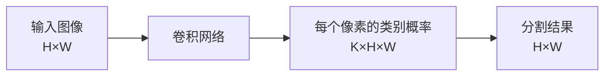
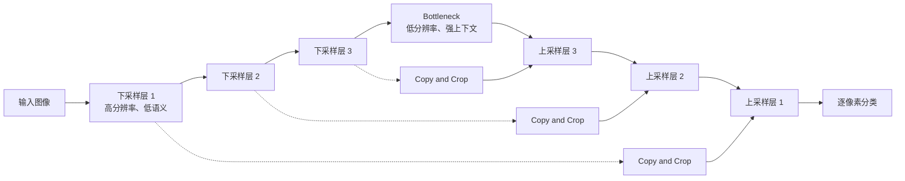
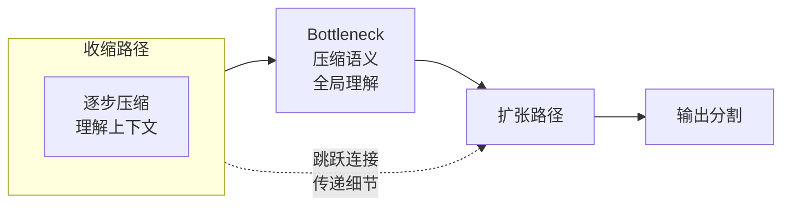
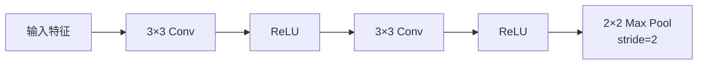
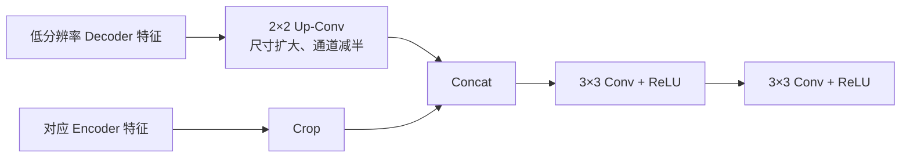
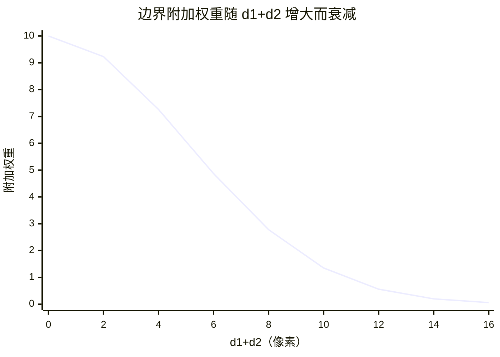
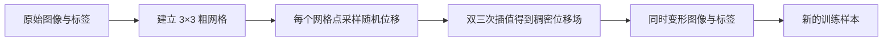

# U-Net: Convolutional Networks for Biomedical Image Segmentation

## 1. 论文信息

**论文标题**：U-Net: Convolutional Networks for Biomedical Image Segmentation

**作者**：已脱敏

**会议**：MICCAI 2015

这篇论文提出了 **U-Net**，核心目标不是设计一个通用的分割网络，而是解决：

> 在生物医学图像分割中，标注样本极其有限（通常只有几十张），如何设计一个网络结构和训练策略，能够在小样本条件下实现精确的像素级分割。

U-Net 在 2015 年 ISBI 细胞追踪挑战赛中获胜，并在电子显微镜堆栈的神经元结构分割任务中超越了当时的最佳方法。

## 2. U-Net 要解决什么问题

### 2.1 什么是图像分割

**Image Segmentation，图像分割**：给图像中的每一个像素分配类别。

例如一张显微镜细胞图像：

```text
输入：显微镜灰度图像

输出：
像素属于细胞     → 类别 1
像素属于背景     → 类别 0
```

它与图像分类的区别是：

| 任务 | 输入 | 输出 |
|------|------|------|
| 图像分类 | 一张图像 | 一个类别 |
| 图像分割 | 一张图像 | 与图像空间对应的像素分类图 |



### 2.2 图像分割的核心矛盾

分割任务面临一个根本性的矛盾：

- **需要上下文（Context）**：要知道一个像素属于什么物体，必须看它周围更大范围的信息
- **需要精确定位（Localization）**：要知道物体的精确边界在哪里，必须保留高分辨率空间信息

这两个需求是相互冲突的：
- 看更大的范围 → 需要更多的下采样 → 空间信息丢失更多 → 定位变差
- 保留更多细节 → 减少下采样 → 感受野变小 → 上下文理解不足

### 2.3 早期的 Sliding Window 方法

在 U-Net 之前，一种常见做法是 **Sliding Window，滑动窗口**：

1. 以某个像素为中心截取一个局部图像块
2. 将图像块输入分类网络
3. 预测中心像素的类别
4. 对所有像素重复执行


这种方法存在两个问题：

**问题一：速度极慢**
相邻像素的 Patch 大量重叠，网络会重复计算相同区域。一个 512×512 的图像如果逐像素滑动，需要运行 26 万次网络前向传播。

**问题二：上下文与定位的矛盾无法调和**
- Patch 较大：能看到更多上下文，但需要更多池化 → 空间定位变差
- Patch 较小：定位相对准确，但看不到足够的上下文 → 容易误判

U-Net 不再逐像素运行网络，而是一次输入一个较大的图像区域，直接输出整块区域的分割结果，从根本上绕过了滑动窗口的效率问题。

## 3. U-Net 的整体结构

U-Net 之所以叫 U-Net，是因为它的网络结构画出来像一个大写的字母 **U**——左侧向下走（收缩），底部横穿，右侧向上走（扩张）。

整体结构可以分成四个相互依赖的部分，它们共同完成了"看懂图像 → 精确分割每个像素"的任务：

```text
U-Net
├── Contracting Path（收缩路径）：不断下采样，看懂"图像里有什么"
├── Bottleneck（瓶颈层）：最底部，语义最丰富、分辨率最低
├── Expansive Path（扩张路径）：不断上采样，恢复"每个像素在哪"
└── Skip Connection（跳跃连接）：把收缩路径的细节直接传给扩张路径
```



图中的 **Copy and Crop** 就是跳跃连接的具体操作：把左侧高分辨率特征图复制一份，裁剪到与右侧上采样层相同尺寸，然后拼接在一起。

### 3.1 Contracting Path（收缩路径）

**Contracting Path 是什么？**

Contracting Path 是 U-Net 的左侧部分，从输入图像开始，逐层向下。它的名字叫"收缩路径"，因为每一层都在**压缩特征图的空间尺寸**。

**每一层做什么？**

每一层由两个操作组成：
1. **两个 3×3 卷积**：提取特征
2. **一个 2×2 最大池化（步长=2）**：缩小特征图

**尺寸变化规律：**

每次经过池化，特征图的**高度和宽度减半**；每次经过池化后的卷积，**通道数翻倍**。

> 池化负责"让高度和宽度减半"，卷积层负责"让通道数翻倍"。两者配合，构成每个下采样阶段的完整变化。

**池化（Max Pooling）是什么？**

池化是一种下采样操作，在特征图上滑动一个窗口，从每个窗口里**只保留最大的那个值**。

```text
原始 4×4 区域：                   池化后 2×2 区域：
 1  3  2  4                       3  4
 0  5  1  2        ──────>        6  9
 4  6  8  9
 7  2  0  1

每个 2×2 块取最大值，尺寸减半
```

**为什么用最大池化，而不是平均池化？**

最大池化保留的是**最强烈的激活信号**，它告诉网络："在这个局部区域里，最能代表某种特征的值是什么"。这个特性更有利于保持特征的**位置不变性**。

**卷积层是怎么让通道数翻倍的？**

卷积层的输出通道数**等于该层使用的卷积核的个数**。
- 输入是 64 个通道 → 用 128 个卷积核（每个卷积核深度=64）→ 输出 128 个通道
- `out_channels = in_channels × 2` 是设计者写死在代码里的

所以"通道数翻倍"是设计者的选择，不是卷积运算自动产生的。

**为什么要这样设计？**

| 变化 | 效果 |
|------|------|
| 尺寸减半 | 每个像素对应的原始图像范围扩大（感受野变大），能理解更大的上下文 |
| 通道翻倍 | 空间信息少了，用更多的"特征种类"来补偿表达能力 |

低层特征图大、通道少 → 负责局部细节；深层特征图小、通道多 → 负责全局语义。通道数随深度增加而增加，是深度网络的一个常见设计模式。

### 3.2 Expansive Path（扩张路径）

**Expansive Path 是什么？**

Expansive Path 是 U-Net 的右侧部分，从底部的瓶颈层开始，逐层向上。它的名字叫"扩张路径"，因为每一层都在**放大特征图的空间尺寸**。

**每一层做什么？**

每一层由两个操作组成：
1. **一个 2×2 转置卷积**：放大特征图的尺寸
2. **两个 3×3 卷积**：提取并精炼特征

**尺寸变化规律：**

每次上采样，特征图的**高度和宽度翻倍**，**通道数减半**。

> 转置卷积负责"让高度和宽度翻倍"，后面的 3×3 卷积负责"让通道数减半"。这和收缩路径正好相反。

**转置卷积（Transposed Convolution）是什么？**

转置卷积是一种通过卷积操作来**放大**特征图尺寸的方法。

**第一步：先理解普通卷积的输出尺寸**

普通卷积（stride=1, padding=0, kernel_size=2）：

```text
输入 2×2：        卷积核 2×2：
 1  2              a  b
 3  4              c  d

卷积运算：核在输入上滑动，每个位置做逐元素相乘后求和
输出：1×1（单个标量）
```

普通卷积把 4 个输入值"浓缩"成了 1 个输出值，**空间尺寸减小了**。

**第二步：转置卷积反过来做**

转置卷积的意图是：用 1 个输入值，生成 4 个输出值。

操作方式：

```text
输入 2×2：                转置卷积后输出 4×4：
 1  2                     1  0  2  0
 3  4        ──────>      0  0  0  0
                           3  0  4  0
                           0  0  0  0

Step 1：把每个输入值放在对应位置，周围插入零（stride=2）
Step 2：用卷积核处理这个稀疏矩阵，得到输出
```

U-Net 的 2×2 转置卷积，就是把 2×2 的特征图放大到 4×4。具体来说：每个输入像素在输出中占据 2×2 区域，输入像素之间的位置用零填充，然后用可学习的卷积核处理整个矩阵，把零填充的位置"填上"有意义的值。网络在训练中学习"怎么填"。

**转置卷积是普通卷积的"反向"吗？**

**不是数学上的逆运算，而是尺寸上的反向关系。**

| 对比 | 普通卷积 | 转置卷积 |
|------|---------|---------|
| 输入尺寸 | 4×4 | 2×2 |
| 输出尺寸 | 2×2 | 4×4 |
| 尺寸变化 | 缩小 | 放大 |
| 可学习参数 | 有（卷积核权重） | 有（卷积核权重） |

转置卷积也有可训练的参数，网络会自己学习如何最有效地放大特征图。

**为什么不用简单的插值（如双线性插值）做上采样？**

双线性插值用固定公式计算新像素值，不涉及训练。它的问题在于：**上采样时丢失的细节无法靠固定插值恢复**。

转置卷积的优势是**可学习的**。网络可以根据任务需要，学会如何最优地填充放大后的像素值，而不是用固定的插值公式。当然，转置卷积也有缺点——可能产生棋盘格伪影，但 U-Net 配合跳跃连接可以有效缓解这个问题。

**上采样后为什么通道数减半？**

和收缩路径的"通道翻倍"对称——特征图尺寸变大（细节增多），不再需要那么多"特征种类"来描述，所以逐层减半。

### 3.3 Bottleneck（瓶颈层）

**Bottleneck 是什么？**

Bottleneck 是连接收缩路径和扩张路径的**最底部**，也是整个网络中分辨率最低、语义最丰富的一层。

在 U-Net 中，瓶颈层是：
- 分辨率最低（32×32）
- 通道数最高（1024）
- 感受野最大（能看到整张图）

**它回答什么问题？**

"在理解了整张图像之后，综合判断每个区域属于什么。"

这时候，网络已经看过了整张图，对全局上下文有了完整理解。瓶颈层就是这个"理解"的压缩表达。

**U-Net 的 Bottleneck 与 ResNet 的 Bottleneck 不是一回事**

| 对比项 | U-Net 的 Bottleneck | ResNet 的 Bottleneck Block |
|--------|---------------------|---------------------------|
| 位置 | 收缩路径和扩张路径的连接处 | 网络内部的某个残差块 |
| 结构 | 两个 3×3 卷积 | 1×1 → 3×3 → 1×1 |
| 作用 | 作为**语义信息的"压缩包"**，在最低分辨率下提炼最强的全局上下文，供解码器恢复定位 | 在**不爆炸计算量**的前提下**堆叠更深网络**，通过降维让 3×3 卷积在低维空间高效提取特征，再升维恢复通道 |

U-Net 的 Bottleneck 是**一个位置**（U 形底部的"连接点"），ResNet 的 Bottleneck 是**一种结构**（通道压缩的残差块）。两者都叫 Bottleneck，但含义完全不同。

### 3.4 Skip Connection（跳跃连接）

**Skip Connection 是什么？**

Skip Connection 是**从收缩路径直接连接到扩张路径对应层的 shortcut**。

在 U-Net 中，每一层下采样层都有一条线连接到对应层的上采样层。

**它回答什么问题？**

"如何把下采样中丢失的空间细节补回来？"

**它怎么做？**

在 U-Net 中，跳跃连接的操作是 **Copy and Crop**：

1. **Copy**：复制收缩路径对应层的特征图
2. **Crop**：裁剪到与上采样层相同的尺寸
3. **Concatenate**：在通道维度上拼接

```text
上采样层特征图：64×64×512
跳跃连接特征图：64×64×512（从编码器复制）
        │
        ▼ 拼接（Concatenate）
64×64×1024（通道数翻倍）
        │
        ▼ 两个 3×3 卷积
64×64×512
```

**为什么需要跳跃连接？**

编码器在层层下采样中丢失了空间细节（边缘、纹理、精确位置）。解码器仅靠上采样无法恢复这些丢失的信息。

跳跃连接的作用是：

> 把编码器保留的高分辨率细节直接传递给解码器，让解码器在做像素级分类时既有"语义上下文"（来自深层），又有"精确位置"（来自浅层）。

**为什么是拼接（Concatenate）而不是相加（Add）？**

拼接不改变每个信息源的内容，只把它们并列在一起，让网络自己决定怎么用；相加会把信息混合，可能互相干扰。U-Net 需要同时保留高分辨率细节和高层语义，拼接更合适。

### 3.5 四个部分如何协同工作



**一句话串起整个流程：**

> **收缩路径用池化不断压缩空间尺寸、扩大感受野，看懂"图像里有什么"；瓶颈层把全局理解压缩成最浓缩的特征；扩张路径用转置卷积逐步恢复分辨率，同时通过跳跃连接把收缩路径保留的细节补回来，最终逐像素决定"每个点属于什么"。**

## 4. Contracting Path：怎样获得上下文

### 4.1 一个下采样阶段的结构

原始 U-Net 的每个下采样阶段包含：

```text
3×3 Conv
→ ReLU
→ 3×3 Conv
→ ReLU
→ 2×2 Max Pooling，stride=2
```



### 4.2 ReLU

**ReLU，Rectified Linear Unit，线性整流函数**：

$$
\operatorname{ReLU}(x)=\max(0,x)
$$

它将负数变成 0，正数保持不变，为网络引入非线性。

```mermaid
xychart-beta
    title "ReLU 函数"
    x-axis "x" [-3, -2, -1, 0, 1, 2, 3]
    y-axis "ReLU(x)" 0 --> 3
    line [0, 0, 0, 0, 1, 2, 3]
```

对应代码：

```python
x = convolution(x)
x = torch.relu(x)
```

### 4.3 Max Pooling

**Max Pooling，最大池化**：在每个局部窗口中保留最大值。

原论文使用：

```python
pool = nn.MaxPool2d(
    kernel_size=2,
    stride=2,
)
```

空间尺寸减半：

```text
568×568
   ↓
284×284
```

池化的主要作用不是简单删除像素，而是：

- 降低特征图空间尺寸
- 使后续卷积覆盖更大的输入区域
- 逐步聚合更大范围的上下文信息

### 4.4 为什么下采样后通道加倍

原论文每下采样一次，特征通道数加倍：

```text
64 → 128 → 256 → 512 → 1024
```

空间尺寸减少后，每个特征位置需要描述更复杂、更大范围的结构，因此使用更多通道承载不同类型的特征。

原始 U-Net 左侧尺寸变化如下：

| 阶段 | 两次卷积后尺寸 | 通道数 | 池化后尺寸 |
|------|---------------|--------|-----------|
| 输入 | 572×572 | 1 | — |
| Level 1 | 568×568 | 64 | 284×284 |
| Level 2 | 280×280 | 128 | 140×140 |
| Level 3 | 136×136 | 256 | 68×68 |
| Level 4 | 64×64 | 512 | 32×32 |
| Bottleneck | 28×28 | 1024 | — |

每一级都使用两个不带 Padding 的 3×3 卷积，然后使用 2×2 最大池化。

## 5. Expansive Path 与 Skip Connection

### 5.1 一个上采样阶段的结构

原始 U-Net 的一个上采样阶段包含：

```text
上采样
→ 2×2 Up-Convolution
→ 通道减半
→ 与 Encoder 特征拼接
→ 3×3 Conv + ReLU
→ 3×3 Conv + ReLU
```



### 5.2 Up-Convolution（**上卷积，也叫转置卷积**）

**Up-Convolution，转置卷积**：原论文中用于扩大特征图空间尺寸并减少通道数。

例如：

```text
输入：1024×28×28
   ↓ 2×2 Up-Convolution
输出：512×56×56
```

### 5.3 Skip Connection 为什么重要

下采样路径中的深层特征拥有较强的上下文信息，但空间尺寸较小。

浅层特征拥有：
- 边缘
- 局部形状
- 精确空间位置

如果 Decoder 只依赖最低分辨率特征逐步上采样，可能知道"这里存在一个细胞"，但无法准确恢复细胞边界。

因此 U-Net 将同一尺度的 Encoder 特征直接传给 Decoder：

```text
Decoder 上采样特征
    +
Encoder 高分辨率特征
    ↓
在通道维度拼接
    ↓
同时获得上下文与定位信息
```

### 5.4 U-Net 的 Skip 与 ResNet 不同

U-Net 与 ResNet 都有跨层连接，但作用和合并方式不同。

| 对比项 | U-Net | ResNet |
|--------|-------|--------|
| 主要目的 | 恢复空间定位信息 | 改善深层网络优化 |
| 连接位置 | Encoder 到 Decoder | Residual Block 内部 |
| 合并方式 | Concat | Add |
| 输出通道 | 拼接后增加 | 相加后不变 |
| 两侧分辨率 | 先调整到相同尺寸 | 原本相同或投影对齐 |

U-Net 使用通道拼接：

```text
Encoder：512×56×56
Decoder：512×56×56
             ↓ Concat
输出：1024×56×56
```

而不是相加：

```text
512×56×56 + 512×56×56
```

### 5.5 一个完整上采样阶段的尺寸

以 U-Net 底部的第一次上采样为例：

```text
Bottleneck：
1024×28×28
       ↓ Up-Conv
512×56×56

Encoder 对应特征：
512×64×64
       ↓ Crop
512×56×56

Concat：
1024×56×56
       ↓ 两次 Valid 3×3 Conv
512×52×52
```

Crop 的原因来自原始 U-Net 使用不带 Padding 的卷积。

## 6. 为什么需要 Crop：原始 U-Net 的尺寸变化

### 6.1 Valid Convolution

原始 U-Net 使用 **Unpadded Convolution，无填充卷积**，也称为 Valid Convolution。

卷积输出尺寸为：

$$
H_{\text{out}} = \left\lfloor \frac{H_{\text{in}}+2P-K}{S} \right\rfloor + 1
$$

当：
- 卷积核 K=3
- Padding P=0
- Stride S=1

有：

$$
H_{\text{out}}=H_{\text{in}}-2
$$

因此连续两次 3×3 卷积：

```text
572 → 570 → 568
```

每个阶段的高度和宽度都会减少 4。

### 6.2 为什么 Encoder 特征要裁剪

Encoder 和 Decoder 对应层虽然处于相近尺度，但 Encoder 特征经过了更多 Valid Convolution，尺寸与上采样结果不完全一致。

例如：

```text
Encoder 特征：64×64
Decoder 上采样：56×56
```

不能直接拼接。

因此需要从 Encoder 特征中心裁剪：

```text
64×64
  ↓ Center Crop
56×56
```

然后才能沿通道维度拼接。

对应代码：

```python
def center_crop(encoder_feature, target_feature):
    diff_h = encoder_feature.size(2) - target_feature.size(2)
    diff_w = encoder_feature.size(3) - target_feature.size(3)

    return encoder_feature[
        :,
        :,
        diff_h // 2: diff_h // 2 + target_feature.size(2),
        diff_w // 2: diff_w // 2 + target_feature.size(3),
    ]
```

### 6.3 输入为什么是 572，输出却是 388

原始 U-Net：

```text
输入图像：572×572
输出分割：388×388
```

原因不是网络忘记恢复分辨率，而是每个 Valid Convolution 都会丢失边缘位置。

论文只输出那些拥有完整输入上下文的像素，因此输出区域小于输入区域。

### 6.4 Overlap-Tile Strategy

为了分割任意大的图像，论文使用 **Overlap-Tile Strategy，重叠分块策略**：

1. 从大图中提取一个输入区域
2. 网络只预测中间的有效区域
3. 相邻输入区域彼此重叠
4. 将不同输出区域无缝拼接

图像边界缺少上下文时，通过镜像外推补充输入像素。


这样可以处理大于 GPU 显存容量的图像，同时保证输出像素拥有完整上下文。

## 7. 训练目标：逐像素分类与边界加权

### 7.1 Pixel-Wise Softmax

U-Net 最后一层使用 1×1 卷积，将每个像素位置的 64 维特征映射为 K 个类别分数。

```text
输入特征：64×H×W
       ↓ 1×1 Conv
类别 Logits：K×H×W
```

**Logit**：Softmax 前的原始类别分数。

对于像素位置 x，类别 k 的概率是：

$$
p_k(x) = \frac{\exp(a_k(x))}{\sum_{k'=1}^{K}\exp(a_{k'}(x))}
$$

其中：
- $a_k(x)$：位置 x 对类别 k 的 Logit
- $p_k(x)$：位置 x 属于类别 k 的概率
- $K$：类别总数

### 7.2 Pixel-Wise Cross Entropy

对每个像素计算交叉熵：

$$
E = -\sum_{x\in\Omega} w(x)\log p_{\ell(x)}(x)
$$

其中：
- $\Omega$：所有需要分类的像素位置
- $\ell(x)$：像素 x 的真实类别
- $p_{\ell(x)}(x)$：网络给真实类别分配的概率
- $w(x)$：像素 x 的 Loss 权重

普通交叉熵相当于所有像素的 $w(x)=1$。

代码形式：

```python
pixel_loss = F.cross_entropy(
    logits,
    target,
    reduction="none",
)

loss = (pixel_loss * weight_map).mean()
```

### 7.3 为什么需要 Weight Map

**Weight Map，权重图**：为不同像素设置不同的 Loss 权重。

论文使用它解决两个问题：
1. 平衡不同类别的像素数量
2. 强化相邻细胞之间狭窄背景边界的监督

如果两个相邻细胞被预测成一个连通区域，普通像素准确率可能仍然很高，但实例分离结果会明显错误。

因此，两个细胞之间的少量边界像素需要更高权重。论文 Figure 3 展示了原图、实例标注、分割标签和边界权重图。

### 7.4 边界权重怎么算

论文定义：

$$
w(x) = w_c(x) + w_0 \exp\left(-\frac{(d_1(x)+d_2(x))^2}{2\sigma^2}\right)
$$

其中：
- $w_c(x)$：用于平衡类别频率的基础权重
- $d_1(x)$：像素到最近细胞边界的距离
- $d_2(x)$：像素到第二近细胞边界的距离
- $w_0$：边界额外权重的最大强度
- $\sigma$：控制高权重区域的宽度

论文设置：
$$
w_0=10,\qquad \sigma\approx5
$$

### 7.5 为什么使用 $d_1+d_2$

如果一个像素位于两个细胞之间：
- 到第一个细胞边界很近：$d_1$ 小
- 到第二个细胞边界也很近：$d_2$ 小

因此 $d_1+d_2$ 很小，指数项接近 1，额外权重接近 $w_0$。

如果一个像素只靠近一个细胞，而离第二个细胞很远，$d_1+d_2$ 会变大，额外权重迅速下降。

令 $d=d_1+d_2$，边界附加权重是：

$$
w_{\text{border}}(d) = 10\exp\left(-\frac{d^2}{50}\right)
$$



例如：
- $d_1=1$，$d_2=1$ → $d_1+d_2=2$ → 附加权重约为 9.23
- $d_1=5$，$d_2=5$ → $d_1+d_2=10$ → 附加权重约为 1.35

因此网络会特别关注两个目标之间的狭窄分离区域。

## 8. 少样本训练：Elastic Deformation

### 8.1 为什么普通增强不够

生物医学图像中的组织和细胞经常出现：
- 旋转
- 平移
- 局部形变
- 灰度变化

训练图像数量有限时，网络无法自然见到足够多的形态变化。

论文因此使用大量数据增强，尤其强调 **Elastic Deformation，弹性形变**。

### 8.2 什么是 Elastic Deformation

弹性形变不是将整张图像统一旋转或缩放，而是让图像不同区域产生平滑、连续的局部位移。

论文的过程是：

1. 在一个粗糙的 3×3 网格上生成随机位移
2. 位移从标准差为 10 像素的高斯分布采样
3. 使用双三次插值，将稀疏位移扩展为逐像素位移场
4. 使用同一个位移场同时变换图像和标签



关键是图像和标签必须使用完全相同的几何变换，否则像素标注会错位。

### 8.3 权重初始化

论文使用标准差为 $\sqrt{2/N}$ 的高斯分布初始化卷积权重。

其中 $N$ 是一个神经元的输入连接数量。

例如前一层有 64 个通道，卷积核为 3×3：

$$
N=3\times3\times64=576
$$

因此初始化标准差为：

$$
\sqrt{\frac{2}{576}} \approx0.0589
$$

这属于后续常说的 **He Initialization**，适用于 ReLU 网络。

对应代码：

```python
nn.init.kaiming_normal_(
    conv.weight,
    mode="fan_in",
    nonlinearity="relu",
)
```

### 8.4 训练设置只需记住的结论

原论文使用：
- 随机梯度下降
- Batch Size 为 1
- Momentum 为 0.99
- 大尺寸输入 Tile
- 下采样路径末端使用 Dropout
- 强弹性形变增强

Batch Size 设为 1，主要是为了在有限 GPU 显存中使用尽可能大的输入区域，而不是说明 U-Net 必须使用 Batch Size 1。

### 8.5 实验结论

论文在三个生物医学分割任务上进行了验证。

EM 神经结构分割任务只有 30 张完整标注的 512×512 训练图像。U-Net 获得约：
- Warping Error：0.000353
- Rand Error：0.0382

在 ISBI 细胞跟踪挑战中：

| 数据集 | U-Net IOU | 当时第二名 |
|--------|-----------|-----------|
| PhC-U373 | 0.9203 | 约 0.83 |
| DIC-HeLa | 0.7756 | 约 0.46 |

实验的主要意义不是某个具体指标，而是证明：

> 对称的 Encoder-Decoder、跨层特征拼接和强数据增强，可以在少量标注图像条件下同时获得上下文理解与精确定位。

## 9. 从结构到代码

下面是与原论文结构对应的 PyTorch 简化实现，不是原作者 Caffe 代码的逐行翻译。

### 9.1 两次 Valid Convolution

```python
import torch
import torch.nn as nn
import torch.nn.functional as F


class DoubleConv(nn.Module):
    def __init__(self, in_channels, out_channels):
        super().__init__()

        self.layers = nn.Sequential(
            nn.Conv2d(
                in_channels,
                out_channels,
                kernel_size=3,
                padding=0,
            ),
            nn.ReLU(inplace=True),

            nn.Conv2d(
                out_channels,
                out_channels,
                kernel_size=3,
                padding=0,
            ),
            nn.ReLU(inplace=True),
        )

    def forward(self, x):
        return self.layers(x)
```

这里使用 `padding=0`，因此对应原论文的 Valid Convolution，每次卷积使高度和宽度减少 2。

### 9.2 下采样模块

```python
class Down(nn.Module):
    def __init__(self, in_channels, out_channels):
        super().__init__()

        self.conv = DoubleConv(
            in_channels,
            out_channels,
        )

        self.pool = nn.MaxPool2d(
            kernel_size=2,
            stride=2,
        )

    def forward(self, x):
        feature = self.conv(x)
        downsampled = self.pool(feature)

        return feature, downsampled
```

这里返回两个结果：
- `feature` → 保存给 Skip Connection
- `downsampled` → 继续进入下一层 Encoder

### 9.3 中心裁剪

```python
def center_crop(encoder_feature, decoder_feature):
    target_h = decoder_feature.size(2)
    target_w = decoder_feature.size(3)

    diff_h = encoder_feature.size(2) - target_h
    diff_w = encoder_feature.size(3) - target_w

    return encoder_feature[
        :,
        :,
        diff_h // 2: diff_h // 2 + target_h,
        diff_w // 2: diff_w // 2 + target_w,
    ]
```

### 9.4 上采样模块

```python
class Up(nn.Module):
    def __init__(self, in_channels, skip_channels, out_channels):
        super().__init__()

        self.up = nn.ConvTranspose2d(
            in_channels,
            out_channels,
            kernel_size=2,
            stride=2,
        )

        self.conv = DoubleConv(
            out_channels + skip_channels,
            out_channels,
        )

    def forward(self, x, skip):
        x = self.up(x)

        skip = center_crop(
            encoder_feature=skip,
            decoder_feature=x,
        )

        x = torch.cat(
            [skip, x],
            dim=1,
        )

        return self.conv(x)
```

`torch.cat(..., dim=1)` 表示在通道维度拼接：
- Encoder 特征通道 + Decoder 特征通道

### 9.5 完整 U-Net

```python
class UNetOriginal(nn.Module):
    def __init__(self, in_channels=1, num_classes=2):
        super().__init__()

        self.down1 = Down(1, 64)
        self.down2 = Down(64, 128)
        self.down3 = Down(128, 256)
        self.down4 = Down(256, 512)

        self.bottleneck = DoubleConv(
            512,
            1024,
        )

        self.up4 = Up(
            in_channels=1024,
            skip_channels=512,
            out_channels=512,
        )

        self.up3 = Up(
            in_channels=512,
            skip_channels=256,
            out_channels=256,
        )

        self.up2 = Up(
            in_channels=256,
            skip_channels=128,
            out_channels=128,
        )

        self.up1 = Up(
            in_channels=128,
            skip_channels=64,
            out_channels=64,
        )

        self.output = nn.Conv2d(
            in_channels=64,
            out_channels=num_classes,
            kernel_size=1,
        )

    def forward(self, x):
        skip1, x = self.down1(x)
        skip2, x = self.down2(x)
        skip3, x = self.down3(x)
        skip4, x = self.down4(x)

        x = self.bottleneck(x)

        x = self.up4(x, skip4)
        x = self.up3(x, skip3)
        x = self.up2(x, skip2)
        x = self.up1(x, skip1)

        logits = self.output(x)

        return logits
```

前向过程对应：


### 9.6 代码中的概念对应关系

| 论文概念 | 代码 |
|----------|------|
| 两次 3×3 卷积 | `DoubleConv` |
| Contracting Path | `Down` |
| Max Pooling | `nn.MaxPool2d` |
| Expansive Path | `Up` |
| Up-Convolution | `nn.ConvTranspose2d` |
| Copy and Crop | `center_crop()` |
| Skip Connection | `torch.cat()` |
| Pixel-Wise Classification | 最后的 `nn.Conv2d(kernel_size=1)` |
| Pixel-Wise Softmax | 由 `cross_entropy` 内部完成 |
| Weighted Loss | `pixel_loss * weight_map` |

## 10. 一句话总结

**U-Net 通过下采样路径理解大范围上下文，通过上采样路径恢复空间分辨率，并将 Encoder 的高分辨率特征裁剪后拼接到 Decoder，使网络能够在少量训练图像条件下同时完成语义判断和精确像素定位。**