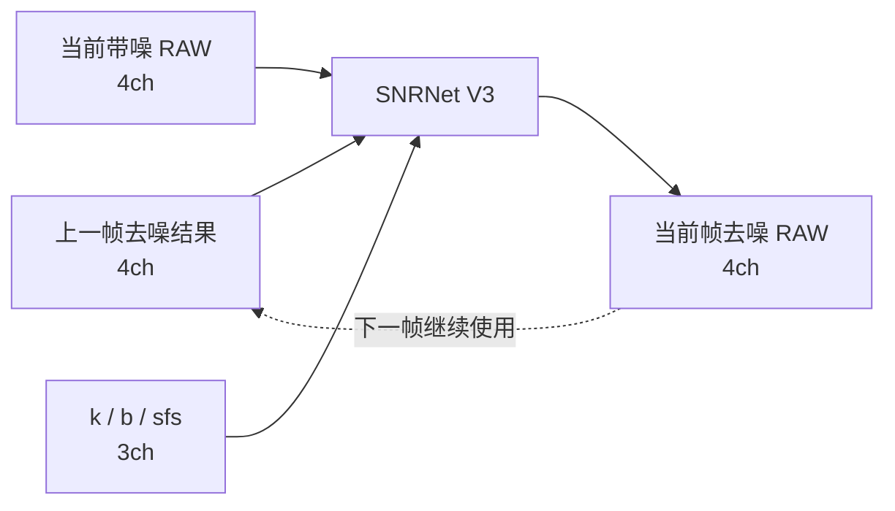
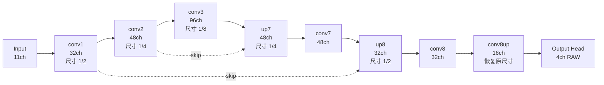

# SNRNet 网络结构理解
## 1 网络结构


### 1.1 先理解网络要解决什么问题

V3 SNRNet 每次只输入一帧数据，但它并不是一个纯粹的单帧降噪网络。
输入共有 11 个通道：

|输入|通道|含义|
|---|--:|---|
|`prev_out`|4|上一帧网络输出|
|`cur`|4|当前帧带噪 RAW|
|`k`|1|当前噪声模型参数|
|`b`|1|当前噪声模型参数|
|`sfs`|1|控制降噪程度的辅助信息|

前 8 个通道是真正的图像信息：
- 4 个通道为历史结果；
- 4 个通道为当前 RAW。

后 3 个通道则告诉网络：
> **当前帧的噪声强度，以及应当以何种力度进行去噪处理。**

因此，网络实际学习的并不是简单的映射：
> “当前帧 → 干净帧”

而是：
> **结合上一帧的输出去噪结果、当前帧观测以及噪声条件，生成当前帧新的去噪结果。**

输出仍然是 4 通道 Packed RAW。

该输出又会作为下一帧的 `prev_out`：



所以在后面分析网络结构时，要始终记住：

> 虽然网络内部只执行了一次 `forward()`，但实际运行时它处于一个连续的时序循环中。

### 1.2 先不看细节，只看信息流动

当前真正参与 forward 的主干可以先简化为：



这张图中，最重要的是先抓住一个规律：

在前半段，
```text
11 → 32 → 48 → 96
```
空间尺寸越来越小。

在后半段，
```text
96 → 48 → 32 → 16 → 4
```
空间尺寸又重新变大。

因此本质上它是一个 **Encoder–Decoder**：
- Encoder：将原始图像逐步压缩成更抽象的特征；
- Decoder：再将这些特征恢复为最终的 RAW。

### 1.3 `conv1`、`conv2`、`conv3`：为什么一路缩小

Encoder 共有三层：

```text
Input
  ↓
conv1
  ↓
conv2
  ↓
conv3
```

空间尺寸变化：

```text
H × W
↓
H/2 × W/2
↓
H/4 × W/4
↓
H/8 × W/8
```

以 128×128 的网络输入为例：
```text
128 × 128
→ 64 × 64
→ 32 × 32
→ 16 × 16
```

每一次缩小都由一个 `2×2, stride=2` 的卷积完成。

> `stride=2` 表示卷积核每次向前移动两个位置，因此输出的长宽各减半。

与此同时通道数增加：

```text
11 → 32 → 48 → 96
```

可以这样理解：
> 空间位置减少，但每个位置通过更多通道来记录不同类型的信息。

浅层 feature 更接近原始像素。
深层 feature 更像是网络整理后的特征描述。

因此到 `conv3` 时，虽然空间尺寸只剩 16×16，但已有 96 个通道，网络已经将当前帧、历史帧与噪声参数组合成了更丰富的内部表示。

`conv3` 是整个网络的 **bottleneck**：
> 空间尺寸最小、通道数最多，是 Encoder 和 Decoder 之间的连接位置。

> `conv1 / conv2 / conv3` 的第一层都是 `2×2, stride=2` 卷积。`stride=2` 负责将空间尺寸减半，而 `out_channels` 决定输出多少张新的 feature map，因此同时完成通道扩展：`11→32→48→96`。每一个输出 channel 都有一套独立的卷积权重，会读取上一层的输入 channel 并生成一种新的内部特征表示。因此，通道增加实际上是网络主动学习更多种类的特征，而不是下采样自动产生的。

### 1.4 为什么网络大量使用 `2×3` 卷积

Encoder 中除了下采样卷积，还大量出现：
```text
2×3 Conv
```

这里最容易让人困惑的是代码中的 `F.pad()`。

实际过程可以这样理解：

```text
原 feature
   ↓
先在边界补一圈需要的数据
   ↓
再做 2×3 卷积
   ↓
输出尺寸和输入保持一致
```

代码中的：

```text
pad = [1, 1, 1, 0]
```

只是为了适配这个非对称的 `2×3 kernel`。

水平方向 kernel 宽度为 3，因此左右各补 1。

垂直方向 kernel 高度为 2，所以只需要额外补 1 行，代码选择补在上方。

```
          上：补1
            ↓

       +-------------+
       |  padding    |
       +-------------+
左补1  |             |  右补1
       | 原 feature  |
       |             |
       +-------------+

          下：不补
```

最终目的其实很简单：**让 `2×3` 卷积完成之后，feature map 尺寸不变。**

这里不应把 Padding 当作一个独立的重要算法设计。

真正值得理解的是：**这一层希望做局部空间特征提取，但不想改变 feature map 的 H/W。**

`replicate` 表示边界外使用最近的边缘像素，而不是补 0。

这样边缘不会人为出现一圈黑值。

> 大量使用 `2×3` 卷积。卷积核大小本身是网络设计选择：`2×3` 相比 `3×3` 少约 1/3 的空间卷积计算量，同时又比 `2×2` 多观察一列局部信息，因此可以看成是局部建模能力与计算成本之间的折中。源码没有说明为什么必须选择 `2×3`，所以这里不过度推断。

> 这些 `2×3` 卷积大多不是用于下采样，而是继续提取特征，因此希望输入和输出的 H/W 保持一致。由于 `2×3` 卷积核会让高度减少 1、宽度减少 2，所以卷积前使用 `F.pad(x, [1,1,1,0])`：左右各补 1，上方补 1，下方不补。这样卷积后 H/W 恢复原尺寸。真正负责下采样的是前面的 `2×2, stride=2` 卷积。

### 1.5 为什么不用普通卷积，而用 Group Conv

如果 96 通道的 feature 直接做普通卷积，每个输出通道都要读取全部 96 个输入通道。

计算量会比较重。

一种常见做法是分组卷积。

例如 96 通道：

```text
96 channels
↓
分成 6 组
↓
每组 16 channels
```

然后每组单独做空间卷积。

可以把它想象成：

```text
Group 1：16 ch → 独立卷积
Group 2：16 ch → 独立卷积
Group 3：16 ch → 独立卷积
...
Group 6：16 ch → 独立卷积
```

这样做最大的好处是：

> 一次卷积不再同时处理所有 channel，计算量明显降低。

整个网络基本维持了一个规律：

> **每组大约 16 个通道。**

比如：
- 32 channel → 2 groups；
- 48 channel → 3 groups；
- 96 channel → 6 groups。

因此 `chn_per_group=16` 这个参数很好理解：

> 每个 Group 处理 16 个 feature channel。

### 1.6 但 Group Conv 有一个明显缺陷

假设 32 channel 被分成两组：
```text
Group A：0 ~ 15
Group B：16 ~ 31
```

Group Conv 做完以后：
- A 只能看到 A；
- B 只能看到 B。

也就是说，两组之间没有信息交流。

这会带来一个问题：

> 虽然计算量省下来了，但 feature channel 被人为隔开了。

因此 SNR Net 紧跟着增加了一层：

```text
1×1 Conv
```

实际结构是：


这是理解 SNR Net 最重要的结构之一。

### 1.7 `1×1 Conv` 到底在做什么

第一次看到 `1×1` 卷积时，很自然会产生疑问：

> kernel 只有一个点，它到底能提取什么？

它确实几乎不处理空间关系。

它主要处理的是 **Channel 关系**。

假设某个位置有 32 个 feature：

```text
当前位置：
[f1, f2, f3, ... f32]
```

`1×1 Conv` 会把这 32 个数重新组合成新的 32 个数。

所以它做的是：
> **在同一个空间位置上，对不同 channel 之间的信息进行混合。**

因此这两类卷积实际上是分工合作：
```text
Group Conv
    ↓
负责空间邻域

1×1 Conv
    ↓
负责通道融合
```

这也是为什么 SNR Net 即使使用 Group Conv 来节省计算，也不会长期让不同 Group 完全隔离。

---
#### 以 `Conv2d(32, 32, kernel_size=1)` 为例

输入为 `32 × H × W`，输出为 `32 × H × W`。

##### 第一步：先生成 Output Ch0
为了生成 `Output Ch0`，网络准备一个 Filter：

```text
Filter 0 = 32 × 1 × 1
```

这个 Filter 内部其实有 **32 个 `1×1` kernel**：

```text
Input Ch0  ── 1×1 kernel w0,0 ──> x0 · w0,0
Input Ch1  ── 1×1 kernel w0,1 ──> x1 · w0,1
Input Ch2  ── 1×1 kernel w0,2 ──> x2 · w0,2
...
Input Ch31 ── 1×1 kernel w0,31 ─> x31 · w0,31
                                      │
                                      ▼
                                  全部相加
                                      │
                                    + b0
                                      │
                                      ▼
                              Output Ch0 的一个值
```

也就是说：

```text
32个输入值
↓
分别乘32个不同权重
↓
全部相加
↓
得到1个输出值
```

这个计算在每一个 `(h,w)` 位置重复，就得到完整的：

```text
Output Ch0
H × W
```

##### 第二步：生成 Output Ch1
换一套全新的 Filter：

```text
Filter 1 = 32 × 1 × 1
```

仍然读取**全部 32 个 Input Channel**：

```text
Input Ch0  ── w1,0  ─┐
Input Ch1  ── w1,1   │
Input Ch2  ── w1,2   │
...                  ├── 相加 + b1 → Output Ch1
Input Ch31 ── w1,31 ─┘
```

注意：

> `Output Ch1` 使用的 32 个权重，与 `Output Ch0` 的 32 个权重完全不是同一套。

##### 第三步：一直做到 Output Ch31
因此整层实际上是：

```text
                    Filter 0（32个1×1 kernel）
32 Input Channels ────────────────────────> Output Ch0

                    Filter 1（32个1×1 kernel）
32 Input Channels ────────────────────────> Output Ch1

                    Filter 2（32个1×1 kernel）
32 Input Channels ────────────────────────> Output Ch2

                           ...

                    Filter 31（32个1×1 kernel）
32 Input Channels ────────────────────────> Output Ch31
```

所以：

```text
1个 Filter
= 32个 1×1 kernel
= 生成1个 Output Channel

32个 Filter
= 32 × 32 个 1×1 kernel
= 生成32个 Output Channel
```

##### 反过来看某一个 Input Channel
这个角度也很重要。

例如 `Input Ch0` **并不是只被一个 kernel 处理一次**。

实际上它需要参与所有 32 个输出通道的计算：

```text
                 w0,0 ──> Output Ch0
                 w1,0 ──> Output Ch1
Input Ch0 ────── w2,0 ──> Output Ch2
                    ...
                 w31,0 ─> Output Ch31
```

### 1.8 `conv3` 为什么比前两层更复杂

`conv1` 和 `conv2`：

```text
下采样
↓
Group Conv + 1×1 Conv
```

而 `conv3`：

```text
下采样
↓
Group Conv + 1×1
↓
Group Conv + 1×1
```

它比前面多做了一轮特征提取。

原因并不难理解：

此时空间尺寸已经缩到：

```text
16 × 16
```

在这个尺寸上做更多计算，相比在 128×128 上要便宜得多。

因此网络选择：

> 在最深层、空间最小的位置，用更多通道和更深层的计算来整理特征。

所以 `conv3` 同时是：
- 最深的 Encoder feature；
- 参数最集中的位置；
- Decoder 开始恢复图像之前的核心信息节点。

### 1.9 Decoder 为什么不能直接把 `conv3` 放大回去
现在假设已经得到：
```text
conv3
96 × 16 × 16
```

最直接的做法似乎是：
```text
16 → 32 → 64 → 128
```

一路放大回去。

问题在于，经过三次下采样后，一些非常精细的局部信息已经难以保留。

例如：
- 很细的衣服纹理；
- 字符的边缘；
- 很小的结构变化。

因此网络将 Encoder 中较浅层的 feature 保留下来，在 Decoder 恢复到对应分辨率时再取回来。

这就是 **Skip Connection**。

### 1.10 第一条 Skip：`conv2 → up7`

`conv3`：

```text
96 × 16 × 16
```

先上采样：

```text
→ 48 × 32 × 32
```

与此同时，之前保存的 `conv2`：

```text
48 × 32 × 32
```

也被送过来。

两者尺寸完全一致后直接相加：

```text
深层 feature
      +
conv2 浅层 feature
      ↓
     up7
```

可以这样理解：

> 深层路径带回“网络理解后的上下文”，浅层路径补充“更精细的空间信息”。

### 1.11 为什么 Skip 前还要加一个 `1×1 Conv`

Skip 并不是直接：

```text
conv2 + deconv
```

而是：

```text
1×1(conv2) + deconv
```

这个 `1×1 Conv` 的主要目的不是改变空间尺寸。

它仍然是在做 Channel Projection：

> 将 Encoder 的 feature 调整到更适合与 Decoder feature 相加的表示空间。

即使这里输入输出都是 48 channel，网络也可以通过这一层重新组合 48 个 channel。

所以 Skip 并不是简单地把旧 feature 原样复制回来。

而是：

> 先经过一次可学习的通道变换，再与 Decoder 融合。

### 1.12 为什么使用 Add，而不是常见 U-Net 的 Concat

经典 U-Net 通常使用：

```text
Decoder 48ch
+
Skip 48ch
↓ concat
96ch
```

而当前 V3 使用：

```text
Decoder 48ch
+
Skip 48ch
↓ add
48ch
```

Add 的优势非常直接：

> **不会让 channel 翻倍。**

这可以减少：

- feature memory；
- 后续卷积计算；
- 移动端运行成本。

因此这里体现了一个明显的轻量化取舍：

> 保留 Skip 带来的浅层信息，同时尽量避免因 Skip 而让网络变宽。

### 1.13 `up7 → conv7 → up8`：两次上采样和 Skip Fusion

Decoder 并不是简单地连续放大，而是**每恢复一级分辨率，就融合一次 Encoder 中相同分辨率的 feature**。


#### 第一步：`up7`，恢复到 `32×32`

此时有两路输入：
```text
conv3：96 × 16 × 16
conv2：48 × 32 × 32
```

深层路径先做上采样：
```text
conv3
96 × 16 × 16
    ↓
ConvTranspose2d
96 → 48
kernel=2×2, stride=2
    ↓
ReLU
    ↓
48 × 32 × 32
```

Skip 路径对 `conv2` 做 `1×1 Conv`：
```text
conv2
48 × 32 × 32
    ↓
1×1 Conv
    ↓
48 × 32 × 32
```

然后两个 Tensor **在对应位置、对应 Channel 上逐元素相加**：

```text
深层上采样结果       conv2 Skip
48 × 32 × 32      48 × 32 × 32
       │                 │
       └────────┬────────┘
                ↓
               Add
                ↓
      up7：48 × 32 × 32
```

即：

```text
up7[c,h,w]
=
deconv[c,h,w] + skip[c,h,w]
```

这里的 `1×1 Conv` 先重新混合 `conv2` 的 48 个 Channel，再做相加。

#### 第二步：`conv7`，处理第一次融合后的 Feature

`up7`：

```text
48 × 32 × 32
```

进入：

```text
2×3 Group Conv
groups=3
      ↓
1×1 Conv
```

因为：

```text
48 channels / 3 groups
= 每组 16 channels
```

所以：

```text
48 × 32 × 32
      ↓
2×3 Group Conv
每组16ch，提取空间特征
      ↓
48 × 32 × 32
      ↓
1×1 Conv
重新混合全部48ch
      ↓
conv7：48 × 32 × 32
```

这一层不改变 H/W，也不改变 Channel 数，主要处理第一次 Skip Fusion 得到的 feature。

#### 第三步：`up8`，恢复到 `64×64`


现在再次出现两路：

```text
conv7：48 × 32 × 32
conv1 ：32 × 64 × 64
```

深层路径：

```text
conv7
48 × 32 × 32
    ↓
ConvTranspose2d
48 → 32
kernel=2×2, stride=2
    ↓
ReLU
    ↓
32 × 64 × 64
```

Skip 路径：

```text
conv1
32 × 64 × 64
    ↓
1×1 Conv
32 → 32
    ↓
32 × 64 × 64
```

再逐元素相加：

```text
深层上采样结果       conv1 Skip
32 × 64 × 64      32 × 64 × 64
       │                 │
       └────────┬────────┘
                ↓
               Add
                ↓
      up8：32 × 64 × 64
```

---

因此这一段完整的数据流是：

```text
conv3  96×16×16
   │
   │ ConvTranspose
   ▼
48×32×32  ←── 1×1 Conv ←── conv2 48×32×32
   │
   Add
   ▼
up7 48×32×32
   │
   │ 2×3 Group Conv + 1×1 Conv
   ▼
conv7 48×32×32
   │
   │ ConvTranspose
   ▼
32×64×64  ←── 1×1 Conv ←── conv1 32×64×64
   │
   Add
   ▼
up8 32×64×64
```

所以 Decoder 这一段的核心逻辑是：

> **上采样恢复空间尺寸 → 引入同尺度的 Encoder Feature → 逐元素融合 → 继续处理 → 再上采样并再次融合。**

### 1.14 `conv8` 值得单独看的原因

第二次 Skip 之后：
```text
up8
32 × 64 × 64
```

接下来进入 `conv8`。

这里使用的是：

```text
3×3 Group Conv
↓
1×1 Conv
↓
ReLU
```

它与前面大量 `2×3` 卷积不同，开始使用完整的 `3×3` 邻域。

同时此时 feature map 已经恢复到：

```text
64 × 64
```

也就是说，它处于**比较靠近最终输出、分辨率已经较高的位置**。

因此可以把 `conv8` 理解为：

> Decoder 基本恢复完成之后，再做一次较完整的局部空间整理。

到这里，网络已经从：

```text
16 × 16 的深层表示
```

恢复成：

```text
64 × 64 的高分辨率 feature
```

下一步就要真正恢复回 128×128 RAW。

### 1.15 最后两步：`conv8up` 和 Output Head

`conv8up`：

```text
32 × 64 × 64
↓
ConvTranspose
↓
16 × 128 × 128
```

这是最后一次空间上采样。

现在空间已回到输入尺寸，但还有 16 个内部 feature channel。

这些 channel 还不是 Bayer RAW。

因此最后需要一个真正的输出层：

```text
16 feature channels
↓
2×3 Conv
↓
4 RAW channels
```

源码将这一层命名为：

```text
refine_layers
```

但从理解网络的角度，更推荐直接称之为：

> **Output Head（输出头）**

因为它做的事情非常具体：

> 将 Decoder 最终得到的 16 个内部 feature，转换成真正需要输出的 4 个 Packed Bayer channel。

所以最终完整路径就是：

```text
32 × 64 × 64
↓
conv8up
↓
16 × 128 × 128
↓
Output Head
↓
4 × 128 × 128
```

最后这一层没有 ReLU，因为它不是在判断“某种 feature 是否激活”，而是直接输出实际 RAW 数值。

### 1.16 到这里再回头看整个网络

现在可以把整个结构重新压缩为下面这条信息流：

```text
11ch 输入
│
│  当前帧 + 历史帧 + 噪声条件
▼
conv1
│
│  第一次降采样，提取浅层特征
▼
conv2
│
│  更大范围的特征
▼
conv3
│
│  最深层上下文 / bottleneck
▼
up7  ← conv2
│
│  恢复空间 + 浅层信息
▼
conv7
│
│  融合整理
▼
up8  ← conv1
│
│  再恢复空间 + 更浅层细节
▼
conv8
│
│  高分辨率局部整理
▼
conv8up
│
│  恢复原始空间尺寸
▼
Output Head
│
▼
4ch 去噪 RAW
```

如果只记住一句话：

> **Encoder 负责理解，Skip 负责找回细节，Decoder 负责重建，Output Head 负责把内部 feature 重新变回 RAW。**