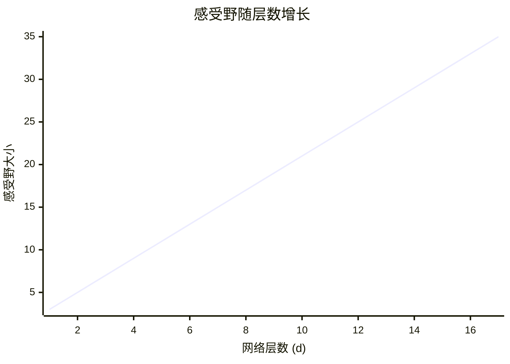
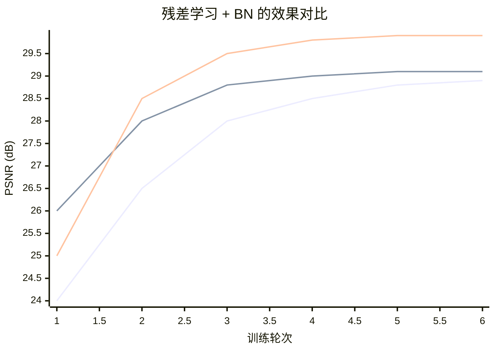

## 1. 论文要解决什么问题

在 DnCNN 出现之前，图像去噪主要面临三个痛点：
### 1.1 痛点一：传统方法依赖人工设计的先验
传统去噪方法（如 BM3D）基于图像的自相似性——在一张图像里找相似的图像块，然后加权平均去噪。这种方法虽然有效，但本质上是在“手工设计规则”，通用性有限，不同场景需要不同的参数配置。

### 1.2 痛点二：深度学习方法需要为每个噪声水平单独训练一个模型
当时的主流深度学习去噪方法是**判别式模型学习**——直接训练一个网络，输入带噪图，输出干净图。

> **术语解释**：**判别式模型学习（Discriminative Model Learning）**，简单说就是“让网络学习从输入到输出的直接映射”。在去噪任务里，就是让网络看大量（带噪图，干净图）配对数据，自己学会“怎么去掉噪声”。这和生成式模型（学习数据分布）相对，判别式模型只关心决策边界/映射关系，不关心数据本身是怎么生成的。

但这种方法的一个明显问题是：训练时用了什么噪声水平（如 σ=25），模型就只会处理 σ=25 的噪声。如果推理时噪声水平不同，效果就会大幅下降。这意味着每换一个噪声水平，就需要重新训练一个模型，实用性很受限制。

### 1.3 痛点三：网络做深了，训练反而不稳定
直觉上，网络越深应该效果越好。但直接堆叠卷积层会出现梯度消失/爆炸的问题——深层网络的梯度在反向传播时逐层衰减，浅层参数几乎得不到有效更新，训练难以收敛。

### 1.4 DnCNN 的目标
这篇论文的目标是**用一套方案同时解决以上三个问题**：
1. 用深度学习自动学习去噪映射，替代手工设计的规则
2. 用一个模型覆盖多个噪声水平（称为“盲去噪”，即 Blind Denoising）
3. 借助残差学习和批量归一化，把网络推到 17 层深度，且训练稳定

### 1.5 论文具体做了什么
这篇论文提出的 DnCNN 有四个核心设计：

#### 1.5.1 **① 把去噪当作"判别式学习"问题，而非"先验建模"问题**
传统方法（BM3D等）是先设计一个关于"干净图像长什么样"的数学模型（先验），然后在推理时求解这个模型。DnCNN 的做法更直接：输入带噪图，输出干净图，中间所有映射关系都让网络从数据里学。网络不需要显式地知道"图像先验"是什么——它自己学会了。
> **术语解释**：**先验（Prior）** 在图像去噪中指"我们预先假设干净图像有什么性质"。比如"自然图像是局部平滑的"就是一种先验。传统方法需要人工设计这些先验，然后通过数学优化来求解。DnCNN 不依赖人工设计的先验，而是让网络从大量数据中自己学会"什么样的图像是干净的"。

#### 1.5.2 **② 预测"噪声"而非"干净图"（残差学习）**
网络学习目标不是 `x`（干净图），而是 `v = y - x`（噪声）。推理时，干净图 = 输入带噪图 - 网络预测的噪声。
这样做的原因是：噪声的分布（零均值、类高斯）比图像内容简单得多，网络更容易学。残差学习也给了梯度一条"捷径"，让深层网络的训练更稳定。

#### 1.5.3 **③ 引入批量归一化（BN）**
BN 把每层输入标准化到均值为 0、方差为 1，解决了深层网络训练不稳定的问题，允许使用更大的学习率。论文发现 BN 和残差学习是"黄金搭档"——两者组合的效果远大于各自单独使用的效果之和。

#### 1.5.4 **④ 一个模型覆盖多个噪声水平（盲去噪）**
传统判别式方法要为每个噪声水平（σ=15、25、50 等）单独训练一个模型。DnCNN 用一个模型处理未知噪声水平。
为什么能做到？因为残差学习的本质是"预测退化"——无论是 σ=15 还是 σ=50 的噪声，网络学的都是"输入到噪声的映射"（即退化过程），学的是噪声的通用模式，而不是针对某个具体的 σ 值。
> **术语解释**：**盲去噪（Blind Denoising）** 指模型在推理时不知道噪声水平 σ，但仍然能有效去噪。DnCNN 能够实现盲去噪，是因为它学的是"噪声的统计特征"而不是"某个特定 σ 下的噪声值"——模型通过输入图像的局部统计信息来推断当前的噪声强度，并自适应地去噪。

### 前置知识补充
#### 优化器是什么？和“学习率”是什么关系？
优化器是决定“怎么更新参数”的算法，学习率是优化器里的一个参数。
用下山比喻来理解：
- **优化器（Optimizer）**：决定“往哪个方向走、走路的策略是什么”。比如 SGD 是“每次都朝最陡的方向迈一步”，Adam 是“根据历史经验自适应地调整步伐大小”。
- **学习率（Learning Rate）**：决定“每一步迈多大”。它是优化器的一个超参数，0.01 表示每步迈 1 厘米，0.1 表示每步迈 10 厘米。
- **关系**：优化器负责计算“方向”（梯度），学习率负责控制“步幅”。两者配合才能有效更新参数。

| 组件 | 作用 | 类比 |
|------|------|------|
| 梯度（Gradient） | 告诉你“往哪个方向走最陡” | 方向感 |
| 优化器（Optimizer） | 决定“用什么样的策略来走” | 走路策略 |
| 学习率（Learning Rate） | 决定“每一步走多远” | 步幅 |

DnCNN 论文中使用了 SGD 优化器（带动量），学习率从 `1e-1` 开始，逐步衰减到 `1e-4`。

#### 判别式模型学习 vs 传统模型
传统去噪方法（如 BM3D）是“先设计一个数学模型，再求解”。判别式模型学习是“直接让网络看大量数据，自己学会映射”。前者需要人工设计规则，后者让数据驱动学习。

## 2. 核心方法

### 2.1 网络结构（三层设计 + 17层深度）

【Fig. 1】

#### 2.1.1 整体架构

DnCNN 的网络结构借鉴了 VGG 网络的设计思路，但做了针对去噪任务的特殊调整。

> **术语解释**：**VGG 网络** 是 2014 年由牛津大学提出的经典 CNN 架构，核心特点是**全部使用 3×3 小卷积核堆叠**，通过加深网络来扩大感受野，而不是使用大卷积核（如 7×7）。这种设计在减少参数量的同时保持了很好的表达能力。DnCNN 沿用了“全部 3×3 卷积”的思路，但去掉了 VGG 中的池化层。

整个网络由 17 个卷积层堆叠而成，去掉所有池化层，分为三种不同的层类型：

```text
输入：带噪图 (灰度图，1通道)
    ↓
┌──────────────────────────────────────────────────────┐
│ 第1层：Conv + ReLU                                   │
│   conv(3×3, 64个卷积核, stride=1, padding=1) + ReLU  │
│   输出：64通道特征图                                  │
└──────────────────────────────────────────────────────┘
    ↓
┌──────────────────────────────────────────────────────┐
│ 第2-16层：Conv + BN + ReLU（重复15次）                │
│   conv(3×3, 64个卷积核) → BN → ReLU                  │
│   输出：64通道特征图（尺寸不变）                       │
└──────────────────────────────────────────────────────┘
    ↓
┌──────────────────────────────────────────────────────┐
│ 第17层：Conv（无BN，无ReLU）                          │
│   conv(3×3, 1个卷积核) → 输出噪声图                   │
└──────────────────────────────────────────────────────┘
    ↓
输出：预测噪声 (1通道，和输入尺寸相同)
```

#### 2.1.2 三种层类型详解

##### **第 1 层：Conv + ReLU**
> **术语解释**：在深度学习中，“一层”通常指一个**可训练的操作**（如卷积）加上其后的**激活函数**。所以“Conv + ReLU”整体算作网络的一层，其中 Conv 负责提取特征，ReLU 负责引入非线性。两者结合才构成一个完整的层。

这一层接收原始带噪图（1 通道），用 64 个 3×3 卷积核提取基础特征，然后经过 ReLU 激活函数。

为什么不用 Batch Normalization？输入层的统计数据（均值和方差）主要由原始图像的亮度分布决定，而不是由网络的中间特征决定，BN 在这里的作用有限，且可能改变输入数据的原始分布。论文中第一层不加 BN 是一种常见设计选择。

##### **第 2-16 层：Conv + BN + ReLU**
这是 DnCNN 的主体部分，重复 15 次。
> **术语解释**：**BN（Batch Normalization，批量归一化）** 是一种让网络训练更稳定的技术。它把每一层的输出**标准化**（不是映射到 0-1，而是让它们的均值为 0、方差为 1）。这样做的效果是：不管前一层的数据怎么变化，进入当前层的信号始终分布在一个稳定的范围内，训练就不会因为信号过大或过小而崩溃。

BN 的具体操作是对一个 mini-batch 的所有样本，对每个通道分别计算均值和方差，然后用公式 `(x - mean) / sqrt(var + eps)` 把数据标准化到均值为 0、方差为 1 的分布。在训练过程中，BN 还会额外学习两个参数（缩放因子 γ 和平移因子 β），让网络可以“撤销”标准化带来的影响。这两个参数是可训练的，所以网络不会失去表达能力。

> **术语解释**：**ReLU 函数** 定义为 `ReLU(x) = max(0, x)`，即正数保持不变，负数变成 0。这个函数有两个特点：计算简单（只需比较大小）；在正区间导数为 1，梯度不会衰减。

中间层的顺序是 **Conv → BN → ReLU**，而不是 Conv → ReLU → BN。BN 在激活函数之前作用，能让进入 ReLU 的信号分布更稳定——ReLU 对负数直接输出 0，如果某一层输出的大部分值都是负数，那么经过 ReLU 后大部分神经元都会“死亡”（永远输出 0），再也学不到东西。BN 先把信号分布拉回正负均衡的状态，再送入 ReLU，能有效避免这种“神经元死亡”现象。

##### **最后一层：Conv**
最后一层只有纯卷积，没有 BN 也没有 ReLU。因为网络要输出噪声图，噪声值可以是正数也可以是负数，ReLU 会把负值截断为 0，无法输出负噪声，所以不能用。BN 也不需要用，因为最后一层不需要为后续层提供稳定的分布。

#### 2.1.3 感受野计算

> **术语解释**：**感受野（Receptive Field）** 是输出特征图上的一个像素，对应输入图像上的多大区域。在 DnCNN 中，由于去掉了池化层，感受野完全由卷积层数决定。每经过一层 3×3 卷积，感受野在当前值基础上扩展 2（因为卷积核宽度为 3，步长为 1，感受野的扩张量等于 kernel_size - 1）。第 1 层感受野是 3×3，第 2 层变成 5×5，第 3 层变成 7×7……经过 `d` 层后，感受野为 `(2d+1)×(2d+1)`。层数越深，感受野越大，能利用的上下文信息越多。

DnCNN 深度设置为 17 层，对应感受野：
```text
第1层 (d=1)： 3×3
第2层 (d=2)： 5×5
...
第17层 (d=17)： (2×17+1) = 35×35
```



#### 2.1.4 为什么去掉池化层？

> **术语解释**：**池化层（Pooling Layer）** 是 CNN 中常见的一种下采样操作。以最大池化（Max Pooling）为例，它在图像上滑动一个窗口（如 2×2），每次取窗口内的最大值作为输出，从而将图像尺寸缩小一半（如 128×128 → 64×64）。池化层的作用是扩大感受野、减少计算量，但同时会**丢失精确的位置信息**。

在图像分类任务中，位置信息不重要（猫在图片中间还是左上角，分类结果都是“猫”）。但在去噪任务中，**每个像素的精确位置都需要恢复**。如果用池化层缩小了图像，后续上采样恢复时位置会有偏差，导致边缘模糊。因此 DnCNN 去掉所有池化层，用纯卷积堆叠来扩大感受野，同时保留每个像素的精确位置。

#### 2.1.5 为什么选择 17 层？

论文以噪声水平 σ=25 为基准，分析当时主流去噪方法的“有效 patch 大小”，作为 DnCNN 深度的参考依据：

| 方法         | 有效 patch 大小 |
| ---------- | ----------- |
| EPLL       | 36×36       |
| BM3D       | 49×49       |
| MLP        | 47×47       |
| CSF / TNRD | 61×61       |

> **术语解释**：**有效 patch 大小（Effective Patch Size）** 指一种去噪方法在做推理时实际用到的像素范围。比如 BM3D 在一个 25×25 的搜索窗口内寻找相似块并做两次迭代，最终相当于用到了 49×49 范围的信息。这个范围越大，方法能利用的上下文越多，但计算量也越大。

DnCNN 选择感受野 35×35（对应 17 层），接近 EPLL 的 36×36。这个深度在性能和计算效率之间取得了较好的平衡——感受野足够大以利用上下文信息，又不会因为网络过深导致训练困难。

对于其他任务（如超分辨率、JPEG 去块），论文采用了更大的感受野，对应 20 层深度。

### 2.2 残差学习（为什么预测噪声）

#### 2.2.1 两种学习策略的对比

在 DnCNN 之前，判别式去噪模型（如 MLP、CSF）的目标是学习一个映射函数 $F(\mathbf{y}) = \mathbf{x}$，即**直接从带噪图预测干净图**。

DnCNN 采用了不同的策略：**让网络预测噪声本身**，而不是直接预测干净图。

```text
传统做法（原始映射学习）：
带噪图 y → [网络] → 预测干净图 F(y) ≈ x
目标：让输出直接逼近 x

DnCNN 的做法（残差学习）：
带噪图 y → [网络] → 预测噪声 R(y) ≈ v
最终输出：x = y - R(y)（带噪图减去预测噪声）
```

> **术语解释**：**残差（Residual）** 在这里指“带噪图和干净图之间的差”，即噪声本身。数学上，$\mathbf{v} = \mathbf{y} - \mathbf{x}$。残差学习就是让网络学习这个差值，而不是学习完整的目标图像。这个思路最早来自 ResNet（残差网络），DnCNN 将其引入到图像去噪任务中。

#### 2.2.2 为什么预测噪声比预测干净图更容易？

**核心原因：带噪图比噪声图更接近“恒等映射”**

残差学习的基本原理来自 ResNet：**当一个映射更接近恒等映射时，学习残差比学习原始映射更容易**。

在去噪任务中：
- 带噪图 $\mathbf{y} = \mathbf{x} + \mathbf{v}$，其中噪声 $\mathbf{v}$ 通常较小（σ=25 时，噪声只占信号的一小部分）
- 因此，**带噪图 $\mathbf{y}$ 比噪声图 $\mathbf{v}$ 更接近干净图 $\mathbf{x}$**

| 映射 | 目标 | 与恒等映射的接近程度 | 学习难度 |
|------|------|---------------------|---------|
| 原始映射 $F(\mathbf{y}) = \mathbf{x}$ | 预测干净图 | 非常接近（输入就是“带噪干净图”） | 相对容易 |
| 残差映射 $R(\mathbf{y}) = \mathbf{v}$ | 预测噪声 | 完全不接近（输入是图，目标是噪声） | **更容易** |

论文原文指出：噪声水平越低，$\mathbf{y}$ 越接近 $\mathbf{x}$，$F(\mathbf{y})$ 越接近恒等映射，残差映射 $R(\mathbf{y})$ 的学习难度就越低。因此**残差学习策略特别适合图像去噪任务**。

**为什么残差映射反而更容易？** 学习噪声的“通用模式”比学习图像的“复杂内容”要简单得多——噪声近似服从零均值高斯分布，而图像内容千变万化（人脸、建筑、纹理等）。网络只需要学会“提取噪声”，而不需要学会“生成图像”。

#### 2.2.3 隐层自动分离噪声和信号

论文中有一个关键观察：
> ==With the residual learning strategy, DnCNN implicitly removes the latent clean image in the hidden layers.==

**这句话是什么意思？**

==采用残差学习后，DnCNN 的中间隐层**自动学会从输入中“减去”干净图像的内容，只让噪声信息继续向后传递**。输入信号会在逐层卷积+ReLU的过程中被逐步“剥离”，最终在最后一层只剩下噪声。==

这种机制与传统的迭代去噪方法（如 EPLL、WNNM）类似——多步迭代逐步去除噪声。但 DnCNN 的不同之处在于：**整个“逐步剥离”的过程是在端到端训练中自动学到的**，而不是人工设计的迭代规则。

##### 为什么隐层学会了减去干净图，只让噪声向后传递？
###### 1. 先理解背景：网络看到的“目标”

DnCNN 的**损失函数**是：
$L=∥网络输出−真实噪声∥$
整个网络唯一的任务是：**输出一个纯噪声图 R(y)**。网络的每一层、每一个卷积核，都在为这个目标服务。

###### 2. 为什么网络会把“干净图像”丢掉？（核心原理）

输入是 y = 干净图 + 噪声。输入信号里混杂了两种成分：
- **干净图像内容**（如边缘、纹理、人脸）——这是**干扰项**
- **噪声**（随机高斯分布）——这是**目标**

**推理逻辑链条**：
1. **收敛压力**：如果某一层的特征图里保留了大量“干净图像”的信息（比如边缘、纹理），这些信息在后续层中会妨碍网络输出准确的噪声值，因为这些信息与噪声目标没有关系，属于干扰项。
2. **梯度惩罚**：反向传播计算损失时，只要网络输出中混有图像内容导致噪声预测不准，梯度就会调整权重，**抑制**那些提取“图像内容”的神经元。
3. **逐层剥离**：当网络足够深（17层）时，浅层可能还会提取边缘等局部特征，但随着层数加深，梯度会反复施压，迫使深层神经元**只对随机的像素波动（噪声）敏感，而对有结构的纹理（内容）不再响应**。最终，图像内容的痕迹在深层被“洗掉”了，只剩下噪声特征。

#### 2.2.4 数学形式

DnCNN 学习的是一个残差映射 $R(\mathbf{y}) \approx \mathbf{v}$，其中 $\mathbf{v} = \mathbf{y} - \mathbf{x}$ 是噪声。

训练时使用的损失函数是**均方误差（MSE）**：
$$
\mathcal{L}(\Theta) = \frac{1}{2N} \sum_{i=1}^{N} \left\| R(\mathbf{y}_i; \Theta) - (\mathbf{y}_i - \mathbf{x}_i) \right\|_F^2
$$

其中 $\{(\mathbf{y}_i, \mathbf{x}_i)\}_{i=1}^{N}$ 是 $N$ 对（带噪图，干净图）训练数据，$\Theta$ 是网络中所有可训练的参数。

推理时：
```text
带噪图 y 输入网络 → 网络预测噪声 R(y) → 干净图 = y - R(y)
```

### 2.3 批量归一化（为什么 BN + 残差是黄金搭档）

#### 2.3.1 什么是内部协变量偏移（Internal Covariate Shift）？

> **术语解释**：**内部协变量偏移**是指在训练过程中，由于前面层的参数不断更新，导致当前层的输入分布持续变化的现象。这会使训练变慢，因为每一层都需要不断适应新的输入分布。

具体来说：
- 第 1 层更新参数 → 第 2 层的输入分布改变 → 第 2 层需要适应新分布
- 第 2 层更新参数 → 第 3 层的输入分布改变 → 第 3 层需要适应新分布
- ... 这种连锁反应在深层网络中会被放大

**后果**：
- 需要**更小的学习率**（防止震荡）
- 需要**更精细的参数初始化**
- 训练速度**大幅降低**

#### 2.3.2 BN 是什么？
> **术语解释**：**批量归一化（Batch Normalization）** 是一种让网络训练更稳定的技术。它对每一层的输出做标准化处理——让它们的**均值为 0、方差为 1**，而不是映射到 0-1。

BN 的具体操作：
1. 对当前 mini-batch，计算每个通道的均值 $\mu$ 和方差 $\sigma^2$
2. 标准化：$\hat{x} = (x - \mu) / \sqrt{\sigma^2 + \epsilon}$
3. 缩放和平移：$y = \gamma \times \hat{x} + \beta$（$\gamma$ 和 $\beta$ 是可学习的参数）

**BN 的位置**：在 DnCNN 中，BN 被插入在卷积层和 ReLU 激活函数之间（`Conv → BN → ReLU`）。这个顺序让 BN 在激活函数之前作用，能让进入 ReLU 的信号分布更稳定——ReLU 对负数直接输出 0，如果某一层输出的大部分值都是负数，经过 ReLU 后大部分神经元都会“死亡”（永远输出 0），再也学不到东西。BN 先把信号分布拉回正负均衡的状态，再送入 ReLU，能有效避免这种“神经元死亡”现象。

#### 2.3.3 为什么 BN 允许使用更大的学习率？
BN 让每层输入的分布稳定在 0 均值、1 方差的范围内，使得损失函数曲面更平滑。因此可以用更大的步长（学习率）而不担心跳过最优点。

| 学习率 | 无 BN | 有 BN |
|--------|-------|-------|
| 1e-4 | ✅ 收敛慢 | ✅ 收敛慢 |
| 1e-3 | ⚠️ 可能震荡 | ✅ 收敛良好 |
| 1e-2 | ❌ 梯度爆炸 | ✅ 收敛较快 |

#### 2.3.4 为什么残差学习和 BN 是“黄金搭档”？

论文通过实验证明，**残差学习和 BN 可以互相促进，组合后效果远大于各自单独使用**。

##### **一方面，残差学习受益于 BN**：

没有 BN 时，残差学习虽然收敛快，但最终性能不如有 BN 的版本。BN 解决了内部协变量偏移问题，让残差学习能稳定地收敛到更优的解。

##### **另一方面，BN 受益于残差学习**：

论文指出，残差学习让 DnCNN 的隐层**自动去掉了干净图像**，使得每层输入的分布更接近**高斯分布**，各通道之间的相关性更低，与图像内容的依赖更小。这为 BN 的标准化操作创造了更有利的条件。



论文的发现：
- 无残差无BN：收敛最慢，效果最差
- 有残差无BN：收敛快，但最终效果不佳（因为内部协变量偏移限制了性能）
- 有残差有BN：收敛快且效果好（达到最优性能）

**两者的互补关系**：

| | 残差学习解决的问题 | BN 解决的问题 |
|---|---|---|
| **问题** | 梯度消失（深层网络训练困难） | 内部协变量偏移（输入分布不稳定） |
| **机制** | 提供梯度直达通道 | 标准化每层输入分布 |
| **效果** | 让浅层能收到梯度信号 | 让梯度更稳定，可用更大学习率 |
| **互补性** | 让网络能建得深 | 让深层网络能稳定训练 |

**总结**：残差学习让网络可以建到 17 层而不梯度消失，BN 让这 17 层网络的训练稳定且快速。两者结合，缺一个另一个的效果都会大打折扣。

### 2.4 盲去噪（一个模型覆盖多种噪声水平）

#### 2.4.1 传统方法的局限性

在 DnCNN 之前，判别式去噪方法（MLP、CSF、TNRD）都有一个共同的限制：**为每个噪声水平单独训练一个模型**。

```text
传统做法（多个模型）：
σ=15 的训练数据 → 模型_A → 只能处理 σ=15
σ=25 的训练数据 → 模型_B → 只能处理 σ=25
σ=50 的训练数据 → 模型_C → 只能处理 σ=50

推理时：先估计噪声水平 → 选择对应的模型 → 去噪
```

> **术语解释**：**盲去噪（Blind Denoising）** 指模型在推理时**不需要知道噪声水平 σ**，就能对任意强度的噪声进行有效去噪。DnCNN 是第一个在深度学习去噪中实现真正盲去噪的方法。

> **术语解释**：**噪声水平（Noise Level）** 用高斯噪声的标准差 σ 来衡量。σ=15 是轻度噪声，σ=25 是中度噪声，σ=50 是重度噪声。数值越大，噪声越强。

这种方法的局限性很明显：
1. **推理时需要先估计噪声水平**——估计不准，去噪效果就受影响。即估算误差会直接影响去噪效果
2. **无法处理未知噪声分布**——如果噪声不是高斯分布（如 JPEG 压缩噪声、超分辨率的退化噪声），这些方法完全无法适用
3. **需要多个模型**：部署时臃肿，不同噪声水平需要不同的权重文件

这三个都是 DnCNN 出现前，在图像去噪领域具有代表性的**判别式学习方法**。与基于人工设计规则的传统方法（如 BM3D）不同，它们都试图从大量数据中学习一个从“带噪图”到“干净图”的映射。

##### 多层感知器（MLP）

> MLP（Multi-Layer Perceptron，多层感知器）是最早被用于图像去噪的深度学习方法之一。它由多个全连接层堆叠而成，直接从图像块学习映射关系。其核心思想是将图像分成小块，把每个小块的所有像素拉成一个长向量，输入 MLP，让网络直接学习从“带噪图像块”到“干净图像块”的映射。

> 然而，MLP 本质上是“全连接”的，参数量巨大且忽略了像素间的空间关系。随着网络层数加深，训练极为困难，因此去噪效果很快遇到了瓶颈。

##### 级联收缩场（CSF）

> CSF（Cascade of Shrinkage Fields，级联收缩场）是 Schmidt 等人在 2014 年提出的一种方法。它试图将传统的优化算法（如半二次分裂）与随机场模型统一到一个可以端到端学习的框架中。

> 通俗地说，CSF 将传统去噪算法的**多次迭代优化步骤**，展开成**一个固定层数的前馈网络**。每一层对应一次迭代，其核心操作是“收缩”（Shrinkage），类似于传统算法中的软阈值去噪。

> CSF 的优势是比传统方法快得多，且效果优于早期 MLP。但其局限也很明显：仍然依赖人工设计的先验模型，并且**需要为每个噪声水平训练一个专用模型**。

##### 可训练非线性反应扩散（TNRD）

> TNRD（Trainable Nonlinear Reaction Diffusion，可训练非线性反应扩散）是 Chen 等人在 2015 年提出的方法。它从物理和数学中的**反应-扩散方程**获得灵感，将图像去噪建模为一个动态演化过程，并用一个可训练的 CNN 来模拟这个演化过程。

> TNRD 可以被理解为一个“展开的”迭代算法。它将传统优化算法的每一次迭代“展开”成网络的一层，而网络的所有参数（包括滤波器、非线性函数等）都通过数据学习得到。这使得 TNRD 在不同任务间具有很好的泛化能力，可同时用于去噪、超分辨率、JPEG 去块等多种任务。

> TNRD 的局限在于其网络深度有限，通常只有 5 个阶段（10 层卷积），且在高噪声下容易产生伪影。而 DnCNN 在其基础上做了三点关键改进：
> 1.  用更简单的 ReLU 替代了复杂的影响函数，让网络更容易训练。
> 2.  将网络加深到 17 层，极大提升了模型对复杂图像特征的表达能力。
> 3.  引入批量归一化（BN），有效加速了训练并提升了去噪性能。

#### 2.4.2 DnCNN 为什么能实现盲去噪？

**核心原因：残差学习学的是“从输入中去除干净图像”这个通用操作，而不是针对某个特定 σ 的噪声模式。**

前面的章节也有提到，残差学习让 DnCNN 的隐层**自动学会从输入中“剥离”干净图像的内容，只让噪声信息继续向后传递**。这个“剥离干净图像”的操作是**与噪声强度无关的**——无论 σ=15 还是 σ=50，网络做的都是同一件事：去掉图像内容，保留噪声。

**数学基础**：

在 DnCNN 与 TNRD 的联系中，论文给出了残差估计的数学形式。单阶段 TNRD 的残差估计可以写成：

$$
\mathbf{v}_1 = \alpha \lambda \sum_{k=1}^{K} \left( \bar{\mathbf{f}}_k \ast \phi_k(\mathbf{f}_k \ast \mathbf{y}) \right)
$$

其中 $\mathbf{v}_1$ 是估计的残差（噪声），$\mathbf{y}$ 是带噪输入。这个式子本质上就是一个**两层 CNN**。

> **术语解释**：**残差估计（Residual Estimation）** 指网络从带噪输入中提取噪声的过程。公式中的 $\mathbf{f}_k \ast \mathbf{y}$ 是卷积操作提取特征，$\phi_k$ 是非线性函数，$\bar{\mathbf{f}}_k \ast$ 是反卷积重构噪声。整个过程就是“提取特征 → 非线性变换 → 重构噪声”。

DnCNN 在此基础上做了三个关键的泛化，使其能处理任意噪声水平：

| 泛化方向 | TNRD（单阶段） | DnCNN（17层） | 为什么能支持盲去噪 |
|---------|---------------|--------------|------------------|
| **深度** | 2层（一层提取特征，一层重构） | 17层 | 更深的网络能学习更复杂的噪声模式，泛化能力更强 |
| **非线性** | 固定的影响函数 $\phi_k$ | ReLU（可学习） | ReLU 让网络能适应不同强度的噪声输入 |
| **归一化** | 无 | BN | BN 让不同 σ 的输入分布稳定在同一范围 |

**残差学习的“去内容”特性**：
从数学上看，残差估计 $\mathbf{v}_1 = \mathbf{y} - \mathbf{x}_1$ 本质上就是在计算“输入信号中被去掉的部分”。无论输入噪声的强度如何，网络的核心任务始终是：**识别哪些是“内容”，哪些是“噪声”，然后把“内容”去掉**。这个“识别和去除”的能力一旦学到，就可以应用于不同强度的噪声。

#### 2.4.3 盲去噪的训练策略

DnCNN 的训练数据覆盖一个**宽范围的噪声水平**：

```text
训练数据：
σ ∈ [0, 55] 的带噪图（从干净图加不同强度的噪声）
     ↓
同一个 DnCNN 模型
     ↓
推理时：任意 σ ∈ [0, 55] 的带噪图直接输入 → 无需估计噪声水平
```

训练时，每个 mini-batch 的噪声水平 σ 是**随机采样**的：

```python
# 一种常见做法的伪代码
def generate_training_batch(clean_images):
    # 随机采样噪声水平
    sigma = random.uniform(0, 55)
    # 生成带噪图
    noisy = clean_images + sigma * torch.randn_like(clean_images)
    return noisy, clean_images
```

这样模型在训练过程中看到了各种噪声强度的数据，自然学会了适应不同的 σ。

#### 2.4.4 扩展到多种任务

DnCNN 不仅能处理不同强度的**高斯噪声**，还能处理其他类型的图像退化：

| 任务 | 退化类型 | 训练数据 | 推理 |
|------|---------|---------|------|
| **高斯去噪** | 加性高斯白噪声 | 不同 σ 的带噪图 | 输入带噪图 → 输出去噪图 |
| **超分辨率（SISR）** | 下采样 + 上采样退化 | 低分辨率图 → 高分辨率图 | 输入低分辨率图 → 输出高分辨率图 |
| **JPEG去块** | JPEG 压缩伪影 | 不同质量因子的 JPEG 图 | 输入 JPEG 图 → 输出无块效应图 |

> **术语解释**：**SISR（Single Image Super-Resolution，单图像超分辨率）** 是从一张低分辨率图像重建高分辨率图像的任务。**JPEG去块（Deblocking）** 是去除 JPEG 压缩产生的 8×8 块状伪影的任务。在 DnCNN 中，这些任务都被统一为“从退化图像中恢复干净图像”的框架，残差学习同样适用（残差 = 退化造成的失真）。

**为什么能扩展到多任务？**

因为残差学习的本质是“预测输入中的退化成分”——无论是高斯噪声、下采样模糊还是 JPEG 块效应，都可以统一看作“干净图像”到“退化图像”的退化过程。DnCNN 学的是“逆向退化”——从退化图像中提取退化成分，然后恢复干净图像。

## 3. 实验结果（关键数据）

### 3.1 实验设置

#### 训练数据

| 模型                  | 训练数据                  | 噪声水平范围                 | patch 数量                |
| ------------------- | --------------------- | ---------------------- | ----------------------- |
| **DnCNN-S**（固定噪声水平） | 400 张 180×180 图像      | σ=15, 25, 50（分别训练三个模型） | 128×1,600 个 40×40 patch |
| **DnCNN-B**（盲去噪）    | 400 张 180×180 图像      | σ∈[0, 55]（随机采样）        | 128×3,000 个 50×50 patch |
| **CDnCNN-B**（彩色盲去噪） | 432 张彩色图像（BSD 剩余）     | σ∈[0, 55]              | 128×3,000 个 50×50 patch |
| **DnCNN-3**（三任务通用）  | 91 张图像 + 200 张 BSD 图像 | 三种退化混合（高斯噪声/超分/JPEG）   | 128×8,000 个 50×50 patch |

**测试数据集**：BSD68（68 张自然图像）、12 张标准测试图（如 Set12）

#### 训练参数

- 网络深度：DnCNN-S 为 17 层，DnCNN-B 和 DnCNN-3 为 20 层
- 优化器：SGD + 动量 0.9 + 权重衰减 0.0001
- Batch size：128
- Epochs：50
- 学习率：从 1e-1 指数衰减到 1e-4

> **patch 数量**：指训练时从原始图像中裁剪出的固定大小的小图像块的总数（如 `128×1,600` 个 `40×40` 的块），用于在有限显存下增加训练样本量并覆盖更多局部特征，而不是把整张原图直接塞进网络。

> **SGD（随机梯度下降）**：优化算法，每次随机选一小批数据计算梯度来更新权重，是深度学习中最基础的训练方法。

> **动量 0.9**：SGD 的超参数，让参数更新时保留上一轮的一部分更新方向（0.9 即保留 90%），用于加速收敛并减少梯度震荡。

> **权重衰减 0.0001**：L2 正则化系数，在损失函数中额外惩罚过大的权重值（即限制参数不能太大），防止模型对训练数据过拟合。

> **Epochs（训练轮数）**：完整遍历整个训练数据集（所有图像）的次数，50 轮即让模型把全部训练数据看了 50 遍，确保充分学习。

### 3.2 定量结果（PSNR）
> **PSNR（峰值信噪比）**：衡量图像质量的客观指标，单位为 dB，数值越大表示去噪后的图像与原始干净图的像素误差越小，通常 30 dB 以上算良好，40 dB 以上算优秀。
#### DnCNN-S vs 其他方法（BSD68 数据集）

| 方法          | σ=15          | σ=25          | σ=50          |
| ----------- | ------------- | ------------- | ------------- |
| BM3D        | 31.08 dB      | 28.57 dB      | 25.62 dB      |
| TNRD        | ~31.42 dB     | ~28.92 dB     | ~25.97 dB     |
| **DnCNN-S** | **~31.73 dB** | **~29.23 dB** | **~26.23 dB** |

**结论**：
- DnCNN-S 在全部三个噪声水平上比 BM3D 高出约 **0.6 dB**
- 当 σ=50 时，DnCNN-S 非常接近 BM3D 的估计 PSNR 上限（0.7 dB），说明该模型在高噪声下达到传统方法的理论极限
- DnCNN-B（不知道噪声水平）的 PSNR 甚至超过了其他方法（它们是为已知噪声水平训练的）

#### 12 张测试图上的表现

**结论**：
- DnCNN-S 在大部分图像上获得最高 PSNR（优势 0.2-0.6 dB）
- 仅在 **“House”** 和 **“Barbara”** 两张规则重复结构的图像上落后于 BM3D
- 原因：非局部相似性方法（如 BM3D）在重复结构图像上表现更好；判别式方法（如 DnCNN）在不规则纹理图像上表现更好

### 3.3 定性结果（视觉效果）


| 方法                       | 优点                   | 缺点                  |
| ------------------------ | -------------------- | ------------------- |
| BM3D / WNNM / EPLL / MLP | 去噪效果稳定               | 边缘和纹理过平滑            |
| TNRD                     | 保留锐利边缘和细节            | 在平滑区域产生伪影（artifact） |
| **DnCNN-S / DnCNN-B**    | **保留锐利边缘 + 平滑区域无伪影** | —                   |
| **CDnCNN-B**             | 比 CBM3D 更自然、细节更丰富    | —                   |

**关键结论**：【Fig. 4-5】显示 DnCNN 能同时做到：保留锐利边缘、恢复精细纹理、平滑区域干净无伪影。

#### 彩色图像去噪


【Fig. 6-7】CDnCNN-B 与 CBM3D 对比：
- CBM3D：在某些区域产生**假色伪影**
- CDnCNN-B：颜色更自然、边缘更锐利、细节更丰富

#### 真实图像去噪

【Fig. 8】DnCNN-B 和 CDnCNN-B 在真实噪声图像上的表现：
- 虽然只训练了高斯噪声，但 DnCNN 能很好地处理**真实噪声图像**
- 即使噪声不是严格高斯分布，残差学习的去内容机制仍然有效

### 3.4 结论
DnCNN 的四个核心优势：
1. **定量效果**：PSNR 在所有噪声水平上均优于 BM3D、WNNM、TNRD 等
2. **定性效果**：边缘锐利、纹理清晰、平滑区域干净，无伪影
3. **盲去噪**：一个模型覆盖 σ∈[0,55] 的宽范围噪声水平
4. **多任务泛化**：一个 DnCNN-3 模型能同时处理高斯去噪、超分辨率和 JPEG 去块，且每个任务的表现都优于或接近专用的单任务模型

## 4. 一句话总结

> **DnCNN 在定量（PSNR）和定性（视觉效果）上都达到当时最优水平，GPU 推理速度极快（512×512 仅 60ms）。单模型（DnCNN-B）可覆盖宽范围噪声水平的盲去噪，单模型（DnCNN-3）还能同时处理超分辨率和 JPEG 去块，验证了残差学习“预测退化”的泛化能力。**