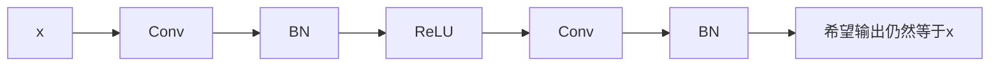
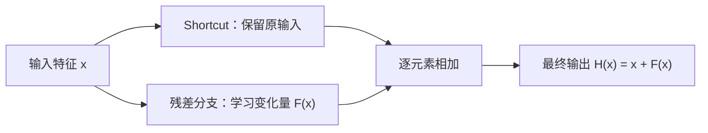
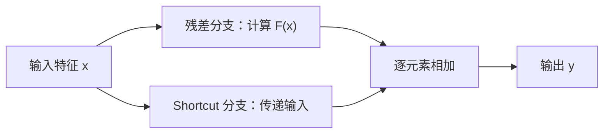
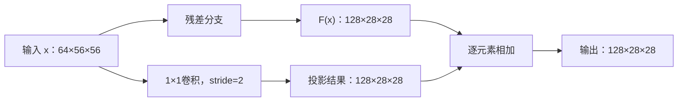
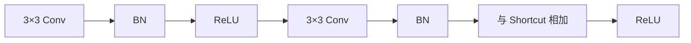
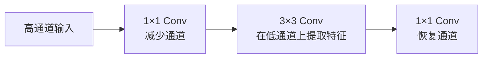

## 1. 论文信息
**论文标题**：Deep Residual Learning for Image Recognition  
**作者**：Kaiming He、Xiangyu Zhang、Shaoqing Ren、Jian Sun  
**会议**：CVPR 2016

这篇论文提出了 **ResNet（Residual Network，残差网络）**，核心目标不是单纯设计一个分类网络，而是解决：

> 当神经网络不断加深时，为什么训练效果反而可能变差，以及怎样让几十层、上百层网络更容易优化。

论文在 ImageNet 上训练了最深 152 层的残差网络，并通过 Plain Network 与 Residual Network 的严格对比，证明残差结构能够显著缓解深层网络的优化困难。

# 2. ResNet 要解决什么问题

## 2.1 网络为什么需要变深

卷积神经网络的不同层通常负责不同层级的特征：

```text
输入图像
   │
   ▼
浅层：边缘、方向、颜色变化
   │
   ▼
中层：纹理、局部形状
   │
   ▼
深层：物体部件、类别语义
   │
   ▼
分类结果
```

理论上，增加网络深度可以增加网络的表达能力，使模型能够构造更复杂的特征。

但是，网络并不是简单地“越深越好”。

## 2.2 一个反常现象

假设已经训练好一个 20 层网络，现在构造一个 56 层网络。
理论上，可以：
1. 把原来 20 层网络的参数复制过来；
2. 让新增加的 36 层什么都不改变；
3. 这 36 层只执行恒等映射。

因此，更深网络至少应该能够达到和浅层网络一样的训练误差。

【Fig1】
但论文实验显示：
- 56 层 Plain Network 的训练误差高于 20 层 Plain Network；
- 测试误差也更高。

这就是 **Degradation Problem（退化问题）**。论文的 Figure 1 直接展示了 CIFAR-10 上 20 层与 56 层普通网络的这种现象。

# 3. 什么是退化问题

## 3.1 定义

**Degradation Problem，退化问题**：

> 当网络深度增加到一定程度后，更深的网络不但没有获得更低的训练误差，训练误差反而升高。

关键是 **训练误差升高**。

```text
网络深度增加
     │
     ▼
理论表达能力增加
     │
     ▼
实际训练误差反而升高
     │
     ▼
在深层网络包含不差于浅层网络的构造解这一前提下，如果相同训练条件下深层网络仍表现出更高训练误差，说明当前优化过程没有找到这组已有的较优解，体现出深层 Plain Network 更难优化。
```

## 3.2 退化问题不是过拟合

### 过拟合
**Overfitting，过拟合**：模型过度拟合训练数据，导致训练效果很好，但测试效果较差。
```text
训练误差：下降
测试误差：上升
```

### 退化问题
```text
训练误差：上升
测试误差：也上升
```
对比：

|问题|训练误差|测试误差|主要原因|
|---|--:|--:|---|
|过拟合|低|高|泛化能力不足|
|退化问题|高|高|深层网络优化困难|

论文特别指出，更深的 Plain Network 连训练集都没有拟合好，因此这种现象不能用过拟合解释。

## 3.3 退化问题也不能简单等于梯度消失

### 梯度消失

**Vanishing Gradient，梯度消失**：反向传播时，梯度经过许多层连续相乘后越来越小，导致浅层参数几乎无法更新。

假设每层局部梯度都是 0.5，连续经过 10 层：

$$
0.5^{10}=0.0009765625
$$

经过 50 层：

$$
0.5^{50}\approx8.88\times10^{-16}
$$

梯度会变得非常小。

但 ResNet 论文中的 Plain Network 已经使用：
- 合理的参数初始化；
- Batch Normalization；
- 正常的 SGD 训练。
    

作者还检查了前向信号和反向梯度，认为它们保持了正常的数值范围。因此，论文中的退化问题不能简单归结为梯度完全消失。作者更谨慎地将其描述为 **深层 Plain Network 的优化困难**。

所以不要简单当成：

> ResNet 解决了梯度消失。

更准确的说法是：

> ResNet 通过残差重参数化和 Shortcut，缓解了深层网络的优化困难，同时也为信息和梯度提供了更直接的传播路径。

---

# 4. Plain Network 为什么难以学习恒等映射
## 4.1 Plain Network 的困难

假设一组卷积层需要学习：

$$
H(x)=x
$$

Plain Network 必须让多层卷积、BN 和 ReLU 组合起来，最终精确复现输入。



理论上，神经网络有能力表示恒等映射。

但“能够表示”不等于“优化器容易找到”。

这正是论文关注的问题：

> 更深网络的解空间包含浅层网络的解，但现有优化算法不一定能够在有限时间内找到这个解。

---

# 5. 残差学习的核心思想

## 5.1 从“直接学习”到“学习差值”
假设我们希望网络学到一个映射 $\mathcal{H}(x)$（输入 $x$ 到输出的映射）。

$\mathcal{H}(x)$：希望网格块的最终输出

**普通网络的做法**：让堆叠的非线性层直接拟合 $\mathcal{H}(x)$。

**ResNet 的做法**：让堆叠的非线性层拟合**残差**：




**一句话理解：$$
F(x)=H(x)-x
$$ ==不是额外执行的一次减法，而是在定义“目标输出相对于输入还差多少”，ResNet 让卷积分支学习这个差值，再把输入通过 Shortcut 加回来。==

> 为什么要通过shortcut把输入x加回来？
> 因为残差分支学习的不是完整输出，而是**输入到目标输出之间的变化量**。学习到变化量之后，要把输入加回来，才能得到目标结果。即 $H(x) = x + F(x)$


# 6. Residual Block：ResNet 的核心结构

## 6.1 Residual Block 在计算什么

假设一个 Block 的输入特征是$x$，这个 Block 最终希望得到的目标映射是$H(x)$。

Plain Network 直接用若干卷积层学习完整映射：

$$
x\rightarrow H(x)
$$

ResNet 则把目标映射拆成：

$$
H(x)=x+F(x)
$$

其中：
- $x$：Block 原有的输入特征；
- $F(x)$：目标输出相对输入需要产生的变化；
- $H(x)$：Block 最终输出的目标特征。

因此：

$$
F(x)=H(x)-x
$$

这里的$F(x)=H(x)-x$是对“残差是什么”的定义，并不是网络先算出$H(x)$，再执行一次减法。

实际前向计算是：

$$
y=F(x)+x
$$

也就是：

```text
原有特征 x
    +
需要修改的部分 F(x)
    =
Block 输出 y
```

例如：

- 输入$x=5$；
    
- 残差分支输出$F(x)=2$；
    

那么：

$$
y=5+2=7
$$

残差分支只负责计算“相对输入要改变多少”，原输入由另一条路径保留下来。

---

## 6.2 Residual Block 的两条路径
【Fig2】

论文 **Figure 2** 展示了最基础的 Residual Block。



两条路径分别是：

### 残差分支

负责学习特征变化$F(x)$：

```text
x → Conv → BN → ReLU → Conv → BN → F(x)
```

### Shortcut 分支

绕过中间卷积层，将输入传到加法节点。

```text
x ───────────────────────────→ 加法节点
```

两条路径同时存在，不是二选一。

最终输出：

$$
y=F(x)+x
$$

原始论文中的结构在相加之后还会再经过一次 ReLU。


## 6.3 为什么有利于深层网络优化

Residual Block 为信息提供了一条绕过卷积层的直接路径。

前向传播时：
- 原输入可以直接传到后面；
- 残差分支只负责补充变化。

反向传播时，梯度也可以经过加法节点直接传回前面的层。

对于：

$$
y=x+F(x)
$$

有：
$$
\frac{\partial L}{\partial x} \frac{\partial L}{\partial y} \left( 1+\frac{\partial F(x)}{\partial x} \right)
$$

其中的$1$来自 Shortcut 分支。

这说明即使残差分支的梯度较小，仍存在一条直接的梯度传播路径。

但需要准确理解：

> 原论文的核心结论是 Residual Learning 缓解了深层 Plain Network 的优化困难，而不是简单宣称“Shortcut 彻底解决了梯度消失”。

---

# 7. Shortcut Connection 的两种形式

## 7.1 概念关系

**Shortcut Connection** 是总称，表示绕过若干中间层、把前面的特征传到后面。

论文中主要有两种实现：

```text
Shortcut Connection
├── Identity Shortcut
└── Projection Shortcut
```

## 7.2 Identity Shortcut

**Identity Shortcut，恒等捷径**：Shortcut 分支不改变输入，直接传递$x$。

$$
y=F(x)+x
$$

适用条件是：

$$
Shape(F(x))=Shape(x)
$$

例如：

```text
x       ：[8,64,56,56]
F(x)    ：[8,64,56,56]
输出    ：[8,64,56,56]
```
> 这里的数字表示张量 Shape，而不是张量内部的数值。

它的特点是：
- 不增加卷积参数；
- 几乎不增加计算量；
- 完整保留输入特征。

论文 **Figure 2** 中展示的就是 Identity Shortcut。

---

## 7.3 Projection Shortcut

当主分支改变了通道数或特征图尺寸时，$F(x)$与$x$无法直接相加。

例如：

```text
x       ：[8,64,56,56]
F(x)    ：[8,128,28,28]
```

此时 Shortcut 分支需要先把$x$变换到与$F(x)$相同的 Shape：

$$
y=F(x)+W_sx
$$

其中$W_s$表示 Shortcut 上的线性投影，一般由$1\times1$卷积实现。



$1\times1$卷积可以同时完成：
- 调整通道数；
- 配合 stride 调整空间尺寸；
- 保证两条分支可以逐元素相加。

## 7.4 两种 Shortcut 如何选择

|情况|Shortcut|
|---|---|
|输入输出 Shape 相同|Identity Shortcut|
|通道数或空间尺寸变化|Projection Shortcut|

一个 Stage 内部，大多数 Block 的 Shape 不变，因此主要使用 Identity Shortcut。

只有在 Stage 切换、下采样或通道变化的位置，才需要 Projection Shortcut。

---

## 7.5 ResNet 使用的是相加，不是拼接

Residual Block 使用逐元素相加：

```text
[8,64,H,W]+[8,64,H,W]
            ↓
       [8,64,H,W]
```

相加后通道数不变。

而拼接会把通道合并：

```text
concat([8,64,H,W],[8,64,H,W])
                  ↓
             [8,128,H,W]
```

ResNet 的经典 Residual Block 使用的是 **Add**，不是 **Concat**。

---

# 8. Basic Block 与 Bottleneck

## 8.1 Basic Block

**Basic Block，基础残差块**：由两个$3\times3$卷积组成。

论文中用于：
- ResNet-18；
- ResNet-34。

结构可直接参考论文 **Figure 2**：



Basic Block 的特点是结构简单，适合深度相对较小的网络。

## 8.2 Bottleneck Block

**Bottleneck**：由三个卷积组成：


【Fig5】

论文中用于：
- ResNet-50；
- ResNet-101；
- ResNet-152。

例如输入有 256 个通道：

```text
256 → 64 → 64 → 256
```

最消耗计算的$3\times3$卷积只在 64 个通道上执行，而不是直接在 256 个通道上执行。

直接在 256 通道上做$3\times3$卷积，参数量为：

$$
3\times3\times256\times256=589824
$$

压缩到 64 通道后再做：

$$
3\times3\times64\times64=36864
$$

因此，Bottleneck 并不是完全不增加参数，而是：

> **在把网络堆得更深时，通过$1\times1$卷积先压缩通道，让主要卷积在较低通道数上运行，从而控制参数量和计算量，最后再恢复输出通道。**

还要注意，最后恢复通道是为了让输出具有足够的特征容量，并与 Shortcut 分支的 Shape 对齐。

> **Bottleneck 是一种适合构建更深网络的残差块：先用$1\times1$卷积降低通道，再用$3\times3$卷积提取特征，最后用$1\times1$卷积恢复通道，以控制网络加深带来的参数量和计算量增长。**


==**中间通道比两端窄，因此称为 Bottleneck。**==

## 8.3 两种 Block 对比

|对比项|Basic Block|Bottleneck|
|---|---|---|
|结构|$3\times3\rightarrow3\times3$|$1\times1\rightarrow3\times3\rightarrow1\times1$|
|卷积层数|2 层|3 层|
|使用网络|ResNet-18/34|ResNet-50/101/152|
|主要特点|简单直接|通过通道压缩控制计算量|

这是论文架构部分最需要掌握的区别。

---

# 9. ResNet 的整体网络组织

## 9.1 Stage 是什么

**Stage，网络阶段**：一组具有相同输出空间尺寸和通道数的 Residual Blocks。

```text
输入图像
   ↓
conv1
   ↓
max pooling
   ↓
conv2_x
   ↓
conv3_x
   ↓
conv4_x
   ↓
conv5_x
   ↓
Global Average Pooling
   ↓
全连接分类
```

典型特征图尺寸变化：

```text
224×224
   ↓
112×112
   ↓
56×56
   ↓
28×28
   ↓
14×14
   ↓
7×7
```

---

## 9.2 Stage 之间发生什么变化

从一个 Stage 进入下一个 Stage 时，通常：

- 特征图高度和宽度减半；
    
- 通道数加倍；
    
- 第一个 Block 使用 stride=2；
    
- Shortcut 使用 Projection 对齐 Shape。
    

例如：

```text
conv2_x：64通道，56×56
              ↓
conv3_x：128通道，28×28
```

同一个 Stage 内的后续 Block 通常不改变 Shape，因此使用 Identity Shortcut。


## 9.3 为什么尺寸减半、通道加倍

卷积计算量可以近似写成：

$$
H\times W\times C_{in}\times C_{out}\times K^2
$$

当空间尺寸减半时，面积变为原来的四分之一；如果通道数加倍，通道相关计算约增加四倍。

在简化条件下，两者可以大致抵消，使不同 Stage 的计算量保持在相近量级。


## 9.4 不同 ResNet 的区别

论文 **Table 1** 给出了各网络的 Block 数量。

|网络|Block 类型|各 Stage 的 Block 数|
|---|---|---|
|ResNet-18|Basic|2、2、2、2|
|ResNet-34|Basic|3、4、6、3|
|ResNet-50|Bottleneck|3、4、6、3|
|ResNet-101|Bottleneck|3、4、23、3|
|ResNet-152|Bottleneck|3、8、36、3|
1. 更深网络主要通过增加各 Stage 的 Block 数量实现。

# 10. 训练与实验结论

## 10.1 训练设置

论文 Section 3.4 使用了：
- SGD；
- Batch Size 256；
- 初始学习率 0.1；
- Momentum 0.9；
- Weight Decay 0.0001；
- 随机裁剪和水平翻转；
- 每个卷积后使用 BN；
- 不使用 Dropout。

## 10.2 Plain Network 与 ResNet 的结论

实验表明：
- 更深的 Plain Network 训练误差反而更高，出现退化问题；
- 加入 Residual Block 后，更深的网络可以获得更低的训练误差；
- 说明残差结构改善了深层网络的可优化性。

## 10.3 Identity 与 Projection 的结论

论文比较了不同 Shortcut 方案。

结论是：
- Identity Shortcut 已经能够显著改善优化；
- Projection Shortcut 会带来少量性能提升；
- Projection 不是所有 Block 都必须使用；
- 实际上主要在 Shape 变化时使用 Projection。

## 10.4 更深不代表一定更好

论文在 CIFAR-10 上训练了 1202 层 ResNet：

- 训练误差很低；
    
- 测试效果反而不如 110 层网络。

这属于过拟合，而不是退化问题。

因此：

> ResNet 使超深网络更容易训练，但不保证网络越深，泛化效果一定越好。


# 11. ResNet 与 DnCNN 中的“残差”

两篇论文都使用“残差学习”，但残差发生的位置不同。

## 11.1 ResNet

ResNet 在网络内部学习特征变化：

$$
F(x)=H(x)-x
$$

最终输出：

$$
y=x+F(x)
$$

残差表示：

> 当前 Block 的目标特征相对于输入特征需要改变多少。


## 11.2 DnCNN

带噪图像可以表示为：

$$
y=x+v
$$

其中$v$是噪声。

DnCNN 预测噪声：

$$
R(y)\approx v
$$

最后恢复干净图：

$$
\hat{x}=y-R(y)
$$

残差表示：

> 带噪图像与干净图像之间的噪声差值。

## 11.3 对比

|对比项|ResNet|DnCNN|
|---|---|---|
|残差位置|网络内部 Block|网络最终输出目标|
|残差含义|特征变化量|图像噪声|
|最终运算|输入加残差|带噪图减预测噪声|
|核心公式|$y=x+F(x)$|$\hat{x}=y-R(y)$|
|主要目的|改善深层网络优化|简化去噪目标|

共同思想是：

> 已有输入中包含大量有用信息，网络只学习相对于输入需要修改的部分。

## 12. 一句话总结

**ResNet 用 Shortcut 保留原输入，让卷积分支只学习需要修改的特征；Identity 和 Projection 是 Shortcut 的两种实现，Basic Block 与 Bottleneck 则是残差结构在不同深度网络中的两种主要形式。**