# MobileNetV2 - Inverted Residuals and Linear Bottlenecks
## 1. 论文信息与问题：端侧网络到底在优化什么

**论文标题**：MobileNetV2: Inverted Residuals and Linear Bottlenecks  
**会议**：CVPR 2018

MobileNetV2 的目标不是单纯减少参数量，而是设计一种适合移动端和嵌入式设备的网络结构：

> 在有限算力、有限内存和有限功耗下，尽量保留模型效果。

论文提出的核心模块是：
- **Depthwise Separable Convolution，深度可分离卷积**；
- **Linear Bottleneck，线性瓶颈**；
- **Inverted Residual，倒残差**。

整体推理链条是：


论文不仅比较了参数量和 Multiply-Adds，也实际比较了推理延迟，并专门分析了推理时的中间特征内存占用。

### 1.1 算力：FLOPs / MAdds

**FLOPs，Floating Point Operations**：模型执行了多少次浮点运算。

论文主要使用 **MAdds，Multiply-Adds**，即乘加次数。

需要注意，不同统计工具的口径可能不同：

```text
一次 a × b + c
有的工具记为 1 次 MAdd
有的工具记为 2 次 FLOPs
```

因此，比较模型时必须使用同一种统计口径。

算力描述的是：

> 理论上需要执行多少计算。

算力越高，通常需要更多时间和能量，但它并不直接等于真实运行速度。

### 1.2 速度：Latency

**Latency，推理延迟**：

> 从输入一张图，到模型产生输出，实际经过了多少毫秒。

例如：

```text
模型 A：20 ms
模型 B：35 ms
```

用户真正感知的是延迟，而不是 FLOPs。

延迟还受以下因素影响：
- 芯片计算单元数量；
- 算子是否被硬件加速；
- 内存带宽；
- Cache 大小；
- 数据排列；
- 算子融合；
- 并行度；
- 量化精度。

所以：

```text
FLOPs 更少
   ≠
Latency 一定更低
```

### 1.3 内存占用：Memory Usage

模型推理时主要有两类内存：

```text
模型内存
├── 权重参数
└── 中间特征图
```

权重内存近似为：
 $$  
M_{\text{weight}}

N_{\text{parameter}}  
\times  
\text{每个参数的字节数}  
$$

例如 100 万个 FP16 参数：
 $$  
1{,}000{,}000\times2

2\text{ MB}  
$$

中间特征图内存近似为：
 $$  
M_{\text{feature}}

B\times C\times H\times W  
\times  
\text{每个元素的字节数}  
$$

例如一个 FP16 特征图：

```text
[B,C,H,W]=[1,64,256,256]
```

需要： 
$$  
1\times64\times256\times256\times2

8{,}388{,}608\text{ Bytes}  
\approx8\text{ MB}  
$$

对于高分辨率去噪模型，中间特征图经常比权重更占内存。

### 1.4 内存访问开销

计算卷积时，芯片不仅要执行乘法和加法，还要不断搬运数据，包括：

```
输入特征
权重参数
中间特征
输出特征
```

数据通常需要经过：

```
主内存
  ↓
Cache / SRAM
  ↓
计算单元
  ↓
Cache / SRAM
  ↓
主内存
```

**内存访问开销**，指的就是这些数据在主内存、片上缓存和计算单元之间读写所消耗的时间与能量。

端侧芯片的高速片上缓存容量通常有限。当一个中间特征图放不进片上缓存时，数据就需要频繁写回主内存，再重新读取。即使模型的乘加次数不高，这些数据搬运也可能造成较大的推理延迟。

因此，真实推理速度不只取决于计算量：

```
推理延迟
≈
计算耗时
+
内存读写耗时
+
算子调度耗时
```

这也是为什么两个 FLOPs 相近的网络，在同一块芯片上的实际速度可能差很多。

MobileNetV2 不仅降低卷积计算量，还让残差连接发生在低通道的 Bottleneck 特征上，从而减少需要长期保留和搬运的大尺寸中间特征。

> **算子（Operator）**可以理解为：
> 对输入张量执行一次明确计算，并产生输出张量的基本计算单元。
> 
> 在神经网络中，数据通常以 Tensor 形式流动：
> ```
> 输入 Tensor
>    ↓
> 算子
>    ↓
> 输出 Tensor
> ```
> 
> 例如：
> ```
> 输入特征
>    ↓ Conv2d 算子
> 卷积结果
>    ↓ ReLU 算子
> 激活结果
>    ↓ Add 算子
> 相加结果
> ```


[attachments/mobilenetv2_memory_hierarchy_3d.png]

### 1.5 精度：Accuracy 与 PSNR

MobileNetV2 原论文主要处理分类、检测和分割，因此使用 Accuracy、mAP、mIOU 等指标。

在图像去噪中，对应的效果指标可能是：
- PSNR；
- SSIM；
- 主观纹理；
- 色噪；
- 边缘清晰度；
- 时序稳定性。

因此，端侧轻量化实际上是在寻找：

```text
计算量
+
延迟
+
内存
+
效果
```

之间的折中，而不是把 FLOPs 压到最低。

## 2. 标准卷积为什么昂贵

假设输入特征为：

```text
[B,Cin,H,W]
```

卷积核大小为$K\times K$，输出通道数为$C_{out}$。

标准卷积的乘加次数约为：
$$  
\operatorname{Cost}_{\text{standard}}

H\times W\times K^2  
\times C_{in}\times C_{out}  
$$

原因是每个输出位置、每个输出通道，都需要读取：K × K × Cin个输入值。

### 2.1 一个具体数字

假设：

```text
H=W=56
Cin=64
Cout=64
K=3
```

那么计算量为：

$$  
56\times56\times3^2\times64\times64  
$$

$$

115{,}605{,}504  
$$

也就是大约：

$$  
115.6\text{ MAdds}  
$$

这只是一个卷积层。

如果模型中有很多高分辨率标准卷积，计算量会快速累积。

### 2.2 为什么$C_{in}\times C_{out}$很贵

标准卷积同时完成两件事：
1. 在空间上提取局部特征；
2. 在通道之间进行融合。

对于一个输出通道，它会读取所有输入通道：


一共有$C_{out}$个输出通道，因此计算量包含：

$$  
C_{in}\times C_{out}  
$$

这部分在通道数较大时非常昂贵。

## 3. 第一次优化：深度可分离卷积

MobileNetV2 延续了 MobileNetV1 的核心轻量化方法：

> 把一次标准卷积拆成两步：先用 Depthwise Convolution 处理空间信息，再用 Pointwise Convolution 融合通道信息。

要理解为什么这样能省计算，必须先弄清楚标准卷积究竟在算什么。

### 3.1 标准卷积是怎么计算的

假设输入特征图 Shape 为：

```text
[B, Cin, H, W]
```

卷积层参数为：

```text
卷积核大小：K×K
输入通道数：Cin
输出通道数：Cout
```

卷积权重的 Shape 是：

```text
[Cout, Cin, K, K]
```

这意味着：

> 每一个输出通道，都有一组覆盖全部输入通道的卷积核。

例如：

```text
Cin = 3
Cout = 4
K = 3
```

卷积权重 Shape 为：

```text
[4, 3, 3, 3]
```

可以把它理解成：

```text
输出通道 0：
├── 处理输入通道 0 的 3×3 Kernel
├── 处理输入通道 1 的 3×3 Kernel
└── 处理输入通道 2 的 3×3 Kernel

输出通道 1：
├── 处理输入通道 0 的 3×3 Kernel
├── 处理输入通道 1 的 3×3 Kernel
└── 处理输入通道 2 的 3×3 Kernel

输出通道 2：
同样包含 3 个 3×3 Kernel

输出通道 3：
同样包含 3 个 3×3 Kernel
```

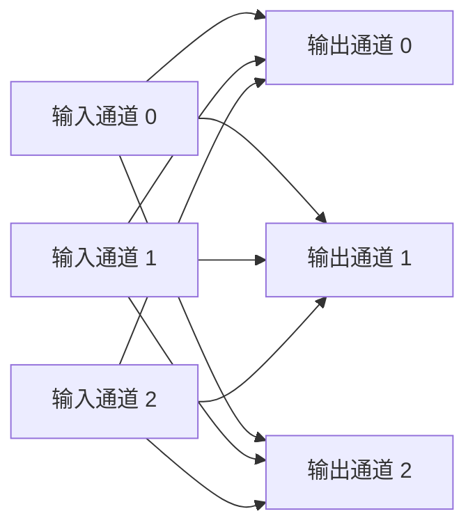

标准卷积中，一个输出通道会读取所有输入通道。

#### 单个输出像素怎么算

对于输出通道$o$、位置$(i,j)$：

$$  
y_o(i,j)

\sum_{c=1}^{C_{in}}  
\sum_{u=1}^{K}  
\sum_{v=1}^{K}  
W_{o,c,u,v}  
x_c(i+u,j+v)  
+b_o  
$$

其中：
- $x_c$：第$c$个输入通道；
- $W_{o,c}$：输出通道$o$对应输入通道$c$的卷积核；
- $y_o$：第$o$个输出通道；
- $b_o$：输出通道$o$的偏置。

实际过程可以拆成三步：

```text
第一步：每个输入通道分别与对应 Kernel 做卷积

第二步：把所有输入通道的卷积结果相加

第三步：加上 Bias，得到一个输出通道的一个像素
```

#### 具体数字演示

假设某个位置上，输入有两个通道，每个通道取一个$2\times2$区域。

输入通道 0：

$$  
X_0=  
\begin{bmatrix}  
1 & 2\  
3 & 4  
\end{bmatrix}  
$$

输入通道 1：

$$  
X_1=  
\begin{bmatrix}  
5 & 6\  
7 & 8  
\end{bmatrix}  
$$

现在计算输出通道 0。

它需要两张卷积核：

$$  
W_{0,0}=  
\begin{bmatrix}  
1 & 0\  
0 & 1  
\end{bmatrix}  
$$

$$  
W_{0,1}=  
\begin{bmatrix}  
1 & 1\  
1 & 1  
\end{bmatrix}  
$$

输入通道 0 的卷积结果：

$$  
1\times1  
+  
2\times0  
+  
3\times0  
+  
4\times1  
=5  
$$

输入通道 1 的卷积结果：

$$  
5\times1  
+  
6\times1  
+  
7\times1  
+  
8\times1  
=26  
$$

将两个通道的结果相加：

$$  
y_0=5+26=31  
$$

所以标准卷积计算一个输出通道时，不只是做空间卷积，还会把所有输入通道融合到一起。

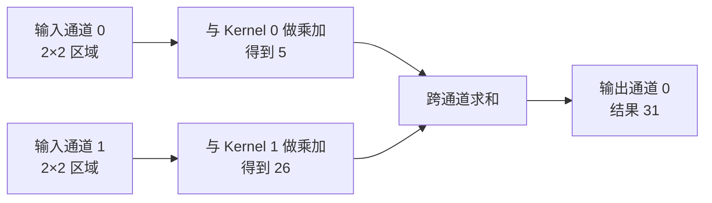

如果还要生成输出通道 1，就需要另一套完全不同的卷积核，再重新执行一次上述过程。

因此标准卷积同时做了两件事：

```text
空间特征提取：
每个 K×K Kernel 读取局部邻域

通道特征融合：
每个输出通道读取全部输入通道
```

### 3.2 标准卷积为什么计算量大

对于输出特征图中的每一个位置、每一个输出通道，都要执行：

$$  
K^2\times C_{in}  
$$

次乘加。

一共有：

$$  
H\times W\times C_{out}  
$$

个输出位置，因此标准卷积总计算量约为：

$$  
\operatorname{Cost}_{\text{standard}}

H\times W\times K^2  
\times C_{in}\times C_{out}  
$$

例如：

```text
H = W = 56
Cin = 64
Cout = 64
K = 3
```

计算量为：

$$  
56\times56\times3^2\times64\times64  
$$

$$

115{,}605{,}504  
$$

约为：

$$  
115.6\text{ MAdds}  
$$

最昂贵的地方是：

$$  
K^2\times C_{in}\times C_{out}  
$$

因为空间卷积和通道融合被绑定在了一起。

### 3.3 深度可分离卷积如何拆分标准卷积

深度可分离卷积把标准卷积拆成：

```text
第一步：Depthwise Convolution
只处理空间，不融合通道

第二步：Pointwise Convolution
只融合通道，不处理较大空间邻域
```


标准卷积原本一次完成：

```text
空间处理 + 通道融合
```

深度可分离卷积改成：

```text
空间处理
     ↓
通道融合
```

两步分别完成。

### 3.4 Depthwise Convolution(逐通道卷积) 是怎么计算的

**Depthwise Convolution，逐通道卷积**：

> 每个输入通道只与自己的卷积核进行空间卷积，不读取其他输入通道。

假设：

```text
Cin = 3
K = 3
```

Depthwise 卷积权重 Shape 为：

```text
[3, 1, 3, 3]
```

可以理解为：

```text
输入通道 0 → Kernel 0 → 输出通道 0
输入通道 1 → Kernel 1 → 输出通道 1
输入通道 2 → Kernel 2 → 输出通道 2
```

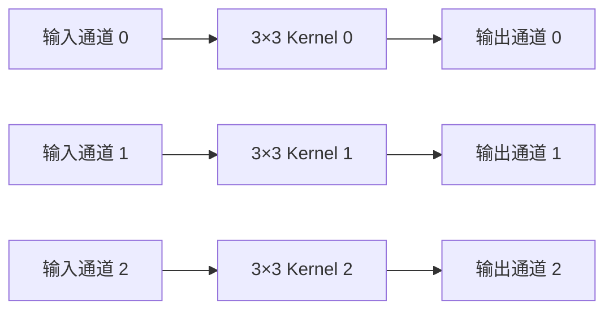

与标准卷积不同：

```text
标准卷积：
一个输出通道读取所有输入通道

Depthwise Conv：
一个输出通道只读取一个输入通道
```

#### Depthwise 的公式

对于通道$c$：

$$  
z_c(i,j)

\sum_{u=1}^{K}  
\sum_{v=1}^{K}  
D_{c,u,v}  
x_c(i+u,j+v)  
$$

这里没有对输入通道$c$求和。

也就是说：

```text
输入通道 0 不会参与输出通道 1
输入通道 1 不会参与输出通道 2
不同通道之间完全独立
```

#### 用刚才的数字继续演示

输入通道 0：

$$  
X_0=  
\begin{bmatrix}  
1 & 2\  
3 & 4  
\end{bmatrix}  
$$

输入通道 1：

$$  
X_1=  
\begin{bmatrix}  
5 & 6\  
7 & 8  
\end{bmatrix}  
$$

Depthwise Kernel 0：

$$  
D_0=  
\begin{bmatrix}  
1 & 0\  
0 & 1  
\end{bmatrix}  
$$

Depthwise Kernel 1：

$$  
D_1=  
\begin{bmatrix}  
1 & 1\  
1 & 1  
\end{bmatrix}  
$$

通道 0 的输出：

$$  
z_0

1\times1  
+  
2\times0  
+  
3\times0  
+  
4\times1  
=5  
$$

通道 1 的输出：

$$  
z_1

5+6+7+8  
=26  
$$

Depthwise 卷积的输出是：

$$  
z=  
\begin{bmatrix}  
5\  
26  
\end{bmatrix}  
$$

注意，此时没有执行：

$$  
5+26  
$$

因为不同通道之间还没有融合。

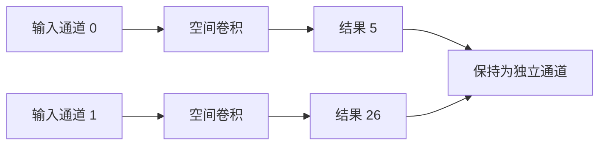

Depthwise Conv 只回答：

> 每个通道自己的局部空间特征是什么？

它不能回答：

> 不同通道组合起来代表什么？

### 3.5 Depthwise Convolution 为什么便宜

对于每一个输入通道，只执行一次$K\times K$空间卷积。

计算量为：

$$  
\operatorname{Cost}_{\text{DW}}

H\times W\times K^2\times C_{in}  
$$

标准卷积是：

$$  
H\times W\times K^2  
\times C_{in}\times C_{out}  
$$

Depthwise 没有$C_{out}$这一项，因为它不会为每个输出通道重新读取全部输入通道。

但这也带来了一个问题：

> Depthwise Conv 不能进行通道融合。

所以后面必须再接 Pointwise Conv。

### 3.6 Pointwise Convolution （逐点卷积）是怎么计算的

**Pointwise Convolution，逐点卷积**：

> 使用$1\times1$卷积，在每一个空间位置上读取全部输入通道，并重新组合成新的输出通道。

假设 Depthwise 输出为：

```text
[B, Cin, H, W]
```

Pointwise Conv 的权重 Shape 为：

```text
[Cout, Cin, 1, 1]
```

对于每一个空间位置，它不会读取周围的$3\times3$区域，只读取当前位置的全部通道。

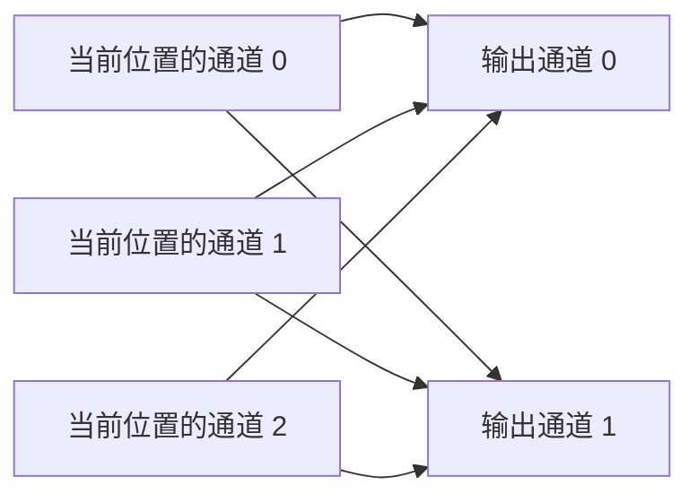

Pointwise Conv 的本质是：

```text
同一空间位置
Cin 维向量
     ↓ 线性组合
Cout 维向量
```

#### Pointwise 的公式

对于输出通道$o$：

$$  
y_o(i,j)

\sum_{c=1}^{C_{in}}  
P_{o,c}  
z_c(i,j)  
+b_o  
$$

其中：
- $z_c(i,j)$：Depthwise 输出在位置$(i,j)$的第$c$个通道；
- $P_{o,c}$：$1\times1$卷积权重；
- $y_o(i,j)$：Pointwise 输出。

#### 继续使用刚才的数字

Depthwise 输出：

$$  
z=  
\begin{bmatrix}  
5\  
26  
\end{bmatrix}  
$$

现在希望输出两个通道。

输出通道 0 的 Pointwise 权重：

$$  
P_0=  
\begin{bmatrix}  
1 & 1  
\end{bmatrix}  
$$

因此：

$$  
y0​=1×5+1×26=31
$$

输出通道 1 的权重：

$$  
P_1=  
\begin{bmatrix}  
2 & -1  
\end{bmatrix}  
$$

因此：

$$  
y1​=2×5+(−1)×26=−16
$$

最终得到：

$$  
y=  
\begin{bmatrix}  
31\  
-16  
\end{bmatrix}  
$$

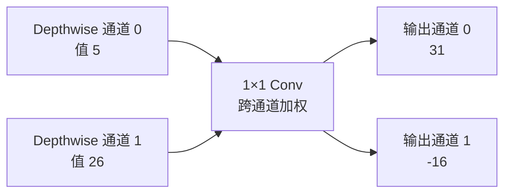

所以 Pointwise Conv 只回答：

> 当前空间位置上的多个通道，应该怎样重新组合？

### 3.7 标准卷积与深度可分离卷积的本质区别

标准卷积：

```text
对于每一个输出通道：
    对所有输入通道分别做 K×K 空间卷积
    再把结果相加
```


深度可分离卷积：

```text
Depthwise：
每个通道独立做 K×K 空间卷积

Pointwise：
在每个位置使用 1×1 卷积融合全部通道
```


可以概括为：

```text
标准卷积：
空间处理和通道融合绑在一起完成

深度可分离卷积：
先处理空间，再融合通道
```

[attachments/mobilenetv2_conv_factorization_3d.png]

### 3.8 深度可分离卷积的计算量

Depthwise 部分：

$$  
\operatorname{Cost}_{\text{DW}}

H\times W\times K^2\times C_{in}  
$$

Pointwise 部分：

$$  
\operatorname{Cost}_{\text{PW}}

H\times W\times C_{in}\times C_{out}  
$$

总计算量：

$$  
\operatorname{Cost}_{\text{separable}}

HWC_{in}K^2  
+  
HWC_{in}C_{out}  
$$

标准卷积计算量：

$$  
\operatorname{Cost}_{\text{standard}}

HWK^2C_{in}C_{out}  
$$

两者比例：

$$  
\frac{  
\operatorname{Cost}_{\text{separable}}  
}{  
\operatorname{Cost}_{\text{standard}}  
}

\frac{  
HWC_{in}K^2  
+  
HWC_{in}C_{out}  
}{  
HWK^2C_{in}C_{out}  
}  
$$

约分后：

$$  
\frac{1}{C_{out}}  
+  
\frac{1}{K^2}  
$$

当：

```text
K = 3
Cout = 64
```

比例为：

$$  
\frac{1}{64}  
+  
\frac{1}{9}  
\approx0.1267  
$$

也就是说，深度可分离卷积的计算量约为标准卷积的：12.67%  ，约减少到原来的八分之一。

### 3.9 为什么 Pointwise 仍然占主要计算量

在上面的例子中：

```text
Depthwise：1.8 MAdds
Pointwise：12.8 MAdds
```

虽然 Pointwise 只使用$1\times1$卷积，但它要执行：

$$  
C_{in}\times C_{out}  
$$

次通道组合。

因此轻量网络中经常出现：

> Depthwise Conv 已经非常便宜，真正占计算量的是前后的$1\times1$ Pointwise Conv。

这也是后面理解 MobileNetV2 Expansion Ratio 时必须注意的地方：通道一旦扩张，$1\times1$卷积的计算量也会明显增加。

### 3.10 Group Convolution 与 Depthwise Convolution

标准卷积中，**每个输出通道都会读取全部输入通道**。

假设输入和输出都是 4 个通道：

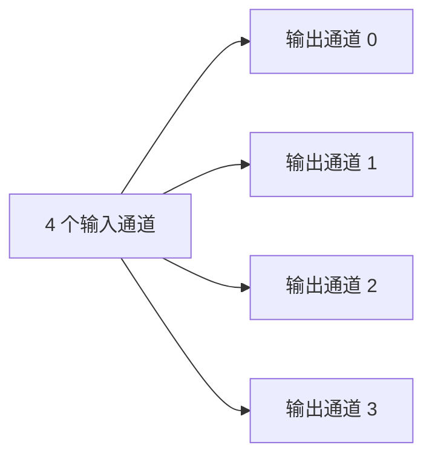

**Group Convolution，分组卷积**：把输入通道和输出通道分成若干组，每组独立做卷积，组与组之间不连接。

例如：

```text
输入通道数：4
输出通道数：4
groups：2
```

分组后：

```text
第 1 组：
输入通道 0、1 → 输出通道 0、1

第 2 组：
输入通道 2、3 → 输出通道 2、3
```

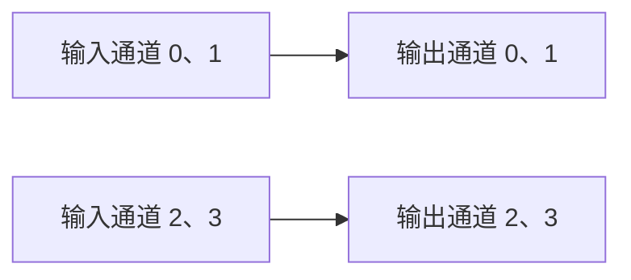

输出通道 0、1 看不到输入通道 2、3，因此计算量会降低。

如果组数为 $g$，每个输出通道只读取：

$$  
\frac{C_{in}}{g}  
$$

个输入通道。

计算量约为标准卷积的：

$$  
\frac{1}{g}  
$$

**Depthwise Convolution 是 Group Convolution 的特殊情况。**

当：

$$  
g=C_{in}  
$$

每组只有一个输入通道。

例如：

```text
输入通道数：4
groups：4
```

连接关系变成：

```text
输入通道 0 → 输出通道 0
输入通道 1 → 输出通道 1
输入通道 2 → 输出通道 2
输入通道 3 → 输出通道 3
```

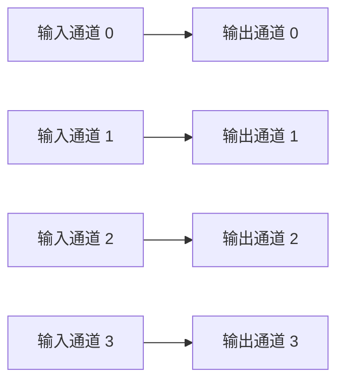

这就是 Depthwise Convolution：每个通道只处理自己的空间信息，不与其他通道融合。

概念关系：

```text
groups = 1
→ 标准卷积

1 < groups < Cin
→ 普通分组卷积

groups = Cin
→ Depthwise Convolution
```

PyTorch 写法：

```python
depthwise = nn.Conv2d(
    in_channels=channels,
    out_channels=channels,
    kernel_size=3,
    padding=1,
    groups=channels,
)
```

判断代码中的`Group_Conv2d`是不是 Depthwise Convolution，主要看：

```python
groups == in_channels
```

Depthwise Convolution 不融合通道，所以后面通常还要接一个 $1\times1$ Pointwise Convolution，重新组合不同通道的信息。

**一句话理解：Group Convolution 是让每个输出通道只读取部分输入通道；当每组只剩一个输入通道时，就是 Depthwise Convolution。**

[attachments/mobilenetv2_group_connectivity_3d.png]

### 3.11 这一节真正重要的内容

```text
标准卷积：
每个输出通道都对全部输入通道执行 K×K 卷积
空间处理和通道融合同时完成
计算量高

Depthwise Conv：
每个输入通道独立做 K×K 卷积
只处理空间，不融合通道

Pointwise Conv：
在每个空间位置使用 1×1 卷积读取全部通道
只融合通道，不扩大空间范围

深度可分离卷积：
把标准卷积拆成 Depthwise + Pointwise
用较小计算量近似完成原本的空间处理和通道融合
```

**一句话理解：标准卷积会让每个输出通道同时读取所有输入通道的空间邻域，而深度可分离卷积先让每个通道独立处理空间，再用$1\times1$卷积统一融合通道，因此避免了昂贵的$K^2C_{in}C_{out}$联合计算。**

## 4. 深度可分离卷积带来的新矛盾

深度可分离卷积大幅降低了计算量，但它并没有回答一个问题：

> 当网络通道很少时，怎样避免非线性激活破坏信息？

需要先修正一个常见但不够准确的表述：

> MobileNetV2 原论文并没有把核心问题描述为“Depthwise 卷积核参数太少，所以很多卷积核训练成空核”。

论文真正讨论的是：

```text
低维特征
+
ReLU
→
部分不同输入可能被映射到相同输出
→
信息不可恢复
```

它关注的是**激活信息被压缩或坍塌**，不是卷积核参数本身变成空。

### 4.1 什么是低维空间

假设某个像素位置有$C$个通道：

```text
x=[x1,x2,...,xC]
```

它可以看作$C$维特征向量。

例如：

```text
通道数 64 → 64 维空间
通道数 16 → 16 维空间
```

减少通道数就是降低特征空间维度。

### 4.2 Activation Manifold

**Activation Manifold，激活流形**：

> 对真实输入数据而言，网络特征并不会填满整个高维空间，而通常集中在某个更低维、具有结构的区域中。

例如，某层有 64 个通道，并不意味着有效信息一定需要 64 个完全独立的维度。

有效数据可能主要分布在其中一个更低维的结构上。

MobileNetV2 的假设是：

> 有效信息本身可能是低维的，因此可以使用窄 Bottleneck 保存；但进行复杂非线性变换时，需要先把它映射到更高维空间。

### 4.3 ReLU 为什么可能丢失信息

ReLU 为：

$$  
f(x)=\max(0,x)  
$$

负数全部变成 0。

假设低维特征为：

$$  
x=  
\begin{bmatrix}  
-0.4\  
0.3  
\end{bmatrix}  
$$

经过 ReLU：

$$  
\operatorname{ReLU}(x)

\begin{bmatrix}  
0\  
0.3  
\end{bmatrix}  
$$

此时无法判断第一个值原来是：

```text
-0.4
-1.0
-10.0
```

因为它们都会变成 0。

假设一个 16 维特征中有 11 个负数：

```text
ReLU 前：16 个有符号特征值
ReLU 后：11 个变成 0，只剩 5 个非零值
```

这只是一个说明信息丢失机制的例子，并不表示所有网络都固定只剩 5 个有效值。

### 4.4 为什么高维空间中的 ReLU 更安全

假设原始信息只有 2 个自由维度，但先把它投影到 12 个通道：

```text
2维信息
  ↓ 线性扩张
12维表示
```

同一份信息可以分散在多个坐标中。

ReLU 即使把部分坐标置 0，其他坐标仍可能保留足够的信息。


论文 Figure 1 展示了同一个二维螺旋被映射到不同维度后再经过 ReLU：当输出维度很低时，不同点容易发生重叠；当维度提升到 15 或 30 时，结构能够更好地保留。

因此，真正的矛盾是：

```text
为了省计算：
希望通道尽量少

为了安全使用 ReLU：
希望非线性变换发生在更高维空间
```

MobileNetV2 的两个核心设计，就是为了解决这个矛盾。

[attachments/mobilenetv2_relu_manifold_3d.png]

## 5. 核心对策一：Linear Bottleneck

### 5.1 Bottleneck 是什么

**Bottleneck，瓶颈层**：

> 通道数较少、用于保存模块输入或输出的低维特征层。

例如：

```text
高维中间特征：144 通道
低维 Bottleneck：24 通道
```

MobileNetV2 Block 的输入和输出都是窄 Bottleneck。

### 5.2 Linear Bottleneck 是什么

**Linear Bottleneck，线性瓶颈**：

> 最后一个$1\times1$卷积把高维特征压缩回低维时，不再接 ReLU，而是保留线性输出。

结构为：

```text
1×1 Projection Conv
→
BatchNorm
→
直接输出
```

而不是：

```text
1×1 Projection Conv
→
BatchNorm
→
ReLU
```

论文实验显示，在窄 Bottleneck 上保留非线性会使性能下降，而去掉非线性能够更好地保留低维信息。

### 5.3 为什么低维输出不能再接 ReLU

假设高维特征被压缩成：

$$  
z=  
\begin{bmatrix}  
-0.8\  
0.2\  
-0.3\  
0.7  
\end{bmatrix}  
$$

如果这是 Block 最终用于传给下一层的低维表示，ReLU 会得到：

$$  
\operatorname{ReLU}(z)

\begin{bmatrix}  
0\  
0.2\  
0\  
0.7  
\end{bmatrix}  
$$

两个负向特征被直接抹掉。

如果后面没有额外的冗余通道，丢失的信息很难恢复。

所以最后一层使用：

$$  
y=Wz  
$$

而不是：

$$  
y=\operatorname{ReLU}(Wz)  
$$

这里的“Linear”并不是说整个 Block 都是线性的。

Block 内部仍然包含：

```text
1×1 Conv + ReLU6
3×3 Depthwise Conv + ReLU6
```

只有最后压缩回 Bottleneck 的 Projection 层不使用激活函数。

### 5.4 反事实推理

假设保留 ReLU：

```text
高维特征
  ↓ 1×1 压缩到 16 通道
低维特征
  ↓ ReLU
部分通道永久变成 0
  ↓
下一层收到的信息不完整
```

去掉最后的 ReLU：

```text
高维特征
  ↓ 线性压缩到 16 通道
正值和负值都保留
  ↓
下一层仍能区分不同输入
```

因此：

> 非线性负责提高表达能力，但不应该放在最容易发生信息丢失的窄输出层。

[attachments/mobilenetv2_block_evolution_3d.png]

## 6. 核心对策二：Inverted Residual

### 6.1 倒残差的完整流程

一个典型 MobileNetV2 Block 为：

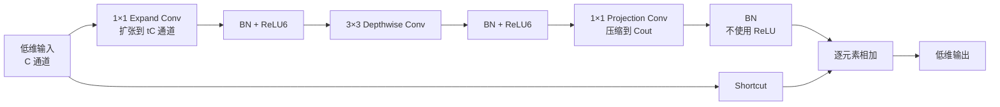

当 stride 为 1，且输入输出 Shape 相同时：

$$  
y=x+F(x)  
$$

当空间尺寸或通道数变化时，通常不使用 Shortcut。

### 6.2 Expansion Ratio

**Expansion Ratio，扩张倍率**，记为$t$：

$$  
C_{\text{hidden}}=tC_{in}  
$$

MobileNetV2 主体网络通常使用：

$$  
t=6  
$$

例如：

```text
输入：24 通道
扩张：24 × 6 = 144 通道
输出：24 通道
```

论文的主要实验采用扩张倍率 6，并发现 5 到 10 之间的扩张倍率具有相近的效果趋势。

### 6.3 为什么要先升维

Depthwise Convolution 不负责通道融合，它只会对每个通道单独做空间卷积。

如果直接在 16 个通道上做 Depthwise：

```text
16 个输入通道
→
16 个彼此独立的空间卷积
```

网络只有 16 条独立空间处理路径。

如果先扩张到 96 通道：

```text
16 通道
→ 1×1 Conv
→ 96 通道
→ 96 个 Depthwise 空间卷积
```

模型可以在更高维的表示中构造更多特征，再对每个特征分别进行空间处理。

完整分工是：

```text
第一个 1×1 Conv：
跨通道组合，生成更多高维特征

3×3 Depthwise Conv：
分别对每个高维特征做空间处理

最后一个 1×1 Conv：
重新融合并压缩回低维输出
```

### 6.4 为什么最后还要降维

如果一直保持高维特征：

```text
[B,144,H,W]
```

那么：
- 后续层计算量增加；
- 中间特征内存增加；
- Shortcut 需要保存高维 Tensor；
- 主内存访问增加。

所以 MobileNetV2 把高维空间视为：
> Block 内部完成非线性变换的临时工作空间。

Block 对外只保留低维 Bottleneck：
```text
输入低维
→ 内部高维处理
→ 输出低维
```

论文将这种设计解释为：Bottleneck 表示网络每层保存的信息容量，Expansion 表示 Block 内部变换的表达能力，从而把“保存多少信息”和“变换多复杂”部分解耦。

### 6.5 为什么叫 Inverted Residual

这里比较的是 **ResNet Bottleneck Block**，不是所有 ResNet Block。

ResNet Bottleneck：

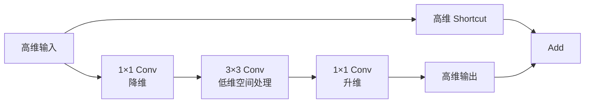

形状是：

```text
宽 → 窄 → 宽
```

例如：

```text
256 → 64 → 256
```

MobileNetV2：

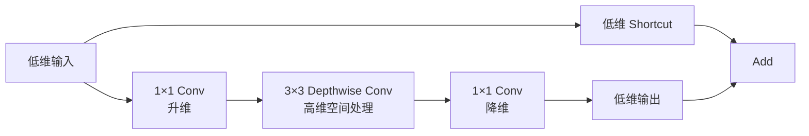

形状是：

```text
窄 → 宽 → 窄
```

例如：

```text
24 → 144 → 24
```

因此称为“倒残差”。

[Pasted image 20260721154402.png]
【Fig3】

论文 Figure 3 的关键区别正是：
- 传统 Bottleneck Residual 的 Shortcut 连接高维层；
- Inverted Residual 的 Shortcut 连接低维 Bottleneck。

[attachments/mobilenetv2_residual_comparison_3d.png]

### 6.6 为什么不能先压缩再 Depthwise

反事实结构：

```text
64 通道
→ 压缩到 16 通道
→ 16 通道 Depthwise Conv
→ 再恢复到 64 通道
```

问题是：

1. 空间卷积只在 16 个通道上运行；
    
2. Depthwise 不会跨通道创建新组合；
    
3. 如果压缩时已经丢失特征，后面无法依靠 Depthwise 找回来；
    
4. ReLU 在窄空间中进一步增加信息丢失风险。
    

MobileNetV2 改为：

```text
16 通道
→ 扩张到 96 通道
→ 96 通道 Depthwise Conv
→ 线性压缩到 16 通道
```

这样把非线性和空间处理放在高维空间中，把低维空间主要用于传输和保存信息。

## 7. Block 的计算量、ReLU6 与代码

### 7.1 Inverted Residual 的计算量

假设：

- 输入通道$C_{in}$；
    
- 输出通道$C_{out}$；
    
- 扩张倍率$t$；
    
- 卷积核$K\times K$；
    
- 空间尺寸$H\times W$。
    

第一层$1\times1$扩张卷积：

$$  
HW\times C_{in}\times tC_{in}  
$$

Depthwise 卷积：

$$  
HW\times tC_{in}\times K^2  
$$

最后$1\times1$投影卷积：

$$  
HW\times tC_{in}\times C_{out}  
$$

总计算量为：

$$  
\operatorname{Cost}_{\text{block}}

HWC_{in}t  
\left(  
C_{in}+K^2+C_{out}  
\right)  
$$

这与论文给出的 Block 计算公式一致。

需要注意：

> MobileNetV2 Block 比简单的 V1 深度可分离卷积多了一个$1\times1$扩张卷积。

所以它并不是“每个 Block 无条件比任何卷积都便宜”。

它的优势来自组合设计：

- 输入输出通道保持较窄；
    
- 昂贵的空间卷积使用 Depthwise；
    
- 高维特征只存在于 Block 内部；
    
- Shortcut 连接低维 Tensor。
    

### 7.2 Pointwise Conv 往往是主要计算量

以：

```text
H=W=56
Cin=Cout=24
t=6
K=3
```

为例。

扩张后的通道数：

$$  
24\times6=144  
$$

扩张$1\times1$卷积：

$$  
56\times56\times24\times144

10{,}838{,}016  
$$

Depthwise：

$$  
56\times56\times144\times9

4{,}064{,}256  
$$

投影$1\times1$卷积：

$$  
56\times56\times144\times24

10{,}838{,}016  
$$

可以看到，两次$1\times1$卷积占据了大部分计算量。

因此轻量网络中：

> Depthwise 很便宜，但 Pointwise 不便宜。

优化轻量网络时不能只盯着$3\times3$卷积，还要重点检查：

```text
1×1 Conv 的通道数
+
高分辨率阶段的通道扩张
```

[attachments/mobilenetv2_compute_breakdown_3d.png]

### 7.3 ReLU6

MobileNetV2 在扩张层和 Depthwise 层后使用 ReLU6：

$$  
f(x)

\min(\max(0,x),6)  
$$

```mermaid
xychart-beta
    title "ReLU6"
    x-axis [-3, -2, -1, 0, 1, 2, 3, 4, 5, 6, 7, 8]
    y-axis "f(x)" 0 --> 6
    line [0, 0, 0, 0, 1, 2, 3, 4, 5, 6, 6, 6]
```

特点：

```text
x<0：输出 0
0≤x≤6：输出 x
x>6：输出 6
```

论文选择 ReLU6，是因为它在低精度计算下具有更好的鲁棒性。

但最后的 Linear Bottleneck 不使用 ReLU6：

```text
Expand Conv → ReLU6
Depthwise Conv → ReLU6
Project Conv → Linear
```

### 7.4 PyTorch 代码

```python
import torch
import torch.nn as nn


class InvertedResidual(nn.Module):
    def __init__(
        self,
        in_channels: int,
        out_channels: int,
        stride: int,
        expansion_ratio: int = 6,
    ) -> None:
        super().__init__()

        if stride not in (1, 2):
            raise ValueError("stride must be 1 or 2")

        hidden_channels = in_channels * expansion_ratio

        self.use_residual = (
            stride == 1
            and in_channels == out_channels
        )

        layers = []

        # 1. 升维：跨通道融合
        if expansion_ratio != 1:
            layers.extend([
                nn.Conv2d(
                    in_channels,
                    hidden_channels,
                    kernel_size=1,
                    bias=False,
                ),
                nn.BatchNorm2d(hidden_channels),
                nn.ReLU6(inplace=True),
            ])

        # 2. Depthwise：每个通道独立做空间卷积
        layers.extend([
            nn.Conv2d(
                hidden_channels,
                hidden_channels,
                kernel_size=3,
                stride=stride,
                padding=1,
                groups=hidden_channels,
                bias=False,
            ),
            nn.BatchNorm2d(hidden_channels),
            nn.ReLU6(inplace=True),

            # 3. 线性压缩：不接 ReLU
            nn.Conv2d(
                hidden_channels,
                out_channels,
                kernel_size=1,
                bias=False,
            ),
            nn.BatchNorm2d(out_channels),
        ])

        self.block = nn.Sequential(*layers)

    def forward(self, x: torch.Tensor) -> torch.Tensor:
        output = self.block(x)

        if self.use_residual:
            return x + output

        return output
```

关键点有三个：

```python
groups=hidden_channels
```

表示 Depthwise Convolution。

```python
nn.Conv2d(
    hidden_channels,
    out_channels,
    kernel_size=1,
)
```

表示压缩回低维。

最后没有：

```python
nn.ReLU6()
```

这就是 Linear Bottleneck。

Shortcut 的条件是：

```python
stride == 1
and in_channels == out_channels
```

否则 Shape 不相同，不能直接相加。

## 8. 从 FLOPs 到真实端侧速度

### 8.1 FLOPs 降低为什么不保证更快

考虑两个模型：

```text
模型 A：
100 MAdds
算子高度优化
数据连续
Cache 命中率高

模型 B：
60 MAdds
大量小算子
频繁改变数据布局
算子不被芯片原生支持
频繁访问主内存
```

模型 B 的 FLOPs 更低，但可能运行得更慢。

真实延迟可以粗略理解为：

$$  
T_{\text{latency}}  
\approx  
T_{\text{compute}}  
+  
T_{\text{memory}}  
+  
T_{\text{schedule}}  
$$

其中：

- $T_{\text{compute}}$：计算耗时；
    
- $T_{\text{memory}}$：读写内存耗时；
    
- $T_{\text{schedule}}$：算子调度、同步和启动耗时。
    

### 8.2 Depthwise Conv 可能是内存受限算子

Depthwise Conv 的乘加次数很少，但每个权重只处理一个通道。

它的计算密度可能低于标准卷积：

```text
读取一批数据
→ 只做少量计算
→ 很快又要读取下一批数据
```

如果芯片对 Depthwise 没有专门优化，FLOPs 虽低，Latency 不一定按同样比例下降。

因此需要在目标芯片上实际测量：

```text
标准 Conv Latency
Depthwise Conv Latency
1×1 Conv Latency
整块 Inverted Residual Latency
```

### 8.3 倒残差为什么有利于内存

传统残差连接需要保留 Shortcut 输入，直到主分支计算完成。

如果 Shortcut 连接的是高维特征：

```text
[B,256,H,W]
```

就必须长时间保留一个较大的 Tensor。

MobileNetV2 的 Shortcut 连接低维 Bottleneck：

```text
[B,24,H,W]
```

需要长期保留的 Tensor 更小。

论文 Table 3 在假设激活使用 16-bit 的情况下，对比了不同网络在各分辨率下需要物化的最大中间特征；其比较中 MobileNetV2 最大约为 400 KB，而 MobileNetV1 约为 1600 KB。

例如：

```text
112×112×64×2 Bytes
≈1.6 MB

112×112×16×2 Bytes
≈0.4 MB
```

这正好对应：

```text
高维端点
与
低维 Bottleneck 端点
```

### 8.4 扩张层不是也很大吗

是的。

例如：

```text
输入 Bottleneck：16 通道
扩张倍率：6
内部特征：96 通道
```

如果框架把完整的 96 通道 Tensor 全部保存下来，它会占用很大内存。

MobileNetV2 论文指出，由于内部操作包含逐通道变换，可以把高维中间 Tensor 分块计算并逐步累加，从而不需要一次完整物化全部扩张特征。

但是这依赖推理实现。

在普通训练框架中，可能仍然出现：

```text
Expand 输出完整写入内存
→ Depthwise 读取
→ 完整结果再次写入
→ Projection 再读取
```

所以必须区分：

```text
结构理论上支持低内存
        与
当前编译器是否真的实现融合和分块
```

### 8.5 过度拆分也可能变慢

论文还指出，把一次大的矩阵乘法拆成很多小矩阵乘法，虽然乘加次数不变，却可能因为 Cache Miss 增多而损害运行速度。论文建议分块数量保持为较小常数，在内存节省和高效矩阵计算之间折中。

这说明：

> 轻量化不是把算子拆得越碎越好，而是要让算子形态符合芯片和编译器最擅长的执行方式。


## 9. 一句话总结

**MobileNetV2 的核心不是单纯减少卷积，而是用 Depthwise Convolution 降低空间计算，用高维 Expansion 承载非线性特征提取，用 Linear Bottleneck 保存低维信息，再让 Residual Shortcut 只连接窄特征，从而同时控制计算量、信息损失和端侧内存开销。**


# TAG: Matplot code


```run-python
import matplotlib.pyplot as plt
from mpl_toolkits.mplot3d.art3d import Poly3DCollection
from pathlib import Path

save_path = Path(r"D:\user\notes\blu-obsidian-main\2 Notes\AI\0 Paper\CV\attachments\mobilenetv2_memory_hierarchy_3d.png")
save_path.parent.mkdir(parents=True, exist_ok=True)

def add_box(ax, origin, size, facecolor, edgecolor, alpha=0.9):
    x, y, z = origin
    dx, dy, dz = size
    vertices = [
        (x, y, z), (x + dx, y, z), (x + dx, y + dy, z), (x, y + dy, z),
        (x, y, z + dz), (x + dx, y, z + dz), (x + dx, y + dy, z + dz), (x, y + dy, z + dz),
    ]
    faces = [
        [vertices[i] for i in [0, 1, 2, 3]],
        [vertices[i] for i in [4, 5, 6, 7]],
        [vertices[i] for i in [0, 1, 5, 4]],
        [vertices[i] for i in [1, 2, 6, 5]],
        [vertices[i] for i in [2, 3, 7, 6]],
        [vertices[i] for i in [3, 0, 4, 7]],
    ]
    poly = Poly3DCollection(faces, facecolors=facecolor, edgecolors=edgecolor, linewidths=1.0, alpha=alpha)
    ax.add_collection3d(poly)

fig = plt.figure(figsize=(11, 7))
ax = fig.add_subplot(111, projection="3d")

blue_dark = "#345995"
blue_mid = "#5f83c2"
blue_light = "#b8cae8"
red = "#d95f59"
edge = "#2f3e56"

levels = [
    ((0.0, 0.0, 0.0), (8.0, 5.0, 0.8), blue_light),
    ((1.2, 0.8, 1.7), (5.6, 3.4, 0.8), blue_mid),
    ((2.5, 1.6, 3.4), (3.0, 1.8, 0.8), blue_dark),
]

for origin, size, color in levels:
    add_box(ax, origin, size, color, edge, 0.92)

ax.text2D(0.72, 0.64, "Compute array", transform=ax.transAxes, fontsize=11, weight="bold")
ax.text2D(0.72, 0.60, "Multiply-accumulate units", transform=ax.transAxes, fontsize=8.5)
ax.text2D(0.76, 0.48, "Cache / SRAM", transform=ax.transAxes, fontsize=11, weight="bold")
ax.text2D(0.76, 0.44, "Small capacity, fast access", transform=ax.transAxes, fontsize=8.5)
ax.text2D(0.80, 0.31, "Main memory", transform=ax.transAxes, fontsize=11, weight="bold")
ax.text2D(0.80, 0.27, "Large capacity, high transfer cost", transform=ax.transAxes, fontsize=8.5)

for start, end in [
    ((4.0, 2.5, 0.85), (4.0, 2.5, 1.65)),
    ((4.0, 2.5, 2.55), (4.0, 2.5, 3.35)),
]:
    sx, sy, sz = start
    ex, ey, ez = end
    ax.quiver(sx, sy, sz, ex - sx, ey - sy, ez - sz, color=red, linewidth=2.2, arrow_length_ratio=0.25)
    ax.quiver(ex + 0.35, ey, ez, sx + 0.35 - ex, sy - ey, sz - ez, color=red, linewidth=1.4, arrow_length_ratio=0.25, alpha=0.75)

for offset in [0.0, 0.55, 1.1]:
    add_box(ax, (0.7 + offset, 0.55, 0.82), (0.4, 0.4, 0.35), red, edge, 0.85)
for offset in [0.0, 0.55]:
    add_box(ax, (2.0 + offset, 1.25, 2.52), (0.4, 0.4, 0.35), red, edge, 0.85)


ax.set_xlim(-0.3, 11.0)
ax.set_ylim(-0.3, 6.2)
ax.set_zlim(0.0, 4.9)
ax.view_init(elev=23, azim=-57)
ax.set_title("Memory hierarchy behind mobile inference", pad=18, fontsize=15, weight="bold")
ax.set_axis_off()

plt.savefig(save_path, dpi=180, bbox_inches="tight", facecolor="white")
plt.close()
print("OK")
```

```run-python
import matplotlib.pyplot as plt
from mpl_toolkits.mplot3d.art3d import Poly3DCollection
from pathlib import Path

save_path = Path(r"D:\user\notes\blu-obsidian-main\2 Notes\AI\0 Paper\CV\attachments\mobilenetv2_conv_factorization_3d.png")
save_path.parent.mkdir(parents=True, exist_ok=True)

def add_plate(ax, x, y, z, width, height, depth, color, edge, alpha=0.9):
    vertices = [
        (x, y, z), (x + depth, y, z), (x + depth, y + width, z), (x, y + width, z),
        (x, y, z + height), (x + depth, y, z + height), (x + depth, y + width, z + height), (x, y + width, z + height),
    ]
    faces = [
        [vertices[i] for i in [0, 1, 2, 3]],
        [vertices[i] for i in [4, 5, 6, 7]],
        [vertices[i] for i in [0, 1, 5, 4]],
        [vertices[i] for i in [1, 2, 6, 5]],
        [vertices[i] for i in [2, 3, 7, 6]],
        [vertices[i] for i in [3, 0, 4, 7]],
    ]
    ax.add_collection3d(Poly3DCollection(faces, facecolors=color, edgecolors=edge, linewidths=0.8, alpha=alpha))

def draw_stack(ax, x, count, color, y0=0.0, z0=0.0):
    for c in range(count):
        add_plate(ax, x, y0 + c * 0.17, z0 + c * 0.13, 2.6, 2.6, 0.10, color, "#2f3e56", 0.82)

def connect(ax, x0, y0, z0, x1, y1, z1, color, alpha=0.35, width=0.8):
    ax.plot([x0, x1], [y0, y1], [z0, z1], color=color, alpha=alpha, linewidth=width)

fig = plt.figure(figsize=(13, 6))
blue = "#4b74b8"
blue_light = "#a8bfe3"
red = "#d95f59"
edge = "#2f3e56"

ax1 = fig.add_subplot(121, projection="3d")
draw_stack(ax1, 0.0, 4, blue)
draw_stack(ax1, 5.0, 4, blue_light)
for i in range(4):
    for j in range(4):
        connect(ax1, 0.12, 1.3 + i * 0.17, 1.3 + i * 0.13, 5.0, 1.3 + j * 0.17, 1.3 + j * 0.13, red, 0.24, 0.9)
add_plate(ax1, 2.35, 1.1, 1.1, 0.8, 0.8, 0.28, red, edge, 0.9)
ax1.text2D(0.05, 0.12, "Input channels", transform=ax1.transAxes, fontsize=10, weight="bold")
ax1.text2D(0.69, 0.12, "Output channels", transform=ax1.transAxes, fontsize=10, weight="bold")
ax1.set_title("Standard convolution", pad=12, fontsize=13, weight="bold")
ax1.set_xlim(-0.5, 6.0)
ax1.set_ylim(-0.3, 3.5)
ax1.set_zlim(-0.9, 4.2)
ax1.view_init(elev=22, azim=-58)
ax1.set_axis_off()

ax2 = fig.add_subplot(122, projection="3d")
draw_stack(ax2, 0.0, 4, blue)
draw_stack(ax2, 3.0, 4, blue)
draw_stack(ax2, 6.0, 4, blue_light)
for i in range(4):
    connect(ax2, 0.12, 1.3 + i * 0.17, 1.3 + i * 0.13, 3.0, 1.3 + i * 0.17, 1.3 + i * 0.13, red, 0.8, 1.3)
for i in range(4):
    for j in range(4):
        connect(ax2, 3.12, 1.3 + i * 0.17, 1.3 + i * 0.13, 6.0, 1.3 + j * 0.17, 1.3 + j * 0.13, red, 0.20, 0.8)
add_plate(ax2, 1.3, 1.15, 1.15, 0.7, 0.7, 0.24, red, edge, 0.9)
add_plate(ax2, 4.45, 1.15, 1.15, 0.7, 0.7, 0.24, red, edge, 0.9)
ax2.text2D(0.02, 0.12, "Input", transform=ax2.transAxes, fontsize=10, weight="bold")
ax2.text2D(0.34, 0.12, "Depthwise output", transform=ax2.transAxes, fontsize=10, weight="bold")
ax2.text2D(0.70, 0.12, "Pointwise output", transform=ax2.transAxes, fontsize=10, weight="bold")
ax2.set_title("Depthwise separable convolution", pad=12, fontsize=13, weight="bold")
ax2.set_xlim(-0.5, 7.0)
ax2.set_ylim(-0.3, 3.5)
ax2.set_zlim(-0.9, 4.2)
ax2.view_init(elev=22, azim=-58)
ax2.set_axis_off()

fig.suptitle("Factorizing spatial filtering and channel mixing", fontsize=16, weight="bold", y=0.98)
plt.savefig(save_path, dpi=180, bbox_inches="tight", facecolor="white")
plt.close()
print("OK")
```

```run-python
import matplotlib.pyplot as plt
import numpy as np
from pathlib import Path

save_path = Path(r"D:\user\notes\blu-obsidian-main\2 Notes\AI\0 Paper\CV\attachments\mobilenetv2_group_connectivity_3d.png")
save_path.parent.mkdir(parents=True, exist_ok=True)

channels = 8
patterns = []

dense = np.ones((channels, channels))
patterns.append(("Standard convolution", dense))

grouped = np.zeros((channels, channels))
grouped[:4, :4] = 1
grouped[4:, 4:] = 1
patterns.append(("Group convolution, g=2", grouped))

depthwise = np.eye(channels)
patterns.append(("Depthwise convolution", depthwise))

fig = plt.figure(figsize=(14, 5))
for index, (title, matrix) in enumerate(patterns, start=1):
    ax = fig.add_subplot(1, 3, index, projection="3d")
    xs, ys = np.meshgrid(np.arange(channels), np.arange(channels), indexing="ij")
    active = matrix.ravel() > 0
    xpos = xs.ravel()[active]
    ypos = ys.ravel()[active]
    zpos = np.zeros_like(xpos, dtype=float)
    dx = np.full_like(xpos, 0.72, dtype=float)
    dy = np.full_like(ypos, 0.72, dtype=float)
    dz = np.full_like(xpos, 1.0, dtype=float)
    ax.bar3d(xpos, ypos, zpos, dx, dy, dz, color="#4b74b8", edgecolor="#2f3e56", alpha=0.9, shade=True)
    ax.set_xlabel("Input channel", labelpad=8)
    ax.set_ylabel("Output channel", labelpad=8)
    ax.set_zlabel("Connection", labelpad=5)
    ax.set_xticks(range(channels))
    ax.set_yticks(range(channels))
    ax.set_zticks([0, 1])
    ax.set_zlim(0, 1.3)
    ax.view_init(elev=32, azim=-52)
    ax.set_title(title, pad=12, fontsize=12, weight="bold")
    ax.grid(False)

fig.suptitle("Channel connectivity becomes progressively sparse", fontsize=16, weight="bold", y=1.02)
plt.savefig(save_path, dpi=180, bbox_inches="tight", facecolor="white")
plt.close()
print("OK")
```

```run-python
import matplotlib.pyplot as plt
import numpy as np
from pathlib import Path

save_path = Path(r"D:\user\notes\blu-obsidian-main\2 Notes\AI\0 Paper\CV\attachments\mobilenetv2_relu_manifold_3d.png")
save_path.parent.mkdir(parents=True, exist_ok=True)

rng = np.random.default_rng(7)
t = np.linspace(0.15, 4.6 * np.pi, 500)
radius = np.linspace(0.08, 1.0, t.size)
source = np.vstack([radius * np.cos(t), radius * np.sin(t)])

transform = np.array([
    [1.05, -0.55],
    [0.35, 1.15],
    [-0.85, 0.45],
])
embedded = transform @ source
activated = np.maximum(embedded, 0.0)
recovered = np.linalg.pinv(transform) @ activated

colors = t

fig = plt.figure(figsize=(15, 5))

ax1 = fig.add_subplot(131, projection="3d")
ax1.scatter(source[0], source[1], np.zeros_like(t), c=colors, cmap="coolwarm", s=7)
ax1.plot(source[0], source[1], np.zeros_like(t), color="#4b74b8", linewidth=1.2, alpha=0.7)
ax1.set_title("Low-dimensional manifold", pad=12, fontsize=12, weight="bold")
ax1.set_xlabel("Feature 1")
ax1.set_ylabel("Feature 2")
ax1.set_zlabel("")

ax2 = fig.add_subplot(132, projection="3d")
ax2.scatter(embedded[0], embedded[1], embedded[2], c=colors, cmap="coolwarm", s=7)
ax2.plot(embedded[0], embedded[1], embedded[2], color="#4b74b8", linewidth=1.0, alpha=0.6)
grid = np.linspace(-1.2, 1.2, 8)
yy, zz = np.meshgrid(grid, grid)
xx = np.zeros_like(yy)
ax2.plot_surface(xx, yy, zz, color="#d95f59", alpha=0.10, linewidth=0)
ax2.set_title("Embedded in a wider space", pad=12, fontsize=12, weight="bold")
ax2.set_xlabel("Channel 1")
ax2.set_ylabel("Channel 2")
ax2.set_zlabel("Channel 3")

ax3 = fig.add_subplot(133, projection="3d")
ax3.scatter(recovered[0], recovered[1], np.zeros_like(t), c=colors, cmap="coolwarm", s=7)
ax3.plot(recovered[0], recovered[1], np.zeros_like(t), color="#d95f59", linewidth=1.0, alpha=0.7)
collapsed = np.sum(np.linalg.norm(np.diff(recovered, axis=1), axis=0) < 1e-4)
ax3.text(0.0, 0.0, 0.45, "ReLU clips negative coordinates", ha="center", fontsize=9)
ax3.set_title("Projected back after ReLU", pad=12, fontsize=12, weight="bold")
ax3.set_xlabel("Recovered 1")
ax3.set_ylabel("Recovered 2")
ax3.set_zlabel("")

for ax in [ax1, ax2, ax3]:
    ax.view_init(elev=26, azim=-55)
    ax.grid(False)

fig.suptitle("Why narrow ReLU layers can collapse information", fontsize=16, weight="bold", y=1.02)
plt.savefig(save_path, dpi=180, bbox_inches="tight", facecolor="white")
plt.close()
print("OK")
```

```run-python
import matplotlib.pyplot as plt
import numpy as np
from mpl_toolkits.mplot3d.art3d import Poly3DCollection
from pathlib import Path

save_path = Path(r"D:\user\notes\blu-obsidian-main\2 Notes\AI\0 Paper\CV\attachments\mobilenetv2_block_evolution_3d.png")
save_path.parent.mkdir(parents=True, exist_ok=True)

def add_layer(ax, x, channels, color, linear=False):
    depth = 0.35 + channels * 0.035
    y = -depth / 2
    z = -channels * 0.018
    width = 0.22
    height = 1.3 + channels * 0.028
    vertices = [
        (x, y, z), (x + width, y, z), (x + width, y + depth, z), (x, y + depth, z),
        (x, y, z + height), (x + width, y, z + height), (x + width, y + depth, z + height), (x, y + depth, z + height),
    ]
    faces = [
        [vertices[i] for i in [0, 1, 2, 3]],
        [vertices[i] for i in [4, 5, 6, 7]],
        [vertices[i] for i in [0, 1, 5, 4]],
        [vertices[i] for i in [1, 2, 6, 5]],
        [vertices[i] for i in [2, 3, 7, 6]],
        [vertices[i] for i in [3, 0, 4, 7]],
    ]
    hatch = "///" if linear else None
    poly = Poly3DCollection(faces, facecolors=color, edgecolors="#2f3e56", linewidths=0.9, alpha=0.88, hatch=hatch)
    ax.add_collection3d(poly)
    return x + width / 2, 0.0, z + height / 2

def connect(ax, start, end, color="#d95f59"):
    sx, sy, sz = start
    ex, ey, ez = end
    ax.plot([sx, ex], [sy, ey], [sz, ez], color=color, linewidth=2.0, alpha=0.8)

designs = [
    ("Regular", [64, 64], [False, False]),
    ("Separable", [64, 64, 64], [False, False, False]),
    ("Linear bottleneck", [64, 24, 64], [False, True, False]),
    ("Expansion block", [24, 144, 24], [True, False, True]),
]

fig = plt.figure(figsize=(13, 9))
for idx, (title, channels, linear_flags) in enumerate(designs, start=1):
    ax = fig.add_subplot(2, 2, idx, projection="3d")
    points = []
    xs = np.linspace(0.0, 4.5, len(channels))
    for x, c, linear in zip(xs, channels, linear_flags):
        color = "#4b74b8" if c > 32 else "#b8cae8"
        points.append(add_layer(ax, x, c, color, linear))
    for p0, p1 in zip(points[:-1], points[1:]):
        connect(ax, p0, p1)
    for x, c in zip(xs, channels):
        ax.text(x + 0.1, 0.0, 2.6, str(c) + " ch", ha="center", fontsize=9)
    ax.set_title(title, pad=10, fontsize=12, weight="bold")
    ax.set_xlim(-0.5, 5.2)
    ax.set_ylim(-3.2, 3.2)
    ax.set_zlim(-1.0, 3.2)
    ax.view_init(elev=22, azim=-58)
    ax.set_axis_off()

fig.suptitle("Evolution from regular convolution to an expansion bottleneck", fontsize=16, weight="bold", y=0.98)
plt.savefig(save_path, dpi=180, bbox_inches="tight", facecolor="white")
plt.close()
print("OK")
```

```run-python
import matplotlib.pyplot as plt
import numpy as np
from mpl_toolkits.mplot3d.art3d import Poly3DCollection
from pathlib import Path

save_path = Path(r"D:\user\notes\blu-obsidian-main\2 Notes\AI\0 Paper\CV\attachments\mobilenetv2_residual_comparison_3d.png")
save_path.parent.mkdir(parents=True, exist_ok=True)

def add_layer(ax, x, channels, color, linear=False):
    depth = 0.55 + channels * 0.012
    height = 1.4 + channels * 0.008
    width = 0.28
    y = -depth / 2
    z = -height / 2
    vertices = [
        (x, y, z), (x + width, y, z), (x + width, y + depth, z), (x, y + depth, z),
        (x, y, z + height), (x + width, y, z + height), (x + width, y + depth, z + height), (x, y + depth, z + height),
    ]
    faces = [
        [vertices[i] for i in [0, 1, 2, 3]],
        [vertices[i] for i in [4, 5, 6, 7]],
        [vertices[i] for i in [0, 1, 5, 4]],
        [vertices[i] for i in [1, 2, 6, 5]],
        [vertices[i] for i in [2, 3, 7, 6]],
        [vertices[i] for i in [3, 0, 4, 7]],
    ]
    poly = Poly3DCollection(
        faces,
        facecolors=color,
        edgecolors="#2f3e56",
        linewidths=0.9,
        alpha=0.90,
        hatch="///" if linear else None,
    )
    ax.add_collection3d(poly)
    return np.array([x + width / 2, 0.0, 0.0])

def draw_skip(ax, start, end, lift, color):
    t = np.linspace(0.0, 1.0, 120)
    x = start[0] + (end[0] - start[0]) * t
    y = np.full_like(t, -lift)
    z = 4.0 * lift * t * (1.0 - t)
    ax.plot(x, y, z, color=color, linewidth=2.2)
    ax.quiver(x[-2], y[-2], z[-2], x[-1] - x[-2], y[-1] - y[-2], z[-1] - z[-2], color=color, arrow_length_ratio=0.5)

def draw_block(ax, title, channels, inverted):
    xs = [0.0, 2.2, 4.4]
    points = []
    for idx, (x, c) in enumerate(zip(xs, channels)):
        linear = inverted and idx in [0, 2]
        color = "#b8cae8" if c <= 32 else "#4b74b8"
        points.append(add_layer(ax, x, c, color, linear))
        ax.text(x + 0.14, 0.0, 2.15, str(c) + " ch", ha="center", fontsize=9)
    for p0, p1 in zip(points[:-1], points[1:]):
        ax.plot([p0[0], p1[0]], [0.0, 0.0], [0.0, 0.0], color="#d95f59", linewidth=2.0)
    draw_skip(ax, points[0], points[-1], 2.1 if inverted else 3.0, "#2f3e56")
    ax.text(2.2, -2.5 if inverted else -3.4, 1.9, "Shortcut", ha="center", fontsize=9)
    ax.set_title(title, pad=12, fontsize=13, weight="bold")
    ax.set_xlim(-0.6, 5.2)
    ax.set_ylim(-4.2, 3.6)
    ax.set_zlim(-2.2, 3.0)
    ax.view_init(elev=23, azim=-58)
    ax.set_axis_off()

fig = plt.figure(figsize=(13, 6))
ax1 = fig.add_subplot(121, projection="3d")
draw_block(ax1, "Classic residual bottleneck", [256, 64, 256], False)

ax2 = fig.add_subplot(122, projection="3d")
draw_block(ax2, "MobileNetV2 inverted residual", [24, 144, 24], True)

fig.suptitle("The shortcut moves from wide layers to thin bottlenecks", fontsize=16, weight="bold", y=0.98)
plt.savefig(save_path, dpi=180, bbox_inches="tight", facecolor="white")
plt.close()
print("OK")
```

```run-python
import matplotlib.pyplot as plt
import numpy as np
from pathlib import Path

save_path = Path(r"D:\user\notes\blu-obsidian-main\2 Notes\AI\0 Paper\CV\attachments\mobilenetv2_compute_breakdown_3d.png")
save_path.parent.mkdir(parents=True, exist_ok=True)

height = 56
width = 56
cin = 24
cout = 24
kernel = 3
ratios = np.array([1, 2, 4, 6, 8], dtype=int)
stages = ["Expand 1x1", "Depthwise 3x3", "Project 1x1"]

values = []
for ratio in ratios:
    hidden = cin * ratio
    expand = height * width * cin * hidden / 1e6
    depthwise = height * width * hidden * kernel * kernel / 1e6
    project = height * width * hidden * cout / 1e6
    values.append([expand, depthwise, project])
values = np.array(values)

fig = plt.figure(figsize=(11, 7))
ax = fig.add_subplot(111, projection="3d")

stage_colors = ["#4b74b8", "#d95f59", "#9bb5dd"]
for x_index, ratio in enumerate(ratios):
    for y_index, stage in enumerate(stages):
        ax.bar3d(
            x_index - 0.32,
            y_index - 0.32,
            0.0,
            0.64,
            0.64,
            values[x_index, y_index],
            color=stage_colors[y_index],
            edgecolor="#2f3e56",
            alpha=0.92,
            shade=True,
        )

ax.set_xticks(np.arange(len(ratios)))
ax.set_xticklabels(["t=" + str(v) for v in ratios])
ax.set_yticks(np.arange(len(stages)))
ax.set_yticklabels(stages)
ax.set_zlabel("MAdds")
ax.set_xlabel("Expansion ratio")
ax.set_ylabel("Block stage")
ax.set_title("Where MobileNetV2 block computation is spent", pad=18, fontsize=15, weight="bold")
ax.view_init(elev=28, azim=-55)
ax.grid(False)

plt.savefig(save_path, dpi=180, bbox_inches="tight", facecolor="white")
plt.close()
print("OK")
```

```run-python
import matplotlib.pyplot as plt
import numpy as np
from pathlib import Path

save_path = Path(r"D:\user\notes\blu-obsidian-main\2 Notes\AI\0 Paper\CV\attachments\mobilenetv2_tensor_lifetime_3d.png")
save_path.parent.mkdir(parents=True, exist_ok=True)

def draw_lifetimes(ax, title, tensors):
    colors = ["#4b74b8", "#9bb5dd", "#d95f59", "#b8cae8"]
    for idx, item in enumerate(tensors):
        name, start, duration, memory = item
        ax.bar3d(
            start,
            idx - 0.30,
            0.0,
            duration,
            0.60,
            memory,
            color=colors[idx % len(colors)],
            edgecolor="#2f3e56",
            alpha=0.9,
            shade=True,
        )
        ax.text(start + duration / 2, idx, memory + 0.08, str(memory) + " MB", ha="center", fontsize=8)
    ax.set_yticks(np.arange(len(tensors)))
    ax.set_yticklabels([item[0] for item in tensors])
    ax.set_xlabel("Execution stage")
    ax.set_zlabel("Tensor size")
    ax.set_xlim(0, 4.2)
    ax.set_zlim(0, 2.8)
    ax.set_title(title, pad=12, fontsize=12, weight="bold")
    ax.view_init(elev=27, azim=-56)
    ax.grid(False)

classic = [
    ("Wide shortcut", 0.0, 4.0, 1.6),
    ("Reduced feature", 0.7, 1.2, 0.4),
    ("Spatial feature", 1.8, 1.2, 0.4),
    ("Expanded output", 2.9, 0.9, 1.6),
]

inverted = [
    ("Thin shortcut", 0.0, 4.0, 0.4),
    ("Expanded feature", 0.7, 1.0, 2.4),
    ("Depthwise feature", 1.7, 1.0, 2.4),
    ("Projected output", 2.8, 0.9, 0.4),
]

fig = plt.figure(figsize=(13, 6))
ax1 = fig.add_subplot(121, projection="3d")
draw_lifetimes(ax1, "Classic residual tensor lifetime", classic)

ax2 = fig.add_subplot(122, projection="3d")
draw_lifetimes(ax2, "Inverted residual tensor lifetime", inverted)

fig.suptitle("Peak memory depends on tensor size and lifetime", fontsize=16, weight="bold", y=0.98)
plt.savefig(save_path, dpi=180, bbox_inches="tight", facecolor="white")
plt.close()
print("OK")
```