# Knowledge Distillation: A Survey 

> 论文：Jianping Gou, Baosheng Yu, Stephen J. Maybank, Dacheng Tao, _Knowledge Distillation: A Survey_，arXiv:2006.05525。
> 
> 本文不再重复 Hinton 2015 中已讨论过的 Temperature、Soft Target、Dark Knowledge、$T^2$ 与经典 KD Loss，而是回答一个更大的问题：
> 
> **当“模仿 Teacher 的输出概率”不再是唯一选择时，一个完整的 Knowledge Distillation 系统还能怎么设计？**

Survey 将 KD 的核心组织为 **Knowledge、Distillation Scheme、Teacher–Student Architecture 和 Distillation Algorithm**，并进一步讨论应用、挑战与未来方向。

---

# 1 从经典 KD 到完整 KD 设计空间

经典知识蒸馏可以压缩成：

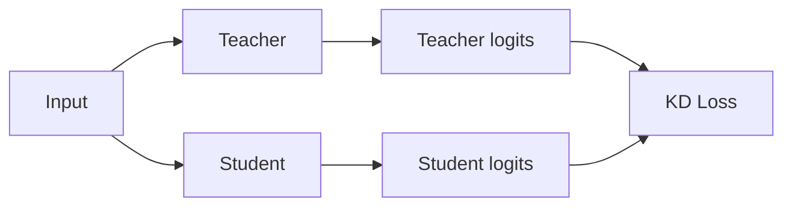

此前了解的 Hinton KD，本质上解决的是：
> **怎样让 Student 的最终预测行为接近 Teacher？**

Survey 把这一类方法称为 **Response-Based Knowledge（基于响应的知识：将网络最终输出作为知识，让 Student 模仿 Teacher 的最终预测）**。论文指出，这种方法简单有效，但只利用最后一层输出，因此不能直接监督 Student 的中间表示。

由此产生第一个自然问题：
```text
Teacher 已经经过很多层计算：

Input
  ↓
浅层特征
  ↓
中层特征
  ↓
高层特征
  ↓
Output

为什么只把最后一个 Output 交给 Student？
```

于是 KD 从“模仿答案”逐渐扩展为：
```text
模仿最终答案
      ↓
模仿中间表示
      ↓
模仿表示之间的关系
```

同时，“谁来做 Teacher”也不再固定：
```text
预训练 Teacher → Student

可以扩展成：
多个模型互相学习
同一个模型自己教自己
多个 Teacher 共同教一个 Student
不同模态之间传知识
```

论文因此把一个 KD 系统视为若干相互关联的设计问题：
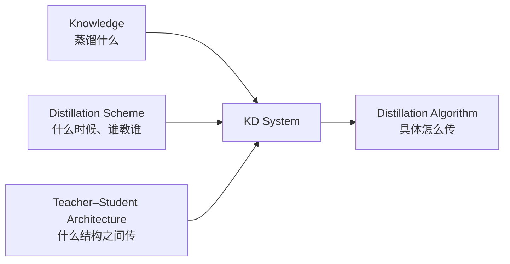

真正需要从 Survey 中获得的不是九种、十几种算法名称，而是一套以后看到任何 KD 论文都能使用的分析框架：
> **先问它蒸馏什么 Knowledge，再问 Teacher 与 Student 是谁、何时训练，最后才看它用了什么 Loss 或特殊算法。**

### 本章总结
Hinton KD 只是整个知识蒸馏设计空间中的 **Response-Based KD**。Survey 真正扩展的是三个维度：**知识可以不只是输出；Teacher 不一定预训练并冻结；Teacher 与 Student 的结构关系本身也是蒸馏效果的重要组成部分。**

---

# 2 Knowledge：Teacher 到底可以教什么

Survey 将知识分为三大类：

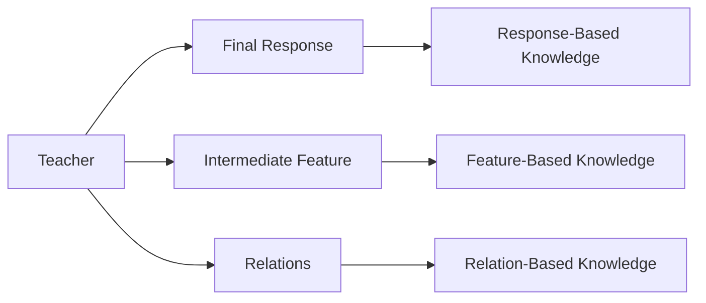

这三种知识并不互斥。实际 KD 可以同时使用多种知识。论文最后也将“不同知识如何互补、如何统一建模”列为尚未完全解决的问题。

## 2.1 Response-Based：模仿 Teacher 最后的判断

这一部分只是承接。
对于分类：
```text
Teacher logits
      ↓
Soft probability
      ↓
Student mimic
```

对于别的任务，“Response”不一定是分类概率。例如 Survey 指出，Object Detection 的最终响应还可以包含 Bounding Box Offset，Landmark Localization 可以蒸馏 Heatmap。

所以更准确地说：
> **Response-Based KD 蒸馏的是模型最后输出的任务结果，而不是专指 Softmax。**

但它存在一个根本限制：
```text
Teacher：
Input → A → B → C → Output

Student：
Input → a → b → Output

Response KD 只要求：

Output_student ≈ Output_teacher
```

至于 Student 中间应该怎样形成有用表示，则没有直接监督。

这正是 Feature-Based KD 出现的原因。

# 2.2 Feature-Based Knowledge：直接学习 Teacher 的中间表示

深度网络的中间 Feature 并不是无意义的过渡结果。

随着网络加深，表示通常从：

```text
浅层
边缘 / 局部模式
      ↓
中层
纹理 / 结构
      ↓
深层
更抽象的任务表示
```

逐步变化。

因此，与其只告诉 Student 最终答案应该是什么，还可以进一步告诉它：**中间过程最好形成什么样的表示。**

Survey 将这类方法概括为 **Feature-Based Knowledge（基于特征的知识：使用 Teacher 中间层 Feature Map 监督 Student 的中间表示）**，并指出 FitNets 的 Hint Learning 是这一方向的重要早期形式。

## 2.3 最简单的 Feature Matching

假设：

$$
F_t=T_l(x)
$$

是 Teacher 第 $l$ 层 Feature：

$$
F_s=S_k(x)
$$

是 Student 第 $k$ 层 Feature。

最直观的方法是：

$$
L_{feature} |F_t-F_s|_2^2
$$

意思就是：
```text
Teacher Feature
      ↓
     比较
      ↑
Student Feature
```

如果能够做到：
$$
F_s\approx F_t
$$

Student 不必只从最终 Loss 中“猜”中间表示应如何组织，而是直接得到 Teacher 已经学好的表示作为额外监督。

# 2.4 但 Teacher 和 Student 的 Feature 往往根本不能直接比较

实际中常见：
```text
Teacher Feature：
256 × 64 × 64

Student Feature：
96 × 64 × 64
```

直接写：

$$
F_t-F_s
$$

根本无法计算。

甚至可能出现：
```text
Teacher：
256 × 64 × 64

Student：
96 × 32 × 32
```

连 Channel 和空间分辨率都不同。

因此 Survey 给出更一般的 Feature Distillation 形式：
$$
L_{FeaD} L_F \left( \Phi_t(F_t), \Phi_s(F_s) \right)
$$

其中：
- $F_t,F_s$：Teacher / Student Feature；
- $\Phi_t,\Phi_s$：Feature Transformation（特征变换：将两边 Feature 映射到可比较的表示空间）；
- $L_F$：两种表示之间的距离。

这一步非常关键。

Feature KD 并不是简单地说一句：“拿两个 Feature 做 MSE。”

完整逻辑是：

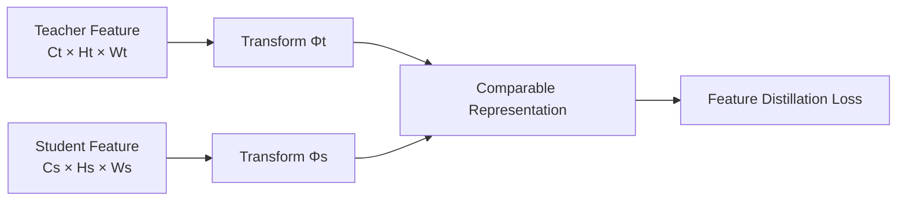

## 2.5 $\Phi$ 到底可以是什么

比如 Teacher：
```text
256 × 64 × 64
```

Student：
```text
96 × 64 × 64
```

可以对 Student 使用一个 $1\times1$ Conv：
```text
96 × 64 × 64
      ↓
1×1 Conv
      ↓
256 × 64 × 64
```

再计算：
$$
L_{feature} | F_t-\Phi_s(F_s) |_2^2
$$

PyTorch 的核心逻辑可以非常简单：
```python
import torch.nn as nn
import torch.nn.functional as F

class FeatureAdapter(nn.Module):
    def __init__(self, student_channels, teacher_channels):
        super().__init__()
        self.proj = nn.Conv2d(
            student_channels,
            teacher_channels,
            kernel_size=1
        )

    def forward(self, student_feature, teacher_feature):
        aligned = self.proj(student_feature)
        return F.mse_loss(aligned, teacher_feature)
```

这里真正训练的不只是 Student Backbone。

`1×1 Conv` 本身也是一个可学习 Projection：
```text
Student representation
       ↓
learnable mapping
       ↓
Teacher representation space
```

这与之前学习 CNN 时 `1×1 Conv` 做 Channel Projection 的作用是一致的。

# 2.6 Feature KD 有两个比 Loss 更重要的问题

Survey 明确指出 Feature-Based KD 的两个核心难点：
1. **Teacher 哪一层应该作为 Hint Layer？**
2. **Teacher 和 Student 不同 Shape、不同语义层级的 Feature 如何正确匹配？**

例如：

```text
Teacher 20层
Student 8层
```

不能机械地规定：
```text
Teacher Layer 10
↔
Student Layer 4
```

因为虽然空间分辨率可能一样，但两层 Feature 的语义成熟程度不一定相同。

所以 Feature KD 实际上有两个设计：
```text
Where：
哪一层对哪一层？

How：
对齐后怎么比较？
```

这两个问题后面会和 Teacher–Student Architecture 重新连接起来。

# 2.7 Relation-Based Knowledge：不要求 Feature 一模一样

Feature KD 的目标通常类似：

$$
F_s\approx F_t
$$

但如果 Teacher 和 Student 结构差异很大，这个要求可能太强。

假设 Teacher：
```text
Feature A = [1.2, 0.7, -0.1, ...]
Feature B = [...]
```

Student：
```text
Feature A = 完全不同坐标系
Feature B = 完全不同坐标系
```

虽然数值不同，但它们可能仍然保持：
```text
A 与 B 很接近
A 与 C 很远
B 与 C 适中
```

也就是说，真正有用的知识可能不是：

> 每个 Feature 值是多少。

而是：
> **不同表示之间的关系是什么。**

这就是 **Relation-Based Knowledge（关系知识：不直接匹配单个表示，而是匹配层、Feature 或样本之间的关系结构）**。Survey 明确将 Feature Map 之间以及 Data Sample 之间的关系都归入这一类别。

## 2.8 Relation-Based Knowledge：不学 Feature 本身，而学 Feature 之间的关系

先回到 Feature Distillation。
假设 Teacher 某一层输出：
```text
Teacher Feature
Channel 0
Channel 1
Channel 2
...
```

最直接的 Feature KD 会要求：
```text
Student Feature
≈
Teacher Feature
```

也就是每个位置、每个 Channel 尽量对应起来。

问题是：
> Teacher 和 Student 的结构可能完全不同，要求两个 Feature 数值一模一样，约束可能太强。

Relation-Based KD 换了一个思路：
> **不要求 Student 的 Feature 长得和 Teacher 一样，只要求这些 Feature 之间的关系与 Teacher 类似。**

### 举个最简单的例子

假设 Teacher 有两个 Feature Channel：
```text
Feature A
1 2
3 4


Feature B
2 4
6 8
```

可以看出：
```text
B ≈ 2 × A
```

也就是说 A 和 B 的响应关系非常强。

Student 不一定必须学成：
```text
A_student = A_teacher
B_student = B_teacher
```

Student 完全可能得到：
```text
A_student
2 3
4 5

B_student
4 6
8 10
```

数值已经不同了，但仍然：
```text
B_student ≈ 2 × A_student
```

所以它保留了 Teacher 中：
> **Feature A 和 Feature B 之间的关系。**

这就是 Relation-Based Knowledge 的核心。

### FSP 是怎么做的

Survey 在 Relation-Based Knowledge 中举了 **FSP（Flow of Solution Procedure）**。

FSP 的想法不是看**一个 Layer 自己内部**的关系，而是看：
> **前一层 Feature 和后一层 Feature 之间是怎么关联的。**

假设网络中选两层：
```text
Layer 1
↓
Layer 2
```

Layer 1 有两个 Channel：
```text
A1
A2
```

Layer 2 有三个 Channel：
```text
B1
B2
B3
```

我们希望知道：
```text
A1 和 B1 关系多强？
A1 和 B2 关系多强？
A1 和 B3 关系多强？

A2 和 B1 关系多强？
A2 和 B2 关系多强？
A2 和 B3 关系多强？
```

最后就形成一个：
```text
          Layer 2

          B1   B2   B3
       ┌───────────────
A1     │ g11  g12  g13
A2     │ g21  g22  g23
       │
Layer 1
```

这就是 FSP Matrix。

### 最后 Teacher 和 Student 比什么

Teacher 算出：
```text
G_teacher
```

Student 也在对应两层算：

```text
G_student
```

然后要求：

$$
G_{student}\approx G_{teacher}
$$

也就是：

```text
Teacher 的 Layer1 → Layer2
Feature 关系
        ↓
      Student
也保持类似关系
```

而不是要求：
```text
Student Layer1
=
Teacher Layer1
```

或者：
```text
Student Layer2
=
Teacher Layer2
```

### 为什么这叫“Flow of Solution Procedure”

可以这样理解。

普通 Feature KD：
```text
Teacher 在这一层算出了什么？
↓
Student 照着这个结果学
```

FSP：
```text
Teacher 从 Layer1
到 Layer2 时

Feature 之间是怎样重新组合的？
↓
Student 学这种转换关系
```

所以它想表达的不只是某个“中间答案”，而是：

> **Teacher 的信息从一层流向下一层时，内部 Feature 之间的关联方式。**

FSP 原论文就是把这种两层之间的关系称为 solution procedure 的 flow。([Open Access](https://openaccess.thecvf.com/content_cvpr_2017/papers/Yim_A_Gift_From_CVPR_2017_paper.pdf?utm_source=chatgpt.com "A Gift from Knowledge Distillation:"))

### Feature-Based KD 与 Relation-Based KD/FSP 的关系
#### Feature-Based KD

```text
Teacher Feature
       ↓
直接比较
       ↑
Student Feature
```

关注：
> **Feature 本身像不像。**

#### Relation-Based KD / FSP
```text
Teacher Layer A
      ↓ relationship
Teacher Layer B

        ↕

Student Layer A
      ↓ relationship
Student Layer B
```

关注：
> **Feature 之间的关系像不像。**

## 2.9 三类 Knowledge 应该怎么选

可以先建立一个简单判断：

| Knowledge | 监督什么   | 优点        | 主要困难               |
| --------- | ------ | --------- | ------------------ |
| Response  | 最终输出   | 简单、结构无关   | 中间监督弱              |
| Feature   | 中间表示   | 监督更直接     | Layer / Shape 对齐困难 |
| Relation  | 表示之间关系 | 对绝对表示要求更弱 | Relation 怎么定义并不唯一  |
|           |        |           |                    |

这三种不同的 KD 提供不同约束。

实际中不一定需要三选一，完全可以：
$$
L L_{task} + \lambda_rL_{response} + \lambda_fL_{feature} + \lambda_{rel}L_{relation}
$$

但多并不自动等于好。Survey 将“不同 Knowledge 如何形成统一、互补的监督，而不是互相干扰”直接列为挑战之一。

## 2.10 本章总结

Teacher 的 Knowledge 可以分成三个层次：**Response 告诉 Student 最终该输出什么，Feature 告诉 Student 中间表示应如何形成，Relation 则告诉 Student 不同表示之间应该保持什么结构。** Feature KD 的难点是选 Layer 和对齐表示；Relation KD 则进一步放松了“绝对 Feature 必须相同”的要求。


# 3 Distillation Scheme：谁教谁、什么时候教

第二章关注的是：

> 蒸馏什么？

现在看：

> **Teacher 是什么时候出现的？它在 Student 学习过程中会不会变化？**

Survey 根据 Teacher 是否与 Student 同时更新，把训练范式分成三类：
```text
Offline Distillation
Online Distillation
Self-Distillation
```

# 3.1 Offline Distillation：Teacher 已经学完

这就是经典 KD：

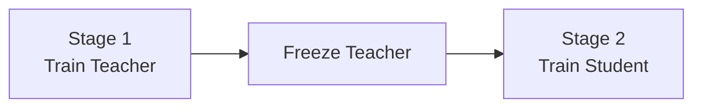

训练流程：

```text
Teacher
预训练完成
     ↓
固定参数
     ↓
产生 logits / feature / relation
     ↓
Student 学习
```

Survey 将其描述为典型的两阶段流程：先训练 Teacher，再从 Teacher 提取 logits 或中间 Feature 指导 Student。

它的优点很直接：
- Teacher 稳定；
- 训练逻辑清晰；
- Knowledge 甚至可以预先缓存；
- Teacher 与 Student 的训练过程完全解耦。

但代价也同样明显：

```text
先付出高成本训练强 Teacher
        ↓
再训练 Student
```

而且 Teacher 一旦固定：
> Student 学得困难时，Teacher 并不会因此改变自己的教学方式。

# 3.2 Online Distillation：大家一起学

如果没有一个已经训练好的强 Teacher 呢？

Online Distillation（在线蒸馏：Teacher 与 Student 在同一训练过程中共同更新）把流程改为：

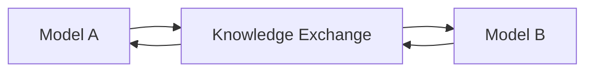

Survey 的定义非常直接：
> Online KD 中 Teacher 与 Student 同时更新，整个系统端到端训练。

一个典型思想是 **Mutual Learning（互学习：多个模型同时训练，彼此将自己的预测作为额外监督）**：
```text
Model A：
Ground Truth
+
Model B Knowledge

Model B：
Ground Truth
+
Model A Knowledge
```

于是：
```text
A 是 B 的 Teacher
同时
B 也是 A 的 Teacher
```

这与 Offline KD 最大的区别不是 Loss，而是：
> **Knowledge Source 本身也在变化。**

## 3.3 为什么互相教还能有效

第一反应可能是：
> 两个都没学好的模型互相教，不是在互相传播错误吗？

确实存在这个风险。

但不同模型：
```text
初始化不同
Mini-batch stochasticity 不同
Optimization trajectory 不同
```

会形成不同的预测偏差。

当它们共享“自己当前学到的结构”时，相当于引入一种额外约束：

```text
只看 Label：
我只需要把 GT 做对

Mutual Learning：
我还要考虑另一个模型
对其他类别 / 样本的判断
```

它不是因为其中某一个从一开始就是专家，而是在训练中形成动态 Knowledge Source。

Survey 也指出，Online KD 的优势是单阶段、端到端，但如何在 Online Setting 中构造真正高容量、高质量的 Teacher 仍值得进一步研究。

# 3.4 Self-Distillation：Teacher 和 Student 可以是自己

再进一步：
Teacher 甚至不需要是另一个模型。

**Self-Distillation（自蒸馏：Teacher 和 Student 来自同一个网络、同一架构或同一模型在不同阶段的状态）**。

Survey 列出的典型形式包括：

### 深层教浅层

```text
Same Network

浅层 ────────────────┐
 ↓                   │
中层                 │ KD
 ↓                   │
深层 / Final Output ─┘
```

深层表示通常拥有更大的上下文或更成熟的语义，于是可以监督较浅层。

### Later Exit 教 Early Exit

```text
Early Exit
    ↑
    │ distill
    │
Later Exit
```

目的是让提前退出的轻量预测尽量接近完整网络预测。

### 不同训练阶段互相教

Survey 还列出 Snapshot Distillation：

```text
Earlier Epoch
     ↓
Teacher Knowledge
     ↓
Later Epoch
```

所以 Self-Distillation 打破了一个很重要的旧认知：

> **KD 的本质并不是“大模型教小模型”，而是“利用一个额外的、结构化的知识源重新塑造训练监督”。**

大模型 → 小模型只是其中最经典的一种实现。


## 3.5 三种 Scheme 对比

|Scheme|Teacher 状态|Teacher / Student 关系|
|---|---|---|
|Offline|预先训练、固定|强 Teacher → Student|
|Online|训练中变化|多个模型共同学习|
|Self|来自自身|自己的深层/阶段/副本 → 自己|

Survey 还明确指出，这三类方式并不是绝对互斥，可以组合使用。

### 本章总结

Distillation Scheme 解决的不是“蒸馏什么”，而是**Knowledge 在什么训练关系中产生**。Offline 是固定 Teacher 单向教学，Online 是多个模型共同学习，Self-Distillation 则把同一模型自身变成 Knowledge Source。理解这一点以后，KD 就不再等同于“先训练一个大 Teacher”。


# 4 Teacher–Student Architecture：Teacher 越强越好吗

直觉上：
```text
Teacher 更大
↓
准确率更高
↓
知识更多
↓
Student 应该学得更好
```

但 Survey 特别强调：
> Teacher–Student Architecture 本身决定 Knowledge 能否被有效获取和迁移，而过大的 Model Capacity Gap 可能损害蒸馏效果。

# 4.1 Student 可以怎么构造

Survey 总结的 Student 形式并不只有：

```text
Teacher 减少几层
```

还可以包括：
- 更浅、更窄的 Teacher 版本；
- Teacher 的量化版本；
- 使用高效基本算子的独立小网络；
- 经过 Architecture Optimization / NAS 得到的结构；
- 甚至与 Teacher 相同结构。

所以：
```text
Knowledge Distillation
```

和：
```text
Architecture Compression
```

是两个不同维度。

先决定 Student 长什么样，再决定怎样对其蒸馏，是非常正常的流程。

# 4.2 为什么 Teacher 太强可能反而不好教

可以用函数逼近来理解。

Teacher 实现：

$$
f_t(x)
$$

Student 能表达的函数集合只有：

$$
\mathcal{H}_s
$$

蒸馏实际上是在寻找：
$$
f_s^* \arg\min_{f_s\in\mathcal H_s} \mathbb{E} \left[ D(f_t(x),f_s(x)) \right]
$$

但假设 Teacher 的函数复杂度远高于 Student。

即使优化完全成功，也存在：

$$
\min_{f_s\in\mathcal H_s} D(f_t,f_s)>0
$$

也就是说：
> **Student 的 Function Space 本身就没有能力精确表达 Teacher。**

此时再增加更多严格的 Feature / Relation 约束，未必是在帮助 Student，反而可能让它同时面对许多无法满足的目标。

# 4.3 Capacity Gap 不是单纯“参数量差多少”

例如：
```text
Teacher：
100M parameters

Student：
10M parameters
```

这是明显的容量差距。

但真正影响 Knowledge Transfer 的不只是参数数目，还可能包括：
```text
Depth
Width
Basic operators
Representation dimensions
Feature hierarchy
Optimization difficulty
```

尤其 Feature KD：
```text
Teacher Layer T
        ↓
?
        ↑
Student Layer S
```

如果 Teacher 与 Student 架构差异极大：
> 哪一层对应哪一层本身就可能没有明显答案。

因此前面第二章 Feature KD 的“Layer Alignment Problem”，实际上与这一章 Architecture Design 是同一个问题的两个侧面。

# 4.4 Teacher Assistant：不要一步跨度太大

Survey 介绍了 **Teacher Assistant（教师助理：在大 Teacher 与小 Student 之间加入中等容量模型，逐级传递知识）** 来缓解 Capacity Gap。

结构：

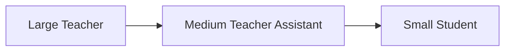

为什么可能有效？

原本：

$$
T\rightarrow S
$$

跨度很大。

现在：

$$
T\rightarrow A
$$

和：

$$
A\rightarrow S
$$

每一步的表示复杂度差距更小。

可以把它理解成：

```text
大学教授
↓
直接教小学一年级学生
```

变成：

```text
大学教授
↓
中间教师
↓
小学学生
```

中间模型的作用不是“增加知识量”，而是：

> **把 Teacher 的知识重新表达成 Student 更容易拟合的形式。**

# 4.5 为什么 Teacher Assistant 也不是万能的

加入 Assistant 也会产生：

```text
Teacher knowledge
      ↓
Assistant approximation
      ↓
Student approximation
```

每一步都可能丢失信息。

所以本质上是在权衡：

```text
Direct KD：
知识完整
但目标过难

Progressive KD：
每一步更容易
但经历多次近似
```

这说明 KD 系统设计真正应该问的是：
> **什么样的 Knowledge 对当前 Student 是“可学习”的？**

而不是：
> “Teacher 能提供多少 Knowledge？”

# 4.6 Architecture 和 Knowledge 必须一起设计

假设两个网络：
```text
Teacher:
64 → 128 → 256 → 512

Student:
32 → 64 → 96
```

如果只做 Response KD：
```text
只需要 Output 兼容
```

Architecture 差异问题没那么严重。

如果做 Feature KD：
```text
Teacher 128ch
↔
Student 64ch

Teacher 256ch
↔
Student 96ch
```

就必须增加：
```text
Projection
Layer mapping
Spatial alignment
```

如果做 Relation KD：
则可能不要求绝对 Feature 一样，从而在一定程度上降低 Architecture Mismatch 的影响。
因此这三个问题必须联合考虑：

```text
Student Architecture
        ↕
Knowledge Type
        ↕
Distillation Loss
```

Survey 也指出，相比大量工作不断设计 Knowledge 和 Distillation Loss，Teacher–Student Architecture 如何系统设计仍然研究不足。

### 本章总结
Teacher 并非越大越好。KD 的本质是一个受 Student Function Capacity 限制的知识迁移过程：如果 Teacher–Student Gap 太大，Student 可能根本无法表达 Teacher 的知识。Teacher Assistant、Layer Alignment 和 Projection 的共同目标，都是让 Knowledge 进入 Student 的“可学习范围”。

# 5 KD Algorithm Map：各种 KD 到底改变了哪个环节

Survey 第 5 节列出了九类典型方法：

```text
Adversarial KD
Multi-Teacher KD
Cross-Modal KD
Graph-Based KD
Attention-Based KD
Data-Free KD
Quantized KD
Lifelong KD
NAS-Based KD
```

逐个记住名称没有意义。

更好的理解方式是问：

> **它到底修改了 KD 系统中的哪个变量？**

# 5.1 改变 Knowledge Source：从谁那里学

## Multi-Teacher Distillation

经典：

```text
Teacher
   ↓
Student
```

Multi-Teacher：

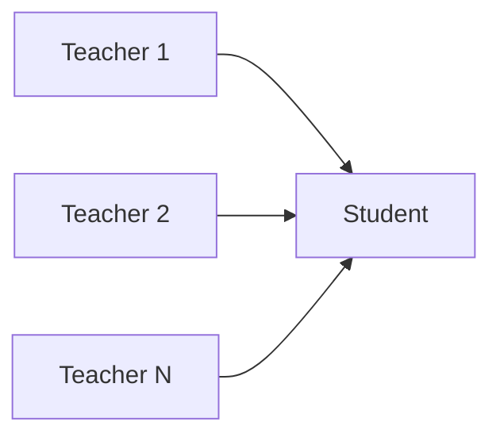

为什么需要多个 Teacher？

因为不同 Teacher：
```text
Architecture 不同
训练数据不同
Optimization path 不同
擅长模式不同
```

可能拥有互补知识。

最简单的做法是：
$$
p_T \frac{1}{M} \sum_{m=1}^M p_{T_m}
$$

再让 Student 学习平均输出。

但问题也马上出现：
```text
Teacher 1 很擅长这个 Sample
Teacher 2 在这个 Sample 上不可靠
```

简单平均：
```text
0.5 Teacher1 + 0.5 Teacher2
```

未必合理。

所以 Multi-Teacher 的真正问题不是：
> 怎么加几个 Teacher。

而是：
> **不同 Teacher 的 Knowledge 怎样被选择、加权和融合？**

Survey 同样认为，多 Teacher 能带来更丰富的知识，但不同 Knowledge 如何有效整合仍需进一步研究。

## Cross-Modal Distillation

Teacher 和 Student 甚至可以处理不同 Modality（模态：描述同一世界信息的不同数据形式）。

例如：
```text
Training：
RGB + Depth
     ↓
Depth Teacher
     ↓
Knowledge
     ↓
RGB Student

Inference：
只有 RGB
↓
Student
```

或者：
```text
RGB Teacher
↓
Depth Student
```

Cross-Modal KD 的价值在于：
> 训练时可以使用昂贵或额外的 Modal Knowledge，而部署时只保留更容易获得的 Modality。

Survey 将“某些模态在训练或测试时不可获得”作为 Cross-Modal KD 的主要动机之一。

# 5.2 改变 Knowledge Representation：到底传什么结构

## Attention-Based KD

Feature：

$$
F\in\mathbb{R}^{C\times H\times W}
$$

可能很大。

与其要求：

$$
F_s=F_t
$$

可以先从 Feature 提取 Attention Map：

$$
A=\Phi(F)
$$

例如最简单地对 Channel 做聚合：
$$
A(h,w) \sum_c |F(c,h,w)|^2
$$

于是：
```text
Teacher Feature
↓
Attention Map
↓
“Teacher 主要关注哪里”

Student Feature
↓
Attention Map
↓
学习同样的关注模式
```

Survey 对 Attention Transfer 的概括就是：先定义 Feature Embedding 的 Attention Map，再把这种 Attention Knowledge 从 Teacher 迁移到 Student。

## Graph-Based KD

如果 Relation-Based KD 再进一步，可以把 Knowledge 表示成 Graph：
```text
Node
=
Sample / Feature / Region

Edge
=
它们之间的关系
```

例如：
```text
Sample A ───── Sample B
   │              │
   │              │
 Sample C ───── Sample D
```

Student 不是学某个节点的绝对 Feature，而是学：
```text
谁和谁接近
谁和谁相似
整张关系网络长什么样
```

所以 Graph-Based KD 可以理解成 Relation-Based Knowledge 的结构化扩展。

# 5.3 改变 Transfer Mechanism：不再只用距离 Loss
## Adversarial Distillation

传统 KD：

$$
L= D(K_t,K_s)
$$

直接告诉 Student：

```text
你的 Knowledge
应该接近 Teacher
```

Adversarial KD 引入 Discriminator（判别器：试图区分知识来自 Teacher 还是 Student）。

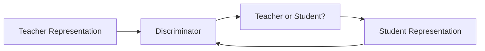

目标变成：
```text
Discriminator：
我要区分 Teacher / Student

Student：
我要产生让 Discriminator
无法区分的 Representation
```

这种设计的动机是：
> 不再人为指定“Feature 每个位置应该差多少”，而是让 Student 学习 Teacher Representation 的整体分布。

Survey 将 GAN 思想用于 KD 的方法归入 Adversarial Distillation，同时指出 GAN 还可以用于产生 KD 所需的训练数据。

# 5.4 改变 Data Condition：没有原数据还能不能蒸馏

## Data-Free Distillation

正常 KD：
```text
Training Data
    ↓
Teacher + Student
    ↓
KD
```

但如果：
```text
Teacher Model 有

原始训练数据没有
```

原因可能是：
- 隐私；
- 法律限制；
- 数据已经不可访问；
- 商业机密。

怎么办？

**Data-Free KD（无数据蒸馏：在没有原训练集时，从 Teacher 自身包含的信息生成或重建用于蒸馏的数据）**。

结构：

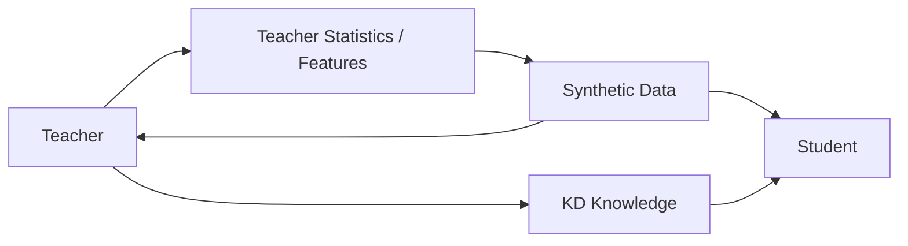

Survey 总结的方法包括：
- GAN 生成 Transfer Data；
- 利用 Teacher Layer Activation 重建输入；
- 从 Teacher Feature Representation 或 Softmax Space 合成样本。

真正的难点是：
> **Teacher 只告诉你自己会如何响应，但并不直接保存完整训练数据分布。**

所以如果 Synthetic Data 只覆盖很窄的区域：
```text
Student
只学到 Teacher
在小范围输入上的行为
```
泛化仍可能很差。

Survey 也将“如何生成高质量、多样的合成训练数据”列为 Data-Free KD 的关键难题。


# 5.5 改变 Student 的表示成本
## Quantized Distillation

Quantization：
```text
FP32 Model
↓
INT8 / lower precision
```

解决的是：
```text
存储
算力
Bandwidth
```

KD：
```text
Teacher
↓
Student
```

解决的是：
```text
小模型如何少损失能力
```

两者可以直接组合：
```text
FP32 Teacher
      ↓
Knowledge
      ↓
INT8 Student
```

这样 Student 同时受到：
```text
Architecture / Capacity Constraint
+
Numerical Precision Constraint
```

Teacher Knowledge 则作为额外监督，帮助低精度 Student 恢复性能。

Survey 将这种 Quantization + KD 的联合训练单独归为 Quantized Distillation。

# 5.6 改变“学习发生在哪个时间尺度”

## Lifelong Distillation

普通 KD：
```text
Teacher knowledge
↓
Current Student
```

Lifelong Learning 还要考虑：
```text
过去学过 Task A
↓
现在学习 Task B
↓
不能忘掉 Task A
```

如果只优化新任务：
```text
Task B ↑

但：

Task A ↓
```

这就是 **Catastrophic Forgetting（灾难性遗忘：模型学习新任务时覆盖原来已经学会的知识）**。

Lifelong KD 的基本思想：
```text
Previous Model
      ↓
Old Knowledge
      ↓
Current Model
      +
New Task Supervision
```

旧模型在这里变成 Teacher，用 KD 约束新模型不要把旧行为完全破坏。

# 5.7 改变 Student Architecture 本身

## NAS-Based Distillation

普通流程：
```text
人工设计 Student
↓
KD
```

NAS-Based KD：
```text
Teacher Knowledge
        ↓
Architecture Search
        ↓
寻找更适合蒸馏的 Student
```

这里 KD 不再只是：
> 结构确定以后怎么训练。

而是参与：
> **Student 应该长什么样。**

这实际上重新连接到第四章：
```text
Teacher–Student Architecture
```

因为如果 Capacity Gap 和 Structural Gap 会影响 KD，那么搜索“最适合接受 Teacher Knowledge 的结构”自然就有意义。

# 5.8 九类算法对比

|改变什么|典型方法|
|---|---|
|Knowledge Source|Multi-Teacher、Cross-Modal|
|Knowledge Representation|Attention、Graph|
|Transfer Mechanism|Adversarial|
|Data Availability|Data-Free|
|Student Numerical Form|Quantized|
|Learning Timeline|Lifelong|
|Student Architecture|NAS-Based|

### 本章总结

Survey 中各种 KD 算法并不是九套完全独立的技术。它们大多是在修改同一个 Teacher–Student 框架中的某个组成部分：**知识来源、知识表示、传递方式、数据条件、Student 约束、学习时间尺度或网络结构。**

# 6 如何真正设计一个 KD 系统

到这里已经不应该再用：

> “给模型加一个 KD Loss。”

这种方式来思考。

一个完整 KD 系统至少要回答：

```text
What
蒸馏什么？

Where
在哪些 Layer 蒸馏？

Who
谁做 Teacher？

When
什么时候教？

How
怎么比较 Knowledge？

Capacity
Student 吃得下吗？
```

Survey 最后也将 **Knowledge Quality、Distillation Scheme、Teacher–Student Architecture 和理论理解**列为 KD 的核心挑战，并强调未来的重要问题包括 Teacher–Student 结构、学习什么 Knowledge，以及 Knowledge 蒸馏到 Student 的哪里。

# 6.1 第一步：先确定部署目标，而不是先确定 Loss

假设目标：
```text
Teacher：
高性能、大模型

Deployment：
只能接受小模型
```

先决定：
```text
Student 的参数量
计算量
Latency
Memory
Precision
```

得到 Student Architecture。

然后再考虑 KD。

而不是：
```text
先设计漂亮的 KD Loss
↓
最后才发现 Student
根本不能满足部署要求
```

KD 是帮助一个**已经具有实际价值的 Student** 提高能力，而不是替代 Student Architecture Design。

# 6.2 第二步：判断真正需要迁移的 Knowledge 在哪里

如果任务是分类：

```text
Teacher logits
```

本身已经包含大量有价值的类别结构。

那么：

```text
Response KD
```

可能已经足够。

如果任务强依赖中间 Representation：

```text
Detection
Segmentation
Image Restoration
```

则可以进一步考虑：

```text
Feature KD
Relation KD
Attention KD
```

关键问题不是：
> 哪一种 KD 最新？

而是：
> **Teacher 的优势到底体现在哪一类 Representation 中？**

# 6.3 第三步：确定 Layer Alignment

假设：
```text
Teacher:

T1 → T2 → T3 → T4

Student:

S1 → S2 → S3
```

一种常见思路是按照 Resolution 对齐：
```text
T1 ↔ S1
T3 ↔ S2
T4 ↔ S3
```

但相同 Resolution 不代表相同语义。

因此更稳妥的过程是：
```text
先观察网络 Stage
↓
根据功能 / Resolution 找候选层
↓
加入 Projection
↓
做消融
↓
确认哪些 Layer 真正提供收益
```

Survey 明确指出，Feature KD 中如何选择 Hint Layer / Guided Layer 以及如何匹配不同 Feature Representation，仍没有一个通用答案。

# 6.4 第四步：不要让 KD Loss 和 Task Loss 互相打架

最常见的总体形式：

$$
L L_{task} + \lambda L_{KD}
$$

但现在：

$$
L_{KD}
$$

还可能进一步是：

$$
L_{KD} \lambda_rL_{response} + \lambda_fL_{feature} + \lambda_{rel}L_{relation}
$$

所以：

$$
L L_{task} + \lambda_rL_{response} + \lambda_fL_{feature} + \lambda_{rel}L_{relation}
$$

这看起来知识更多。

但假设：
```text
Ground Truth：
要求 Student 输出 A

Teacher：
因为自身偏差倾向 B
```

那么：
```text
Task Gradient
      ↗
Student
      ↘
KD Gradient
```

两个方向会冲突。

因此：
> KD Loss 越多，不代表知识越多越好。

真正要确认的是：
```text
加这个 Knowledge
↓
它补充了 Task Loss 中缺少的什么信息？
```

如果回答不了这个问题，就没有必要加入。

# 6.5 一个最小 Feature + Response KD 实现

假设分类模型，Student 同时学习 Teacher logits 和一个中间 Feature：
```python
import torch
import torch.nn as nn
import torch.nn.functional as F


class DistillationLoss(nn.Module):
    def __init__(
        self,
        student_channels,
        teacher_channels,
        temperature=4.0,
        response_weight=1.0,
        feature_weight=1.0,
        task_weight=1.0,
    ):
        super().__init__()
        self.adapter = nn.Conv2d(
            student_channels,
            teacher_channels,
            kernel_size=1
        )
        self.temperature = temperature
        self.response_weight = response_weight
        self.feature_weight = feature_weight
        self.task_weight = task_weight

    def forward(
        self,
        student_logits,
        teacher_logits,
        student_feature,
        teacher_feature,
        target,
    ):
        t = self.temperature

        task_loss = F.cross_entropy(
            student_logits,
            target
        )

        teacher_prob = F.softmax(
            teacher_logits / t,
            dim=1
        )

        student_log_prob = F.log_softmax(
            student_logits / t,
            dim=1
        )

        response_loss = F.kl_div(
            student_log_prob,
            teacher_prob,
            reduction="batchmean"
        ) * (t * t)

        aligned_feature = self.adapter(
            student_feature
        )

        feature_loss = F.mse_loss(
            aligned_feature,
            teacher_feature
        )

        total_loss = (
            self.task_weight * task_loss
            + self.response_weight * response_loss
            + self.feature_weight * feature_loss
        )

        return total_loss
```

这里三项 Loss 各自有明确职责：
```text
Task Loss
→ 最终任务真值

Response Loss
→ Teacher 最后的行为

Feature Loss
→ Teacher 中间 Representation
```

而不是因为：
> “经典论文都这么加。”


# 7 面对一个新 KD 任务时的检查表

以后不用从几十篇 KD 论文中随机选 Loss。

按以下顺序：
### ① Student 为什么需要 KD？

如果 Student 已经达到目标，就没有必要增加训练复杂度。


### ② Teacher 的优势在哪里？
```text
最终输出？
中间 Feature？
空间 Attention？
样本关系？
时序关系？
```

### ③ Student 能不能表达这些 Knowledge？

```text
Teacher 远大于 Student？
Layer 能否对齐？
Feature Dimension 是否差异太大？
```

如果差距太大：

```text
Teacher Assistant
Projection
Relation KD
```

可能比强行 Feature Matching 更合理。


### ④ Teacher 在什么时候存在？

```text
已有强模型
→ Offline KD

没有强 Teacher
→ Online KD

希望利用自身结构
→ Self-Distillation
```

### ⑤ 数据条件是什么？

```text
原数据正常存在
→ Normal KD

原训练数据不可获取
→ Data-Free KD

不同 Modalities
→ Cross-Modal KD
```

### ⑥ Student 还有没有其他部署约束？

```text
INT8
→ Quantized KD

Student Architecture 尚未确定
→ KD + NAS
```

### ⑦ 最后才设计 Loss

最终设计应该是：

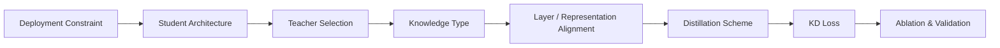

这也是读完 Survey 后最应该留下的实际能力：

> **不是会复现某一个 KD Loss，而是能分析一个任务中 Knowledge 存在哪里，并把它转换成 Student 能够学习的监督。**

# 6.8 这篇 Survey 最值得留下的三个问题

Survey 最后列出很多挑战，但可以进一步压缩成三个长期问题。

## 问题一：什么才是真正有价值的 Knowledge？

Teacher 中有：
```text
logits
features
attention
relations
parameters
...
```

但：
> “可以被提取”

不等于：
> “值得传给 Student”。

甚至某些深层 Feature 可能对 Student 形成过强 Regularization。Survey 也指出不同 Hint Layer 可能具有不同影响。

## 问题二：什么样的 Teacher 最适合 Student？

不是：

$$
Accuracy_{teacher}\uparrow \Rightarrow Accuracy_{student}\uparrow
$$

Teacher Accuracy 只是一个因素。

还要看：
```text
Capacity Gap
Architecture Gap
Representation Compatibility
Task Bias
```

## 问题三：为什么 KD 有效？

即使今天已经有大量 KD 方法，Survey 仍指出 KD 的理论解释和系统性实证理解不足。

这意味着：
```text
KD Works
```

和：
```text
We fully understand why KD works
```

不是同一件事。

所以实践中仍然需要：

```text
Ablation
+
Task-specific analysis
```

而不是根据 Teacher Accuracy 机械地决定蒸馏策略。

# 整体知识链

整篇 Survey 可以最终压缩成一张图：

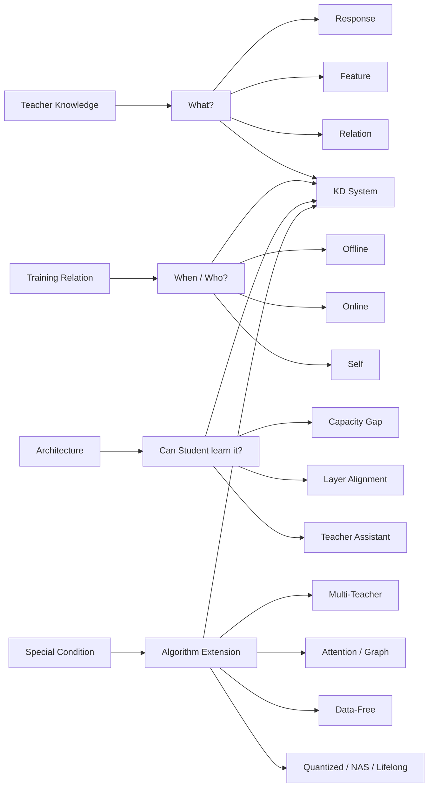

真正理解以后，可以把所有 KD 方法归结为六个问题：

```text
What：
Teacher 的什么 Knowledge 值得学？

Where：
从 Teacher 哪里传到 Student 哪里？

Who：
谁是 Teacher？

When：
什么时候产生 Teacher Knowledge？

How：
Knowledge 如何表示和比较？

Capacity：
Student 是否有能力吸收？
```

# 一句话总结

**Knowledge Distillation 的核心并不是“让小模型模仿大模型输出”，而是先判断 Teacher 中什么知识值得迁移、这些知识应从哪里传到 Student 哪里，再根据 Teacher–Student 的容量与结构关系设计 Student 真正能够吸收的监督。**