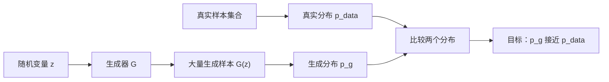
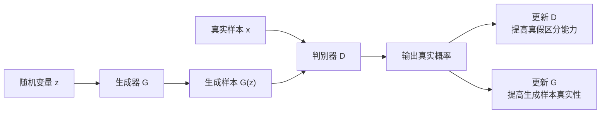
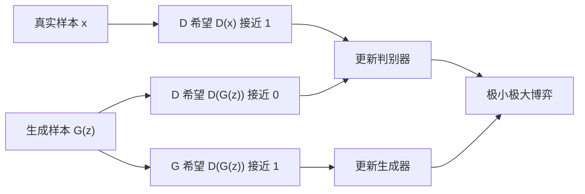
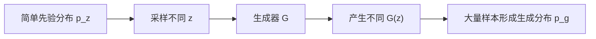
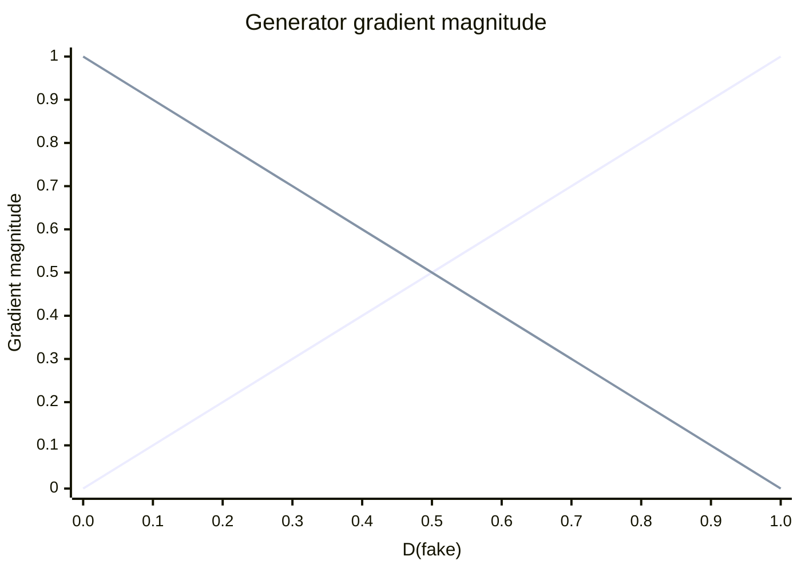
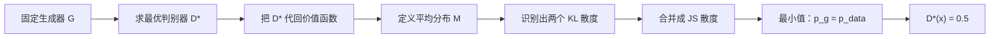
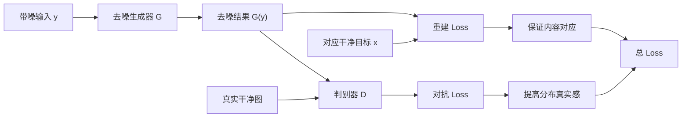

# GAN：Generative Adversarial Nets

## 1. 生成任务与 GAN 的核心思路

**论文标题**：Generative Adversarial Nets  
**会议**：NIPS 2014  
**论文定位**：首次系统提出 GAN 框架，通过生成器与判别器之间的对抗训练学习真实数据分布。

### 1.1 生成任务要学习的是分布

图像分类、去噪和无条件图像生成解决的是不同问题：

```text
图像分类：
输入图像 → 输出对应类别

DnCNN：
输入带噪图像 → 输出对应噪声或干净图像

无条件图像生成：
输入随机变量 → 生成一个新的合理样本
```

分类和去噪通常具有明确的输入与目标。例如，带噪图像 $y$ 对应目标干净图像 $x$，模型输出 $\hat{x}$ 后，可以直接计算逐样本重建误差：

$$
\mathcal{L}_{rec}=|\hat{x}-x|_1
$$

无条件生成不同。生成器从随机变量 $z$ 出发：

$$
\hat{x}=G(z)
$$

训练数据并没有规定某个 $z$ 必须对应哪一张真实图像。人为指定 $z_1\rightarrow x_1$ 或 $z_1\rightarrow x_2$ 都可以，但这种配对不来自数据本身，因此不能代表真实的数据规律。

生成模型要学习的不是某个随机输入和某张真实图像之间的固定对应关系，而是让大量生成样本形成的整体分布接近真实样本分布。

真实数据分布记作：

$$
p_{data}(x)
$$

生成器输出形成的分布记作：

$$
p_g(x)
$$

生成任务的目标是：

$$
p_g(x)\approx p_{data}(x)
$$

“两个分布接近”表示：

```text
真实数据中常见的结构
生成数据中也应该经常出现

真实数据包含的不同类型
生成数据也应该尽量覆盖

真实数据中很少出现的异常结构
生成数据也不应该大量出现
```

因此，生成任务是在**样本集合层面**学习数据规律，而不是在**单个样本对层面**进行逐像素匹配。




### 1.2 GAN 真正解决的训练难点

明确目标后，还存在一个关键问题：

> 怎样衡量 $p_g$ 与 $p_{data}$ 的差异，并把这种差异转换成能够更新生成器的梯度？

我们可以从真实数据集中采样，但通常不知道高维图像分布 $p_{data}(x)$ 的显式概率密度公式。原始 GAN 的生成器也只能通过 $G(z)$ 产生样本，不能直接计算某张图像的精确生成概率 $p_g(x)$。

因此，训练时很难直接写出并优化两个概率密度之间的距离。

GAN 的核心思路是：

> 不直接计算两个分布的显式概率密度，而是训练一个判别器，通过区分真实样本和生成样本，间接学习两个分布之间的差异。

判别器 $D$ 接收两类样本：

```text
真实样本：
x ~ p_data

生成样本：
z ~ p_z
G(z) ~ p_g
```

判别器尝试判断输入来自真实数据还是生成器。如果 $p_g$ 与 $p_{data}$ 差异很大，判别器容易区分；随着两个分布接近，判别任务会越来越困难。

判别器因此充当一个**可学习的分布差异检测器**：

```text
D 学习真实样本与生成样本的差异
                ↓
差异被转换成可反向传播的梯度
                ↓
G 根据梯度调整生成结果
                ↓
p_g 逐步接近 p_data
```

GAN 的核心不是简单地让两个网络竞争，而是：

> 用判别器代替难以直接定义和计算的分布距离，为生成器提供随训练过程动态变化的监督信号。

## 2. GAN 的价值函数与训练流程

GAN 同时训练两个网络：

- **生成器 $G$**：把随机变量 $z$ 转换为生成样本 $G(z)$；
    
- **判别器 $D$**：输出输入样本来自真实数据的概率。
    

论文首先给出完整的极小极大价值函数：

$$
\min_G\max_D V(D,G)=\mathbb{E}_{x\sim p_{data}}[\log D(x)]+\mathbb{E}_{z\sim p_z}[\log(1-D(G(z)))]
$$

其中：

- $\max_D$：判别器最大化价值函数，尽量区分真实样本和生成样本；
    
- $\min_G$：生成器最小化价值函数，尽量让生成样本无法被判别器识别；
    
- $\mathbb{E}$：对相应分布中的样本求平均。
    




### 2.1 价值函数中的两个部分

判别器输入真实样本时，希望：

$$
D(x)\rightarrow1
$$

因此价值函数包含：

$$
\mathbb{E}_{x\sim p_{data}}[\log D(x)]
$$

因为 $\log u$ 在 $0<u<1$ 上单调递增，最大化 $\log D(x)$ 就会推动 $D(x)$ 接近 1。

例如：

$$
\log0.9\approx-0.105
$$

$$
\log0.1\approx-2.303
$$

判别器最大化目标时，更偏好较大的 $-0.105$，因此会提高真实样本的输出概率。

判别器输入生成样本时，希望：

$$
D(G(z))\rightarrow0
$$

因此价值函数包含：

$$
\mathbb{E}_{z\sim p_z}[\log(1-D(G(z)))]
$$

当 $D(G(z))$ 接近 0 时，$1-D(G(z))$ 接近 1，这一项也接近最大值 0。

例如：

$$
D(G(z))=0.1\Rightarrow\log(1-D(G(z)))=\log0.9\approx-0.105
$$

$$
D(G(z))=0.9\Rightarrow\log(1-D(G(z)))=\log0.1\approx-2.303
$$

所以判别器最大化完整价值函数，相当于同时执行：

```text
真实样本 x：
让 D(x) 接近 1

生成样本 G(z)：
让 D(G(z)) 接近 0
```

生成器不能影响第一项，因为真实样本 $x$ 并不经过生成器。生成器只能通过改变 $G(z)$ 影响第二项。

判别器希望：

$$
D(G(z))\rightarrow0
$$

生成器则希望：

$$
D(G(z))\rightarrow1
$$

这就是“对抗”的准确含义：两个网络对同一个判别结果 $D(G(z))$ 具有相反目标。




### 2.2 为什么要交替更新两个网络

判别器和生成器不能使用同一个梯度方向同时更新。

训练判别器时，希望生成样本更容易被判断为假：

$$
D(G(z))\rightarrow0
$$

训练生成器时，希望生成样本更容易被判断为真：

$$
D(G(z))\rightarrow1
$$

如果在判别器 Loss 下同时更新 $D$ 和 $G$，生成器也会被推动去帮助判别器，让自己的输出更容易被判断为假，这与生成器目标相反。

因此训练分成两个阶段。

**阶段一：固定生成器，更新判别器**

生成器先产生当前的假样本：

$$
\hat{x}=G(z)
$$

判别器接收真实样本 $x$ 和生成样本 $\hat{x}$，学习：

$$
D(x)\rightarrow1,\quad D(\hat{x})\rightarrow0
$$

这一阶段只更新判别器参数 $\theta_D$。生成器保持不变，使判别器能够针对生成器当前的输出学习真假差异。

**阶段二：固定判别器参数，更新生成器**

重新采样 $z$ 并产生：

$$
\hat{x}=G(z)
$$

再计算：

$$
D(G(z))
$$

生成器根据判别结果更新，使 $D(G(z))$ 增大。

此时判别器参数不更新，但梯度仍然必须经过判别器内部计算并传到生成器：

```text
生成器 Loss
      ↓
D(G(z))
      ↓
判别器内部各层
      ↓
生成样本 G(z)
      ↓
生成器参数 θ_G
```

“固定判别器”表示不使用梯度修改 $\theta_D$，并不表示切断经过判别器的梯度。若完全停止梯度，生成器就无法知道应该怎样改变输出。

### 2.3 交替训练伪代码

```text
初始化生成器参数 theta_G
初始化判别器参数 theta_D

重复训练：

    1. 更新判别器 D

       从真实数据中采样 x
       从先验分布中采样 z
       生成假样本 fake = G(z)

       固定 G
       计算 D(x) 和 D(fake)
       让 D(x) 接近 1
       让 D(fake) 接近 0
       更新 theta_D

    2. 更新生成器 G

       重新采样 z
       生成假样本 fake = G(z)

       固定 D 的参数
       计算 D(fake)
       让 D(fake) 接近 1
       梯度经过 D 传回 G
       更新 theta_G
```


两个网络必须持续交替更新：

```text
D 学习当前生成结果的问题
              ↓
G 根据 D 的反馈修正输出
              ↓
D 再学习修正后仍存在的问题
              ↓
G 再继续修正
```

如果判别器长期不更新，生成器可能只学会利用固定判别器的缺陷，而不是真正逼近真实分布。

如果生成器长期不更新，系统只会得到一个越来越准确的真假分类器，而不会产生更好的生成样本。

## 3. 生成器与随机潜变量

### 3.1 为什么生成器需要随机变量

如果生成器没有任何输入：

$$
\hat{x}=G()
$$

在网络参数固定时，每次运行都会得到同一个输出。真实数据通常包含不同类别、形状、姿态和纹理，一个固定输出无法覆盖这些变化。

GAN 因此使用随机变量 $z$ 作为生成器输入：

$$
\hat{x}=G(z)
$$

每次生成前重新采样 $z$，生成器才有机会产生不同样本。

**潜变量 Latent Variable**：生成器内部使用的随机输入，用于为不同生成结果提供不同起点。训练数据不会直接规定某个 $z$ 代表什么，也不会给 $z$ 配置唯一目标图像。

GAN 从一个简单分布中采样：

$$
z\sim p_z(z)
$$

$p_z$ 称为**先验分布 Prior Distribution**：训练开始前人为指定的、便于采样的随机分布，常见选择包括标准高斯分布和均匀分布。

例如：

$$
z\sim\mathcal{N}(0,I)
$$

选择简单分布不是因为图像服从高斯分布，而是因为它容易反复采样。生成器负责把这个简单分布转换为复杂的生成分布：

$$
z\sim p_z\quad\rightarrow\quad G(z)\sim p_g
$$




### 3.2 从 $p_z$ 到 $p_g$

$p_g$ 并不是生成器直接输出的一个概率公式，而是大量随机变量经过生成器后，所有输出共同形成的分布。

以一维数据为例，假设真实数据主要集中在两个区域：

```text
真实分布 p_data：

一部分样本位于左侧区域
另一部分样本位于右侧区域
```

训练完成后，生成器可能把一部分 $z$ 映射到左侧区域，把另一部分 $z$ 映射到右侧区域。反复采样大量 $z$ 后，全部 $G(z)$ 也会形成两个聚集区域。

这时生成器学习的不是：

```text
某个 z 必须复制某个训练样本
```

而是：

```text
怎样把 p_z 中的概率质量
重新分配到真实数据常出现的区域
```

神经网络 $G$ 实际承担的是一个非线性空间变换：

```text
简单、规则、容易采样的潜空间
                ↓
复杂、弯曲、具有多种结构的数据空间
```

潜变量的不同维度可能在训练后对应某些连续变化方向，但原始 GAN 并没有提前规定“第一个维度控制类别”“第二个维度控制纹理”。这些关系由训练过程自行形成，也不保证每个维度都具有可解释语义。

### 3.3 随机输入不等于输出一定多样

加入 $z$ 只给生成器提供了表达多样性的可能，不能保证生成器一定使用这些差异。

生成器仍可能学习成：

$$
G(z_1)\approx G(z_2)\approx G(z_3)
$$

也就是说，大量不同的 $z$ 被映射到相同或相似输出。这正是后面要介绍的模式坍塌。

原始 GAN 还是一种**隐式生成模型 Implicit Generative Model**：

$$
z\sim p_z,\quad x=G(z)
$$

它可以直接生成样本，但通常不能直接计算某张具体图像的精确生成概率 $p_g(x)$。

这一特点解释了为什么 GAN 需要判别器：真实分布和生成分布都没有方便使用的显式概率密度，因此只能利用两个分布产生的样本，间接学习它们的差异。

## 4. 生成器 Loss 的两种形式

前一章已经说明，训练判别器时，希望：

$$
D(x)\rightarrow1,\qquad D(G(z))\rightarrow0
$$

但训练生成器时，目标正好相反：

$$
D(G(z))\rightarrow1
$$

也就是说，生成器要调整参数，使判别器逐渐把生成样本当成真实样本。

原论文给出了两种生成器 Loss：

- 理论价值函数中的 **Minimax Loss**；
    
- 实际训练中推荐的 **Non-saturating Loss**。
    

两种 Loss 都希望提高 $D(G(z))$，但训练初期提供的梯度强度不同。

### 4.1 理解推导前需要的四个概念

先只考虑一个生成样本：

$$
\hat{x}=G(z)
$$

判别器对它进行判断：

$$
D(G(z))
$$

这个值位于 $0$ 到 $1$ 之间，表示判别器认为生成样本是真实样本的概率。

#### Logit

**Logit**：判别器最后输出概率之前的原始标量。

记作：

$$
a
$$

判别器先计算 $a$，再经过 Sigmoid 函数得到概率：

$$
D(G(z))=\sigma(a)
$$

所以完整路径是：

```text
随机变量 z
    ↓
生成器 G
    ↓
生成样本 G(z)
    ↓
判别器
    ↓
原始输出 a
    ↓
Sigmoid
    ↓
真实概率 D(G(z))
```

#### Sigmoid 函数

**Sigmoid**：把任意实数映射到 $0$ 和 $1$ 之间的函数，位于判别器的最终输出位置，用于把 Logit 转换成概率。

$$
\sigma(a)=\frac{1}{1+e^{-a}}
$$

其导数为：

$$
\sigma'(a)=\sigma(a)(1-\sigma(a))
$$

当 $a$ 很小时，$\sigma(a)$ 接近 0；当 $a$ 很大时，$\sigma(a)$ 接近 1。

#### 饱和

**Saturation，饱和**：函数进入变化非常缓慢的区域，导致梯度较弱。

训练初期，生成样本通常很差，判别器很容易识别：

$$
D(G(z))\approx0
$$

原始 Minimax Loss 在这个区域给出的梯度很小，因此也称生成器进入了饱和或弱梯度状态。

Non-saturating Loss 的设计目的，就是避开这个问题。

### 4.2 Minimax Loss：理论价值函数中的生成器目标

GAN 的完整价值函数是：

$$
\min_G\max_DV(D,G)=\mathbb{E}_{x\sim p_{data}}[\log D(x)]+\mathbb{E}_{z\sim p_z}[\log(1-D(G(z)))]
$$

当训练生成器时，真实样本项：

$$
\mathbb{E}_{x\sim p_{data}}[\log D(x)]
$$

与生成器无关，因为真实样本没有经过 $G$。

因此生成器实际最小化：

$$
\mathcal{L}_G^{minimax}=\mathbb{E}_{z\sim p_z}[\log(1-D(G(z)))]
$$

先忽略期望，只分析一个样本：

$$
\ell_G^{minimax}=\log(1-D(G(z)))
$$

代入：

$$
D(G(z))=\sigma(a)
$$

得到：

$$
\ell_G^{minimax}(a)=\log(1-\sigma(a))
$$

为什么最小化这个 Loss 会提高 $D(G(z))$？

当 $D(G(z))$ 从 0 增大到 1 时：

$$
1-D(G(z))
$$

会从 1 减小到 0，因此：

$$
\log(1-D(G(z)))
$$

会不断减小。

所以，生成器最小化该项时，会尝试让：

$$
D(G(z))\rightarrow1
$$

#### Minimax Loss 的梯度推导

对 $a$ 求导：

$$
\frac{\partial\ell_G^{minimax}}{\partial a}=\frac{\partial}{\partial a}\log(1-\sigma(a))
$$

使用链式法则，先对外层 $\log u$ 求导：

$$
\frac{\partial\ell_G^{minimax}}{\partial a}=\frac{1}{1-\sigma(a)}\cdot\frac{\partial(1-\sigma(a))}{\partial a}
$$

因为：

$$
\frac{\partial(1-\sigma(a))}{\partial a}=-\sigma'(a)
$$

代入 Sigmoid 的导数：

$$
\frac{\partial(1-\sigma(a))}{\partial a}=-\sigma(a)(1-\sigma(a))
$$

因此：

$$
\frac{\partial\ell_G^{minimax}}{\partial a}=\frac{-\sigma(a)(1-\sigma(a))}{1-\sigma(a)}
$$

约去 $1-\sigma(a)$：

$$
\frac{\partial\ell_G^{minimax}}{\partial a}=-\sigma(a)
$$

因为：

$$
\sigma(a)=D(G(z))
$$

所以：

$$
\frac{\partial\ell_G^{minimax}}{\partial a}=-D(G(z))
$$

梯度绝对值为：

$$
\left|\frac{\partial\ell_G^{minimax}}{\partial a}\right|=D(G(z))
$$

训练初期通常有：

$$
D(G(z))\approx0
$$

因此：

$$
\left|\frac{\partial\ell_G^{minimax}}{\partial a}\right|\approx0
$$

完整因果关系是：

```text
训练初期生成样本很差
        ↓
判别器很容易判断为假
        ↓
D(G(z)) 接近 0
        ↓
Minimax 梯度绝对值等于 D(G(z))
        ↓
生成器得到的更新信号很弱
```

这里的问题不是 Minimax 目标方向错误，而是它在生成器最需要改进时，提供的梯度太弱。

### 4.3 Non-saturating Loss：实际训练使用的生成器目标

为了解决 Minimax Loss 的弱梯度问题，论文建议训练生成器时改为最大化：

$$
\log D(G(z))
$$

使用优化器最小化 Loss 时，写成：

$$
\mathcal{L}_G^{NS}=-\mathbb{E}_{z\sim p_z}[\log D(G(z))]
$$

它称为 **Non-saturating Loss，非饱和 Loss**。

“非饱和”表示：

> 当判别器非常确定生成样本是假的时候，这个 Loss 仍然能给生成器提供较强梯度。

同样先考虑一个样本：

$$
\ell_G^{NS}(a)=-\log\sigma(a)
$$

当 $\sigma(a)=D(G(z))$ 增大时，$-\log D(G(z))$ 会减小，因此最小化该 Loss 也会推动：

$$
D(G(z))\rightarrow1
$$

#### Non-saturating Loss 的梯度推导

对 $a$ 求导：

$$
\frac{\partial\ell_G^{NS}}{\partial a}=\frac{\partial}{\partial a}[-\log\sigma(a)]
$$

先对外层 $-\log u$ 求导：

$$
\frac{\partial\ell_G^{NS}}{\partial a}=-\frac{1}{\sigma(a)}\cdot\sigma'(a)
$$

代入 Sigmoid 导数：

$$
\frac{\partial\ell_G^{NS}}{\partial a}=-\frac{\sigma(a)(1-\sigma(a))}{\sigma(a)}
$$

约去 $\sigma(a)$：

$$
\frac{\partial\ell_G^{NS}}{\partial a}=-(1-\sigma(a))
$$

整理为：

$$
\frac{\partial\ell_G^{NS}}{\partial a}=\sigma(a)-1
$$

因为 $\sigma(a)=D(G(z))$，所以：

$$
\frac{\partial\ell_G^{NS}}{\partial a}=D(G(z))-1
$$

梯度绝对值为：

$$
\left|\frac{\partial\ell_G^{NS}}{\partial a}\right|=1-D(G(z))
$$

训练初期：

$$
D(G(z))\approx0
$$

因此：

$$
\left|\frac{\partial\ell_G^{NS}}{\partial a}\right|\approx1
$$

也就是说，判别器越确定生成样本是假的，Non-saturating Loss 给生成器的更新信号反而越强。




两种梯度可以直接比较：

```text
Minimax 梯度绝对值：
D(G(z))

Non-saturating 梯度绝对值：
1-D(G(z))
```

假设训练初期：

$$
D(G(z))=0.01
$$

则：

$$
\left|\nabla\ell_G^{minimax}\right|=0.01
$$

$$
\left|\nabla\ell_G^{NS}\right|=0.99
$$

所以论文实际训练生成器时选择 Non-saturating Loss。

两者的关系是：

```text
Minimax Loss：
来自论文的极小极大价值函数
理论形式统一，但训练初期梯度较弱

Non-saturating Loss：
改变生成器的优化形式
训练初期梯度更强
```

Non-saturating Loss 没有改变 GAN 的理想平衡状态。它改变的是生成器到达该状态时使用的梯度，而不是最终希望实现的分布匹配目标。

## 5. 理论分析：GAN 为什么能学习真实分布

前面只说明了 GAN 的训练方式：

```text
D 学习区分真实样本和生成样本
        ↓
G 根据 D 的梯度改进生成结果
```

但还没有回答一个更根本的问题：

> 为什么这种对抗过程会让生成分布 $p_g$ 接近真实分布 $p_{data}$？

原论文通过两个步骤回答：

1. 固定生成器，求出当前最优判别器；
    
2. 把最优判别器代回价值函数，观察生成器实际在最小化什么。
    

在进入推导前，需要先理解“散度、KL 散度和 JS 散度”。

### 5.1 散度、KL 散度与 JS 散度是什么

#### 散度

**Divergence，散度**：衡量两个概率分布差异程度的函数。

散度越小，表示两个分布越接近。

散度和普通几何距离相似，但不一定满足距离的所有条件。例如，有些散度不具有对称性。

#### KL 散度

**Kullback-Leibler Divergence，KL 散度**：衡量当真实数据来自分布 $P$，却使用分布 $Q$ 描述这些数据时产生的差异。

定义为：

$$
D_{\mathrm{KL}}(P|Q)=\int P(x)\log\frac{P(x)}{Q(x)},dx
$$

其中：

- $P(x)$：作为参考的真实分布；
    
- $Q(x)$：用来近似 $P$ 的分布；
    
- $\log\frac{P(x)}{Q(x)}$：比较两个分布在位置 $x$ 的相对密度；
    
- 对 $P(x)$ 加权积分：重点关注 $P$ 经常出现的区域。
    

KL 散度满足：

$$
D_{\mathrm{KL}}(P|Q)\geq0
$$

并且当两个分布相同时：

$$
D_{\mathrm{KL}}(P|Q)=0
$$

但 KL 散度通常不对称：

$$
D_{\mathrm{KL}}(P|Q)\neq D_{\mathrm{KL}}(Q|P)
$$

所以它不能直接看作普通的双向距离。

#### JS 散度

**Jensen-Shannon Divergence，JS 散度**：通过一个中间分布，同时、对称地衡量两个分布之间的差异。

先定义平均分布：

$$
M=\frac{P+Q}{2}
$$

$M$ 同时包含 $P$ 和 $Q$ 的概率质量。

然后分别计算：

$$
D_{\mathrm{KL}}(P|M)
$$

和：

$$
D_{\mathrm{KL}}(Q|M)
$$

最后取平均：

$$
D_{\mathrm{JS}}(P|Q)=\frac{1}{2}D_{\mathrm{KL}}(P|M)+\frac{1}{2}D_{\mathrm{KL}}(Q|M)
$$

JS 散度具有两个重要性质：

$$
D_{\mathrm{JS}}(P|Q)\geq0
$$

$$
D_{\mathrm{JS}}(P|Q)=0\iff P=Q
$$

而且它是对称的：

$$
D_{\mathrm{JS}}(P|Q)=D_{\mathrm{JS}}(Q|P)
$$

GAN 理论分析最终得到的结论是：

> 当判别器达到最优时，原始 GAN 的生成器目标等价于减小 $p_{data}$ 与 $p_g$ 之间的 JS 散度。


### 5.2 固定生成器时，最优判别器是什么

GAN 的价值函数为：

$$
V(D,G)=\mathbb{E}_{x\sim p_{data}}[\log D(x)]+\mathbb{E}_{z\sim p_z}[\log(1-D(G(z)))]
$$

生成样本 $G(z)$ 服从生成分布 $p_g$，因此第二个期望也可以写成对 $p_g$ 求期望：

$$
V(D,G)=\mathbb{E}_{x\sim p_{data}}[\log D(x)]+\mathbb{E}_{x\sim p_g}[\log(1-D(x))]
$$

再写成积分：

$$
V(D,G)=\int p_{data}(x)\log D(x),dx+\int p_g(x)\log(1-D(x)),dx
$$

合并为：

$$
V(D,G)=\int[p_{data}(x)\log D(x)+p_g(x)\log(1-D(x))],dx
$$

现在固定生成器 $G$。

这意味着生成分布 $p_g$ 暂时不变，判别器只需要在两个固定分布之间寻找最佳分类方式。

对于每一个具体位置 $x$，令：

$$
d=D(x)
$$

判别器在该位置要最大化：

$$
f_x(d)=p_{data}(x)\log d+p_g(x)\log(1-d)
$$

这里可以把 $p_{data}(x)$ 和 $p_g(x)$ 看成两个固定系数，唯一需要选择的是 $d$。

对 $d$ 求导：

$$
\frac{\partial f_x}{\partial d}=\frac{p_{data}(x)}{d}-\frac{p_g(x)}{1-d}
$$

令导数等于 0：

$$
\frac{p_{data}(x)}{d}=\frac{p_g(x)}{1-d}
$$

交叉相乘：

$$
p_{data}(x)(1-d)=p_g(x)d
$$

展开：

$$
p_{data}(x)-p_{data}(x)d=p_g(x)d
$$

整理：

$$
p_{data}(x)=d[p_{data}(x)+p_g(x)]
$$

所以：

$$
d=\frac{p_{data}(x)}{p_{data}(x)+p_g(x)}
$$

因为 $d=D(x)$，得到最优判别器：

$$
D_G^*(x)=\frac{p_{data}(x)}{p_{data}(x)+p_g(x)}
$$

为了确认这是最大值而不是最小值，再看二阶导数：

$$
\frac{\partial^2 f_x}{\partial d^2}=-\frac{p_{data}(x)}{d^2}-\frac{p_g(x)}{(1-d)^2}
$$

只要分布密度不是同时为 0，就有：

$$
\frac{\partial^2 f_x}{\partial d^2}<0
$$

因此该驻点确实是最大值。

最优判别器的含义是：

> 它比较位置 $x$ 附近真实样本和生成样本出现的相对密度。

例如，当：

$$
p_{data}(x)=0.8,\qquad p_g(x)=0.2
$$

有：

$$
D_G^*(x)=\frac{0.8}{0.8+0.2}=0.8
$$

说明该区域更可能出现真实样本。

如果：

$$
p_{data}(x)=p_g(x)
$$

则：

$$
D_G^*(x)=\frac{1}{2}
$$

所以，当生成分布与真实分布完全相同时，判别器输出 0.5 是最合理的结果，因为样本来源已经无法区分。

### 5.3 把最优判别器代回价值函数

求出最优判别器后，定义：

$$
C(G)=V(D_G^*,G)
$$

它表示：

> 在判别器已经针对当前生成器达到最优时，生成器对应的价值函数。

先计算：

$$
D_G^*(x)=\frac{p_{data}(x)}{p_{data}(x)+p_g(x)}
$$

因此：

$$
1-D_G^*(x)=\frac{p_g(x)}{p_{data}(x)+p_g(x)}
$$

代回价值函数：

$$
C(G)=\int p_{data}(x)\log\frac{p_{data}(x)}{p_{data}(x)+p_g(x)},dx+\int p_g(x)\log\frac{p_g(x)}{p_{data}(x)+p_g(x)},dx
$$

现在需要把这个式子改写成前面定义的 KL 散度和 JS 散度形式。

第一步，定义平均分布：

$$
M(x)=\frac{p_{data}(x)+p_g(x)}{2}
$$

因此：

$$
p_{data}(x)+p_g(x)=2M(x)
$$

将第一个对数项改写为：

$$
\log\frac{p_{data}(x)}{p_{data}(x)+p_g(x)}=\log\frac{p_{data}(x)}{2M(x)}
$$

再把分母中的 $2$ 拆出来：

$$
\log\frac{p_{data}(x)}{2M(x)}=\log\frac{p_{data}(x)}{M(x)}-\log2
$$

同理：

$$
\log\frac{p_g(x)}{p_{data}(x)+p_g(x)}=\log\frac{p_g(x)}{M(x)}-\log2
$$

代回 $C(G)$：

$$
C(G)=\int p_{data}(x)\left[\log\frac{p_{data}(x)}{M(x)}-\log2\right]dx+\int p_g(x)\left[\log\frac{p_g(x)}{M(x)}-\log2\right]dx
$$

把各项展开：

$$
C(G)=\int p_{data}(x)\log\frac{p_{data}(x)}{M(x)}dx+\int p_g(x)\log\frac{p_g(x)}{M(x)}dx-\log2\int p_{data}(x)dx-\log2\int p_g(x)dx
$$

概率分布的积分为 1：

$$
\int p_{data}(x)dx=1,\qquad\int p_g(x)dx=1
$$

因此最后两个常数项为：

$$
-\log2-\log2=-2\log2=-\log4
$$

前两个积分正好是两个 KL 散度：

$$
\int p_{data}(x)\log\frac{p_{data}(x)}{M(x)}dx=D_{\mathrm{KL}}(p_{data}|M)
$$

$$
\int p_g(x)\log\frac{p_g(x)}{M(x)}dx=D_{\mathrm{KL}}(p_g|M)
$$

所以：

$$
C(G)=D_{\mathrm{KL}}(p_{data}|M)+D_{\mathrm{KL}}(p_g|M)-\log4
$$

根据 JS 散度定义：

$$
D_{\mathrm{JS}}(p_{data}|p_g)=\frac{1}{2}D_{\mathrm{KL}}(p_{data}|M)+\frac{1}{2}D_{\mathrm{KL}}(p_g|M)
$$

因此：

$$
D_{\mathrm{KL}}(p_{data}|M)+D_{\mathrm{KL}}(p_g|M)=2D_{\mathrm{JS}}(p_{data}|p_g)
$$

最终得到：

$$
C(G)=-\log4+2D_{\mathrm{JS}}(p_{data}|p_g)
$$

整个化简过程可以概括为：

```text
代入最优判别器
        ↓
定义平均分布 M
        ↓
将分母写成 2M
        ↓
拆出两个 -log2
        ↓
识别出两个 KL 散度
        ↓
合并成两倍 JS 散度
```




### 5.4 这个结论说明了什么

因为 JS 散度满足：

$$
D_{\mathrm{JS}}(p_{data}|p_g)\geq0
$$

并且只有在两个分布相同时为 0：

$$
D_{\mathrm{JS}}(p_{data}|p_g)=0\iff p_g=p_{data}
$$

所以 $C(G)$ 的全局最小值出现在：

$$
p_g=p_{data}
$$

此时：

$$
C(G)=-\log4
$$

最优判别器变为：

$$
D_G^*(x)=\frac{p_{data}(x)}{p_{data}(x)+p_g(x)}=\frac{1}{2}
$$

这说明：

> 当判别器在每个阶段都达到最优时，原始 Minimax GAN 的生成器目标等价于减小真实分布和生成分布之间的 JS 散度。

GAN 的对抗过程因此不是没有方向的竞争，而是在理想条件下执行分布匹配。

需要注意，这个 JS 散度推导对应的是原始 Minimax 价值函数。

第 4 章介绍的 Non-saturating Loss 改变了生成器实际使用的梯度，但没有改变理想平衡点：

$$
p_g=p_{data},\qquad D(x)=\frac{1}{2}
$$

最后，这个理论结论依赖几个理想条件：

```text
生成器和判别器具有足够表达能力

每次更新生成器前
判别器已经达到当前最优

优化过程能够找到全局最优

更新的是理想概率分布
而不是有限参数神经网络
```

现实训练中，判别器通常只更新有限步，两个网络容量有限，优化过程还是非凸的动态博弈。

因此，这一章证明的是：

```text
GAN 的理论目标方向正确
```

而不是：

```text
实际使用 SGD 一定稳定收敛
```

## 6. 现实训练中的问题

### 6.1 判别器失衡

判别器太弱时，无法识别真实样本和生成样本之间的有效差异，传给生成器的梯度缺乏方向；判别器太强时，可能迅速把真实样本判断为 1、生成样本判断为 0，使原始 Minimax 路径进入弱梯度区域。GAN 需要的不是判别器准确率无限提高，而是判别器能够持续发现生成结果的问题，并提供可用梯度。

### 6.2 模式坍塌

**Mode Collapse，模式坍塌**：大量不同的潜变量被映射到少数相似输出，即：

$$
G(z_1)\approx G(z_2)\approx G(z_3)
$$

当某一类结果暂时最容易骗过判别器时，多个 $z$ 可能获得相似梯度并共同向该模式移动。最终单张样本可能看起来真实，但生成器只覆盖真实分布中的少量模式，缺少类别、形态或纹理多样性。


### 6.3 训练振荡与不稳定

GAN 优化的不是一个固定 Loss，而是两个同时变化的网络。生成器更新后，判别器面对的数据分布发生变化；判别器更新后，生成器面对的梯度场也随之变化。因此训练可能在某些状态附近振荡，而不是像普通监督模型一样稳定下降到单一最低点。

### 6.4 Loss 难以直接解释

判别器变强时，生成器 Loss 可能上升；生成器变强时，判别器 Loss 也可能上升。$D(x)\approx0.5$ 既可能表示 $p_g$ 已经接近 $p_{data}$，也可能表示判别器根本没有学到有效特征。因此判断训练效果时，必须同时观察样本质量、多样性、不同 $z$ 的输出差异、判别器输出和训练是否持续振荡，不能只依赖单个 Loss 数值。

### 6.5 理论目标与实际优化存在差距

论文证明的是理想函数空间中的全局最优点，而现实中 $G$ 和 $D$ 都是有限容量、非凸的神经网络，判别器也不会在每次生成器更新前真正达到全局最优。理论说明 GAN 的目标方向正确，但不保证具体网络、数据和优化器一定能够稳定到达该状态。

## 7. GAN 与去噪任务的关系

原始 GAN 研究的是无条件生成：

$$
\hat{x}=G(z)
$$

去噪属于条件图像恢复：

$$
\hat{x}=G(y)
$$

其中 $y$ 是带噪图像，$\hat{x}$ 是去噪结果。

去噪模型通常有与输入对应的干净目标，因此可以使用重建 Loss：

$$
\mathcal{L}_{rec}=|\hat{x}-x|_1
$$

重建 Loss 约束：

```text
预测结果与当前目标图像
在像素或特征上是否一致
```

但只使用 L1 或 L2 时，模型可能倾向于产生较平滑的结果，尤其是在多个高频细节都具有不确定性时。

GAN 提供了另一种监督角度：让判别器判断去噪结果是否符合真实干净图像的整体分布。

在条件去噪中，判别器可以接收：

```text
真实干净图像 x

或

去噪生成结果 G(y)
```

生成器的对抗目标是让 $G(y)$ 更难被判别器识别为生成结果。

一种常见做法是组合重建 Loss 和对抗 Loss：

$$
\mathcal{L}_{total}=\lambda_{rec}\mathcal{L}_{rec}+\lambda_{adv}\mathcal{L}_{adv}
$$

其中：

- $\mathcal{L}_{rec}$：保证去噪结果与当前输入对应的真实目标一致；
    
- $\mathcal{L}_{adv}$：约束去噪结果在整体分布上更像真实干净图像；
    
- $\lambda_{rec}$、$\lambda_{adv}$：控制两类监督的相对作用。
    




二者的分工是：

```text
重建 Loss：
当前结果是否忠实于对应目标

对抗 Loss：
当前结果整体上是否像真实干净图
```

只使用重建 Loss，输出通常更稳定、更忠实，但可能偏平滑；加入对抗 Loss 后，纹理和高频结构可能更接近真实图像分布，但也增加训练不稳定和生成伪细节的风险。

判别器只判断输出“看起来是否真实”，并不能证明每一处纹理都真实存在于当前输入场景。生成器可能生成视觉合理、但输入中没有充分证据支持的高频细节。

因此，在 RAW 去噪、医学成像和科学成像等强调测量真实性的任务中，对抗 Loss 必须谨慎使用：

```text
视觉上合理
不等于
传感器真实观测中确实存在
```

GAN 与已学模型处于不同层级：

```text
DnCNN：
一种具体的图像去噪网络与残差学习方法

ResNet：
一种改善深层网络优化的连接结构

GAN：
一种通过生成器和判别器构造分布级监督的训练框架
```

生成器和判别器内部都可以使用 ResNet，也可以把对抗 Loss 加入某个去噪网络的训练目标，但残差结构、去噪映射和对抗训练解决的是不同问题。

**一句话总结**：GAN 用随机变量产生生成分布，再通过判别器把真实分布与生成分布的差异转换成梯度；理论上最优判别器使目标等价于最小化 JS 散度，现实中则需要处理梯度失衡、模式坍塌和训练振荡，在去噪任务中通常将对抗 Loss 与重建 Loss 组合使用。