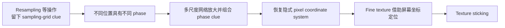
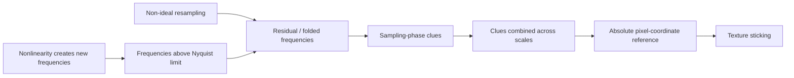

# 1. 从 Texture Sticking 到像素坐标泄漏：网络为什么会学会屏幕坐标？

StyleGAN3 的出发点不是“怎样把 GAN 做得更强”，而是一个更基础的问题：**为什么一个主要由卷积构成、没有显式输入绝对坐标的生成网络，会偷偷依赖 pixel coordinate system？**

论文先从一种很直观的异常开始。真实世界中的结构不是彼此独立运动的：一个人转头时，鼻子会跟着头部移动，鼻子上的毛孔、皱纹又会继续跟着鼻子移动。粗尺度结构的变化，会逐层决定更细尺度结构的位置。典型 GAN 的生成过程看起来也很像这种层级关系：低分辨率的 coarse feature 先决定整体结构，随后经过上采样、卷积和非线性逐渐产生越来越细的纹理。按照这种直觉，粗尺度特征不仅应该决定“有没有一根头发”，还应该决定“这根头发具体长在哪里”。

StyleGAN2 却没有完全做到这一点。整体脸型、头部姿态可以连续变化，但毛发、皱纹等细节常常没有真正跟着物体表面运动，而像是固定在屏幕像素上。为了把这种现象从主观感受变成可观察的证据，作者设计了 Figure 1 中的两个实验。

生成器接收一个 **latent（潜变量）**，这里可以先把它理解成控制生成结果的高维坐标；latent 发生很小变化时，生成图通常也会连续地发生小变化。作者先选定一个 **central latent（中心潜变量）**，再在它周围做很多微小扰动，于是得到一小片 **small neighborhood（中心 latent 附近的一组相近潜变量）**。因为这些 latent 彼此很接近，生成出来的仍然是同一个对象，只是位置、姿态或局部细节略有变化。


Figure 1 左侧的 top row 是 central latent 对应的生成图，bottom row 则把 neighborhood 中许多生成结果逐像素平均。这个平均实验隐含了一个很简单的判断标准：如果对象发生轻微运动时，眼睛、毛发、皮肤纹理都真正跟着对象一起移动，那么同一个细节在不同图像中的位置就会略有偏移，许多图像平均以后理应整体变得模糊。StyleGAN3 基本符合这个预期；但 StyleGAN2 的平均结果中，一些毛发仍然异常清晰。这说明这些纹理虽然看起来属于动物表面，生成时却长期停留在相同的 pixel coordinates。作者把这种现象称为 **texture sticking（纹理粘连）**。

右侧用另一个实验验证同一件事。作者沿 latent space 中的一条路径做 **interpolation（在相邻 latent 状态之间连续取中间点）**，从而得到一个平滑变化的生成序列，top row 展示其中若干生成图。随后，作者在每张图的同一个屏幕位置截取一小段竖直像素，并按时间从左到右堆叠起来。这样得到的 bottom row 不是一张普通图像，而是一张空间—时间切片：横轴表示生成序列的时间，纵轴表示那条固定竖线上的像素位置。

如果一根头发真的随头部运动，它穿过这条竖线的位置也应该随时间改变，于是在时空切片中形成倾斜或弯曲的轨迹；如果它始终停留在同一个像素位置，就会形成水平条纹。StyleGAN2 中大量 horizontal streaks，正是在说明许多细纹理没有随着对象本身运动。Figure 1 左右两种实验因此指向同一个结论：**粗尺度结构在移动，但部分细尺度纹理却绑定在屏幕坐标系上。**

真正值得追问的不是这个视觉 artifact 本身，而是：**网络为什么知道“这里是屏幕上的哪个位置”？**

卷积的权重共享很容易给人一种直觉：同一个局部结构无论出现在图像哪里，都经过同一组卷积核，因此 CNN 应该天然“不关心绝对位置”。但这只描述了卷积算子本身，并不能保证整个网络都没有位置信息。只要中间层存在某种随空间位置稳定变化的线索，后续网络就可以把它当成 **positional reference（位置参考）**。这种参考并不需要直接写成 $x=137,y=52$；边界附近出现的 padding pattern、显式 positional encoding、固定的 per-pixel noise，甚至采样过程留下的周期模式，都可能让网络逐渐判断自己位于哪里。

其中最隐蔽、也是论文真正关注的是 aliasing 所留下的 sampling-grid clue。论文脚注用 nearest-neighbor upsampling 给了一个很直观的例子。假设低分辨率 feature 是：

```text
a b
c d
```

做 $2\times$ nearest-neighbor upsampling 后会得到：

```text
a a b b
a a b b
c c d d
c c d d
```

这个操作表面上只是“把尺寸放大一倍”，但它同时在输出中留下了非常规则的 $2\times2$ block。后续卷积只要观察局部模式，就很容易区分当前位置处于重复块的左上、右上、左下还是右下。换句话说，网络已经获得了

$$
x\bmod 2,\qquad y\bmod 2
$$

这样的 **sampling phase（采样相位：当前位置相对于离散采样网格处于哪一种周期状态）** 信息。它还不知道完整的绝对坐标，但已经知道了坐标的一部分。

真正的问题来自多尺度结构。生成器会在多个分辨率层级反复进行类似操作，于是网络可能同时得到与 $2$、$4$、$8$、$16$ 等不同尺度相关的 phase clue。单独一条线索只告诉网络“当前位置属于哪一类周期相位”，但不同尺度的信息组合起来，就可以把位置限定得越来越精确。于是，即使模型从未显式接收 $(x,y)$，它仍有可能从这些采样副产物中逐渐恢复出 **absolute pixel coordinates（绝对像素坐标）**。bilinear 或 bicubic interpolation 会让这些规则痕迹变弱，却不意味着它们从原理上消失。

这时 texture sticking 的本质就更清楚了。理想的层级生成应该是“coarse geometry 决定 finer geometry，finer geometry 再决定 texture 的精确位置”；但一旦 pixel grid 提供了一套稳定的外部坐标，网络就有机会绕开这种空间继承关系：coarse feature 只需要决定某种细节是否存在，而细节具体落在哪里，则可以借助 pixel-coordinate clue 来定位。于是细纹理不再完全属于对象自身的坐标系，而开始依赖屏幕坐标。

问题还差最后一步：既然这是一个不自然的捷径，网络为什么会主动利用它？原因在于训练目标并不会要求“毛发必须严格从 coarse geometry 中继承连续的位置关系”。GAN 的 discriminator 主要判断最终静态图像是否真实。如果 sampling grid 恰好提供了一套稳定、容易利用的 reference frame，而借助它能够更方便地组织毛发、皱纹、皮肤等高频细节，那么 optimizer 没有理由主动放弃这条路径。对训练目标而言，只要最终图像足够逼真，这条 **shortcut（捷径：能够完成任务、但绕开我们期望表征机制的简单线索）** 就是有效的。

这也是 StyleGAN3 最重要的问题意识之一：**模型会利用我们没有意识到的信息通道。** pixel grid 原本只是计算机保存和计算 feature 的离散实现方式，但一旦采样过程泄漏了稳定的 phase information，它就可能从“实现细节”变成网络真正依赖的 representation coordinate system。



因此，StyleGAN3 真正要解决的已经不是“换掉 nearest-neighbor”这么局部的问题。nearest-neighbor 只是最容易看懂的例子；更根本的问题是，怎样保证整个生成器中的 feature 都无法携带这类不希望出现的 sampling-grid information。

要回答这个问题，就不能继续只把 feature map 看成一个 $H\times W\times C$ 的 Tensor。下一章需要建立论文最重要的理论视角：**离散 feature map 只是某个连续空间信号的一组 samples。** 一旦接受这个视角，convolution、upsampling、downsampling 甚至 ReLU 都需要重新从采样、频率和 equivariance 的角度理解。

# 2. 重新定义 Feature Map——离散 Tensor 只是连续信号的采样

上一章已经看到，StyleGAN2 的细节会“粘”在像素坐标上。论文希望进一步做到一件更严格的事：**即使图像只移动了不到一个像素，网络内部的所有特征也应该以完全一致的方式跟着移动。** 这就是后面反复出现的 continuous equivariance。

但在讨论怎样让网络满足这个要求之前，作者先遇到一个更基础的问题：CNN 中的 feature map 本来就是一个离散 Tensor，只在一个个像素位置上保存数值；而现在要研究的平移却可以是 $0.1$、$0.5$ 这样的任意连续位移。**如果始终把网格上的数值本身当成 signal，就没有一个统一的方式去描述这些亚像素位置上的 signal 是什么。**

因此，Section 2 没有直接修改网络结构，而是先重新规定“网络中的 signal 到底是什么”。

## 2.1 从离散 Feature Map 到连续 Signal

论文的做法是：**把真正的 feature 看成定义在连续二维空间中的函数，而把 Tensor 看成对这个连续函数的一组采样。**

作者用小写 $z(\mathbf{x})$ 表示连续信号，其中 $\mathbf{x}=(x_0,x_1)$ 是连续空间坐标；用大写 $Z[\mathbf{x}]$ 表示网络实际存储的离散 feature map。这里的 $z(\mathbf{x})$ 与 GAN 中表示 latent 的 $z$ 不是同一个概念，它只是论文在信号处理分析中使用的记号。

也就是说，我们平时看到的一个 $H\times W\times C$ Tensor，不再被解释成“signal 本身就是这 $H\times W$ 个格子”，而是理解成：每个 channel 背后对应一个连续二维 feature，而 Tensor 只记录了它在规则网格位置上的数值。

Figure 2 左侧画的就是这层关系。


图的上方是离散表示 $Z$，下方是连续表示 $z$。上下之间有两个方向：从 $Z$ 可以重建 $z$，从 $z$ 也可以重新采样得到 $Z$。论文后面的所有分析，都建立在这组对应上。

这里马上有一个关键问题：**一组离散 samples 为什么足以确定连续 signal？**

因为仅仅给定几个采样值，采样点之间当然可以存在无数种不同变化。StyleGAN3 不是认为“任何连续信号都能从 Tensor 唯一恢复”，而是额外限制了允许研究的信号：它必须是 **bandlimited signal（带限信号）**。

所谓频率，在这里不是时间频率，而是**空间频率**：它描述 feature 在空间中变化得有多快。缓慢变化属于低频，短距离内快速反复变化属于高频。bandlimited 的意思就是，signal 中不存在无限高的空间频率，而是存在一个最高频率。

假设采样率为 $s$，也就是单位长度上有 $s$ 个采样点，相邻采样点距离为 $1/s$。根据 Nyquist–Shannon sampling theorem，只要连续信号的最高频率不超过采样率的一半，那么这些离散 samples 就足以完整表示它：

$$
f_{\max}<\frac{s}{2}
$$

这就是论文为什么不断讨论 sampling rate 和 bandlimit。**sampling rate 决定当前这张离散网格最多能够忠实表达多快的空间变化。** 如果 continuous signal 中出现超过这个范围的频率，Tensor 中的 samples 就不能再唯一、正确地表示它；后面所谓 aliasing，正是从这里产生的。

在满足带限条件以后，从 $Z$ 到 $z$ 就可以使用经典的 Whittaker–Shannon interpolation。论文写成：

$$
z(\mathbf{x}) = (\phi_s * Z)(\mathbf{x})
$$

其中 $*$ 表示连续卷积，$\phi_s$ 是 ideal interpolation filter。二维情况下：

$$
\phi_s(\mathbf{x}) = \operatorname{sinc}(s x_0) \operatorname{sinc}(s x_1)
$$

这里不需要把 sinc 当成一个新的重点去记。它真正承担的作用只有一个：**在 sampling theorem 的条件下，把离散 samples 重建为当前 sampling rate 所能表示的带限连续信号。** 因此，$\phi_s$ 可以理解成连接 $Z$ 和 $z$ 的理想重建滤波器。

Figure 2 中反过来的箭头则更加直接：如果已经有连续信号 $z$，只需要在规则网格位置上读取它的值，就重新得到离散表示 $Z$。

为了把“规则网格采样”写成连续域中的数学操作，论文使用 Dirac comb $\amalg_s$。它本质上就是一排无限规则的采样位置。作者写成：

$$
\amalg_s(\mathbf{x}) = \sum_{\mathbf{X}\in\mathbb{Z}^2} \delta\left( \mathbf{x} - \frac{\mathbf{X}+\frac{1}{2}}{s} \right)
$$

这个公式本身不是理解 StyleGAN3 的重点。这里真正需要知道的是：$\amalg_s$ 表示 sampling grid，与连续信号相乘，就只留下采样位置上的值；式子里的 $1/2$ 是为了让采样点落在 pixel center。

因此 Figure 2 左侧最终建立的是：

$$
Z \;\xleftrightarrow[\text{sampling}] {\text{ideal interpolation}} z
$$

这时作者作出了 Section 2 最重要的规定：**后文把连续表示 $z(\mathbf{x})$ 当成真正被网络处理的 signal，而把离散 feature map $Z[\mathbf{x}]$ 仅仅看成它方便计算的 encoding。**

这个说法不是要告诉我们“Tensor 背后藏着一张真实图像”，而是在建立一个统一的分析框架。只要 $Z$ 表示的是一个带限连续信号，那么对 feature 做 $0.5$ pixel 的 translation 就有了明确含义：真正被平移的是连续的 $z(\mathbf{x})$，之后再在原来的 sampling grid 上读取新的 samples。

这就是论文为什么必须从 sampling theory 开始。**作者要研究的是连续空间中的运动，而不是整数 pixel index 的移动。**

论文还补充了一个理论与实现之间的差距。理想 sinc interpolation 的作用范围不是有限的，所以单位画布 $[0,1]^2$ 外的 samples 也可能影响画布内部。理论上需要无限大的 $Z$；实际网络显然做不到，因此后面会让 feature map 覆盖稍大于最终画布的区域。这个问题属于后面的工程实现，本章只需要知道：作者此时建立的是一个理想的 continuous-signal interpretation。

## 2.2 从连续 Signal 到连续 Network Layer

到这里，作者只是重新解释了 feature map，但真实 CNN 运行的仍然是离散计算。一个 convolution、ReLU 或 upsampling layer 接收的还是 Tensor $Z$，输出的还是 Tensor $Z'$：

$$
Z'=F(Z)
$$

所以紧接着出现第二个问题：

**如果 $Z$ 只是连续信号 $z$ 的离散编码，那么一个真实的离散网络层 $F$，在连续空间中究竟相当于对 $z$ 做了什么？**

论文用 $f$ 表示与离散操作 $F$ 对应的 continuous-domain operation：

$$
z'=f(z)
$$

于是现在有了两层描述：

$$
Z\xrightarrow{F}Z'
$$

$$
z\xrightarrow{f}z'
$$

而上一节建立的 sampling 和 interpolation，正好把这两层连接起来。这就是 Eq.1 的来源。

如果已经有一个真实的离散操作 $F$，想知道它对应什么连续操作，就从连续 $z$ 出发：先采样成 $Z$，执行 $F$，最后把离散输出重新重建成连续信号。论文写成：

$$
f(z) = \phi_{s'} * F\left( \amalg_s\odot z \right)
$$

这里 $s$ 是输入 sampling rate，$s'$ 是输出 sampling rate，$\odot$ 表示逐点相乘。

反过来，如果我们先规定理想情况下 continuous signal 应该经过操作 $f$，那么离散网络应当怎样实现它？做法就是先把输入 $Z$ 重建成 $z$，执行 $f$，再按输出 sampling rate $s'$ 重新采样：

$$
F(Z) = \amalg_{s'} \odot f\left( \phi_s*Z \right) \tag{1}
$$

所以 Eq.1 并不是为了增加一套复杂记号。它提供的是整篇 StyleGAN3 最核心的分析方法：

> **面对一个离散 Tensor operator，不只看它在数组上做了什么，而是把它还原到 continuous domain，检查它真正对连续 feature 做了什么。**

但第二个方向有一个非常重要的前提：$f(z)$ 的频率不能超过输出 sampling rate $s'$ 所允许的 bandlimit $s'/2$。如果连续操作产生了网格无法表示的高频，那么最后虽然仍然可以采样得到某个 $Z'$，但这个 $Z'$ 已经不是 $f(z)$ 的 faithful representation。

也就是说：

$$
f(z) \text{ 产生超过 }s'/2\text{ 的频率} \quad\Longrightarrow\quad Z' \text{ 无法忠实表示 }f(z)
$$

后面作者分析 upsampling、downsampling 和 nonlinearity 时，本质上一直在检查这一件事。

有了 $f$ 以后，论文终于可以正式定义自己真正追求的 **equivariance（等变性）**。假设 $t$ 表示二维空间中的某种变换，例如 translation。如果：

$$
t\circ f = f\circ t
$$

那么 $f$ 对这个变换是 equivariant 的。换成更直观的写法就是：

$$
f(t(z)) = t(f(z))
$$

左边表示“先移动 feature，再经过 layer”，右边表示“先经过 layer，再把结果做相同移动”。如果两者相等，说明这个 layer 的处理方式不会因为 feature 恰好位于 pixel grid 的不同 phase 而改变。

这里终于可以看出，前面建立 continuous representation 的目的是什么。因为 $t$ 现在可以表示任意连续 translation，包括 $0.1$ pixel、$0.5$ pixel，而不只是整数像素移动。于是论文能够真正讨论 **continuous translation equivariance**。

这也把本章重新接回了 texture sticking。上一章的问题是，物体结构已经连续移动，但 fine detail 却部分固定在 pixel coordinates 上。StyleGAN3 的目标就是消除这些 pixel-grid positional references，使网络中的每一层都不能根据采样网格的位置改变自己的行为。论文把这个要求转化成：**网络层应当对 subpixel translation 保持连续等变性。**

有了这套分析框架以后，作者首先检查最普通的 convolution。

离散 feature map 上的卷积写成：

$$
F_{\mathrm{conv}}(Z) = K*Z
$$

把它代入 Eq.1，可以得到：

$$
\begin{aligned} f_{\mathrm{conv}}(z) &= \phi_s* \left[ K* \left( \amalg_s\odot z \right) \right] \\ &= K* \left[ \phi_s* \left( \amalg_s\odot z \right) \right] \\ &= K*z \end{aligned} \tag{2}
$$

中间一步只是利用卷积的交换律和结合律；最后一步使用了前面建立的事实：对一个满足带限条件的连续信号，先采样再进行理想重建可以恢复原来的 $z$。

Eq.2 的结论很简单，却非常重要：**离散 feature map 上的普通 convolution，在作者的连续解释下，就是 kernel $K$ 在连续 feature $z$ 上滑动。**

因此 convolution 本身没有破坏这套框架。它不会产生输入中原本不存在的新频率，所以不会把 signal 推到当前 bandlimit 之外；同时 convolution 与 translation 可以交换顺序，因此它满足 continuous translation equivariance。

rotation 的要求更严格：如果想让卷积对任意旋转也保持 equivariance，kernel $K$ 本身必须具有 radial symmetry，也就是旋转以后仍然相同。论文后面会利用这一点构建 rotation-equivariant 的 StyleGAN3-R；这一章不需要继续展开。

到这里，Section 2 实际上只完成了一件事，但它决定了后面整篇论文的分析方式：

**StyleGAN3 不再把 CNN 看成在离散像素格子上处理数值，而是把每一层都解释成对连续、带限 feature 的操作；Tensor 只是这些 feature 在某个 sampling rate 下的离散编码。**

有了这套视角，作者接下来才能逐个检查 generator 中的 primitive operations。Convolution 已经通过了检查，那么真正的问题就落到了后面的 upsampling、downsampling 和 nonlinearity：它们是否会产生当前 sampling rate 无法表示的频率，以及这些频率为什么最终会变成 aliasing 和 pixel-grid positional references。

**一句话总结：StyleGAN3 先用 sampling theory 建立 $Z\leftrightarrow z$，再用 Eq.1 建立 $F\leftrightarrow f$，从而把“网络是否依赖像素网格”转化成一个可以在 continuous domain 中严格检查的 equivariance 问题。**
# 3. Aliasing 到底从哪里来——哪些算子破坏了连续表示？

第 2 章已经建立了一套新的观察方式：网络实际存储的是离散 feature map $Z$，但分析时把它理解为某个连续、带限信号 $z$ 的采样；一个离散网络层 $F$，也要进一步追问它在连续域中对应什么操作 $f$。普通 convolution 已经通过了这套检查：它不会产生新的频率，而且与连续 translation 可以交换顺序。

那么接下来最自然的问题就是：**generator 里的其他基本操作呢？**

典型 StyleGAN generator 除了 convolution，还不断使用 upsampling、downsampling 和 nonlinearity。StyleGAN3 的核心发现并不是“所有离散操作都有问题”，而是这些操作中有些虽然在常规图像生成中看起来完全正常，却会破坏上一章建立的 continuous interpretation，让 sampling grid 的信息重新泄漏进 feature。

## 3.1 Resampling 本身没有错，问题是实际滤波并不理想

先看 upsampling。一个容易产生误解的地方是：**论文并不认为 upsampling 天生会制造 aliasing。**

在连续域中，理想 upsampling 根本不修改 signal：

$$
f_{\mathrm{up}}(z)=z
$$

它做的只是把输出 sampling rate 从 $s$ 提高到更大的 $s'$。也就是说，底层连续信号完全没变，只是用更密的网格来表示同一个 $z$。这样做的意义，是给后续 layer 留出更多 frequency headroom：采样率提高以后，新的 Nyquist limit $s'/2$ 更高，后续操作可以加入更高频的内容，而暂时不会超出离散表示能力。

按照第 2 章 Eq.1，这个理想操作对应的离散过程可以理解为：

$$
Z \rightarrow \text{reconstruct continuous }z \rightarrow \text{sample at rate }s' \rightarrow Z'
$$

实际实现时，不需要真的构造无限连续函数，而是先在旧 samples 之间插入零，再使用 interpolation filter 生成新的采样值。

Downsampling 则相反。假设输出 sampling rate 从 $s$ 降到 $s'$，其中 $s'<s$，那么新的网格只能表示最高到 $s'/2$ 的频率。如果直接丢弃 samples，原信号中位于 $s'/2$ 以上的部分就没有地方可去。因此理想 downsampling 必须先 low-pass：

$$
f_{\mathrm{down}}(z) = \psi_{s'}*z
$$

把超过新 bandlimit 的频率去掉以后，才能降低 sampling rate。

因此，从连续理论看，upsampling 和 downsampling 都可以完全保持 translation equivariance。真正的问题出现在**理想 low-pass filter 无法被实际网络精确实现**。

理想 sinc filter 的空间支持范围是无限的，而 CNN 中的 filter 必须是有限大小，所以实际用的 nearest-neighbor、bilinear、bicubic、strided convolution，甚至常规图像处理中质量很高的 resize filter，都只是某种 approximation。它们无法把不希望保留的频率压到真正的零。

这就是 aliasing 的第一条来源。

第一章提到的 nearest-neighbor 是最容易看懂的极端情况。把 $4\times4$ feature 放大到 $8\times8$ 时，一个 sample 会直接复制成一个 $2\times2$ block。于是放大后的 feature 中存在非常稳定的周期结构：只要看局部 pattern，后续 layer 就有可能区分当前位置属于这个 $2\times2$ block 的哪一个 phase。

也就是说，网络无意中获得了类似下面的信息：

$$
x\bmod 2,\qquad y\bmod 2
$$

这不是对象自身携带的位置，而是 **sampling grid 留下的位置线索**。

换成 bilinear 或 bicubic 后，硬邦邦的 $2\times2$ block 消失了，但问题并没有从原理上消失。只要 interpolation filter 没有完全消除不应该存在的频率，就仍然会留下很弱的 grid after-image。对人眼来说这些痕迹可能完全不可见，但对一个有大量 channel、layer 和训练时间的网络来说，它们仍然是稳定而可利用的信息。

因此这里真正的判断标准不是：

> resize 后的图看起来平不平滑？

而是：

> **这个 resampling operation 是否把 sampling grid 的 phase 信息压到了网络无法利用的程度？**

这也是为什么 StyleGAN3 后面会使用远强于普通图像 resize 的滤波器。

## 3.2 ReLU 为什么也会制造 Aliasing？

如果 aliasing 只是来自不够好的 resampling filter，那么解决方案似乎很直接：把 up/downsampling filter 做得足够好就结束了。

但 Figure 2 右侧告诉我们，问题还有第二个来源，而且更容易被忽略：**pointwise nonlinearity。**


先区分两个问题。在 continuous domain 中，ReLU 本身对几何变换没有问题。设

$$
\sigma(z)=\max(0,z)
$$

那么先移动 $z$ 再做 ReLU，与先做 ReLU 再移动，结果仍然一致。因为 ReLU 只看当前位置的数值，不关心这个位置的绝对坐标。所以从“几何操作是否 commute”来看，pointwise nonlinearity 天然满足 translation 和 rotation equivariance。

真正的问题出在 **bandlimit**。

假设输入 $z$ 是一个平滑的 bandlimited signal。经过 ReLU 后，所有负值都会被截到零，而原来穿过零点的平滑曲线会出现折角。这样的尖锐变化不可能只靠原来的有限频率组成；从 Fourier 视角看，它需要额外的高频成分来表达。

因此：

$$
z\text{ 是 bandlimited}
$$

并不能推出：

$$
\sigma(z)\text{ 仍然具有相同 bandlimit}
$$

恰恰相反，ReLU 这样的非线性可以产生任意高的频率。

这就是 Figure 2 右侧标出的 **No faithful discretization**：连续域里的 $\sigma(z)$ 已经包含当前 sampling rate 无法表示的频率。如果此时直接在原来的网格上取 samples，那些超出 Nyquist limit 的高频就无法保持原来的身份，而会折叠到较低频率中。

这才是 aliasing 的本质：**连续 signal 中存在的不同频率，在离散采样后变成了无法区分的同一组或相近的 samples。** 原本属于高频的信息被错误地表现成较低频 pattern，而这些错误 pattern 又与 sampling grid 的 phase 有稳定关系。

因此，理论上正确的 nonlinearity 不能只是：

$$
z\rightarrow\sigma(z)
$$

而应该在 nonlinearity 之后重新限制 bandlimit：

$$
f_\sigma(z) = \psi_s*\sigma(z)
$$

也就是先允许 ReLU 在连续域中产生新的频率，再用 low-pass filter 去掉当前输出网格无法表示的部分，最后才重新离散化。

论文特别强调了一点：在它建立的这套 primitive operations 中，**nonlinearity 是唯一真正能够产生 novel frequencies 的操作。** Convolution 只是重新组合已有频率，理想 resampling 只是改变表示这些频率的 sampling rate；真正负责向生成器逐层加入新频率内容的，是 nonlinearity。

这使得“滤掉 nonlinearity 产生的过高频率”不仅是在修 artifact，更是在控制每一层到底允许向 signal 中增加多少新信息。这个认识会直接进入第 4 章的 filtered nonlinearities 和 flexible layers。

## 3.3 一点点 Sampling Phase，为什么最后会变成绝对坐标？

到这里已经有两条 aliasing 路径：



但还有一个问题：一层网络留下的一点 phase clue，看起来只能区分“奇数/偶数”或某个周期位置，它怎么会变成 absolute pixel coordinates？

关键在于 generator 是多尺度层级结构。

以 nearest-neighbor 的例子看，一次 $2\times$ upsampling 可能让后续网络获得 $x\bmod2$ 的信息；如果类似线索在更粗、更细的多个尺度同时存在，网络还可能获得与 $4$、$8$、$16$ 等周期相关的 phase 信息：

$$
x\bmod2,\quad x\bmod4,\quad x\bmod8,\quad x\bmod16,\ldots
$$

这些线索单独看都只是周期性的，但组合起来以后，对一个有限大小的 feature map 来说，它们可以把位置限定得越来越精确。论文在第一章的脚注明确指出：如果相同的 sampling clue 在所有尺度上存在，网络就有可能重建 absolute pixel coordinates。

这解释了一个看似矛盾的现象：aliasing 在单层里可能弱得几乎看不见，但 generator 并不需要某一层直接提供完整坐标。只要每一层都泄漏一点与 grid 有关、并且长期稳定的信息，后面的网络就可以把这些微弱线索不断放大和组合。

训练目标也不会主动禁止它这样做。只要利用这套坐标系能够更容易地放置毛发、皮肤纹理或其他高频结构，optimizer 就会使用它。最终，fine detail 的精确位置不再完全从 coarse feature 继承，而部分从 pixel grid 中读取。

因此，第 3 章最终得到的结论不是简单的“低质量 resize 会 alias”。

更准确地说：

**StyleGAN2 的问题来自连续信号与离散表示之间的契约被破坏了。Non-ideal resampling 会留下 sampling-grid 痕迹，nonlinearity 又会制造当前 sampling rate 无法表达的新频率；这些 aliasing 在多尺度网络中被组合以后，就形成了可供网络使用的绝对坐标捷径。**

下一步的问题因此非常明确：既然已经知道这些信息究竟从哪里泄漏，能不能逐条把泄漏路径堵住，同时还保留 generator 生成高频细节的能力？

# 4. StyleGAN3 如何一步步把这些“坐标捷径”堵死

第 3 章已经把问题定位清楚了：StyleGAN2 中真正危险的不是 convolution，而是 **边界、非理想 resampling，以及 nonlinearity 产生的超带宽频率**。这些问题都会让 feature map 中留下与 sampling grid 有关的 phase clue，网络再把这些 clue 跨尺度组合，就能绕开 coarse-to-fine 的空间继承关系。

Section 3 接下来做的事情因此非常直接：**不重新发明一个完全不同的 GAN，而是从 StyleGAN2 出发，把前面找到的泄漏路径一条一条堵住。**

Figure 3 就是这一过程的路线图。A 是原始 StyleGAN2，B～H 逐步加入修改，T 得到最终的 translation-equivariant StyleGAN3-T，R 再进一步得到 rotation-equivariant StyleGAN3-R。这里不用记具体 FID 或 EQ 数字，真正重要的是每一步为什么会出现在下一步之前。


## 4.1 先建立一个能够被“连续变换”的 Generator 起点

StyleGAN2 的 synthesis network 从一个 learned $4\times4$ constant $Z_0$ 开始。这个输入本身就是固定离散网格上的 Tensor，但论文现在想检验的是：

$$
g(t[z_0];w)=t[g(z_0;w)]
$$

也就是：如果输入 representation 先发生任意连续 translation 或 rotation，最终输出是否会做完全相同的变换。

问题在于 learned $4\times4$ constant 并不适合精确施加这种连续变换。因此 config B 先把它换成 **Fourier features**。这些 feature 是定义在连续空间中的固定低频正弦模式，因此可以精确地平移、旋转，而且天然可以延伸到无限空间。这样做首先不是为了“增强位置编码”，而是为了得到一个**可以被严格施加连续几何变换的输入 representation**。

这一步非常重要，但它本身没有解决 aliasing。Figure 3 中 config B 的 equivariance 仍然很差，说明真正的问题确实还在 synthesis network 内部。

接着作者移除 per-pixel noise。原因和第一章的目标完全一致：如果每一层都能直接获得一张固定在像素网格上的 noise map，那么 fine detail 的精确位置就不必完全从 underlying coarse feature 中继承。论文希望达到的是：**一个细节出现在哪里，只能由更粗一级的 feature 决定。** 所以 config C 去掉了这条额外的位置通道。

config D 又进一步简化 StyleGAN2：减少一些与核心问题无关的训练机制、去掉 output skip connections，并在 convolution 前加入简单 normalization。这里不需要记具体工程细节，它的作用主要是得到一个更干净的 baseline。到此为止，作者只是把“输入”和“结构”整理好，真正的 alias-free redesign 还没有开始。

## 4.2 按照连续信号理论，逐项修复 Boundary、Resampling 和 Nonlinearity

第 2 章的 continuous interpretation 默认 feature 是定义在无限平面上的，而实际 CNN feature map 有边界。普通 padding 会让靠近边缘的位置看到特殊 pattern，于是“离边界多远”本身就成了一条 absolute-coordinate clue。

所以 config E 首先处理 boundary：网络内部始终维护比目标 canvas 更大的区域，每层计算以后只 crop 回这个扩展 canvas。这样做的目的不是提高画质，而是**不让边界成为位置参考**。

同一个 config 还替换了 StyleGAN2 原来的 bilinear upsampling filter。第 3 章已经知道，理想 upsampling 本身不会破坏 continuous signal，问题来自实际 interpolation filter 对不该保留的频率压制得不够干净。作者因此改用 windowed-sinc filter，并用 Kaiser window 控制有限长度 filter 的 frequency response。

Figure 4a 正好解释为什么“换一个更好的 filter”还不是一句简单的话。


一个有限 low-pass filter 不可能在某个频率位置突然从完全通过变成完全阻断。Figure 4a 中，$f_c$ 是 cutoff frequency，$f_h$ 控制 transition band 的宽度：在 passband 中希望有用频率尽量不受影响，经过 transition band 后进入 stopband，才希望不需要的频率被强烈压低。

因此，真正决定 antialiasing 能力的不是“filter 看起来够不够平滑”，而是：

> **当频率进入会发生 aliasing 的区域时，filter 到底已经衰减了多少？**

config E 先保留传统的 **critical sampling** 思路，把 cutoff 放在 Nyquist limit 附近，即 $f_c=s/2$。这已经比 StyleGAN2 的 bilinear filter 更严格，但仍然没有解决第 3 章发现的第二个来源：nonlinearity。

ReLU / Leaky ReLU 的麻烦在于，它们会产生输入中原本不存在的新频率。即使进入 nonlinearity 之前的 $z$ 完全 bandlimited，$\sigma(z)$ 仍然可能包含超过当前 Nyquist limit 的高频。因此理论上真正需要的是：

$$
f_\sigma(z)=\psi_s * \sigma(z)
$$

也就是先执行 continuous nonlinearity，再 low-pass，把当前 sampling rate 无法表示的频率去掉以后才能重新离散化。

真实网络没法真的进入无限分辨率的 continuous domain，所以 config F 用一个离散近似实现同样的思想：

$$
\text{upsample} \rightarrow \text{Leaky ReLU} \rightarrow \text{low-pass + downsample}
$$

这里**先临时 upsample**是关键。sampling rate 提高以后，Nyquist limit 也跟着提高，Leaky ReLU 新生成的一部分高频就有空间暂时被正确表示，而不是一产生就立即 alias；随后 downsample 之前再通过 low-pass filter，把最终 sampling rate 无法容纳的部分删除。

这就是 Figure 4b 中每个核心 layer 为什么会出现 `Upsample → Leaky ReLU → Downsample`。它并不是为了改变 feature resolution，而是在离散计算中近似“continuous nonlinearity + bandlimit”这个理论操作。

做到这里，两个主要 alias source 都已经被处理：resampling 用了更严格的 filter，nonlinearity 后也主动重新 bandlimit。但作者继续发现，仅仅使用高质量 filter 仍然不够。

原因出在刚才保留的 critical sampling。

如果 cutoff 就贴在 Nyquist limit $s/2$ 附近，实际 filter 的 transition band 还没有完全结束，就已经进入了最危险的 alias region。换句话说，**你虽然有一个很好的 filter，却没有给它足够的频率空间完成衰减。**

于是 config G 改成 **non-critical sampling**。作者把 cutoff 主动往低频方向移动：

$$
f_c=\frac{s}{2}-f_h
$$

这样，所有位于 $s/2$ 以上、真正会发生 aliasing 的频率，都已经进入 filter 的 stopband。

这等价于一种 oversampling：同样多的 samples，不再用来表示“理论上能塞进去的最快 signal”，而是用来表示一个更低带宽、变化更慢的 signal。多出来的 sampling capacity 被当作 **antialiasing guard band**。

这一步的思想很重要。普通图像 resize 往往希望在“保留高频细节”和“抑制 alias”之间折中；StyleGAN3 的目标不同——在 generator 的早期和中间层，微弱 alias 也可能被网络主动放大。因此作者宁可牺牲一部分可用 bandwidth，也要确保 grid clue 已经被真正压入 stopband。

但最高分辨率的最后几层不能一直这样做，因为最终图像仍然需要包含训练数据中的真实锐利细节。所以 non-critical sampling 主要用于较早和中间的 layer，最后的高分辨率 layer 才逐渐接近 critical sampling。

到 config G 为止，第 3 章发现的主要 aliasing 路径已经基本被对应处理了。

## 4.3 为什么还需要 Transformed Fourier Features 和 Flexible Layers？

处理完 aliasing 后出现了一个新的问题：如果所有 layer 都真的高度 equivariant，那么中间层本身就不擅长“偷偷改变整个对象的 global pose”。某个 intermediate feature 一旦整体发生 translation 或 rotation，这个变化会一直传递到最终输出。

因此，最终图像的全局位置和朝向更多由最初的 Fourier features 决定。

为了让不同 latent 仍然能够生成不同 global translation / rotation，config H 没有重新给后续 layer 加坐标，而是让 intermediate latent $w$ 通过一个 learned affine transform，直接控制**输入 Fourier features 的整体 translation 和 rotation**。

这和原来的 pixel-coordinate shortcut 本质不同。原来的问题是每个中间层都可能偷偷读取固定 screen grid；现在则是显式改变最初的 continuous coordinate system，后续所有 finer feature 再通过 equivariant hierarchy 一起继承这个变换。

做到 config H，equivariance 已经明显提升，但作者仍然观察到 residual artifacts。继续分析后发现：**最低分辨率 layer 的 filtering 还不够强。**

原因是这些 layer 虽然 resolution 很低，却可能在自己的 bandlimit 附近拥有很丰富的频率内容。要把 alias 压干净，它们反而最需要宽 transition band 和极强 stopband attenuation。

这暴露出 StyleGAN2 rigid resolution schedule 的另一个限制。StyleGAN2 基本按照：

$$
4\rightarrow8\rightarrow16\rightarrow32\rightarrow\cdots
$$

固定提高 sampling rate，相当于默认把三件事情绑在了一起：这一层处于网络的什么位置、Tensor 有多少 samples、signal 应该允许包含多高的频率。

StyleGAN3-T 的 config T 把它们拆开。

Figure 4c 中最重要的是三个量。$f_c$ 表示这一层真正允许保留到哪里的 **signal cutoff**；$f_t$ 表示到了哪个频率以后，filter 必须已经达到要求的 **stopband suppression**；$s$ 则只是实际用多少 samples 来表示这个 signal。

作者先决定每一层应该允许多少真实 bandwidth，即 $f_c$；再规定 alias 最晚应该在 $f_t$ 之前被压下去；最后才选择足够高的 sampling rate $s$，并尽可能给 transition band 留出空间。

因此早期 layer 可以出现这样的状态：

$$
\text{signal bandwidth 很低} \quad\text{但}\quad \text{sampling rate 相对很高}
$$

这并不是浪费，而是为了获得极宽的 antialiasing margin。随着网络逐层深入，$f_c$ 才逐渐升高，让 finer structure 一层层进入 representation；靠近最终输出时，guard band 才缩小，让网络有能力匹配真实图像中的高频细节。

这就是 **flexible layers** 最核心的变化：

> **Tensor resolution 不再等于 signal bandwidth。**

sampling rate 只是“用多密的网格表示 signal”，而 signal 真正包含多高的频率，则由 $f_c$ 独立控制。第 2 章建立的 continuous representation 到这里终于完全落成了一套网络设计原则。

config T 由此得到 StyleGAN3-T，剩余的 translation artifact 基本被消除。

如果还希望进一步实现 rotation equivariance，就需要满足更严格的方向对称性。config R 做两项关键修改：把普通 $3\times3$ convolution 换成 $1\times1$ convolution，使 convolution kernel 本身不再具有固定空间方向；同时把用于 downsampling 的 separable sinc-based filter 换成 radially symmetric 的 jinc-based filter，使 filtering 本身也不偏好水平或垂直方向。这样才得到 StyleGAN3-R。

回头看 Section 3，StyleGAN3 并不是靠某一个“神奇模块”解决问题。它真正做的是把第 2、3 章的理论逐项兑现：

**先建立可以连续变换的输入；再删除 noise 和 boundary 这些显式位置参考；然后严格控制 resampling 和 nonlinearity 的带宽；最后把 signal bandwidth 与 sampling rate 解耦，让每一层都拥有足够的 antialiasing margin。**

最终得到的设计目标仍然是第一章那一句话：**fine detail 的精确 sub-pixel position，只能从 underlying coarse features 逐层继承，而不能再从 pixel grid 中偷取。**

**一句话总结：StyleGAN3 的核心不是“换了更好的上采样”，而是把每层都重新设计成一个受控的 continuous-signal processor，让 sampling grid 从生成过程的隐藏坐标系退回成纯粹的计算表示。**


# 5. Alias 消失以后，网络学会了怎样表示空间？

前面三章已经完成了一条完整的因果链：StyleGAN2 中存在 texture sticking；它来自 pixel grid 泄漏出的坐标捷径；这些捷径的重要来源又是 resampling 和 nonlinearity 产生的 aliasing；最后，StyleGAN3 通过更严格的信号处理把这些信息路径逐条切断。

但到这里仍然只能说明“设计上应该更合理”。真正关键的问题是：**当网络无法再依赖 pixel grid 时，它是否还能保持生成质量？更重要的是，它内部究竟换成了什么方式去表示空间位置？**

Section 4 的 Figure 5 和 Figure 6 正好分别回答这两个问题。

## 5.1 先确认：更强的 Equivariance 不是靠把图像做模糊换来的

StyleGAN3 施加了非常严格的频率约束。一个自然的担忧是：既然不断 low-pass、限制 bandwidth、留出 guard band，那么 texture sticking 变少，会不会只是因为模型不再生成足够锐利的细节？

Figure 5 的作用就是先排除这个解释。


左侧比较 StyleGAN2、StyleGAN3-T 和 StyleGAN3-R 在多个数据集上的生成质量与 equivariance。具体数字不需要记，真正重要的是结果之间的关系：StyleGAN3-T 和 StyleGAN3-R 的 FID 仍然与 StyleGAN2 处在相近水平，但 translation equivariance 大幅提高；进一步加入 rotation-equivariant 设计以后，StyleGAN3-R 的 rotation equivariance 也明显提高。

换句话说，作者并不是通过“少生成一点高频”来逃避问题。Generator 仍然能够合成清晰、复杂的图像，但这些细节在对象运动时开始以更一致的方式跟随 underlying structure。

论文的 accompanying videos 给出了更直观的证据：StyleGAN2 中毛发和纹理容易固定在 screen coordinates 上，而 StyleGAN3 的运动更像一个连贯物体在空间中发生变化。Figure 5 中的 EQ-T / EQ-R 则把这种现象变成定量检验：它们比较“先变换 generator 的输入坐标再生成”和“先生成再对输出做对应变换”之间有多一致。本质上仍然是在检查第 2 章的交换关系：

$$
g(t[z_0];w) \approx t[g(z_0;w)]
$$

因此 Figure 5 的结论可以压缩成一句话：**alias-free redesign 没有简单牺牲生成能力，而是真的改变了网络对空间变换的响应方式。**

Figure 5 右侧的 ablation 又提供了一个重要旁证。重新加入 per-pixel noise，或者退回 StyleGAN2 原来的 layer specification，equivariance 会明显恶化。这说明前面那些设计并不是装饰性的优化；网络只要重新获得稳定的 pixel-grid clue，就会再次利用它。

不过输出变得 equivariant 只是结果。StyleGAN3 更值得学习的地方，是 Figure 6 暗示网络内部的 representation 也发生了变化。

## 5.2 Figure 6：网络没有失去“位置”，反而开始自己表示位置

Figure 6 把 StyleGAN2、StyleGAN3-T 和 StyleGAN3-R 的内部 feature 可视化出来。作者从某一层取三个 feature map，把它们分别映射到 RGB，因此图中的颜色不是最终图像颜色，而是在帮助我们观察三个 channel 在空间中怎样变化。


StyleGAN2 的 internal representations 看起来大多和对象结构本身比较相似：脸部、轮廓、局部区域的强弱都能直接看到。作者把这类 representation 概括为主要编码 **signal magnitude**——也就是“某种 feature 在这里有多强”。

StyleGAN3 中却出现了明显不同的 pattern。尤其在 StyleGAN3-R 中，一些 feature map 不再像是在直接画脸，而出现连续的条纹、弯曲的等值线和周期性结构。作者认为这些 feature 开始承担另一种角色：**编码 phase information。**

为什么 phase 会和“位置”有关？

可以先看一个最简单的周期信号：

$$
z(x)=a\cos(\omega x+\phi)
$$

其中 $a$ 是 amplitude，它控制这个 pattern 有多强；$\phi$ 是 phase，它决定同一个 pattern 在空间中向左还是向右移动。改变 $a$，主要改变强弱；改变 $\phi$，则会改变结构出现的位置。

因此，如果多个 feature channel 不只编码 magnitude，还形成稳定的 phase relationships，网络就有可能利用这些关系表达“在当前结构内部，我处于什么位置”。

这就解释了作者为什么说：当 generator 要在一个 surface 上继续合成细节时，**它需要 invent a coordinate system**。

假设 coarse layers 已经建立了脸部或物体表面的整体结构，后续 layer 要把毛发、皱纹、皮肤纹理精确放在这个表面上，仅仅知道“这里有一块皮肤”是不够的。它还需要某种内部空间参考，才能区分表面的不同位置。

StyleGAN2 也需要解决这个问题，但它有一条很方便的捷径：sampling grid 已经不断泄漏 phase clues，于是网络可以部分使用固定 screen coordinates 来定位细节。

StyleGAN3 把这条路径切断以后，“需要知道位置”这件事并没有消失。网络只能从已有 feature 中发展出自己的 positional structure。Figure 6 中那些 phase-like patterns，就是作者观察到的这种 emergent representation。

## 5.3 两种 Phase 看起来相似，本质却完全不同

这里最容易产生一个误解：

> 第 3 章一直在消除 sampling phase，为什么第 5 章又把 phase representation 当成好现象？

因为这两种 phase 的**来源不同**。

前面的问题是：

$$
\text{feature position} \leftarrow \text{phase of the external sampling grid}
$$

sampling grid 是网络实现中的外部坐标系。无论对象怎样移动，pixel $(100,100)$ 仍然是屏幕上的同一个位置。如果网络用这套 phase 来定位毛发，那么对象移动时，毛发就可能继续偏向原来的 screen position，于是产生 texture sticking。

而 Figure 6 中作者所讨论的 emergent phase information，更接近：

$$
\text{feature position} \leftarrow \text{relationships inside the learned representation}
$$

这套内部结构不是由 resize kernel、padding 或固定 pixel lattice 免费提供的，而是在 aliasing 被压制以后由网络自己发展出来。作者据此推测，网络正在建立一种能够对 object surfaces 进行精确定位的 coordinate system。

这里需要保持一个边界：**Figure 6 并没有严格证明这些 feature 等价于某种显式的 UV map、3D surface coordinate 或解析的数学坐标。** 论文展示的是 internal representation 的明显变化，并把其中一些 pattern 解释为 phase encoding 和 emergent positional encoding。把它进一步理解成“随对象结构一起运动的内部坐标系”是符合作者论述的解释，但不是一个已经被完全解析的机制证明。

即便如此，这个结果依然非常重要，因为它重新定义了 StyleGAN3 所解决的问题。

问题从来不是：

> 网络是否应该拥有 position information？

如果 generator 完全不知道位置，它根本无法把细节精确组织成图像。

真正的问题是：

> **Position information 应该从哪里来？**

StyleGAN2 允许：

$$
\text{position} \leftarrow \text{pixel-grid shortcut}
$$

而 StyleGAN3 希望迫使网络更接近：

$$
\text{position} \leftarrow \text{hierarchically inherited representation}
$$

于是第一章所说的 natural transformation hierarchy 到这里才真正闭环。一个 coarse feature 不只是决定“后面有没有某个细节”，还应该决定这个细节精确出现在哪里；当 coarse structure 移动时，后续用于定位 finer detail 的内部 coordinate structure 也一起变化。

所以 StyleGAN3 最深的一层变化并不是在 output 上“去掉了 aliasing artifact”，而是**改变了网络能够使用的信息来源，从而改变了 optimizer 最终学出的 representation。**

这也是 Figure 6 比单纯的 FID 或 EQ 指标更值得记住的原因：一个很小、看似属于数字信号处理的 architectural constraint，最终改变的可能是网络内部组织世界的方式。

**一句话总结：StyleGAN3 消除的不是位置本身，而是 pixel grid 免费提供的位置捷径；当这条捷径消失后，网络开始发展自己的 phase-based spatial representation 来定位对象表面的细节。**

# 6. 把 StyleGAN3 变成自己的视觉网络分析框架

读完 StyleGAN3，如果最后只记住“upsample 前后要加更强 low-pass filter”，其实丢掉了论文最有价值的部分。

这篇论文真正提供的是一种分析视觉网络的方法：**不要只把网络看成 Tensor operator 的堆叠，还要追问这些 Tensor 在表示什么 signal、每一个 operator 对 signal 的频率和空间关系做了什么，以及网络有没有获得任务本来不应该提供的 shortcut。**

但在把它推广到其他网络之前，需要先看论文 Section 5 给出的限制，因为这些限制说明 StyleGAN3 并不是一套应该无条件套用的规则。

## 6.1 第一步不是“消灭 Aliasing”，而是先确定什么应该保持不变

StyleGAN3 追求 translation / rotation equivariance，是因为它假设自然图像中的对象可以在连续空间中移动，而细节应该跟随对象运动。对于这种任务，pixel grid 只是图像的采样方式，不应该决定物体内容。

但这个假设不是对所有数据都成立。

论文举了一个很典型的反例：如果训练数据本身就是 badly aliased 的黑白 cartoon，边缘存在明显 stair-step；或者数据是 retro pixel graphics，那么 jagged pixel structure 本身可能就是数据的一部分。此时一方面要求 generator 能做平滑 subpixel translation，另一方面又要求输出始终保持固定 pixel-grid 风格，两者本身就存在冲突。

所以从 StyleGAN3 抽象出的第一条原则不是：

> 所有视觉网络都应该去掉 pixel-grid dependence。

而是：

> **先明确任务希望哪些变换保持等变，哪些坐标信息本身就是语义。**

如果任务中的真实对象应该平移 $0.5$ pixel 后仍然只是同一个对象发生位移，那么 translation equivariance 是合理目标；如果 pixel alignment 本身就是任务定义的一部分，就不能机械消灭它。

这一步决定了后面所有分析有没有意义。

## 6.2 确定目标以后，再区分“Signal”和“它的离散表示”

StyleGAN3 的第二个可迁移思想，是不要默认：

$$
\text{Tensor} = \text{被建模对象本身}
$$

很多视觉系统真正关心的对象存在于连续空间，而 Tensor 只是经过 camera sampling、resize、patchify、stride 或 feature downsampling 以后得到的一种 representation。

因此分析一个网络时，可以先问：

> 当前这个 $H\times W$ feature 的一个格子究竟代表什么？它只是 sample，还是任务本身真的定义在这些格子上？

如果它只是 sample，就应该继续追问两个量：当前 sampling rate 是多少，以及当前 signal 实际包含到多高的 spatial frequency。

这两个量不能自动画等号。第 4 章 flexible layers 最重要的认识正是：

$$
\text{sampling rate} \neq \text{signal bandwidth}
$$

一个 feature map 有很多 samples，并不意味着它应该把频率一直用到 Nyquist limit；反过来，如果某个操作已经产生超过当前 sampling rate 能承载的高频，那么 Tensor resolution 看起来没有变化，也不代表 signal representation 仍然正确。

这个视角一旦建立，很多常见 layer 就应该重新分类：convolution 主要重新组合已有频率；resampling 改变 sampling rate，因此需要考虑 filtering；pointwise nonlinearity 不改变 Tensor shape，却能够创造新的频率。

也就是说，**shape analysis 和 signal analysis 是两套不同的问题。**

## 6.3 沿着网络追踪“频率是在哪里产生、在哪里被采样的”

有了 signal / sampling 的区分，下一步就可以像 StyleGAN3 一样逐层审计 frequency flow。

最重要的不是画完整 Fourier spectrum，而是判断每个 operation 属于哪一种角色：

$$
\text{preserve frequencies},\qquad \text{create frequencies},\qquad \text{change sampling rate}
$$

假设某一层 nonlinearity 生成了新的高频，那么立即要问：当前 sampling rate 能否表示？如果不能，在下一次 sampling 发生之前有没有 low-pass？

假设某一层准备 downsample，那么要问：新的 Nyquist limit 降低以后，旧 signal 中位于 limit 以上的频率是否已经删除？

假设进行了 upsample，也不能只问“用了 bilinear 还是 nearest”。真正应该检查的是实际 interpolation filter 的 transition band 和 stopband suppression 是否满足任务要求。

StyleGAN3 最值得迁移的地方就在这里：**aliasing 不是某一种 resize operator 的名字，而是一条完整的因果链。**

$$
\text{frequency content} \rightarrow \text{sampling constraint} \rightarrow \text{insufficient filtering} \rightarrow \text{frequency folding} \rightarrow \text{phase-sensitive representation}
$$

只检查其中某一环，容易把症状误认为根因。

## 6.4 再检查：网络有没有获得不该存在的“坐标捷径”

StyleGAN3 进一步提醒我们，即使某条信息在人眼看来很弱，只要它稳定、可预测，network 就可能主动利用它。

因此除了 frequency flow，还应该检查所有可能提供 positional reference 的路径，例如 padding / image boundary、fixed noise、explicit positional encoding、resampling artifacts、stride / patch phase，以及固定 tiling 等周期计算结构。

这些信息本身并不一定是坏的。例如 Transformer 中 positional encoding 是有意加入的；检测模型也可能确实需要 absolute location prior。

真正要问的是：

> **模型正在使用的 coordinate information，是任务设计者有意提供的，还是计算实现无意泄漏的？**

如果某条 shortcut 能让 loss 更快下降，optimizer 不会因为它“不符合我们的直觉”就拒绝使用。第一章 texture sticking 的根源正是如此。

所以一个网络出现异常 behavior 时，不能只问“哪个 layer 的输出开始难看”，还应该问：

> 这一层之前，模型是否刚刚获得了一种稳定而容易利用的新信息？

这把 artifact diagnosis 从“找坏 layer”提升成了“找信息泄漏路径”。

## 6.5 最后不要只看最终指标，要直接测试你关心的变换关系

StyleGAN3 没有只用 FID 判断问题是否解决，因为 FID 好并不意味着 generator 的 transformation hierarchy 正确。

如果我们真正关心一个 transformation $t$，最直接的测试就是比较：

$$
f(t(x))
$$

和：

$$
t(f(x))
$$

两者之间的差异。

这是一种非常通用的实验设计。关心 translation，就对输入做受控 translation；关心 rotation，就做 rotation；关心其他连续变化，也可以构造同样的 paired-path test。

如果最终输出出现误差，还可以把同样的思想向网络内部推进：比较每层 feature 在两条路径下是否仍然保持预期关系。这样可以找到 equivariance 最早在哪里开始破坏。

同时，Figure 6 给出了另一条经验：**修复 output artifact 以后，还要观察 internal representation 有没有发生结构性变化。** 如果某个 shortcut 真的是模型的重要信息来源，移除它以后，网络可能不得不发展新的 representation 来完成同一个任务。

这时频谱分析、phase statistics、feature visualization、layer-wise transformation error 都比单纯看最终 PSNR/FID 更有解释力。

## 6.6 这套框架也有边界

论文自己已经展示了几个不能忽略的边界。

首先，StyleGAN3 只改了 generator，discriminator 仍可能泄漏或偏好 absolute position。作者观察到头部旋转时 teeth 仍然不能完全正确运动，并怀疑 discriminator 对某些 pixel locations 存在偏好。这说明**只让一半系统满足期望 symmetry，不一定足够。**

其次，一些原本有用的机制需要重新设计，而不是简单删除。论文希望未来重新引入符合 hierarchical synthesis 的 stochastic noise；path length regularization 也应该鼓励邻近 feature 一起移动，而不是压制运动本身。

再进一步，attention 或 tokenization 也可以用同样的问题去审视。论文推测 attention layer 可能需要类似 nonlinearity 的高分辨率处理，而以 tokenizing transformer 开始的生成模型可能天然面临 equivariance 问题。这些并不是论文已经解决的结论，而是它留下的开放方向。

因此，把 StyleGAN3 迁移到其他视觉网络时，最重要的不是复制 architecture，而是复制它的**提问方式**：

```mermaid
flowchart LR
    A["What transformation should the task preserve?"] --> B["What continuous or physical signal does the tensor represent?"]
    B --> C["Where are new frequencies created?"]
    C --> D["Where does sampling rate change?"]
    D --> E["Are unwanted frequencies removed before sampling?"]
    E --> F["What positional clues can the network exploit?"]
    F --> G["Test transformation consistency layer by layer"]
    G --> H["Inspect how the learned representation changes"]
```



这条分析链把 StyleGAN3 从一篇 GAN architecture 论文变成了一种更通用的视觉建模思想：

**先明确希望模型尊重的几何关系，再把离散计算还原成 signal processing 和 information flow，最后检查网络有没有通过实现细节获得意料之外的 shortcut。**

这也是前五章最终串起来的核心：

$$
\text{representation} \rightarrow \text{sampling} \rightarrow \text{operator} \rightarrow \text{aliasing / shortcut} \rightarrow \text{equivariance} \rightarrow \text{learned representation}
$$

StyleGAN3 最重要的启发因此不是“antialiasing 很重要”这么简单，而是：**一个看似微小的数值实现细节，只要能够稳定携带信息，就可能改变模型最终学习到的表示方式。**

**一句话总结：分析视觉网络时，不只要问 Tensor 经过了什么 layer，还要问它在表示什么 signal、哪些信息是任务真正需要的，以及网络是否从 sampling、boundary 或其他实现细节中获得了不该有的捷径。**