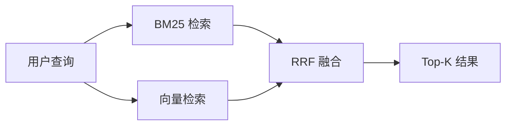

# Why RAG Needs Hybrid Retrieval：BM25 + 向量 + RRF 融合学习笔记

## 一、为什么纯词法或纯语义都不够

在技术文档、知识库或运维工单中，用户查询可分为两类：

- **精确查找**：粘贴错误码、API 路径、配置项、类名等。要求精确匹配，不能泛化。
- **概念性查找**：用自然语言描述症状，如“数据库连不上怎么办”。需要语义理解。

**精确标识符查找要的是精度，概念性故障排查要的是语义理解。** 单一的检索器很难同时兼顾两者。因此需要混合检索，让 BM25 处理精确匹配，向量检索处理语义理解。

## 二、BM25

BM25 是一个基于词频和文档长度的排序函数，属于词法匹配（lexical matching）引擎。它根据查询词在文档中出现的频率打分，同时惩罚过于常见的词和过长的文档。它是 TF-IDF 的演化：根据查询词项在文档中出现的频率打分，同时惩罚那些在整个 corpus 中过于常见的词。
> **TF-IDF（Term Frequency-Inverse Document Frequency，词频-逆文档频率）**是信息检索中用于评估一个词对文档集中某篇文档重要程度的经典统计方法。
> 
> **核心思想**：一个词在当前文档中出现次数越多（TF越高）越重要，但在整个文档集中出现越普遍（DF高，IDF低）越不重要。TF-IDF试图在“词频”和“稀有度”之间取得平衡，找出每篇文档的代表性词汇。
> 
> **公式**：
> - **TF(t,d)**：词t在文档d中出现的频率。常用原始词频（`count(t,d)`）或对数归一化。
> - **IDF(t,D)**：逆文档频率，表示词t的普遍重要程度。  
>     `IDF(t) = log( N / (1 + df(t)) )`，其中N为文档总数，df(t)为包含词t的文档数。
> - **TF-IDF(t,d) = TF(t,d) × IDF(t)**
> 
> **与BM25的关系**：BM25是TF-IDF的进化版，引入了**词频饱和**（`k1`参数）和**文档长度归一化**（`b`参数），解决了TF-IDF的两个局限：词频线性增长不合理、长文档容易因词频高而得分偏高。因此在实际搜索引擎和RAG系统中，BM25通常优于TF-IDF。

### 2.1 BM25 完整公式

$$
\text{BM25}(q,d) = \sum_{i=1}^{n} \text{IDF}(q_i) \cdot \frac{f(q_i,d) \cdot (k_1+1)}{f(q_i,d) + k_1 \cdot \left(1 - b + b \cdot \frac{|d|}{\text{avgdl}}\right)}
$$

其中：
- $q$：查询，$d$：文档
- $f(q_i,d)$：词 $q_i$ 在文档 $d$ 中的词频
- $|d|$：文档长度（词数），$\text{avgdl}$：语料库平均文档长度
- $k_1$：控制词频饱和（推荐 1.2–2.0）
- $b$：控制长度归一化强度（推荐 0.75）
- $\text{IDF}(q_i)$：逆文档频率，常见词权重低，稀有词权重高

BM25 的公式是典型的 IR 概率模型演进的产物。对它有个结构性的理解就够了——它不只是词频计数，而是考虑了**饱和度**和**文档长度**两个核心维度。

其中几个核心参数的作用：
- **k1**：**==控制词频饱和==**。文档提一次错误代码是相关的，提二十次更相关，但绝不是相关二十倍。**词频收益会饱和**，通过 k1 控制饱和度。
- **b**：**==控制长度归一化==**。长文档天然包含更多词，算法会相对惩罚它。一篇长文档和一篇包含相同关键词的短文档相比，短文档可能更相关。
- **avgdl**：语料库平均文档长度，与 b 配合计算长度归一化。当文档长度超过 avgdl 时，长度归一化因子 `1-b+b*|D|/avgdl` 会大于 1，从而降低 BM25 分数，实现对长文档的惩罚。

推荐 k1 在 1.2–2.0，b 取 0.75 左右，这是多年来工程实践验证的通用配置。如果语料长度差异极大（比如混杂了几行代码片段和整本手册），可能需要根据实测调高 b 值，强化长度惩罚。

### 2.2 BM25 的强项与短板

**强项**：精确匹配错误码、API 路径、环境变量、配置项、命令名。用户搜 `PAYMENTS_API_TIMEOUT` 时，要的是包含该字符串的文档。

**短板**：用户改述或概念性问题会失败。例如搜“how to fix database crash”，文档写“resolving postgres memory exhaustion”，词面不匹配导致分数很低。

## 三、向量检索

向量检索用稠密向量把查询和文档映射到同一语义空间，依赖 embedding 模型泛化同义表达。

**强项**：语义理解。用户问“How to safely roll back a deployment?”，能命中标题为“Reverting Deployments”的文档。

**短板**：精确标识符可能被语义漂移。搜具体类名可能返回通用文档，因为 embedding 模型把标识符泛化了。

## 四、Hybrid Search 的核心原理

### 4.1 Hybrid Search 高层模式

### 4.2 为什么要融合，而不是二选一

Hybrid search 并行执行 BM25 检索和向量检索，各自返回一个 top-K 候选列表，然后将两个列表的**排名**进行融合。

不能直接把 BM25 分数加到向量相似度上，因为两者尺度完全不同：BM25 分数无上界（可能 > 20），向量相似度在 -1 到 1 之间，直接相加 BM25 会压过向量信号。

### 4.3 RRF（倒数排名融合）的原理与公式

**RRF（Reciprocal Rank Fusion，倒数排名融合）** 完全忽略原始分数，只关注文档在每个列表中的排名位置。

**完整公式**：

$$
\text{RRF}(d) = \sum_{r \in \text{检索器集合}} \frac{1}{k + \text{rank}_r(d)}
$$

其中：
- $\text{rank}_r(d)$：文档 $d$ 在检索器 $r$ 结果列表中的排名（从 1 开始）
- $k$：平滑常数（通常取 60）

**RRF 为什么有用？**

- **无需归一化**：不同检索器的分数尺度不可比，排名位置是可比的。
- **无需人工调权重**：k=60 是经验最优值，不需要为 BM25 和向量分别设置权重。
- **共识优先**：同时出现在多个列表前列的文档，总分更高；仅出现在一个列表的文档，即使排名第一，总分也可能低于两个列表都出现的中等排名文档。这符合“多个证据更可靠”的直觉。
- **评估稳定性**：更换 embedding 模型导致向量分数分布变化时，RRF 只看排名，评估结果不受影响。

### 4.4 k 值为什么是 60

如果没有平滑常数，排名第 1 的文档得分为 1，排名第 2 得分为 0.5，差距过大。k=60 使排名 1 得 1/61≈0.0164，排名 2 得 1/62≈0.0161，差距缩小。这样单一检索器的极端高分不会压过其他信号。Cormack 等人 2009 年的论文验证了 60 在多数据集上的最优性。

### 4.5 RRF 计算示例

BM25 返回排名 [A, B, C]，向量检索返回 [B, A, C]，k=60：

- A：1/(60+1) + 1/(60+2) = 1/61 + 1/62 ≈ 0.0323
- B：1/(60+2) + 1/(60+1) = 1/62 + 1/61 ≈ 0.0325
- C：1/(60+3) + 1/(60+3) = 1/63 + 1/63 ≈ 0.0317

最终排名：B → A → C。B 在两个列表中排名都很靠前（第 2 和第 1），总分最高。

## 五、元数据过滤：向量+BM25 都管不了的事

即使词法和语义都完美，仍可能出错——版本错了、环境错了、服务错了。例如用户查找“MySQL 5.7 的连接超时配置”，但文档中有 5.6 和 5.7 两个版本，纯文本无法区分版本号含义。

**最佳实践**：在建立索引时，为每个 chunk 附加元数据（如 `version=5.7`、`service=payment`、`env=prod`）。检索时，先根据用户明确提到的条件（如“5.7 版本”）构造过滤器，将搜索范围限制在匹配的 chunks 内，再执行混合检索。Milvus、Qdrant 等向量数据库都支持在检索时传入过滤条件。

> 元数据过滤与混合检索是正交的优化，两者需要配合使用。

## 六、Chunking 在 Hybrid Search 里的角色

BM25 和向量检索都基于 chunks 进行。chunks 质量差，两者都会受牵连——hybrid search 无法挽救已被错误分块破坏的信息。

### Chunk Size 的不对称影响

| Chunk Size | 对 BM25 的影响 | 对向量检索的影响 |
| :--- | :--- | :--- |
| **过小（如 50 token）** | 失去词频优势，关键词只能出现一次，分数难提升 | 聚焦单一主题，精确度提高 |
| **过大（如 1000 token）** | 命中概率上升，但引入噪声 | 多概念平均到同一向量，语义区分度下降 |

合理基线：**256–512 token**，重叠 10-20%。若精确查询多，可稍偏小；若概念查询多，可稍偏大。

## 七、评估混合检索的方法

- **指标**：Hit Rate@K、MRR，对比三种模式：纯 BM25、纯向量、混合（RRF）。
- **按查询类型分别统计**：精确查询和概念查询分开看提升幅度。
- **用你的 NQ 或自定义业务测试集**，跑出量化结果。在技术方案介绍中给出具体数字（如“混合检索使 Hit Rate@3 从 0.65 提升到 0.82”）。

## 八、中文分词与 BM25 实现

### 8.1 为什么需要分词

BM25 基于词项匹配，英文单词天然有空格分隔，中文需要先切分词语。例如“数据库连接超时”应切分为“数据库/连接/超时”，才能与查询匹配。

### 8.2 常见中文分词器对比

| 分词器          | 类型            | 速度  | 准确率 | 特点                | 适用场景               |
| :----------- | :------------ | :-- | :-- | :---------------- | :----------------- |
| **jieba**    | 字典+HMM        | 快   | 中   | 开源最早，生态成熟，支持自定义词典 | 通用中文、个人项目、快速原型     |
| **pkuseg**   | 深度学习 (BiLSTM) | 中   | 高   | 北大多领域预训练模型，领域自适应  | 高精度要求、垂直领域（如医疗、金融） |
| **LAC (百度)** | BiLSTM+CRF    | 中   | 高   | 词性标注+分词，轻量        | 需要词性信息的场景          |
| **THULAC**   | 结构化感知机        | 快   | 高   | 清华工具包，兼顾速度和精度     | 大规模文本处理            |
| **HanLP**    | 多种模型          | 慢   | 最高  | 功能全面，支持自定义词典、多语言  | 企业级、研究用途           |

### 8.3 选型建议

- **个人项目 / 快速验证**：使用 **jieba**，简单够用，配合自定义词典可提升领域术语识别。
- **高精度要求**：使用 **pkuseg** 或 **HanLP**，但会增加计算开销。
- 在 RAG 系统中，BM25 检索对分词准确度要求并不极端，jieba 的默认配置已满足多数场景。如果发现某些专业术语（如“慢查询”、“死锁”）被切碎，可加入自定义词典。