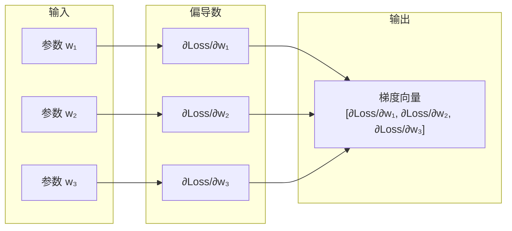
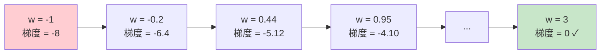
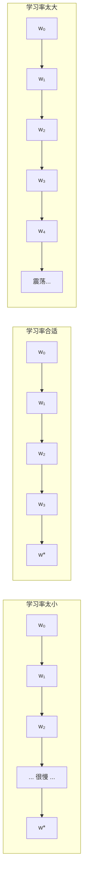
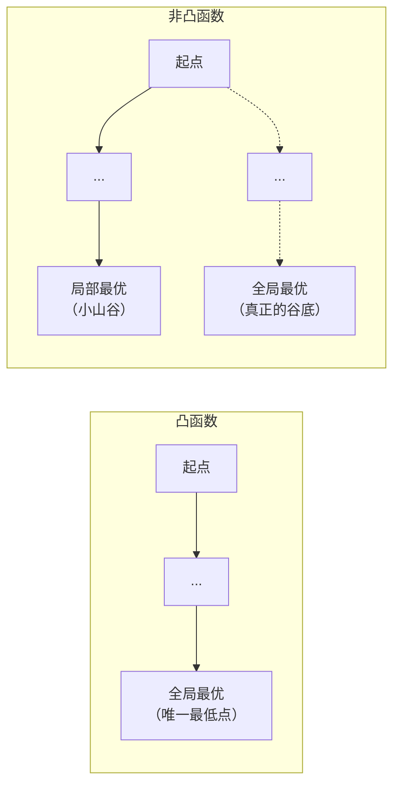
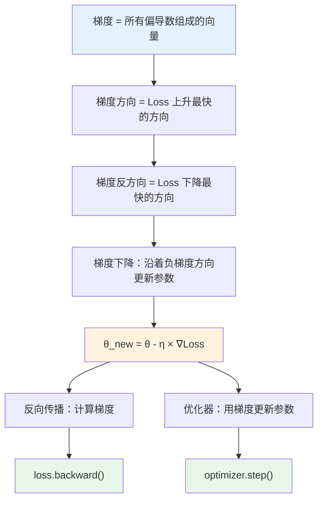

## 1 什么是梯度？

### 1.1 从导数说起：一元函数的变化率

导数描述的是**函数在某个点的变化率**——自变量变化一点点，函数值变化多少。

```text
一元函数 y = f(x)：
导数 f'(x) = dy/dx

含义：在 x 这个位置，x 增加 1 个单位，y 大约变化 f'(x) 个单位
```

**直观理解**：在爬山时，导数告诉你“当前这个位置的坡度有多陡”。导数为正，路在上坡；导数为负，路在下坡；导数为零，是平地（可能是山顶或山谷）。

### 1.2 多个参数时：偏导数登场

在深度学习中，损失函数 `Loss` 不是只依赖于一个参数 `w`，而是依赖于**成千上万个参数** `w₁, w₂, ..., wₙ`。

```text
Loss = f(w₁, w₂, w₃, ..., wₙ)
```

这时候，“导数”这个概念就不够用了——因为有多个自变量，你不知道“变化率”是针对哪一个变量的。

**偏导数**就是用来解决这个问题的：**锁定其他所有变量不动，只看某一个变量变化时，函数值变化多少**。

```text
偏导数 ∂f/∂w₁ 的含义：
保持 w₂, w₃, ..., wₙ 不变，只把 w₁ 增加一点点，f 变化多少
```

> **术语解释**：偏导数（Partial Derivative）是针对**多元函数**（有多个自变量的函数）的导数。它的核心操作是“锁定其他变量，只看一个”。在“反向传播”中，`loss.backward()` 计算的就是 Loss 对每个参数的偏导数。

### 1.3 梯度的定义：把所有偏导数打包成一个向量

**梯度（Gradient）**就是把所有参数的偏导数**打包成一个向量**。

```text
假设模型有 3 个参数：w₁, w₂, w₃

梯度 = [∂f/∂w₁, ∂f/∂w₂, ∂f/∂w₃]
        ↑          ↑          ↑
      w₁的偏导数  w₂的偏导数  w₃的偏导数
```



### 1.4 梯度的两个关键性质

| 性质                   | 含义                  | 对深度学习的意义                |
| -------------------- | ------------------- | ----------------------- |
| **梯度的方向是函数上升最快的方向**  | 沿着梯度方向走，Loss 增加得最快  | 要让 Loss 变小，所以要**反着走** |
| **梯度的反方向是函数下降最快的方向** | 沿着负梯度方向走，Loss 减少得最快 | **梯度下降**就是沿着负梯度方向更新参数   |


## 2 为什么需要梯度下降？

### 2.1 一个具体的例子

假设有一个最简单的模型，只有一个参数 `w`，损失函数是：

```text
Loss(w) = (w - 3)² + 1
```

这个函数的最小值在 `w=3` 处（因为平方项最小为0）。

但假如这个函数非常复杂，有百万个参数，根本无法直接“看出来”最小值在哪——这时就需要**梯度下降**：从一个随机的 `w` 出发，一步步“走”向最小值。

### 2.2 为什么不用“穷举”或“直接解方程”？

| 方法        | 为什么行不通                                                    |
| --------- | --------------------------------------------------------- |
| **穷举**    | 如果有 100 万个参数，每个参数取 1000 个可能值，总组合数是 1000^1000000——比宇宙原子数还多 |
| **直接解方程** | 令所有偏导数为 0，解百万个方程组成的方程组——数学上几乎不可能                          |
**梯度下降是唯一可行的方法**：它不追求一步到位，而是通过**无数次小步迭代**，逐步逼近最优解。

## 3 梯度下降的核心公式

### 3.1 参数更新公式

这是深度学习中**最重要的公式**，没有之一：

```text
θ_new = θ_old - η × ∇Loss(θ_old)
```

| 符号 | 含义 | 在代码中的对应 |
|------|------|---------------|
| `θ` | 模型的所有参数（权重和偏置） | `model.parameters()` |
| `∇Loss(θ)` | 损失函数在 `θ` 处的梯度 | `loss.backward()` 计算的结果 |
| `η`（学习率） | 每次更新的步长 | `optimizer` 中的 `lr` 参数 |

### 3.2 用具体数字走一遍（一元函数）

继续用 `Loss(w) = (w - 3)² + 1` 的例子。

**初始状态**：
```text
w = -1（随机初始值）
学习率 η = 0.1
```

**第1步**：计算梯度（导数）
```text
∇Loss = d/dw [(w-3)² + 1] = 2(w-3)
在 w=-1 处：∇Loss = 2(-1-3) = -8
```

**第2步**：更新参数
```text
w_new = w - η × ∇Loss
     = -1 - 0.1 × (-8)
     = -1 + 0.8
     = -0.2
```

**第3步**：重复上述过程

| 迭代次数 | 当前 w | 梯度值 | 更新后的 w |
|---------|--------|--------|-----------|
| 0 | -1.0 | -8.0 | -0.2 |
| 1 | -0.2 | -6.4 | 0.44 |
| 2 | 0.44 | -5.12 | 0.952 |
| 3 | 0.952 | -4.096 | 1.362 |
| 4 | 1.362 | -3.277 | 1.689 |
| ... | ... | ... | ... |
| 最终 | 3.0 | 0 | 3.0（停止） |

**观察**：`w` 从 -1 一步步“走”到了 3，梯度从 -8 逐渐趋近于 0。



**关键理解**：
- 梯度为负数时，`w - η×负数 = w + 正数` → `w` 增大（向右走）
- 梯度为正数时，`w - η×正数 = w - 正数` → `w` 减小（向左走）
- 梯度趋近于 0 时，`w` 几乎不再变化 → 到达了最小值点


## 4 学习率：步长该迈多大？

### 4.1 学习率的作用

**学习率（Learning Rate, η）**决定了每一步迈多大。

```text
η 大 → 每一步跨得远 → 收敛快，但可能跳过最优点
η 小 → 每一步跨得近 → 收敛慢，但更稳定
```

### 4.2 学习率不合适的后果

| 学习率 | 后果 | 表现 |
|--------|------|------|
| **太大** | 在最小值附近来回震荡，永远无法收敛 | Loss 忽大忽小，不下降 |
| **太小** | 收敛极慢，训练需要数周 | Loss 缓慢下降，训练时间过长 |
| **合适** | 稳定收敛到最小值 | Loss 平稳下降，最终趋于平稳 |



### 4.3 在代码中

在 `train.py` 中可以看到学习率的设置：

```python
# train.py
self.optimizer = torch.optim.Adam(self.model.parameters(), lr=self.config_dict['learning_rate'])
```

`learning_rate` 这个参数，就是公式里的 `η`。


## 5 梯度下降的三种变体

在实际训练中，每次更新参数时用多少数据来计算梯度，决定了梯度下降的三种形式。

### 5.1 批量梯度下降（BGD）

**每次更新使用全部训练数据**。

```text
for 每个 epoch:
    梯度 = 计算所有样本的 Loss 的梯度
    参数 = 参数 - 学习率 × 梯度
```

| 优点 | 缺点 |
|------|------|
| 梯度方向准确，收敛稳定 | 数据量大时极慢 |
| 能得到全局最优解 | 内存消耗大 |

### 5.2 随机梯度下降（SGD）

**每次更新只使用 1 个样本**。

```text
for 每个样本:
    梯度 = 计算当前样本的 Loss 的梯度
    参数 = 参数 - 学习率 × 梯度
```

| 优点 | 缺点 |
|------|------|
| 更新速度快，适合大数据 | 梯度方向有噪声，不稳定 |
| 可能跳出局部最优 | 不容易并行化 |

### 5.3 小批量梯度下降（MBGD）—— 最常用

**每次更新使用一小批（mini-batch）样本**（如 32、64、128 个）。

```text
for 每个 mini-batch:
    梯度 = 计算当前 batch 的 Loss 的梯度
    参数 = 参数 - 学习率 × 梯度
```

| 优点 | 缺点 |
|------|------|
| 兼顾速度和稳定性 | 需要调整 batch size |
| 易于并行化（GPU 友好） | — |

### 5.4 在代码中

mini-batch 的训练方式：

```python
# train.py - 每次取一个 batch 的数据
for idx, sample in enumerate(self.data_loader):
    # sample 就是一个 mini-batch 的数据
    loss, loss_dict = self.loss_fn.cal_iir_model_loss(sample)
    self.optimizer.zero_grad()
    loss.backward()  # 计算当前 batch 的梯度
    self.optimizer.step()  # 用当前 batch 的梯度更新参数
```

`batch_size` 参数（如 32）决定了每个 mini-batch 包含多少个样本。

## 6 梯度下降的挑战

### 6.1 局部最优 vs 全局最优

梯度下降只能保证找到**局部最优**（local minimum），不保证找到**全局最优**（global minimum）。

```text
如果损失函数是“凸函数”（碗状），局部最优 = 全局最优。
如果损失函数是“非凸函数”（起伏的山地），可能卡在某个山谷里。
```



### 6.2 鞍点

在高维空间中，比局部最优更常见的问题是**鞍点（Saddle Point）**——某个方向上是上坡，另一个方向上是下坡。

```text
鞍点就像一个马鞍：前后是下坡，左右是上坡。
梯度在鞍点处为 0，但既不是最大值也不是最小值。
```

### 6.3 为什么实际中这些问题没那么严重？

在深度学习中，参数数量巨大（百万级），**几乎不可能所有方向都是上坡**——总有一个方向可以继续下降。所以实际训练中，卡在局部最优或鞍点的情况比理论上少得多。

> **术语解释**：在超高维空间中，“局部最优”出现的概率极低。因为要让一个点是局部最优，需要所有方向都是上坡——这在百万维空间中几乎不可能。实际中更常见的是“鞍点”——某个方向还能继续下降。


## 7 梯度下降与反向传播的关系

这里做一个明确的区分：

```text
┌─────────────────────────────────────────────────────────────────────────────┐
│                    梯度下降 vs 反向传播                                     │
├─────────────────────────────────────────────────────────────────────────────┤
│                                                                             │
│   反向传播（Backpropagation）     vs     梯度下降（Gradient Descent）       │
│   ─────────────────────────              ─────────────────────              │
│                                                                             │
│   “怎么算梯度”                           “怎么用梯度来更新参数”             │
│                                                                             │
│   工具：链式法则                          工具：θ_new = θ - η×∇Loss        │
│                                                                             │
│   在代码中：loss.backward()              在代码中：optimizer.step()         │
│                                                                             │
│   先执行 → 计算出每个参数的梯度          后执行 → 用梯度更新每个参数        │
│                                                                             │
└─────────────────────────────────────────────────────────────────────────────┘
```

> **一句话分清**：反向传播是**计算梯度的方法**，梯度下降是**使用梯度更新参数的策略**。

在训练循环中，这两步是紧挨着的：

```python
loss.backward()      # ← 反向传播：计算梯度
optimizer.step()     # ← 梯度下降：用梯度更新参数
```


## 8 本章小结



**一句话总结**：

> 梯度是把所有参数的偏导数打包成的向量，指向 Loss 上升最快的方向。梯度下降就是沿着梯度的反方向（Loss 下降最快的方向）一步步更新参数，用公式 `θ_new = θ - η×∇Loss` 反复迭代，直到 Loss 降到最低。反向传播负责算梯度，优化器负责执行梯度下降——两者配合，驱动模型从“瞎猜”走向“学会”。