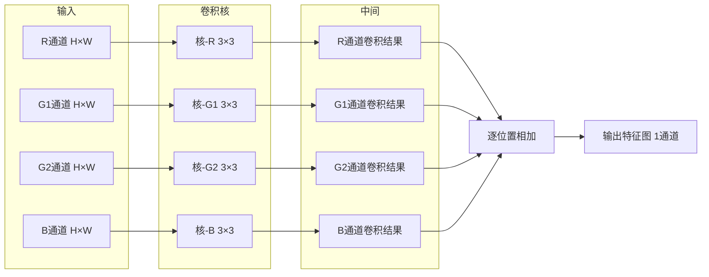
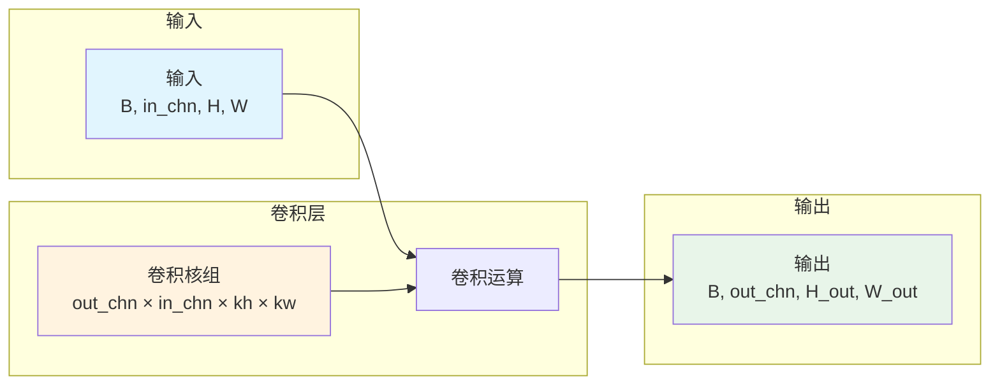
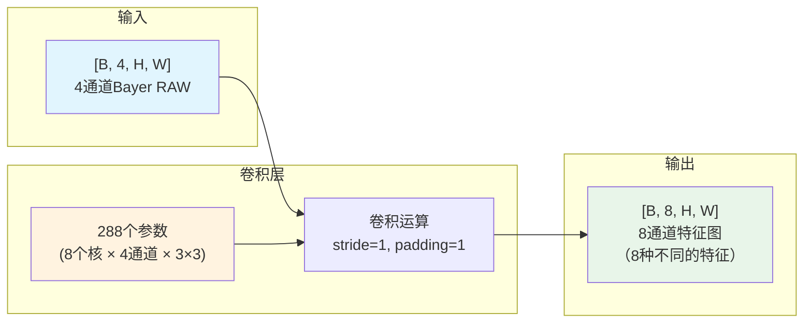
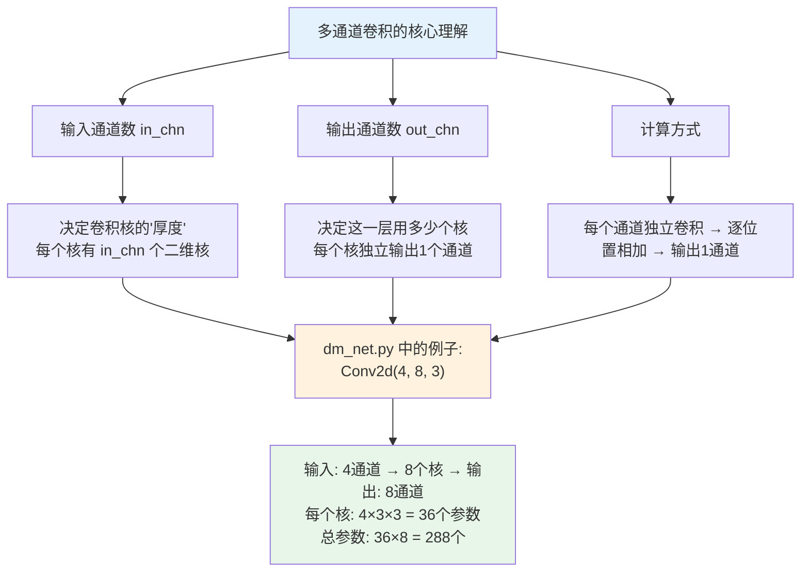

# 多通道卷积
## 1 为什么需要多通道？—— 从灰度图到Bayer RAW

### 1.1 灰度图：1个通道就够了

一张灰度图（黑白照片），每个像素只有一个数值——**亮度**（0=黑，255=白）。

```text
灰度图（1个通道）：
┌────────────────────────┐
│  亮度值  亮度值  亮度值 │
│  亮度值  亮度值  亮度值 │  → 每个像素只有1个数字
│  亮度值  亮度值  亮度值 │
└────────────────────────┘
```

对于灰度图，一个单通道卷积核（如3×3）就够用了：窗口在图像上滑动，每次对9个数做加权和。

### 1.2 彩色图：3个通道（R/G/B）

一张彩色图，每个像素由**三个数值**组成：红色（R）、绿色（G）、蓝色（B）。三个通道叠加在一起，才形成彩色。

```text
彩色图（3个通道）：
┌──────────────┐    ┌─────────────┐    ┌─────────────┐
│  R通道       │    │  G通道       │    │  B通道       │
│  R值  R值    │    │  G值  G值    │    │  B值  B值    │
│  R值  R值    │    │  G值  G值    │    │  B值  B值    │
└──────────────┘    └─────────────┘    └─────────────┘
	                       ↓
	                ┌─────────────┐
	                │  合成彩色图  │  → 每个像素由 (R, G, B) 三个数字决定
	                └─────────────┘
```

**多通道的意义**：用多个维度来描述同一个像素的信息，每个通道描述一个不同的属性。

### 1.3 Bayer RAW：为什么是4个通道？

 **Bayer RAW** 图像，来自相机Sensor的直接输出。

相机Sensor的每个像素上覆盖了一个颜色滤镜（Bayer滤镜），所以每个像素**只记录一种颜色**（R、G、B中的一种）。典型的排列是 **RGGB**（1个R、2个G、1个B）。

```text
Bayer阵列（物理排列）：
┌──────────────────────────┐
│  R  G  R  G  R  G  R  G  │
│  G  B  G  B  G  B  G  B  │  → 每个格子代表一个物理像素
│  R  G  R  G  R  G  R  G  │     每个像素只有1种颜色
│  G  B  G  B  G  B  G  B  │
└──────────────────────────┘
```

**问题**：如果直接用1通道输入，卷积核看到的是马赛克一样的原始数据——相邻像素记录的是不同颜色，CNN很难直接从这种"杂色"数据中学习去噪。

**解决方案**：在预处理时，把Bayer马赛克**拆成4个通道**。即把所有R像素抽出来拼成一幅图、把所有G1像素抽出来拼成一幅图、把G2和B也分别抽出来。

```text
预处理后的4个通道（RGGB）：
┌─────────┐  ┌─────────┐  ┌─────────┐  ┌─────────┐
│ R通道    │  │ G1通道   │  │ G2通道   │  │ B通道    │
│ R R R   │  │ G G G   │  │ G G G   │  │ B B B   │
│ R R R   │  │ G G G   │  │ G G G   │  │ B B B   │
└─────────┘  └─────────┘  └─────────┘  └─────────┘
    ↓             ↓            ↓            ↓
   ┌───────────────────────────────────────────────┐
   │         合成4通道输入 [B, 4, H, W]              │
   │         每个像素有4个数值（对应RGGB四个通道）     │
   └───────────────────────────────────────────────┘
```

**为什么拆成4个通道而不是直接1通道？**

| 做法 | 输入形状 | 问题 |
|------|---------|------|
| 直接送1通道马赛克 | `[B, 1, H, W]` | 相邻像素物理含义不同（R和G混在一起），CNN难以学习 |
| 拆成4通道 | `[B, 4, H, W]` | 每个通道的像素物理含义相同（全R、全G、全B），CNN更容易学 |

> **一句话理解**：拆成4通道，是把"马赛克"变成"4层叠加的整齐阵列"，让卷积核能够分别处理每种颜色通道，再在深层融合它们的信息。

## 2 多通道卷积的计算方式

### 2.1 核心概念：卷积核是三维的

在单通道卷积中，卷积核是 **二维的**（如3×3）。

在多通道卷积中，卷积核是 **三维的**：

```text
单通道卷积核（二维）：
┌─────────┐
│ a  b  c │
│ d  e  f │  → 形状: [kernel_h, kernel_w] = [3, 3]
│ g  h  i │
└─────────┘

多通道卷积核（三维）：
┌─────────────┐
│ 通道1的核    │
│ ┌─────────┐ │
│ │ a1 b1 c1 │ │
│ │ d1 e1 f1 │ │  → 每个输入通道都有一个独立的二维核
│ │ g1 h1 i1 │ │
│ └─────────┘ │
│ 通道2的核    │  → 形状: [in_chn, kernel_h, kernel_w]
│ ┌─────────┐ │      = [4, 3, 3]（4个通道，每个3×3）
│ │ a2 b2 c2 │ │
│ │ d2 e2 f2 │ │
│ │ g2 h2 i2 │ │
│ └─────────┘ │
│ ...（共4个通道）│
└─────────────┘
```

**关键理解**：一个多通道卷积核的"厚度"等于输入通道数 `in_chn`。

### 2.2 计算过程：每个通道分别算，然后跨通道相加

以输入4通道（RGGB）为例，用一个3×3卷积核做卷积：



**分步解释**：

```text
步骤1：每个通道独立做卷积
   R通道   ×  R核  →  卷积结果R（每个位置一个数）
   G1通道  ×  G1核 →  卷积结果G1
   G2通道  ×  G2核 →  卷积结果G2
   B通道   ×  B核  →  卷积结果B

步骤2：四个结果逐位置相加
   输出（某个位置）= 卷积结果R(该位置) + 卷积结果G1(该位置) + 卷积结果G2(该位置) + 卷积结果B(该位置)
```

**用具体数字演示**：

假设输入某个位置（左上角）的值是：
```text
R通道局部3×3：  G1通道局部3×3：  G2通道局部3×3：  B通道局部3×3：
┌─────┐        ┌─────────┐        ┌────────┐        ┌────────┐
│1 2 3│        │5   6   7│        │9  10 11│        │13 14 15│
│4 5 6│        │8   9  10│        │12 13 14│        │16 17 18│
│7 8 9│        │11  12 13│        │15 16 17│        │19 20 21│
└─────┘        └─────────┘        └────────┘        └────────┘
```

卷积核（4个通道各一个3×3）：
```text
R核：           G1核：          G2核：          B核：
┌─────┐        ┌─────┐        ┌─────┐        ┌─────┐
│a b c│        │e f g│        │i j k│        │m n o│
│d e f│        │h i j│        │l m n│        │p q r│
│g h i│        │k l m│        │o p q│        │s t u│
└─────┘        └─────┘        └─────┘        └─────┘
```

计算过程：
```text
结果R = 1a + 2b + 3c + 4d + 5e + 6f + 7g + 8h + 9i
结果G1 = 5e + 6f + 7g + 8h + 9i + 10j + 11k + 12l + 13m
结果G2 = 9i + 10j + 11k + 12l + 13m + 14n + 15o + 16p + 17q
结果B = 13m + 14n + 15o + 16p + 17q + 18r + 19s + 20t + 21u

输出值 = 结果R + 结果G1 + 结果G2 + 结果B（逐位置相加）
```

### 2.3 核心概念：一个卷积核输出一个通道

**一个多通道卷积核 → 输出 1 个通道的特征图。**

**输出通道数由"卷积核的个数"决定，而不是由输入通道数决定。**

## 3 输入通道与输出通道

### 3.1 两个容易混淆的概念

| 概念        | 符号            | 含义                 | 在 `nn.Conv2d` 中 |
| --------- | ------------- | ------------------ | --------------- |
| **输入通道数** | `in_chn`      | 输入数据的通道数           | 第1个参数           |
| **输出通道数** | `out_chn`     | 输出数据的通道数（使用的卷积核个数） | 第2个参数           |
| **卷积核大小** | `kernel_size` | 每个通道上的窗口大小（如3×3）   | 第3个参数           |

### 3.2 一个关键区别

```text
输入通道数 (in_chn) → 决定了"一个卷积核有多厚"
输出通道数 (out_chn) → 决定了"这一层用了多少个卷积核"
```

### 3.3 形状变化的完整图景



**解释**：
- 这一层有 `out_chn` 个卷积核
- 每个卷积核的形状是 `[in_chn, kh, kw]`（厚度=输入通道数）
- 每个卷积核独立运算，输出 1 个通道
- 所有 `out_chn` 个卷积核的输出堆叠在一起，形成 `[B, out_chn, H_out, W_out]`

### 3.4 一个具体的形状对照：`Conv2d(4, 8, 3)`

以代码中的第一层 `Conv2d(4, 8, 3)` 为例，我们来完整走一遍数据形状的变化。

```text
输入形状: [B, 4, H, W]     ← 4个通道（RGGB）

这一层有 8 个卷积核
每个卷积核的形状: [4, 3, 3]  ← 厚度=4（匹配输入通道数），窗口=3×3

每个卷积核输出 1 个通道
8 个卷积核 → 输出 8 个通道

输出形状: [B, 8, H, W]     ← 8个通道
```

**输出通道数 = 这一层用了多少个卷积核。** 这是核心规则。

#### 为什么输出是8个通道？—— 8个核各自独立工作

这一层有 **8个卷积核**。每个核的工作方式完全相同，但内部数字（权重）不同：

```text
输入（4通道）               8个卷积核                  输出（8通道）

                        ┌─────────────┐
                        │ 核1 [4,3,3] │  →  通道1
                        ├─────────────┤
                        │ 核2 [4,3,3] │  →  通道2
                        ├─────────────┤
┌─────────────┐         │ 核3 [4,3,3] │  →  通道3
│  R通道      │  ───→   ├─────────────┤              ───→  ┌──────────────────────┐
│  G1通道     │         │ 核4 [4,3,3] │  →  通道4          │    8通道特征图堆叠    │
│  G2通道     │         ├─────────────┤                    │  (每张图代表一种特征) │
│  B通道      │         │ 核5 [4,3,3] │  →  通道5          └──────────────────────┘
└─────────────┘         ├─────────────┤
                        │ 核6 [4,3,3] │  →  通道6
                        ├─────────────┤
                        │ 核7 [4,3,3] │  →  通道7
                        ├─────────────┤
                        │ 核8 [4,3,3] │  →  通道8
                        └─────────────┘
```

**每个核独立输出1个通道。8个核 → 8个通道堆叠在一起。**

#### 每个核内部：RGGB四个通道都要算（重点！）

**一个核不是只算某一个通道，而是同时处理所有4个输入通道。**

输入有4个通道（RGGB）。这个核也变成4层，每层对应一个通道：

```text
┌──────────────────────────────────────────────────────────────────────────────┐
│  一个卷积核由 4 个 3×3 的层堆叠而成（厚度=4，匹配输入通道数）                   │
│                                                                              │
│  第1层（对应R通道）  第2层（对应G1通道）  第3层（对应G2通道）  第4层（对应B通道）│
│  ┌─────────────┐   ┌─────────────┐   ┌─────────────┐   ┌─────────────┐       │
│  │  a1 b1 c1   │   │  a2 b2 c2   │   │  a3 b3 c3   │   │  a4 b4 c4   │       │
│  │  d1 e1 f1   │   │  d2 e2 f2   │   │  d3 e3 f3   │   │  d4 e4 f4   │       │
│  │  g1 h1 i1   │   │  g2 h2 i2   │   │  g3 h3 i3   │   │  g4 h4 i4   │       │
│  └─────────────┘   └─────────────┘   └─────────────┘   └─────────────┘       │
│        ↓                  ↓                  ↓                  ↓            │
│   与R通道卷积       与G1通道卷积       与G2通道卷积       与B通道卷积           │
│        ↓                  ↓                  ↓                  ↓            │
│   得到数字A          得到数字B          得到数字C          得到数字D           │
└──────────────────────────────────────────────────────────────────────────────┘
                                ↓
                    A + B + C + D = 输出值（1个像素）
```

**核的计算过程（每一步）**：

```text
1. 核的第1层 × R通道的3×3区域 → 得到一个数字 A
2. 核的第2层 × G1通道的3×3区域 → 得到一个数字 B
3. 核的第3层 × G2通道的3×3区域 → 得到一个数字 C
4. 核的第4层 × B通道的3×3区域 → 得到一个数字 D
5. A + B + C + D = 该位置的输出值
```

**每个核在每个位置都是这样算：4个通道分别卷，最后相加成一个数。**

#### 用公式表示

对于某一个卷积核，在某个位置 `(x, y)` 的输出为：

```text
输出(x, y) = 
    sum(R通道3×3区域 × 核第1层) 
  + sum(G1通道3×3区域 × 核第2层) 
  + sum(G2通道3×3区域 × 核第3层) 
  + sum(B通道3×3区域 × 核第4层)
```

其中 `sum(3×3区域 × 核层)` 表示逐元素相乘再求和（即单通道卷积的标准操作）。

#### 参数个数计算

```text
一个卷积核的参数：
  厚度 × 核高 × 核宽 = 4 × 3 × 3 = 36

这一层总参数（不含偏置）：
  一个核的参数 × 核的个数 = 36 × 8 = 288

如果算上偏置（每个输出通道1个）：
  288 + 8 = 296
```

#### 一个容易混淆的点

| 概念 | 值 | 含义 |
|------|-----|------|
| 输入通道数 `in_chn` | 4 | 决定**每个核有多厚**（几层3×3堆叠） |
| 输出通道数 `out_chn` | 8 | 决定**这一层用几个核**（每个核独立输出1个通道） |
| 卷积核数量 | 8 | 等于输出通道数 |

**每个核的厚度 = 输入通道数（4）。每个核的个数 = 输出通道数（8）。**

## 4 输出通道数的设计含义

### 4.1 输出通道数 = 特征提取器的数量

在 CNN 中，**每个输出通道对应一个"特征提取器"**。

| 输出通道 | 它学到的可能是 |
|---------|---------------|
| 通道1 | 水平边缘检测器 |
| 通道2 | 垂直边缘检测器 |
| 通道3 | 45°边缘检测器 |
| 通道4 | 纹理检测器（平滑区域） |
| 通道5 | 纹理检测器（粗糙区域） |
| 通道6 | 亮度变化检测器 |
| 通道7 | 颜色变化检测器 |
| 通道8 | 噪声检测器 |

**输出通道数越多，模型能提取的特征类型越丰富。**

### 4.2 为什么输出通道数通常比输入通道数多？

```text
输入通道少（如4通道Bayer）→ 原始信息比较"薄"
输出通道多（如8通道）    → 特征被"扩宽"，模型有更多维度去描述图像
```

这就是 **"扩宽特征"** 的设计思路：
- 浅层：输入通道少，信息有限
- 经过卷积层：提取出更多类型的特征 → 通道数增多
- 深层：特征被进一步组合 → 通道数可能继续增多或逐渐压缩

### 4.3 为什么是 8、16、32 这样的数字？

| 数字 | 来源 | 原因 |
|------|------|------|
| 4→8→16→32 | **2的幂次** | GPU对2的幂次运算效率更高（内存对齐、并行计算优化） |
| 8 | 轻量级模型的"便宜选择" | 4通道扩一倍=8，在模型大小和表达能力之间取了平衡 |
| 16、32 | 更大的模型 | 算力充足时，用更多通道提取更丰富的特征 |

> **没有"标准答案"**：这些数字是工程师通过实验调出来的。4→8→8→4 是一个轻量级设计，跑得快，效果够用。如果把中间的8改成32，模型会更大、更慢，但去噪效果可能会更好。

## 5 代码对应：`nn.Conv2d(4, 8, 3)` 到底在算什么

### 5.1 完整的参数解读

```python
nn.Conv2d(in_chn=4, out_chn=8, kernel_size=3, stride=1, padding=1)
```

| 参数 | 值 | 含义 |
|------|-----|------|
| `in_chn` | 4 | 输入是4通道（Bayer的RGGB） |
| `out_chn` | 8 | 这一层有8个卷积核，输出8通道 |
| `kernel_size` | 3 | 每个卷积核在单通道上是3×3 |
| `stride` | 1 | 每次滑动1个像素 |
| `padding` | 1 | 边缘补一圈0，保持H×W不变 |

### 5.2 这一层的参数个数

```text
一个卷积核的参数个数：
  = 输入通道数 × 核高度 × 核宽度
  = 4 × 3 × 3
  = 36

这一层总参数个数（不含偏置）：
  = 一个核的参数 × 输出通道数
  = 36 × 8
  = 288

如果算上偏置：
  = 288 + 8（每个输出通道一个偏置）
  = 296
```

**对比全连接层**：如果把 4×H×W 像素拉平，全连接层需要 `4×H×W × 8` 个参数，即使 H=128，也有 4×128×128×8 = 524,288 个参数，是卷积的 **1800 多倍**。

### 5.3 形状变化全景



### 5.4 数据流完整路径

```text
输入: [B, 4, H, W]
      ↓
Conv2d(4→8, 3×3, stride=1, padding=1)
      ↓
输出: [B, 8, H, W]  ← 每个位置有8个数值，代表8种不同的特征

下一层如果继续:
Conv2d(8→8, 3×3, stride=1, padding=1)
      ↓
输出: [B, 8, H, W]  ← 特征被进一步组合

再下一层:
Conv2d(8→4, 3×3, stride=1, padding=1)
      ↓
输出: [B, 4, H, W]  ← 压缩回4通道（去噪后的Bayer输出）
```

**关键理解**：
- 第一层：用 **8个不同的卷积核** 分别扫描4通道输入，产生8种不同的特征图
- 每个卷积核内部有 **4个3×3的二维核**（每个输入通道一个），分别处理各自的通道
- 每个卷积核的4个通道结果**相加** → 输出1个通道
- 8个卷积核 → 输出8个通道

## 6 本章小结



**一句话记住本章**：

> 多通道卷积 = 每个输入通道配一个二维核，各通道独立卷积后逐位置相加，一个卷积核产生一个输出通道。输出通道数 = 这一层用了多少个卷积核。