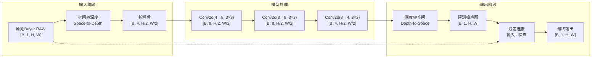
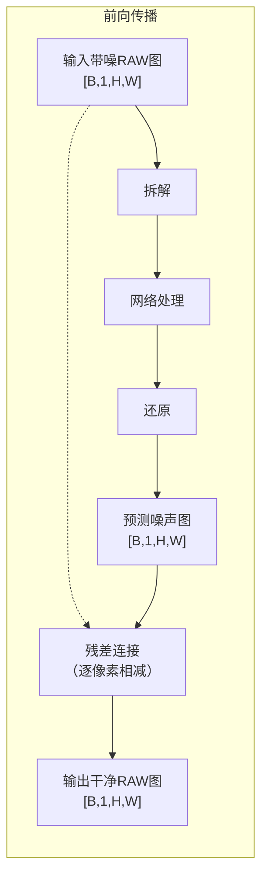
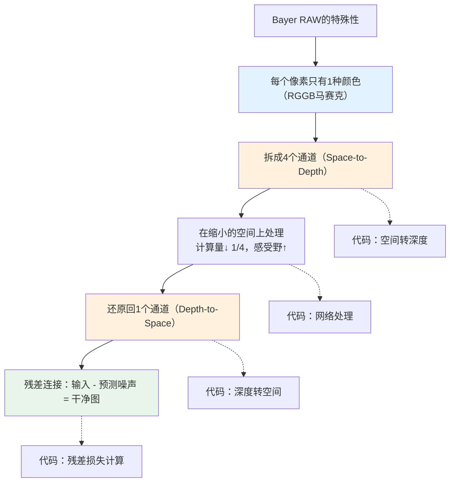

# 卷积在Bayer RAW图像上的特殊处理

## 1 为什么RAW图像要拆成4个通道？

### 1.1 先看灰度图和彩色图

```text
灰度图（1个通道）：
每个像素只有1个数字 → 亮度

彩色图（3个通道）：
每个像素有3个数字 → R（红）、G（绿）、B（蓝）
```

这两种图的共同点是：**每个像素都包含了所有颜色信息**（灰度图虽然只有亮度，但它本身就是完整的信息载体）。

### 1.2 Bayer RAW：每个像素只有一种颜色

相机Sensor的物理限制决定了它无法在一个像素位置同时记录R、G、B三种颜色。因此，在Sensor表面覆盖了一层**Bayer滤镜**，每个像素只记录一种颜色。

```text
Bayer阵列（物理排列）：
┌──────────────────────────┐
│  R   G1  R   G1  R   G1  │
│  G2  B   G2  B   G2  B   │
│  R   G1  R   G1  R   G1  │
│  G2  B   G2  B   G2  B   │
└──────────────────────────┘
```

**问题**：手上只有1个通道的马赛克数据，而去噪网络需要处理的是完整图像。该如何处理？

### 1.3 一个直观的类比：拼图

假设有一张4×4的彩色照片，但每个格子只允许看到一种颜色（R/G/B）。然后想用神经网络去识别照片里的内容。

**方案A：直接把马赛克喂给网络**

卷积核看到一个3×3窗口时，里面既有R、又有G、又有B——它们不是同一类事物。网络会困惑：“这9个数字的差异，是因为物体边缘，还是因为颜色滤镜不同？”

这类似于在教一个小孩认识“狗”，但每次只给他看一张被撕碎的彩色照片，每个碎片只有一种颜色。小孩很难从这种碎片中学会“狗”长什么样。

**方案B：先把同色碎片拼成完整图，再喂给网络**

将所有的R像素抽出拼成一幅完整的R图，所有的G像素抽出拼成一幅完整的G图……然后让网络同时看这4幅图，告诉它：“这4幅图拼在一起，才是一张完整的照片。”

这就是**拆成4个通道**的本质。

### 1.4 拆成4个通道的好处

| 做法 | 输入形状 | 问题 |
|------|---------|------|
| 直接送1通道马赛克 | `[B, 1, H, W]` | 相邻像素物理含义不同（R和G混在一起），CNN难以学习 |
| 拆成4通道 | `[B, 4, H/2, W/2]` | 每个通道内部像素物理含义相同（全R、全G、全B），CNN更容易学习 |

> **核心理解**：拆成4通道后，卷积核在R通道上看到的数据差异，全部来自**图像本身的亮度变化**（边缘、纹理），而不是Bayer滤镜的颜色排列。这让CNN能更高效地学习去噪。

## 2 Space-to-Depth：从1通道到4通道的拆解

### 2.1 拆解的具体操作

**术语解释**：Space-to-Depth（空间转深度）是把图像的空间信息（高度、宽度）转移到通道维度（深度）的操作。其效果是：**把1张大图拆成4张半大图，叠在一起**。

用一张 4x4 的原始Bayer图来演示：

```text
原始马赛克图像 (1通道, 4×4)：
┌─────────────────┐
│  R   G1  R   G1 │
│  G2  B   G2  B  │
│  R   G1  R   G1 │
│  G2  B   G2  B  │
└─────────────────┘
```

按颜色拆解后：

```text
RGGB 4个通道 (每个 2×2)：
┌─────────┐  ┌─────────┐  ┌─────────┐  ┌─────────┐
│ R通道   │  │ G1通道  │  │ G2通道  │  │ B通道   │
│ R  R    │  │ G1 G1   │  │ G2 G2   │  │ B  B    │
│ R  R    │  │ G1 G1   │  │ G2 G2   │  │ B  B    │
└─────────┘  └─────────┘  └─────────┘  └─────────┘
```

### 2.2 尺寸变化：为什么会缩小？

每个通道只取了原图中 1/4 的像素（因为Bayer阵列中每种颜色只占1/4）。所以：

```text
原始:   H × W × 1（1个通道，高H，宽W）
拆解后: H/2 × W/2 × 4（4个通道，每个高H/2，宽W/2）
```

**总像素数守恒**：
```text
原始总像素 = H × W
拆解后总像素 = 4 × (H/2 × W/2) = 4 × (H×W/4) = H × W
```

尺寸没有消失，只是从“空间”转移到了“通道”。

## 3 拆解后的数据流：形状变化全景

### 3.1 完整的数据流路径



### 3.2 各层形状变化跟踪

用一张实际图像的大小来走一遍（假设原始RAW是 `H=256, W=256`）：

| 阶段 | 操作 | 形状 |
|------|------|------|
| 原始输入 | 读取RAW文件 | `[B, 1, 256, 256]` |
| 拆解 | 空间转深度 | `[B, 4, 128, 128]` ← **尺寸缩小一半！** |
| 卷积层1 | `Conv2d(4→8, 3, padding=1)` | `[B, 8, 128, 128]` |
| 卷积层2 | `Conv2d(8→8, 3, padding=1)` | `[B, 8, 128, 128]` |
| 卷积层3 | `Conv2d(8→4, 3, padding=1)` | `[B, 4, 128, 128]` |
| 还原 | 深度转空间 | `[B, 1, 256, 256]` |
| 残差连接 | `输入 - 预测噪声` | `[B, 1, 256, 256]` |

### 3.3 为什么要在缩小的空间上处理？

```text
原始尺寸处理：计算量 ∝ H × W = 256 × 256 = 65,536
缩小后处理：  计算量 ∝ (H/2) × (W/2) = 128 × 128 = 16,384
             = 原始计算量的 1/4
```

这就是 **Space-to-Depth 的核心价值**：在不丢失信息的前提下，把计算量降到原来的 **1/4**，同时让卷积核的相对感受野变大（3×3 在 128×128 图上看到的范围，相当于在 256×256 图上看到的更大比例区域）。

## 4 Depth-to-Space：从4通道还原回1通道

### 4.1 为什么需要还原？

网络处理完数据后，输出的是4通道的预测噪声图（尺寸 `H/2 × W/2`）。但需要输出的是1张完整尺寸的RAW图（`H × W`）。因此必须把4个小图**拼回**1张大图。

### 4.2 还原的具体操作

**术语解释**：Depth-to-Space（深度转空间）是 Space-to-Depth 的逆操作，把通道维度的信息还原到空间维度。简单说：**把4张半大图交错放回原位置，拼成1张大图**。

```text
4个通道（每个 2×2）：         还原后的 4×4 马赛克：
┌─────────┐  ┌─────────┐     ┌──────────────────────────────┐
│ R通道   │  │ G1通道  │     │  R   G1  R   G1 │
│ R  R    │  │ G1 G1   │     │  G2  B   G2  B  │  ← 按RGGB棋盘格交错放回
│ R  R    │  │ G1 G1   │  →  │  R   G1  R   G1 │
└─────────┘  └─────────┘     │  G2  B   G2  B  │
┌─────────┐  ┌─────────┐     └──────────────────────────────┘
│ G2通道  │  │ B通道   │
│ G2 G2   │  │ B  B    │
│ G2 G2   │  │ B  B    │
└─────────┘  └─────────┘
```

### 4.3 残差连接：为什么是“输入 - 预测噪声”？

去噪网络的最终目的不是输出“干净图”，而是输出“预测的噪声图”。这是深度学习中常用的**残差学习**策略。

```python
# 在代码中的体现（概念层面）
# 输入带噪声图 → 网络预测噪声 → 干净图 = 输入 - 预测噪声
final_output = input - predicted_noise
```

**残差连接的位置**：



**为什么这样设计？**

| 设计选择          | 原因                                       |
| ------------- | ---------------------------------------- |
| 预测噪声而非直接预测干净图 | 输入图和输出图高度相似（只差一点噪声），让网络学习“差异”比学习“完整图”更容易 |
| 残差连接（输入 - 噪声） | 网络只需专注于“哪些像素是噪声”，而不是“这张图长什么样”            |

### 4.4 常见代码中的体现

`train.py` 中的 `iir_train_ops.py` 里，Loss计算部分体现了这个逻辑：

```python
# iir_train_ops.py（概念简化）
def cal_iir_model_loss(self, sample):
    net_out, _ = self.model_fn(...)  # 网络输出预测噪声
    # net_out 形状: [B, 4, H/2, W/2]
    
    # 还原噪声图到原始尺寸
    net_out_full = depth_to_space(net_out)  # [B, 1, H, W]
    
    # 残差连接：输入 - 预测噪声 = 干净图
    clean_pred = sample['input'] - net_out_full
    
    # 计算 Loss（clean_pred 与 sample['target'] 对比）
    loss = compute_loss(clean_pred, sample['target'])
    return loss
```

## 5 本章小结



**一句话总结**：

> Bayer RAW 的 1 通道马赛克通过 Space-to-Depth 拆成 4 通道 `[B,4,H/2,W/2]` 以降低计算量，经过网络处理后，再通过 Depth-to-Space 还原为 1 通道 `[B,1,H,W]`，最终通过残差连接（输入 - 预测噪声）得到干净图。整个过程的关键是**把通道当作“信息容器”**，在空间和深度之间灵活转换。