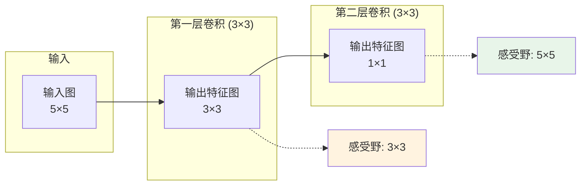
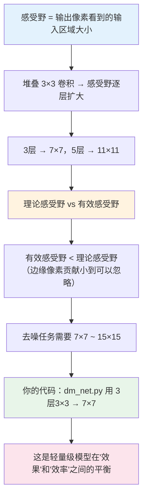

# 感受野

## 1 什么是感受野？

### 1.1 从生活直觉出发

想象你戴着一副**很窄的眼镜**，只能看到眼前的一小块区域。

- 如果你只看一个点，你无法判断它属于"眼睛"还是"背景"
- 如果你能看到更大的范围（比如周围几个像素），你就能判断它是不是边缘
- 如果你能看到更大的范围（比如周围几十个像素），你就能判断它是"眼睛的一部分"还是"桌子的边缘"

**在卷积网络中，"感受野"就是这副眼镜的视野范围**：输出图上的一个像素，对应输入图上的多大区域。

### 1.2 感受野的定义

**感受野（Receptive Field）**：特征图上的一个像素，在原始输入图像上所能"看到"的区域大小。

```text
┌─────────────────────────────────────────────────────────────────────────────┐
│                         感受野的直观理解                                     │
├─────────────────────────────────────────────────────────────────────────────┤
│                                                                             │
│   输入图（5×5）           第一层特征图（3×3）       第二层特征图（1×1）        │
│                                                                             │
│   ┌─────────────────┐    ┌───────────────┐         ┌─────────┐              │
│   │  a  b  c  d  e  │    │               │         │    ●    │ ← 这个像素   │
│   │  f  g  h  i  j  │    │   3×3特征图   │         └─────────┘              │
│   │  k  l  m  n  o  │    │               │            ↑                    │
│   │  p  q  r  s  t  │    └───────────────┘            │                    │
│   │  u  v  w  x  y  │         ↑                       │                    │
│   └─────────────────┘         │                       │                    │
│         ↑                     │                       │                    │
│         │              第一层感受野=3×3          第二层感受野=5×5            │
│    原始输入           （一个3×3卷积核）      （两层3×3卷积堆叠）              │
│                                                                             │
└─────────────────────────────────────────────────────────────────────────────┘
```

**图解读**：
- 第一层特征图中的每个像素，是由输入图上 3×3 区域计算得到的 → 感受野是 3×3
- 第二层特征图中的 1 个像素，是由第一层特征图 3×3 区域计算的，而第一层那 3×3 区域在输入图上对应 5×5 区域 → 感受野是 5×5

### 1.3 用数字走一遍：单层卷积的感受野

**场景**：输入图 5×5，用 3×3 卷积核做卷积（步长=1，无填充）。

```text
输入（5×5）        卷积核（3×3）       输出（3×3）
┌──────────┐        ┌──────┐            ┌────────────┐
│ a b c d e│        │ 1 2 3│            │ y11 y12 y13│
│ f g h i j│        │ 4 5 6│    →       │ y21 y22 y23│
│ k l m n o│        │ 7 8 9│            │ y31 y32 y33│
│ p q r s t│        └──────┘            └────────────┘
│ u v w x y│
└──────────┘
```

输出图左上角 `y11` 的计算使用了输入图的 `(a, b, c, f, g, h, k, l, m)` —— 一个 3×3 区域。

```text
第一层特征图的感受野 = 3 × 3
```

**关键理解**：输出图上的每个像素，都对应输入图上 3×3 的局部区域。

### 1.4 堆叠两层：感受野变大

用同样的 3×3 卷积核堆叠两层。

```text
输入（5×5）    →    第一层特征图（3×3）    →    第二层特征图（1×1）
     ↑                    ↑                        ↑
  3×3窗口            3×3窗口                 第二层的一个像素
  覆盖9个输入像素     覆盖第一层的9个像素      对应输入图的5×5区域
```

第二层输出图的 1 个像素，对应第一层特征图的 3×3 区域（9个像素）。而第一层特征图的每个像素，对应输入图的 3×3 区域。所以：

```text
第二层感受野 = 3 + (3 - 1) = 5 → 5 × 5
```

**逐层堆叠，感受野不断变大。**



## 2 感受野是怎么变大的？

### 2.1 计算公式

对于卷积层堆叠，感受野的计算公式：

```text
RF_new = RF_prev + (kernel_size - 1) × stride
```

其中 `RF_prev` 是前一层的感受野，`kernel_size` 是当前层的卷积核大小，`stride` 是步长。

### 2.2 用数字走一遍

假设每一层都用 3×3 卷积核，步长=1：

| 层数  | 当前感受野  | 计算公式          | 结果        |
| --- | ------ | ------------- | --------- |
| 第1层 | 初始 1×1 | 1 + (3-1) × 1 | **3×3**   |
| 第2层 | 3×3    | 3 + (3-1) × 1 | **5×5**   |
| 第3层 | 5×5    | 5 + (3-1) × 1 | **7×7**   |
| 第4层 | 7×7    | 7 + (3-1) × 1 | **9×9**   |
| 第5层 | 9×9    | 9 + (3-1) × 1 | **11×11** |

**规律**：每多一层 3×3 卷积，感受野扩大 2。

| 层数 | 感受野 |
|------|--------|
| 1层 3×3 | 3×3 |
| 2层 3×3 | 5×5 |
| 3层 3×3 | **7×7** |
| 4层 3×3 | 9×9 |
| 5层 3×3 | 11×11 |

### 2.3 堆叠小卷积核 vs 单层大卷积核

**核心对比**：3层 3×3 卷积，感受野 = 7×7。

| 方案 | 层数 | 感受野 | 参数量（输入输出通道数=C） |
|------|------|--------|--------------------------|
| 堆叠 3 层 3×3 | 3层 | 7×7 | 3 × (3×3×C×C) = **27 C²** |
| 单层 7×7 | 1层 | 7×7 | 1 × (7×7×C×C) = **49 C²** |

**堆叠 3 层 3×3 的参数量只有单层 7×7 的 55%**（27/49），但感受野相同！

**为什么更小的卷积核更高效？**

3×3 卷积核只比 5×5 或 7×7 多一层计算，但参数量大幅减少，同时**多了一层非线性激活函数**，表达能力更强。**这是现代 CNN 普遍采用 3×3 小卷积核堆叠的原因：用更少的参数获得更大的感受野和更强的非线性表达能力。**

## 3 理论感受野 vs 有效感受野

### 3.1 这个区分为什么重要？

很多人初学时，会以为"网络最深层的感受野有多大，模型就能用那么大范围的信息"。

**实际上不是这样的。**

### 3.2 理论感受野

通过层数和卷积核大小计算出来的感受野大小，代表"信息可能覆盖的最大范围"。

例如：7 层 3×3 卷积堆叠，理论感受野 = 15×15。

### 3.3 有效感受野

在实际训练中，模型对感受野**中心区域的像素依赖程度远高于边缘区域**。中心像素对输出的贡献大，越靠近边缘的像素贡献越小，且小到可以忽略不计。

```text
有效感受野（实际有效的范围）：          理论感受野（可能覆盖的最大范围）：
┌─────────────────────┐               ┌─────────────────────┐
│  ░░░░░░░░░░░░░░░░░  │               │  █████████████████  │
│  ░░░░░░░░░░░░░░░░░  │               │  █████████████████  │
│  ░░░░░░███████░░░░  │               │  █████████████████  │
│  ░░░░░░███████░░░░  │               │  █████████████████  │
│  ░░░░░░███████░░░░  │               │  █████████████████  │
│  ░░░░░░░░░░░░░░░░░  │               │  █████████████████  │
│  ░░░░░░░░░░░░░░░░░  │               │  █████████████████  │
└─────────────────────┘               └─────────────────────┘
    中心的亮区是真正起作用的区域         整个区域理论上有影响，但边缘实际贡献极小
```

> **术语解释**：有效感受野是训练后模型实际上更关注的中心区域。你可以理解为：**理论感受野是地图范围，有效感受野是视线聚焦的热点区域。**

**论文结论**（来自《Understanding the Effective Receptive Field in Deep Convolutional Neural Networks》等研究）：
- 有效感受野通常只有理论感受野的 **1/3 到 1/2**
- 增加层数可以扩大理论感受野，但有效感受野的增长**远慢于**理论感受野的增长
- 通过训练技巧（如调整权重初始化、学习率）可以稍微扩大有效感受野，但效果有限

### 3.4 对去噪任务的影响

去噪任务中，我们需要判断一个像素是"噪声"还是"真实纹理"。

| 感受野大小 | 对去噪的影响 |
|-----------|-------------|
| 太小（如 3×3） | 只能看到局部亮度，无法区分"噪声"和"细小纹理" |
| 适中（7×7 ~ 15×15） | 能看到足够大的区域来估计噪声的统计特性，同时不会混入远处无关信息 |
| 太大（100×100 以上） | 看到远处不相关的纹理，可能导致"过平滑"（把真实细节也抹掉了） |

**去噪任务为什么需要"适中"的感受野？**

- 噪声是局部的、随机的，判断一个像素是不是噪声，看周围 7×7 ~ 15×15 的区域已经足够
- 更大的感受野会让网络看到远处的物体边缘，反而会"误以为"那是需要保留的纹理
- **有效感受野比理论感受野更贴近实际**，所以代码中设计感受野时通常会稍微往大一点设计

## 4 感受野对去噪的工程意义

### 4.1 去噪任务需要多大感受野？

在深度学习去噪领域，经验结论是：

| 感受野大小 | 效果 |
|-----------|------|
| 5×5 以下 | 不足以估计噪声统计特性，容易把噪声当成纹理保留 |
| 7×7 ~ 15×15 | **效果最佳**，能有效区分噪声和纹理 |
| 25×25 以上 | 容易把真实纹理也抹掉（过平滑），同时计算量大 |

**7×7 ~ 15×15 是工业界去噪模型的常见感受野范围。**

### 4.2 一般代码中感受野多大？

`dm_net.py` 有 3 层 3×3 卷积堆叠（加上残差连接，但残差不改变感受野）：

```python
# models/dm_net.py
self.dm_net = nn.Sequential(
    nn.Conv2d(4, 8, kernel_size=3, stride=1, padding=1),   # 第1层：感受野 3×3
    nn.Conv2d(8, 8, kernel_size=3, stride=1, padding=1),   # 第2层：感受野 5×5
    nn.Conv2d(8, 4, kernel_size=3, stride=1, padding=1),   # 第3层：感受野 7×7
)
```

```text
dm_net.py 的感受野：
3层 3×3 卷积堆叠 → 7×7

这个数值在"经验有效范围"（7×7 ~ 15×15）的边缘，属于轻量级设计的合理选择：
- 感受野足够大（7×7），能有效区分噪声和纹理
- 参数量足够小（适合NPU部署）
- 如果换成 4 层 3×3（感受野 9×9），参数增加 33%，效果提升有限
```

### 4.3 为什么选择 7×7 而不是更大？

这是一个**工程权衡**（trade-off）：

```text
          感受野越大 → 去噪效果越好（能看懂更大的上下文）
              ↓
          网络层数越多 → 参数越多 → 计算越慢 → 功耗越大
              ↓
          在NPU上，功耗和延迟是硬约束
              ↓
      必须选一个"性价比最高"的感受野
```

| 感受野 | 层数（3×3堆叠） | 参数量（以dm_net为基准） | 去噪效果 |
|--------|---------------|------------------------|---------|
| 7×7 | 3层 | **基准** | ✅ 够用 |
| 9×9 | 4层 | +33% | ⚠️ 略有提升 |
| 11×11 | 5层 | +67% | ⚠️ 提升有限 |
| 13×13 | 6层 | +100% | ❌ 过平滑风险增加 |

**在轻量级去噪模型中，7×7 是一个"性价比最高"的选择：用最少的层数达到足够大的感受野。**

> **术语解释**：过平滑（over-smoothing）是去噪中的一个常见问题——当感受野过大时，模型不仅去掉了噪声，还把图像的真实纹理和边缘细节也模糊掉了，导致输出图像看起来"糊"。

## 5 本章小结



**一句话总结：**

> 感受野是输出像素在输入图像上看到的区域大小。堆叠 3×3 卷积让感受野逐层扩大（3层→7×7），去噪任务需要 7×7 ~ 15×15 的感受野来有效区分噪声和纹理。你的 `dm_net.py` 用 3 层 3×3 堆叠达到 7×7 感受野，这是轻量级模型在效果和效率之间的合理平衡。有效感受野通常比理论感受野小，所以实际设计中往往会略微往大里设计。