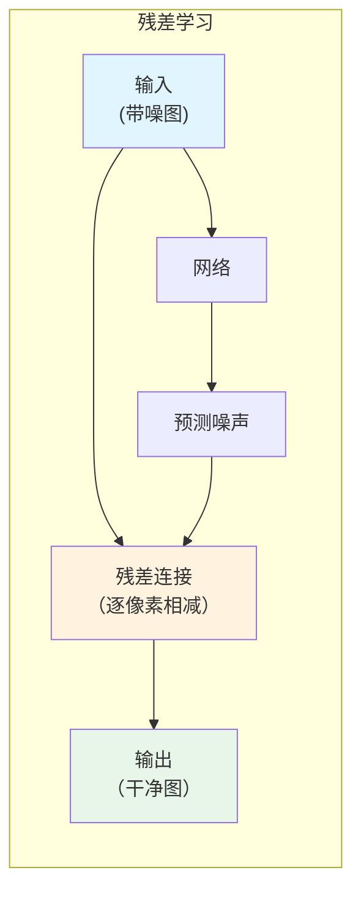
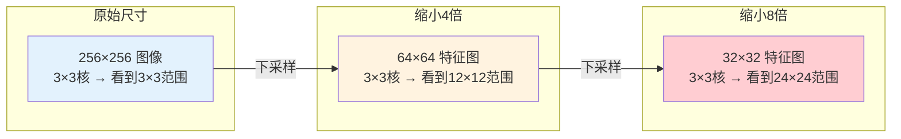
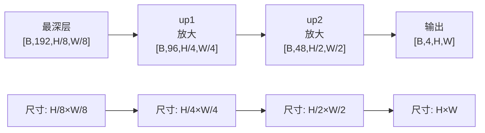
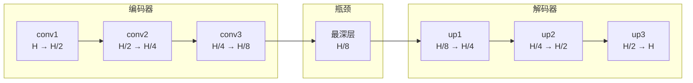
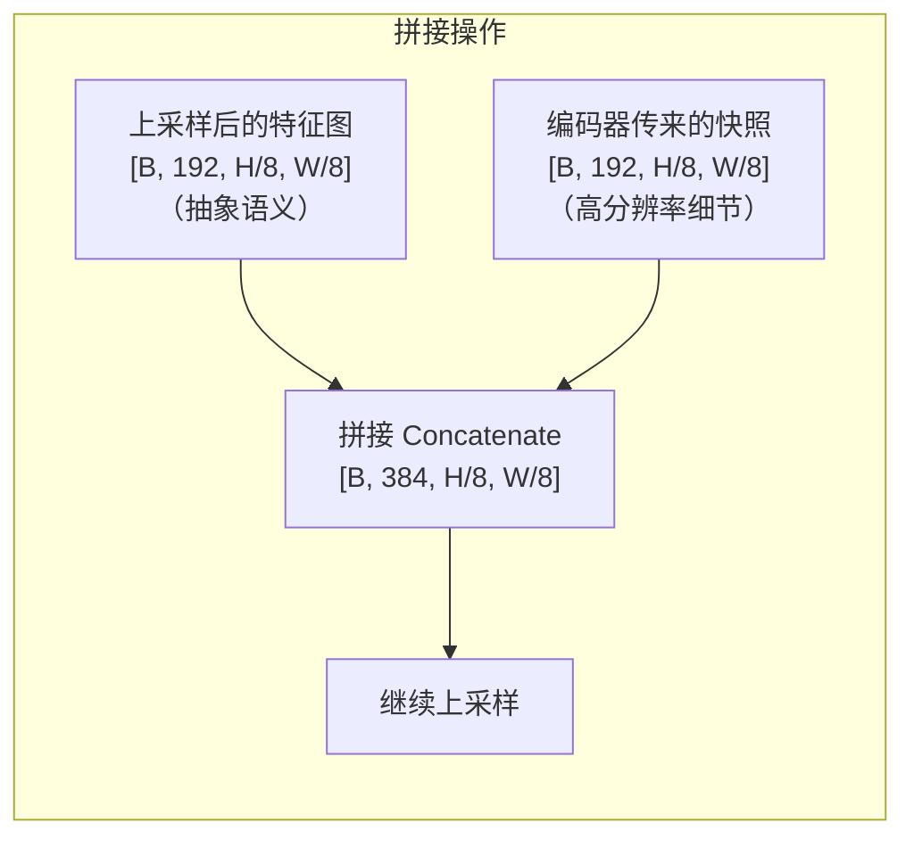
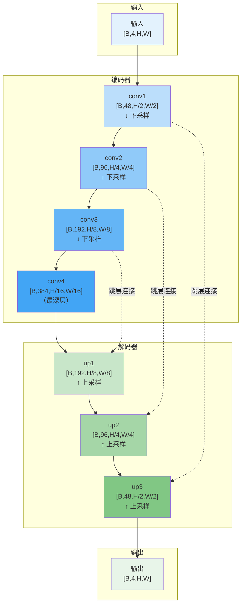
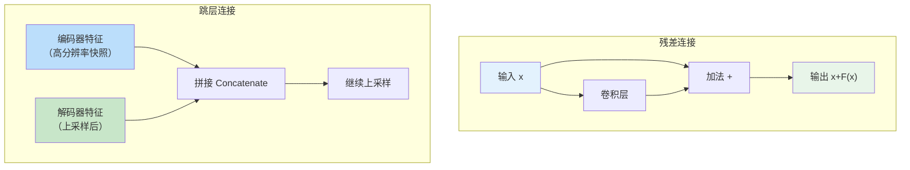

# 从卷积层到完整的去噪网络

## 1 最简单的去噪网络：DMNET

### 1.1 它长什么样？

`dm_net` 是最简单的去噪网络。它只有 3 层卷积，没有其他复杂结构。

```text
┌─────────────────────────────────────────────────────────────────┐
│                    DMNET：一个极简去噪网络                       │
├─────────────────────────────────────────────────────────────────┤
│                                                                  │
│  输入: [B, 4, H/2, W/2]    ← 已经过 Space-to-Depth 拆解         │
│      ↓                                                          │
│  ┌──────────────────────────────────────┐                       │
│  │ Conv2d(4 → 8, 3×3, padding=1)       │  ← 第1层：4→8 通道   │
│  │ + ReLU                              │                       │
│  └──────────────────────────────────────┘                       │
│      ↓                                                          │
│  ┌──────────────────────────────────────┐                       │
│  │ Conv2d(8 → 8, 3×3, padding=1)       │  ← 第2层：8→8 通道   │
│  │ + ReLU                              │                       │
│  └──────────────────────────────────────┘                       │
│      ↓                                                          │
│  ┌──────────────────────────────────────┐                       │
│  │ Conv2d(8 → 4, 3×3, padding=1)       │  ← 第3层：8→4 通道   │
│  └──────────────────────────────────────┘                       │
│      ↓                                                          │
│  输出: [B, 4, H/2, W/2]    ← 预测噪声图                        │
│                                                                  │
└─────────────────────────────────────────────────────────────────┘
```

### 1.2 它够用吗？

| 优点            | 缺点                    |
| ------------- | --------------------- |
| 极轻量（~300个参数）  | 表达能力有限，只能学习简单噪声模式     |
| 推理速度快，适合NPU部署 | 感受野只有 7×7，难以区分复杂纹理和噪声 |
| 结构清晰，适合入门理解   | 没有残差连接，梯度在深层可能消失      |

**DMNET 的作用**：它是一个"基线模型"（baseline），用来验证数据 pipeline 和训练流程是否正确。若需获得更好的去噪效果，需在其基础上增加更复杂的结构。下面要讲的残差连接、跳层连接和 UNet 结构，就是在 DMNET 基础上逐步"升级"的路径。

## 2 残差连接：让网络能"加深"

### 2.1 为什么需要残差连接？

当卷积层从 3 层增加到 10 层、20 层时，会出现一个反直觉的现象：**训练集上的准确率反而下降了**。

这不是过拟合（过拟合是训练集好、验证集差），而是**网络退化**（degradation）：网络太深，梯度在反向传播时逐层衰减，浅层参数几乎得不到更新。

```text
# 一个直观的比喻
# 你让一个人同时做 100 道题，然后告诉他总分不及格。让他分析"哪道题错了？"
# 如果题目太深、链条太长，他只能知道"大概后面错了"，但根本想不起第一道题写了什么。
# 这就是梯度消失——浅层的参数收不到有效的更新信号。
```

### 2.2 残差连接的本质

**定义**：在网络的输入和输出之间加一条"短路"，让输出 = 输入 + 中间计算结果。

```text
传统网络（没有残差）：
输入 x → [卷积层] → [激活] → [卷积层] → [激活] → 输出 H(x)
目标：让 H(x) 逼近 y_true

残差网络（有残差）：
输入 x → [卷积层] → [激活] → [卷积层] → [激活] → 中间 F(x)
                                               ↓
输出 = x + F(x)   ← 这就是残差连接
目标：让 F(x) 逼近 y_true - x（即"残差"）
```

### 2.3 去噪任务中的残差连接

在去噪任务中，**残差学习**有了更具体的形式：

```text
输入：带噪声图 x = 干净图 + 噪声
网络输出：预测噪声 F(x)
最终输出：x - F(x) = 干净图

目标：让 F(x) 逼近真实噪声
```

> **术语解释**：残差（residual）就是"输入和输出之间的差异"。在去噪任务中，输入（带噪图）和输出（干净图）的差异就是噪声。网络只需学习"这个差异是什么"，而不是从零学习"干净图长什么样"。



**为什么这样设计更简单？**
- 直接学习"完整图像" → 网络需要记住每个像素的精确值
- 学习"噪声" → 噪声是随机的、局部的，网络只需判断"这个像素是不是噪点"

### 2.4 代码中的残差连接

在 `iir_train_ops.py` 中，Loss 计算部分体现了残差学习：

```python
# iir_train_ops.py（概念简化）
def cal_iir_model_loss(self, sample):
    # 1. 网络前向：输入带噪图 → 输出预测噪声
    net_out = self.model_fn(sample['input'])

    # 2. 残差连接：干净图 = 带噪图 - 预测噪声
    clean_pred = sample['input'] - net_out

    # 3. 计算 Loss：对比干净图和真实目标
    loss = compute_loss(clean_pred, sample['target'])
    return loss
```

## 3 编码器与解码器：先压缩，再还原

在进入跳层连接和 UNet 之前，需要先理解两个最基础的结构组件——**编码器**和**解码器**。

### 3.1 什么是编码器？
**编码器（Encoder）**是网络中负责 **"压缩信息"** 的部分：逐步缩小特征图的尺寸（下采样），同时增加通道数来提取更丰富的特征。

==**编码器，本质上就是"会缩小图片尺寸的卷积层"。**==

为了"看得更远"（扩大感受野），一个直接的办法是：**把图片缩小，这样 3×3 的卷积核就能覆盖更大的相对范围**
```text
┌─────────────────────────────────────────────────────────────────────────────┐
│                    下采样（缩小图片）的本质                                  │
├─────────────────────────────────────────────────────────────────────────────┤
│                                                                             │
│   原始图片 256×256                        缩小到 128×128                     │
│   ┌───────────────────────────┐          ┌───────────────┐                  │
│   │                           │          │               │                  │
│   │  一个 3×3 的卷积核，      │  ──→      │  同样 3×3 的   │                  │
│   │  在 256×256 上只能看到    │           │  卷积核，在    │                  │
│   │  很小的一小块区域         │           │  128×128 上    │                  │
│   │                           │          │  看到相对更大  │                  │
│   │                           │          │  的范围        │                  │
│   └───────────────────────────┘          └───────────────┘                  │
│                                                                             │
│   这就是编码器的核心价值：通过缩小尺寸来扩大感受野                             │
│                                                                             │
└─────────────────────────────────────────────────────────────────────────────┘
```

```
编码器的工作：把大图变小，提取抽象特征
  输入大图            第1次缩小           第2次缩小           第3次缩小
  [B,4,H,W]     →    [B,48,H/2,W/2]  →  [B,96,H/4,W/4]  →  [B,192,H/8,W/8]
    ↑                    ↑                   ↑                   ↑
  原始尺寸           尺寸减半            尺寸再减半          尺寸再减半
                    感受野扩大          感受野继续扩大      感受野更大
```

### 3.2 为什么需要编码器？（下采样的价值）

你可能会问：**"为什么不直接在原始尺寸上做卷积，而要先把图像缩小？"**

三个核心原因：

| 原因         | 解释                                                                                        |
| ---------- | ----------------------------------------------------------------------------------------- |
| **扩大感受野**  | 在 256×256 图上，3×3 卷积只能看到 3×3 范围。在 32×32 图上，3×3 卷积看到的范围相当于原始尺寸的 24×24。**图像缩小了，卷积核的相对视野变大了** |
| **降低计算量**  | 特征图每缩小一半，计算量降到原来的 1/4。让网络在"小尺寸"上做繁重计算，是轻量化的关键                                             |
| **提取抽象特征** | 浅层看到的是"边缘""颜色斑点"，深层看到的是"形状""物体部件"。**压缩的过程就是抽象的过程**                                        |



### 3.3 什么是解码器？

**解码器，就是"把缩小的图片再放大回原始尺寸"的层。**

编码器把 `H×W` 变成了 `H/8×W/8`，但最终需要输出和输入一样大的图像（去噪任务要求尺寸一致）。所以必须有一个对称的结构，把尺寸一步步放大回去。

**怎么放大？** 用 **上采样（Upsampling）**，通常通过 **转置卷积（Transposed Convolution）** 或 **插值（Interpolation）** 实现。

```
解码器的工作：把小图放大，恢复细节

  最深层            第1次放大           第2次放大           第3次放大
  [B,192,H/8,W/8] → [B,96,H/4,W/4]  → [B,48,H/2,W/2]  → [B,4,H,W]
    ↑                    ↑                   ↑                ↑
  最小尺寸           尺寸翻倍            尺寸再翻倍        恢复原始尺寸
  抽象语义           开始恢复细节        更多细节         完整输出
```

### 3.4 没有解码器会怎样？

如果只有编码器（只压缩不还原），输出会变得非常小。

```text
输入 256×256 → 编码器压缩 → 输出 16×16

问题：我们需要输出和输入同样大小的图像（去噪任务要求尺寸一致），
      但 16×16 的特征图无法直接变成 256×256 的输出。
```

所以，**编码器必须搭配解码器**——先压缩信息（编码器），再还原尺寸（解码器），才能输出与输入同尺寸的图像。

**那 `up` 这个名字从哪来的？**

代码里用 `up` 来命名解码器的每一层，就是 **`upsample`（上采样）的缩写**。它表示这一层要把尺寸"翻倍放大"。

```python
# 解码器的典型写法
self.up1 = UpBlock(192, 96)   # H/8 → H/4（放大1倍）
self.up2 = UpBlock(96, 48)    # H/4 → H/2（放大1倍）
self.up3 = UpBlock(48, 4)     # H/2 → H（放大1倍）
```



## 4 跳层连接：把"快照"传给解码器

现在到了最关键的问题：**为什么需要跳层连接？**

### 4.1 编码器丢失了"细节"

编码器在缩小图片时，虽然扩大了感受野，但也**丢失了边缘、纹理等空间细节**。

```text
原始图片中的一条清晰边缘：             经过3次缩小后的16×16特征图：
┌───────────────────────┐            ┌───────────────────────┐
│                       │            │                       │
│   ◤                   │            │    █████████████████  │
│   ◤  一条清晰的线     │    ──→      │    █████████████████  │
│   ◤                   │            │    █████████████████  │
│                       │            │                       │
└───────────────────────┘            └───────────────────────┘
    细节清晰可见                         细节丢失，只剩模糊轮廓
```

### 4.2 跳层连接做了什么？

**跳层连接**：把编码器**尚未缩小之前**的"高分辨率快照"，直接传给解码器对应层。

```text
┌─────────────────────────────────────────────────────────────────────────────┐
│                    跳层连接：传递"高分辨率快照"                            │
├─────────────────────────────────────────────────────────────────────────────┤
│                                                                             │
│    编码器（向下，尺寸逐减）             解码器（向上，尺寸逐增）            │
│                                                                             │
│    [B,4,H,W]                                                               │
│        ↓                                                                   │
│    conv1 → [B,48,H/2]  ──────────── 跳层连接 ──────────┐                  │
│        ↓                                               │                  │
│    conv2 → [B,96,H/4]  ──────────── 跳层连接 ──────┐   │                  │
│        ↓                                           │   │                  │
│    conv3 → [B,192,H/8] ──────────── 跳层连接 ────┐ │   │                  │
│        ↓                                        │ │   │                  │
│    最深层 [B,384,H/16] ─── 传递给解码器 ───→     │ │   │                  │
│                                                 │ │   │                  │
│                                                 │ │   │                  │
│    解码器：                                     │ │   │                  │
│                                                 │ │   │                  │
│                         up1 [B,192,H/8]  ←──────┘ │   │                  │
│                              ↓                    │   │                  │
│                         up2 [B,96,H/4]   ←────────┘   │                  │
│                              ↓                        │                  │
│                         up3 [B,48,H/2]   ←────────────┘                  │
│                              ↓                                           │
│                         [B,4,H,W]                                           │
│                                                                             │
└─────────────────────────────────────────────────────────────────────────────┘
```

### 4.3 跳层连接的具体操作

跳层连接在代码中通常是一个 **拼接（Concatenate）** 操作：

```text
解码器某层的输入 = [上采样后的特征图] + [编码器传来的"快照"]
                        ↑                          ↑
                   来自深层                   来自浅层
                   （抽象语义）               （高分辨率细节）
```


``
### 4.4 没有跳层连接 vs 有跳层连接

```text
没有跳层连接：
输入 256×256 → 编码器压缩到 16×16 → 解码器还原到 256×256
                                    ↓
                            只有16×16的抽象信息
                            边缘模糊，纹理丢失

有跳层连接：
输入 256×256 → 编码器每一层都保存了"快照"
              → 解码器上采样时参考快照
              → 边缘清晰，纹理保留
```


## 5 UNet：编码器-解码器 + 跳层连接

### 5.1 完整的UNet结构

把编码器、解码器和跳层连接组合在一起，就是经典的 **UNet** 结构。



### 5.2 为什么叫UNet？

因为这个结构图看起来像字母 **"U"**：左边向下（编码器），右边向上（解码器），底部是狭窄的瓶颈。

```text
              ┌──────────────────────────────────────────────┐
              │                                              │
  输入 ───→  ┌┴┐                                         ┌┬┐  → 输出
              │ │ ←── 跳层连接 ──→  │ │                    │
              │ │                                         │ │
              │ │ ←── 跳层连接 ──→  │ │                    │
              │ │                                         │ │
              │ │ ←── 跳层连接 ──→  │ │                    │
              │ │                                         │ │
              └─┴─────────────────────────────────────────┴─┘
                    ↑                                   ↑
                  编码器                             解码器
              （下采样，压缩）                    （上采样，还原）
```

### 5.3 UNet在去噪中的优势

| UNet的设计 | 对去噪的帮助 |
|-----------|-------------|
| **编码器（下采样）** | 扩大感受野，让网络看到更大范围的上下文——判断"这是纹理还是噪声" |
| **解码器（上采样）** | 恢复空间分辨率，输出与输入同样大小的图像 |
| **跳层连接** | 保留边缘和纹理细节，避免输出过于平滑 |


## 6 残差连接 vs 跳层连接

两者都是"跨层传递信息"，但作用完全不同：

| | 残差连接 | 跳层连接 |
|--|---------|----------|
| **连接方向** | 同层输入 → 同层输出（纵向短路） | 编码器 → 解码器（横向跨越） |
| **输入来源** | 当前模块的输入 `x` | 编码器某层的输出（高分辨率快照） |
| **输出去向** | 当前模块的输出 | 解码器对应层（拼接） |
| **解决什么问题** | 梯度消失 → 让网络能加深 | 空间信息丢失 → 让解码器恢复细节 |
| **操作** | 加法：`x + F(x)` | 拼接：`cat(上采样结果, 编码器快照)` |
| **形状要求** | 两个输入形状必须完全相同 | H×W相同即可，通道数可以不同 |
| **在代码中** | `out = x + conv(x)` | `up = self.up(deep, shallow)` |
| **作用距离** | 短（跨1~2层） | 长（跨多个下采样层） |
| **典型例子** | ResNet | UNet |



**一句话分清**：
> **残差连接**是"自己的过去帮自己"（同一层的输入帮输出，解决梯度消失）。  
> **跳层连接**是"别人帮自己"（编码器的细节帮解码器恢复图像，解决细节丢失）。


## 7 代码中的 Bnet_base.py 结构预览

### 7.1 它是什么？

`Bnet_base.py` 是 `dm_net.py` 的"豪华升级版"——包含了**编码器-解码器结构、残差连接、跳层连接**等所有刚学过的组件。

### 7.2 在代码中找到这些组件

打开 `models/Bnet_base.py`：

```python
# models/Bnet_base.py（简化结构）

class BNET_v2(nn.Module):
    def __init__(self):
        # ========== 编码器（下采样） ==========
        self.conv1 = down_block(4 → 48)    # H/2
        self.conv2 = down_block(48 → 96)   # H/4
        self.conv3 = down_block(96 → 192)  # H/8
        self.conv4 = down_block(192 → 384) # H/16

        # ========== 解码器（上采样） ==========
        self.up1 = up_block(384 → 192)     # H/8
        self.up2 = up_block(192 → 96)      # H/4
        self.up3 = up_block(96 → 48)       # H/2

        # ========== 输出层 ==========
        self.final_conv = Conv2d(48 → 4)   # H

    def forward(self, x):
        # 编码器路径
        e1 = self.conv1(x)
        e2 = self.conv2(e1)
        e3 = self.conv3(e2)
        e4 = self.conv4(e3)

        # 解码器路径（带跳层连接）
        d1 = self.up1(e4, e3)  # ← 跳层连接：e3 传给了 up1
        d2 = self.up2(d1, e2)  # ← 跳层连接：e2 传给了 up2
        d3 = self.up3(d2, e1)  # ← 跳层连接：e1 传给了 up3

        out = self.final_conv(d3)
        return out
```

| 刚学的概念        | 在代码中的对应                                          |
| ------------ | ------------------------------------------------ |
| **编码器（下采样）** | `self.conv1` ~ `self.conv4`，带 `down_block`       |
| **解码器（上采样）** | `self.up1` ~ `self.up3`，带 `up_block`             |
| **跳层连接**     | `self.up1(e4, e3)` 这种调用——编码器的 `e3` 传给了解码器 `up1`  |
| **残差连接**     | `down_block` 和 `up_block` 内部的 `+` 操作（`x + F(x)`） |


## 8 dm_net.py vs Bnet_base.py

| | dm_net.py | Bnet_base.py |
|--|-----------|--------------|
| 结构 | 3层卷积堆叠 | 编码器-解码器 + 跳层连接 |
| 是否下采样 | 否（在缩小后的空间直接处理） | 是（编码器逐步缩小，解码器逐步放大） |
| 感受野 | 7×7 | 更大（取决于下采样次数） |
| 残差连接 | 有（输入-预测噪声） | 有（内部也有残差块） |
| 跳层连接 | 无 | 有 |
| 参数量 | ~300 | 数百万 |
| 适用场景 | 极轻量部署 | 高质量去噪 |


## 9 本章小结


**一句话**：

> 编码器负责压缩图像、扩大感受野；解码器负责还原尺寸、恢复图像。跳层连接把编码器的高分辨率"快照"传给解码器，让细节得以保留。编码器+解码器+跳层连接 = UNet。`dm_net.py` 是最简单的起点，`Bnet_base.py` 是包含上述所有组件的工业级实现。演进路径：**DMNET → 残差连接 → 跳层连接 → UNet → Bnet_base.py**。