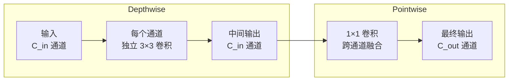
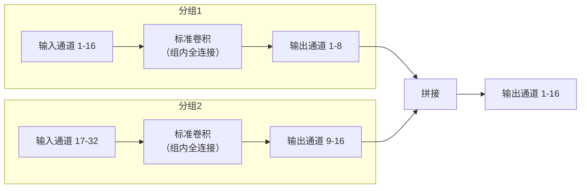
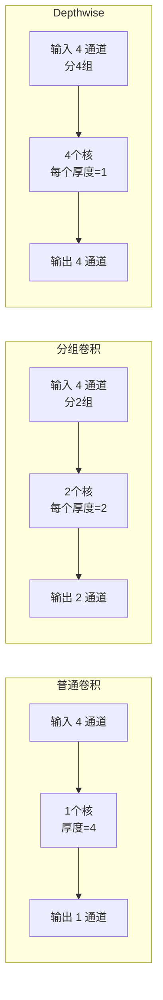
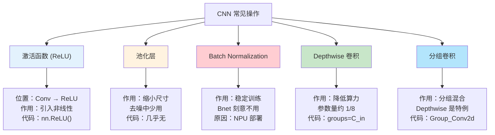

# 卷积神经网络中的其他常见操作

> **前置知识**：你已经了解了卷积层的基本计算（单通道、多通道）、Bayer RAW 的特殊处理、感受野的概念，以及完整的去噪网络结构（DMNet、UNet、Bnet_base.py）。现在，我们来补充 CNN 中其他常见的“零件”——它们不一定每个都在你的代码里出现，但理解它们能帮你读懂更广泛的模型，也理解为什么你的代码做了某些设计选择。

## 1 激活函数（ReLU）

### 1.1 回顾：神经元需要“非线性”

在“神经网络工作原理”里学过神经元的公式：

$$
a = \sigma(w_1 x_1 + w_2 x_2 + \dots + w_n x_n + b)
$$

公式里的 $\sigma$ 就是**激活函数**。它的作用是**引入非线性**——如果没有它，无论堆叠多少层，网络都只能表达线性关系（直线、平面），无法拟合现实世界的复杂问题。

> **术语解释**：**激活函数（Activation Function）** 是一个对神经元输出做非线性变换的数学函数。它在神经网络中的位置是“卷积层/全连接层之后，输出之前”。简单理解：卷积层算出一个数，激活函数决定“这个数要不要传递给下一层、以什么强度传递”。

### 1.2 ReLU：最常用的激活函数

**ReLU**（Rectified Linear Unit，修正线性单元）是目前深度学习中**最常用**的激活函数，公式极其简单：

$$
\text{ReLU}(x) = \max(0, x)
$$

```desmos-graph
left=-5
right=5
bottom=-1
top=5
grid=true
---
y = \max(0, x)
```

### 1.3 为什么 ReLU 如此流行？

| 特点         | 解释                         |                       |
| ---------- | -------------------------- | --------------------- |
| **计算极简单**  | 只需要比较 `x > 0`，没有指数、除法等复杂运算 | 无需额外硬件支持，推理速度快        |
| **缓解梯度消失** | 在正区间，导数为 1，梯度能稳定传播         | 网络可以堆叠得更深（相比 Sigmoid） |
| **稀疏激活**   | 负数直接被截断为 0，约一半神经元“关闭”      | 计算量降低，模型更高效           |

**在去噪网络中的位置**：

```text
输入 → [卷积层] → [ReLU] → [卷积层] → [ReLU] → ... → 输出
                  ↑
          每个卷积层后面通常跟一个 ReLU
```

### 1.4 代码中的 ReLU
在常见的代码中，ReLU 以 `nn.ReLU()` 的形式出现：

```python
# models/dm_net.py
self.dm_net = nn.Sequential(
    nn.Conv2d(4, 8, kernel_size=3, stride=1, padding=1),
    nn.ReLU(),  # ← 第一层卷积后接 ReLU
    nn.Conv2d(8, 8, kernel_size=3, stride=1, padding=1),
    nn.ReLU(),  # ← 第二层卷积后接 ReLU
    nn.Conv2d(8, 4, kernel_size=3, stride=1, padding=1),
    # 最后一层没有 ReLU（输出需要保持原始数值范围）
)
```

```python
# models/Bnet_base.py 中的激活函数（使用自定义的 hi_relu2）
from models.raw_video_nr_40g_nn import hi_relu2

# hi_relu2 是 ReLU 的一个变体，做了细微调整
# 本质仍然是 ReLU(x) = max(0, x)
```

### 1.5 ReLU 的其他变体（了解即可）

| 变体             | 公式                               | 特点                     |
| -------------- | -------------------------------- | ---------------------- |
| **Leaky ReLU** | $\max(0.01x, x)$                 | 负数区域有一个很小的坡度，避免“神经元死亡” |
| **PReLU**      | $\max(\alpha x, x)$，$\alpha$ 可学习 | 负数区域的坡度由数据决定           |
| **ELU**        | 负数区域用指数函数                        | 输出均值接近 0，可能更快收敛        |

在常见代码中，主要使用的是标准的 ReLU 和 `hi_relu2`（一个自定义的轻微变体）。

## 2 池化层（Pooling）

### 2.1 池化层是什么？

**池化层（Pooling Layer）** 是一种“缩小图像尺寸”的操作，在图像上滑动一个窗口，每次取窗口内的**最大值**或**平均值**作为输出。

> **术语解释**：**池化层** 是一种下采样操作，在 CNN 中通常放在连续的卷积层之间，用来缩小特征图的尺寸。它的位置在“卷积层之后，下一个卷积层之前”。池化层没有可训练的参数，只是做固定的数学运算。

```text
最大池化（Max Pooling）—— 2×2 窗口，步长=2：

输入 4×4：                   输出 2×2：
┌────────────┐               ┌─────────┐
│ 1  3  2  4 │               │  max    │
│ 5  6  8  7 │ ─→ 窗口滑动 ─→ │ 6   8   │  ← 每个窗口取最大值
│ 2  9  1  3 │               │ 9   4   │
│ 4  6  7  8 │               └─────────┘
└────────────┘
```

### 2.2 池化层的两种类型

| 类型 | 操作 | 特点 | 常见用途 |
|------|------|------|----------|
| **最大池化（Max Pooling）** | 取窗口内最大值 | 保留最强烈的特征响应 | 分类任务（保留边缘、纹理等显著特征） |
| **平均池化（Average Pooling）** | 取窗口内平均值 | 保留整体信息，更平滑 | 网络最后一层（全局平均池化） |

### 2.3 池化层的作用

| 作用 | 解释 |
|------|------|
| **缩小尺寸** | 减少特征图的 H×W，降低后续层的计算量 |
| **扩大感受野** | 特征图缩小后，后续卷积核的相对视野变大 |
| **增强平移不变性** | 允许特征在图像中稍微偏移位置时仍能被检测到 |

> **术语解释**：**平移不变性（Translation Invariance）** 指输入图像中的物体位置发生微小偏移时，网络仍能识别出同样的特征。最大池化通过取局部最大值来实现这一点——只要特征出现在窗口内的任何位置，池化后都会得到相同的最大值，从而对位置不那么敏感。

### 2.4 池化层的局限

池化层有一个明显的缺点：**它会丢弃空间信息**。

```text
最大池化只保留最大值，丢弃了其他 3 个值：
┌─────────────┐
│ 1  3        │
│ 5  6        │  ──→  只保留 6，丢弃了 1、3、5
└─────────────┘
```

在**去噪任务**中，每个像素都可能包含有用的信息（噪声是无处不在的），丢掉像素可能损失细节。因此，现代去噪网络通常**用步长卷积（stride=2 的卷积）来代替池化层**。

### 2.5 代码中的池化层

在去噪代码中，**几乎没有使用池化层**。下采样是通过 `stride=2` 的卷积实现的：

```python
# Bnet_base.py 中的 down_block（简化）
def down_block(x):
    # 使用 stride=2 的卷积来缩小尺寸，而不是池化层
    conv = nn.Conv2d(in_ch, out_ch, kernel_size=3, stride=2, padding=1)
    return relu(conv(x))

# 输入 [B, C, H, W] → 输出 [B, C', H/2, W/2]
# 尺寸减半的同时，通道数增加，保留了所有像素信息
```

> **“步长卷积 vs 池化层”的对比**：
> - 池化层：只做固定的取最大值/平均值操作，没有可训练参数，会丢弃部分信息
> - stride=2 卷积：可训练参数，通过学习决定如何保留信息，不直接丢弃任何值
>
> 在去噪任务中，stride=2 卷积效果更好（保留更多细节），因此代码中选择了步长卷积代替池化层。

### 2.6 卷积已经缩小尺寸提升感受野，为什么还要有池化？
#### 第一层：历史原因——池化层“便宜”

在深度学习早期（AlexNet、VGG 时代），GPU 算力非常有限。**卷积运算是乘法加法（乘加运算），而池化运算是取最大值或平均值（比较/加法）**。

```text
卷积（stride=2）： 每个输出值需要 3×3 = 9 次乘法 + 8 次加法 = 17 次运算
池化（Max Pooling）：每个输出值只需要 3×3 = 9 次比较
池化层的计算量约为卷积层的 1/2，而且没有可训练参数。
```
所以当时的设计是：**用卷积提取特征，用池化来“免费”缩小尺寸**，以降低后续层的计算负担。

#### 第二层：功能区别——池化提供“平移不变性”，卷积提供“可学习的下采样”

这是两者最核心的区别，我用一个具体例子来说明。

**场景**：识别一张图片里有没有“眼睛”。
```text
原始图像中，眼睛在左上角位置：
┌─────────────────────┐
│  👁️                 │
│                      │
│                      │
└─────────────────────┘

如果图像稍微向右平移了 2 个像素：
┌─────────────────────┐
│    👁️               │
│                      │
│                      │
└─────────────────────┘
```
**有了最大池化**：
```
用 2×2 最大池化，步长=2：

平移前：          平移后：
┌─────┬─────┐    ┌─────┬─────┐
│ 👁️  │     │    │     │ 👁️  │
├─────┼─────┤    ├─────┼─────┤
│     │     │    │     │     │
└─────┴─────┘    └─────┴─────┘

输出都是：      输出都是：
┌─────────┐    ┌─────────┐
│ 有特征   │    │ 有特征   │
└─────────┘    └─────────┘
```
**无论眼睛在窗口的哪个位置，只要它出现在 2×2 区域内，最大池化都会输出“有特征”。** 这就是**平移不变性（Translation Invariance）**——模型对物体的精确位置不敏感，只关心“有没有”。

**用步长卷积**：
步长卷积对每个像素位置做加权求和，**位置偏移 2 个像素，输出数值就会变化**。它保留了位置信息，但牺牲了对轻微位移的容忍度。

> **术语解释**：**平移不变性**指输入中的物体发生位置偏移时，模型的输出保持不变。这在大规模图像分类任务中很有用（“猫在图片的左边还是右边，它都是猫”）。

#### 第三层：为什么去噪任务不用池化层？

原因在于去噪任务的目标和分类任务完全不同：

| 任务       | 关心的是什么       | 是否需要平移不变性      | 对细节的要求       |
| -------- | ------------ | -------------- | ------------ |
| **图像分类** | “有没有猫？”      | ✅ 需要（猫在哪不重要）   | 低（轮廓模糊也能认）   |
| **图像去噪** | “这个像素是不是噪点？” | ❌ 不需要（噪点在哪很重要） | 极高（每个像素都要算对） |
```
去噪任务中，如果使用最大池化：

原始细节：                经过最大池化后：
┌──────────────────┐      ┌──────────────┐
│  ████████░░░░░░  │      │  ████░░░░░░  │
│  ████░░░░░░████  │  →   │  ██░░░░░░██  │  ← 细节丢失了！
│  ░░░░██████████  │      │  ░░████████  │
└──────────────────┘      └──────────────┘
```

池化层丢弃了 75% 的像素值（2×2 只保留 1 个），这些被丢弃的像素里可能就包含了关键的边缘或纹理细节。**在去噪任务中，一个像素的细节都不该被随意丢弃。**

## 3 Batch Normalization（批量归一化）

### 3.1 为什么需要 Batch Normalization？

在深度网络的训练过程中，**每一层的输入分布都在变化**——前一层参数更新后，当前层看到的输入分布就变了。这种现象叫 **“内部协变量偏移”（Internal Covariate Shift）**，会让训练变慢、不稳定。

> **术语解释**：**内部协变量偏移（Internal Covariate Shift）** 简单说就是：网络每一层的输入分布随着前面层的参数更新而不断变化，导致当前层需要不断“适应”新的输入分布。这会让训练变慢，需要更低的学习率和更精细的初始化。**Batch Normalization** 就是用来解决这个问题的。

**生活类比**：

```text
你在教一个学生做数学题。

没有 BN：每堂课老师都改变评分标准。第一节课“答对 1 题得 1 分”，第二节课突然变成“答对 1 题得 3 分”，第三节课又变了……学生要不断适应新的标准，学习效率很低。

有 BN：评分标准始终统一（均值为 0，方差为 1），学生只需要专注“怎么解题”，不需要担心“标准又变了”。
```

### 3.2 Batch Normalization 做了什么？

**Batch Normalization（BN）** 把每一层的输入**标准化**到均值为 0、方差为 1 的分布。

**四个步骤**（对每一个 mini-batch）：

```text
假设一个 mini-batch 包含 N 个样本，某个神经元的输入是 x₁, x₂, ..., xₙ

第1步：计算均值
    μ = (x₁ + x₂ + ... + xₙ) / N

第2步：计算方差
    σ² = ((x₁-μ)² + (x₂-μ)² + ... + (xₙ-μ)²) / N

第3步：标准化（让数据变成均值 0、方差 1）
    x̂ᵢ = (xᵢ - μ) / √(σ² + ε)    ← 加 ε 防止除以 0

第4步：缩放和平移（学习两个新参数 γ 和 β）
    yᵢ = γ × x̂ᵢ + β
    ↑                              ↑
  可学习的缩放因子              可学习的偏移量
```


### 3.3 BN 的好处

| 好处 | 解释 |
|------|------|
| **加速训练** | 每层输入分布稳定，可以用更大的学习率，训练更快 |
| **提高稳定性** | 减少梯度消失/爆炸的问题 |
| **减少对初始化的依赖** | 参数初始化不好，BN 能“救回来”一部分 |
| **有轻微的正则化效果** | 因为每个 mini-batch 的均值方差略有不同，相当于添加了噪声 |

### 3.4 BN 的问题

| 问题 | 解释 | 对你的影响 |
|------|------|-----------|
| **训练和推理行为不同** | 训练时用当前 batch 的均值/方差；推理时用历史积累的全局均值/方差 | 模型转换时容易出错 |
| **依赖 batch size** | batch size 太小，统计不够准确，效果变差 | 部署到移动端（小 batch）可能出问题 |
| **额外计算开销** | 推理时要额外做归一化计算 | 对 NPU/移动端不友好 |

### 3.5 为什么 Bnet 不用 BN？

在 Bnet 代码中，BN 被**刻意避免**了。`Bnet_base.py` 的设计明确采用 **“No BN”** 策略：

```python
# Bnet_base.py 中的下采样块（命名包含 NoBN）
class down_res_block_add_NoRelu2_stride2(nn.Module):
    # 注意 "NoBN" 字样 —— 这个模块没有 Batch Normalization
    # 取而代之的是：卷积 → 激活 → 卷积 → 激活（直接堆叠）
```

```python
# 典型的 NoBN 设计：
# 输入 → Conv → ReLU → Conv → ReLU → 输出
# （没有 Conv → BN → ReLU 这个模式）
```

**为什么？**

1. **NPU 部署不友好**：推理时，BN 需要额外的均值/方差存储和计算，增加部署复杂性
2. **移动端推理 batch size=1**：单张图推理时，BN 的统计值无法计算当前 batch 的均值和方差，只能用训练时积累的全局统计值，效果会打折扣
3. **增加内存访问**：每层多一次“读-写”操作，增加带宽压力
4. **没有 BN 也能训好**：通过残差连接和合理的学习率，网络仍然能收敛

> **结论**：采用“无 BN”设计，是为了**更平滑地迁移到 NPU 推理**。这是工业界模型（尤其是嵌入式部署）和学术模型的一个典型区别。

## 4 Depthwise Convolution（深度可分离卷积）

### 4.1 标准卷积的问题

标准卷积中，一个卷积核的“厚度”等于输入通道数。如果输入是 `[B, C_in, H, W]`，输出是 `[B, C_out, H, W]`：

```text
标准卷积的参数：
每个卷积核：C_in × kh × kw
总参数：C_out × C_in × kh × kw
```

假设 `C_in=32`，`C_out=64`，`kh=kw=3`，参数总量 = `64 × 32 × 9 = 18,432`。

在网络较深、通道数变大时（如 512 通道），这个参数会爆炸。

### 4.2 Depthwise 卷积

**Depthwise 卷积**（深度可分离卷积）的策略是：**让每个输入通道独立拥有一个卷积核，互不干扰**。

```text
深度可分离卷积分成两步：

第1步：Depthwise 卷积——每个通道单独卷
┌─────────────────────────────────────────────────────────────┐
│                                                             │
│  输入通道1 ──→ 核1 ──→ 输出通道1                           │
│  输入通道2 ──→ 核2 ──→ 输出通道2                           │
│  输入通道3 ──→ 核3 ──→ 输出通道3                           │
│  输入通道4 ──→ 核4 ──→ 输出通道4                           │
│  ...                                                       │
│  输入通道C_in ──→ 核C_in ──→ 输出通道C_in                 │
│                                                             │
│  每个输入通道独立计算，不与其他通道混合                      │
└─────────────────────────────────────────────────────────────┘

第2步：Pointwise 卷积（1×1 卷积）——在通道间融合信息
┌─────────────────────────────────────────────────────────────┐
│                                                             │
│  输出通道1 ──┐                                             │
│  输出通道2 ──┼──→ 1×1 卷积 ──→ 输出通道（任意数量）       │
│  输出通道3 ──┘                                             │
│                                                             │
│  用 1×1 卷积把各个通道的信息混合起来                        │
└─────────────────────────────────────────────────────────────┘
```



### 4.3 参数量对比

**场景**：输入 32 通道 → 输出 64 通道，3×3 卷积

| 方式 | 参数计算 | 总参数 | 倍数 |
|------|---------|--------|------|
| **标准卷积** | 64 × 32 × 9 | **18,432** | 1× |
| **Depthwise + Pointwise** | (32 × 9) + (64 × 32 × 1) | 288 + 2,048 = **2,336** | **约 7.9× 更少** |

用具体数字走一遍：

```text
标准卷积：
  参数量 = C_out × C_in × kh × kw
        = 64 × 32 × 3 × 3 = 18,432

深度可分离卷积：
  Depthwise 部分 = C_in × kh × kw = 32 × 3 × 3 = 288
  Pointwise 部分 = C_out × C_in × 1 × 1 = 64 × 32 = 2,048
  总参数量 = 288 + 2,048 = 2,336

参数量 = 2,336 / 18,432 ≈ 12.7%  ← 只有标准卷积的 1/8！
```

### 4.4 为什么 NPU 喜欢 Depthwise？

| 原因 | 解释 |
|------|------|
| **参数少** | 模型文件小，加载快 |
| **计算量低** | 浮点运算次数少，省电 |
| **内存访问少** | 不需要频繁读写大张的特征图 |

**代价**：表达能力略有下降（因为通道间信息的混合被推迟到了 1×1 卷积），但通过增加网络宽度可以弥补。

### 4.5 代码中的 Depthwise

在代码中，Depthwise 卷积出现在小算力优化版本中：

```python
# raw_video_nr_40g_nn_diamond_conv.py
# 这个文件专门做了 Depthwise 优化

# 标准的 Depthwise 卷积写法（PyTorch）
nn.Conv2d(in_channels, in_channels, kernel_size=3, stride=1, padding=1, groups=in_channels)
#                                                                   ↑
#                                                        groups=in_channels 就是 Depthwise
```

> **术语解释**：`groups` 是 PyTorch 中 `Conv2d` 的一个参数。默认 `groups=1` 表示标准卷积（所有输入通道连接到所有输出通道）。当 `groups=in_channels` 时，每个输入通道独立做卷积，就是 Depthwise 卷积。

## 5 分组卷积（Group Convolution）

### 5.1 分组卷积是什么？

**分组卷积（Group Convolution）** 是把输入通道**分成若干组**，每组独立做标准卷积，最后把各组的结果在通道维度上拼接起来。

```text
分组卷积（groups=2 为例）：

输入通道 1-8       输出通道 1-4
输入通道 9-16      输出通道 5-8
────────────────────────────────
输入通道 17-24     输出通道 9-12
输入通道 25-32     输出通道 13-16

每组内部是标准卷积（全连接），组与组之间不通信。
```



### 5.2 分组卷积的参数量

输入 C_in，输出 C_out，分成 g 组：

```text
标准卷积参数量 = C_out × C_in × kh × kw

分组卷积参数量 = C_out × (C_in/g) × kh × kw
              = 标准卷积参数量 / g
```

**当 g = C_in 时**，每组只有 1 个输入通道，分组卷积就变成了 **Depthwise 卷积**。所以，**Depthwise 是分组卷积的特例**：

```text
普通卷积（groups=1）：
  所有输入通道连接到所有输出通道

分组卷积（groups=g）：
  每组 g 个输入通道，分别连接到对应的输出通道

Depthwise 卷积（groups=C_in）：
  每个输入通道独立连接到自己的输出通道
```

### 5.3 代码中的分组卷积

在代码中，`Bnet_base.py` 使用了 `Group_Conv2d`：

```python
# models/Bnet_base.py
from models.raw_video_nr_40g_nn import Group_Conv2d

# Group_Conv2d 就是分组卷积
# 它的内部实现是 nn.Conv2d(..., groups=groups)
```

```text
典型用法：
self.conv2d1_3x3 = Group_Conv2d(in_chn, inter_chn, kernel_size=3, stride=1, groups=4)
                                                                              ↑
                                                                        分组数=4
```

### 5.4 三种卷积的对比



| 卷积类型 | groups 参数 | 每个核的厚度 | 特点 |
|---------|------------|-------------|------|
| **普通卷积** | groups=1 | C_in | 所有通道充分混合，表达力最强，参数量最大 |
| **分组卷积** | groups=g (1 < g < C_in) | C_in/g | 组内混合，降低参数量，适合大模型并行 |
| **Depthwise** | groups=C_in | 1 | 通道间不混合，参数量最低，适合轻量部署 |

## 6 本章小结



**一句话总结**：

> ReLU 是让网络“变弯”的非线性激活函数，几乎每层都用；池化层在去噪网络中被 stride=2 卷积替代；Batch Normalization 能加速训练但 Bnet 为 NPU 部署特意不用；Depthwise 卷积把参数量降到 1/8，是轻量部署的关键；分组卷积是 Depthwise 的“广义版本”，`groups=C_in` 时就是 Depthwise。