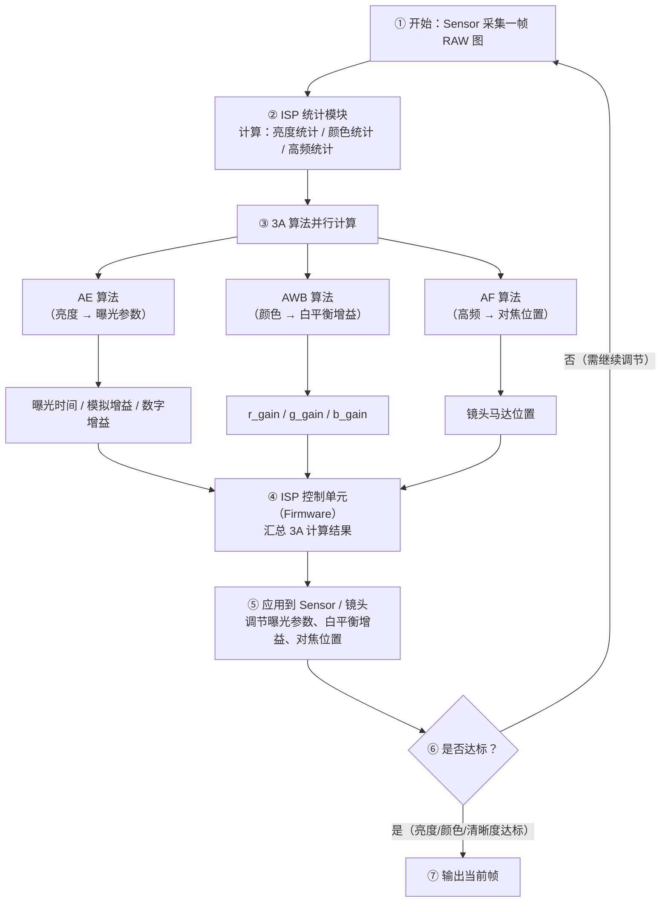
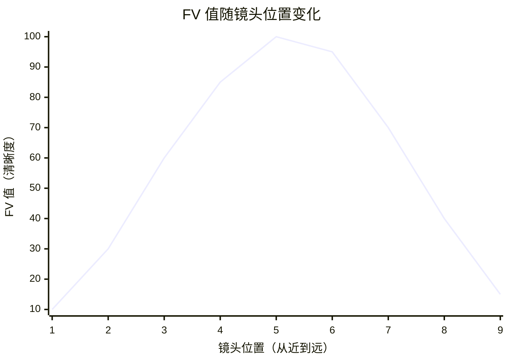

## 1. 什么是 3A 算法？

### 1.1 3A 的含义

**3A** 是相机系统中三个核心自动控制算法的统称：

| 缩写 | 全称 | 解决的问题 |
|------|------|-----------|
| **AE** | Auto Exposure（自动曝光） | 画面亮度是否合适？——控制进光量 |
| **AWB** | Auto White Balance（自动白平衡） | 颜色是否偏色？——校正色温 |
| **AF** | Auto Focus（自动对焦） | 画面是否清晰？——控制镜头位置 |

这三个算法共同决定了最终图像的**亮度、颜色和清晰度**，是 ISP 中最重要的控制逻辑。
### 1.2 3A 在 ISP 中的位置

3A 算法不是像 Demosaic 或 Gamma 那样的“图像处理模块”，而是**控制模块**——它们不直接处理像素，而是通过分析图像统计信息来调节 Sensor 和镜头的参数。


> **术语解释**：**统计信息模块**是 ISP 硬件中专门用来“数数”的单元——它会统计整张图或每个区域的亮度平均值、R/G/B 分量值、高频分量等，供 3A 算法使用。3A 算法本身运行在 Firmware 中，由 ISP 控制单元调度。


## 2. AE —— 自动曝光（Auto Exposure）

### 2.1 AE 要解决什么问题？

**问题**：照片太亮（过曝）或太暗（欠曝）。

**AE 的目标**：使画面的整体亮度达到“目标值”，让图像明暗适中。

### 2.2 AE 怎么算？

AE 的核心是一个**闭环反馈控制**过程： 

```text
① Sensor 采集一帧图像
② ISP 统计信息模块计算当前画面的平均亮度（实测值）
③ 将实测值与目标亮度比较 → 计算增益系数 g
④ 根据 g 调节 Sensor 的曝光参数
⑤ 回到①，直到亮度达标
```

**增益系数计算公式**：

$$
g = \frac{\text{target}}{\text{measured}}
$$

其中 `target` 是理想画面亮度，`measured` 是当前画面亮度的实测值。

**具体数字演示**：

```text
假设目标亮度 target = 100（中性灰对应的亮度值）

第1帧：实测亮度 measured = 60（画面偏暗）
       g = 100 / 60 = 1.67
       需要把亮度提高到 1.67 倍 → 增加曝光时间或增益

第2帧：实测亮度 measured = 95
       g = 100 / 95 = 1.05
       只需要微调

第3帧：实测亮度 measured = 100
       g = 100 / 100 = 1.0
       亮度达标，停止调节
```

### 2.3 AE 调节的三个“旋钮”

AE 通过调节以下三个参数来控制进光量：

| 参数       | 作用                   | 优先级  | 噪声影响 |
| -------- | -------------------- | ---- | ---- |
| **曝光时间** | Sensor 积累电荷的时间（越长越亮） | 优先使用 | 噪声最小 |
| **模拟增益** | 信号放大（硬件级）            | 次优先  | 噪声较小 |
| **数字增益** | 数字放大（软件级）            | 最后使用 | 噪声最大 |

> **术语解释**：**曝光时间**是 Sensor 从开始感光到读出电信号的时间。**模拟增益**是 Sensor 读出信号时的硬件放大，**数字增益**是 ISP 在数字域做的放大。

**曝光策略的优先级**：
```text
画面偏暗时，AE 按以下顺序调节：
① 优先增加曝光时间（噪声最小，画质损失最少）
② 曝光时间达到上限（一帧时间）→ 增加模拟增益
③ 模拟增益达到上限 → 增加数字增益（最后手段，噪声最大）
```

### 2.4 AE 的三种工作模式

| 模式       | 策略       | 适用场景              |
| -------- | -------- | ----------------- |
| **快门优先** | 优先分配曝光时间 | 一般场景（噪声最小）        |
| **光圈优先** | 优先调整光圈   | 需要控制景深（p-iris 镜头） |
| **增益优先** | 优先分配增益   | 拍摄运动物体（需要短曝光时间）   |

### 2.5 AE 的统计信息

AE 依赖 ISP 硬件提供的亮度统计信息：
- 整幅图像的**直方图**（通常 256 段或 1024 段）
- 整幅图像的**平均亮度**
- 将图像分成 M×N 个区块，每个区块的 R/Gr/Gb/B 分量平均值
> 这里的直方图其实是统计信息：**X 轴**显示**亮度级别**；**Y轴**显示**像素数量**

ISP 硬件每秒会生成数十帧这样的统计报告给 AE 算法。通过直方图形状即可判断画面状态：

```text
场景一：画面太暗（欠曝）       场景二：画面太亮（过曝）       场景三：画面正常（理想）
（所有像素挤在左边）          （所有像素挤在右边）          （像素均匀分布在中间）
                                            
   ▲ 像素数                     ▲ 像素数                     ▲ 像素数
   │   ████                      │              ████         │      ██
   │   ████                      │              ████         │     ████
   │   ████                      │            ██████         │    ██████
   │ ████████                    │          ████████         │  ████████
   └─────────► 亮度              └─────────► 亮度              └─────────► 亮度
   暗 ◄──────► 亮               暗 ◄──────► 亮               暗 ◄──────► 亮
   (峰值靠左)                    (峰值靠右)                    (峰值居中)
```

> **ISP 的 AE 算法看到场景一，就会指令 Sensor：“现在太暗，增加曝光时间！”看到场景二，就会指令：“太亮，减少曝光！”**


## 3. AWB —— 自动白平衡（Auto White Balance）

### 3.1 AWB 要解决什么问题？

**问题**：同一张白纸，在日光下拍出来是白色，在白炽灯下拍出来偏黄，在阴天拍出来偏蓝。这是由**色温**不同导致的。
> **术语解释**：**色温（Color Temperature）** 是描述光源颜色的物理量，单位是开尔文（K）。色温越低（如 2800K 白炽灯），光线偏黄/红；色温越高（如 6500K 日光），光线偏蓝。

**AWB 的目标**：使白色物体在任何光源下都呈现为白色。

### 3.2 AWB 怎么算？

AWB 的核心操作是**调整 R、G、B 三个通道的增益**：
```text
R_out = R_in × r_gain
G_out = G_in × g_gain（通常固定为 1.0）
B_out = B_in × b_gain
```

**具体数字演示**：
```text
在白炽灯下拍摄白纸，Sensor 读到的值偏黄（R 偏高，B 偏低）：
R=200, G=180, B=150

AWB 检测到 R 偏高、B 偏低，计算增益：
r_gain = 0.9（压低 R）
g_gain = 1.0（G 不变）
b_gain = 1.2（提升 B）

校正后：
R_out = 200 × 0.9 = 180
G_out = 180 × 1.0 = 180
B_out = 150 × 1.2 = 180

结果：R=G=B=180 → 白色被还原！
```

### 3.3 AWB 的两个核心问题

| 问题 | 说明 |
|------|------|
| **色温检测** | 如何判断当前环境光的色温？ |
| **增益计算** | 计算出合适的 r_gain 和 b_gain |

**色温检测的常用方法**：

1. **灰度世界法**：假设自然图像中所有颜色的平均值是灰色（R=G=B），计算整图的 R/G/B 均值，然后调整增益使三者相等。
2. **白点检测法**：找到图像中“应该是白色”的区域（高亮区域或特定色温区域），用这些区域计算增益。

### 3.4 AWB 的统计信息

AWB 依赖 ISP 硬件提供的颜色统计信息：
- 判断每个像素是否满足**白点条件**（颜色落在预设的“白色区域”内）
- 统计所有白点的 R、G、B 均值
- 支持将图像分成 M×N 区块，统计每个区块的 R/G/B 均值和白点个数
- 输出整幅图像的 R、G、B 均值


## 4. AF —— 自动对焦（Auto Focus）

### 4.1 AF 要解决什么问题？

**问题**：画面模糊。

**AF 的目标**：通过移动镜头，找到使图像最清晰的对焦位置。

### 4.2 AF 的核心概念：FV（Focus Value）

> **术语解释**：**FV（Focus Value，清晰度值）** 是衡量图像清晰度的数值。图像越清晰，高频分量（边缘、纹理）越多，FV 值越大。

AF 算法的本质是：**寻找 FV 值最大的镜头位置**。



FV 值在合焦位置达到峰值，两侧逐渐下降。

### 4.3 AF 的三种实现方式

| 方式 | 原理 | 特点 |
|------|------|------|
| **反差式对焦（CDAF）** | 寻找图像对比度最大的位置 | 准确，但速度较慢 |
| **相位式对焦（PDAF）** | 利用 Sensor 上的相位检测像素 | 速度快，但需要特殊硬件 |
| **混合式对焦** | 相位检测快速粗对焦 + 反差式精确微调 | 兼顾速度和精度 |

### 4.4 三段式对焦搜索策略

AF 算法通常采用**三段式搜索**来平衡速度和精度：

```text
阶段1：方向检测
  → 判断镜头应该往哪个方向移动（FV 值增大方向）

阶段2：粗搜索
  → 以较大步长快速移动，找到 FV 峰值附近区域

阶段3：精定位
  → 以小步长精细搜索，精确找到 FV 峰值位置
```

### 4.5 AF 的统计信息

AF 依赖 ISP 硬件提供的清晰度统计信息：
- 对输入图像进行**高通滤波**（提取高频分量）
- 统计每个区块的高频分量值
- 提供 H0、H1、V0 等多种滤波器的统计结果
- 支持高亮点计数（HlCnt）

### 4.6 AF 的辅助功能

| 功能                        | 说明              |
| ------------------------- | --------------- |
| **追焦（Chasing Focus）**     | 变焦后自动重新对焦       |
| **实时追焦（Real-Time Focus）** | 检测到画面变化时自动触发对焦  |
| **齿隙补偿（Backlash）**        | 补偿马达正反转切换时的机械间隙 |
|                           |                 |


## 5. 3A 算法在 Firmware 中的实现

在 ISP 的 Firmware 中，3A 算法以**算法库**的形式存在：

```text
┌─────────────────────────────────────────────────────────────┐
│                    ISP Firmware 架构                        │
├─────────────────────────────────────────────────────────────┤
│                                                             │
│  ┌─────────────────┐    ┌─────────────────┐                │
│  │  ISP 控制单元    │───→│  基础算法库     │                │
│  │  （调度器）      │    │  （BLC/DPC/     │                │
│  └─────────────────┘    │   Demosaic等）  │                │
│           │             └─────────────────┘                │
│           │             ┌─────────────────┐                │
│           ├────────────→│  3A 算法库      │                │
│           │             │  （AE/AWB/AF）  │                │
│           │             └─────────────────┘                │
│           │             ┌─────────────────┐                │
│           └────────────→│  Sensor 库      │                │
│                         │  （硬件适配层）  │                │
│                         └─────────────────┘                │
│                                                             │
└─────────────────────────────────────────────────────────────┘
```

**关键设计思想**：
1. **单独提供 3A 算法库**：AE/AWB/AF 作为独立模块
2. **由 ISP 控制单元调度**：控制单元协调基础算法和 3A 算法的执行顺序
3. **Sensor 库注册回调函数**：实现不同 Sensor 的差异化适配


## 6. 一句话总结

> **3A 算法（AE、AWB、AF）是 ISP 的“智能大脑”——AE 通过亮度反馈闭环控制曝光量，AWB 通过调整 R/G/B 增益校正色温，AF 通过搜索 FV 峰值找到最佳对焦位置。三者都依赖 ISP 硬件提供的统计信息，以算法库的形式被 Firmware 调度执行。**