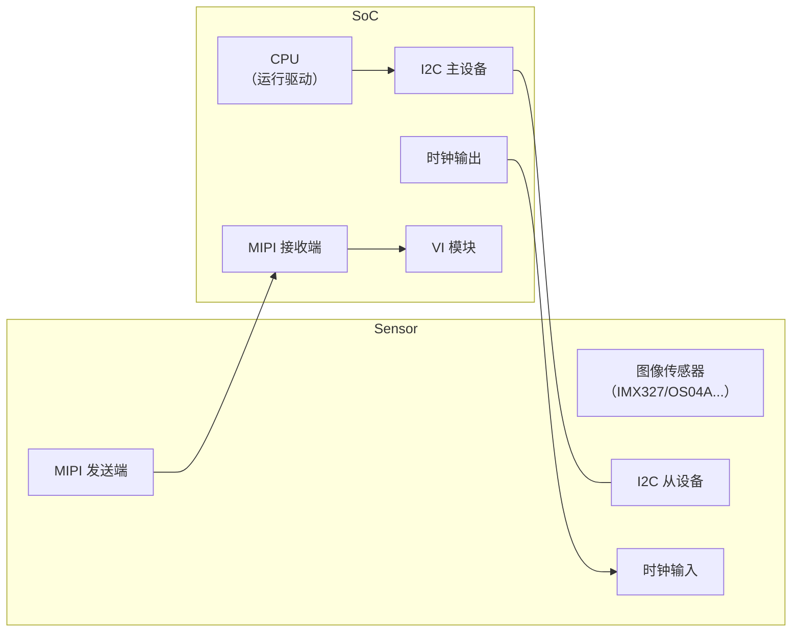
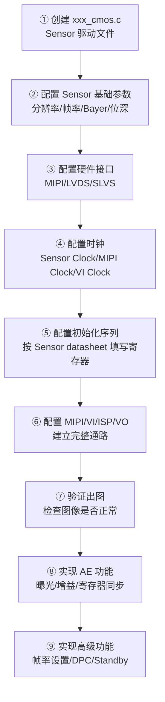

## 1. Sensor 是什么？

### 1.1 一句话定义

> **术语解释**：**Sensor（图像传感器）** 是相机的“眼睛”——它把镜头汇聚进来的光信号（光子）转换成电信号，再通过模数转换（ADC）变成数字信号（RAW 图），交给 ISP 处理。

```text
光信号（光子） → Sensor → 电信号（模拟） → ADC → 数字信号（RAW 图） → ISP
```

### 1.2 CCD vs CMOS —— 两种主流 Sensor 技术

| 特性         | CCD（电荷耦合器件） | CMOS（互补金属氧化物半导体） |
| ---------- | ----------- | ---------------- |
| **信号读取方式** | 全局曝光，逐行搬移电荷 | 逐行读出（卷帘曝光）或全局曝光  |
| **功耗**     | 高（需要多组供电）   | 低（单组供电即可）        |
| **速度**     | 慢（电荷搬移受限）   | 快（每个像素独立读出）      |
| **成本**     | 高（工艺复杂）     | 低（标准 CMOS 工艺）    |
| **应用**     | 工业相机、高端摄影   | 手机、安防、车载（主流）     |
| **噪声**     | 低           | 较高（但已通过技术改进）     |
|            |             |                  |

> **当前主流**：车载和安防场景几乎全部使用 **CMOS Sensor**。

> **术语解释**：**全局曝光（Global Shutter）** 指所有像素同时曝光，适合拍摄运动物体；**卷帘曝光（Rolling Shutter）** 指像素逐行曝光，拍运动物体时可能出现“果冻效应”（图像倾斜扭曲）。CMOS 技术已发展出全局快门型号（如索尼 IMX 系列部分型号），但卷帘快门仍更常见，因其成本和功耗更低。


## 2. Sensor 的关键参数

### 2.1 图像宽高（分辨率）

> **术语解释**：**图像宽高**指 Sensor 输出的 RAW 图的像素尺寸，通常用“宽度 × 高度”表示，如 1920×1080 表示宽 1920 个像素、高 1080 个像素。总像素数 = 宽 × 高。

```text
常见分辨率：
2M（200万像素）：1920 × 1080 = 2,073,600 像素
4M（400万像素）：2688 × 1520 ≈ 4,085,760 像素
8M（800万像素）：3840 × 2160 = 8,294,400 像素
```


### 2.2 帧率（Frame Rate）

> **术语解释**：**帧率（Frame Rate）** 指 Sensor 每秒输出多少帧图像，单位是 fps（frames per second）。30fps 表示每秒输出 30 帧。

```text
常见帧率：
安防监控：15-30fps
车载前视：30-60fps
高速检测：120fps 以上
```

**帧率与分辨率的关系**（**带宽限制**原理）：

> **术语解释**：**带宽**指 Sensor 每秒输出的总数据量，等于“分辨率 × 位深 × 帧率”。Sensor 的最大带宽由硬件（MIPI 通道数、时钟频率）决定，分辨率越高，帧率必须越低，否则数据量超过带宽上限。

> **位深（Bit Depth）**，在图像传感器（Sensor）的语境下，就是**每个像素用多少个“二进制位（bit）”来存储它的亮度值**。
> 简单来说，它决定了**“从纯黑到纯白之间，一共能区分出多少个灰度等级”**。

```text
带宽公式：总数据量 = 宽 × 高 × 位深 × 帧率

例：10-bit 1920×1080 Sensor
带宽上限 ≈ 800 Mbps（由 MIPI 通道数和时钟决定）
最大帧率 = 800M / (1920 × 1080 × 10) ≈ 38.5 fps
```

### 2.3 像素时钟（Pixel Clock）

> **术语解释**：**像素时钟（Pixel Clock）** 是 Sensor 内部输出的同步时钟信号，每个时钟周期对应一个像素数据的输出。像素时钟直接决定了 Sensor 的数据输出速率。

```text
像素时钟（MHz）= 宽 × 高 × 帧率 × 每像素位数 / 通道数

例：10-bit 1920×1080@30fps，4 lane MIPI
每像素有效位数 = 10 bit
总数据率 = 1920 × 1080 × 10 × 30 ≈ 622 Mbps
像素时钟 ≈ 622 / 4（lane）≈ 155 MHz
```

> **在驱动中的体现**：像素时钟决定了 MIPI 的传输速率，驱动需要根据分辨率/帧率计算正确的时钟配置。

> **MIPI** 在这里是 **MIPI CSI-2** 的简称，它是**摄像头和 SoC（处理器）之间传输原始图像数据的高速物理接口标准**。

### 2.4 Bayer 格式（Bayer Pattern）

> **术语解释**：**Bayer 格式**指 Sensor 输出的 RAW 图中颜色滤镜的排列方式。

```text
常见 Bayer 格式：
RGGB：第一行 R G R G...，第二行 G B G B...（最常用）
GRBG：第一行 G R G R...，第二行 B G B G...
GBRG：第一行 G B G B...，第二行 R G R G...
BGGR：第一行 B G B G...，第二行 G R G R...
```

> **重要**：ISP 的 Demosaic 模块必须知道正确的 Bayer 格式才能还原彩色图像。如果格式配置错误，输出图像的颜色会完全错乱。

### 2.5 曝光时间（Exposure Time）

> **术语解释**：**曝光时间（Exposure Time）** 指 Sensor 每个像素收集光信号的时间，决定了图像的亮度。曝光时间越长，图像越亮，但运动模糊越严重。

```text
曝光时间通常以“行数（Line Count）”或“微秒（μs）”表示：
行曝光 = 曝光行数 × 每行时间
例：1080p Sensor，每行时间 ≈ 30μs，曝光行数 = 200
曝光时间 = 200 × 30μs = 6,000μs = 6ms
```

> **AE 调节的优先级**：AE 算法优先调节曝光时间（噪声最小），曝光时间达到上限（一帧周期）后才开始增加增益。在低光场景下，曝光时间可能超过帧周期，直接导致帧率下降——这是正常现象，因为 Sensor 必须等待足够的光信号积累。

### 2.6 增益（Gain）

> **术语解释**：**增益（Gain）** 是**对 Sensor 输出信号的放大倍数**。在暗光场景下，即使曝光时间达到上限，图像仍然偏暗，这时就需要增加增益（放大信号）。增益越大，亮度越高，但噪声也会被同步放大（信噪比下降）。

| 增益类型            | 阶段                     | 特点        |
| --------------- | ---------------------- | --------- |
| **Again（模拟增益）** | Sensor 内部，信号被 ADC 读出之前 | 噪声最小，优先使用 |
| **Dgain（数字增益）** | Sensor 内部 ADC 转换之后     | 噪声中等，次优先  |
| **ispDgain**    | ISP 内部的数字放大            | 噪声最大，最后使用 |

> **AE 分配的优先级**：Again（+6dB）→ Dgain（+6dB）→ ispDgain（+3dB），目的是在保证亮度的同时尽量减少噪声放大。AE 算法的核心任务之一就是动态分配三者的比例。

### 2.7 黑电平（Black Level）

> **术语解释**：**黑电平（Black Level）** 是 Sensor 在全黑环境下输出的基准值，通常不是 0，而是一个固定偏置（如 256 或 300，对于 12-bit 数据）。这个偏置是 Sensor 硬件的“读出噪声”，必须在 ISP 中减去，否则图像整体偏亮（黑色不黑）。

```text
读取到的像素值 = 真实信号 + 黑电平偏置
真实信号 = 读取值 - 黑电平偏置

例：12-bit Sensor，黑电平 = 256
暗部真实信号 = 300 - 256 = 44（接近黑）
亮部真实信号 = 3800 - 256 = 3544（接近白）
```

> **标定**：黑电平通常由 Sensor 厂商提供，在 Sensor 驱动初始化时配置。不同的 Sensor 型号黑电平值可能不同，需要查阅 datasheet 确认。

### 2.8 输出格式（Output Format）

> **术语解释**：**输出格式（Output Format）** 指 Sensor 输出的数据格式，包括位深和颜色格式。

```text
常见输出格式：
- 12-bit RAW（最常用，12 位 Bayer 数据，0-4095）
- 10-bit RAW（车载常用，10 位 Bayer 数据，0-1023）
- 14-bit RAW（高动态范围 Sensor）
- 8-bit YUV（已集成 ISP 的 Sensor，较少用）
```

> **注意**：Sensor 的位深决定了图像数据的动态范围，位深越高，暗部细节越丰富，但数据量也更大。在车载场景中，10-bit 是常见的平衡点。


## 3. Sensor 的曝光时序

> **术语解释**：**曝光时序（Exposure Timing）** 指 Sensor 在每一帧中如何控制曝光、读出和垂直消隐的时间节奏。理解这个时序是配置 AE 功能的关键。

### 3.1 帧读出时序图

```text
┌─────────────────────────────────────────────────────────────────────────────┐
│                    Sensor 曝光时序（卷帘快门）                               │
├─────────────────────────────────────────────────────────────────────────────┤
│                                                                             │
│  VSYNC（垂直同步信号）                                                      │
│  ┌─────┐                                                                   │
│  │     │          ┌─────┐          ┌─────┐                                │
│  │     │          │     │          │     │                                │
│  └─────┘          └─────┘          └─────┘                                │
│       ↑               ↑               ↑                                    │
│     帧 N 开始      帧 N+1 开始     帧 N+2 开始                             │
│                                                                             │
│  HREF（行有效信号）                                                        │
│  ┌─────────────────────────────────────────────────────────────────────────┐│
│  │  行0      行1      行2      行3      行4      行5       行N            ││
│  └─────────────────────────────────────────────────────────────────────────┘│
│       ↑                                                                     │
│   每行包含：曝光时间 + 读出时间                                             │
│                                                                             │
│  各行的曝光起始时间：                                                       │
│  行0：───[曝光─────]───[读出]──                                            │
│  行1：────[曝光─────]───[读出]──                                           │
│  行2：─────[曝光─────]───[读出]──                                          │
│  ...                                                                       │
│  行N：──────────[曝光─────]───[读出]──                                     │
│                                                                             │
└─────────────────────────────────────────────────────────────────────────────┘
```

### 3.2 关键时序参数

| 参数               | 含义                | 在驱动中的位置 |
| ---------------- | ----------------- | ------- |
| **VSYNC**        | 垂直同步，每帧开始信号       | 中断触发    |
| **HREF**         | 行有效，一行数据有效期间      | 数据传输使能  |
| **曝光行数**         | 当前帧的曝光行数（控制亮度）    | 寄存器配置   |
| **VTS（垂直总行数）**   | 一帧的总行数（含消隐区），决定帧率 | 寄存器配置   |
| **VBLANK（垂直消隐）** | 帧与帧之间的空闲行数        | 寄存器配置   |

### 3.3 帧率与曝光时序的关系

> **术语解释**：**消隐区（Blanking）** 是帧与帧之间、行与行之间的空闲时间，不传输有效像素数据，但 Sensor 在此期间进行内部处理（如曝光时序计算、寄存器更新）。没有消隐区，Sensor 将无法正确控制帧间时序，必须保留足够的消隐时间。

```text
VTS = 有效行数（如 1080）+ VBLANK

帧周期 = VTS × 每行时间

帧率 = 1 / 帧周期

曝光时间的上限 = 帧周期 - 读出时间
```

> **关键理解**：当曝光时间需求超过帧周期时，Sensor 会自动延长 VBLANK 来满足曝光需求（导致帧率下降）。驱动必须正确配置 VTS 和 VBLANK，确保曝光时间范围满足实际场景需求。


## 4. Sensor 与 SoC 的连接

### 4.1 信号连接图



### 4.2 关键信号说明

| 信号类型 | 方向 | 作用 |
|---------|------|------|
| **I2C** | SoC → Sensor | 发送命令（设置曝光、增益、帧率等寄存器） |
| **MIPI CSI** | Sensor → SoC | 传输图像数据（高速差分信号） |
| **MCLK** | SoC → Sensor | 提供 Sensor 工作时钟（通常 24MHz/27MHz/37.125MHz） |
| **RST** | SoC → Sensor | 硬件复位 Sensor |
| **PWDN** | SoC → Sensor | 电源开关控制（低功耗休眠） |


## 5. 对接 Sensor 的驱动开发流程

### 5.1 完整流程



### 5.2 各步骤详解

**步骤 ①：创建 `xxx_cmos.c`**

> Sensor 驱动的标准文件命名，`xxx` 代表 Sensor 型号（如 `imx327_cmos.c`、`os04a_cmos.c`）。

```c
// 典型的 Sensor 驱动文件结构
struct sensor_info {
    uint32_t width;          // 图像宽度
    uint32_t height;         // 图像高度
    uint32_t frame_rate;     // 帧率
    uint32_t bayer_pattern;  // Bayer 格式
    uint16_t exposure_lines; // 曝光行数
    uint16_t again;          // 模拟增益
    uint16_t dgain;          // 数字增益
};

// 寄存器操作函数
int sensor_write_reg(uint16_t reg, uint32_t val);
int sensor_read_reg(uint16_t reg, uint32_t *val);
```

**步骤 ②：确定 Pub 属性**

> **术语解释**：**Pub 属性（Public Attributes）** 是 Sensor 对外公开的基本参数，供上层模块（ISP、VI）查询和使用。这些参数在驱动初始化时确定，后续通常不会动态改变。

```c
// Pub 属性的典型内容
struct sensor_pub_attr {
    uint32_t width;          // 输出宽度
    uint32_t height;         // 输出高度
    uint32_t frame_rate;     // 目标帧率
    uint32_t bayer_pattern;  // RGGB/GRBG/GBRG/BGGR
    uint32_t bit_depth;      // 10-bit/12-bit
    uint32_t wdr_mode;       // 宽动态模式（开/关）
};
```

**步骤 ③：配置硬件接口**

> **术语解释**：**MIPI/LVDS/SLVS** 是 Sensor 输出图像数据的不同物理接口标准。MIPI 是车载 Sensor 的主流接口，LVDS 用于较老的 Sensor，SLVS 是索尼的专有接口标准。

```text
MIPI CSI-2：主流接口，4 lane 可达 10Gbps+
LVDS：较老接口，常用于 1080p 以下分辨率
SLVS：索尼专有接口
```

**步骤 ④：配置时钟**

> **术语解释**：**Sensor 时钟（MCLK）** 由 SoC 提供给 Sensor，驱动 Sensor 内部逻辑。**MIPI 时钟** 由 Sensor 输出，用于高速数据传输。**VI 时钟** 是 SoC 内部 VI（Video Input）模块的工作时钟，用于接收 MIPI 数据。三者必须同步配置，才能保证数据稳定传输。

```text
MCLK (24MHz) → Sensor 内部 PLL → 像素时钟 → MIPI 时钟 → VI 模块
```

**步骤 ⑤：配置初始化序列**

> **术语解释**：**初始化序列（Initialization Sequence）** 是 Sensor 上电后必须按顺序写入的一组寄存器配置。这些寄存器控制 Sensor 的工作模式、输出格式、时序参数等，是 Sensor 正常工作的前提。

```text
例（伪代码）：
write_reg(0x0100, 0x00);   // 停止 Sensor
write_reg(0x0101, 0x00);   // 复位
delay_ms(10);
write_reg(0x3000, 0x01);   // 设置输出格式
write_reg(0x3001, 0x02);   // 设置分辨率
...
write_reg(0x0100, 0x01);   // 启动 Sensor
```

**步骤 ⑥：建立通路**

> **术语解释**：**通路（Pipeline）** 指数据从 Sensor 到最终输出的完整路径。需要配置 MIPI（物理层接收）、VI（视频输入模块，负责解析 MIPI 数据）、ISP（图像信号处理）、VO（视频输出模块）等多个模块，并确保它们的配置参数（分辨率、帧率、Bayer 格式）完全一致。

**步骤 ⑦：验证出图**

> 通过 VI 模块采集一帧图像，检查：
> - 图像是否全黑/全白（曝光/增益问题）
> - 颜色是否正常（Bayer 格式错误会导致颜色完全错乱）
> - 图像是否有条纹/撕裂（MIPI 信号或时序配置问题）

**步骤 ⑧：实现 AE 功能**

> **术语解释**：**寄存器同步关系**指 Sensor 的曝光和增益寄存器在帧与帧之间的更新时机。通常配置在下一帧消隐区生效，驱动必须等待正确的同步信号才能写入寄存器。

```text
AE 核心函数：
sensor_set_exposure(exposure_lines)   // 设置曝光行数
sensor_set_again(gain_value)          // 设置模拟增益
sensor_set_dgain(gain_value)          // 设置数字增益

寄存器同步要求：
曝光和增益必须在帧消隐期写入，下一帧生效
```

**步骤 ⑨：实现高级功能**

| 功能 | 作用 | 实现方式 |
|------|------|---------|
| **帧率设置** | 动态调整帧率 | 修改 VTS 寄存器 |
| **自动降帧** | 低光时降低帧率增加曝光时间 | 监测 AE 状态，调整 VTS |
| **DPC** | 坏点校正（Defect Pixel Correction） | 启用 Sensor 内部坏点校正功能 |
| **Standby** | 休眠模式 | 关闭时钟、MIPI、电源 |
| **Restart** | 恢复工作 | 重新初始化 Sensor |

## 6. 一句话总结

> **Sensor 把光信号转成数字 RAW 图，驱动开发的核心是：按 Sensor 手册配置初始化序列、MIPI/VI 通路、曝光和增益参数（AE），确保 ISP 能收到格式正确（分辨率/帧率/Bayer/位深）的图像数据。**