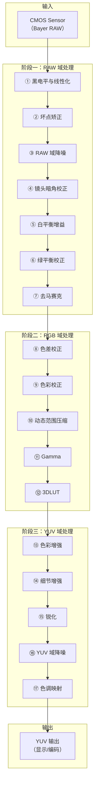
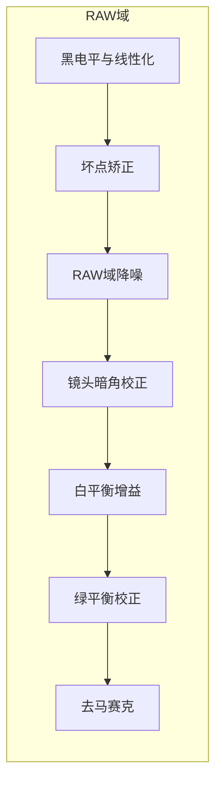
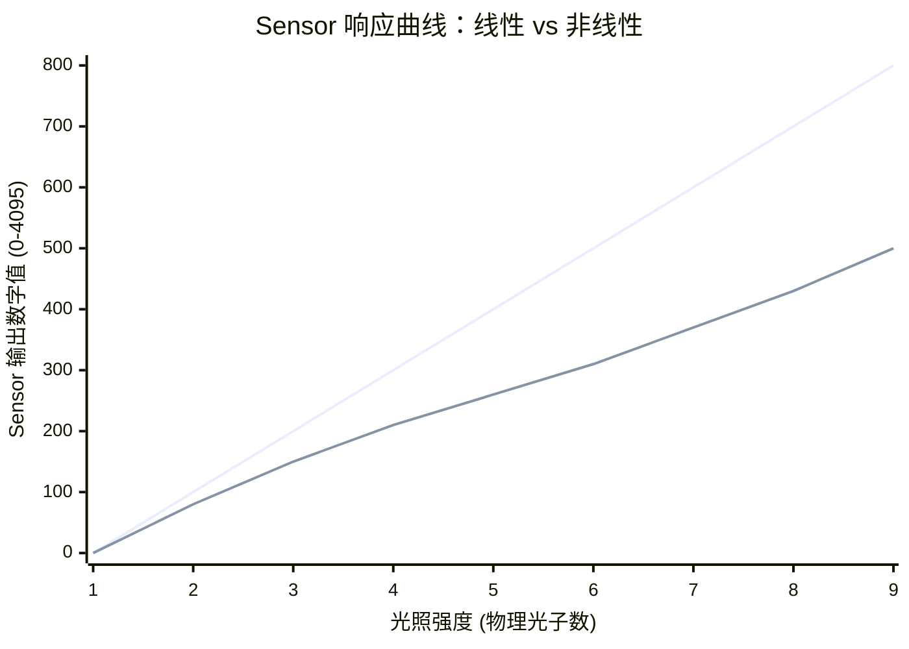
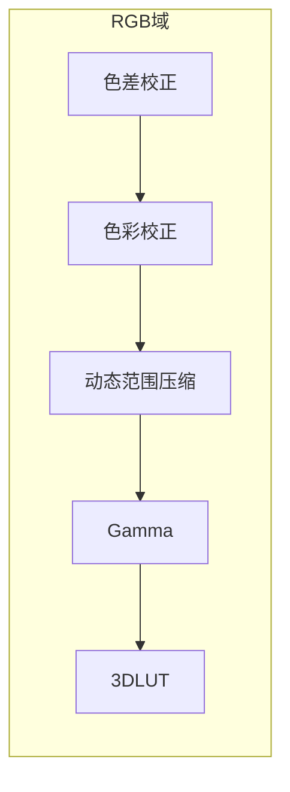
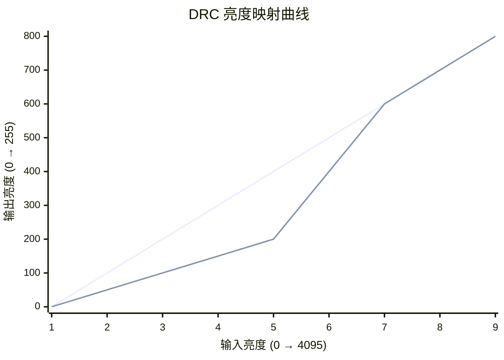
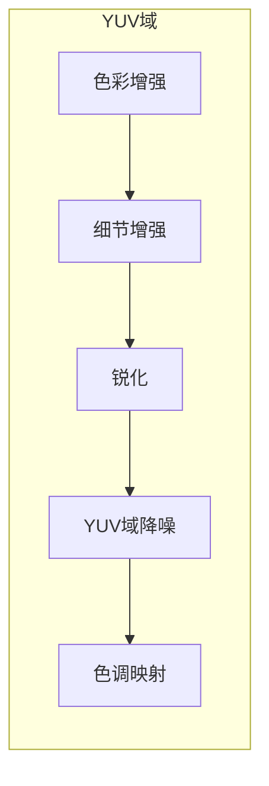
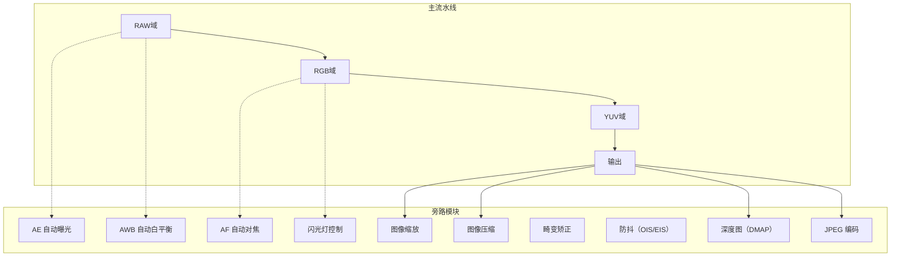

# ISP 系统简介：完整流水线解析

## 1. ISP 整体流程概览




## 2. 阶段一：RAW 域处理

RAW 域是 ISP 流水线的第一阶段，处理的是 Sensor 直接输出的 Bayer 格式数据（未经过任何颜色插值）。这个阶段的核心目标是 **“修复 Sensor 的物理缺陷，为后续色彩重建准备干净的数据”**。



### 2.1 黑电平与线性化（BLC）
> **术语解释**：**黑电平（Black Level）** 是 Sensor 在完全无光（全黑）条件下输出的像素值。理想情况下它应该是 0，但实际 Sensor 由于硬件特性，全黑输出是一个固定的正数（如 256 或 300）。**校正（Correction）** 就是把这个固定偏置减去，让黑色的起点归零。

黑电平前面的笔记已讲解过，这里不详细展开。

#### 1. 线性化是什么？

**一句话定义**：线性化就是把 Sensor 输出的“弯曲的亮度值”，掰回到“与光照强度成正比的直线”。

理想情况下，Sensor 是一个完美的物理测量仪器：**光照强度翻倍，输出的数字值也应该翻倍**。这叫做**线性响应**。
```
理想线性关系：
光强：1倍 → 输出：100
光强：2倍 → 输出：200（正好翻倍）
光强：3倍 → 输出：300（正好翻倍）
```

**但真实的 Sensor 不是这样的。** 尤其在**暗部区域**，Sensor 的输出会“偷懒”或“迟钝”——光照强度增加了 2 倍，但输出值可能只增加了 1.5 倍，导致暗部细节糊在一起。这就是**非线性响应**。

#### 2.  为什么 Sensor 是非线性的？
主要有两个原因：

**① Sensor 在暗区的“先天不足”**

在光线很暗的时候，光子数量极少，Sensor 产生的电信号非常微弱，几乎要被电路噪声淹没。为了让画面看起来不那么“一片死黑”，Sensor 内部会**人为压低暗部的响应**（把很暗的区域映射到更暗），这是一种硬件级的“去噪”策略。但代价是：**暗部的亮度变化不再与光照强度成正比**。

**② 为了“硬塞”更大的动态范围**

有些 Sensor 用非线性的方式（如对数响应）来压缩高亮信号，把 10 万级的光强度塞进 0-4095 的 12-bit 数字里。这样做的结果是：**亮部和暗部的“刻度”不一样粗**。

> **图例说明**：
> - **蓝色曲线（第一条，直线）**：理想线性响应（物理光照强度翻倍，输出数字值也翻倍）。
> - **红色曲线（第二条，弯曲的线）**：实际 Sensor 响应（暗部被压低，亮部逐渐追赶）。

**如果不做线性化，后续的所有算法都会出现严重误差。**

### 2.2 坏点矫正（DPC）
#### 1. 坏点是什么？

**一句话定义**：坏点（Defect Pixel）是 Sensor 像素阵列中**响应异常的个别像素**——它们该亮的时候不亮，该暗的时候不暗，或者完全“罢工”。
```
Sensor 像素阵列中的坏点分布：
┌─────────────────────────────────────────────────────────────┐
│  ●  ●  ○  ○  ○  ○  ○  ○  ○  ○  ○  ○  ○  ○  ○  ○  ○  ○ │
│  ○  ○  ○  ○  ○  ○  ○  ○  ○  ○  ○  ○  ○  ○  ○  ○  ○  ○ │
│  ○  ○  ○  ●  ○  ○  ○  ○  ○  ○  ○  ○  ○  ○  ○  ○  ○  ○ │
│  ○  ○  ○  ○  ○  ○  ○  ○  ○  ○  ○  ○  ○  ○  ○  ○  ○  ○ │
│  ○  ○  ○  ○  ○  ○  ○  ○  ○  ○  ○  ○  ○  ○  ○  ○  ○  ○ │
│  ○  ○  ○  ○  ○  ○  ○  ○  ○  ○  ○  ○  ○  ○  ○  ○  ○  ○ │
│  ○  ○  ○  ○  ○  ○  ○  ○  ○  ○  ○  ○  ○  ○  ○  ○  ○  ○ │
│  ○  ○  ○  ○  ○  ○  ○  ○  ○  ○  ○  ○  ○  ○  ○  ○  ○  ○ │
│  ○  ○  ○  ○  ○  ○  ○  ○  ○  ○  ○  ○  ○  ○  ○  ○  ○  ○ │
└─────────────────────────────────────────────────────────────┘
● = 坏点
```


> **术语解释**：**坏点矫正（Defect Pixel Correction，DPC）** 指检测并修复 Sensor 中永远偏亮或永远偏暗的异常像素（坏点）。**坏点位置通常由 Sensor 厂商在生产时标定，并存储在 OTP（一次性可编程存储器）中，驱动初始化时读取并配置到 ISP 寄存器中。常见算法是通过周围正常像素的中值或均值替换坏点。**

**坏点的两种类型**：

| 类型      | 现象         | 原因      |
| ------- | ---------- | ------- |
| **亮坏点** | 像素值异常高（死白） | 像素漏电流过大 |
| **暗坏点** | 像素值异常低（死黑） | 像素响应过低  |

#### 2 坏点替换（修复）算法
常用的三种替换策略：

| 算法         | 做法                    | 优点        | 缺点       |
| ---------- | --------------------- | --------- | -------- |
| **中值滤波**   | 取 3×3 窗口内所有像素的中值替换坏点  | 保留边缘（最常用） | 计算稍复杂    |
| **均值滤波**   | 取 3×3 窗口内正常像素的平均值替换坏点 | 平滑效果好     | 可能模糊细节   |
| **相邻像素复制** | 复制最近的正常像素值            | 最简单、最快    | 对斜向边缘效果差 |


### 2.3 镜头暗角校正（Lens Shading Correction，LSC）
> **术语解释**：**镜头暗角校正（Lens Shading Correction，LSC）** 指补偿镜头光学特性导致的图像边缘亮度下降和颜色偏差。由于镜头中心光线垂直入射，边缘光线斜射，导致边缘收到的光量减少（亮度下降），且不同波长的光在边缘的衰减程度不同（颜色偏差）。
#### 1. 为什么边缘会暗？（物理根源）
> **核心原因**：镜头边缘的光线是**斜着**打到 Sensor 上的，不是垂直的。

光线通过镜头汇聚到 Sensor 上：
```
┌─────────────────────────────────────────────────────────────────────────────┐
│                    光线入射角度差异                                          │
├─────────────────────────────────────────────────────────────────────────────┤
│                                                                             │
│                            镜头                                           │
│                          ┌─────┐                                          │
│                          │     │                                          │
│       垂直光（中心）       │     │     斜射光（边缘）                         │
│           ↓              │  ●  │             ↘                             │
│           ↓              │     │                ↘                          │
│           ↓              └─────┘                   ↘                       │
│           ↓          ████████████                  ████████████             │
│           ↓          ██ 中心区域 ██                ██ 边缘区域 ██           │
│           ↓          ████████████                  ████████████             │
│                                                                             │
│  中心：光线垂直入射                          边缘：光线斜射                  │
│  光能量集中在一个小区域                      光能量分散在更大的区域           │
│  亮度：100%（基准）                         亮度：约 60%-70%（衰减）        │
│                                                                             │
└─────────────────────────────────────────────────────────────────────────────┘
```
这就是**暗角（Vignetting）**的来源：物理规律决定了边缘收到的光就是比中心少。

#### 2. 为什么边缘还会偏色？（颜色偏差）

光线斜射到 Sensor 上时，还会穿过 Bayer 滤镜的“隔壁邻居”：
```
Bayer 滤镜截面示意：

中心（垂直光）：
    ↓
  ┌─────┐
  │  R  │  ← 光线垂直穿过，只激活 R 像素
  └─────┘

边缘（斜射光）：
       ↘
  ┌─────┬─────┐
  │  R  │  G  │  ← 斜射光既穿过了 R 滤镜，又漏了一部分到旁边的 G 像素
  └─────┴─────┘
```

**结果**：边缘区域不仅亮度下降，还出现了**颜色串扰**——红色像素混入了不该有的绿色，导致边缘图像偏紫或偏绿。不同波长的光（R/G/B）偏折程度不同，所以红、绿、蓝通道在边缘的衰减程度也不同。因此校正也要分通道进行：R、G、B 各有各的增益网格（Mesh Table），分别补偿各自的衰减量。

#### 3. LSC 的校正方式

LSC 用一个**二维增益网格表**来逐像素补偿。网格的每个节点存储一个增益值，不在节点上的像素通过双线性插值获得增益。

```
增益网格（示意 5×5 网格）：

         中心区域               边缘区域
     ┌──────────────────────────────────────────────┐
     │  1.80  1.70  1.55  1.70  1.80   │  ← 边缘（增益大）│
     │  1.70  1.40  1.20  1.40  1.70   │            │
     │  1.55  1.20  1.00  1.20  1.55   │  ← 中心（增益=1.0）│
     │  1.70  1.40  1.20  1.40  1.70   │            │
     │  1.80  1.70  1.55  1.70  1.80   │  ← 边缘（增益大）│
     └──────────────────────────────────────────────┘
```

#### 4. RGB 单独校正
由于三种颜色在边缘衰减程度不同，LSC 的增益网格实际上是**三个独立的表**：

| 通道    | 中心增益 | 边缘增益（左上角） | 原因             |
| ----- | ---- | --------- | -------------- |
| **R** | 1.0  | 1.80      | 红光波长长，偏折小，衰减较轻 |
| **G** | 1.0  | 1.70      | 绿光居中           |
| **B** | 1.0  | 1.90      | 蓝光波长短，偏折大，衰减较重 |
> **关键**：三个通道的增益网格不同。如果错用同一个网格，颜色偏差就无法校正。

### 2.4 白平衡增益（White Balance Gain）

**白平衡增益**就是给 R、G、B 三个通道分别乘以一个系数，用来把“偏色的图像”拉回“中性色”。
```
R_out = R_in × r_gain
G_out = G_in × g_gain
B_out = B_in × b_gain
```

> **注意**：白平衡增益是 **AWB 算法的输出结果**。AWB 负责分析场景色温，计算出 r_gain、g_gain、b_gain 三个值，然后在 RAW 域执行乘法。这和绿平衡校正（2.5 节）的区别在于：白平衡增益是全局性的（整张图用同一个增益），绿平衡校正是局部性的（按像素位置补偿 Gr/Gb 差异）。

### 2.5 绿平衡校正（Green Balance Correction，GBC）

> **术语解释**：**绿平衡校正（Green Balance Correction）** 指补偿 Bayer 阵列中 Gr（绿-红行）和 Gb（绿-蓝行）两个绿色通道之间的响应差异。理想情况下，Gr 和 Gb 的响应应该相同，但实际由于 Sensor 工艺差异，两者可能不一致，导致图像出现“网状纹”或“棋盘格”伪影。

#### 1. 为什么Gr与Gb会不一致
Bayer 阵列中，有两个绿色通道：
```text
行号：     列0  列1  列2  列3  列4  列5
─────────────────────────────────────────
第1行：    R    G    R    G    R    G     ← 这一行全是 R 和 G 交替
第2行：    G    B    G    B    G    B     ← 这一行全是 G 和 B 交替
第3行：    R    G    R    G    R    G     ← 同第1行
第4行：    G    B    G    B    G    B     ← 同第2行
```
> **所以**：
> - **Gr（Green-red）** = **位于“R 行”（奇数行）的 G 像素**。因为这一行的另一个颜色是 R（比如 `R G R G`），所以叫“红行旁边的绿”。
> - **Gb（Green-blue）** = **位于“B 行”（偶数行）的 G 像素**。因为这一行的另一个颜色是 B（比如 `G B G B`），所以叫“蓝行旁边的绿”。

> **为什么 Gr 和 Gb 会有差异？**
> 因为 Sensor 的**行读出电路**在奇数行和偶数行之间存在微小差异（比如放大倍数不同），导致：
> - 第 1 行读出的 G 值（Gr）可能整体偏大。
> - 第 2 行读出的 G 值（Gb）可能整体偏小。

#### 2  差异会导致什么视觉问题？
如果 Gr ≠ Gb，均匀灰色区域会出现 **“棋盘格”状或“网状”伪影**：
```
均匀灰色表面（应该完全一致）：

如果有 Gr > Gb（+10%）：
┌───┬───┬───┬───┐
│ R │ G │ R │ G │    ← G 像素偏亮（Gr 更大）
│ G │ B │ G │ B │    ← G 像素偏暗（Gb 更小）
│ R │ G │ R │ G │    ← G 像素偏亮
│ G │ B │ G │ B │    ← G 像素偏暗
└───┴───┴───┴───┘
       ↑ 亮点  ↑ 暗点  → 形成棋盘格纹理（画面看起来有网纹）
```
这种差异在**平滑区域（如天空、墙壁）**最容易被察觉，会产生不必要的纹理感。
当画面是均匀的天空时，Gr 和 Gb 不一致就会让图像看起来像铺了一层细密的“网格布”（因为奇数行亮、偶数行暗）。

#### 3 校正方式
**做法**：计算整张图或局部区域的 Gr 平均值和 Gb 平均值，然后调整增益。
```
Gr_avg = 200
Gb_avg = 190

校正目标：使 Gr_avg = Gb_avg = 195

Gr_gain = (Gr_avg + Gb_avg) / (2 × Gr_avg) = 390 / 400 = 0.975
Gb_gain = (Gr_avg + Gb_avg) / (2 × Gb_avg) = 390 / 380 = 1.026
```

应用增益后：
```
Gr_out = 200 × 0.975 = 195
Gb_out = 190 × 1.026 = 195
Gr_avg = Gb_avg = 195 → 平衡
```

## 3. 阶段二：RGB 域处理

经过 Demosaic 后，数据从 Bayer 格式变成 RGB 三通道彩色图。RGB 域处理的核心目标是 **“把颜色校正到人眼看起来自然的标准色彩空间”**。



### 3.1 色差校正（Chromatic Aberration Correction，CA）

#### 1. 色差的物理根源

**一句话**：不同颜色的光波长不同，在玻璃镜头里的“刹车距离”不一样。

所有颜色的光在真空中速度都一样，但进入玻璃镜头后，速度会降低。**波长越短（蓝光），在玻璃里跑得越慢，被“掰弯”得越多；波长越长（红光），在玻璃里跑得越快，被“掰弯”得越少。**

```text
       离中心近 ←───────────→ 离中心远
			  ┌─────────────┐
			  │    Sensor    │
			  │  🟢  🔵     │  ← 绿光在中心侧，蓝光在边缘侧
			  │  🔴  🟣     │  靠近中心的一侧偏红，远离中心的一侧偏蓝
			  └─────────────┘
```

> **色差的本质**：**不同颜色的光在镜头中折射角度不同，导致它们在 Sensor 上的落点位置不同。**

#### 2. 色差在图片上长什么样？

在图像边缘，色差表现为**一到两个像素宽的彩色条纹**。

```text
色差示意（边缘放大）：

正常图像边缘：              有色差的图像边缘：
┌─────────────────┐         ┌─────────────────┐
│                 │         │                 │
│  ██████████████ │         │  🔵🔵███████████ │  ← 靠近中心的一侧偏蓝
│  ██████████████ │  →      │  ██████████████ │
│  ██████████████ │         │  ██████████████ │
│                 │         │  🔴🔴███████████ │  ← 远离中心的一侧偏红
└─────────────────┘         └─────────────────┘
    纯黑到白的边缘             靠近中心偏蓝，远离中心偏红
```

**为什么红和蓝会出现在两侧？**

镜头就像一个三棱镜：红光偏折最小（落在离中心最近的地方），蓝光偏折最大（落在离中心最远的地方）。所以在边缘：
- **靠近图像中心的一侧**：红光比蓝光先到达 → 出现红色条纹
- **远离图像中心的一侧**：蓝光比红光先到达 → 出现蓝色条纹

#### 4. 校正方式

色差校正的核心思路是**让 R、G、B 三个通道在空间上重新对齐**。

**校正公式（横向色差）**：

```text
校正过程：
1. 检测：识别边缘处的颜色偏移方向和幅度
2. 缩放/位移：
   蓝光通道 → 缩小 0.5%（推向中心）
   红光通道 → 放大 0.5%（拉向边缘）
   绿光通道 → 不动（作为基准）
```

**具体数字演示**：

```text
假设边缘有一个像素，理想位置是 x=100：

红光落点：x=99.5（偏左）
绿光落点：x=100（基准）
蓝光落点：x=100.5（偏右）

校正后：
红光：100 × (1 + 0.005) = 100.5 → 再位移回 100
蓝光：100.5 × (1 - 0.005) = 100.0 → 拉到 100

三个通道重新对齐，彩色条纹消失
```

#### 5. 校正方式（ISP 实现）

在 ISP 中，色差校正通常由**查找表（LUT）** 或**预标定的系数矩阵**实现。与镜头暗角校正类似，色差校正的系数也需要针对镜头模组标定，标定数据会烧录到每个模组的 OTP 中，ISP 上电时自动加载。

**色差校正没有标准公式**——不同镜头的色差特征不同，标定数据就是每个模组的“指纹”。标定方法通常是拍摄特定图卡，测量边缘的色差偏移量，再在 ISP 中配置查表参数。
>  **LUT**：Look-Up Table，查找表
>  在 ISP 中，很多校正算法（如 Gamma、LSC、色差校正）本质上是对每个像素做数学运算。如果每个像素都实时计算（比如开方、三角函数），会非常消耗硬件资源且难以达到实时（30fps/60fps）。
>  提前把“输入值”对应的“输出值”全部算好，存成一个数组。处理像素时，直接用像素值作为索引去查表，瞬间得到输出值，无需计算。

>  **OTP**（One-Time Programmable，一次性可编程存储器）
>  **一句话定义**：OTP 是一种**只能写入一次、永久保存**的存储单元。
>  在摄像头模组中，OTP 用于存储每个模组的**“指纹信息”**：比如**LSC 标定数据**（镜头暗角网格）、**坏点坐标列表**、**AWB 参考值**（白平衡基准）等。

> **为什么用 OTP 而不是普通 Flash？**
> 因为模组出厂标定后，这些数据就**固定不变**了。OTP 比 Flash 便宜，且不易被误擦除。在生产线上，设备会拍摄测试图卡，计算出上述参数，然后**“烧录（Burn）”**到 OTP 中。


### 3.2 动态范围压缩（Dynamic Range Compression，DRC / WDR）

#### 1. 基础概念
> **术语解释**：**动态范围压缩（Dynamic Range Compression，DRC / WDR）** 指将 Sensor 捕获的高动态范围（HDR）场景映射到显示设备能展示的低动态范围（SDR）。HDR 场景中同时存在极亮（如阳光）和极暗（如阴影）区域，人眼可同时看到，但常规显示设备无法同时呈现。DRC 将亮度范围重新映射，让暗部变亮、亮部不丢失细节。

|缩写|全称|含义|在流程中的位置|
|---|---|---|---|
|**HDR**|High Dynamic Range|场景本身的亮度范围很宽（同时有极亮和极暗的区域）|Sensor 捕获的数据特征|
|**WDR**|Wide Dynamic Range|一种**硬件能力**，指 Sensor 或 ISP 能处理宽亮度范围的能力|Sensor 规格 / ISP 能力|
|**DRC**|Dynamic Range Compression|一种**处理算法**，把宽亮度范围压缩到显示设备能展示的窄范围|ISP 处理流程中的一步|

**它们的关系**：
```
场景是 HDR（高动态范围）
     ↓
Sensor 支持 WDR（能捕获 HDR 场景）
     ↓
ISP 执行 DRC（压缩到 SDR 范围）
     ↓
显示设备输出 SDR（人眼能看到亮暗细节）
```

#### 2. 为什么要做 DRC？
Sensor 能捕获的亮度范围（比如 12-bit，0-4095）远大于显示设备的亮度范围（8-bit，0-255）。直接把 0-4095 映射到 0-255（线性缩放），暗部细节会被压缩到极少的灰度级里，肉眼无法区分。

**DRC 的目标**：把 4096 个亮度级别，重新分配到 256 个级别中，**优先保证人眼敏感的区域（暗部和中间调）有更多的灰度级**，亮部适当压缩。


```
xychart-beta
    title "DRC 亮度映射曲线"
    x-axis "输入亮度 (0 → 4095)"
    y-axis "输出亮度 (0 → 255)"
    line [0, 100, 200, 300, 400, 500, 600, 700, 800] "理想线性映射（基准）"
    line [0, 50, 100, 150, 200, 400, 600, 700, 800] "实际 DRC 映射"
```

#### 3. DRC曲线


> 上图蓝色线（第一条）为理想线性映射（把 0-4095 线性缩放到 0-255），橙色线（第二条）为实际 DRC 映射（暗部展开、亮部压缩）。暗部细节被展开，亮部被压缩但不过曝。

#### 4. 常见 DRC 算法
| 算法              | 原理                 | 特点               |
| --------------- | ------------------ | ---------------- |
| **全局直方图均衡（HE）** | 统计全图亮度分布，让输出亮度均匀分布 | 简单，但可能产生不自然的对比度  |
| **局部色调映射（LTM）** | 每个像素根据局部区域亮度独立映射   | 效果好，细节保留多，但算力要求高 |
| **Reinhard**    | 基于对数压缩，模拟人眼适应      | 经典算法，参数少         |
| **Filmic**      | S 型曲线，类似电影胶片响应     | 视觉上最自然           |

#### 5. DRC 与 Gamma 的区别

> **容易混淆的点**：DRC 和 Gamma 都是亮度映射曲线，但目的不同。

- **DRC**：把宽亮度范围压缩到**显示设备能展示的范围**（自适应变换，根据不同场景动态调整）
- **Gamma**：把物理亮度映射到**人眼感知**（固定变换，所有场景都用同一个公式）

> Gamma 是“人眼校正”，固定不变；DRC 是“动态压缩”，随场景变化。它们都可以用一条曲线来描述亮度映射，但 Gamma 是常量，DRC 是变量。


**具体对比**：

| | Gamma | DRC |
|---|---|---|
| **目的** | 让物理亮度的变化符合人眼感受 | 让 HDR 场景的亮暗细节都能在屏幕上看到 |
| **曲线是否固定** | ✅ 固定（永远是 `y = x^0.45`，或者反过来） | ❌ 自适应（根据画面统计结果动态变化） |
| **处理对象** | 所有场景都一样处理 | 针对 HDR 场景（有极亮和极暗）才会动 |
| **在流程中的位置** | 通常固定，是所有 ISP 都会做的最后一步 | 通常只在 Sensor 支持 WDR 时才会出现 |

### 3.3 3D LUT（三维查找表）

> **术语解释**：**3D LUT（三维查找表）** 是一个三维数组，用于实现复杂的颜色变换。与 1D LUT（仅对单个通道做变换）和 2D LUT（两个通道组合）不同，3D LUT 能将输入 RGB 三元组映射到另一个 RGB 三元组，实现人眼感知的颜色风格化（如电影感、鲜艳模式等）。在 ISP 中，它通常作为色彩校正（CCM）之后的最后一道颜色调整工序。

**3D LUT 的工作原理**：

```text
输入 RGB (R, G, B) → 3D LUT 查表 → 输出 RGB (R', G', B')

3D LUT 是一个三维网格（如 17×17×17 = 4913 个节点）
对于不在网格节点上的颜色，使用三线性插值
```

**用途**：
- 色彩风格化（电影色调、复古风格）
- 模拟不同胶片效果
- 用户自定义色彩模式（艳丽/自然/柔和）

## 4. 阶段三：YUV 域处理

经过 RGB 域处理后，数据被转换成 YUV 色彩空间。YUV 域处理的核心目标是 **“针对人眼感知特性，优化亮度、色彩、清晰度和动态范围”**。

> **RGB** 是“物理显示”的颜色空间（显示器怎么发光），**YUV** 是“人眼感知”的颜色空间（人眼怎么看）。
### 具体区别

|              | RGB                  | YUV                    |
| ------------ | -------------------- | ---------------------- |
| **通道含义**     | R（红）、G（绿）、B（蓝）三个独立通道 | Y（亮度）、U（蓝色色度）、V（红色色度）  |
| **存储方式**     | 三个通道都要存，缺一不可         | 亮度存全分辨率，色度可以减半（人眼看不出来） |
| **人眼敏感度**    | 三个通道同样重要             | 对Y最敏感，对U/V不敏感          |
| **在ISP中的位置** | 去马赛克之后、YUV转换之前       | Gamma之后、最终输出之前         |
| **核心优势**     | 直观，适合显示设备            | 节省带宽，适合压缩和传输           |


### 4.1 色彩增强（Color Enhancement）

> **术语解释**：**色彩增强（Color Enhancement）** 指调整图像的颜色饱和度、色相和对比度，使颜色更鲜艳、更讨喜。它不是校正颜色（那是 CCM 的任务），而是让颜色“更好看”。

**常用操作**：
- 饱和度（Saturation）调节：让颜色更鲜艳或更素雅
- 色相（Hue）偏移：调整颜色的倾向（如让红色偏橙）
- 对比度（Contrast）调节：增强亮部和暗部的差异

### 4.2 细节增强（Detail Enhancement）

> **术语解释**：**细节增强（Detail Enhancement）** 指通过提取图像的高频分量（边缘、纹理）并叠加回原图，让图像看起来更清晰、更有质感。与锐化不同，细节增强通常使用更复杂的算法（如引导滤波、双边滤波），区分“细节”和“噪声”。

**原理**：

```text
原图 = 基础层（低频）+ 细节层（高频）
细节增强 = 原图 + 细节层 × 增强系数
```

### 4.3 锐化（Sharpening）

> **术语解释**：**锐化（Sharpening）** 指增强图像边缘的对比度，使边缘更锐利。常见算法是反锐化掩模（Unsharp Mask，USM）——从原图中减去模糊后的图像得到边缘，再叠加回原图。

```text
USM 原理：
模糊图 = 高斯模糊(原图)
边缘 = 原图 - 模糊图
锐化图 = 原图 + 边缘 × 强度
```

> **风险**：过度锐化会产生“光晕”伪影（边缘出现白边）。

### 4.4 YUV 域降噪（YNR / CNR）

> **术语解释**：**YUV 域降噪** 指在 YUV 色彩空间中分别对亮度和色度通道做降噪。Y 通道（亮度）保留更多细节，降噪力度较轻；UV 通道（色度）人眼不敏感，可以做强降噪。

| 通道 | 降噪策略 | 原因 |
|------|---------|------|
| **Y（亮度）** | 轻降噪，保留边缘细节 | 人眼对亮度最敏感 |
| **U/V（色度）** | 强降噪，可大幅平滑 | 人眼对色度不敏感 |

### 4.5 色调映射（Tone Mapping）

> **术语解释**：**色调映射（Tone Mapping）** 指将高动态范围（HDR）图像的亮度范围映射到低动态范围（LDR）显示设备上，同时保持场景的视觉对比度和细节。与 DRC 类似，但 DRC 更侧重于压缩，色调映射更侧重于“保持视觉感知”。

**常见色调映射算子**：
- Reinhard（基于对数）
- Drago（基于人眼模型）
- Filmic（电影感曲线）


## 5. 主 Pipeline 以外的处理

除了主流水线（RAW → RGB → YUV），ISP 还有一些**并行或旁路模块**，用于处理特定功能。



### 5.1 图像缩放（Scaler）

> 将图像缩放到目标分辨率，使用双线性、双三次或更高质量的缩放算法。

### 5.2 图像压缩（JPEG）

> 将 YUV 图像编码为 JPEG 格式，用于存储或传输。

### 5.3 畸变矫正（Distortion Correction）

> **术语解释**：**畸变矫正（Distortion Correction）** 指补偿镜头引入的几何畸变（桶形畸变、枕形畸变），使画面中的直线恢复为直线。通常在 YUV 域执行，使用预标定的畸变模型和网格表进行校正。

### 5.4 防抖（OIS / EIS）

> **OIS（光学防抖）**：通过镜头或 Sensor 的物理移动补偿相机抖动。**EIS（电子防抖）**：通过裁剪和图像配准补偿抖动，在 ISP 或后处理中实现。

### 5.5 深度图（DMAP）

> 用于双摄或多摄系统的深度估计，生成每个像素的深度信息。

### 5.6 JPEG 编码

> 将 YUV 图像压缩为 JPEG 文件格式。


## 6. 两条特殊处理链路

### 6.1 噪声处理流程


> 噪声在 ISP 的多个阶段被逐步处理：**坏点矫正**（修复异常像素）→ **RAW 域降噪**（去除基础噪声）→ **细节增强/锐化**（恢复纹理，但可能放大噪声）→ **YUV 域降噪**（最终抑制色度噪声）。这是一个“去噪 → 增强 → 再降噪”的平衡过程。

### 6.2 色彩重建流程


> 色彩重建从 RAW 域开始，经过黑电平校正（恢复正确的线性信号）、Gamma 校正（进入感知空间）、3D LUT（风格化调色）、色彩增强（饱和度/对比度微调）和色调映射（适配显示设备），最终形成人眼看到的色彩。这些都是颜色从 Sensor 原始信号到人眼感知的转换过程。


## 7. 一句话总结

> **ISP 完整流水线分为 RAW 域（修复 Sensor 缺陷）→ RGB 域（色彩重建）→ YUV 域（感知优化）三个阶段，主流水线之外还有 3A 控制、缩放、压缩、畸变矫正、防抖、深度图等旁路/后处理模块。噪声和色彩各有一条贯穿多阶段的独立处理链路。**