# 1. 噪声是什么

## 1.1 从一个像素开始理解

假设某个像素真实应该是：
$$
x=400
$$
但传感器实际读到的是：
$$
y=408
$$
那么噪声就是：
$$
n=y-x=408-400=8
$$
所以带噪图像可以写成：
$$
y=x+n
$$
其中：

|符号|含义|
|---|---|
|x|干净信号，也就是真实像素值|
|y|带噪信号，也就是传感器实际读到的像素值|
|n|噪声，也就是实际值相对真实值的偏差|

图像降噪的目标就是：  
从带噪图像 y 中恢复出尽量接近 x 的图像。

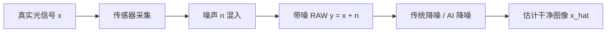

---

## 1.2 噪声在图像里长什么样

一个理想的平坦区域应该像这样：

```text
干净区域：像素值几乎一致

100 100 100 100 100
100 100 100 100 100
100 100 100 100 100
100 100 100 100 100
100 100 100 100 100
```

加入噪声后会变成：

```text
带噪区域：像素值围绕 100 上下抖动

 97 102 100  98 104
101  99 103  96 100
 98 105 101  99  97
103 100  95 102 101
 99  98 104 100  96
```

视觉上就是：  
原本均匀的区域出现颗粒、脏点、闪烁、彩色斑点或条纹。

---

# 2. 噪声的来源

噪声主要来自图像生成链路中的三个阶段：

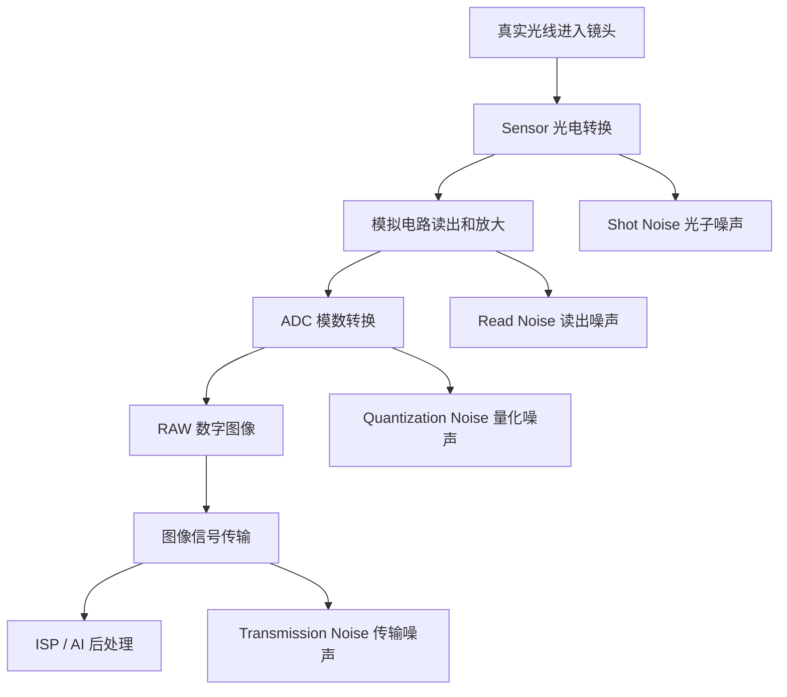

## 2.1 光电转换产生噪声

**光电转换**：传感器把光子转换成电子的过程。  
这个过程不是完全稳定的，同样亮度下，每次到达像素的光子数量会有随机波动。

这类噪声叫 **Shot Noise**。

### 术语：Shot Noise

**Shot Noise，光子散粒噪声**：由光子到达数量的随机性造成。  
它在 RAW 流程中出现得很早，属于传感器采集阶段的噪声。  
它的特点是：信号越强，噪声的绝对值通常也越大。

---

## 2.2 电路读出产生噪声

传感器把电子信号读出来时，模拟电路会引入额外扰动。

这类噪声叫 **Read Noise**。

### 术语：Read Noise

**Read Noise，读出噪声**：传感器电路读取像素值时产生的噪声。  
它通常和信号强度关系较弱，可以近似看成一个噪声底。

---

## 2.3 模数转换产生噪声

**ADC，Analog-to-Digital Converter，模数转换器**：把连续的模拟电信号转换成离散的数字像素值。

例如 10-bit RAW 的取值范围是：

$$
0\sim1023
$$

如果模拟值不能被数字值精确表示，就会产生量化误差。

### 术语：Quantization Noise

**Quantization Noise，量化噪声**：连续模拟信号转换成离散数字值时产生的误差。  
它不是来自光学本身，而是来自数字表示精度有限。

---

# 3. 噪声可以如何衡量

从统计学角度看，噪声可以用 **标准差** 衡量。

## 3.1 标准差是什么

**标准差**：一组数围绕均值波动的程度。  
在图像噪声里，标准差越大，说明像素值抖动越强，噪声越明显。

假设一块平坦区域的像素值是：

```text
98 100 101 99 102
```

均值为：

$$
\mu=\frac{98+100+101+99+102}{5}=100
$$

每个像素相对均值的偏差是：

```text
-2 0 1 -1 2
```

偏差平方是：

```text
4 0 1 1 4
```

方差为：

$$
\sigma^2=\frac{4+0+1+1+4}{5}=2
$$

标准差为：

$$
\sigma=\sqrt{2}\approx1.41
$$

这说明这块区域的像素值大约围绕 100 上下波动 1 到 2 个灰阶。

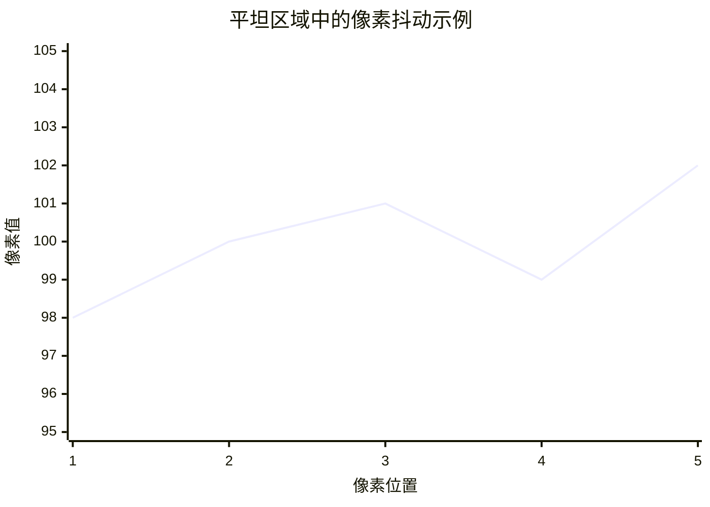

---

# 4. ISO 对噪声的影响

## 4.1 ISO 是什么

**ISO**：成像系统中的增益配置，用于放大传感器信号。  
ISO 越高，图像越容易变亮，但噪声也会一起被放大。

| ISO      | 现象           |
| -------- | ------------ |
| ISO 80   | 噪声较弱，暗部较干净   |
| ISO 800  | 噪声明显增加       |
| ISO 1600 | 暗部噪声和彩色噪声更明显 |

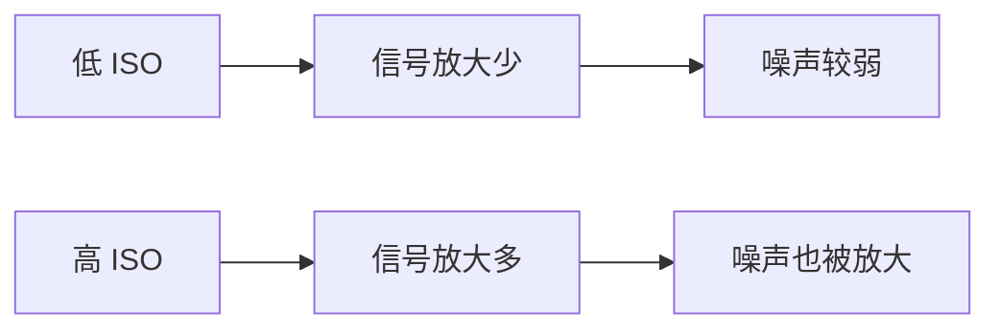

## 4.2 RAW 域常见噪声模型

RAW 域里，噪声方差常用下面的形式表示：

$$
\sigma^2(x)=kx+b
$$

其中：

|符号|含义|
|---|---|
|x|当前 RAW 像素信号值|
|sigma 平方|当前亮度下的噪声方差|
|k|信号相关噪声系数，主要对应 Shot Noise|
|b|信号无关噪声底，主要对应 Read Noise|

噪声标准差为：

$$
\sigma(x)=\sqrt{kx+b}
$$

---

## 4.3 数字演示

假设：

$$
k=0.02
$$

$$
b=4
$$

当 RAW 信号为 100 时：

$$
\sigma^2(100)=0.02\times100+4=6
$$

$$
\sigma(100)=\sqrt{6}\approx2.45
$$

当 RAW 信号为 1000 时：

$$
\sigma^2(1000)=0.02\times1000+4=24
$$

$$
\sigma(1000)=\sqrt{24}\approx4.90
$$

结论：
- 亮部噪声的绝对标准差更大。
- 但亮部信号本身也更大，所以视觉上通常暗部更脏。
- 暗部因为信号弱，噪声占比更高。

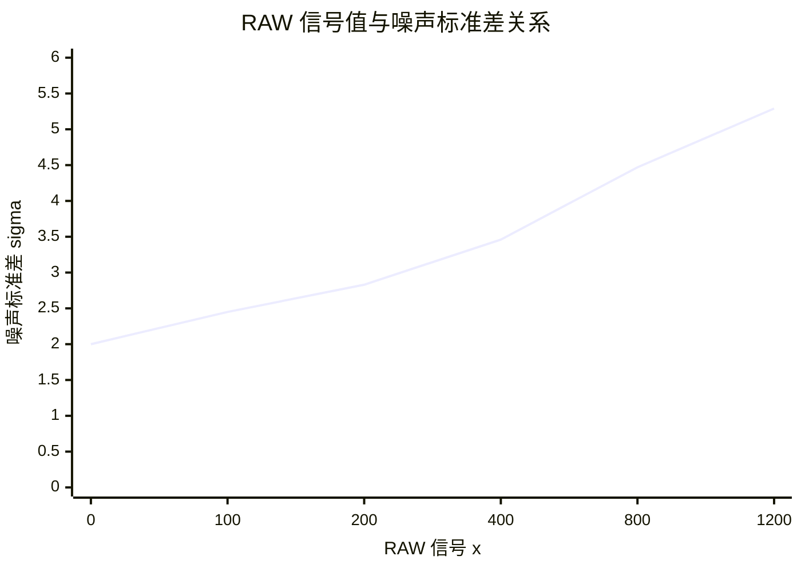

---

# 5. 噪声的分类

噪声可以从多个角度分类。

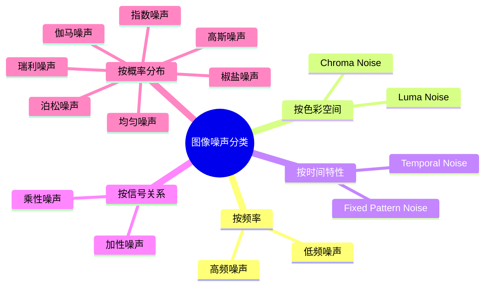

---

## 5.1 按频率分类

### 术语：频率

**频率**：描述图像像素变化快慢的概念。  
变化越快，频率越高；变化越慢，频率越低。

|类型|定义|图像表现|
|---|---|---|
|高频噪声|相邻像素之间快速变化|细碎颗粒、随机点|
|低频噪声|大范围缓慢变化|阴影、条带、渐变脏污|

### 图示：高频噪声

```text
高频噪声：像素快速跳变，像细碎颗粒

. # . # . # . #
# . # . # . # .
. # . # . # . #
# . # . # . # .
```

### 图示：低频噪声

```text
低频噪声：大范围缓慢变化，像脏块或渐变

111111222222333333
111112222223333333
111122222233333333
111222222333333333
```

---

## 5.2 按色彩空间分类

### 术语：Luma Noise

**Luma Noise，亮度噪声**：影响明暗的噪声。  
在 YUV 空间中，通常主要体现在 Y 通道。

### 术语：Chroma Noise

**Chroma Noise，色度噪声**：影响颜色的噪声。  
在 YUV 空间中，通常主要体现在 U/V 通道。

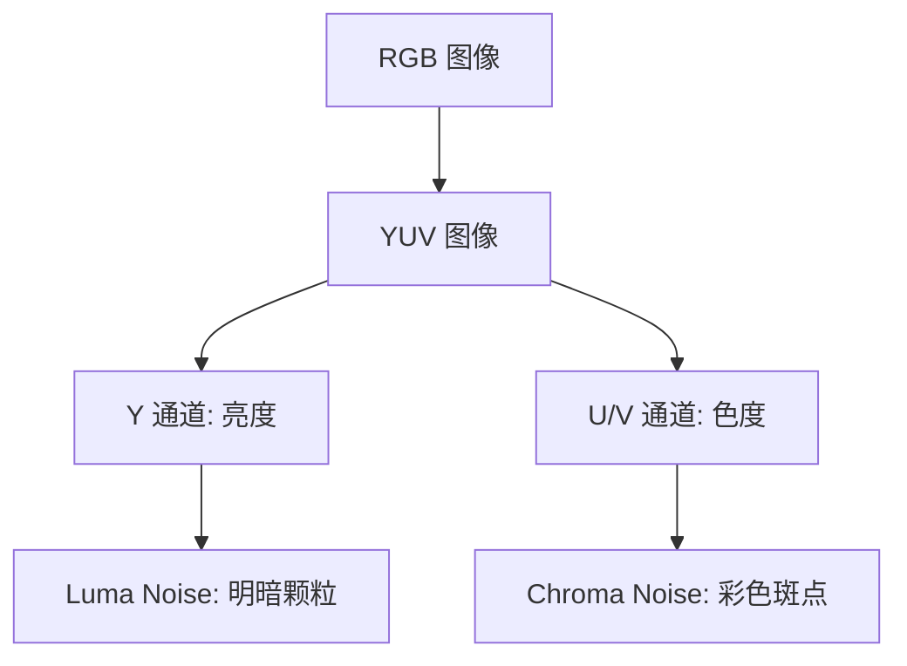

### 图示：亮度噪声

```text
亮度噪声：颜色不明显变化，主要是明暗颗粒

灰 灰 深 灰 亮
灰 深 灰 亮 灰
亮 灰 灰 深 灰
灰 亮 深 灰 灰
```

### 图示：色度噪声

```text
色度噪声：亮度变化不大，但出现红绿蓝彩色斑点

灰 灰 红 灰 绿
灰 蓝 灰 灰 红
绿 灰 灰 蓝 灰
灰 红 绿 灰 灰
```

---

## 5.3 按时间特性分类

### 术语：Fixed Pattern Noise

**Fixed Pattern Noise，固定模式噪声，FPN**：每一帧都出现在固定位置的噪声。  
它通常来自传感器像素差异、列读出差异或电路固定偏差。

### 术语：Temporal Noise

**Temporal Noise，时间噪声**：随时间随机变化的噪声。  
在视频或多帧 RAW 中，它表现为帧间闪烁。

### 图示：固定模式噪声

```text
Frame 1:
100 100 130 100 100
100 100 130 100 100
100 100 130 100 100

Frame 2:
101  99 131 100 100
100 101 129  99 101
100 100 130 100  99

Frame 3:
 99 100 130 101 100
100  99 131 100 100
101 100 129 100 100
```

中间那一列一直偏亮，所以它是固定模式噪声。

### 图示：时间噪声

```text
Frame 1:
100 102  98 101  99

Frame 2:
 97 100 103  98 102

Frame 3:
101  96 100 104  99
```

每一帧的噪声位置都在变化，所以它是时间噪声。

---

## 5.4 按噪声和信号关系分类

### 术语：加性噪声

**加性噪声**：噪声直接加到信号上。  
形式是：

$$
y=x+n
$$

数字例子：

$$
x=400
$$

$$
n=8
$$

$$
y=400+8=408
$$

### 术语：乘性噪声

**乘性噪声**：噪声以比例形式影响信号。  
形式是：

$$
y=x\cdot n
$$

数字例子：

$$
x=400
$$

$$
n=1.05
$$

$$
y=400\times1.05=420
$$

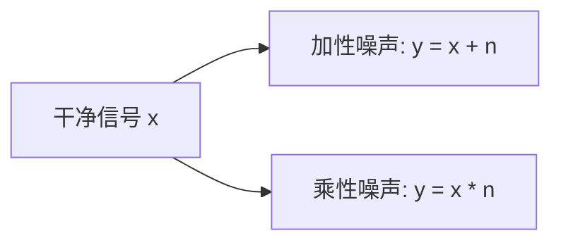

---

## 5.5 按概率密度函数分类

### 术语：概率密度函数

**概率密度函数，PDF**：描述随机变量取不同数值的概率分布形状。  
在噪声建模中，它描述噪声更容易出现在哪些数值附近。

|噪声类型|分布特点|常见理解|
|---|---|---|
|高斯噪声|围绕均值对称分布|读出噪声常用近似|
|泊松噪声|方差随均值变化|光子噪声常用近似|
|脉冲噪声 / 椒盐噪声|像素突然变成极大或极小值|坏点、传输错误|
|瑞利噪声|非负偏态分布|特定成像系统建模|
|伽马噪声|非负偏态分布|累积随机过程建模|
|指数分布噪声|非负、右侧长尾|特定随机过程建模|
|均匀分布噪声|每个范围概率相近|量化误差可近似|

### 图示：高斯噪声

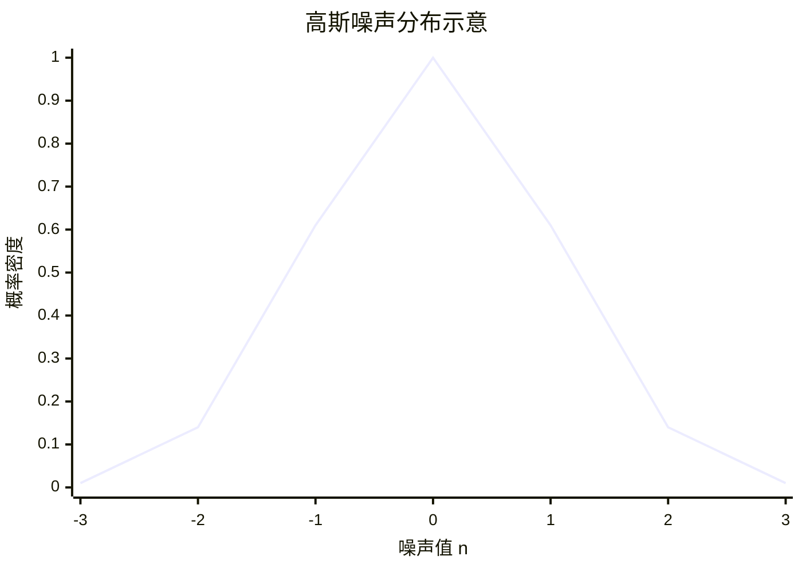

### 图示：泊松噪声

```text
泊松噪声：信号越强，噪声绝对波动越大

暗部:
50 49 52 48 51

亮部:
800 790 812 805 795
```

---

# 6. RAW Domain 噪声特性

## 6.1 RAW Domain 是什么

**RAW Domain，RAW 域**：传感器刚输出、还没有经过完整 ISP 处理的图像数据空间。  
RAW 域图像通常还是 Bayer 排列，一个像素只记录一种颜色。

### 术语：Bayer RAW

**Bayer RAW**：传感器上 R/G/B 像素按固定模式排列的数据。  
以 BGGR 为例：

```text
B G B G B G
G R G R G R
B G B G B G
G R G R G R
```

---

## 6.2 RAW 域噪声为什么相对好处理

RAW 域噪声有几个特点：
1. 还没有经过 Demosaic 插值。
2. 还没有经过 CCM 矩阵混色。
3. 还没有经过 Gamma 非线性拉伸。
4. 噪声可以较好地用高斯-泊松模型描述。
5. 可以根据不同亮度位置计算不同噪声强度。

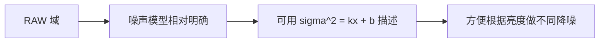

RAW 域常见噪声模型：
$$
y=x+n
$$
$$
n\sim\mathcal{N}(0,kx+b)
$$
$$
\sigma^2(x)=kx+b
$$
### 术语：高斯-泊松噪声

**高斯-泊松噪声**：RAW 域常用的复合噪声模型。  
其中泊松部分描述光子随机性，高斯部分描述读出电路扰动。

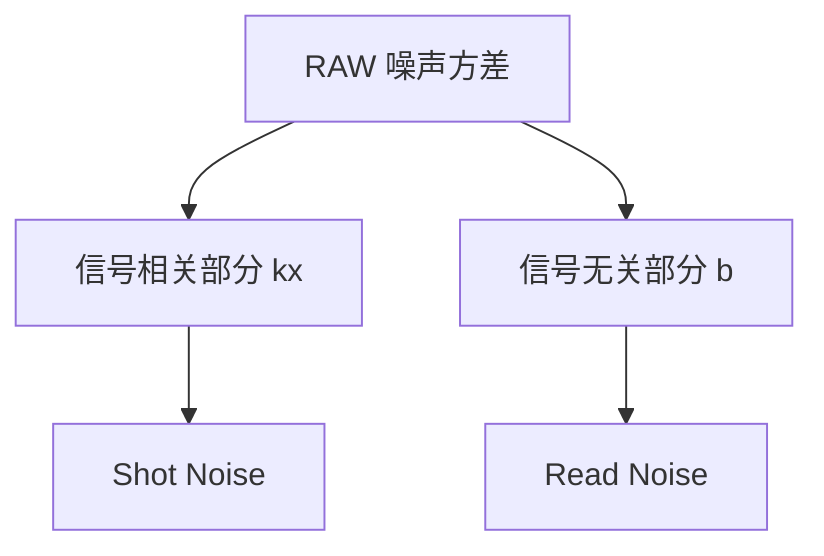

# 7. RAW 降噪的意义

核心结论：  
RAW 域越早降噪，噪声越容易建模；越往后，噪声越会被 ISP 模块变复杂。

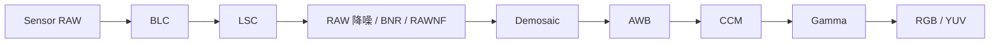

# 8. LSC 对噪声的影响：产生径向噪声
> Lens Shading Correction（镜头暗角校正）。

LSC 会对图像不同位置乘以不同 gain。  
通常中心 gain 小，边缘 gain 大。

如果原始信号是：

$$
y=x+n
$$

经过 LSC 后：

$$
y'=g\cdot y
$$

展开：

$$
y'=g\cdot x+g\cdot n
$$

所以噪声也被 gain 放大了。


## 8.1 图示：径向噪声

### 术语：Radial Noise

**Radial Noise，径向噪声**：**从图像中心到边缘逐渐增强的噪声**。  
它常由 LSC 这类空间位置相关的 gain 放大引入。

```text
LSC gain 分布示意：

边缘 gain 高       边缘 gain 高
      2.5  2.0  2.5
      2.0  1.0  2.0
      2.5  2.0  2.5
           ↑
        中心 gain 低
```

```text
噪声视觉效果示意：

+-----------------------------+
| 边缘颗粒强  * * * * * *     |
| * *                   * *   |
| *       中心较干净       *  |
| * *                   * *   |
|     * * * * * *  边缘颗粒强 |
+-----------------------------+
```

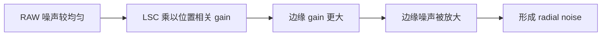

# 9. Demosaic 对噪声的影响：产生结构性噪声

Demosaic 会做插值。

例如某个缺失的 R 值，需要用左右两个 R 像素平均得到：

$$
R_{new}=\frac{R_1+R_2}{2}
$$

如果两个输入像素都带噪：

$$
R_1=x_1+n_1
$$

$$
R_2=x_2+n_2
$$

代入：

$$
R_{new}=\frac{x_1+x_2}{2}+\frac{n_1+n_2}{2}
$$

可以看到：  
Demosaic 不只插值了信号，也插值了噪声。

## 9.1 为什么会变成结构性噪声

如果多个插值点共享同一批邻域像素，那么它们的噪声不再完全独立。  
噪声会沿着插值方向扩散，出现纹理状、网格状、边缘状的结构。

### 术语：结构性噪声

**结构性噪声**：噪声不再是独立随机点，而是形成方向、纹理、网格、彩色边缘等结构。  
Demosaic 插值会让 RAW 噪声产生空间相关性。

```text
RAW 域随机噪声：
.  *  .  .  *
*  .  .  *  .
.  .  *  .  .
*  .  .  .  *

Demosaic 后可能变成：
--*--*--*--
  \  \  \
--*--*--*--
  \  \  \
--*--*--*--
```

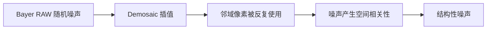

# 10. CCM 对噪声的影响：增强通道相关性和彩色噪声

CCM 使用 3x3 矩阵混合 RGB：

$$
\begin{bmatrix} R'\\ G'\\ B' \end{bmatrix} \begin{bmatrix} m_{11}&m_{12}&m_{13}\\ m_{21}&m_{22}&m_{23}\\ m_{31}&m_{32}&m_{33} \end{bmatrix} \begin{bmatrix} R\\ G\\ B \end{bmatrix}
$$

如果其中一行是：

$$
R'=1.5R-0.3G-0.2B
$$

假设 R/G/B 三个通道原始噪声标准差都是：

$$
\sigma=4
$$

方差是：

$$
\sigma^2=16
$$

那么 R' 的噪声方差为：

$$
Var(R')=1.5^2\times16+(-0.3)^2\times16+(-0.2)^2\times16
$$

$$
Var(R')=2.25\times16+0.09\times16+0.04\times16
$$

$$
Var(R')=36+1.44+0.64=38.08
$$

标准差为：

$$
\sigma_{R'}=\sqrt{38.08}\approx6.17
$$

原本噪声标准差是 4，经过这个 CCM 后变成约 6.17。

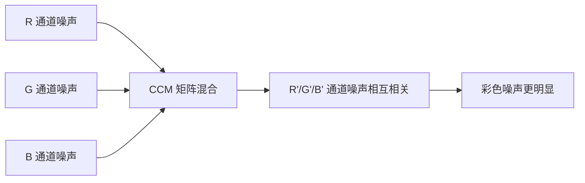

# 11. Gamma 对噪声的影响：产生非线性噪声

Gamma 常见形式：

$$
y=x^{\frac{1}{\gamma}}
$$

假设：

$$
\gamma=2.2
$$

那么：

$$
y=x^{\frac{1}{2.2}}
$$

Gamma 的特点是：
- 暗部被拉升更多。
- 亮部变化相对被压缩。
- 暗部小噪声会被明显放大。

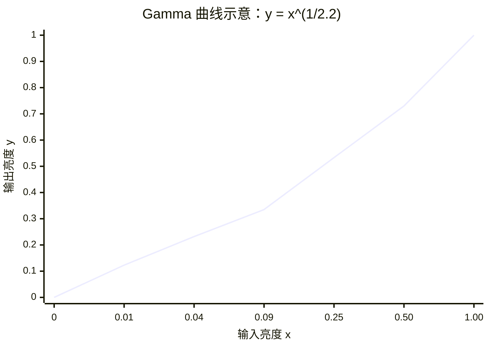

## 11.1 用导数理解噪声放大

Gamma 函数：

$$
y=x^{\frac{1}{\gamma}}
$$

导数为：

$$
\frac{dy}{dx}=\frac{1}{\gamma}x^{\frac{1}{\gamma}-1}
$$

导数可以理解为：  
输入 x 附近的一点小扰动，会被放大多少。

当：

$$
x=0.01
$$

$$
\gamma=2.2
$$

有：

$$
\frac{dy}{dx}\approx5.60
$$

当：

$$
x=0.5
$$

有：

$$
\frac{dy}{dx}\approx0.66
$$

所以：

|亮度位置|噪声放大倍数|
|---|---|
|暗部 x=0.01|约 5.60 倍|
|中高亮 x=0.5|约 0.66 倍|

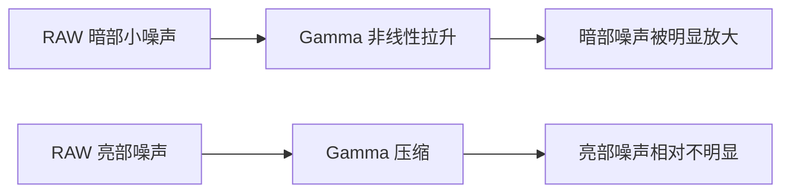

---

# 12. 为什么要尽早在 RAW 域降噪

完整逻辑如下：

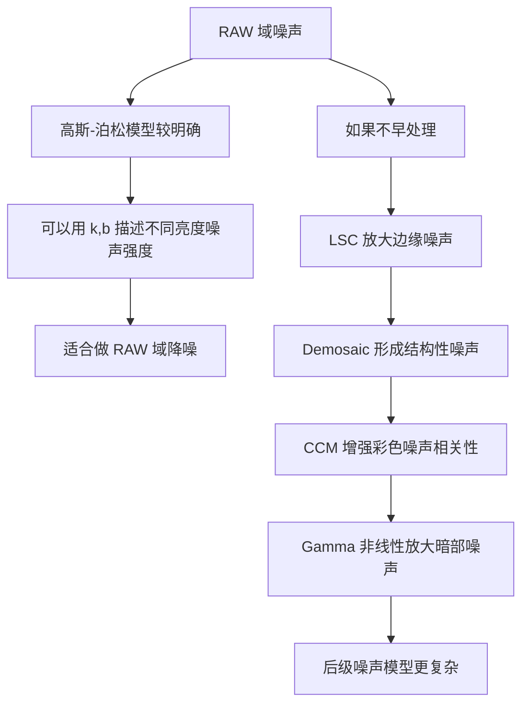

总结成表格：

|阶段|对噪声的影响|
|---|---|
|RAW 域|噪声接近高斯-泊松模型，较容易建模|
|LSC 后|边缘噪声被 gain 放大，形成 radial noise|
|Demosaic 后|噪声被插值，形成结构性噪声|
|CCM 后|RGB 噪声相关性增强，彩色噪声更明显|
|Gamma 后|暗部噪声被非线性放大|
|RGB / YUV 后|噪声混入亮度、颜色、纹理和结构，建模更难|

# 13. Noise Profile 怎么用于 RAW 降噪

## 13.1 Noise Profile 是什么

**Noise Profile，噪声配置 / 噪声曲线**：描述不同亮度下噪声强度的参数。  
RAW 域中常用 k 和 b 表示：

$$
\sigma^2(x)=kx+b
$$

再得到标准差：

$$
\sigma(x)=\sqrt{kx+b}
$$

一个常见做法是：  
把 RAW 图像和噪声强度信息一起输入给模型。

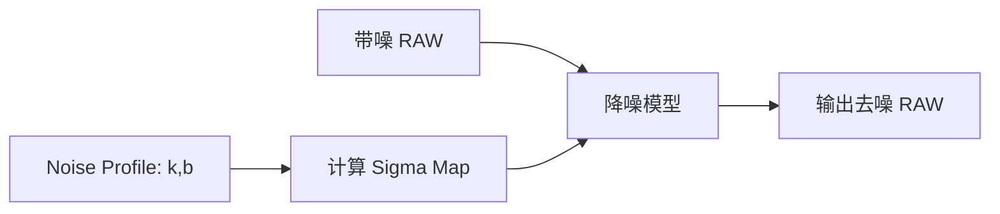

## 13.2 Sigma Map 是什么

**Sigma Map，噪声标准差图**：每个像素位置对应一个噪声标准差。  
因为 RAW 噪声和亮度相关，所以不同亮度位置的噪声强度不同。

计算方式：

$$
\sigma(x)=\sqrt{kx+b}
$$

数字例子：

$$
k=0.02
$$

$$
b=4
$$

RAW 像素为：

```text
100 200 400 800
```

分别计算：

$$
\sigma(100)=\sqrt{0.02\times100+4}=\sqrt{6}\approx2.45
$$

$$
\sigma(200)=\sqrt{0.02\times200+4}=\sqrt{8}\approx2.83
$$

$$
\sigma(400)=\sqrt{0.02\times400+4}=\sqrt{12}\approx3.46
$$

$$
\sigma(800)=\sqrt{0.02\times800+4}=\sqrt{20}\approx4.47
$$

所以 Sigma Map 是：

```text
2.45 2.83 3.46 4.47
```

# 14. 代码中通常怎么落地

|概念|代码中对应的位置|
|---|---|
|RAW 读取|读取 raw / hdf5 / tfrecord 等数据|
|bit 位归一化|把 10-bit / 12-bit RAW 转成 0 到 1|
|Bayer 拆分|把单通道 Bayer 图变成 4 通道|
|Noise Profile|根据 k,b 计算 Sigma Map|
|模型输入|拼接 RAW、Sigma Map、ISO、gain 等条件|
|Loss|计算输出和目标干净图之间的差异|
|指标|计算 MSE、PSNR、SSIM|
|推理后处理|clip、反归一化、Gamma、保存图像|


## 14.1 Bayer RAW 四通道打包

以 BGGR 为例：

```python
import torch

def pack_bayer_bggr(raw: torch.Tensor) -> torch.Tensor:
    """
    raw: [B, 1, H, W]
    return: [B, 4, H/2, W/2]

    BGGR:
    B G
    G R
    """
    b = raw[:, :, 0::2, 0::2]
    g1 = raw[:, :, 0::2, 1::2]
    g2 = raw[:, :, 1::2, 0::2]
    r = raw[:, :, 1::2, 1::2]

    return torch.cat([b, g1, g2, r], dim=1)
```

这段代码对应的流程：

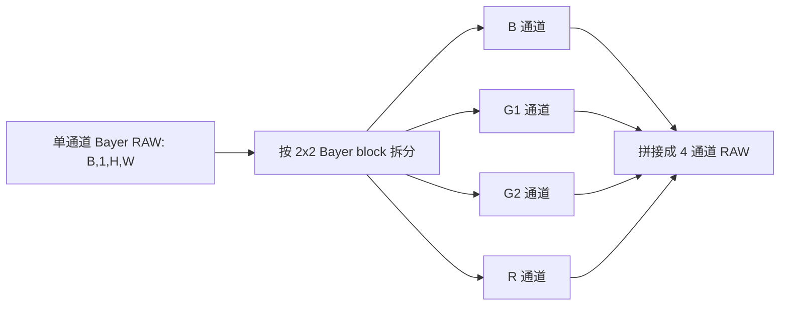

## 14.2 根据 k,b 计算 Sigma Map

```python
import torch

def compute_sigma_map(raw: torch.Tensor, k: float, b: float) -> torch.Tensor:
    """
    raw: 归一化后的 RAW, shape = [B, 1, H, W]
    k, b: noise profile 参数
    return: 每个像素位置的噪声标准差
    """
    var = k * raw + b
    sigma = torch.sqrt(torch.clamp(var, min=1e-12))
    return sigma
```

对应公式：

$$
\sigma(x)=\sqrt{kx+b}
$$

## 14.3 拼接模型输入

```python
def build_model_input(raw: torch.Tensor, k: float, b: float) -> torch.Tensor:
    """
    raw: [B, 1, H, W]
    return: [B, 8, H/2, W/2]
    """
    raw_4ch = pack_bayer_bggr(raw)

    sigma = compute_sigma_map(raw, k, b)
    sigma_4ch = pack_bayer_bggr(sigma)

    model_input = torch.cat([raw_4ch, sigma_4ch], dim=1)
    return model_input
```

含义：
- RAW 4 通道：告诉模型图像内容。
- Sigma 4 通道：告诉模型每个位置噪声强度。
- 模型可以根据噪声强弱自适应降噪。

```mermaid
flowchart LR
    A[RAW 4 通道] --> C[concat]
    B[Sigma 4 通道] --> C
    C --> D[模型输入 8 通道]
    D --> E[降噪网络]
```

# 15. 噪声评价指标

常见评价指标包括：
1. SNR
2. MSE
3. PSNR
4. SSIM

# 16. SNR

## 16.1 SNR 是什么

**SNR，Signal-to-Noise Ratio，信噪比**：信号强度和噪声强度的比值。  
SNR 越大，说明信号相对噪声越强，图像越干净。

线性形式：

$$
SNR=\frac{\mu_{signal}}{\sigma_{noise}}
$$

dB 形式：

$$
SNR_{dB}=20\log_{10}\left(\frac{\mu_{signal}}{\sigma_{noise}}\right)
$$
## 16.2 SNR 的缺陷

SNR 的缺陷：
1. 需要知道信号和噪声如何分离。
2. 只描述整体噪声强度，不描述纹理、结构和颜色。
3. 对过度平滑不敏感。
4. 不能直接代表主观视觉质量。

例如：  
模型把噪声和细节一起抹掉，SNR 可能变高，但图像会变糊。

# 17. MSE

## 17.1 MSE 是什么

**MSE，Mean Squared Error，均方误差**：预测图像和参考图像逐像素差值平方的平均值。  
它衡量像素级误差。

公式：
$$
MSE=\frac{1}{N}\sum_{i=1}^{N}(I_i-K_i)^2
$$
其中：

| 符号    | 含义          |
| ----- | ----------- |
| $I_i$ | 参考图像第 i 个像素 |
| $K_i$ | 预测图像第 i 个像素 |
| $N$   | 像素数量        |

# 18. PSNR

## 18.1 PSNR 是什么

**PSNR，Peak Signal-to-Noise Ratio，峰值信噪比**：基于 MSE 计算的图像重建质量指标。  
PSNR 越高，说明预测图像和参考图像越接近。

公式：

$$
PSNR=10\log_{10}\left(\frac{MAX^2}{MSE}\right)
$$

其中：

|情况|MAX|
|---|---|
|8-bit 图像|255|
|10-bit RAW|1023|
|归一化到 0 到 1|1|

```mermaid
xychart-beta
    title "8-bit 图像中 MSE 与 PSNR 的关系"
    x-axis "MSE" [1, 2, 5, 10, 20, 50, 100]
    y-axis "PSNR dB" 20 --> 50
    line [48.13, 45.12, 41.14, 38.13, 35.12, 31.14, 28.13]
```

# 19. SSIM

## 19.1 SSIM 是什么

**SSIM，Structural Similarity，结构相似性**：衡量两张图在亮度、对比度、结构上的相似程度。  
它比 MSE / PSNR 更关注图像结构。

公式：

$$
SSIM(x,y)=\frac{(2\mu_x\mu_y+C_1)(2\sigma_{xy}+C_2)}{(\mu_x^2+\mu_y^2+C_1)(\sigma_x^2+\sigma_y^2+C_2)}
$$

其中：

| 符号         | 含义            |
| ---------- | ------------- |
| mu_x       | 参考图像局部均值      |
| mu_y       | 预测图像局部均值      |
| sigma_x 平方 | 参考图像局部方差      |
| sigma_y 平方 | 预测图像局部方差      |
| sigma_xy   | 两张图的局部协方差     |
| C1, C2     | 防止分母为 0 的稳定常数 |

### 术语：协方差

**协方差**：衡量两个变量是否一起变化。  
在 SSIM 中，协方差越高，说明两张图的局部结构变化越一致。

# 20 一句话总结

**RAW 域降噪的核心价值是：在噪声还简单、可建模、可按亮度估计强度的时候先处理掉它。**