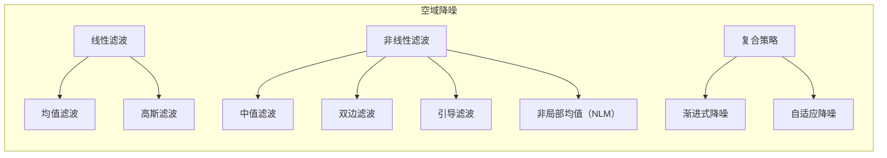
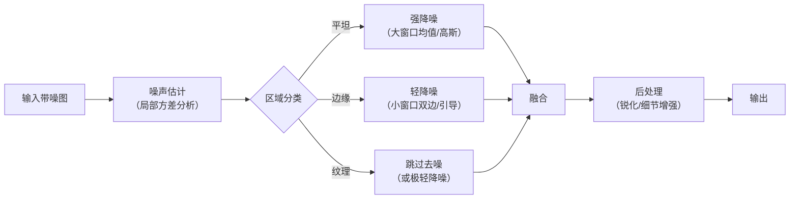
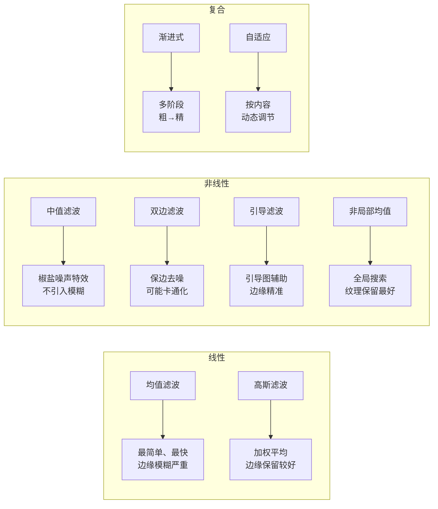

## 1. 空域降噪的基本概念

### 1.1 什么是空域降噪

> **术语解释**：**空域降噪（Spatial Denoising）** 指在同一帧图像内部，利用像素与周围像素之间的空间关系来去除噪声的方法。它不依赖多帧信息，只处理当前这一帧。

空域降噪的核心假设是：**图像中相邻像素之间存在相关性，而噪声是随机的、不相关的。** 基于这个假设，可以通过观察某个像素及其邻居来推断“这个像素到底应该是多少”——如果某个像素的值和周围邻居差异太大，它大概率是噪声。

这与时域降噪（利用多帧之间的时间相关性）形成对比，两者可以互补使用。

### 1.2 空域降噪方法分类



- **线性滤波**：权重是**固定公式**算出来的，**一旦算好就不变了**。不管你图像里是什么内容，只要像素位置不变，这个像素被赋予的权重就是死的。
- **非线性滤波**：权重**完全取决于像素本身的值**。或者计算方式根本不是“加权求和”，而是“排序”

## 2. 均值滤波

### 2.1 原理

用窗口内所有像素的**平均值**替换中心像素的值。

> **术语解释**：**均值滤波**是空域降噪中最基本的方法——把目标像素周围一个方形窗口内所有像素的亮度加起来求平均，作为该像素的新值。平均操作会平滑掉噪声，但也会把边缘一起“抹平”。

```text
┌─────────────────────────────────────────────────────────────────────────────┐
│                    均值滤波示意                                             │
├─────────────────────────────────────────────────────────────────────────────┤
│                                                                             │
│  原始窗口（3×3）：                                                         │
│  ┌─────────────┐                                                          │
│  │ 10  12  11  │                                                          │
│  │  9  100  13 │  ← 中心像素 100 明显是噪声（比周围亮得多）                │
│  │ 10  11  12  │                                                          │
│  └─────────────┘                                                          │
│                                                                             │
│  均值滤波后：                                                              │
│  新值 = (10+12+11+9+100+13+10+11+12) / 9 = 188 / 9 ≈ 21                   │
│  100 → 21（被拉回正常范围）                                                │
│                                                                             │
│  代价：真正的边缘像素也会被拉低/拉高（边缘模糊）                            │
│                                                                             │
└─────────────────────────────────────────────────────────────────────────────┘
```

### 2.2 数学形式

输出图像 $g$ 在位置 $(x,y)$ 的值是输入图像 $f$ 在窗口 $W$ 内的均值：

$$
g(x,y) = \frac{1}{m \times n} \sum_{(i,j) \in W} f(i,j)
$$

其中 $m \times n$ 是窗口大小（如 3×3、5×5）。

### 2.3 特点

| 优点 | 缺点 |
|------|------|
| 计算简单，速度极快 | 边缘和细节被模糊 |
| 对高斯噪声有一定效果 | 对椒盐噪声效果差 |
| 硬件实现容易 | 窗口越大模糊越严重 |

> **术语解释**：**椒盐噪声（Salt-and-Pepper Noise）** 指图像中随机出现的纯白或纯黑像素点（像撒了一把盐和胡椒）。均值滤波对这类噪声效果不佳，因为异常值仍会被平均到结果中，中值滤波更适合处理椒盐噪声。

> **适用位置**：均值滤波常用在预处理阶段，用很小的窗口（如 3×3）快速去除细微噪声，不作为主要的降噪手段。


## 3. 中值滤波

### 3.1 原理

用窗口内所有像素的**中值**替换中心像素的值。

```text
┌─────────────────────────────────────────────────────────────────────────────┐
│                    中值滤波示意                                             │
├─────────────────────────────────────────────────────────────────────────────┤
│                                                                             │
│  原始窗口（3×3）：                                                         │
│  ┌─────────────┐                                                          │
│  │ 10  12  11  │                                                          │
│  │  9  255  13 │  ← 中心像素 255 是椒盐噪声（纯白）                       │
│  │ 10  11  12  │                                                          │
│  └─────────────┘                                                          │
│                                                                             │
│  排序：9, 10, 10, 11, 11, 12, 12, 13, 255                                │
│  中值（第5个）= 11                                                         │
│  255 → 11（噪声被完美去除）                                                │
│                                                                             │
│  均值滤波会把 255 平均成约 38（还是偏亮）                                  │
│  中值滤波直接把离群的异常值替换掉                                          │
│                                                                             │
└─────────────────────────────────────────────────────────────────────────────┘
```

### 3.2 为什么中值滤波对椒盐噪声效果好？

椒盐噪声的像素值是极端值（0 或 255），在排序后一定排在开头或末尾。中值是排序后的中间值，永远不会落在极端位置上，所以椒盐噪声被直接忽略。

### 3.3 特点

| 优点 | 缺点 |
|------|------|
| 对椒盐噪声效果极好 | 计算量比均值滤波大（需要排序） |
| 能保留边缘（不引入模糊） | 对高斯噪声效果一般 |
| 不引入新的像素值 | 大窗口下仍会损失细节 |


## 4. 高斯滤波

### 4.1 原理

用**高斯核**对窗口内的像素做加权平均——离中心越近的像素权重越大，离中心越远的像素权重越小。

> **术语解释**：**高斯滤波**是均值滤波的“升级版”——均值滤波给窗口内所有像素相同的权重，高斯滤波则根据像素到中心的距离分配权重（中心权重最大，边缘权重最小）。这样更符合自然图像的统计规律：离得越近的像素相关性越强。

```text
┌─────────────────────────────────────────────────────────────────────────────┐
│                    高斯核（3×3，σ=1.0）                                    │
├─────────────────────────────────────────────────────────────────────────────┤
│                                                                             │
│  ┌─────────────────┐                                                      │
│  │ 0.075  0.124  0.075│                                                   │
│  │ 0.124  0.204  0.124│  ← 中心权重最高（0.204）                          │
│  │ 0.075  0.124  0.075│  ← 边缘权重最低（0.075）                          │
│  └─────────────────┘                                                      │
│                                                                             │
│  权重总和 = 1.0                                                           │
│                                                                             │
│  均值核：        高斯核：                                                  │
│  所有权重相同    越靠近中心权重越高                                        │
│  边缘模糊严重    边缘保留更好                                              │
│                                                                             │
└─────────────────────────────────────────────────────────────────────────────┘
```

### 4.2 数学形式

二维高斯函数：

$$
G(x,y) = \frac{1}{2\pi\sigma^2} e^{-\frac{x^2 + y^2}{2\sigma^2}}
$$

其中 $\sigma$（标准差）控制平滑程度：
- $\sigma$ 越大 → 核越宽 → 越平滑（去噪更强，但更模糊）
- $\sigma$ 越小 → 核越集中 → 细节保留更多（去噪较弱）

### 4.3 高斯核 vs 均值核

| | 均值核 | 高斯核 |
|---|---|---|
| 权重分布 | 所有像素相同 | 中心高、边缘低 |
| 边缘模糊 | 严重 | 较轻 |
| 计算复杂度 | 简单（只求和） | 需要乘权重 |
| 控制参数 | 窗口大小 | 窗口大小 + $\sigma$ |

## 5. 双边滤波（Bilateral Filter）

### 5.1 原理：考虑“像素值相似度”

均值滤波和高斯滤波都只考虑**空间距离**——离中心越近权重越大。但它们都不关心**像素值本身**——如果边缘两侧的像素值差异很大，它们仍然会被平均在一起，导致边缘模糊。

**双边滤波的改进**：权重由两个因素共同决定：
1. **空间距离**：离中心越近权重越大
2. **像素值相似度**：像素值越接近中心像素权重越大

```text
┌─────────────────────────────────────────────────────────────────────────────┐
│                    双边滤波核心思想                                         │
├─────────────────────────────────────────────────────────────────────────────┤
│                                                                             │
│  场景：一个边缘区域，左侧暗、右侧亮                                        │
│  ┌──────────────────────────────────────────────────────────────────┐       │
│  │  暗区（值=50）  │  边界  │  亮区（值=200）                     │       │
│  │  50  50  50  50 │  50 200 │  200 200 200 200                   │       │
│  │  50  50  50  50 │  50 200 │  200 200 200 200                   │       │
│  │  50  50  50  50 │  50 200 │  200 200 200 200                   │       │
│  └──────────────────────────────────────────────────────────────────┘       │
│                                                                             │
│  目标：去噪中心像素（50），同时保留边缘                                    │
│                                                                             │
│  高斯滤波：把左右两侧的 50 和 200 一起平均 → 像素变成 125（边缘模糊）     │
│  双边滤波：右侧 200 的像素因“值不相似”权重被压低 → 只用左侧 50 平均 →     │
│  边缘清晰保留                                                              │
│                                                                             │
└─────────────────────────────────────────────────────────────────────────────┘
```

### 5.2 数学形式

$$
g(x,y) = \frac{\sum_{(i,j) \in W} f(i,j) \times w_s(i,j) \times w_r(i,j)}{\sum_{(i,j) \in W} w_s(i,j) \times w_r(i,j)}
$$

其中：
- $w_s$：空间权重（距离越近越大），基于高斯函数
- $w_r$：值域权重（值越接近越大），基于高斯函数
- 两个权重相乘得到最终的滤波权重

### 5.3 参数控制

| 参数 | 含义 | 调大后效果 |
|------|------|-----------|
| $\sigma_s$ | 空间高斯的标准差 | 影响范围更大（更平滑，但可能模糊远距离结构） |
| $\sigma_r$ | 值域高斯的标准差 | 允许更多不同像素值被加权（去噪更强，但边缘保留减弱） |

> **关键直觉**：$\sigma_s$ 控制“多远的邻居参与平均”，$\sigma_r$ 控制“多大差异的邻居参与平均”。参数调优的关键是平衡去噪力度与边缘保留。

### 5.4 双边滤波的优缺点

| 优点 | 缺点 |
|------|------|
| 去噪同时保留边缘 | 计算量大（需要同时计算空间和值域权重） |
| 不需要依赖多帧 | 在纹理丰富区域可能产生“卡通化”伪影 |
| 参数可调适应不同场景 | 高噪声下边缘检测不可靠 |


## 6. 引导滤波（Guided Filter）

### 6.1 原理：利用引导图

> **术语解释**：**引导滤波（Guided Filter）** 使用另一张“引导图”来决定滤波权重。引导图通常是原始图像的平滑版本或另一个视角的图像。如果某个像素在引导图中和邻居差异大（边缘），滤波时就少平均；如果差异小（平坦区域），就多平均。

双边滤波的权重只依赖当前像素的局部信息。引导滤波的核心思想是：**用一张“引导图”来决定权重的分配**——引导图提供了更全局的上下文信息，能更准确地判断哪里是边缘、哪里是平坦区域。

> **“引导图”从哪来？** 在一种常见做法中，引导图就是**原始图像本身**（自引导），或者**经过高斯滤波后的图像**（更稳定的版本）。另一种做法是使用**另一个传感器**（如深度图）或**同一场景的不同曝光图像**作为引导图。

### 6.2 直觉理解

```text
引导图：                   输入带噪图：                输出：
┌─────────────────┐       ┌─────────────────┐       ┌─────────────────┐
│ ████████░░░░░░░ │       │ ██▄█▄█░░░▄█░░░ │       │ ████████░░░░░░░ │
│ ████████░░░░░░░ │  +    │ █▄███░░░▄▄░░░░ │  →    │ ████████░░░░░░░ │
│ ████████░░░░░░░ │       │ ████░░░░░░░░░░ │       │ ████████░░░░░░░ │
└─────────────────┘       └─────────────────┘       └─────────────────┘
  清晰的边缘信息           带噪声的输入             去噪+边缘保留

关键：引导图告诉我们“边缘在哪里”，所以滤波时边缘两侧不互相平均
```

### 6.3 引导滤波 vs 双边滤波

| | 双边滤波 | 引导滤波 |
|---|---|---|
| 权重依据 | 当前像素的局部信息（空间距离+值域差异） | 引导图（可来自外部，提供更全局的上下文） |
| 边缘保留 | 好（依赖当前像素的值域差异） | 更好（引导图能提供更准确的边缘信息） |
| 计算复杂度 | 高 | 较低（有快速实现） |
| 适用场景 | 通用去噪 | 高精度边缘保留（如抠图、HDR 融合） |
| 伪影风险 | 可能出现卡通化 | 梯度反转（边缘周围出现光晕） |


## 7. 非局部均值算法（Non-Local Means，NLM）

### 7.1 原理：在整张图中找相似块

> **术语解释**：**非局部均值（Non-Local Means）** 不再局限于目标像素周围的小窗口，而是在整张图像中搜索所有“相似”的图像块，用这些相似块的平均值来去噪。

“局部”方法（均值、高斯、双边）只参考目标像素周围的邻居。“非局部”方法在整张图像中寻找**结构相似的块**——即使它们距离很远。

```text
┌─────────────────────────────────────────────────────────────────────────────┐
│                    非局部均值算法                                          │
├─────────────────────────────────────────────────────────────────────────────┤
│                                                                             │
│  图像中有多个相似的纹理块：                                                │
│  ┌──────┐  ┌──────┐  ┌──────┐                                               │
│  │ ████ │  │ ████ │  │ ████ │  ← 这四个块结构相似（都是横条纹）           │
│  │ ████ │  │ ████ │  │ ████ │                                               │
│  │ ████ │  │ ████ │  │ ████ │                                               │
│  └──────┘  └──────┘  └──────┘                                               │
│     ↑          ↑          ↑                                               │
│  目标块      远处相似块   远处相似块                                       │
│                                                                             │
│  传统局部方法：只用目标块周围的像素 → 去噪效果有限                         │
│  NLM：把三个相似块都拿过来平均 → 噪声被大幅抵消，结构保留更好             │
│                                                                             │
└─────────────────────────────────────────────────────────────────────────────┘
```

### 7.2 核心机制

1. 对每个目标像素，取一个**邻域块**（如 7×7）
2. 在整张图像中搜索与这个块**结构相似**的其他块
3. 用**结构相似度**（如块与块的 L2 距离）作为权重
4. 所有相似块的像素值**加权平均**得到去噪结果

### 7.3 优缺点

| 优点             | 缺点             |
| -------------- | -------------- |
| 去噪效果极好（保留纹理细节） | 计算量巨大（需要搜索整张图） |
| 能恢复重复纹理        | 对非重复纹理效果一般     |
| 不依赖边缘检测        | 参数敏感           |

> NLM 是很多传统去噪方法的基石，BM3D 就是 NLM 的“升级版”——加入了块匹配和 3D 变换。

## 8. 复合降噪策略

### 8.1 渐进式图像降噪处理

> **术语解释**：**渐进式降噪**指用**多个阶段**逐步去除噪声，而不是一步到位。每个阶段用不同的参数或不同的方法，先粗后精。

```text
渐进式降噪流程：
带噪图 → 粗降噪（大窗口，强平滑）→ 中降噪 → 精降噪（小窗口，边缘保护）→ 去噪图
```

**典型实现**：
1. 用大窗口高斯滤波去除强噪声（代价：边缘模糊）
2. 用引导滤波恢复边缘（把模糊的边缘重新“拉”清晰）
3. 用小窗口双边滤波做最后的精细处理

这种“先粗后精”的策略，比单次滤波更能平衡去噪和细节保留。

### 8.2 自适应降噪

> **术语解释**：**自适应降噪**指根据图像**局部内容**动态调整降噪强度——平坦区域用力降噪，纹理/边缘区域轻降噪或跳过降噪。

```text
自适应策略：
┌─────────────────────────────────────────────────────────────────────────────┐
│  对每个像素：                                                              │
│  ① 计算局部方差（判断是平坦还是纹理区域）                                  │
│  ② 平坦区域：大方差 → 用强降噪（大窗口、低阈值）                         │
│  ③ 纹理/边缘区域：小方差 → 用弱降噪（小窗口、高阈值）                    │
│  ④ 高纹理区域：跳过降噪                                                   │
└─────────────────────────────────────────────────────────────────────────────┘
```

> **为什么自适应降噪更优？** 因为它能避免“一刀切”——在最需要去噪的平坦区域用力处理，在最需要保留细节的纹理/边缘区域轻处理。这与你在 AI 去噪中学到的“让模型根据 k/b 动态调整去噪力度”的思路是一致的。

### 8.3 复合降噪的典型流程



> **关键理解**：没有一种滤波方法能适合所有场景。复合降噪通过“分而治之”策略——平坦区域用强平滑，边缘区域用保边滤波，纹理区域保持原样——达到最优的整体效果。


## 9. 各方法对比总结



| 方法 | 去噪能力 | 边缘保留 | 计算量 | 适用场景 |
|------|---------|---------|--------|---------|
| 均值滤波 | 低 | 差 | 极低 | 快速预处理 |
| 高斯滤波 | 中 | 一般 | 低 | 通用平滑 |
| 中值滤波 | 中（椒盐噪声高） | 好 | 中 | 椒盐噪声 |
| 双边滤波 | 中高 | 好 | 较高 | 保边去噪 |
| 引导滤波 | 中高 | 极好 | 中 | 高质量保边 |
| 非局部均值 | 高 | 极好 | 极高 | 高质量纹理保留 |
| 复合降噪 | 高 | 极好 | 视组合而定 | 工业级应用 |


## 10. 一句话总结

> **空域降噪在同一帧内利用像素间空间关系去除噪声：线性滤波（均值/高斯）简单快速但模糊边缘，非线性滤波（中值/双边/引导）保边但计算更复杂，非局部均值（NLM）用全局相似块获得最佳效果，复合策略（渐进式/自适应）通过分区域、分阶段处理达到最优平衡。实际 ISP 中常将多种方法组合使用，根据图像内容自适应选择降噪策略。**