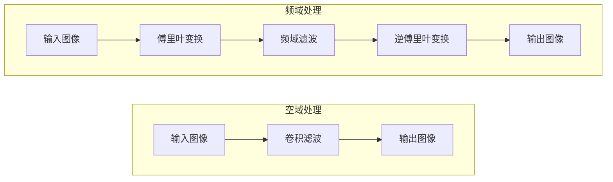
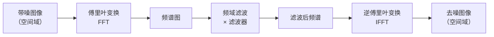
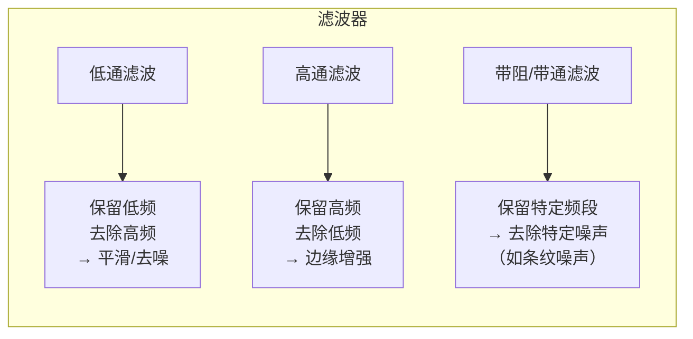
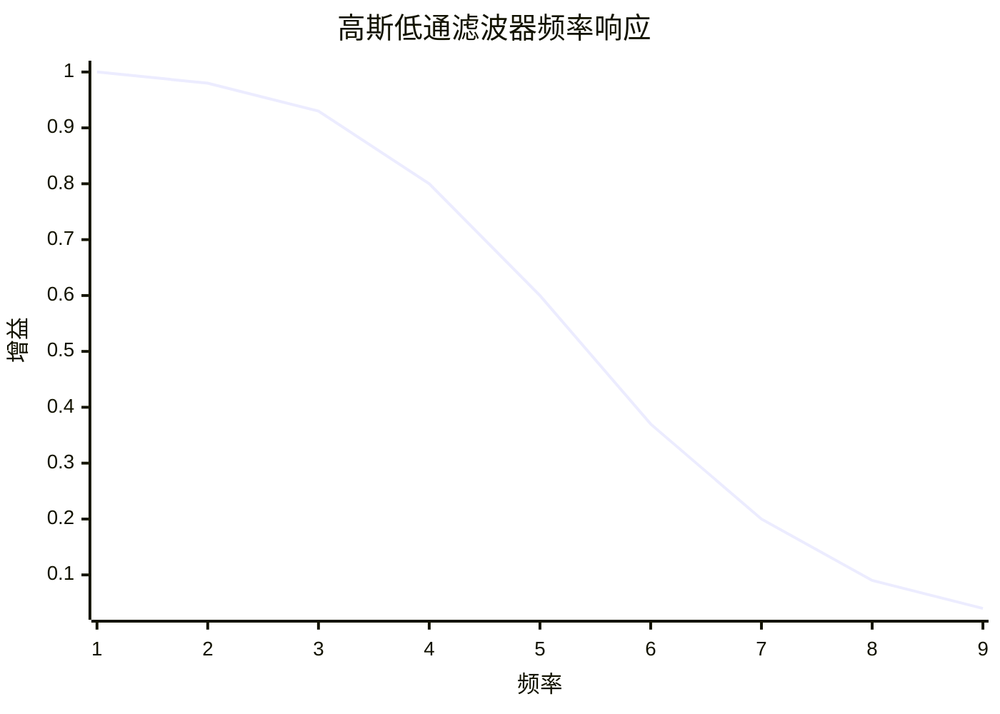

## 1. 频域降噪的背景

### 1.1 为什么需要频域降噪？

空域降噪在像素矩阵上直接操作，有一个根本性的限制：**它只能利用局部信息**。无论窗口开多大，都只看到有限范围内的像素。

频域降噪的思路完全不同：**把图像从“空间域”转换到“频率域”，在频率域中处理，再转回来。** 这样做的优势是：

- **全局信息**：频率域的一处变化对应整张图像，能看到空域滤波看不到的全局模式
- **噪声分离更清晰**：信号和噪声在频域中的分布规律不同，更容易区分
- **处理效率高**：某些类型的噪声在频域中处理比空域更有效

### 1.2 空域 vs 频域



```text
┌─────────────────────────────────────────────────────────────────────────────┐
│                    空域 vs 频域的核心区别                                   │
├─────────────────────────────────────────────────────────────────────────────┤
│                                                                             │
│  空域：                                                                     │
│  对图像中的每个像素，看它的邻居，做加权平均                                 │
│  → 局部操作、直观、计算简单                                                 │
│                                                                             │
│  频域：                                                                     │
│  把整张图像“分解”成不同频率的正弦波组合                                     │
│  低频 → 图像的平滑区域（如天空、肤色）                                     │
│  高频 → 图像的边缘、纹理、噪声                                              │
│  → 全局操作、可以精确区分信号类型                                           │
│                                                                             │
└─────────────────────────────────────────────────────────────────────────────┘
```

### 1.3 频率域的语言
> **术语解释**：**频率域**是将图像按“频率”分解后的表示方式。在频率域中，图像被看作不同频率、幅度和方向的正弦波的叠加。**低频**对应图像中变化缓慢的区域（如天空、墙壁）；**高频**对应变化剧烈的区域（如边缘、纹理、噪声）。频率域处理的本质就是“调整不同频率分量的幅度”。

| 频域分量    | 对应图像特征       | 处理方式             |
| ------- | ------------ | ---------------- |
| **极低频** | 图像整体亮度、大面积色块 | 保留（决定画面基调）       |
| **低频**  | 平滑区域、渐变过渡    | 适度保留             |
| **中频**  | 纹理、物体边界      | 保留（决定清晰度）        |
| **高频**  | 边缘、细节、**噪声** | **高频噪声 → 衰减或去除** |

## 2. 频域降噪方法

### 2.1 傅里叶变换

> **术语解释**：**傅里叶变换**是一种数学变换，把图像从空间域（像素坐标）转换到频率域（频率坐标）。逆傅里叶变换做相反的转换。在图像处理中，常用的是**二维离散傅里叶变换（DFT）**。

**傅里叶变换的核心思想**：任何图像都可以分解为一系列不同频率、不同方向的正弦波之和。

```text
图像 = 低频波（大面积色块）+ 中频波（纹理）+ 高频波（边缘、噪声）
```

在频域中，每个频率分量都可以被独立操作：增强、衰减或直接去掉。

### 2.2 频域滤波的核心流程



> **数学操作**：频域滤波就是一个乘法操作：
> $$
G(u,v) = F(u,v) \times H(u,v)
$$
> 其中 $F$ 是输入图像的频谱，$H$ 是滤波器（频率响应），$G$ 是输出频谱。在空域中，这个乘法对应卷积——这是傅里叶变换的核心性质之一。

### 2.3 三种核心频域滤波器



> **注意**：对于去除噪声，主要使用的是**低通滤波**——因为噪声主要分布在高频区域。高通滤波通常用于边缘检测和锐化，不是去噪的主要手段。

> **术语解释**：**低通滤波（Low-pass Filter）** 允许低频分量通过，衰减高频分量。因为噪声通常以高频形式出现，低通滤波能有效去除噪声。**高通滤波（High-pass Filter）** 相反，保留高频、衰减低频，用于边缘检测。**带阻滤波（Band-stop Filter）** 去除特定频率范围，用于去除有规律的噪声（如电源干扰条纹）。

#### 理想低通滤波

在频率域中画一个圆，圆内全部保留（1），圆外全部去掉（0）。

```text
理想低通滤波器：
┌─────────────────────────────────────────────────────────────────────────────┐
│  频率域中：                                                                 │
│  ┌──────────────────────────────────────────────────────────────────────┐   │
│  │                   ████████████████████████████                     │   │
│  │                 ████████████████████████████████                   │   │
│  │                ██████████████████████████████████                  │   │
│  │               ████████████████ 1 ████████████████                  │   │
│  │               ███████████████████████████████████                  │   │
│  │                ██████████████████████████████████                  │   │
│  │                 ████████████████████████████████                   │   │
│  │                   ████████████████████████████                     │   │
│  └──────────────────────────────────────────────────────────────────────┘   │
│  圆内（低频）：保留   圆外（高频）：去掉                                 │
│  优点：原理简单      缺点：边界突变 → 振铃效应                           │
└─────────────────────────────────────────────────────────────────────────────┘
```

理想低通滤波器的问题是：频率域的“硬截断”会导致空间域的振铃效应（Ringing Artifact）——去噪图像边缘出现波纹状的振荡。

#### 高斯低通滤波

用高斯函数作为过渡，没有硬边界。



> 高斯滤波器的频率响应也是高斯函数。频率越高，衰减越平滑，没有硬截断 → 没有振铃效应。这是频域降噪中最常用的一种。

#### 带阻滤波

去除非随机噪声。图像中常见的**条纹噪声**（如电源干扰导致的水平条纹）在频域中表现为两个特定的亮点。带阻滤波器可以精确去掉这两个亮点的频率，而不影响图像的其他部分。

### 2.4 频域降噪的典型流程

```text
带噪图 → FFT → 频谱图 → 分析频谱 → 设计滤波器 → 乘以滤波器 → 去除噪声 → IFFT → 去噪图
```

其中“设计滤波器”取决于噪声在频谱中的分布：
- 噪声分布在**高频区域**（大多数情况）→ 使用低通滤波
- 噪声集中在**特定频率**（如条纹噪声）→ 使用带阻滤波

## 3. 频域降噪的应用

### 3.1 适用场景

频域降噪在某些场景下比空域降噪更有优势：

| 场景 | 为什么频域更有效 | 空域对比 |
|------|-----------------|----------|
| **规则纹理去噪** | 纹理和噪声在频域中分布在不同的频率位置 | 空域难以区分纹理和噪声 |
| **去除条纹噪声** | 条纹在频域中对应特定亮点，可精确去除 | 空域很难处理 |
| **大窗口平滑** | 频域天然是全局操作 | 空域需要超大卷积核，计算量大 |
| **周期性噪声** | 频域能精确识别周期性模式 | 空域几乎无法处理 |

### 3.2 局限性

- **全局操作**：对整张图做处理，无法针对不同区域自适应
- **计算量大**：FFT 和 IFFT 的复杂度是 $O(N^2 \log N)$，大图较慢
- **非局部信息丢失**：某些细节在频域中难以精确定位
- **设计滤波器需要专业知识**：需要理解频谱图的意义

### 3.3 频域与空域的结合

在实践中，频域和空域降噪往往是互补的：

```text
带噪图 → 频域降噪（去除整体噪声）→ 空域降噪（精细处理边缘）→ 去噪图
```

> 一种常见做法是先用频域滤波去除大面积的规则噪声，再在空域做精细的保边处理。两者结合比单一方法效果更好。

## 4. 一句话总结

> **频域降噪将图像从空间域转换到频率域，利用噪声和信号在频率分布上的差异进行分离——噪声集中在高频，通过低通或带阻滤波衰减这些高频分量，再转回空间域。它擅长处理全局噪声和周期性噪声，但通常需要配合空域方法进行精细处理。**