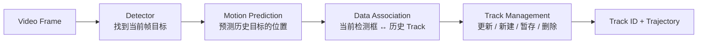
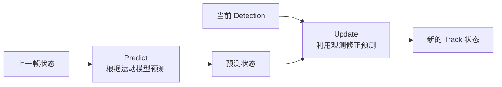
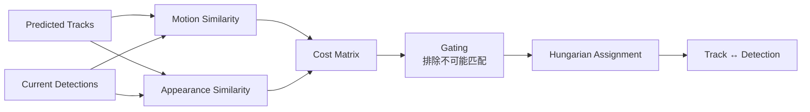
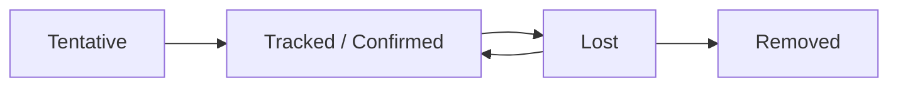
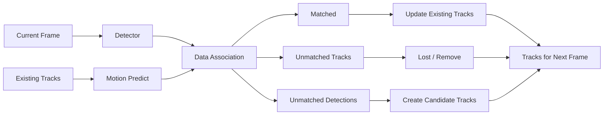
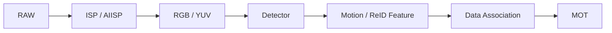

# 1 从“下一帧还是不是这个人”开始理解 MOT

假设连续三帧视频中有两个人：
```text
Frame 1              Frame 2              Frame 3

A        B             A      B             A       B
□        □             □      □             □       □
```

如果只有目标检测器，每一帧得到的是：

```text
Frame 1：person, person
Frame 2：person, person
Frame 3：person, person
```

检测器只回答：
> **这一帧哪里有人？**

但它不知道：

> Frame 2 左边的人，是不是 Frame 1 的那个 A？

MOT 要进一步输出：
```text
Frame 1：ID=1   ID=2
Frame 2：ID=1   ID=2
Frame 3：ID=1   ID=2
```

最终得到：

```text
ID=1：位置1 → 位置2 → 位置3 → ...
ID=2：位置1 → 位置2 → 位置3 → ...
```

也就是 **Trajectory（轨迹：同一个目标随时间形成的一串状态）**。

现代 MOT 中非常重要的一类方法是 **Tracking-by-Detection（先检测、再跟踪）**：每帧先由 Detector 给出目标框，再由 Tracker 判断当前检测框与历史轨迹之间的对应关系。SORT、DeepSORT、ByteTrack 都属于这一基本思路。([arXiv](https://arxiv.org/pdf/1703.07402?utm_source=chatgpt.com "SIMPLE ONLINE AND REALTIME TRACKING WITH A DEEP ASSOCIATION METRIC"))



## 1.1 Detection 和 Tracking 的本质区别

一个目标检测结果通常只有：

```text
Bounding Box
Class
Confidence
```

例如：

```text
person
bbox = [x1, y1, x2, y2]
score = 0.92
```

而 Tracking 还必须回答：

```text
这个 person 是谁？
```

于是增加：

```text
Track ID = 17
```

所以：

```text
Detection：
这一帧有什么？

Tracking：
这一帧的目标，和过去哪个目标是同一个？
```

这也是为什么：
> **即使每一帧 Detection 都正确，MOT 仍然可能失败。**

例如两个人交叉：
```text
Before:

ID 1  →      ←  ID 2


Crossing:

       X


After:

ID 2  →      ←  ID 1
```

如果 Tracker 把两个人的身份交换，就发生：

**ID Switch（身份切换：同一个真实目标被错误地分配了另一个 Track ID）**。

## 1.2 MOT 真正困难的地方

视频中经常出现：
```text
遮挡
Motion Blur
漏检
误检
目标交叉
目标尺度变化
相机运动
目标外观相似
```

所以问题不能简单写成：

```text
上一帧最近的框
=
当前目标
```

Tracker 必须同时利用：
```text
目标过去在哪里
目标往哪里运动
当前检测框在哪里
目标看起来像不像
目标最近是否消失过
```

DeepSORT 正是在 SORT 的运动匹配基础上引入 Appearance（外观）信息，以提高遮挡情况下的身份保持能力。([arXiv](https://arxiv.org/abs/1703.07402 "[1703.07402] Simple Online and Realtime Tracking with a Deep Association Metric"))


一条 Track 本质上就是目标在时空中的一条轨迹。

# 2 一个目标在 Tracker 中到底是什么

如果上一帧检测到：

```text
ID 7
┌─────────┐
│ person  │
└─────────┘
```

最简单的 Tracker 可以只保存：

```text
Track 7:
bbox = [...]
```

但下一帧如果检测器漏掉这个人，就什么信息都没有了。

因此实际的 Track 不能只是一个 Bounding Box。

可以把 **Track（轨迹对象：Tracker 内部对一个真实目标的持续状态估计）**理解为：

```text
Track
├── ID
├── 当前位置
├── Bounding Box 尺寸
├── 运动速度
├── 位置预测的不确定性
├── Appearance Feature
└── 生命周期状态
```

其中并不是所有 Tracker 都会保存全部字段，但这个结构能帮助理解现代 Tracking 系统。

## 2.1 Bounding Box 只是观测结果

例如当前 Detector 给出：

```text
x = 400
y = 250
w = 80
h = 180
```

它描述的是：
> **当前这一帧检测器认为目标在哪里。**

但 Track 需要描述的是：
> **根据过去所有信息，我认为这个目标现在在哪里，以及下一帧可能去哪里。**

因此需要加入速度：
```text
Position:
x, y

Velocity:
vx, vy
```

于是即使下一帧没有检测结果，仍然可以预测：
```text
x_next ≈ x + vx
y_next ≈ y + vy
```

这就是下一章 Motion Model 的基础。

## 2.2 Appearance Feature

假设两个行人：

```text
Person A：黑衣服
Person B：白衣服
```

仅比较位置可能出现：

```text
A 和 B 交叉
↓
两个 Bounding Box 非常接近
↓
无法只靠位置判断身份
```

于是可以给每个目标提取一个：
**Appearance Feature（外观特征：神经网络把目标图像编码成一个特征向量，用于衡量两个目标在视觉上是否像同一个对象）**。

例如：
```text
Person A
↓
ReID Network
↓
[0.12, -0.44, 0.81, ...]
```

这里的 **ReID（Re-Identification，重识别：根据目标外观判断不同图像中的目标是否是同一个身份）**，在 DeepSORT 中被用于辅助 Data Association。([arXiv](https://arxiv.org/abs/1703.07402 "[1703.07402] Simple Online and Realtime Tracking with a Deep Association Metric"))

因此：

```text
Motion：
你应该在这里

Appearance：
你应该长这样
```

两者结合会比只依赖其中一个稳健。

## 2.3 Track 还要保存“不确定性”

假设目标刚刚被检测到：

```text
位置非常可信
```

连续漏检 10 帧后：

```text
预测位置越来越不可信
```

所以：

```text
预测位置 = (500, 300)
```

还不够。

Tracker 最好同时知道：

```text
我认为在 (500,300)
但误差可能有多大？
```

这个“不确定性”正是 Kalman Filter 中 **Covariance（协方差：描述状态估计的不确定程度以及不同状态变量之间误差关系）**的作用。

## 2.4 Track 最重要的认知

不要把 Track 理解成：
```text
一个框
```

应该理解成：
```text
一个关于真实目标的“持续假设”

过去在哪
+
现在在哪
+
往哪走
+
长什么样
+
现在还可信不可信
+
它是谁
```


# 3 Motion Model：下一帧目标会在哪里

现在有一个 Track：
```text
Frame t

          □
         ID=7
```

下一帧检测器得到三个框：
```text
Frame t+1

□              □

        □
```

在真正做匹配之前，一个自然的问题是：
> ID=7 下一帧大概应该出现在哪里？

这就是 **Motion Model（运动模型：利用目标过去的状态预测下一时刻状态）**。

SORT、DeepSORT 和 ByteTrack 等经典 tracking-by-detection 方法都使用过 Kalman Filter 进行运动状态预测。([arXiv](https://arxiv.org/pdf/1703.07402?utm_source=chatgpt.com "SIMPLE ONLINE AND REALTIME TRACKING WITH A DEEP ASSOCIATION METRIC"))

## 3.1 最简单的 Constant Velocity Model

假设 Track 状态为：

$$
\mathbf{x} [c_x,c_y,w,h,v_x,v_y,v_w,v_h]^T
$$

其中：

```text
cx, cy
→ Bounding Box 中心

w, h
→ 宽高

vx, vy
→ 中心运动速度

vw, vh
→ 尺寸变化速度
```

假设相邻两帧间隔 $\Delta t=1$。

那么：

$$
c_{x,t+1}=c_{x,t}+v_{x,t}
$$

$$
c_{y,t+1}=c_{y,t}+v_{y,t}
$$

例如过去：

```text
Frame 1：x = 100
Frame 2：x = 110
```

可以估计：
```text
vx ≈ 10 pixel/frame
```

那么：

```text
Frame 3 predicted x ≈ 120
```

于是 Tracker 不再需要拿 Track 和整张图的所有 Detection 盲目比较。

## 3.2 为什么还需要 Kalman Filter

真实世界并不是严格匀速：

```text
目标可能加速
检测框会抖动
Detector 有定位误差
目标可能突然转向
```

所以：Motion Model 的预测和 Detector 的观测都不完全可靠。

**Kalman Filter（卡尔曼滤波：在运动模型预测和带噪声观测之间，根据双方的不确定性进行加权融合）**解决的就是这个问题。

整个思想只有两个阶段：



---

## 3.3 Predict：先相信运动模型

状态预测写成：
$$
\mathbf{x}^{-}_t=F\mathbf{x}_{t-1}
$$

这里：
- $\mathbf{x}_{t-1}$：上一帧状态；
- $F$：运动模型；
- $\mathbf{x}^{-}_t$：看到当前检测结果之前的预测。

同时预测不确定性：

$$
P^{-}_t=FP_{t-1}F^T+Q
$$

其中：
- $P$：状态的不确定性；
- $Q$：运动模型自身的不确定性。

关键不是记公式，而是理解：
```text
连续没有真实观测
↓
只能一直预测
↓
不确定性 P 会逐渐增大
```

## 3.4 Update：Detection 来了以后修正

Detector 给出的 Bounding Box 是：

$$
\mathbf{z}_t
$$

先计算 Prediction 和 Detection 的差：

$$
\mathbf{r}_t \mathbf{z}_t-H\mathbf{x}^{-}_t
$$

$\mathbf{r}_t$ 叫 **Innovation / Residual（创新量：当前真实观测与预测观测之间的差）**。

例如：

```text
预测 x = 120
检测 x = 124
```

那么：

```text
Residual = 4
```

下一步不是直接：
```text
新的 x = 124
```

因为 Detection 本身也有噪声。

Kalman Filter 计算一个权重：

$$
K_t=P_t^-H^T(HP_t^-H^T+R)^{-1}
$$

其中 $R$ 是检测观测的不确定性。
最终：

$$
\mathbf{x}_t \mathbf{x}^{-}_t + K_t\mathbf{r}_t
$$

展开理解：
```text
新的状态
=
预测状态
+
一个权重 ×（观测 - 预测）
```

如果：
```text
预测非常可信
Detection 很抖
```

则更相信 Prediction。

反过来：
```text
预测已经很不确定
Detection 很可信
```

则更多地向 Detection 靠近。

这就是 Kalman Filter 真正值得理解的地方：

> **它不是简单平均，而是根据不确定性决定相信谁更多。**


## 3.5 Motion Model 如何帮助 Data Association

现在预测：

```text
ID=7 predicted box

        ┌─────┐
        │     │
        └─────┘
```

当前有三个 Detection：

```text
D1          D2          D3

□           □           □
```

如果 D2 与预测位置高度接近，那么：

```text
Track 7 ↔ D2
```

就比：

```text
Track 7 ↔ D1
Track 7 ↔ D3
```

合理得多。

所以 Motion Model 真正服务的是下一章：

> **减少 Data Association 的搜索空间，并提供“这个 Detection 属于这个 Track”的运动证据。**

---

## 3.6 Motion Model 的局限

假设摄像头突然横向移动：
```text
Frame t
目标都没动

Camera →
```

下一帧图像上所有目标的位置都会发生大幅变化。

但普通 Constant Velocity Model 可能认为：

```text
目标突然集体高速移动
```

所以：

> Motion Model 描述的是图像坐标中的运动，而图像运动可能同时来自“目标运动”和“相机运动”。

这也是为什么运动模型不能单独解决 MOT。

# 4 Data Association：当前框到底属于哪个 Track

这是 MOT 最核心的一步。

假设现在有三个历史 Track：

```text
T1
T2
T3
```

当前 Detector 给出：

```text
D1
D2
D3
```

Data Association 要解决：

```text
T1 ↔ ?
T2 ↔ ?
T3 ↔ ?
```

完整过程通常可以抽象成：



---

## 4.1 IoU：Intersection over Union, 两个 Bounding Box 重合多少

最简单的 Motion Association 可以使用 **IoU（Intersection over Union，交并比：两个 Bounding Box 重叠面积占总覆盖面积的比例）**。

两个框：

```text
┌────────────┐
│ Box A      │
│      ┌─────┼────┐
│      │█████│    │
└──────┼─────┘    │
       │    Box B │
       └──────────┘
```

先计算交集宽度：

$$
w_I \max \left( 0, \min(x^A_2,x^B_2)-\max(x^A_1,x^B_1) \right)
$$

交集高度：

$$
h_I \max \left( 0, \min(y^A_2,y^B_2)-\max(y^A_1,y^B_1) \right)
$$

所以交集面积：

$$
A_I=w_Ih_I
$$

两个框总覆盖区域不能直接：

$$
A_A+A_B
$$

因为交集部分会算两次。

因此：

$$
A_U=A_A+A_B-A_I
$$

最终：

$$
IoU=\frac{A_I}{A_U}
$$

范围：

```text
0
→ 完全不重合

1
→ 完全重合
```

通常可以把 Cost 写成：

$$
C_{IoU}=1-IoU
$$

于是：

```text
越像：
IoU 越大
Cost 越小
```

## 4.2 为什么 IoU 不够

考虑两个人交叉：

```text
Frame t:

A →        ← B


Frame t+1:

      A B
      □ □
```

预测框可能几乎重合。

于是：

```text
IoU(TA, DA) ≈ IoU(TA, DB)
```

仅靠位置无法判断。

这就是为什么 DeepSORT 在 SORT 基础上增加了视觉 Appearance Metric，用外观信息辅助 Measurement-to-Track Association。([arXiv](https://arxiv.org/abs/1703.07402 "[1703.07402] Simple Online and Realtime Tracking with a Deep Association Metric"))


## 4.3 Appearance Feature 怎么比较

假设 Track A 保存一个 ReID Feature：

$$
\mathbf{f}_A
$$

当前 Detection 提取 Feature：

$$
\mathbf{f}_D
$$

常见比较方式是 **Cosine Similarity（余弦相似度：比较两个特征向量方向是否接近）**：

$$
s= \frac{\mathbf{f}_A^T\mathbf{f}_D} {|\mathbf{f}_A||\mathbf{f}_D|}
$$

如果 Feature 已经归一化：

$$
|\mathbf{f}_A|=|\mathbf{f}_D|=1
$$

那么：

$$
s=\mathbf{f}_A^T\mathbf{f}_D
$$

可以进一步定义：

$$
C_{appearance}=1-s
$$

于是：

```text
长得越像
↓
Cosine Similarity 越大
↓
Appearance Cost 越小
```

DeepSORT 正是通过深度学习得到的 Appearance Feature 来增强 SORT 的关联能力。([arXiv](https://arxiv.org/abs/1703.07402 "[1703.07402] Simple Online and Realtime Tracking with a Deep Association Metric"))

## 4.4 Cost Matrix：把所有候选关系一次列出来

假设有三个 Track 和三个 Detection：

```text
        D1    D2    D3
T1      ?     ?     ?
T2      ?     ?     ?
T3      ?     ?     ?
```

分别计算 Cost：

```text
        D1     D2     D3

T1     0.10   0.80   0.95
T2     0.85   0.15   0.75
T3     0.90   0.65   0.12
```

这就是：

**Cost Matrix（代价矩阵：每个历史 Track 与每个当前 Detection 配对所需要付出的代价）**。

一眼可以看出：

```text
T1 ↔ D1
T2 ↔ D2
T3 ↔ D3
```

## 4.5 Motion 和 Appearance 可以组合

一种常见思想是：

$$
C_{ij} \lambda C^{motion}_{ij} + (1-\lambda)C^{appearance}_{ij}
$$

这里不是说所有 Tracker 都必须这么做，而是表达一种基本思想：

```text
Motion：
位置像不像

Appearance：
外观像不像
```

如果两方面都支持：

```text
很可能是同一个目标
```

如果：

```text
位置很近
但外观完全不同
```

就应该保持警惕。

---

## 4.6 Gating：先排除根本不可能的匹配

假设：

```text
Track A 在图像左上角
Detection D 在右下角
```

即使 Appearance Feature 偶然相似，也不应该匹配。

所以通常先做：

**Gating（门控：根据运动或距离约束提前禁止明显不合理的 Track–Detection 配对）**。

概念上就是：

```text
如果距离太大：

Cost(T1,D3) = ∞
```

这样 Assignment 算法根本不会选择这个配对。

DeepSORT 中还利用运动状态的不确定性进行距离约束，并结合 Appearance Metric 完成匹配。([arXiv](https://arxiv.org/abs/1703.07402 "[1703.07402] Simple Online and Realtime Tracking with a Deep Association Metric"))

## 4.7 Hungarian Algorithm：不是分别选最近，而是全局匹配

如果：
```text
T1 最喜欢 D1
T2 也最喜欢 D1
```

显然：

```text
D1
```

不能同时属于两个 Track。

所以问题是：

> 找到一组一一对应关系，使总代价最小。

也就是：

$$
\min \sum_{(i,j)\in M} C_{ij}
$$

其中：

```text
M = 最终匹配集合
```

这就是 **Linear Assignment Problem（线性指派问题）**。

**Hungarian Algorithm（匈牙利算法：寻找最小总代价一一匹配方案的经典算法）**用于求这个问题。SORT/DeepSORT/ByteTrack 的关联流程中都能看到线性分配或 Hungarian Matching。([arXiv](https://arxiv.org/abs/1703.07402 "[1703.07402] Simple Online and Realtime Tracking with a Deep Association Metric"))

最重要的认知不是算法内部每一步，而是：
> **它不是让每个 Track 独立选自己最喜欢的 Detection，而是从全局找到一组互不冲突的最优匹配。**

## 4.8 ID Switch 是怎么产生的

假设：

```text
真实：
A → A
B → B
```

结果却：
```text
Track 1 → B
Track 2 → A
```

就是 ID Switch。

最常见的因果链可以抽象成：
```text
遮挡 / 模糊 / 检测错误
↓
Motion Prediction 不准
或 Appearance 不可靠
↓
Cost Matrix 中错误匹配代价更低
↓
Assignment 选错
↓
ID Switch
```

所以 MOT 的核心问题最终高度集中在：
> **如何构造更可靠的 Association Cost。**

# 5 Track Management：匹配不上以后怎么办

Data Association 完成后，一定会出现三种结果：

```text
① Track ↔ Detection 成功匹配

② Track 没有 Detection

③ Detection 没有 Track
```

这时候就进入：

**Track Management（轨迹管理：决定目标什么时候创建、保留、丢失、重新激活或删除）**。

## 5.1 匹配成功
最简单：
```text
Track 7
+
Detection D3
↓
Kalman Update
↓
Track 7 更新位置
↓
继续保持 ID=7
```

如果使用 Appearance：
```text
Detection Feature
```

通常还可以用于更新 Track 的外观信息。

## 5.2 Detection 没匹配到任何 Track
例如有人第一次进入画面：
```text
已有 Tracks：
T1 T2

Current Detections：
D1 D2 D3

结果：
T1 ↔ D1
T2 ↔ D2

D3 unmatched
```

D3 很可能是：
```text
新进入画面的真实目标
```

所以可以创建：
```text
New Track ID=3
```

但问题是：
```text
D3 也可能只是 False Positive
```

因此一些 Tracker 会先把新轨迹设成：

**Tentative Track（候选轨迹：刚出现、尚未积累足够连续证据的 Track）**。

连续成功匹配几次后才升级为 Confirmed。

否则一个单帧误检就可能产生大量假 Track。

## 5.3 Track 没匹配到 Detection

这是更重要的情况。

例如：
```text
Frame 1：ID7 可见
Frame 2：ID7 可见
Frame 3：被人遮住
```

如果：
```text
没检测到
→ 立即删除 Track
```

那么 Frame 4 再出现时：
```text
旧 ID7 已不存在
↓
创建 ID12
```

同一个人就变成了两个身份。

所以不能立即删除。

## 5.4 Lost Track

一种典型状态流：



**Lost（丢失状态：当前没有匹配 Detection，但系统暂时保留这个 Track，等待目标重新出现）**。

此时：

```text
没有 Detection
↓
仍然用 Motion Model 预测
↓
保留 Track ID
```

如果几帧后重新检测到：

```text
Appearance / Motion 又能匹配
↓
Lost → Tracked
```

身份可以继续使用原来的 ID。

ByteTrack 也会保留 unmatched tracks 一段时间作为 lost tracks，以支持后续身份恢复，而不是一旦某帧没匹配就立即销毁。([arXiv](https://arxiv.org/abs/2110.06864 "ByteTrack: Multi-Object Tracking by Associating Every Detection Box"))

## 5.5 为什么 Lost 不能永远保留

如果目标已经真正离开画面：

```text
Track 7
```

一直保留就会造成：

```text
大量历史 Track
↓
每帧都参与 Association
↓
误匹配风险增加
↓
计算增加
```

因此 Track 通常存在一个：

```text
age / time_since_update
```

如果长期没观测：

```text
Lost
↓
超过最大存活时间
↓
Removed
```

## 5.6 完整 Tracking Loop

现在整个 MOT 已经可以串起来：



这就是 Tracking-by-Detection 的核心循环。


# 6 从 SORT 到 DeepSORT、ByteTrack：它们到底改了什么

学到这里，不需要把每一种 Tracker 当成全新的系统。

它们大多都在解决前面某个具体缺陷。

## 6.1 SORT：先建立最基本骨架

**SORT（Simple Online and Realtime Tracking）**可以粗略理解成：

```text
Detector
↓
Kalman Filter
↓
预测 Track
↓
IoU Cost
↓
Hungarian Assignment
↓
Track Management
```

它的重要意义在于说明：

> 一个非常简单的 Motion + Assignment 框架就能构建在线实时 MOT。

SORT 论文强调在线、实时、高效的目标关联，并指出 Detector 的质量会显著影响 Tracking 效果。([arXiv](https://arxiv.org/abs/1602.00763 "Simple Online and Realtime Tracking"))

它的优势：

```text
简单
快
容易实现
```

但问题也明显：

```text
主要依赖位置 / IoU
↓
发生遮挡、交叉
↓
Motion 信息不够
↓
容易 ID Switch
```

## 6.2 DeepSORT：加入“这个人长什么样”

DeepSORT 的核心升级可以压缩成：

```text
SORT
+
Appearance Feature / ReID
```

原来：

```text
是不是同一个目标？
↓
主要看位置
```

现在：

```text
是不是同一个目标？
↓
位置是否合理
+
外观是否相似
```

DeepSORT 论文明确将深度 Appearance Metric 集成进 SORT，通过 Visual Appearance Space 进行关联，以增强长时间遮挡情况下的身份保持。([arXiv](https://arxiv.org/abs/1703.07402 "[1703.07402] Simple Online and Realtime Tracking with a Deep Association Metric"))

所以：

```text
SORT：
你应该在这里。

DeepSORT：
你应该在这里，
而且你应该长这样。
```

这就是最核心的区别。

## 6.3 ByteTrack：不要把低分 Detection 全部扔掉

再考虑一个问题。

某个人被遮挡：

```text
正常：
Detection score = 0.9

部分遮挡：
score = 0.4
```

传统做法可能设置：

```text
score < 0.5
→ 丢掉
```

结果：
```text
这个人实际上还在
↓
Detector 也找到了
↓
只是置信度较低
↓
但检测框被直接删除
↓
Track 断掉
```

ByteTrack 的关键观察就是：

> **低置信度 Detection 中不全是背景，其中可能包含被遮挡或模糊的真实目标。**

它因此不是简单丢弃低分框，而是做两轮 Association。([arXiv](https://arxiv.org/abs/2110.06864 "ByteTrack: Multi-Object Tracking by Associating Every Detection Box"))

## 6.4 ByteTrack 两阶段 Association

先将 Detection 分：

```text
High-score Detections
Low-score Detections
```

### 第一轮
```text
全部 Tracks
+
High-score Detections
↓
Association
```

正常、高可信目标先匹配。

第一轮结束会剩下一些：

```text
Unmatched Tracks
```

### 第二轮

再：
```text
Unmatched Tracks
+
Low-score Detections
↓
Second Association
```

例如：
```text
Track 17：
预测这里应该还有一个人

低分框 D：
位置刚好吻合
```

那么：
```text
Track 17 ↔ Low-score D
```

就可以把被遮挡目标重新找回来。

ByteTrack 的论文描述了先关联高分框，再用剩余 Track 与低分框做第二次 Association；在第二阶段，论文采用运动相似性/IoU，而不是依赖低质量框的 Appearance Feature。([arXiv](https://arxiv.org/abs/2110.06864 "ByteTrack: Multi-Object Tracking by Associating Every Detection Box"))

## 6.5 为什么低分 Detection 不直接创建新 Track

这是 ByteTrack 思想中很关键的一环。

低分框里面同时包含：

```text
被遮挡真实目标
+
背景 False Positive
```

所以：

```text
低分框 + 已存在 Track 匹配成功
```

可以认为它获得了历史证据。

但：

```text
低分框没有任何历史 Track
```

则更可能是噪声。

因此 ByteTrack 第二阶段会利用低分框恢复已有轨迹，而未匹配的低分框不会直接当作可靠新目标保留下来。([arXiv](https://arxiv.org/abs/2110.06864 "ByteTrack: Multi-Object Tracking by Associating Every Detection Box"))

## 6.6 三种算法的逻辑关系

他们不是完全独立的三个独立算法。

```text
SORT
│
│ 问题：只看 Motion，遮挡时身份容易丢
▼
DeepSORT
│
│ 增加 Appearance / ReID
│
│
│ 另一个问题：
│ 低分 Detection 直接被扔掉会断 Track
▼
ByteTrack
   充分利用低分 Detection 做第二次 Association
```

它们分别强调：

|方法|最值得记住的核心|
|---|---|
|SORT|Motion + IoU + Assignment|
|DeepSORT|增加 Appearance / ReID|
|ByteTrack|高分、低分 Detection 分阶段关联|

# 7 MOT 与 AIISP：为什么图像处理会影响跟踪

现在回到 AIISP。

完整链路不是：

```text
AIISP
→ 图片好不好看
```

对于机器视觉，它还可能是：



所以 AIISP 输出是后面所有视觉模块的输入。

SORT 的研究就已经指出 Detector 质量是影响总体 Tracking 性能的重要因素。([arXiv](https://arxiv.org/abs/1602.00763 "Simple Online and Realtime Tracking"))

## 7.1 AIISP 可能从两条路径影响 MOT

第一条：

```text
AIISP
↓
Detection
```

例如严重噪声、运动模糊或目标细节损失可能使：

```text
目标置信度降低
Bounding Box 不稳定
漏检增加
```

那么即使 Tracker 完全不变，MOT 也会受到影响。

第二条：

```text
AIISP
↓
Appearance Feature
↓
Data Association
```

如果 Tracker 使用 ReID Feature，那么目标纹理、颜色、边缘等视觉信息变化还会影响身份匹配。

这也是为什么从机制上推断，AIISP 的影响不应该只通过主观画质判断，而应该观察 Detector 和 Association 两条链路分别发生了什么。

## 7.2 Temporal Artifact 对 MOT 特别值得关注

单帧画质问题与时序问题不同。

例如某个边缘：

```text
Frame 1：位置 A
Frame 2：位置 A+2
Frame 3：位置 A-1
```

如果这种变化来自处理算法，而不是真实目标运动，那么下游看到的是：

```text
Bounding Box / Feature
不断变化
```

这可能同时影响：

```text
Motion Prediction
+
Appearance Matching
```

因此对于视频 AIISP，除了单帧 PSNR、主观纹理等指标，还应该关注：

> **同一个目标跨帧是否保持稳定。**

## 7.3 怎么衡量 MOT 好不好

不能只统计：

```text
检测对了多少框
```

因为 Tracking 还存在 Identity。

常见指标包括：

```text
MOTA
IDF1
HOTA
```

HOTA 的研究指出，MOTA 更偏向 Detection 侧，而 IDF1 更强调 Association；HOTA 的设计目标则是更平衡地衡量 Detection、Association 和 Localization。([arXiv](https://arxiv.org/abs/2009.07736 "HOTA: A Higher Order Metric for Evaluating Multi-Object Tracking"))

## 7.4 MOTA

**MOTA（Multiple Object Tracking Accuracy）**核心惩罚：
```text
FN  ：漏检
FP  ：误检
IDSW：身份切换
```

公式：

$$
MOTA 1- \frac{FN+FP+IDSW} {GT}
$$

其中：

```text
GT = Ground Truth 目标总数
```

所以如果：

```text
大量漏检
```

即使 ID 非常稳定，MOTA 也会下降。

HOTA 对历史指标的分析指出，MOTA 对 Detection Error 的权重较重，因此单看 MOTA 并不能完整说明身份关联质量。([arXiv](https://arxiv.org/abs/2009.07736 "HOTA: A Higher Order Metric for Evaluating Multi-Object Tracking"))

## 7.5 IDF1

**IDF1（Identity F1 Score）**更关注：

> 整条 Tracking 过程中，身份对应是否正确。

核心形式：

$$
IDF1= \frac{2IDTP} {2IDTP+IDFP+IDFN}
$$

可以把它理解成：
```text
检测框存在是一回事

这个框有没有被分配给
正确的长期身份
是另一回事
```

所以在研究：遮挡后有没有换 ID时，IDF1 比单纯 Detection 指标更有意义。HOTA 论文将 IDF1 描述为更偏重 Association 的历史指标。([arXiv](https://arxiv.org/abs/2009.07736 "HOTA: A Higher Order Metric for Evaluating Multi-Object Tracking"))

## 7.6 HOTA

**HOTA（Higher Order Tracking Accuracy）**尝试把 Tracking 拆得更清楚。

最核心两个组成：
```text
DetA
= Detection Accuracy

AssA
= Association Accuracy
```

在固定匹配阈值下，可以粗略理解其组合思想为：

$$
HOTA \approx \sqrt{DetA \times AssA}
$$

实际 HOTA 还会在不同 Localization Threshold 上进行计算和汇总。其设计重点是同时衡量 Detection 和 Association，而不是让其中一项完全主导总指标。([arXiv](https://arxiv.org/abs/2009.07736 "HOTA: A Higher Order Metric for Evaluating Multi-Object Tracking"))

这个拆分对于 AIISP 很有价值。

比如某次算法调整以后：

```text
DetA ↑
AssA ↓
```

可能意味着：
> 目标变得更容易检测，但跨帧身份特征反而不稳定。

反过来：
```text
DetA ≈
AssA ↑
```

则说明：
> 单帧检测没有明显变化，但时序身份关联变好了。

## 7.7 AIISP 中怎么做一个干净的 MOT 对比实验

如果目标是判断：
> AIISP A 和 AIISP B 哪个更适合下游 MOT？

最好固定：

```text
同一个视频
同一个 Detector
同一个 Tracker
同一套 Tracking 参数
```

只改变：

```text
ISP / AIISP 输出
```

然后至少同时观察：

```text
Detection：
FP / FN / DetA

Identity：
IDSW / IDF1 / AssA

整体：
HOTA
```

这样才能区分：

```text
是 Detector 变好了？

还是 Association 变好了？

还是单帧画质更漂亮，
但 Tracking 反而更差？
```

这也是 MOT 在 AIISP 中真正值得使用的地方：

> **它能把“画质变化”转化为“下游视觉任务是否真的受益”的测量。**

# 8 一句话总结

**MOT 的核心就是：利用 Motion 预测“目标应该在哪里”，利用 Appearance 判断“目标应该长什么样”，再通过 Data Association 和 Track Management 在连续视频中持续维持正确的目标身份。**