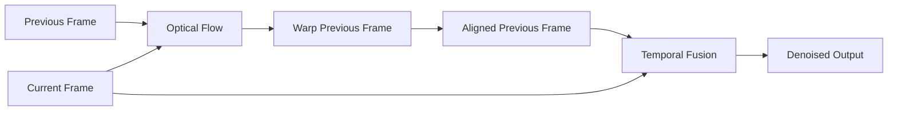

光流要解决的问题很具体：
> 给定视频中相邻两帧，第一帧里的视觉内容在第二帧移动到了哪里？
## 1. 光流到底是什么

### 1.1 从一个点的移动开始

第一帧中，一个视觉点的位置记为：
$$
\mathbf{x}_1=(x,y)^\top
$$
第二帧中，它移动到：
$$
\mathbf{x}_2=(x',y')^\top
$$
从 Frame 1 到 Frame 2 的光流定义为：
$$
\mathbf{f}_{1\rightarrow2}(\mathbf{x}_1)=(u,v)^\top
$$
于是：
$$
\mathbf{x}_2=\mathbf{x}_1+\mathbf{f}_{1\rightarrow2}(\mathbf{x}_1)
$$
展开就是：
$$
x'=x+u
$$
$$
y'=y+v
$$
因此：
$$
u=x'-x
$$
$$
v=y'-y
$$
其中 $u$ 表示水平方向位移，$v$ 表示垂直方向位移。

**Optical Flow，光流**：图像平面中视觉结构随时间产生的二维表观运动。

这里“表观”非常重要。真实世界中的物体发生的是三维运动：

$$
(X,Y,Z)\rightarrow(X',Y',Z')
$$

但相机最终观察到的是三维场景投影到二维成像平面后的变化：

$$
(x,y)\rightarrow(x',y')
$$

因此 Optical Flow 不是直接恢复物体的三维真实速度，而是恢复：

$$
\text{3D motion 在 2D image plane 上造成的 apparent motion}
$$
例如，当一个人直接朝摄像机走来时，真实运动可能主要沿深度方向，但图像中的光流会表现成人体区域向外扩张。

### 1.2 Flow Vector 与 Flow Field
对于一个像素：
$$
\mathbf{f}(x,y)=(u(x,y),v(x,y))^\top
$$

如果图像大小为 $H\times W$，并为每个像素都估计 $(u,v)$，就得到：

$$
F\in\mathbb{R}^{H\times W\times2}
$$

这叫 **Flow Field，光流场**：整幅图像所有二维运动向量组成的运动场。


如果背景静止，那么背景区域通常满足：

$$
u\approx0
$$

$$
v\approx0
$$

运动物体区域则会出现明显的非零向量。

根据估计位置多少，可以区分：
- **Sparse Optical Flow，稀疏光流**：只在少量角点或特征点上估计运动。
- **Dense Optical Flow，稠密光流**：希望为几乎所有像素估计运动。

Lucas–Kanade 最经典的使用方式偏向稀疏特征跟踪，而 Horn–Schunck、PWC-Net、RAFT 更直接面向稠密光流。

### 1.3 真实 Optical Flow 为什么经常是一张彩色图

模型真正输出的通常是每个像素的二维位移：

$$
F(x,y)=(u,v)
$$

其中 $u$ 表示水平运动，$v$ 表示垂直运动。

为了把两个数 $(u,v)$ 压缩成一个人眼容易观察的颜色，通常先把它改写成“方向 + 大小”。

#### 第一步：$(u,v)$ 转成运动大小

$$
m=\sqrt{u^2+v^2}
$$

$m$ 表示这个像素移动了多远。

例如：
$$
(u,v)=(3,4)
$$

则：

$$
m=5
$$

#### 第二步：$(u,v)$ 转成运动方向

$$
\theta=\operatorname{atan2}(v,u)
$$

$\theta$ 表示 Flow Vector 在二维平面上的方向。

因此同一个 Flow：

$$
(u,v)
$$

也可以理解成：

$$
(m,\theta)
$$

接下来就可以把这两个量映射到颜色。

#### 方向决定 Hue(色相)，大小决定颜色强度

一种常见 Optical Flow Color Coding 使用 HSV 色彩空间：
```
Flow direction theta
        |
        v
Hue

Flow magnitude m
        |
        v
Saturation / brightness
```

> 在 HSV 颜色空间里：
> - **H = Hue**：颜色种类 / 色相
> - **S = Saturation**：饱和度，颜色有多“纯”、多鲜艳
> - **V = Value**：明亮程度

因此：
> **颜色种类主要告诉你“往哪个方向运动”，颜色强弱主要告诉你“移动得有多快/多远”。**


Color Wheel 可以把它理解成一个“Flow 字典”。

假设采用这张图中的编码规则，那么从圆心向不同方向走，就对应不同的 Flow Direction。

例如：
```
向右运动
-> 一种颜色

向左运动
-> 与它大致相反的颜色

向上运动
-> 另一种颜色

向下运动
-> 与它大致相反的颜色
```
具体哪一个方向对应红色、蓝色、绿色，**取决于使用的 Color Wheel Convention**，所以不要脱离 Color Wheel 死记“红色一定向右”。看论文时应该同时确认作者采用的 flow-color convention。

所以看一张 Color Flow 图时，可以先记住：
> **接近白色通常表示位移很小；颜色越鲜艳，通常表示位移越大。**


#### 一张真实 Flow 图应该怎么看

假设你看到：


不要首先看“这个地方是什么颜色”，而应该按下面顺序解读：

```
第一步：
看同一区域颜色是否一致
        |
        v
判断是否属于近似相同运动

第二步：
对照 Color Wheel
        |
        v
判断运动方向

第三步：
看颜色饱和程度
        |
        v
判断位移大小

第四步：
观察颜色突变位置
        |
        v
寻找 Motion Boundary
```

例如，一个运动物体内部颜色比较统一，说明 $(u,v)$ 在物体内部变化较小。

而物体边界处，如果颜色突然从一种颜色变成完全不同的颜色，则意味着：
$$
\mathbf{f}_{foreground}\neq\mathbf{f}_{background}
$$
这个位置就是 **Motion Boundary（运动边界：前景与背景拥有不同运动的空间边界）**。

所以 Color Flow 图不仅方便看运动方向，也很适合观察：
- 前景与背景是否拥有不同运动；
- Motion Boundary 是否清晰；
- 小物体 Flow 是否被抹掉；
- Flow Field 是否出现异常不连续；
- 大运动区域在哪里。

#### 为什么不能直接把 $(u,v)$ 当 RGB
因为 RGB 有三个通道：

$$
(R,G,B)
$$
而 Flow 只有两个分量：
$$
(u,v)
$$
更关键的是，Flow 的几何结构是二维向量，最自然的属性是：
$$
\text{Direction}+\text{Magnitude}
$$
而 HSV 本身恰好提供：
```
Hue
-> circular quantity
-> 很适合表示方向

Saturation / Value
-> scalar quantity
-> 很适合表示运动大小
```

因此 Color Wheel 并不是随便“染色”，而是在利用颜色空间把二维向量的几何含义编码成人眼容易观察的形式。
这一节的核心可以记成：

$$
(u,v)\rightarrow(m,\theta)\rightarrow(\text{color strength},\text{hue})
$$

其中：

$$
m=\sqrt{u^2+v^2}
$$

$$
\theta=\operatorname{atan2}(v,u)
$$

**一句话：Flow 图中的色相主要表示运动方向，颜色强度主要表示运动大小，因此读彩色 Optical Flow 时必须配合 Color Wheel，而不能把颜色当作物体本身的 RGB。**

### 本章总结

光流描述相邻帧之间的二维表观运动。单个位置的光流是 $(u,v)$，整张图的光流组成 $H\times W\times2$ 的 Flow Field。它回答“第一帧里的视觉内容下一帧去了哪里”，但它不是三维世界中的真实速度。

## 2. 两张图为什么能够推出运动

现在真正的问题是：

> 两张普通图片只有像素值，我们为什么能从像素变化推断出 $(u,v)$？

经典 Optical Flow 从一个关键假设开始。

### 2.1 Brightness Constancy：跟着运动点走，亮度近似不变
设：

$$
I(x,y,t)
$$

表示时间 $t$ 时，位置 $(x,y)$ 的图像亮度。

假设一个场景点在图像平面上的速度是 $(u,v)$。

经过很短时间 $\Delta t$ 后，它移动到：

$$
(x+u\Delta t,\ y+v\Delta t)
$$

**Brightness Constancy Assumption，亮度恒常假设**：同一个场景点在很短的运动时间内，其图像亮度近似保持不变。

因此：

$$
I(x,y,t)=I(x+u\Delta t,y+v\Delta t,t+\Delta t)
$$

它不是：

$$
I(x,y,t)=I(x,y,t+\Delta t)
$$

后者比较的是同一个固定图像坐标。

真正的意思是沿着运动点的轨迹观察：

```text
(x, y, t)
    |
    | follow motion
    v
(x + dx, y + dy, t + dt)
```


图中的亮度结构随时间向右移动。因此固定 $x$ 的亮度会变化，但沿斜向运动轨迹观察时，可以持续跟踪同一个亮度结构。

### 2.2 为什么需要 Taylor 展开
亮度恒常条件右侧：

$$
I(x+u\Delta t,y+v\Delta t,t+\Delta t)
$$

同时包含未知的 $u,v$。

为了得到一个容易求解的方程，经典 Optical Flow 假设：
> 相邻帧之间的位移足够小。

这样可以在 $(x,y,t)$ 附近做一阶 Taylor 展开：

$$
I(x+u\Delta t,y+v\Delta t,t+\Delta t) \approx I(x,y,t)+I_xu\Delta t+I_yv\Delta t+I_t\Delta t
$$

其中：

$$
I_x=\frac{\partial I}{\partial x}
$$

$$
I_y=\frac{\partial I}{\partial y}
$$

$$
I_t=\frac{\partial I}{\partial t}
$$

分别表示图像在水平、垂直和时间方向上的局部变化率。


一阶 Taylor 本质上是在说：
> 如果只移动很小一段距离，可以用当前位置的局部斜率近似真实函数。

但如果一次移动几十个像素，目标位置已经离开这个局部区域，一阶近似就可能完全错误。

### 2.3 推导 Optical Flow Constraint Equation
把 Taylor 近似代回亮度恒常条件：

$$
I(x,y,t) = I(x,y,t)+I_xu\Delta t+I_yv\Delta t+I_t\Delta t
$$

两边减去 $I(x,y,t)$：

$$
I_xu\Delta t+I_yv\Delta t+I_t\Delta t=0
$$

再除以 $\Delta t$：

$$
I_xu+I_yv+I_t=0
$$

这就是 **Optical Flow Constraint Equation，光流约束方程**。

也可以写成：

$$
I_xu+I_yv=-I_t
$$

它表达的直觉是：
> 图像的空间亮度变化，与图像结构的运动结合起来，可以解释固定像素位置观察到的时间亮度变化。

### 2.4 一个像素为什么还是算不出二维运动
观察：

$$
I_xu+I_yv=-I_t
$$

对当前像素而言：
- $I_x$ 已知；
- $I_y$ 已知；
- $I_t$ 已知；
- $u$ 未知；
- $v$ 未知。

所以：

$$
1\text{ 个方程}
$$

却对应：

$$
2\text{ 个未知量}
$$

例如：

$$
2u+v=5
$$

既可以：

$$
u=2,\quad v=1
$$

也可以：

$$
u=1,\quad v=3
$$

还有无穷多解。

在 $(u,v)$ 平面中：

$$
I_xu+I_yv=-I_t
$$

其实是一条直线。


因此一个像素只能告诉我们：
> 真正的光流一定在这条直线上。

却不能告诉我们具体是哪一个点。

### 2.5 Aperture Problem

这种欠定性在边缘区域尤其明显。

**Aperture Problem，孔径问题**：只观察一小段局部边缘时，只能确定运动在边缘法向方向上的分量，却无法确定沿边缘方向的运动。


图像梯度 $\nabla I$ 总是垂直于等亮度边缘。

而 $I_xu+I_yv$ 实际上只测量运动在梯度方向上的投影。

假设真实运动是 $\mathbf{f}$，再增加一个沿边缘方向的运动 $\mathbf{f}_{\parallel}$：

$$
\mathbf{f}'=\mathbf{f}+\mathbf{f}_{\parallel}
$$

因为沿边缘方向没有亮度变化：

$$
\nabla I\cdot\mathbf{f}_{\parallel}=0
$$

所以两种运动产生完全相同的光流约束。

这说明 Optical Flow 不能靠一个像素独立计算，必须加入额外约束。

### 本章总结

Brightness Constancy 假设同一个运动点在短时间内亮度近似不变；在 small-motion 条件下做 Taylor 展开，就得到 $I_xu+I_yv+I_t=0$。但一个像素只有一个方程，而二维运动包含 $u,v$ 两个未知量，因此问题天然欠定；Aperture Problem 正是这种信息不足的几何表现。

## 3. 一个方程两个未知量怎么办

现在 Optical Flow 的核心困难已经非常明确：

$$
I_xu+I_yv=-I_t
$$

信息不够。

经典方法必须回答：

> 额外信息从哪里来？

Lucas–Kanade 和 Horn–Schunck 给出了两种代表性答案。

### 3.1 Lucas–Kanade：从周围像素借方程

**Lucas–Kanade，LK**：一种局部图像配准方法，其核心假设是一个足够小的邻域中，所有像素拥有近似相同的二维运动。

单个像素：

$$
I_xu+I_yv=-I_t
$$

不够。

如果窗口中有 $N$ 个像素，就能得到：

$$
I_{x1}u+I_{y1}v=-I_{t1}
$$

$$
I_{x2}u+I_{y2}v=-I_{t2}
$$

$$
\cdots
$$

$$
I_{xN}u+I_{yN}v=-I_{tN}
$$

虽然不能用一个像素求 $u,v$，但如果这些像素都共享同一个运动，就相当于：

```text
1 unknown flow vector
+
many pixel constraints
```

从欠定问题变成超定问题。


图右侧每一条直线代表一个像素提供的约束。

如果窗口中包含多个不同方向的图像梯度，这些直线就会在真实运动附近汇聚。

### 3.2 最小二乘怎样得到 Flow

现实图像存在噪声，所以不同像素的约束通常不会严格交于一点。

因此定义误差：

$$
E(u,v) = \sum_i \left( I_{xi}u+I_{yi}v+I_{ti} \right)^2
$$

目标是：

$$
\min_{u,v}E(u,v)
$$

分别对 $u$ 和 $v$ 求导。

对 $u$：

$$
\frac{\partial E}{\partial u} = 2\sum_i I_{xi} \left( I_{xi}u+I_{yi}v+I_{ti} \right)
$$

令其等于 0：

$$
\sum_i I_{xi}^2u + \sum_i I_{xi}I_{yi}v = -\sum_i I_{xi}I_{ti}
$$

再对 $v$：

$$
\frac{\partial E}{\partial v} = 2\sum_i I_{yi} \left( I_{xi}u+I_{yi}v+I_{ti} \right)
$$

令其等于 0：

$$
\sum_i I_{xi}I_{yi}u + \sum_i I_{yi}^2v = -\sum_i I_{yi}I_{ti}
$$

为了简化，定义：

$$
S_{xx}=\sum_i I_{xi}^2
$$

$$
S_{yy}=\sum_i I_{yi}^2
$$

$$
S_{xy}=\sum_i I_{xi}I_{yi}
$$

$$
S_{xt}=\sum_i I_{xi}I_{ti}
$$

$$
S_{yt}=\sum_i I_{yi}I_{ti}
$$

于是得到两个方程：

$$
S_{xx}u+S_{xy}v=-S_{xt}
$$

$$
S_{xy}u+S_{yy}v=-S_{yt}
$$

现在拥有两个独立方程，可以求两个未知量 $u,v$。

定义：

$$
\Delta=S_{xx}S_{yy}-S_{xy}^2
$$

如果：

$$
\Delta\neq0
$$

则：

$$
u= \frac{ S_{xy}S_{yt}-S_{yy}S_{xt} }{ \Delta }
$$

$$
v= \frac{ S_{xy}S_{xt}-S_{xx}S_{yt} }{ \Delta }
$$

这就是 Lucas–Kanade 局部解的核心。

### 3.3 为什么不是所有区域都能使用 LK

问题关键变成：
> 什么情况下 $\Delta$ 足够大，使 $u,v$ 能稳定求解？

局部窗口的梯度信息通常用 **Structure Tensor，结构张量** 描述。这里不需要记住矩阵形式，只需要理解它最终衡量：
> 当前窗口在两个不同方向上分别有多少图像变化。

它有两个主要特征值：

$$
\lambda_1
$$

$$
\lambda_2
$$

可以简单理解成两个主要方向的有效梯度信息量。


#### Flat Region

如果是一块纯色墙：

$$
I_x\approx0
$$

$$
I_y\approx0
$$

于是：

$$
\lambda_1\approx0
$$

$$
\lambda_2\approx0
$$

两个方向都没有足够信息。

#### Single Edge

如果窗口中只有一条边缘：

$$
\lambda_1\gg0
$$

$$
\lambda_2\approx0
$$

只能确定一个方向，Aperture Problem 依然存在。

#### Corner

如果是角点或者丰富纹理区域：

$$
\lambda_1\gg0
$$

$$
\lambda_2\gg0
$$

两个方向都有足够信息。

因此二维运动能够被稳定估计。

这就是为什么 LK 经常与 Harris Corner、Shi–Tomasi 等角点检测一起使用：

> 一个“好追踪的特征”本质上必须在两个空间方向都有明显变化。

### 3.4 Horn–Schunck：从整张 Flow Field 借信息

Lucas–Kanade 的做法是：
> 一个像素信息不够，那就看邻域。

Horn–Schunck 则采用另一种思路：
> 一个像素信息不够，那就利用整幅运动场的空间规律。

它加入 **Smoothness Prior，平滑先验**：
> 除了物体边界之外，空间上相邻的位置通常具有相近运动。

Horn–Schunck 构造两个 Loss。

第一项是数据项：

$$
E_{\text{data}} = \iint \left( I_xu+I_yv+I_t \right)^2 dxdy
$$

它要求：

> Flow 能解释观察到的亮度变化。

第二项是平滑项：

$$
E_{\text{smooth}} = \iint \left( u_x^2+u_y^2+v_x^2+v_y^2 \right) dxdy
$$

如果两个相邻位置的 $u$ 或 $v$ 差异巨大，那么这些空间导数就会变大，从而受到惩罚。

最终：

$$
E = E_{\text{data}} + \alpha^2E_{\text{smooth}}
$$

即：

$$
E = \iint \left( I_xu+I_yv+I_t \right)^2 dxdy + \alpha^2 \iint \left( u_x^2+u_y^2+v_x^2+v_y^2 \right) dxdy
$$


$\alpha$ 控制两种要求的平衡。

如果 $\alpha$ 很小，Flow 更依赖图像观测，容易受噪声影响。

如果 $\alpha$ 很大，Flow 更追求平滑，Motion Boundary 可能被过度抹平。

所以 Horn–Schunck 本质上是在：

$$
\text{图像证据}
$$

和：

$$
\text{运动场先验}
$$

之间寻找折中。

### 3.5 Horn–Schunck 怎样迭代更新

完整的变分推导较长，这里保留最关键的更新形式。

假设当前迭代为 $k$，邻域平均 Flow 为：

$$
\bar{u}^k
$$

$$
\bar{v}^k
$$

更新可以写成：

$$
u^{k+1} = \bar{u}^k - I_x \frac{ I_x\bar{u}^k+I_y\bar{v}^k+I_t }{ \alpha^2+I_x^2+I_y^2 }
$$

$$
v^{k+1} = \bar{v}^k - I_y \frac{ I_x\bar{u}^k+I_y\bar{v}^k+I_t }{ \alpha^2+I_x^2+I_y^2 }
$$

理解流程：

```text
Neighbour flow
    |
    v
Average it
    |
    v
Use average as a smooth current guess
    |
    v
Check brightness residual
    |
    v
Correct flow using image gradient
    |
    v
New flow
```

所以 Horn–Schunck 不是简单把 Flow 模糊掉，而是不断在平滑先验和图像观测之间迭代协调。

### 3.6 Lucas–Kanade 与 Horn–Schunck 的核心区别

```text
Lucas-Kanade
One pixel is insufficient
        |
        v
Use nearby pixels
        |
        v
Assume local motion is constant
        |
        v
Solve local least squares

Horn-Schunck
One pixel is insufficient
        |
        v
Use the whole flow field
        |
        v
Assume nearby flow is smooth
        |
        v
Solve global optimization
```

两者都在解决：

$$
1\text{ 个约束}<2\text{ 个未知量}
$$

只不过补充信息的来源不同。

### 本章总结
Lucas–Kanade 假设一个小窗口共享运动，用多个像素的亮度约束组成最小二乘问题；它只有在两个方向都存在充分梯度时才稳定，因此角点优于单边缘和平坦区域。Horn–Schunck 则通过全局平滑先验连接所有像素，在亮度一致性与 Flow Field 平滑性之间寻找折中。

## 4. 真实视频为什么比前面的公式困难

前面的数学还有一个隐藏条件：
> 位移必须足够小。

因为 Optical Flow Constraint Equation 来自一阶 Taylor approximation。

现实视频中的物体却可能在相邻两帧移动几十甚至几百个像素。

### 4.1 Large Motion 为什么会导致失败
我们实际上把：

$$
I(x+u,y+v)
$$

近似成：

$$
I(x,y)+I_xu+I_yv
$$

这是一个局部近似。

如果 $u$ 很小，局部梯度通常还能描述目标附近的变化。

但如果：

$$
u=40
$$

真正对应位置已经距离当前位置 40 pixel，当前像素附近的梯度与远处结构很可能毫无关系。

所以 Large Motion 会破坏 small-motion linearization。

### 4.2 Image Pyramid：把大运动变成小运动

**Image Pyramid，图像金字塔**：逐层降低图像空间分辨率，使同一个真实运动在粗尺度中变成更小的 pixel displacement。

例如原图：

$$
32\text{ px}
$$

缩小 $2$ 倍后：

$$
16\text{ px}
$$

缩小 $4$ 倍：

$$
8\text{ px}
$$

缩小 $8$ 倍：

$$
4\text{ px}
$$


因此经典 coarse-to-fine Optical Flow 是：

```text
Full resolution
large displacement
        |
        v
Downsample
        |
        v
Coarse resolution
small displacement
        |
        v
Estimate coarse flow
        |
        v
Upsample flow
        |
        v
Refine at finer scale
```

这里和 Gaussian Pyramid / Laplacian Pyramid 的思想完全一致：

> 通过多尺度表示，把一个困难的大尺度问题转换成更容易的小尺度问题。

### 4.3 Flow 上采样为什么数值也要乘倍数

假设在 $1/4$ 尺度下：

$$
u_{\text{coarse}}=5
$$

这意味着在粗图上移动 5 pixel。

恢复到原图时，一个粗 pixel 对应 4 个原图 pixel，所以：

$$
u_{\text{full}}=5\times4=20
$$

因此 Flow Pyramid 的上采样不仅是 resize，还必须按尺度放大位移数值。

### 4.4 Warping：利用当前 Flow 消除已经解释掉的运动

**Warping，重采样对齐**：使用当前 Flow estimate，从另一帧的对应位置取样，把两帧先尽量对齐。

假设当前 Flow：

$$
\mathbf{f}_0(\mathbf{x})
$$

则把 Frame 2 warp 到 Frame 1 坐标系：

$$
I_2^w(\mathbf{x}) = I_2 \left( \mathbf{x}+\mathbf{f}_0(\mathbf{x}) \right)
$$

如果当前 Flow 比较准确：

$$
I_2^w(\mathbf{x})\approx I_1(\mathbf{x})
$$

此时剩余 Flow：

$$
\Delta\mathbf{f}
$$

会远小于原始运动。

最终：

$$
\mathbf{f} = \mathbf{f}_0+\Delta\mathbf{f}
$$


例如真实位移 30 px，当前 Flow 已经估计到 26 px。

Warp 以后剩余：

$$
30-26=4\text{ px}
$$

又重新回到了 small-motion 范围。

### 4.5 Pyramid 与 Warping 为什么经常同时出现

Pyramid 负责：
> 解决第一步搜索范围过大的问题。

Warping 负责：
> 已经得到粗略 Flow 后，让下一步只估计 residual flow。

完整流程：


### 4.6 PWC-Net：经典 Optical Flow 的神经网络版本

PWC-Net 的名字来自三个设计：
- **P**yramid；
- **W**arping；
- **C**ost Volume。

它不是把传统方法全部推翻，而是把经典设计变成可学习模块。


PWC-Net 的流程大致是：

```text
Frame 1 / Frame 2
        |
        v
Feature Pyramid
        |
        v
Estimate Coarse Flow
        |
        v
Upsample Flow
        |
        v
Warp Frame-2 Feature
        |
        v
Build Cost Volume
        |
        v
Estimate Residual Flow
        |
        v
Go to Finer Level
```

传统方法里的 Image Pyramid 变成 Learned Feature Pyramid。

传统 matching 变成 Cost Volume。

传统手工优化器变成 CNN Flow Estimator。

### 4.7 Occlusion：有些位置根本没有对应点

之前一直假设：

> Frame 1 中的一个点，在 Frame 2 中仍然可见。

真实视频不一定如此。

**Occlusion，遮挡**：某个场景点第一帧可见，但第二帧被其他物体挡住。

**Disocclusion，新显露区域**：第一帧被挡住的场景区域，在第二帧因为前景移动而重新出现。


在 Occlusion 区域，不存在正确的：

$$
I_1(\mathbf{x}) \leftrightarrow I_2(\mathbf{x}+\mathbf{f})
$$

因为第二帧根本找不到同一个可见场景点。

所以 Occlusion 不是“算法还不够准”，而是 Correspondence 本身不存在。

### 4.8 还有哪些情况会破坏经典假设

#### Illumination Change

正确对应点可能满足：

$$
I_1(\mathbf{x}) \neq I_2(\mathbf{x}+\mathbf{f})
$$

因为曝光、阴影、灯光发生变化。

#### Motion Blur

高速运动会导致一个像素混合多个空间位置的信息，局部外观不再是简单平移。

#### Textureless Region

墙面、天空等区域：

$$
I_x\approx0
$$

$$
I_y\approx0
$$

几乎没有匹配依据。

#### Repetitive Texture

栅栏、窗户等重复结构可能产生多个外观相似的候选位置。

这些困难解释了为什么现代 Optical Flow 越来越依赖 Learned Feature Matching，而不是只依赖 Raw Intensity。

### 本章总结
经典 Optical Flow 的 Taylor 线性化更适合 small motion。Image Pyramid 通过降低分辨率把大位移缩小，Warping 利用当前 Flow 主动对齐两帧，使下一轮只需要估计 residual flow。PWC-Net 将 Pyramid、Warping 和 Cost Volume 神经网络化；Occlusion、光照变化、模糊和重复纹理则说明，真实 Optical Flow 最核心的困难其实是可靠 Correspondence。

## 5. 现代深度 Optical Flow 在学习什么

现代网络看起来已经和：

$$
I_xu+I_yv+I_t=0
$$

没有太大关系。

但真正的核心问题完全没变：

> Frame 1 中这个位置，在 Frame 2 的哪里？

变化的是寻找 Correspondence 的方法。

### 5.1 从 Raw Intensity 变成 Learned Feature

经典方法比较：

$$
I_1(\mathbf{x})
$$

和：

$$
I_2(\mathbf{x}')
$$

现代方法首先提取：

$$
F_1=g_{\theta}(I_1)
$$

$$
F_2=g_{\theta}(I_2)
$$

**Feature，特征**：网络学习得到的多通道表示，希望同一个视觉内容即使受到一定光照、颜色或噪声变化，其特征仍然相似。

于是匹配问题变成：

$$
F_1(\mathbf{x}) \leftrightarrow F_2(\mathbf{x}')
$$

Optical Flow 的问题定义没有改变，只是比较空间从 Raw RGB / Intensity 变成 Learned Feature Representation。

### 5.2 Cost Volume：先保存所有候选 Match 的证据

Frame 1 有一个 Query Feature：

$$
F_1(\mathbf{x})
$$

Frame 2 中有很多候选位置：

$$
F_2(\mathbf{x}+\mathbf{d})
$$

一种简单相似度是内积：

$$
C(\mathbf{x},\mathbf{d}) = F_1(\mathbf{x}) \cdot F_2(\mathbf{x}+\mathbf{d})
$$

**Cost Volume / Correlation Volume，代价体 / 相关体**：保存某个位置与候选位置之间的匹配分数。


热力图最高峰意味着：

> 这个位置最像 Frame 1 的 Query Feature。

因此现代 Optical Flow 将“这个像素去了哪里”拆成：生成候选位置、计算匹配证据、选择最可能 Correspondence，再把坐标差转成 Flow。

### 5.3 PWC-Net 为什么使用 Local Cost Volume

PWC-Net 已经从 coarse level 获得 Flow estimate。

先 warp Frame-2 feature：

$$
F_2^w
$$

理想情况下，真正对应的位置已经被移动到当前坐标附近。

所以 fine level 不需要重新搜索整张图，只需要搜索一个局部范围。

这就是：

$$
\text{Coarse Flow} \rightarrow \text{Warp} \rightarrow \text{Local Cost Volume}
$$

之间的关系。

### 5.4 RAFT：直接计算 All-Pairs Correlation

RAFT 采用了不同路线。

假设：

$$
F_1(i,j)
$$

表示 Frame 1 位置 $(i,j)$ 的 Feature。

$$
F_2(k,l)
$$

表示 Frame 2 位置 $(k,l)$ 的 Feature。

RAFT 对任意像素对计算：

$$
C(i,j,k,l) = F_1(i,j)\cdot F_2(k,l)
$$

也就是说：

> Frame 1 每个位置与 Frame 2 每个位置之间的相似度都提前算出来。

这就是 **All-Pairs Correlation**。

RAFT 的官方结构图如下：


RAFT 的核心结构可以理解为：
1. Feature Encoder；
2. All-Pairs Correlation Volume；
3. Recurrent Update Operator。

### 5.5 为什么 Correlation 是 4D 的

Frame 1 位置需要两个坐标：

$$
(i,j)
$$

Frame 2 位置也需要两个：

$$
(k,l)
$$

所以一个 Matching Score 必须由四个坐标索引：

$$
C(i,j,k,l)
$$

如果 Feature Map 大小为 $H\times W$：

$$
C\in\mathbb{R}^{H\times W\times H\times W}
$$

这就是所谓的 4D Correlation Volume。

### 5.6 Correlation Pyramid 与 Image Pyramid 有什么区别

RAFT 对 Correlation Volume 做多尺度 pooling，得到多个尺度的匹配证据。

这样当前 Flow Query 可以同时观察：

```text
Fine correlation:
precise local matching

Coarse correlation:
large search range
```

这里需要和传统 Image Pyramid 区分：

```text
Image Pyramid:
multi-scale images / features

Correlation Pyramid:
multi-scale matching evidence
```

二者都用了多尺度思想，但被缩放的对象不同。

### 5.7 RAFT 为什么不一次预测最终 Flow

RAFT 初始化：

$$
\mathbf{f}_0=0
$$

第 $t$ 次迭代已经拥有：

$$
\mathbf{f}_t
$$

当前预测第二帧中的位置：

$$
\mathbf{x}'_t = \mathbf{x}+\mathbf{f}_t(\mathbf{x})
$$

然后根据这个位置去 Correlation Pyramid 中查询匹配证据。

Update Block 输出：

$$
\Delta\mathbf{f}_t
$$

再更新：

$$
\mathbf{f}_{t+1} = \mathbf{f}_t+\Delta\mathbf{f}_t
$$


整个过程就是：

```text
Current Flow
    |
    v
Predict Corresponding Position
    |
    v
Lookup Correlation Evidence
    |
    v
Predict Delta Flow
    |
    v
Flow = Flow + Delta Flow
    |
    +------ repeat
```

它和传统优化：

$$
x_{t+1}=x_t+\Delta x_t
$$

有非常强的对应关系。

不同的是：

> 经典方法通过数学推导更新规则，而 RAFT 用神经网络学习更新规则。

### 5.8 PWC-Net 与 RAFT 的差别

PWC-Net：

```text
Feature Pyramid
    |
    v
Coarse Flow
    |
    v
Warp
    |
    v
Local Cost Volume
    |
    v
Fine Flow
```

RAFT：

```text
Feature Maps
    |
    v
All-Pairs Correlation
    |
    v
Current Flow
    |
    v
Correlation Lookup
    |
    v
Recurrent Update
    |
    +------ repeat
```

PWC-Net 更接近传统 coarse-to-fine。

RAFT 更强调：

$$
\text{Global Matching Evidence} + \text{Iterative Refinement}
$$

但底层仍然是：

$$
\text{Correspondence} \rightarrow \text{Displacement}
$$

### 5.9 经典方法与现代方法的连接

| 经典 Optical Flow | 现代深度 Optical Flow |
|---|---|
| Brightness similarity | Learned feature similarity |
| Local gradient constraint | Correlation evidence |
| Image pyramid | Feature / correlation multiscale |
| Warping | Feature warping / correlation lookup |
| Numerical optimization | Learned iterative refinement |
| Hand-designed prior | Learned context prior |

现代方法不是在解决一个新问题。

它们只是用更强的方式回答：

> 两帧之间哪些位置真正对应？

### 本章总结

现代 Optical Flow 先学习 Feature，再通过 Cost Volume 或 Correlation Volume 显式保存跨帧匹配证据。PWC-Net 通过 Feature Pyramid、Warping 和 Local Cost Volume 进行 coarse-to-fine refinement；RAFT 则建立 All-Pairs Correlation，并使用 Recurrent Update 反复查询匹配证据、逐渐修正同一个 Flow Field。

## 6. 怎样真正看懂和使用 Optical Flow

模型最终输出的不是彩色图片，而是：

$$
F(x,y)=(u,v)
$$

实际使用时需要理解 Magnitude、Direction、Warping 以及 Flow Reliability。

### 6.1 Flow Magnitude

运动大小：

$$
m=\sqrt{u^2+v^2}
$$

例如：

$$
u=3
$$

$$
v=4
$$

那么：

$$
m=5
$$

Magnitude 只描述位移大小。

### 6.2 Flow Direction

运动方向：

$$
\theta=\operatorname{atan2}(v,u)
$$

所以 $(u,v)$ 可以等价写成：

$$
(m,\theta)
$$

这就是二维极坐标表示。

### 6.3 Color Wheel

常见 Optical Flow Visualization 使用：

- Hue 表示 Direction；
- Saturation 或 Brightness 表示 Magnitude。


因此：

```text
Similar color
-> similar motion direction

Higher saturation
-> larger displacement
```

不要把 Flow 图中的颜色理解成物体本身的真实颜色。

### 6.4 Flow 最常见的实际用途：Warping

假设要把 Source Frame 对齐到 Target Frame。

Target 中位置：

$$
\mathbf{x}
$$

应该去 Source 的：

$$
\mathbf{x}+\mathbf{f}(\mathbf{x})
$$

位置采样。

因此：

$$
I_{\text{warp}}(\mathbf{x}) = I_{\text{source}} \left( \mathbf{x}+\mathbf{f}(\mathbf{x}) \right)
$$

这就是 **Backward Warping** 的核心。

一种常见 PyTorch 实现：

```python
import torch
import torch.nn.functional as F

def warp(source, flow):
    b, c, h, w = source.shape
    y, x = torch.meshgrid(
        torch.arange(h, device=source.device),
        torch.arange(w, device=source.device),
        indexing="ij",
    )
    base_grid = torch.stack((x, y), dim=-1).float()
    sample_grid = base_grid[None] + flow.permute(0, 2, 3, 1)
    grid_x = 2.0 * sample_grid[..., 0] / max(w - 1, 1) - 1.0
    grid_y = 2.0 * sample_grid[..., 1] / max(h - 1, 1) - 1.0
    normalized_grid = torch.stack((grid_x, grid_y), dim=-1)
    return F.grid_sample(
        source,
        normalized_grid,
        mode="bilinear",
        padding_mode="border",
        align_corners=True,
    )
```

工程中最容易出错的不是公式，而是 Flow Direction。

必须先明确手中的 Flow 是：

$$
F_{1\rightarrow2}
$$

还是：

$$
F_{2\rightarrow1}
$$

否则 Flow 本身即使完全正确，Warp 方向仍然可能写反。

### 6.5 Optical Flow 与多帧去噪

假设当前帧：

$$
I_t
$$

前一帧：

$$
I_{t-1}
$$

它们包含大量相同场景信息，但因为运动，像素位置并不一致。

如果直接平均：

$$
I_{\text{avg}} = \frac{ I_t+I_{t-1} }{ 2 }
$$

运动物体就会产生重影。

因此需要先估计：

$$
F_{t\rightarrow t-1}
$$

再把前一帧 warp 到当前帧：

$$
\widetilde{I}_{t-1}(\mathbf{x}) = I_{t-1} \left( \mathbf{x} + F_{t\rightarrow t-1}(\mathbf{x}) \right)
$$

理想情况下：

$$
\widetilde{I}_{t-1}(\mathbf{x}) \approx I_t(\mathbf{x})
$$

完整流程：



这个连接在 Video ISP / Multi-frame Denoising 中非常重要：

> Temporal information 只有在 spatial correspondence 被校正后才能安全利用。

### 6.6 Flow 错误为什么会造成 Ghosting

假设真实水平位移：

$$
u=20
$$

预测只有：

$$
\hat{u}=12
$$

Warp 后还剩：

$$
20-12=8\text{ px}
$$

位置误差。

如果继续把当前帧和 Warp 后邻帧融合：

$$
I_{\text{out}} = \frac{1}{2}I_t + \frac{1}{2}\widetilde{I}_{t-1}
$$

同一个边缘就会出现在两个位置。


典型结果包括：

- Ghosting；
- Double Edge；
- Detail Smearing；
- Temporal Flicker。

所以在视频恢复中，Flow Error 会直接转换成最终画质问题。

### 6.7 Endpoint Error

如果有 Ground Truth Flow：

$$
\mathbf{f}^*=(u^*,v^*)^\top
$$

模型预测：

$$
\hat{\mathbf{f}}=(u,v)^\top
$$

最常见指标之一是 **Endpoint Error，EPE**：

$$
EPE = \sqrt{ (u-u^*)^2 + (v-v^*)^2 }
$$

例如：

$$
\hat{\mathbf{f}}=(5,3)^\top
$$

$$
\mathbf{f}^*=(2,-1)^\top
$$

那么：

$$
EPE = \sqrt{ (5-2)^2 + (3+1)^2 }
$$

$$
EPE=\sqrt{9+16}
$$

$$
EPE=5
$$

单位通常是 pixel。

### 6.8 没有 Ground Truth 时怎么办

真实摄像头视频通常不存在 Ground Truth Flow。

一个重要工具是：
**Forward-Backward Consistency，前后向一致性**。

先计算：

$$
F_{1\rightarrow2}
$$

再计算：

$$
F_{2\rightarrow1}
$$

第一帧位置：

$$
\mathbf{x}
$$

通过 Forward Flow 到：

$$
\mathbf{x}' = \mathbf{x} + F_{1\rightarrow2}(\mathbf{x})
$$

如果 Correspondence 正确，从 $\mathbf{x}'$ 再利用 Backward Flow 应该近似回到原位置。

因此：

$$
F_{1\rightarrow2}(\mathbf{x}) + F_{2\rightarrow1}(\mathbf{x}') \approx 0
$$

把 $\mathbf{x}'$ 展开：

$$
F_{1\rightarrow2}(\mathbf{x}) + F_{2\rightarrow1} \left( \mathbf{x} + F_{1\rightarrow2}(\mathbf{x}) \right) \approx 0
$$

定义一致性误差：

$$
e_{\text{fb}} = \left\| F_{1\rightarrow2}(\mathbf{x}) + F_{2\rightarrow1} \left( \mathbf{x} + F_{1\rightarrow2}(\mathbf{x}) \right) \right\|_2
$$


如果 $e_{\text{fb}}$ 很大，通常意味着：
- Flow estimate 错误；
- Occlusion；
- Disocclusion；
- Motion Boundary；
- Correspondence 不可靠。

对于多帧融合，与其强行使用这种像素，更合理的是降低其 Temporal Fusion Weight。

### 6.9 最终应该形成怎样的理解

经典 Optical Flow：

```text
Image Gradient
        +
Hand-designed Assumptions
        +
Numerical Optimization
```

现代 Optical Flow：

```text
Learned Feature
        +
Correlation Evidence
        +
Learned Iterative Refinement
```

算法形式变化很大，但问题从未改变。

只要找到：

$$
\mathbf{x}_1 \leftrightarrow \mathbf{x}_2
$$

那么：

$$
\mathbf{f}(\mathbf{x}_1) = \mathbf{x}_2-\mathbf{x}_1
$$

这就是 Optical Flow 最核心的定义。

### 本章总结

Optical Flow 最终是一个 $H\times W\times2$ 位移场，可以用 Vector Field、Magnitude 和 Color Wheel 可视化。其最重要的工程用途之一是跨帧 Warping：先把邻帧对齐，再进行插帧、融合或去噪。错误 Flow 会直接产生 Ghosting 和 Double Edge；有 Ground Truth 时可以使用 EPE，没有 Ground Truth 时可以使用 Forward-Backward Consistency 判断部分不可靠 Correspondence。

## 一句话总结
**光流的本质不是预测一张彩色运动图，而是在两帧之间建立可靠的逐像素 Correspondence，再把两个对应位置的坐标差恢复成二维位移 $(u,v)$。**

## 参考论文

[1] *Determining Optical Flow*. 1981.

[2] *An Iterative Image Registration Technique with an Application to Stereo Vision*. 1981.

[3] *PWC-Net: CNNs for Optical Flow Using Pyramid, Warping, and Cost Volume*. CVPR 2018.

[4] *RAFT: Recurrent All-Pairs Field Transforms for Optical Flow*. ECCV 2020.