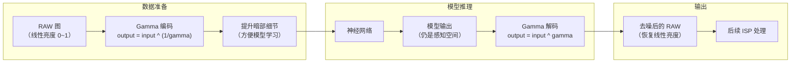

## 1. 从“亮度”说起

### 1.1 什么是亮度？——两个不同的“亮度世界”

我们先忘掉公式，想一个问题：

> 如果我把一盏灯的亮度从“1”调到“2”，人眼感觉到的亮度变化，和从“10”调到“11”，感觉一样吗？

答案是**不一样**。

| 物理世界的亮度            | 人眼感觉到的变化        |
| ------------------ | --------------- |
| 从 1 调到 2（增加 100%）  | 变化非常大（“灯亮了很多！”） |
| 从 10 调到 11（增加 10%） | 几乎感觉不到变化        |

**物理上**，这两次变化都是“增加了 1 个单位的亮度”。**人眼感知上**，第一次变化比第二次剧烈得多。这就是人类视觉系统最核心的特性——**人眼对暗部变化极其敏感，对亮部变化比较迟钝**。


### 1.2 一个直观类比：音量旋钮

想象你调节音响的音量旋钮：

- 从静音拧到 1 格，你感觉“声音突然有了！”
- 从 5 格拧到 6 格，你感觉“声音变大了一点”
- 从 9 格拧到 10 格，你感觉“好像没怎么变”

同样是“拧了 1 格”，在刻度低端和高端，人耳感受到的变化完全不同。**人耳对声音的感知，和人眼对亮度的感知，遵循完全一样的规律**——都是“对数式”的。


## 2. 为什么要做 Gamma 校正？

### 2.1 如果直接存储物理亮度，会发生什么？

假设我们用 8-bit（0~255）存储一张包含暗部和亮部的图像：

| 亮度范围 | 物理亮度        | 8-bit 存储值 | 问题                      |
| ---- | ----------- | --------- | ----------------------- |
| 最暗   | 0.00 ~ 0.05 | 0 ~ 13    | 暗部只有 13 个灰度级 → **细节丢失** |
| 中间   | 0.05 ~ 0.50 | 13 ~ 128  | 中间区域 115 个灰度级 → 充足      |
| 最亮   | 0.50 ~ 1.00 | 128 ~ 255 | 亮部 127 个灰度级 → 过剩        |

**暗部的细节被压缩到极少的灰度级里，肉眼根本分不清“0.01 的暗”和“0.03 的暗”有什么区别。** 但人眼恰恰对暗部最敏感。

### 2.2 Gamma 校正的解决方案

Gamma 校正用一个**幂函数**把物理亮度映射到人眼感知均匀的空间：

```text
感知亮度 = 物理亮度 ^ (1 / gamma)
```

当 `gamma = 2.2`（标准值），一个物理亮度 0.01 的暗部像素，在感知空间里会变成 0.01^(0.45) ≈ 0.12——**被拉高了 12 倍**。暗部细节一下子“张开”了，肉眼能清楚区分不同层次的暗。

**Gamma 的本质是把有限的存储空间（0~255）重新分配**：从亮部“借”一些灰度级给暗部，让人眼更敏感的区域获得更多的数值精度。


## 3. Gamma 校正怎么算？

### 3.1 数学公式

```text
Gamma 编码（正向）：output = input ^ (1 / gamma)     // 物理 → 感知，用于存储/显示
Gamma 解码（逆   ）：output = input ^ gamma          // 感知 → 物理，用于计算/分析
```

常见的 `gamma` 值：

| 场景 | gamma 值 |
|------|----------|
| sRGB 标准显示 | 2.2 |
| 训练中的一种常见做法 | 1.3 |
| 另一种常见做法 | 1.0（不做 Gamma） |

### 3.2 用具体数字走一遍

假设 `gamma = 1.3`，取三个典型亮度值：

```text
暗部像素（物理亮度 0.05）：
  gamma编码：0.05 ^ (1/1.3) = 0.05 ^ 0.769 = 0.10  （放大 2 倍！）
  逆gamma： 0.10 ^ 1.3 = 0.05                     （完美还原）

中间像素（物理亮度 0.30）：
  gamma编码：0.30 ^ 0.769 = 0.40                  （放大 1.33 倍）
  逆gamma： 0.40 ^ 1.3 = 0.30                     （完美还原）

亮部像素（物理亮度 0.80）：
  gamma编码：0.80 ^ 0.769 = 0.84                  （略微放大）
  逆gamma： 0.84 ^ 1.3 = 0.80                     （完美还原）
```

**结论**：Gamma 编码“拉高暗部、基本不动亮部”，把有限的数值空间重新分配给了人眼最敏感的区域。Gamma 编码和逆 Gamma 是一对精确的逆操作，只要你知道 gamma 值，就可以无损还原。


## 4. Gamma 在去噪训练流程中的位置



### 两种常见做法对比

| | 一种常见做法 | 另一种常见做法 |
|---|---|---|
| **是否对输入做 Gamma** | ✅ 固定做 `gamma=1.3` | 通过参数控制是否启用 |
| **是否对输出做逆 Gamma** | ✅ 固定做 | 启用则做，不启用则跳过 |
| **为什么这样做** | 让模型在感知空间里学，暗部效果更好 | 保留灵活性，由用户决定 |


## 5. 代码中的 Gamma

### 5.1 Gamma 编码（输入数据）

```python
# 一种常见做法：对输入数据做 gamma
data = torch_gamma_fn(data, gamma_val)  # gamma_val 固定为 1.3
```

### 5.2 Gamma 解码（模型输出）

```python
# 模型输出后做逆 gamma
net_out = torch_gamma_fn(net_out0, 1.0 / gamma_val)  # gamma_val=1.3
```

### 5.3 另一种常见做法：通过开关控制

另一种做法中，gamma 不是固定的，而是通过 `self.gamma_val` 参数控制。当 `self.gamma_val` 不为 `None` 时，才对输入做 gamma、对输出做逆 gamma。


## 6. 为什么去噪训练里有两种不同的 Gamma 做法？

| 做法         | 适用场景         | 思路                               |
| ---------- | ------------ | -------------------------------- |
| **固定 1.3** | 一种去噪模型的常见优化  | 让模型在“人眼感知空间”里训练，暗部细节更容易学，是一种训练策略 |
| **按需启用**   | 另一种训练框架的设计方式 | 把是否启用 Gamma 作为可选项，由开发者根据数据分布决定   |
|            |              |                                  |

两者没有绝对的优劣，只是不同的工程选择。


## 7. 一句话总结
> Gamma 校正用幂函数把物理亮度映射到人眼感知均匀的空间，`gamma` 编码（输入 ^ (1/gamma)）提升暗部细节让模型更好学，`逆 gamma`（输入 ^ gamma）还原线性亮度。两种做法（固定 1.3 和按需启用）都是为了让模型在更有利于学习的数据分布上训练。**暗部细节是保住了，但代价是你要记住做逆运算，否则亮度会偏暗。**