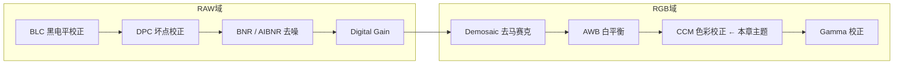
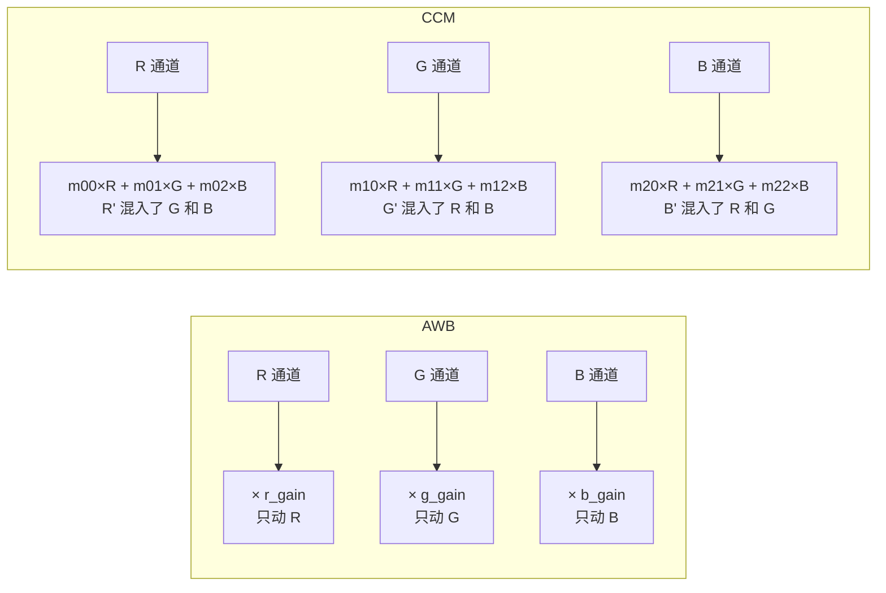
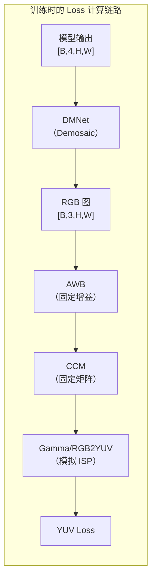

> **前置知识**：了解了 Demosaic（Bayer→RGB）和 AWB（白平衡）的原理。现在要回答的问题是：**为什么经过 AWB 之后，颜色还不够“准”？CCM 是怎么用一个 3×3 矩阵把颜色校正到标准色彩空间的？**

## 1. 为什么需要 CCM？

### 1.1 AWB 不够，还需要 CCM

AWB 只解决了“白色是白色”的问题（R=G=B），但**没有解决“红色是不是红色，蓝色是不是蓝色”的问题**。

这是因为 Sensor 对光谱的响应与标准人眼（标准色度观察者）不一致：

```text
Sensor 的响应曲线 vs 人眼响应曲线：
┌─────────────────────────────────────────────────────────────┐
│                                                             │
│  Sensor 的红色响应峰可能偏橙（波长偏移）                      │
│  Sensor 的蓝色响应峰可能偏紫                                │
│  三种颜色的响应曲线之间存在不应有的重叠（交叉污染）           │
│                                                             │
│  结果：红色拍出来偏橙，蓝色拍出来偏紫，绿色饱和度不够         │
│                                                             │
└─────────────────────────────────────────────────────────────┘
```

> **术语解释**：**标准色彩空间** 是显示器、打印机、图像存储等设备共同遵循的颜色定义规范。最常用的是 **sRGB**（标准 RGB），它定义了“什么样的 RGB 值代表什么样的颜色”。Sensor 的原始颜色响应需要被映射到 sRGB 空间，才能在不同设备上显示一致的颜色。CCM 做的就是将 Sensor 的“非标准”颜色响应，通过一个 3×3 矩阵映射到标准色彩空间。

**AWB 只做“把白色拉成白色”，CCM 做“把所有颜色都拉成标准颜色”。**

### 1.2 CCM 在 ISP 流程中的位置



CCM 在 AWB **之后**执行，在 Gamma **之前**。此时数据已经是 RGB 彩色图，AWB 已经保证了白色正确，CCM 负责把其他颜色（红、绿、蓝、黄、品、青）也校正到标准位置。

## 2. CCM 的核心原理

### 2.1 3×3 矩阵变换

CCM 用一个 3×3 矩阵乘以 RGB 向量：

```text
┌─────┐   ┌                 ┐   ┌─────┐
│ R'  │   │ m00  m01  m02  │   │  R  │
│ G'  │ = │ m10  m11  m12  │ × │  G  │
│ B'  │   │ m20  m21  m22  │   │  B  │
└─────┘   └                 ┘   └─────┘
```

展开后：

```text
R' = m00 × R + m01 × G + m02 × B
G' = m10 × R + m11 × G + m12 × B
B' = m20 × R + m21 × G + m22 × B
```

**关键理解**：CCM 是**跨通道混合**——R' 不仅取决于 R，还部分取决于 G 和 B。这比 AWB（只做独立通道缩放）功能更强，能修正 Sensor 的光谱响应偏差。

### 2.2 用具体数字走一遍

假设有一个 Sensor 拍到的红色像素（原始值）：

```text
R = 200, G = 30, B = 20
```

理想的红色应该是 R 远大于 G 和 B，但 Sensor 的红色响应有偏差（红色中混入了绿色和蓝色）。

使用 CCM 矩阵：

```text
┌─────┐   ┌               ┐   ┌─────┐
│ R'  │   │ 1.2  -0.1  0.0 │   │ 200 │
│ G'  │ = │ 0.0   1.1  0.0 │ × │  30 │
│ B'  │   │ 0.0   0.0  1.3 │   │  20 │
└─────┘   └               ┘   └─────┘
```

计算：

```text
R' = 1.2 × 200 + (-0.1) × 30 + 0.0 × 20 = 240 - 3 = 237
G' = 0.0 × 200 + 1.1 × 30 + 0.0 × 20 = 33
B' = 0.0 × 200 + 0.0 × 30 + 1.3 × 20 = 26
```

原始值 (200, 30, 20) → 校正后 (237, 33, 26)：红色更纯、饱和度更高。

> 注意：对角线上 >1 的值是**饱和度增益**（让颜色更鲜艳），对角线外的负值是用来**抵消颜色串扰**的。

### 2.3 AWB vs CCM 的区别



| | AWB | CCM |
|---|---|---|
| **操作** | 对角增益（3 个参数） | 3×3 矩阵（9 个参数） |
| **通道独立性** | 各通道独立缩放 | 通道间混合 |
| **解决的问题** | 色温偏色 | Sensor 光谱响应偏差 |
| **目标** | 白=白 | 所有颜色=标准颜色 |

> **术语解释**：**颜色串扰（Color Crosstalk）** 指 Sensor 对某一颜色光的响应“漏”到了其他颜色通道中。例如，红色光不仅触发 R 像素，还略微触发了 G 和 B 像素。CCM 通过对角线外的负系数来抵消这种串扰。

## 3. 在训练代码中，CCM 是怎么处理的？

### 3.1 CCM 在 Loss 计算中作为 ISP 模拟的一部分

在 `loss/yuv_loss.py` 的 `RAW2YUV` 类中，CCM 被实现为一个固定的 3×3 矩阵乘法：

```python
# loss/yuv_loss.py（概念简化）
class RAW2YUV(nn.Module):
    def __init__(self):
        # CCM 矩阵（针对特定 Sensor 标定的固定值）
        self.ccm_matrix = torch.tensor([
            [ 1.2, -0.1,  0.0],
            [ 0.0,  1.1,  0.0],
            [ 0.0,  0.0,  1.3]
        ])
    
    def forward(self, raw):
        # 1. Demosaic：Bayer → RGB
        rgb = self.dm_net(raw)
        
        # 2. AWB：固定增益
        rgb[:, 0, :, :] = rgb[:, 0, :, :] * self.r_gain
        rgb[:, 2, :, :] = rgb[:, 2, :, :] * self.b_gain
        
        # 3. CCM：3×3 矩阵乘法
        # 对每个像素的 (R, G, B) 应用矩阵
        rgb_flat = rgb.permute(0, 2, 3, 1)  # (B, H, W, 3)
        rgb_corrected = torch.matmul(rgb_flat, self.ccm_matrix.T)  # 矩阵乘法
        rgb_corrected = rgb_corrected.permute(0, 3, 1, 2)
        
        # 4. 后续 ISP 处理（Gamma、RGB2YUV）
        # ...
        return yuv
```

> **CCM 矩阵的来源**：这 9 个数字是通过标定过程得到的——拍摄 24 色卡，对比 Sensor 输出和标准色彩空间的差异，用最小二乘法拟合出最优的 3×3 矩阵。在训练 Loss 中使用的 CCM 矩阵是固定值，代表该 Sensor 的标定结果。

### 3.2 为什么 CCM 要出现在 Loss 计算中？

和 AWB 一样，CCM 出现在训练链路中的目的是让主模型感知“色彩校正后的效果”：



如果 Loss 计算中没有 CCM，主模型只会优化“去噪后的 RAW 在未经色彩校正时的表现”，而不会考虑“经过色彩校正后颜色是否准确”。加入 CCM 后，主模型就能通过梯度感知到去噪效果对最终色彩的影响。

## 4. 推理时 CCM 怎么处理？

和 Demosaic、AWB 一样，**推理时 CCM 由硬件 ISP 完成，AI 模型只负责去噪**。

```text
推理时的完整 ISP 流程：
Bayer RAW（带噪声）
  ↓
[模型] → 去噪后的 Bayer RAW
  ↓
BLC → DPC → Demosaic（硬件）→ AWB（硬件）→ CCM（硬件）→ Gamma（硬件）→ 最终图像
```

训练时模拟 CCM 的目的是让主模型学会“我的去噪要适配后续的色彩校正效果”，而不是让模型去执行 CCM。

## 5. 一句话总结

> **CCM 通过一个 3×3 矩阵对 RGB 三通道做线性混合，把 Sensor 的非标准颜色响应校正到标准色彩空间（如 sRGB）。它在训练代码中作为 ISP 模拟的固定步骤参与 Loss 计算，让主模型在训练时感知色彩校正后的效果；推理时由硬件 ISP 完成 CCM，AI 模型只负责去噪。**