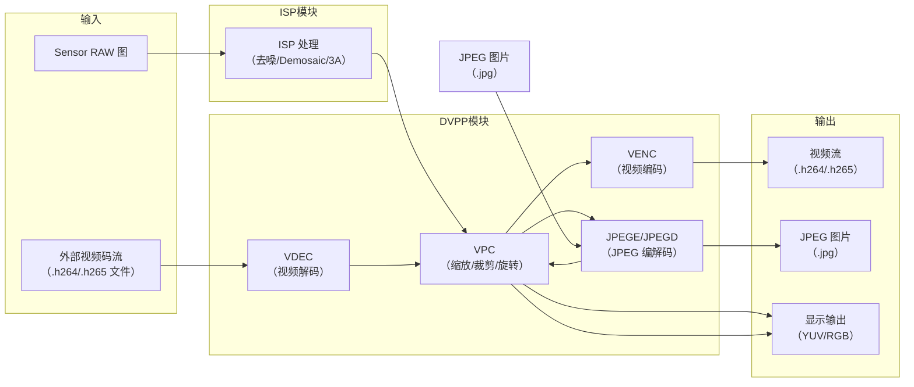
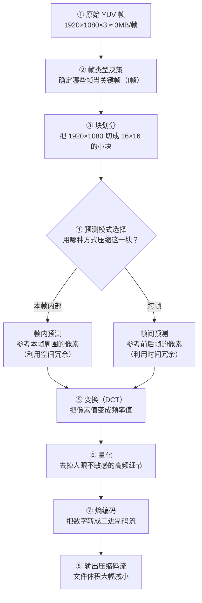

## 1. DVPP 是什么？

### 1.1 一句话定义

> **术语解释**：**DVPP（Digital Video Pre-Processing，数字视频预处理）** 是 SoC（如 Hi3516）内部专门负责**视频编解码**和**图像处理加速**的硬件模块集合。它不是单一模块，而是多个硬件加速器的统称，包括编码器、解码器、JPEG 编解码器、图像处理单元等。

> **SoC**: **System on Chip**，片上系统：指将 CPU（中央处理器）、ISP（图像处理器）、NPU（神经网络单元）、GPU（图形处理器）、VENC（视频编解码器）、DDR 控制器等高度集成在一块芯片上的处理器。

用一句话概括：**DVPP 是 SoC 的“视频和图片处理工具箱”**。

### 1.2 DVPP 包含哪些子模块？

| 缩写        | 全称                    | 中文含义     | 一句话作用                                 |
| --------- | --------------------- | -------- | ------------------------------------- |
| **VENC**  | Video Encoder         | 视频编码器    | 把 YUV 原始帧压缩成 H.264/H.265 码流（存文件/网络传输） |
| **VDEC**  | Video Decoder         | 视频解码器    | 把 H.264/H.265 码流解压成 YUV 原始帧（播放/显示）    |
| **JPEGE** | JPEG Encoder          | JPEG 编码器 | 把 YUV/RGB 图像压缩成 JPEG 图片（拍照存盘）         |
| **JPEGD** | JPEG Decoder          | JPEG 解码器 | 把 JPEG 图片解压成 YUV/RGB 图像（显示/编辑）        |
| **PNGD**  | PNG Decoder           | PNG 解码器  | 把 PNG 图片解压成 YUV/RGB 图像（显示带透明通道的图片）    |
| **VPC**   | Video Processing Core | 视频处理核心   | 对图像做缩放、裁剪、旋转、镜像、拼接等操作                 |

> **注意**：DVPP 中“没有 PNG 编码器”是因为 PNG 编码器通常由软件实现，不需要硬件加速。

### 1.3 DVPP 在整体系统中的位置


## 2. 为什么需要视频压缩？—— 四个冗余原理

在理解 VENC 之前，先搞清楚一个问题：**为什么原始视频必须压缩？**

> **术语解释**：**冗余（Redundancy）** 指视频数据中可以被去除而不影响观看体验的重复信息。视频压缩就是利用这些冗余来“瘦身”。

**数字演示**：

```text
一张 1080p 图像：
1920 × 1080 = 2,073,600 个像素 × 每个像素 3 字节（RGB）= 约 6.2 MB

30fps 视频（1 秒）：
6.2 MB × 30 = 186 MB/s

1 分钟视频：
186 MB × 60 ≈ 11 GB
```

> 如果不压缩，1 分钟 1080p 视频就要 11 GB——存储和传输完全不可行。

视频压缩就是要利用下面四个冗余来降低数据量：

### 2.1 空间冗余（Spatial Redundancy）

**一句话**：同一帧内相邻像素之间有关联，天空区域像素值接近，不需要每个都存。

```text
┌──────────────────────────────────┐
│  同一帧内：                       │
│                                  │
│  ┌──────────────────────────────┐│
│  │  蓝色天空区域                ││
│  │  像素值都在 [100, 110] 之间  ││  不需要存每个像素
│  │  存一个“平均值”+“差值”即可   ││
│  └──────────────────────────────┘│
│                                  │
│  利用：帧内预测（Intra Prediction）│
└──────────────────────────────────┘
```

### 2.2 时间冗余（Temporal Redundancy）

**一句话**：相邻帧之间变化很小，静止背景连续几十帧都一样，不需要每帧都编码。

```text
┌──────────────────────────────────┐
│  多帧之间：                       │
│                                  │
│  帧1: 背景 + 人站在左边           │
│  帧2: 背景 + 人站在中间  ← 背景没变│
│  帧3: 背景 + 人站在右边           │
│                                  │
│  只需要存：                        │
│  - 帧1：完整编码（I帧）           │
│  - 帧2：只存“人移动了 50 像素”    │
│  - 帧3：只存“人移动了 50 像素”    │
│                                  │
│  利用：运动估计与补偿              │
└──────────────────────────────────┘
```

### 2.3 视觉冗余（Visual Redundancy）

**一句话**：人眼对高频细节和色度的敏感度低于亮度，可以丢掉一些“看不出来”的高频信息。

```text
人眼敏感度对比：
┌──────────────────────────────────────────┐
│  亮度（Y）   → 非常敏感 → 保留精度       │
│  色度（UV）  → 不敏感   → 可大幅压缩     │
│  高频细节    → 不敏感   → 可丢（有损压缩）│
└──────────────────────────────────────────┘
```

### 2.4 信息熵冗余（Entropy Redundancy）

**一句话**：某些像素值出现频率高，可以用更短的二进制编码表示高频出现的值（类似霍夫曼编码）。

## 3. 视频编码的整体架构

### 3.1 编码器的目标：把“大”变成“小”

编码器要做的事情只有一件：**把原始视频帧（很大）压缩成码流（很小），同时尽量保持画质不下降。**

```text
原始帧数据（大）   →   编码器   →   压缩码流（小）
1920×1080 YUV          各种算法        文件（MB级别）
≈ 3MB/帧               处理            最终输出
```

后面的所有步骤，都是在为实现这个目标服务。

### 3.2 编码器内部流程



**每一行具体在做什么：**

| 步骤  | 名称       | 输入               | 输出                | 一句话解释                    |
| --- | -------- | ---------------- | ----------------- | ------------------------ |
| ①   | 原始 YUV 帧 | 1920×1080 的像素矩阵  | 同一张图              | 就是你 ISP 输出的一帧图像          |
| ②   | 帧类型决策    | 连续多帧             | 哪些是 I 帧、哪些是 P/B 帧 | 告诉编码器“哪些帧要完整存，哪些只存变化”    |
| ③   | 块划分      | 一整张 1920×1080 的图 | 大量 16×16 的小块      | 把大图切成小块，逐块压缩（效率更高）       |
| ④   | 预测模式选择   | 一个 16×16 的块      | 决定用帧内还是帧间预测       | 对每一小块，决策“参考自己还是参考邻居”     |
| ⑤   | 变换（DCT）  | 16×16 像素值        | 16×16 频率值         | 把“亮度变化”转成“频率高低”          |
| ⑥   | 量化       | 16×16 频率值        | 高频部分被置零           | 丢掉“人眼注意不到”的高频细节（有损压缩的关键） |
| ⑦   | 熵编码      | 量化后的数字           | 二进制码流（0/1 序列）     | 用最短的二进制码来表示高频出现的数字       |
| ⑧   | 输出码流     | 所有块的二进制码         | 压缩文件              | 最终输出                     |

### 3.3 数据形状变化（可视化）

```text
形状变化全过程：

【输入】
1920 × 1080 的像素矩阵（每个格子是一个像素）

      ↓ 块划分（切成 16×16 的小块）

【中间态 1】
120 × 68 个 16×16 小块（每个小块包含 256 个像素）

      ↓ DCT 变换（像素值 → 频率值）

【中间态 2】
每个 16×16 块，左上角是低频（重要），右下角是高频（不重要）

      ↓ 量化（丢掉高频）

【中间态 3】
每个 16×16 块，右下角大部分变成了 0

      ↓ 熵编码

【输出】
一串二进制数据（原本 3MB 的帧 → 约 100KB 的码流）
```

> **宏观理解**：输入是一整张图（二维像素矩阵），输出是一串 0/1（二进制码流）。中间的所有步骤就是“如何把二维矩阵里的冗余信息去掉，变成一维的二进制串”。

## 4. 视频帧分类（I/P/B 帧）

### 4.1 为什么要分帧类型？

想象你录了一段 30 秒的视频，内容是一个人从画面左边走到右边：

- 第 1 帧：完整图像（背景 + 人）
- 第 2 帧：背景没变，人往右移了一小步
- 第 3 帧：背景没变，人又往右移了一小步
- ...
- 第 900 帧（30 秒 × 30fps）：背景一直没变，只有人在移动

如果**每一帧都完整存储**，那就是 900 帧 × 3MB = 2.7GB，完全不可接受。

但如果**只存第 1 帧的完整图像**，后面的 899 帧只存“人移动了多少像素”，数据量就小多了——这就是 I/P/B 帧设计的初衷。

### 4.2 三种帧的具体含义

| 帧类型     | 怎么编码               | 类比     | 大小       |
| ------- | ------------------ | ------ | -------- |
| **I 帧** | 完整存储整张图，不依赖任何其他帧   | 关键帧/底图 | 大（100%）  |
| **P 帧** | 只存“和前面一帧的差别”（往前参考） | 增量更新   | 中（约 50%） |
| **B 帧** | 存“和前后两帧的平均差”（双向参考） | 插值补全   | 小（约 25%） |

**用具体数字理解**：

```text
假设一个场景变化很小：
I 帧（第 1 帧）：完整的 3MB 图像
P 帧（第 2 帧）：只存“人右移了 5 个像素”→ 约 1.5MB
B 帧（第 1.5 帧）：参考前后帧补出来的 → 约 0.75MB
```

### 4.3 GOP（图像组）结构

> **术语解释**：**GOP（Group of Pictures）** 是连续 I 帧之间的一个完整编解码单元。从 I 帧开始，到下一个 I 帧之前结束。GOP 越长，压缩率越高，但解码延迟也越大，且在丢包时损失更严重。I 帧间隔（GOP 长度）需要根据场景动态变化的速度来调整：静态场景可以用较长的 GOP 提高压缩率，快速运动场景则需要较短的 GOP 来保证画面质量。

```text
一个典型的 GOP（每 15 帧一个 I 帧）：

帧号：  1    2    3    4    5    6    7    8    9    10   11   12   13   14   15
类型：  I    P    B    B    P    B    B    P    B    B    P    B    B    P    I
       ↑                                                                     ↑
    关键帧（完整）                                                         下一个关键帧
                    中间帧只存“变化量”
```

**实际效果**：

| 场景类型 | GOP 长度建议 | 原因 |
|---------|-------------|------|
| 静态监控 | 长（30-60 帧一个 I 帧） | 背景不变，P/B 帧压缩效率极高 |
| 车载/运动场景 | 短（8-15 帧一个 I 帧） | 场景变化快，I 帧多了才能保证质量 |
| 视频会议 | 中等（15-25 帧） | 人头部运动幅度适中 |

## 5. 视频编码标准

| 标准           | 年代   | 特点                       |
| ------------ | ---- | ------------------------ |
| H.264 / AVC  | 2003 | 最主流，平衡压缩率和算力要求           |
| H.265 / HEVC | 2013 | 压缩率比 H.264 提升 50%，算力要求更高 |
| H.266 / VVC  | 2020 | 最新，压缩率再提升 50%            |
| AVS / AVS2   | 国产标准 | 中国自主标准                   |

## 6. 图片编码原理（JPEG）

视频编码（VENC）是**帧间 + 帧内**压缩，JPEG 编码（JPEGE）是**纯帧内**压缩。

```text
JPEG 编码流程：
原始 YUV 图像
  ↓
块划分（8×8 块）
  ↓
DCT 变换（空域 → 频域）
  ↓
量化（去高频）
  ↓
熵编码（霍夫曼编码）
  ↓
JPEG 文件输出
```

**JPEG 压缩效果**：

```text
原始 YUV 图像（1920×1080，4:2:0）：
Y: 1920×1080 × 1 = 2,073,600 字节
U: 960×540 × 1 = 518,400 字节
V: 960×540 × 1 = 518,400 字节
合计 ≈ 3.1 MB

JPEG 压缩后（质量 90）：
≈ 200-400 KB

压缩比 ≈ 10:1 至 15:1（无损肉眼几乎看不出）
```

## 7. VPC —— 图像处理核心

**VPC（Video Processing Core）** 是 DVPP 里的“图像搬运和处理工”，不涉及编解码逻辑。

**核心功能**：

| 功能              | 输入    | 输出         | 用途           |
| --------------- | ----- | ---------- | ------------ |
| **缩放（Resize）**  | 4K 图像 | 1080p/720p | 多路预览、不同分辨率编码 |
| **裁剪（Crop）**    | 全图    | ROI 区域     | 只编码画面中感兴趣的区域 |
| **旋转（Rotate）**  | 横向图像  | 纵向图像       | 手机竖屏显示       |
| **镜像（Mirror）**  | 原图    | 左右翻转       | 前视/后视摄像头切换   |
| **拼接（Combine）** | 4 路图像 | 1 路拼接图像    | 全景拼接、多路预览    |

**VPC 的位置**：

```text
ISP 输出 → VPC（缩放/裁剪/旋转）→ VENC（编码）
                              ↓
                          JPEGE（拍照）
                              ↓
                          显示输出
```

## 8. 视频质量评估（客观指标）

| 指标       | 全称                                   | 含义                    |
| -------- | ------------------------------------ | --------------------- |
| **PSNR** | Peak Signal-to-Noise Ratio           | 峰值信噪比，越大越好（通常 ≥ 35dB） |
| **SSIM** | Structural Similarity                | 结构相似度，越接近 1 越好        |
| **VMAF** | Video Multi-Method Assessment Fusion | Netflix 提出的主观感知质量评分   |

**PSNR 公式**：

$$
\text{PSNR} = 10 \times \log_{10}\left(\frac{255^2}{\text{MSE}}\right)
$$

其中 MSE 是原始帧与编码后重建帧之间的均方误差。

## 9. 一句话总结

> **DVPP 是 SoC 中负责视频和图像加速的硬件模块集合，包含 VENC（视频编码）、VDEC（视频解码）、JPEGE/JPEGD（JPEG 编解码）、PNGD（PNG 解码）、VPC（图像缩放/裁剪/旋转/拼接）。视频压缩利用空间冗余（帧内预测）、时间冗余（帧间预测/运动估计）、视觉冗余（丢弃高频）和信息熵冗余（短码高频值），将原始视频从 MB 级压缩到 KB 级，实现存储和传输的可行性。**