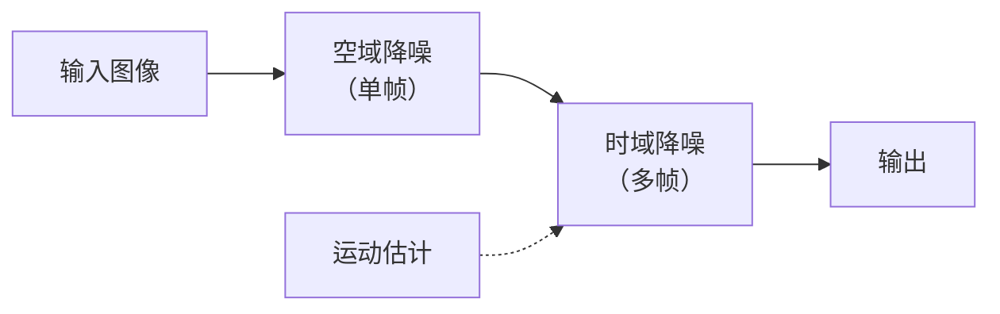
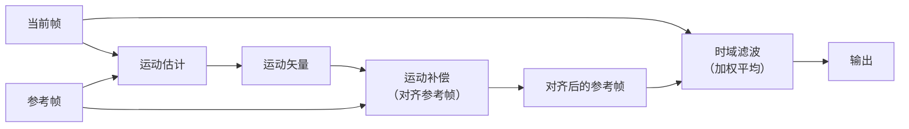
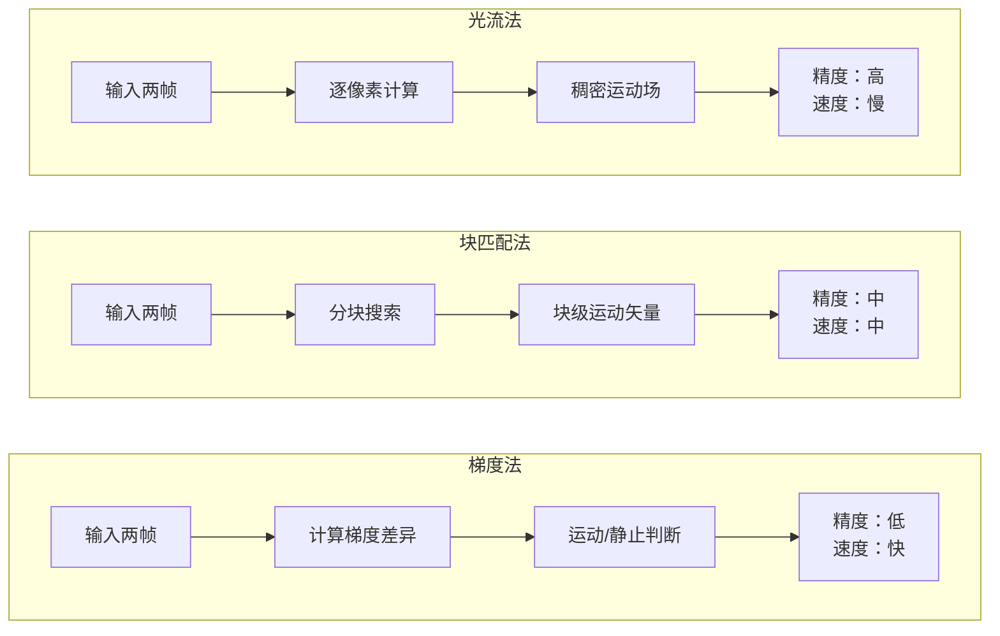
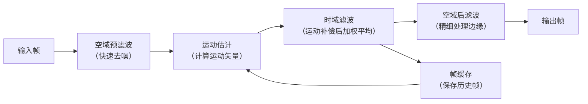

## 1. 时域降噪的背景与原理

### 1.1 为什么需要时域降噪？

空域降噪和频域降噪都在**单帧内部**操作——无论算法多先进，都受限于“这一帧只有这么多信息”这一事实。当噪声强度超过一定程度时，单帧降噪会严重损伤图像细节。

时域降噪利用**多帧之间的冗余信息**来去噪。其核心假设是：

- **真实信号**（物体边缘、纹理）在相邻帧之间是**稳定**的（或缓慢变化的）
- **噪声**在相邻帧之间是**随机**的（每一帧的噪声位置都不同）

```text
多帧观察：
帧1：真实信号 + 噪声A
帧2：真实信号 + 噪声B
帧3：真实信号 + 噪声C
帧4：真实信号 + 噪声D
...
帧N：真实信号 + 噪声N

如果噪声是零均值的，把多帧平均后，噪声趋近于 0，信号保留。
```

### 1.2 时域降噪在完整降噪流程中的位置



> **注意**：时域降噪与空域降噪是**互补**的，不是替代关系。一种常见做法是先用空域降噪做预处理，再用时域降噪做多帧融合，也可以反过来先时域后空域，具体根据场景和硬件限制决定顺序。

### 1.3 时域降噪的基本方法

#### 多图平均（简单平均）

最朴素的方法：对连续 N 帧的同一位置像素取平均。

$$
I_{out}(x,y) = \frac{1}{N} \sum_{t=1}^{N} I_t(x,y)
$$

**数字演示**：

```text
假设真实信号 = 100，噪声标准差 σ=20

帧1：100 + 15 = 115
帧2：100 - 22 = 78
帧3：100 + 8 = 108
帧4：100 - 18 = 82
帧5：100 + 12 = 112

简单平均：(115 + 78 + 108 + 82 + 112) / 5 = 495 / 5 = 99

噪声从 ±20 降低到约 ±3.6（降低了约 5.5 倍）
```

> **注意**：简单平均在**静止场景**中效果极好，但只要有物体运动，就会产生拖影——运动物体的位置在每帧都不同，平均后出现“鬼影”。

## 2. 运动估计与运动补偿

### 2.1 什么是运动补偿

> **术语解释**：**运动补偿（Motion Compensation）** 是先估计物体在帧间的运动方向和大小（运动矢量），然后根据运动矢量把参考帧的像素“搬”到与当前帧对齐的位置，再进行时域滤波。

在运动补偿中，**运动估计**决定“怎么搬”，**运动补偿**执行“搬”的动作。



你说得对，我确实只展开了光流法和块匹配法，梯度法没有单独展开。另外光流法和块匹配法的原理也没有配合图示，理解起来不够直观。

我重新完善这个章节，把**三种方法都展开讲**，并给**光流法和块匹配法配上示意图**：

### 2.2 运动估计算法

> **术语解释**：**运动估计（Motion Estimation）** 是计算物体在相邻帧之间的位移量（运动矢量）的过程。

| 方法 | 原理 | 特点 | 适用场景 |
|------|------|------|---------|
| **光流法** | 计算每个像素的密集运动场 | 精度高，但计算量极大 | 高精度运动分析 |
| **块匹配法** | 把图像分成小块，搜索最佳匹配位置 | 计算量适中，ISP 常用 | 视频编码、实时去噪 |
| **梯度法** | 利用图像梯度（边缘方向）辅助判断运动方向 | 计算量小，适合快速运动检测 | 快速判断是否有运动 |

#### 光流法

> **术语解释**：**光流（Optical Flow）** 描述物体在图像平面上运动的模式——每个像素在相邻帧之间的运动速度和方向。光流法计算出一张稠密的运动矢量场，每个像素都有对应的运动矢量。

**基本原理**：假设物体表面的亮度在运动中保持不变（亮度恒常性假设）。

```text
┌─────────────────────────────────────────────────────────────────────────────┐
│                    光流法原理：亮度恒常性假设                               │
├─────────────────────────────────────────────────────────────────────────────┤
│                                                                             │
│  同一物体上的同一个点，在相邻两帧中的亮度应该相同：                         │
│                                                                             │
│  I(x, y, t) = I(x+dx, y+dy, t+dt)                                         │
│                                                                             │
│    帧 t                    帧 t+1                                          │
│  ┌─────────────────┐    ┌─────────────────┐                               │
│  │         ●       │    │           ●     │                               │
│  │        ↑        │    │          ↑      │                               │
│  │     运动方向     │    │       运动方向   │                               │
│  │    (dx, dy)     │    │      (dx, dy)   │                               │
│  └─────────────────┘    └─────────────────┘                               │
│                                                                             │
│  关键思想：通过求解这个方程，得到每个像素在 t 到 t+1 之间的位移 (dx, dy)   │
│  输出：每个像素都有一个运动矢量 → 稠密光流场                               │
└─────────────────────────────────────────────────────────────────────────────┘
```

> **注意**：光流法输出的是**每个像素**的运动矢量（稠密光流场），而块匹配法输出的是**每个块**的运动矢量（稀疏运动场）。光流法精度高但计算量巨大，在实时 ISP 中通常不直接用光流法，而用块匹配法。

#### 块匹配法

> **术语解释**：**块匹配法（Block Matching）** 把图像分成固定大小的小块（如 8×8 或 16×16），在参考帧的搜索窗口内找到与当前块最匹配的位置。

```text
┌─────────────────────────────────────────────────────────────────────────────┐
│                    块匹配法原理                                             │
├─────────────────────────────────────────────────────────────────────────────┤
│                                                                             │
│  当前帧                                参考帧                              │
│  ┌─────────────────┐              ┌─────────────────┐                    │
│  │                 │              │                 │                    │
│  │   ┌─────┐       │              │   ┌─────┐       │                    │
│  │   │ 块A │        │    搜索      │   │最佳 │       │                    │
│  │   └─────┘       │  ────────────│   │匹配 │       │                    │
│  │                 │              │   └─────┘       │                    │
│  │                 │              │   搜索窗口       │                    │
│  └─────────────────┘              └─────────────────┘                    │
│                                                                             │
│  块匹配法：                                                                │
│  1. 在当前帧中取一个块（如 8×8）                                           │
│  2. 在参考帧的搜索窗口内滑动（如 ±16 像素范围）                            │
│  3. 计算每个候选位置的匹配代价（SAD/SSD）                                  │
│  4. 选匹配代价最小的位置 → 得到运动矢量                                    │
│                                                                             │
│  匹配代价 SAD（绝对差和）：                                                 │
│  SAD = Σ|当前帧像素 - 参考帧像素|                                          │
│  值越小 → 匹配越好                                                          │
└─────────────────────────────────────────────────────────────────────────────┘
```

块匹配法的核心参数：

| 参数 | 含义 | 常见取值 |
|------|------|---------|
| **块大小** | 每个运动矢量的计算单元 | 4×4, 8×8, 16×16 |
| **搜索范围** | 在参考帧中搜索的最大范围 | ±8, ±16, ±32 像素 |
| **匹配准则** | 判断两个块是否相似的标准 | SAD, SSD, 归一化互相关 |

#### 梯度法

> **术语解释**：**梯度法（Gradient-based Motion Detection）** 不计算精确的运动矢量，而是利用图像的**梯度信息**（边缘的强度和方向）来判断某个区域是否存在运动以及运动的大致方向。

```text
┌─────────────────────────────────────────────────────────────────────────────┐
│                    梯度法原理                                               │
├─────────────────────────────────────────────────────────────────────────────┤
│                                                                             │
│  核心思想：运动物体边缘的梯度方向和强度会发生变化                           │
│                                                                             │
│  ┌─────────────────────────────────────────────────────────────────────┐    │
│  │  静止区域：梯度方向在帧间保持一致                                   │    │
│  │  帧 t：  ████░░░░    帧 t+1：  ████░░░░  方向相同 → 静止          │    │
│  │                                                                     │    │
│  │  运动区域：梯度方向在帧间发生变化                                   │    │
│  │  帧 t：  ████░░░░    帧 t+1：  ░░████░░  方向变化 → 运动          │    │
│  └─────────────────────────────────────────────────────────────────────┘    │
│                                                                             │
│  优点：不需要全图搜索，计算量极小                                           │
│  缺点：只能判断“有没有运动”，不能精确计算“运动了多少”                     │
│  用途：快速运动检测（决定是否启动更精细的运动补偿）                         │
└─────────────────────────────────────────────────────────────────────────────┘
```

> **注意**：梯度法只能检测**边缘方向的变化**来判断是否有运动，不能输出精确的运动矢量。因此梯度法通常作为**运动检测**的快速预处理步骤，而不是运动估计的最终方案。要获得精确的运动矢量，仍需要块匹配法。

#### 三种方法的对比



| 方法       | 输出        | 精度  | 计算量 | 在 ISP 中的用途          |
| -------- | --------- | --- | --- | ------------------- |
| **光流法**  | 逐像素运动矢量   | 最高  | 最大  | 高精度运动分析（通常由 NPU 加速） |
| **块匹配法** | 逐块运动矢量    | 较高  | 中等  | **ISP 时域降噪的标准方法**   |
| **梯度法**  | 运动/静止二值掩码 | 最低  | 最小  | 快速判断（是否触发完整运动估计）    |

> **在常见 ISP 实现中**，通常**梯度法做快速初筛 → 块匹配法做精确运动估计**，光流法受限于计算量一般不用于实时场景。

## 3. 运动补偿时域滤波的核心算法

### 3.1 基本时域滤波（递归滤波 / IIR 滤波）

> **术语解释**：**递归时域滤波（Recursive Temporal Filtering）** 是一种 IIR（无限脉冲响应）滤波方式——当前帧的去噪结果由当前帧和上一帧的去噪结果共同决定，状态会持续传递。

```text
输出帧 = α × 当前帧 + (1-α) × 上一帧输出
```

其中 $α$ 控制时域平滑的强度。你已经在你学过的 IIR 循环中见过这种递归结构了。

**数字演示**：

```text
α = 0.6
帧1原始：100 → 输出1 = 100
帧2原始：120 → 输出2 = 0.6×120 + 0.4×100 = 112
帧3原始：115 → 输出3 = 0.6×115 + 0.4×112 = 113.8
帧4原始：130 → 输出4 = 0.6×130 + 0.4×113.8 = 123.5
```

### 3.2 运动补偿时域滤波（MC-TF）

> **术语解释**：**运动补偿时域滤波（Motion Compensated Temporal Filtering）** 是块匹配 + 时域滤波的组合——先用块匹配找到参考帧中对应的位置，再对该位置的像素做时域滤波。


### 3.3 MASTF（Motion Adaptive Spatio-Temporal Filter）

> **术语解释**：**MASTF（Motion Adaptive Spatio-Temporal Filter，运动自适应时空滤波器）** 是目前 ISP 中一种常见的降噪方案——根据运动强度的大小，**自动调整空域和时域滤波的比例**：在运动区域更依赖空域（防止拖影），在静止区域更依赖时域（去噪更强）。

```text
决策逻辑：
      运动强度大 → 空域滤波为主（不引入拖影）
      运动强度小 → 时域滤波为主（去噪更干净）
      完全静止   → 纯时域滤波（多帧平均）
```

**MASTF 的核心思想**：不是“用哪一种滤波”，而是“两种滤波如何协同”。它根据运动强度动态调整空域和时域滤波的权重，避免“一刀切”导致的拖影或降噪不足。

## 4. 时域降噪在拍照中的应用

拍照场景（单张照片拍摄）中，时域降噪的典型应用是**多帧合成**。


**拍照场景的特点**：
- 帧与帧之间有轻微偏移（手持抖动）→ 需要**全局配准**（图像配准/防抖）
- 场景中的运动物体（行人、车辆）→ 需要**运动区域检测**，否则运动物体产生拖影
- 帧数有限（通常 4-15 帧）→ 去噪效果受帧数限制

**IIR 训练循环实际上模拟的就是这种多帧处理逻辑**，只是训练循环是逐帧递归处理，而拍照多帧融合是批量处理所有帧后再融合。

## 5. 时域降噪在视频中的应用

视频场景中，时域降噪实时处理每一帧，是 3DNR（三维降噪）的核心组成部分。

### 5.1 3DNR 的概念

> **术语解释**：**3DNR（3D Noise Reduction，三维降噪）** 是 2D（空域）+ 1D（时域）的组合。空域降噪处理单帧内的像素空间关系（第1和第2维：X、Y），时域降噪处理帧间关系（第3维：时间 T）。两者结合，能获得比单独任何一种都更好的效果。

**典型 3DNR 流程**：



### 5.2 视频时域降噪的实时性要求

| 场景     | 帧率       | 算力要求       | 时域帧数   |
| ------ | -------- | ---------- | ------ |
| 监控安防   | 15-30fps | 中等         | 8-16 帧 |
| 车载辅助驾驶 | 30-60fps | 高（需低延迟）    | 4-8 帧  |
| 手机视频   | 30-60fps | 中等（NPU 加速） | 3-5 帧  |

## 6. 时域降噪的问题、难点与优化

### 6.1 配准问题

**问题**：运动估计算法可能出错，导致帧与帧没有正确对齐，错误对齐的像素会被错误融合。

**优化方向**：
- 使用多尺度运动估计（由粗到精搜索）
- 结合边缘信息辅助配准
- 结合 IMU（惯性测量单元）数据辅助配准

### 6.2 拖影问题

**问题**：运动物体边缘、快速移动物体，时域滤波容易产生拖影（运动残留）。

```text
运动物体拖影：
┌─────────────────────────────────────────────────────────────────────────────┐
│  实际情况：                                                               │
│  帧1：🚗在左边                         帧2：🚗在右边                     │
│  如果直接时域平均，结果会得到：🚗半透明在两个位置 → 拖影                  │
│                                                                             │
│  解决方案：                                                                │
│  检测到运动区域 → 降低时域权重（甚至完全跳过时域滤波）                    │
│  只对静止区域做时域滤波                                                    │
└─────────────────────────────────────────────────────────────────────────────┘
```

> **这一问题的本质**：时域滤波利用了“相邻帧相同位置像素近似不变”的假设。当这个假设被打破（有运动），就需要降低对时域滤波的依赖。这与 IIR 训练循环中 `ref` 传递时用 `motion_mask` 控制 `background` 更新逻辑的原理一致——运动区域不更新背景，只更新当前输出。

### 6.3 性能问题

**问题**：时域降噪需要：
- 存储多帧图像（内存占用）
- 计算运动矢量（算力消耗）
- 多帧融合（带宽消耗）

**优化方向**：
- 降低搜索范围（限制运动搜索窗口大小）
- 降低运动估计精度换取速度
- 使用硬件加速（NPU/GPU）
- 递归滤波，只存上一帧，不存多帧（IIR 结构）

## 7. 一句话总结

> **时域降噪利用多帧之间的时间冗余去除噪声：静止区域通过多帧平均获得干净信号，运动区域通过运动补偿对齐后再做时域滤波，或直接跳过时域滤波避免拖影。运动估计的质量决定了时域降噪的上限，运动区域的处理决定了拖影的严重程度。时域降噪常与空域降噪组合成 3DNR，在训练层面通过 IIR 递归循环让模型学习如何利用历史帧信息。**