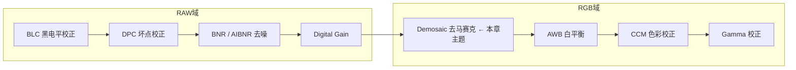
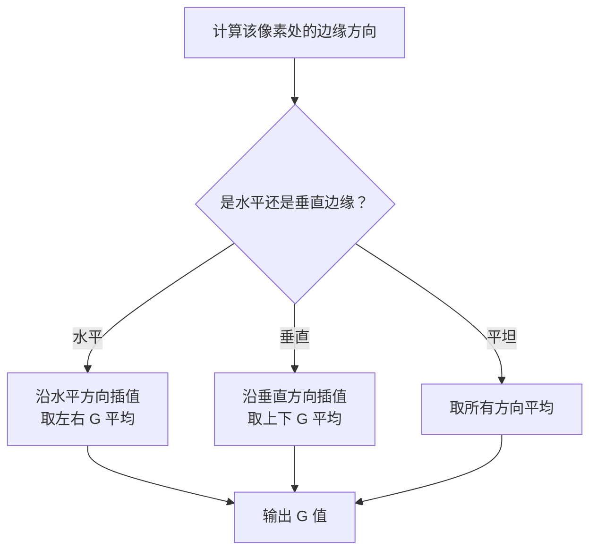
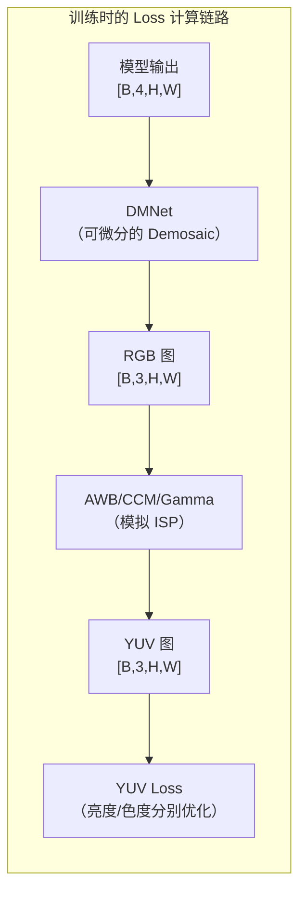

> **前置知识**：前面了解了 Bayer 阵列（每个像素只记录 R/G/B 中的一种颜色）、Space-to-Depth 操作（把 Bayer 马赛克拆成 RGGB 4 个通道），以及 ISP 的整体流程。现在要回答的问题是：**4 通道的 Bayer 数据，怎么变成 3 通道的彩色 RGB 图像？**

## 1. 为什么需要 Demosaic？

### 1.1 从 Sensor 到彩色图像

相机 Sensor 的每个像素上覆盖了一个颜色滤镜（Bayer 滤镜），所以每个像素**只记录一种颜色**（R、G、B 中的一种）。

```text
Bayer 阵列（物理排列）：
┌──────────────────────────┐
│  R  G  R  G  R  G  R  G │
│  G  B  G  B  G  B  G  B │
│  R  G  R  G  R  G  R  G │
│  G  B  G  B  G  B  G  B │
└──────────────────────────┘
每个格子代表一个物理像素，只有一种颜色信息
```

这种数据格式叫 **Bayer RAW**，它只有 1 个通道（马赛克排列）。但在 `prepare_batch` 中，数据经过 `space_to_depth` 后被拆成了 4 个通道（RGGB），每个通道只保留了同色像素，空间尺寸减半。

```text
space_to_depth 后的 4 个通道（每个 H/2 × W/2）：
┌─────────┐  ┌─────────┐  ┌─────────┐  ┌─────────┐
│ R通道    │  │ G1通道   │  │ G2通道   │  │ B通道    │
│ R R R   │  │ G G G   │  │ G G G   │  │ B B B   │
│ R R R   │  │ G G G   │  │ G G G   │  │ B B B   │
└─────────┘  └─────────┘  └─────────┘  └─────────┘
```

**问题**：Bayer 格式不能直接显示。人眼和显示设备都需要**每个像素同时拥有 R/G/B 三个通道的完整彩色信息**。Demosaic 的任务就是把 4 通道的 Bayer 数据，还原成 3 通道的 RGB 彩色图。

> **术语解释**：**Demosaic（去马赛克）** 是 ISP 流程中的一个关键步骤，将 Bayer 马赛克排列的数据通过插值恢复为每个像素都有完整 RGB 三通道的彩色图像。它在 ISP 流程中的位置是 Bayer 域处理之后、RGB 域处理（AWB、CCM 等）之前。

### 1.2 去马赛克在 ISP 流程中的位置



Demosaic 是 **RAW 域和 RGB 域的分界线**。在此之前，数据是 Bayer 格式；在此之后，数据变成真正的彩色图像。

## 2. Demosaic 的核心原理

### 2.1 核心思想：插值（Interpolation）

每个像素只有一种颜色信息，另外两种颜色是缺失的。Demosaic 的本质就是**用周围像素的值来“猜”缺失的颜色**。

> **术语解释**：**插值（Interpolation）** 是一种根据已知数据点估算未知数据点的方法。在 Demosaic 中，我们用周围已知的 R/G/B 值来估算当前像素缺失的颜色值。

### 2.2 一个具体例子：2×2 Bayer 块

假设有一个 2×2 的 Bayer 块（RGGB 排列）：

```text
┌───────┬───────┐
│ R=100 │ G=120 │
├───────┼───────┤
│ G=110 │ B=130 │
└───────┴───────┘
```

对于左上角的 R 像素（100），它缺少 G 和 B 值：

```text
G 的估算 = (120 + 110) / 2 = 115   ← 取周围两个 G 的平均值
B 的估算 = 130（距离最近的 B 像素） ← 直接复制最近的 B
```

对于右下角的 B 像素（130），它缺少 R 和 G 值：

```text
R 的估算 = 100（距离最近的 R 像素）
G 的估算 = (120 + 110) / 2 = 115
```

这样每个像素都得到了完整的 (R, G, B) 三元组。

### 2.3 为什么绿色通道最重要？

人眼对**绿色（亮度）**最敏感。在 Bayer 阵列中，绿色像素占 50%（RGGB 中有 2 个 G），R 和 B 各占 25%。因此，Demosaic 算法通常**优先保证 G 通道的准确度**，然后在 G 通道的基础上推导 R 和 B。

## 3. 传统 Demosaic 的实现方式

### 3.1 双线性插值（Bilinear Interpolation）

**做法**：对缺失的颜色，取周围同色像素的加权平均（距离越近权重越大）。

```text
计算 R 像素位置缺失的 G 值：
┌──────────────────────────────────────────┐
│  R   G1  R   G1                         │
│  G2  B   G2  B                          │
│  R   G1  R   G1                         │
│  G2  B   G2  B                          │
└──────────────────────────────────────────┘

中心的 R 像素（位置 2,2）缺失 G 值：
G_missing = (G1(1,2) + G2(2,1) + G1(2,3) + G2(3,2)) / 4
```

**优点**：实现简单，计算快。  
**缺点**：边缘模糊（因为平均操作会把边缘也“抹平”），产生伪彩色（边缘处出现不自然的颜色）。

### 3.2 边缘敏感插值（Edge-Aware Interpolation）

**做法**：先检测该像素处的边缘方向（水平、垂直、或平坦），然后**沿着边缘方向插值**，避免跨边缘平均。

```text
水平边缘（左右相似，上下变化大）：
  取左右两个 G 的平均值 → 沿水平方向插值

垂直边缘（上下相似，左右变化大）：
  取上下两个 G 的平均值 → 沿垂直方向插值

平坦区域：
  取所有方向的平均值
```



**优点**：保留边缘清晰度，减少伪彩色。  
**缺点**：边缘检测本身可能出错，高频纹理区域（如细网格、密集线条）仍然难以处理。

### 3.3 传统方法的“天花板”

传统 Demosaic 依赖人工设计的规则（边缘检测、方向判断），但现实世界中的图像纹理极其复杂，任何固定规则都无法完美适配所有场景。这就是为什么我们用 **AI 方法** 替代传统 ISP 中的多个模块（BNR、Demosaic 等）——网络自己学习如何“猜”，比人工规则更灵活。

## 4. AI Demosaic：一般项目中的做法

### 4.1 为什么用 AI 做 Demosaic？

在训练主模型（去噪网络）时，Loss 计算需要一个“从 RAW 到彩色图”的转换来在 YUV 空间算 Loss。这个转换如果使用传统 Demosaic 算法，会有两个问题：
1. **不可微分**：传统算法（如边缘检测）中包含 `if-else` 判断，梯度无法回传。
2. **参数固定**：无法针对当前数据分布进行优化。

> **术语解释**：**可微分** 指函数的输出对输入可求导，这是反向传播（`loss.backward()`）的前提。如果 Loss 计算链路中某个环节不可微分，梯度就无法通过它回传到主模型，模型参数就无法更新。

==**AI Demosaic 用神经网络替代传统 Demosaic**，把 Bayer→RGB 的转换交给一个可训练的网络（`DMNet`），让梯度能顺利回传，同时网络能根据数据自动学习最优的“插值”方式。==

> **为什么 Loss 计算需要一个“从 RAW 到彩色图”的转换？**
> 训练 Loss 是在 **RAW 域**（模型输出的 4 通道 Bayer 格式）计算的，但最终图像效果是在 **RGB/YUV 域**（人眼看到的空间）评价的。
> 
> 在 RAW 域算 Loss 只能告诉模型“每个像素的亮度对不对”，但无法告诉模型“色彩对不对”、“人眼看起来舒不舒服”。如果 Loss 只在 RAW 域算，模型只会让数字接近，却不知道颜色、边缘、纹理是否符合人眼感受，最终效果往往偏色、模糊。
> 
> 而 YUV 空间把亮度（Y）和色度（UV）分开，人眼对亮度比对色度更敏感，所以 Loss 可以在 Y 通道加强约束，在 UV 通道放宽约束，让模型在色彩表现上更符合人眼感知。这就是为什么要做“RAW → YUV”转换——让 Loss 不仅看像素对不对，还看颜色对不对。

> **Bayer→RGB 的转换就是 Demosaic 吗？**
> 从输入输出的角度来说，Bayer→RGB 就是 Demosaic 的核心任务。**
> 
> 严格来说，Demosaic 指的是“把 Bayer 马赛克数据恢复成每个像素都有完整 RGB 信息”的这个过程，Bayer→RGB 是它最直接的描述。
> 
> 但在实际 ISP 流程中，Bayer 到 RGB 之间还夹着 **Demosaic 之后的 AWB、CCM 等色彩域处理**，它们也属于“Bayer→最终彩色图”的转换过程。不过，这些处理通常不被叫做“Demosaic”，而是归在“RGB 域处理”里。

### 4.2 为什么要用 DMNet？

`DMNet` 在这里扮演的角色是 **“可微分的 Demosaic”**。它不是最终显示用的去马赛克，而是在训练过程中模拟 ISP 的 Demosaic 步骤，让 Loss 计算能在 YUV 色彩空间进行，从而优化模型的色彩表现。



**关键理解**：`DMNet` 本身是一个轻量级卷积网络，它的输入是 4 通道 Bayer 数据（`[B,4,H,W]`），输出是 3 通道 RGB 图（`[B,3,H,W]`）。它的训练目标不是“输出好看的彩色图”，而是“让 Loss 计算的梯度能有效指导主模型学习色彩和结构信息”。

### 4.3 DMNet 代码实现

```python
# loss/yuv_loss.py（概念简化）
class RAW2YUV(nn.Module):
    def __init__(self, dmnet_load_path):
        self.dm_net = DMNET(in_chn=4, out_chn=3)  # 输入 4 通道，输出 3 通道 RGB
        # 加载预训练的 DMNet 权重
        if dmnet_load_path is not None:
            state_dict = torch.load(dmnet_load_path)
            self.dm_net.load_state_dict(state_dict, strict=True)
    
    def forward(self, raw):
        rgb = self.dm_net(raw)   # 4 通道 Bayer → 3 通道 RGB
        # 然后进行 AWB、CCM、Gamma、RGB2YUV 等 ISP 模拟
        return yuv
```

### 4.4 DMNet 的输入输出

| 属性         | 值                                                 |
| ---------- | ------------------------------------------------- |
| **输入**     | `[B, 4, H, W]`（4 通道 Bayer 数据，来自 `space_to_depth`） |
| **输出**     | `[B, 3, H, W]`（3 通道 RGB 彩色图）                      |
| **作用**     | 在训练 Loss 计算中模拟 Demosaic，提供可微分的 Bayer→RGB 转换       |
| **权重来源**   | 预训练权重 `dmnet.pth`，在 `iir_train_ops.py` 初始化时加载     |
| **是否参与训练** | ❌ **冻结（Frozen）** —— 权重固定，不参与梯度更新                  |

> **术语解释**：**冻结（Frozen）** 指网络参数在训练过程中不更新。`DMNet` 只是 Loss 计算中的一个固定转换器，它的权重来自预训练模型，不随主模型训练而改变。

### 4.5 为什么 DMNet 不参与训练？

因为它的目的是为 Loss 计算提供一个稳定的色彩空间转换，而不是学习去噪或色彩优化。如果 `DMNet` 的参数也在训练中更新，Loss 的“基准”就会不断变化，训练会变得不稳定。所以它被**冻结**，权重固定。

这种“冻结辅助网络”的做法在工业界很常见——用一个预训练好的网络作为 Loss 计算的一部分（如感知损失），只提供梯度信号，但不更新自身。

## 5. Demosaic 在推理时怎么处理？

**重要澄清**：`DMNet` 只在**训练时的 Loss 计算**中使用，**推理时不会调用**。

真实芯片的 ISP 流程中，Demosaic 由硬件模块完成，不需要你的 AI 模型处理。你的主模型（去噪网络）只负责 RAW 域的降噪（BNR），输出仍是 Bayer 格式的 RAW 图，后续 ISP 硬件会接手完成 Demosaic、AWB、CCM 等操作。

```text
推理时的完整 ISP 流程：
Bayer RAW（带噪声）
  ↓
[你的模型] → 去噪后的 Bayer RAW
  ↓
BLC → DPC → Demosaic（硬件）→ AWB → CCM → Gamma → 最终图像
```

## 6. 一句话总结

> **Demosaic 是把 4 通道 Bayer 数据还原成 3 通道 RGB 彩色图的过程，核心是“用周围已知像素插值出缺失颜色”。传统方法依赖人工边缘检测规则，AI 方法则用可训练的卷积网络（如 DMNet）替代。在你的项目中，DMNet 作为冻结的 Loss 计算组件，在训练时提供可微分的 Bayer→RGB→YUV 转换，让主模型能在色彩空间得到梯度指导，但推理时由硬件 ISP 完成 Demosaic。**