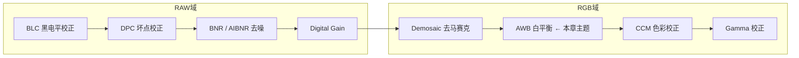
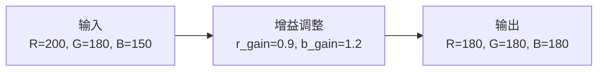
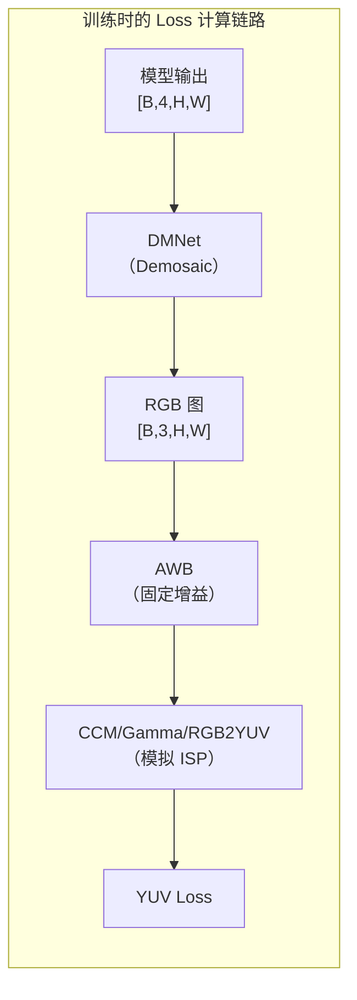

# AWB（自动白平衡）—— 让白色在任何光源下都是白色

> **前置知识**：了解了 Bayer 阵列（每个像素只记录一种颜色）、Demosaic（Bayer→RGB），以及 ISP 的整体流程。现在要回答的问题是：**为什么同一张白纸，在日光下和白炽灯下拍出来颜色不一样？AWB 怎么把颜色“校正”回来？**


## 1. 为什么需要 AWB？

### 1.1 光源会改变颜色

不同光源下，同一个物体会呈现不同的颜色。这是因为物体反射的光谱分布取决于光源的光谱。

```text
同一张白纸，在不同光源下：
┌─────────────────────────────────────────┐
│  光源      人眼看到的颜色    Sensor 记录  │
│  日光      白色              R≈G≈B      │
│  白炽灯    偏黄              R>G>B      │
│  荧光灯    偏绿              G>R>B      │
│  阴天      偏蓝              B>R>G      │
└─────────────────────────────────────────┘
```

> **术语解释**：**色温（Color Temperature）** 是描述光源颜色的物理量，单位是开尔文（K）。色温越低（如 2800K 白炽灯），光线偏黄/红；色温越高（如 6500K 日光），光线偏蓝。AWB 的目标就是消除色温差异带来的颜色偏差，让白色物体在任何光源下都呈现为白色。

**问题**：如果直接把 Sensor 记录的 RGB 值当作最终颜色输出，白纸在白炽灯下会变成“黄纸”。人眼会自动适应不同光源（大脑会“补偿”色温），但相机 Sensor 不会。

### 1.2 AWB 在 ISP 流程中的位置



AWB 在 Demosaic **之后**执行。因为必须先有完整的 RGB 三通道数据，才能准确地判断和调整白平衡。


## 2. AWB 的核心原理

### 2.1 核心思想：独立调整 R/G/B 增益

AWB 对 R、G、B 三个通道分别乘以不同的增益（放大系数），让白色物体重新变成白色。

```text
R_out = R_in × r_gain
G_out = G_in × g_gain   （通常固定为 1.0）
B_out = B_in × b_gain
```

- `g_gain` 通常固定为 1.0（以 G 通道为基准）
- `r_gain` 和 `b_gain` 根据光源色温动态调整

### 2.2 一个具体例子

假设在白炽灯下拍摄一张白纸，Sensor 读到的 RGB 值是：

```text
白纸的实际颜色（应为白色）：R=200, G=180, B=150
                    ↓
由于白炽灯偏黄（R 强，B 弱），R 偏高，B 偏低
```

AWB 检测到 R 偏高、B 偏低，于是调整增益：

```text
r_gain = 0.9   （压低调 R）
g_gain = 1.0   （保持 G 不变）
b_gain = 1.2   （提升 B）

R_out = 200 × 0.9 = 180
G_out = 180 × 1.0 = 180
B_out = 150 × 1.2 = 180

结果：R=180, G=180, B=180 → 白色被还原！
```



### 2.3 为什么 G 通道不动？

Bayer 阵列中 G 像素占 50%（RGGB 中两个 G），人眼对 G（亮度）最敏感。因此以 G 为基准，只调整 R 和 B 的增益，能最大程度减少对亮度的干扰。


## 3. 传统 AWB 的常见算法

### 3.1 灰度世界法（Gray World Assumption）

**假设**：自然图像中所有颜色的平均值应该是灰色（R=G=B）。

**做法**：计算整张图的 R、G、B 平均值，然后调整增益使三者相等。

```text
avg_R = 120, avg_G = 110, avg_B = 100

目标：让 avg_R = avg_G = avg_B = 110
r_gain = 110 / 120 = 0.917
g_gain = 110 / 110 = 1.0
b_gain = 110 / 100 = 1.1
```

**缺点**：如果图像中大面积是单一颜色（如一大片草地），灰度世界假设会失效。

### 3.2 完美反射法（Perfect Reflector）

**假设**：图像中最亮的点应该是白色（R=G=B）。

**做法**：找到图像中最亮的像素，调整增益使其 R=G=B。

**缺点**：如果有过曝区域，会错误地将过曝点当作白色。

传统 AWB 需要人工设计规则来处理各种场景，但规则很难覆盖所有情况。这就是为什么在训练 Loss 时，用一种“固定 AWB 增益”来模拟 ISP，让模型在训练时就能适应 AWB 的效果。

## 4. 在一般的训练代码中，AWB 是怎么处理的？

### 4.1 AWB 在 Loss 计算中作为 ISP 模拟的一部分

一般地，常见在 `loss/yuv_loss.py` 的 `RAW2YUV` 类中，AWB 被模拟为一个固定的增益矩阵：

```python
# loss/yuv_loss.py（概念简化）
class RAW2YUV(nn.Module):
    def __init__(self):
        # 固定的 AWB 增益（针对特定 Sensor 标定的值）
        self.r_gain = 1.67
        self.g_gain = 1.0
        self.b_gain = 1.57
    
    def forward(self, raw):
        # 1. Demosaic：4 通道 Bayer → 3 通道 RGB
        rgb = self.dm_net(raw)
        
        # 2. AWB：对 R 和 B 通道应用增益
        rgb[:, 0, :, :] = rgb[:, 0, :, :] * self.r_gain  # R 通道
        rgb[:, 1, :, :] = rgb[:, 1, :, :] * self.g_gain  # G 通道（=1.0）
        rgb[:, 2, :, :] = rgb[:, 2, :, :] * self.b_gain  # B 通道
        
        # 3. 后续 ISP 处理（CCM、Gamma、RGB2YUV）
        # ...
        return yuv
```

> **固定增益的含义**：这里的 `r_gain=1.67`、`b_gain=1.57` 是针对特定 Sensor 标定出的固定值，代表该 Sensor 在标准日光下的白平衡响应。它不是动态检测计算出来的，而是作为 Loss 计算中的一个固定转换步骤，模拟 ISP 的 AWB 效果。

### 4.2 为什么 AWB 要出现在 Loss 计算中？

和 Demosaic 一样，AWB 出现在训练链路中，目的是让主模型在 YUV 空间得到正确的色彩梯度信号。



**如果 Loss 计算中没有 AWB**：模型只会优化“去噪后的 RAW 在 RGB 域的亮度”，而不会关注“白平衡后的颜色是否准确”。最终训练出来的模型，在真实 ISP 硬件经过 AWB 后，颜色可能出现偏差。

**如果 Loss 计算中有 AWB**：主模型在训练时就能通过梯度感知到“我的去噪效果会影响 AWB 后的颜色表现”，因此会学会在去噪时保留正确的颜色信息。

### 4.3 AWB 的增益是固定的，不参与训练

和 `DMNet` 一样，AWB 的增益值（`r_gain=1.67, b_gain=1.57`）是**固定的**，不参与梯度更新。它只是 Loss 计算链路中的一个固定转换步骤。

> **为什么固定？** 因为实际 ISP 硬件中的 AWB 参数是标定好的固定值（或基于统计动态调整的），在 Loss 计算中模拟一个固定的 AWB 步骤，能让主模型在训练时适应真实 ISP 的行为。


## 5. 推理时 AWB 怎么处理？

和 Demosaic 一样，**推理时 AWB 由硬件 ISP 完成，不会调用训练代码中的 AWB 步骤**。

```text
推理时的完整 ISP 流程：
Bayer RAW（带噪声）
  ↓
[你的模型] → 去噪后的 Bayer RAW
  ↓
BLC → DPC → Demosaic（硬件）→ AWB（硬件）→ CCM（硬件）→ Gamma（硬件）→ 最终图像
```

你的模型输出的是去噪后的 Bayer RAW，所有色彩相关处理（Demosaic、AWB、CCM、Gamma）都由硬件 ISP 接手。训练时模拟 AWB 的目的是让主模型学会“我的去噪要适配后续的 AWB 效果”，而不是让模型去执行 AWB。


## 6. 一句话总结

> **AWB 通过独立调整 R、G、B 通道的增益，把白色物体在不同光源下校正回白色。在训练代码中，AWB 以固定增益（`r_gain=1.67, b_gain=1.57`）作为 ISP 模拟的一部分参与 Loss 计算，让主模型在训练时就能感知白平衡后的色彩效果；推理时则由硬件 ISP 完成 AWB，AI 模型只负责去噪。**