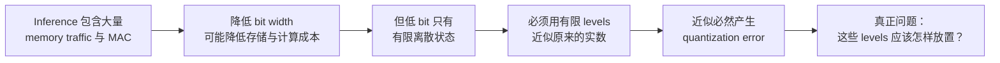
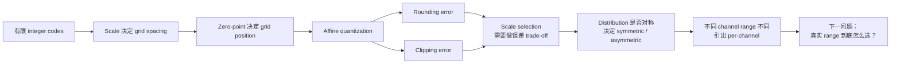
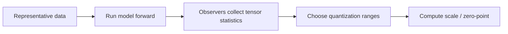
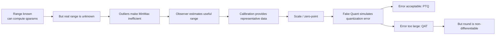
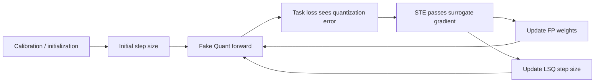
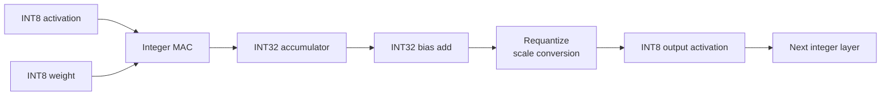

# 1. 模型量化到底改变了什么——从 FP32 到低比特表示

神经网络训练时通常使用 FP32 或其他高精度浮点格式。直觉上，这似乎很合理：数值表示越精确，网络越不容易因为计算误差损失精度。但部署时，我们面对的目标发生了变化。此时模型参数已经基本确定，真正需要反复执行的是 inference，而 inference 的代价不仅来自“做了多少次乘法”，还来自**每一个数需要占多少存储、在芯片上搬运多少 bit，以及硬件用什么电路完成这些乘加运算**。

因此，模型量化首先不是一个“怎样把模型文件压小”的技巧，而是在问：
> **神经网络真的需要用 FP32 这么高的数值精度，才能完成推理吗？**

如果答案是否定的，那么降低数值精度就有机会同时改变模型的存储、数据搬运和计算成本。

## 1.1 为什么 Bit Width 会影响真实推理成本？

卷积看起来是一个二维或三维操作，但展开以后，本质上仍然由大量矩阵乘加组成。可以先看最简单的线性关系：

$$
\mathbf y=\mathbf W\mathbf x+\mathbf b
$$

其中 $\mathbf x$ 是输入 activation，$\mathbf W$ 是 weight，$\mathbf b$ 是 bias。

《A White Paper on Neural Network Quantization》的 Figure 1 把这件事放回真实 accelerator 中：weight 和 activation 从 memory 中读入 processing elements，完成乘法以后，再把结果不断累加到 accumulator 中。


这张图最重要的不是具体硬件结构，而是让我们看到：一次神经网络计算至少同时涉及两类成本。

第一类是 **data movement**。Weight 和 activation 必须不断从 memory 搬到计算单元，计算完成后的结果还要写回。假设同一个 Tensor 原来使用 FP32，每个元素需要 $32$ bit；如果能够使用 INT8，每个元素只需要 $8$ bit。仅从存储量来看：

$$
\frac{8}{32}=\frac14
$$

因此相同数量的参数或 activation，理论存储量只有原来的四分之一，memory bandwidth 的压力也会相应下降。

第二类是 **arithmetic**。Processing element 执行的是大量 Multiply-Accumulate，也就是 MAC：

$$
A_n=b_n+\sum_m W_{n,m}x_m
$$

操作数 bit width 越大，乘法器、累加器以及相关数据路径通常就越昂贵。低 bit fixed-point / integer arithmetic 因此可以让很多专用硬件获得更高吞吐和更低能耗。White Paper 也正是从 memory transfer 和 MAC cost 这两个角度引出 neural network quantization。

不过这里必须马上划清一个边界：
> **FP32 变成 INT8，并不意味着实际模型一定加速 4 倍。**

$32$ bit 变成 $8$ bit 能直接说明存储表示缩小到四分之一，却不能直接推出 latency 也缩小到四分之一。真实速度还取决于模型究竟是 memory-bound 还是 compute-bound、芯片有没有高效的 INT8 kernel、某些 operator 是否仍然回退到 FP32，以及不同 layer 之间是否需要额外的数据转换。

所以“量化能加速”真正成立的前提是：**低 bit representation 最终必须被硬件转换成更便宜的数据搬运和 arithmetic。**

但这又产生了下一个问题：FP32 能表示非常丰富的实数，而 8 bit integer 只有极少的离散状态。我们到底怎样把前者塞进后者？

## 1.2 量化不是类型转换，而是用有限离散值近似连续数值

以 signed INT8 为例，它一共只有 $256$ 个整数：

$$
-128,-127,\ldots,126,127
$$

而神经网络里的一个 FP32 Tensor 可能包含 $0.037$、$-1.428$、$2.731$ 等大量不同实数。显然，我们不可能给每一个浮点值都安排一个独立的 INT8 code。

因此量化真正做的事情不是 `float -> int` 这么简单，而是：
> **先规定有限个可以使用的离散 level，再把原来的浮点值近似到这些 level 上。**

下面这张图只画最核心的过程。


上方是原来的浮点数值。它们可以落在数轴上的许多不同位置；下方只保留少量允许使用的量化 level。量化时，每个原始数值都必须被映射到其中某个 level；之后如果我们希望继续用浮点视角理解网络，又可以把这个离散 code 解释回一个近似的实数。

因此一次量化至少可以抽象成：

$$
x \rightarrow q \rightarrow \hat{x}
$$

其中 $x$ 是原始浮点值，$q$ 是保存下来的低 bit integer code，而 $\hat{x}$ 是这个 code 所代表的近似实数。

最简单的表示可以先写成：

$$
\hat{x}=s\,q\approx x
$$

这里的 $s$ 是一个 scale factor。它告诉我们：integer code 每变化 $1$，在原来的实数空间中相当于移动多大距离。

例如当：

$$
s=0.1
$$

integer code $q=5$ 就代表：

$$
\hat{x}=0.1\times5=0.5
$$

现在真正重要的事情出现了。由于离散 level 数量有限，通常无法让：

$$
\hat{x}=x
$$

对所有输入都成立。我们只能希望它们尽量接近。两者的差：

$$
e_q=x-\hat{x}
$$

就是最基本的 **quantization error（量化误差）**。

所以从模型函数的角度看，量化实际上是在做：

$$
f_{\mathrm{FP32}}(x) \quad\longrightarrow\quad f_{\mathrm{quant}}(x)
$$

我们希望后者使用更便宜的低 bit representation，但仍然尽可能接近原来网络的行为。

这也解释了为什么神经网络能够量化并不是理所当然的。量化一定会修改中间数值，只是许多神经网络对这种小扰动具有一定容忍度，因此我们才有可能用更粗糙的数值表示换取计算效率。

真正的难题也随之浮现：
> 同样只有 $256$ 个 level，究竟应该把它们放在哪些实数位置上？

如果 level 间隔很小，可以精细表示某一小段范围，但较大的数可能根本表示不了；如果覆盖范围非常大，每两个 level 之间又会变得很远，大量普通数值只能被粗糙近似。

这个矛盾正是下一章 `scale / zero-point / rounding / clipping` 的来源。

不过在进入这些数学细节之前，还必须先澄清一个在工程中非常容易混淆的问题：**“数值看起来像 INT8”并不等于“硬件正在做 INT8 计算”。**

## 1.3 “量化模型”不一定真的在执行整数计算

为了训练或验证量化模型，我们经常希望先知道：

> 如果这些 Tensor 被限制到 INT8 能表示的离散 level，网络精度会变成什么样？

一种直接思路是把浮点 Tensor 映射到 integer，再立刻解释回浮点：

$$
x \rightarrow q \rightarrow \hat{x}
$$

随后 convolution 仍然使用 $\hat{x}$ 这个 FP32 Tensor 完成。

从数值上看，$\hat{x}$ 已经只能取量化网格允许的值，因此模型能够感受到 quantization error；但从硬件 arithmetic 看，真正执行 convolution 的仍然可能是 floating-point kernel。

这就是后面会正式学习的 **Fake Quantization** 的基本思想：

> **在浮点计算图中模拟低 bit 数值约束，而不是立刻把整个训练过程变成 integer arithmetic。**

真正部署到支持整数计算的硬件以后，情况不同。该白皮书的 Figure 1 把这两种计算路径放在了一起。本章先只关注左侧的 integer-arithmetic-only inference，并顺便观察它和右侧 simulated quantization 在结构上的差异。


左侧的核心信息是：input 和 weight 可以真正使用 8-bit integer 进入 convolution，而计算图内部还会出现更高 bit width 的 accumulator。右侧则仍然用 floating point computation，只在合适位置插入 quantization simulation。

现在先不追究为什么 INT8 convolution 里会突然出现更宽的 accumulator，也不讨论它最后怎样重新回到 INT8；这些会在第 5 章完整推导。

此处只需要建立一个非常重要的区分：

$$
\text{low-bit numerical representation} \neq \text{real integer arithmetic}
$$

模型可以在 FP32 计算图中**模拟量化后的数值**，也可以在真实硬件上执行**整数乘加**。前者主要用于 calibration、QAT 或数值验证；后者才真正决定部署时能够获得多少 memory、latency 和 power 收益。

因此，“这是一个 INT8 模型”这句话本身是不够精确的。以后看到一个量化系统，需要继续问：

- Weight / activation 的数值是否被限制到了 INT8 level？
- Tensor 实际以什么 dtype 保存？
- MAC 真正使用 float kernel 还是 integer kernel？
- 中间 accumulator 又是什么精度？
- 最后的 backend 是否真的支持这套量化规则？
> **MAC** ：**Multiply-Accumulate，乘加运算**

后面的章节会逐步回答这些问题。

这一章到这里建立了量化最基本的因果链：



下一章就从最后这个问题开始：**给定有限的整数范围，怎样通过 scale 和 zero-point 把它映射到真正有用的浮点范围，并理解 rounding error 与 clipping error 为什么不可避免。**

**一句话总结：模型量化的本质不是把 FP32 “改成 INT8 类型”，而是用有限的低 bit 数值近似原网络的实数计算，并让这种近似最终能够被真实硬件转换成更低的数据搬运和整数计算成本。**

# 2. 一个浮点 Tensor 怎样映射成整数——Scale、Zero Point 与量化误差

第一章已经建立了量化最基本的直觉：低 bit representation 能降低存储和计算成本，但代价是必须用有限个离散 level 去近似原来的实数。于是现在真正的问题变成了：

> **只有有限个 integer code 时，应该让这些 code 对应实数轴上的哪些位置？**

这个问题看起来只是“怎么选几个参数”，但实际上它决定了量化误差有多大。Scale、zero-point、symmetric/asymmetric、per-tensor/per-channel，都是围绕这一个问题自然出现的。

## 2.1 先把 Integer Grid 放到实数轴上

假设我们使用 8 bit quantization。无论是 signed INT8 还是 unsigned UINT8，都只有 256 个 integer code。问题在于，一个神经网络 Tensor 的真实值域可能是：
$$
[-0.8,1.2]
$$

也可能是：

$$
[-5,30]
$$

甚至不同 layer、不同 channel 的范围都完全不同。

因此，量化不能只规定“用 INT8”，还必须规定：

> 这 256 个 integer code 在实数轴上分别代表什么。

《A White Paper on Neural Network Quantization》的 Figure 3 画出了三种最常见的 uniform quantization grid。


先看最简单的情况。如果 integer code $q$ 与实际近似值 $\hat{x}$ 之间满足：

$$
\hat{x}=sq
$$

那么 $s$ 就决定了相邻两个 integer code 在实数空间里的距离。

例如：

$$
s=0.1
$$

则：

$$
q=3\Rightarrow \hat{x}=0.3
$$

$$
q=4\Rightarrow \hat{x}=0.4
$$

因此，**scale $s$ 本质上就是 quantization step size**。它决定了 quantization grid 有多密。

如果 $s$ 很小，相邻 level 很近，对实数的近似更精细；如果 $s$ 很大，相邻 level 很远，能够覆盖的数值范围更大，但近似会更粗糙。

这时还隐含了一个限制：

$$
q=0\Rightarrow \hat{x}=0
$$

也就是说，integer zero 被固定映射到 real zero，整个 quantization grid 围绕 0 展开。这种设计对很多 weight 很自然，因为 weight distribution 往往大致分布在 0 两侧。

但 activation 不一定如此。

假设某个 activation 主要分布在：

$$
[-1,5]
$$

如果仍然强行使用以 0 为中心的 symmetric grid，就需要覆盖大约：

$$
[-5,5]
$$

其中 $[-5,-1]$ 这一大片负数范围几乎没有数据，却仍然占用了 quantization levels。

于是问题自然出现：

> **能不能不改变 level 间距，只把整个 quantization grid 在实数轴上平移？**

这就是 zero-point 的作用。

## 2.2 Zero Point：让 Integer Grid 可以整体平移

加入 zero-point $z$ 后，dequantization 关系变成：

$$
\hat{x}=s(q-z)
$$

这时 real zero 对应的 integer code 不再必须是 0，而是：

$$
q=z\Rightarrow \hat{x}=0
$$

所以 zero-point 的含义非常直接：

> **$z$ 决定哪个 integer code 表示 real zero。**

Scale 控制 grid 的“间距”，zero-point 控制 grid 的“位置”。

例如：

$$
s=0.1,\qquad z=10
$$

那么：

$$
q=10\Rightarrow \hat{x}=0
$$

$$
q=11\Rightarrow \hat{x}=0.1
$$

$$
q=9\Rightarrow \hat{x}=-0.1
$$

有了这个 offset，quantization grid 就不必再围绕 integer zero 对称，可以更灵活地覆盖真实数据分布。

为什么一定要保证 real zero 能被精确表示？

因为 0 在神经网络里不是普通数值。很多操作会显式依赖它，例如：
- zero padding；
- ReLU 截断到 0；
- 稀疏 activation 中的大量 0。

如果 real zero 本身都有量化误差，那么这些本来语义明确的操作会被额外扰动。因此 affine quantization 通常会专门通过 integer zero-point $z$ 保证：

$$
0\rightarrow z\rightarrow 0
$$

现在就可以写出完整的 quantize / dequantize 过程。

### Quantize

给定浮点值 $x$，先按 scale 缩放，再 round 到最近 integer，最后加上 zero-point：

$$
q = \operatorname{clamp} \left( \operatorname{round}\left(\frac{x}{s}\right)+z, q_{\min}, q_{\max} \right)
$$

### Dequantize

再把 integer code 解释回实数：

$$
\hat{x}=s(q-z)
$$

沿着一个具体例子走一遍会更直观。

假设：

$$
s=0.1,\qquad z=10,\qquad x=0.34
$$

那么：

$$
\frac{x}{s} = 3.4
$$

round 后：

$$
\operatorname{round}(3.4)=3
$$

因此：

$$
q=3+10=13
$$

再 dequantize：

$$
\hat{x} = 0.1(13-10) = 0.3
$$

原来的 $0.34$ 被近似成了 $0.3$，于是产生量化误差：

$$
e_q=x-\hat{x}=0.04
$$

这就是最基本的 **rounding error**。

到这里，scale 和 zero-point 的角色已经清楚了：

$$
\boxed{ s:\text{控制 grid spacing} }
$$

$$
\boxed{ z:\text{控制 grid position} }
$$

但接下来会出现一个更重要的问题：既然 $s$ 决定 level 间距，那是不是把 $s$ 设得越小越好？

不是。

## 2.3 Scale 的核心矛盾：Rounding Error 和 Clipping Error

这是理解量化最重要的一个 trade-off。

bit-width 一旦固定，可用的 integer code 数量就是固定的。以 8 bit 为例，永远只有 256 个 level。

如果把 $s$ 调小，相邻 level 更密：

$$
s\downarrow \Rightarrow \text{quantization step}\downarrow
$$

对于落在可表示范围内的值，rounding error 会变小。使用 round-to-nearest 时，未被 clipping 的值通常满足：

$$
|e_{\text{round}}| \le \frac{s}{2}
$$

但问题是，integer code 数量没有变。level 变密以后，整个 quantization grid 能覆盖的实数范围也会缩小。

对于一般 affine quantization，可表示范围是：

$$
x_{\min}^{(q)} = s(q_{\min}-z)
$$

$$
x_{\max}^{(q)} = s(q_{\max}-z)
$$

当 $s$ 变小，这个范围也随之缩窄。超过边界的真实数值只能被 clamp 到最近的端点，从而产生 **clipping error**。

反过来，如果把 $s$ 调大，grid 覆盖的范围更宽，clipping 会减少；但每两个 level 之间距离变大，rounding error 又会上升。

下面这张图就是整个量化问题最核心的视觉直觉。


左侧使用较小 scale：
- quantization levels 很密；
- 中间大量数值能够被精细表示；
- 但 representable range 较窄；
- 两端 outlier 容易被 clipping。

右侧使用较大 scale：
- representable range 更宽；
- outlier 更容易保留下来；
- 但 quantization levels 变稀；
- 大量常见数值的 rounding error 变大。

因此，scale selection 的本质不是：
> 找到一个“最准确”的 scale。

而是：
> **在 rounding error 和 clipping error 之间找到合适的平衡。**

这个 trade-off 会贯穿后面的所有章节。

第3章的 Observer / Calibration，本质上是在决定 quantization range 应该放在哪里、应该多宽；第4章的 LSQ，则更进一步，让模型通过 task loss 自己学习 step size。

## 2.4 Symmetric 和 Asymmetric：要不要让 Grid 围绕 0 对称？

现在回头看 Figure 3，symmetric / asymmetric 就不再是两个需要死记的配置，而是 quantization grid placement 的两种不同选择。

### Symmetric Quantization

如果 Tensor 大致围绕 0 对称，例如很多 weight：

$$
x_{\min}\approx -x_{\max}
$$

那么没有太大必要再引入额外 offset，可以直接令：

$$
z=0
$$

于是：

$$
\hat{x}=sq
$$

这就是 symmetric quantization。

它的一个明显优点是 arithmetic 更简单，因为 accumulation 时不需要额外处理 zero-point offset。

Signed symmetric 常用于同时包含正负值的数据，例如 weight。

实现中 signed 8-bit integer range 常见为：

$$
[-128,127]
$$

也有系统为了严格对称而有效使用：

$$
[-127,127]
$$

具体端点属于实现约定，不改变这里的核心：**real zero 与 integer zero 对齐，grid 不额外平移。**

如果数据天然只有非负部分，例如某些 ReLU 后 activation，也可以使用 unsigned grid：

$$
[0,255]
$$

这样不必浪费一半 integer code 去表示不会出现的负数。

### Asymmetric Quantization

如果数据范围明显不对称，例如：

$$
[-1,5]
$$

强行 symmetric quantization 就会浪费大量 level。

此时通过非零 $z$ 平移 quantization grid，可以让有限的 code 更贴近真实数据范围。

因此 symmetric / asymmetric 的核心区别可以压缩成一句话：

> **是否允许 zero-point 把 quantization grid 从 0 附近整体平移。**

Symmetric 更简单；asymmetric 更灵活。

选择哪一种，本质上还是围绕同一个目标：

> 在固定 bit-width 下，怎样让有限 level 尽量覆盖真正有用的数值。

## 2.5 Scale 和 Zero Point 是怎样从 Range 推出来的？

前面一直把 $s$ 和 $z$ 当成已经知道的参数。现在进一步问：

> 如果我们已经决定要覆盖浮点范围 $[x_{\min},x_{\max}]$，怎样计算 $s$ 和 $z$？

假设要把它映射到整数范围：

$$
[q_{\min},q_{\max}]
$$

希望两个端点分别对应：
$$
x_{\min} = s(q_{\min}-z)
$$

$$
x_{\max} = s(q_{\max}-z)
$$

两式相减：

$$
x_{\max}-x_{\min} = s(q_{\max}-q_{\min})
$$

因此：

$$
s = \frac{x_{\max}-x_{\min}} {q_{\max}-q_{\min}}
$$

得到 scale 后，再代回：

$$
x_{\min} = s(q_{\min}-z)
$$

整理得：

$$
z = q_{\min} - \frac{x_{\min}}{s}
$$

但 zero-point 必须是 integer，所以实际还需要：
$$
z = \operatorname{round} \left( q_{\min} - \frac{x_{\min}}{s} \right)
$$

并最终 clamp 到合法 integer range。

这段推导说明，scale 和 zero-point 并不神秘。它们只是在建立两个数轴之间的线性对应：
$$
\text{floating-point range} \longleftrightarrow \text{integer range}
$$

但这里故意留下了一个尚未解决的问题：
> **谁告诉我们 $x_{\min}$ 和 $x_{\max}$ 应该是多少？**

最直接的方法当然是使用 Tensor 的实际最小值和最大值。

但第3章会看到，这往往不是最优选择，因为极少数 outlier 可能把整个 range 拉得非常宽，导致绝大多数普通数值只能使用很少的 quantization levels。

所以这一章只解决：
> 已经知道 range 后，怎样构造 quantization grid。

而“range 应该怎么选”，留给下一章。

## 2.6 为什么整个 Tensor 共用一套 Scale 有时不够？

到目前为止，我们一直默认整个 Tensor 共用一组：

$$
(s,z)
$$

这就是 **per-tensor quantization**。

它实现简单，但隐含了一个假设：

> Tensor 中不同部分的数值范围大致相近。

实际网络并不总满足这个条件。

White Paper Figure 5 展示了 MobileNetV2 中一个 depthwise-separable layer 在 BN folding 后，不同 output channel 的 weight range。


图中不同 channel 的范围差异非常大。有些 channel 的 weight 只在很小范围内变化，有些 channel 却延伸到几十甚至更大。

假设极端一点：

$$
\text{Channel A}\in[-0.1,0.1]
$$

$$
\text{Channel B}\in[-5,5]
$$

如果整个 weight Tensor 共用一套 per-tensor scale，就必须覆盖：

$$
[-5,5]
$$

这样虽然 Channel B 能正常表示，但 Channel A 的 $[-0.1,0.1]$ 只占整个 quantization grid 极小一部分。

也就是说，大量 INT8 code 对 Channel A 根本没有被有效利用。

这时自然会想到：

> 为什么不给不同 output channel 单独一套 quantization grid？

于是得到 **per-channel quantization**：

$$
s_0,s_1,s_2,\ldots,s_{C_{\text{out}}-1}
$$

每个 channel 可以根据自己的 range 选择 scale，而不是被最大 range 的 channel 拖着走。

因此两者的区别可以概括为：

$$
\text{per-tensor} : \text{整个 Tensor 共用一套 }(s,z)
$$

$$
\text{per-channel} : \text{每个 channel 拥有自己的 qparams}
$$

更细粒度的 quantization 通常能降低误差，但代价也很明确：

- 需要保存更多 quantization parameters；
- hardware scaling logic 更复杂；
- 不同 accumulator 可能对应不同 scale；
- backend 未必支持任意 granularity。

所以 granularity 依然是 accuracy 和 implementation cost 之间的 trade-off。

到这里，第二章已经把“一个浮点 Tensor 怎样映射到整数”完整走通：



**一句话总结：量化的核心不是“把 float 转成 int”，而是在固定 bit-width 下设计一套 quantization grid；scale 决定精度与范围的 trade-off，zero-point 决定 grid 在实数轴上的位置，而 quantization granularity 决定这套 grid 要共享到多大的 Tensor 范围。**

# 3. Scale 从哪里来——Observer、Calibration 与 Fake Quant

第 2 章已经把一件事情讲清楚了：只要给定浮点范围 $[x_{\min},x_{\max}]$，我们就可以计算 scale 和 zero-point，把这个范围映射到有限的 integer grid 上。

但这里一直隐藏着一个前提：

> **谁来决定 $x_{\min}$ 和 $x_{\max}$ 应该是多少？**

最直接的答案当然是“用 Tensor 真正出现过的最小值和最大值”。可一旦面对真实神经网络，这个答案很快就会出问题。原因是量化的目标从来不是忠实保存每一个极端值，而是在有限 bit-width 下，让**整个 Tensor 的有效信息尽可能少受损失**。

这一章真正要解决的，就是 quantization range 从哪里来，以及我们怎样在不真正部署 INT8 硬件的情况下，提前观察这套 range 会给网络带来多少误差。

## 3.1 为什么直接使用 Min/Max 可能反而更差？

先考虑一个 activation Tensor。假设绝大多数值都集中在：

$$
[-1,1]
$$

但只有极少量 outlier 落到了：

$$
20
$$

如果我们的原则是“一个值都不能丢”，就必须让 quantization range 至少覆盖：

$$
[-1,20]
$$

对于 8 bit quantization，假设使用 256 个 level，那么 scale 大约是：

$$
s \approx \frac{20-(-1)}{255} \approx 0.082
$$

也就是说，相邻两个 quantization level 在实数轴上相差约 $0.082$。

但绝大多数 activation 都位于 $[-1,1]$。这个区间总宽度只有 $2$，能够真正使用的 quantization level 数量大约只有：

$$
\frac{2}{0.082} \approx 24
$$

虽然名义上是 8 bit、256 levels，但主体数据实际上只利用了二十几个 level，其余大量表示能力都被那个极少出现的 outlier 拉走了。

现在换一种策略。假设我们故意只量化：

$$
[-1,1]
$$

那么 scale 约为：

$$
s \approx \frac{2}{255} \approx 0.0078
$$

主体数据获得了大约十倍更细的 quantization grid。代价是超过范围的值，例如 $20$，会被 clamp 到边界。

下面这张图就是这个矛盾的视觉化。


上面的宽 range 尽可能包含所有值，几乎没有 clipping，但少数 outlier 把整个 range 拉宽，使高概率区域里的 quantization level 非常稀疏；下面的窄 range 主动放弃极少量 outlier，让大多数 activation 获得更密的 quantization levels。

这说明第 2 章的 rounding / clipping trade-off 到真实网络里以后，会变成一个非常具体的问题：

> **我们是否应该牺牲少量极端值，来换取主体分布更高的量化精度？**

因此，quantization range 的目标不是“完整覆盖所有出现过的数据”。更准确地说，我们希望选择一个 range，使最终 quantization error 尽可能小，同时又不能产生不可接受的 clipping。

Min/Max 只是其中最保守的一种选择：它几乎不主动 clipping calibration data，但可能被 outlier 强烈影响。

于是新的问题出现了：如果不能只看一个绝对 min 和 max，我们就必须进一步观察 Tensor 的**分布**。

## 3.2 Weight 和 Activation 为什么不能完全用同一种方法处理？

对于 weight，这件事相对简单。

训练结束以后，某一层的 weight Tensor：

$$
W
$$

基本固定。我们可以直接读取所有 weight，统计它们的 min/max、每个 channel 的 range，甚至完整 histogram，再根据这些数据决定 quantization range。

但 activation 不一样。

Activation 是输入的函数：

$$
A=f(x)
$$

换一批输入 $x$，中间 activation distribution 就可能发生变化。

因此对于 weight，我们面对的问题更像是：

> **这一个已经固定的 Tensor 应该怎样量化？**

而对于 activation，真正的问题是：

> **未来 inference 时，不同输入经过这里以后，通常会产生怎样的数值分布？**

这就是 activation quantization 通常比 weight quantization 更困难的原因之一。Activation range 不是一个离线查看模型参数就能完全得到的属性，它和真实输入数据有关。

于是，我们不能只看模型本身，还必须让一批具有代表性的输入真正跑过网络，在运行过程中观察每一层 activation 的统计特征。

负责这件事情的组件，就是 Observer。

## 3.3 Observer 真正“观察”的不是数值，而是 Quantization Range

Observer 很容易被理解成一个工程模块：记录 min/max，然后计算 scale 和 zero-point。

但从前两章的逻辑看，它承担的角色应该理解得更深一些：

> **Observer 收集 Tensor 的统计信息，是为了决定 quantization grid 应该覆盖哪里。**

不同 Observer 的根本区别，也不是 API 名字不同，而是它们对“什么样的 range 更值得保留”采用了不同假设。

### 最直接的 Min/Max

最简单的 Observer 只记录：

$$
x_{\min}=\min(x)
$$

$$
x_{\max}=\max(x)
$$

然后用第 2 章的公式直接计算 qparams。

它的优点很明确：简单，而且只要未来数据仍然落在 calibration range 内，就不会因为主动缩小范围而产生额外 clipping。

问题同样明确：一个极端 outlier 就可能永久扩大 range。

### 当 Activation 会随 Batch 变化时：Moving Average

Activation 是 input-dependent 的。如果某一个 batch 恰好特别极端，我们未必希望这一批数据直接决定最终 range。

于是可以对统计值做 exponential moving average，例如：

$$
m_t = \alpha m_{t-1} + (1-\alpha)x_t
$$

这里 $m_t$ 可以表示 running min、running max 或其他统计量。核心思想不是公式本身，而是：

> **不要让一次偶然出现的 batch 完全决定 range，而是让统计结果更接近一段时间内的典型行为。**

### 如果愿意主动舍弃 Outlier：Histogram / Percentile / Error-based Range

再进一步，如果已经接受“少量 clipping 可能换来更低总体误差”，那么只记录 min/max 就不够了。

我们需要知道更多关于 distribution 的信息。

例如 percentile 方法可以选择覆盖：

$$
99.9\%
$$

的数据，而主动忽略最极端的 $0.1\%$。

Histogram-based 方法则保存不同区间中大概有多少数值，再尝试寻找一个更合理的 clipping threshold；有些方法甚至直接搜索使 MSE 或其他 quantization error 最小的 range。

这些方法看起来不同，但其实都在回答同一个问题：

$$
\text{保留更宽 range} \quad\text{还是}\quad \text{给主体分布更细的 grid？}
$$

因此，不需要把 Observer 当成一串算法名称去背。真正应该记住的是：

> **Observer 是 quantization range 的估计器，而它选择什么统计量，本质上反映了它如何处理 clipping 和 rounding 之间的权衡。**

## 3.4 Calibration：让真实数据告诉我们 Activation 会落在哪里

Observer 只是“怎样统计”。它还需要数据。

对于 activation，我们通常会准备一批能够代表真实 inference 场景的数据，让模型执行 forward，并在每一层收集 activation statistics。这个过程就是 **Calibration（校准）**。

流程可以概括成：



Calibration 本身通常不需要修改模型 weight。它的目标只是回答：
> 当未来真实输入通过模型时，每个需要量化的 Tensor 大概会出现怎样的分布？

这里最重要的词是 **representative**。

假设 calibration data 主要来自一种输入分布，而真实部署面对完全不同的数据，那么 Observer 即使工作得毫无 bug，它估计出来的 qparams 也可能不适用。

例如 calibration 时某层 activation 通常位于：
$$
[-2,2]
$$

但真实部署经常出现：
$$
[-8,8]
$$

那么原本看起来非常精细的 quantization grid，在部署时会频繁发生 clipping。

所以 calibration dataset 不是一个无关紧要的“跑几张图初始化参数”的步骤。它实际上参与了 quantization range 的估计。

从这个角度看，Calibration 和训练数据分布有一个类似之处：**我们都是用有限样本去估计未来输入的行为。**

到这里，我们已经能够获得 scale 和 zero-point。接下来需要回答另一个问题：怎样快速知道使用这些 qparams 后，模型会损失多少精度？

难道每次都必须先导出一个真正的 INT8 模型，再拿到硬件上运行吗？

不需要。

## 3.5 Fake Quant：在 FP32 图里模拟“如果这里真的被量化”

第 2 章已经知道完整 quantization 过程：

$$
x \rightarrow q \rightarrow \hat{x}
$$

因此，我们完全可以在普通 floating-point framework 中执行相同的数值变换。

给定 scale $s$ 和 zero-point $z$，先计算 integer code：

$$
q = \operatorname{clamp} \left( \operatorname{round}\left(\frac{x}{s}\right)+z, q_{\min}, q_{\max} \right)
$$

随后立刻 dequantize：

$$
\hat{x}=s(q-z)
$$

把两步合在一起，就是：

$$
\hat{x} = s \left[ \operatorname{clamp} \left( \operatorname{round}\left(\frac{x}{s}\right)+z, q_{\min}, q_{\max} \right) -z \right]
$$

最终的 $\hat{x}$ 在程序里仍然可以是 FP32 Tensor，但它已经只能落在 quantization grid 允许的那些离散实数位置上。

这就是 **Fake Quantization**。

它“fake”的不是 quantization error。Round、clamp 等数值误差是真实模拟出来的；它假的是底层 arithmetic——后面的 convolution 仍然可能使用普通 floating-point kernel。

White Paper 的 Figure 4 正好把两种路径放在一起。


左边是真正的 on-device quantized inference。Input 和 weight 已经是低 bit integer，卷积乘加进入更高精度 accumulator，之后还需要 requantization 才能得到下一层的低 bit output。

右边则是 quantization simulation。Weight 和 activation 在关键位置经过 quantizer，但中间 convolution / activation 本身仍运行在 floating-point hardware 上。

因此可以把两种路径区分成：

$$
\text{Real INT arithmetic} :\quad \text{INT tensor} \rightarrow \text{integer kernel}
$$

和：

$$
\text{Fake Quant} :\quad \text{FP tensor constrained to quantized values} \rightarrow \text{FP kernel}
$$

这和第一章留下的结论完全一致：

$$
\text{low-bit numerical behavior} \neq \text{real integer arithmetic}
$$

Fake Quant 的价值就在于：我们不用每改一次 quantization range 都重新部署硬件模型，就可以在 GPU / CPU 的普通训练框架中观察量化噪声会怎样传播到最终输出。

但这里还有一个很容易混淆的问题：Observer 和 Fake Quant 到底是什么关系？

## 3.6 Observer 决定“Grid 在哪里”，Fake Quant 决定“数值怎样落到 Grid 上”

二者经常被同一个 quantization module 包在一起，所以很容易觉得它们是同一件事。

实际上，它们回答两个完全不同的问题。

Observer 回答：
> **应该使用什么 scale / zero-point？**

它的输入是 Tensor statistics，输出是 quantization parameters。

Fake Quant 回答：
> **如果使用这套 qparams，Tensor 会变成什么数值？**

它真正执行 round、clamp、dequantize，让后面的网络看到 quantization error。

因此可以把整个过程理解成：

$$
\text{Tensor distribution} \xrightarrow{\text{Observer}} (s,z) \xrightarrow{\text{Fake Quant}} \hat{x}
$$

Calibration 初期往往更关心前半段：先让 Observer 看到足够的数据，得到相对稳定的 qparams。

之后可以冻结 Observer，使 range 不再随着每个新 batch 改变，再开启 Fake Quant，让网络在固定量化规则下接受评估或训练。

这一区分非常重要，因为下一章进入 QAT 以后，Observer 是否继续更新、Fake Quant 是否开启、scale 是否还能被梯度学习，会变成完全不同的控制维度。

## 3.7 PTQ 和 QAT 到这里才真正分叉
现在我们已经完成了这样一条链：

$$
\text{FP model} \rightarrow \text{Calibration} \rightarrow \text{qparams} \rightarrow \text{Fake Quant evaluation}
$$

接下来有两种不同选择。

如果 calibration 以后固定 quantization parameters，不再通过 end-to-end training 修改网络，而是直接把已经训练好的模型量化并部署，这就是 **Post-Training Quantization（PTQ）**。

PTQ 的优势很明显：不需要重新训练，成本低。如果模型本身对 quantization noise 比较鲁棒，尤其是在较常见的 8-bit 场景下，它可能已经足够。

但 Fake Quant 也可能暴露另一种情况：一开启 round / clamp，模型输出就明显恶化。

原因并不难理解。原始 FP32 model parameters 是在没有这些量化约束的环境中优化出来的。训练过程中 optimizer 从来没有被要求解决：

> “如果每一层的数值都只能落在这些离散 level 上，我该怎样调整 weight 才能继续完成任务？”

于是另一条路径自然出现：

> **保持 quantization simulation 存在，再继续训练模型，让参数主动适应量化误差。**

这就是 **Quantization-Aware Training（QAT）**。

但 QAT 马上遇到一个数学问题。Fake Quant 的 forward 中包含：

$$
\operatorname{round}(x)
$$

而 round 的导数几乎处处为 0：

$$
\frac{d}{dx}\operatorname{round}(x)=0
$$

如果严格按照这个导数反向传播，前面的 weight 几乎收不到有用梯度，训练根本无法通过普通 gradient descent 适应 quantization error。

这正是下一章的入口：**Straight-Through Estimator 为什么能够绕过不可导的 rounding，以及 LSQ 为什么进一步把 scale 本身也变成可学习参数。**

这一章的完整逻辑可以收束为：



**一句话总结：Observer 和 Calibration 解决的是“quantization grid 应该覆盖哪里”，Fake Quant 解决的是“在这套 grid 下模型会受到什么数值扰动”，而 PTQ 与 QAT 的真正分界，是模型是否还会继续学习去适应这种扰动。**

# 4. QAT 为什么能学会适应量化——STE 与 LSQ

第 3 章已经把量化流程推进到了一个关键位置：通过 Observer 和 Calibration，我们能够得到一组初始的 quantization parameters；通过 Fake Quant，又能够在 FP32 计算图中模拟 rounding 和 clipping 带来的数值误差。

如果 Fake Quant 打开以后，模型性能几乎没有下降，那么固定这些参数直接部署就可能已经足够。但如果性能明显变差，就说明一个问题：**原来的 FP32 参数是在“没有量化误差”的数值环境中学出来的，它并没有主动适应离散 quantization grid。**

这就是 QAT 出现的原因。Quantization-Aware Training 并没有发明另一种量化公式，而是在训练期间保持 Fake Quant 存在，让模型在 forward 时真实感受到量化误差，再继续优化参数。

但这马上产生一个更基础的问题：Fake Quant 里面包含 `round()`，而 `round()` 几乎处处梯度为 0。既然梯度无法穿过 quantizer，QAT 为什么还能训练？

## 4.1 QAT 比 PTQ 多做的，其实只是“让模型适应误差”

先把 PTQ 和 QAT 放到同一条流程上看。

前面已经有：
```text
FP32 model
→ Calibration
→ Scale / Zero Point
→ Fake Quant
```

如果到这里就停止训练，直接固定模型参数和 quantization parameters，再进行部署，就是典型的 **Post-Training Quantization（PTQ）**。

PTQ 的假设是：
> 原模型对 quantization error 足够鲁棒，不需要重新调整 weight。

但当 bit-width 更低、activation distribution 更复杂，或者模型本身对数值扰动比较敏感时，这个假设就可能失效。

此时更自然的办法不是立即换一套量化公式，而是：
> **保持 Fake Quant 打开，让原来的 task loss 直接告诉模型：哪些参数需要改变，才能适应 quantization error。**

于是 QAT 的训练图可以理解成：
```text
FP weight / activation
        ↓
    Fake Quant
        ↓
quantized numerical behavior
        ↓
     network
        ↓
       loss
        ↓
  backpropagation
        ↓
update FP parameters
```

这里有一个很重要的细节：**QAT 训练时通常仍然保存和更新 FP 参数。**

例如一个 FP weight $w$ 在 forward 中先经过 fake quantizer 得到 $\hat{w}$，真正参与 convolution 的是 $\hat{w}$；但 optimizer 更新的仍然是底层 FP 参数 $w$。下一次 forward 时，再重新把新的 $w$ 映射到 quantization grid。

因此 QAT 真正做的是：
> 在离散 quantization constraint 下，寻找一组更适合低精度推理的 FP parameters。

问题是，这个流程要求 loss 的梯度能够穿过 quantizer，而普通微积分在这里恰好会失败。

## 4.2 `round()` 为什么会让正常 Backprop 失效？

为了把问题看清楚，先只考虑 symmetric uniform quantization，并暂时忽略 zero-point。

设 step size 为 $s$，量化整数范围为 $[-Q_N,Q_P]$，则 Fake Quant 可以写成：

$$
\bar{x} = \operatorname{round} \left( \operatorname{clip} \left( \frac{x}{s}, -Q_N, Q_P \right) \right)
$$

再映射回实数尺度：

$$
\hat{x}=s\bar{x}
$$

forward 没有任何问题。输入 $x$ 被压到有限 quantization levels 上，模型因此能够真实感受到 rounding 和 clipping。

但看一下 `round()`：

$$
y=\operatorname{round}(x)
$$

它本质上是一条阶梯函数。在同一个 quantization bin 内，输入虽然连续变化，输出却完全不变。

因此几乎处处都有：

$$
\frac{\partial\operatorname{round}(x)} {\partial x} = 0
$$

只有刚好位于跳变边界时不可导。

如果严格使用这个真实导数，那么：

$$
\frac{\partial\hat{x}}{\partial x} \approx0
$$

梯度传播到 quantizer 就停止了。

于是：

```text
loss
↓
quantized activation / weight
↓
round()
↓
FP parameter
```

这条反向路径基本断掉，前面的 weight 也就无法学习。

所以 QAT 面临一个非常特殊的矛盾：
- forward 希望尽可能忠实地模拟真实量化；
- backward 却不能忠实使用这个离散函数的真实梯度，否则根本无法优化。

QAT 的核心技巧，就是接受这个不对称。

## 4.3 STE（Straight-Through Estimator, 直通估计器）：Forward 使用真实 Quantizer，Backward 使用人为近似的梯度

《A White Paper on Neural Network Quantization》的 Figure 10 把这个思想画得非常直接。


黑色箭头表示 forward：weight 和 activation 都真正经过 quantizer，因此模型看到的是量化后的数值。

红色箭头表示 backward：梯度并没有严格沿着 quantizer 的真实导数传播，而是在 **Straight-Through Estimator（STE）** 的假设下，把 quantizer 近似当成一条可以直接通过的路径。

最核心的近似就是：

$$
\frac{\partial\operatorname{round}(x)} {\partial x} \approx1
$$

注意，这不是 `round()` 的真实导数。

STE 的意思不是“我们发现 round 的导数其实等于 1”，而是：

> **为了能够优化这个离散系统，我们主动构造一个 surrogate gradient。**

因此，在没有发生 clipping 的量化范围内部，可以近似认为：

$$
\frac{\partial\hat{x}}{\partial x} \approx1
$$

而当输入已经超过 clipping range 时，`clamp` 进入饱和状态，继续移动输入也不会改变 quantized output，因此通常令：

$$
\frac{\partial\hat{x}}{\partial x} \approx0
$$

于是可以写成：

$$
\frac{\partial\hat{x}}{\partial x} = \begin{cases} 1, & -Q_N<\frac{x}{s}<Q_P \\ 0, & \text{otherwise} \end{cases}
$$

这个梯度有非常直观的含义：

- range 内：允许 FP 参数继续根据 task loss 调整；
- range 外：已经发生 clipping，继续向更远处移动不会改变 quantized value，因此停止传递输入梯度。

一个非常紧凑的 PyTorch 思路是：

```python
y = (x.round() - x).detach() + x
```

它为什么能实现 STE？

看 forward：
```text
round(x) - x
+ x
= round(x)
```

所以数值上：
$$
y=\operatorname{round}(x)
$$

但 `detach()` 中的部分不会参与 backward，因此反向传播时只剩最后那个 $x$：

$$
\frac{\partial y}{\partial x}=1
$$

也就是说：
> **forward 看见的是阶梯函数，backward 看见的却近似是一条直线。**

实际 Fake Quant 还包含 clipping，所以完整实现不会简单地在所有位置都令梯度为 1；但只要理解了这里，就已经理解 QAT 为什么能够训练。

不过 STE 到这里仅仅解决了：
> weight / activation 前面的参数怎样获得梯度？

它还没有回答另一个更重要的问题。

## 4.4 既然 Scale 决定 Quantization Grid，为什么它不能一起学习？

第 2 章已经知道，量化误差强烈依赖 step size $s$。

如果 $s$ 变小：

$$
s\downarrow
$$

quantization levels 会变得更密，rounding error 下降，但 representable range 变窄，clipping risk 上升。

如果 $s$ 变大：
$$
s\uparrow
$$

range 变宽，但 quantization levels 变稀，rounding error 上升。

所以即使 weight 已经通过 QAT 在适应 quantization error，如果 $s$ 始终固定，模型仍然是在被迫适应一套人为提前确定好的 quantization grid。

这就产生了一个自然的问题：
> **既然最终目标是让 task loss 尽量小，为什么 quantization grid 本身不能也由 task loss 来优化？**

这就是 **Learned Step Size Quantization（LSQ）** 的核心。

LSQ 没有改变 uniform quantization 的基本形式。它仍然使用：
$$
\bar{v} = \operatorname{round} \left( \operatorname{clip} \left( \frac{v}{s}, -Q_N, Q_P \right) \right)
$$

以及：
$$
\hat{v}=s\bar{v}
$$

真正改变的是：
> **$s$ 从一个固定 qparam 变成了可以通过 gradient descent 学习的 parameter。**

于是训练不再只是：
$$
W\leftarrow W-\eta\frac{\partial L}{\partial W}
$$

还包括：
$$
s\leftarrow s-\eta_s\frac{\partial L}{\partial s}
$$

这样，task loss 可以同时改变：
- 网络参数放在哪里；
- quantization levels 之间相隔多远。

这比单纯最小化局部量化误差更进一步。
因为：

$$
\min |v-\hat{v}|
$$

并不一定等价于：

$$
\min L_{\text{task}}
$$

某一层的局部 MSE 稍微大一点，可能几乎不影响最终任务；而某些非常敏感的 activation，即使局部误差很小，也可能显著改变最终 loss。

LSQ 的目标因此不是寻找“局部重建误差最小”的 grid，而是：

> **让最终 task loss 自己决定 step size 应该怎样变化。**

但要做到这一点，还需要解决一个新问题：$s$ 也经过了 `round()`，它的梯度到底怎么算？

## 4.5 LSQ 的核心：Step Size Gradient 是怎样得到的？

先考虑没有发生 clipping 的情况：

$$
-Q_N < \frac{v}{s} < Q_P
$$

此时：

$$
\hat{v} = s\cdot \operatorname{round} \left( \frac{v}{s} \right)
$$

现在对 $s$ 求导：

$$
\frac{\partial\hat{v}}{\partial s} = \operatorname{round} \left( \frac{v}{s} \right) + s \frac{\partial}{\partial s} \operatorname{round} \left( \frac{v}{s} \right)
$$

问题又回到了 `round()`。

LSQ 继续使用 STE：

$$
\frac{\partial\operatorname{round}(u)} {\partial u} \approx1
$$

因此：

$$
\frac{\partial}{\partial s} \operatorname{round} \left( \frac{v}{s} \right) \approx \frac{\partial(v/s)}{\partial s}
$$

而：

$$
\frac{\partial(v/s)}{\partial s} = -\frac{v}{s^2}
$$

代回去：

$$
\frac{\partial\hat{v}}{\partial s} \approx \operatorname{round} \left( \frac{v}{s} \right) - \frac{v}{s}
$$

所以在未 clipping 区域：

$$
\boxed{ \frac{\partial\hat{v}}{\partial s} = -\frac{v}{s} + \operatorname{round} \left( \frac{v}{s} \right) }
$$

如果 $v/s$ 已经超过 quantization range，输出被 clamp 到边界。LSQ 给出的完整梯度是：

$$
\frac{\partial\hat{v}}{\partial s} = \begin{cases} -Q_N, & \frac{v}{s}\le -Q_N \\ -\frac{v}{s} + \operatorname{round}\left(\frac{v}{s}\right), & -Q_N<\frac{v}{s}<Q_P \\ Q_P, & \frac{v}{s}\ge Q_P \end{cases}
$$

这个式子第一次看比较抽象，但 LSQ 的 Figure 2 把它画得很清楚。


左图是 quantizer output：随着输入连续变化，quantized value 一阶一阶跳变。

右图是 quantized output 对 step size $s$ 的 gradient。蓝色 LSQ 曲线最值得看：在每个 quantization bin 内，它不是常数，而是随着输入靠近下一个 transition point 逐渐变化。

为什么？

假设：

$$
\frac{v}{s}=2.05
$$

那么：

$$
\operatorname{round}(2.05)=2
$$

于是：

$$
\frac{\partial\hat{v}}{\partial s} \approx 2-2.05 = -0.05
$$

但如果：

$$
\frac{v}{s}=2.49
$$

同样还会 round 到 2：

$$
\operatorname{round}(2.49)=2
$$

可此时：

$$
\frac{\partial\hat{v}}{\partial s} \approx 2-2.49 = -0.49
$$

后一个 value 更靠近 quantization transition。

稍微改变 $s$，它就更有可能跨过 boundary，切换到另一个 quantization bin，引起 $\hat{v}$ 的明显跳变。因此 LSQ 的 step-size gradient 对“离 transition point 有多远”是敏感的。

这正是 Figure 2 想表达的核心。

也就是说，LSQ 并不是简单地告诉 optimizer：
> scale 大一点还是小一点。

它构造了一套 gradient，使得 quantizer 对每个 value 的 bin-transition sensitivity 能够反映到 step-size update 中。

## 4.6 为什么 Step Size 的 Gradient 还要额外缩放？

到这里看起来已经可以直接把 $s$ 交给 optimizer，但 LSQ 还发现了一个实际问题。

一个普通 weight parameter $w_i$ 通常只对应一个具体数值。

但一个 layer 的 step size $s$ 往往被整个 Tensor 共用。

因此：

$$
\frac{\partial L}{\partial s} = \sum_i \frac{\partial L}{\partial \hat{v}_i} \frac{\partial\hat{v}_i}{\partial s}
$$

它会把大量元素对 step size 的贡献全部累加起来。

Tensor 中元素越多，$s$ 的 raw gradient 往往就越大。

这意味着即使 weight 和 step size 使用相同 learning rate，它们的**相对更新幅度**也可能完全不在一个尺度上。

LSQ 希望让：

$$
\frac{\text{parameter update magnitude}} {\text{parameter magnitude}}
$$

在 step size 和普通 weight 之间大致可比。

因此，它对 step-size gradient 额外乘一个 scaling factor。

对于 weight quantizer：

$$
g = \frac{1} {\sqrt{N_WQ_P}}
$$

对于 activation quantizer：

$$
g = \frac{1} {\sqrt{N_FQ_P}}
$$

其中：

- $N_W$：该 layer 被量化的 weight 数量；
- $N_F$：一次 activation layer 中参与量化的 feature 数量；
- $Q_P$：正方向最大 integer code，与 bit-width 有关。

真正需要理解的不是背这两个式子，而是它们解决的问题：
> **step size 是共享参数，它的 gradient 会累积很多元素的贡献，因此不能直接把 raw gradient 当作和普通 weight 同尺度的更新信号。**

所以 LSQ 的“Learned Step Size”实际上包含两层设计：
1. 让 $s$ 成为 learnable parameter；
2. 让它的 gradient magnitude 适合稳定训练。

仅仅把 `scale.requires_grad=True` 并不能自动得到 LSQ。

## 4.7 Calibration、Observer 与 LSQ 到底是什么关系？

学到这里，很容易产生另一个误解：

> 既然 scale 最后可以学习，那前面的 Observer / Calibration 还有什么用？

它们解决的是不同阶段的问题。

LSQ 需要一个合理的初始 step size。原论文对每层 weight 和 activation 分别初始化：

$$
s_0 = \frac{2\langle|v|\rangle} {\sqrt{Q_P}}
$$

其中 $\langle|v|\rangle$ 表示量化 Tensor 的平均绝对值。

不管具体框架最终使用哪一种 Observer，背后的逻辑都一样：

```text
Calibration / initialization
        ↓
给 quantization grid 一个合理起点
        ↓
Fake Quant ON
        ↓
QAT
        ↓
task loss 继续优化 weight 和 step size
```

因此：

**Observer / Calibration 负责初始化或估计 qparams；LSQ 负责在 QAT 阶段继续通过 task loss 调整 step size。**

二者不是互相替代的。

这也解释了为什么一个常见 QAT 流程会经历：

```text
Observer ON
Fake Quant OFF / initialization
        ↓
得到 initial qparams
        ↓
Observer freeze
Fake Quant ON
        ↓
QAT
```

当 observer 被 freeze 后，quantization range 不再随着每个 batch 的统计量来回漂移；但如果使用 LSQ，step size 本身仍然可以作为 parameter 继续通过 gradient 更新。

到这里，QAT 的训练机制已经完整闭环：



第 3 章只是让模型“看见”量化误差；第 4 章进一步解释了模型怎样真正适应这种误差：**STE 为离散 quantizer 构造可训练的 backward path，LSQ 再把 quantization grid 本身也纳入优化。**

但到现在为止，我们仍然主要处在 Fake Quant 的世界里。Forward 中虽然模拟了低 bit 数值，底层 convolution 仍然可以由 FP32 kernel 执行。

下一章就要离开 simulation，进入真正的 integer arithmetic：**INT8 activation 和 INT8 weight 相乘以后，为什么结果先进入 INT32 accumulator？Bias 应该处在哪个 scale？Accumulator 最后又怎样 requantize 回下一层 INT8？**

**一句话总结：QAT 的核心是“forward 尽量忠实模拟离散量化，backward 人为构造可优化的连续路径”；STE 让 weight 能跨过 `round()` 获得梯度，而 LSQ 进一步让 quantization step size 本身也由 task loss 学习。**

# 5. 真正的 INT8 网络怎样计算——Accumulator、Bias 与 Requantization

前四章主要回答的是：怎样把 FP32 Tensor 映射到有限的 quantization grid，以及怎样通过 Calibration、Fake Quant、STE 和 LSQ，让模型学会适应这种低精度表示。

但到这里，我们仍然主要处在 **Fake Quant simulation** 的世界里。Tensor 的数值虽然被限制成“像 INT8 一样”，底层 convolution 仍然可以由 FP32 kernel 执行。

真实部署并不是这样。真正支持 INT8 的硬件希望直接执行 integer arithmetic，从而减少 memory traffic 和 MAC cost。

因此这一章要回答一个完全不同的问题：

> **如果 input 和 weight 都已经量化成 INT8，真实 convolution 到底怎样只用整数算出来？为什么中间会出现 INT32 accumulator？Bias 应该怎么加？最后又为什么必须 requantize 回下一层 INT8？**

这一步学懂以后，量化才真正从“数值模拟”变成“可执行的整数网络”。

## 5.1 从浮点卷积开始，把它真正改写成整数计算

先看一个最简单的 dot product：

$$
y=\sum_i x_iw_i
$$

第二章已经知道，量化后的 activation 可以写成：

$$
x_i\approx s_x(q_{x,i}-z_x)
$$

weight 同样可以写成：

$$
w_i\approx s_w(q_{w,i}-z_w)
$$

其中：

- $q_x,q_w$ 是 integer code；
- $s_x,s_w$ 是各自的 scale；
- $z_x,z_w$ 是 zero-point。

把这两个式子代入原来的浮点计算：

$$
y \approx \sum_i s_x(q_{x,i}-z_x) s_w(q_{w,i}-z_w)
$$

因为当前 Tensor 的 $s_x$ 和 $s_w$ 对整个 dot product 都是常量，可以提出求和号外：

$$
y \approx s_xs_w \sum_i (q_{x,i}-z_x) (q_{w,i}-z_w)
$$

定义整数累加结果：

$$
A= \sum_i (q_{x,i}-z_x) (q_{w,i}-z_w)
$$

于是：

$$
\boxed{ y\approx s_xs_wA }
$$

这个式子是整个 integer-only inference 的起点。

它说明一件非常重要的事：

> **真正数量巨大的乘法和加法，已经全部被转换成 integer arithmetic；浮点 scale $s_xs_w$ 被提到了累加结果之外。**

也就是说，硬件不需要对每一项都做：

$$
x_iw_i
$$

这样的 FP32 multiplication，而可以直接做：

$$
(q_{x,i}-z_x)(q_{w,i}-z_w)
$$

再把结果不断累加。

该白皮书的 Figure 1(a) 画的正是这种 integer-arithmetic-only inference。


图里 input activation 和 weight 都是 8-bit integer，而 convolution 的中间结果进入更宽的 32-bit integer accumulator。

为什么这里突然需要 INT32？这不是量化“失效”了，而是整数乘加本身的动态范围决定的。

## 5.2 为什么 INT8 × INT8 不能一直留在 INT8？

假设 signed INT8 的最大正值是：

$$
127
$$

那么一次乘法最大大约是：

$$
127\times127=16129
$$

这个结果已经远远超过 INT8 能表达的最大值：

$$
127
$$

所以即使只做一次 INT8×INT8，乘积本身也已经需要比 8 bit 更宽的表示。

但 convolution 远不止一次乘法。

例如一个 $3\times3$ convolution，如果 input channel 数为 256，那么一个 output pixel 需要累加：

$$
N=3\times3\times256=2304
$$

个乘积。

因此真正危险的不是单个 product，而是：

$$
\sum_{i=1}^{2304} q_{x,i}q_{w,i}
$$

如果 accumulator 仍然只有 8 bit，几乎立刻就会 overflow。

所以常见整数卷积的数值链路是：

```text
INT8 activation
×
INT8 weight
↓
integer product
↓
INT32 accumulator
```

White Paper Figure 2 把这一结构画得非常清楚。


这里必须建立一个重要直觉：
> **低 bit quantization 的目标不是让网络里每一个中间变量都永远只占 8 bit。**

真正值得压低的是那些需要大量存储、搬运和乘法的 weight / activation。Accumulator 是局部的中间结果，使用 INT32 能显著降低 overflow 风险，而它的存储生命周期通常远短于大规模 activation Tensor。

所以：

$$
\text{INT8 input/weight} + \text{INT32 accumulator}
$$

并不矛盾，反而是典型整数推理的基本结构。

## 5.3 Zero Point 加进来以后，整数 MAC 实际在算什么？

前面保留了完整的 affine quantization：

$$
A= \sum_i (q_{x,i}-z_x) (q_{w,i}-z_w)
$$

如果把括号展开：

$$
A = \sum_iq_{x,i}q_{w,i} - z_w\sum_iq_{x,i} - z_x\sum_iq_{w,i} + Nz_xz_w
$$

这里 $N$ 是参与 dot product 的元素数量。

这个式子揭示了 asymmetric quantization 在部署端真正带来的代价。

如果 input 和 weight 都具有非零 zero-point，那么除了核心的：

$$
\sum_iq_{x,i}q_{w,i}
$$

还需要额外处理三个 offset 项。

这也是为什么很多部署方案倾向于让 **weight 使用 symmetric quantization**。

如果：

$$
z_w=0
$$

那么：

$$
A = \sum_iq_{x,i}q_{w,i} - z_x\sum_iq_{w,i}
$$

而 inference 时 weight 是固定的，因此：

$$
\sum_iq_{w,i}
$$

可以提前计算并保存。

这样，运行时真正的大头仍然是高效的整数 matrix multiplication。

所以第二章里 symmetric / asymmetric 的区别，到这里获得了新的含义：

> **它不仅决定 quantization grid 是否能更好利用数值范围，还会直接影响 integer kernel 的实现复杂度。**

这也是量化里经常看到：
- weight：symmetric；
- activation：asymmetric；

这种组合的一个重要原因。

## 5.4 Bias 为什么通常进入 INT32，而不是 INT8？

现在把 bias 加回来：

$$
y = \sum_i x_iw_i+b
$$

前面的整数 accumulation 已经满足：

$$
\sum_i x_iw_i \approx s_xs_wA
$$

因此：

$$
y \approx s_xs_wA+b
$$

如果希望 bias 也直接在 integer accumulator domain 中相加，就必须让 bias 使用和 accumulator 相同的实数 scale：

$$
s_b=s_xs_w
$$

于是把 bias 量化成：

$$
q_b = \operatorname{round} \left( \frac{b}{s_xs_w} \right)
$$

便有：

$$
b\approx s_xs_wq_b
$$

代回：

$$
y \approx s_xs_w(A+q_b)
$$

所以整数计算可以直接变成：

$$
A'=A+q_b
$$

这里 $A'$ 仍然处在 accumulator domain。

这就解释了为什么 bias 常常使用 INT32：

1. 它要直接和 INT32 accumulator 相加；
2. 它的 scale 是 $s_xs_w$，而不是 activation 自己的 $s_x$；
3. bias 数量相对 weight 很少，没有必要为了节省那一点存储再强行压到 INT8；
4. 更高精度能减少 bias 自身的额外量化误差。

如果 weight 使用 per-channel scale：

$$
s_{w,c}
$$

那么不同 output channel 的 bias scale 也自然不同：

$$
s_{b,c}=s_xs_{w,c}
$$

这里再次看到：per-channel quantization 不只是“每个 channel 多保存一个 scale”，它会一直影响到真实 integer arithmetic 的每一个后续环节。

## 5.5 INT32 Accumulator 为什么最终必须 Requantize？

现在已经得到：

$$
A'=A+q_b
$$

它是 INT32 accumulator。

它所代表的真实浮点值是：

$$
y\approx s_xs_wA'
$$

如果这一层是网络最后一层，也许可以把它直接解释回 FP32。

但通常下一层仍然希望接收量化后的 activation：

$$
q_y
$$

而下一层 activation 有自己的 scale 和 zero-point：

$$
s_y,\ z_y
$$

根据 affine quantization：

$$
y\approx s_y(q_y-z_y)
$$

同一个 $y$ 同时满足：

$$
s_y(q_y-z_y) \approx s_xs_wA'
$$

两边除以 $s_y$：

$$
q_y-z_y \approx \frac{s_xs_w}{s_y}A'
$$

因此：

$$
q_y = \operatorname{clamp} \left( \operatorname{round} \left( \frac{s_xs_w}{s_y}A' \right) + z_y \right)
$$

定义：

$$
M=\frac{s_xs_w}{s_y}
$$

就得到：

$$
\boxed{ q_y = \operatorname{clamp} \left( \operatorname{round}(MA') + z_y \right) }
$$

这就是 **requantization**。

它不是简单地“再量化一次”，而是在做一个非常具体的 scale conversion：

$$
\text{accumulator scale }s_xs_w \quad\rightarrow\quad \text{output activation scale }s_y
$$

也就是说：

```text
INT32 accumulator
↓
multiply by scale ratio
↓
round
↓
add output zero-point
↓
clamp
↓
INT8 / UINT8 output
```

到这里，一个真正的 integer convolution 才完整闭环：

```text
INT8 activation
×
INT8 weight
↓
INT32 accumulation
↓
INT32 bias add
↓
requantization
↓
INT8 activation
```

下一层继续使用这个 INT8 activation 作为输入。

真实硬件中，$M$ 通常不会以普通 FP32 multiplication 的形式执行。为了保持 integer-only arithmetic，backend 往往会把：

$$
M
$$

近似成某种：

```text
integer multiplier + bit shift
```

例如：

$$
M\approx \frac{M_0}{2^n}
$$

然后通过整数乘法和右移实现。

这个具体实现属于 backend numerical rule，第 6 章再展开。

## 5.6 Residual Add：两个 INT8 Code 为什么不能直接相加？
普通 convolution 只有一条 input path，但现代网络大量使用 residual connection：

$$
y=x_A+x_B
$$

这会带来一个新的量化问题。

设两个 branch 分别使用：

$$
x_A=s_A(q_A-z_A)
$$

$$
x_B=s_B(q_B-z_B)
$$

代入：

$$
y = s_A(q_A-z_A) + s_B(q_B-z_B)
$$

如果：

$$
s_A\neq s_B
$$

那么 integer code：

$$
q_A
$$

和：

$$
q_B
$$

根本不处于同一个数值单位。

例如：

$$
q_A=50,\qquad s_A=0.02,\qquad z_A=0
$$

代表：

$$
x_A=1.0
$$

而：

$$
q_B=50,\qquad s_B=0.08,\qquad z_B=0
$$

代表：

$$
x_B=4.0
$$

两个 integer code 都等于 50，但真实值相差 4 倍。

所以直接计算：

$$
50+50=100
$$

并不能正确代表：

$$
1.0+4.0=5.0
$$

必须先把两条 branch 对齐到同一个 output scale。

假设 output 使用：

$$
s_y,\ z_y
$$

则希望：

$$
y=s_y(q_y-z_y)
$$

代入两条 branch：

$$
s_y(q_y-z_y) \approx s_A(q_A-z_A) + s_B(q_B-z_B)
$$

两边除以 $s_y$：

$$
q_y-z_y \approx \frac{s_A}{s_y}(q_A-z_A) + \frac{s_B}{s_y}(q_B-z_B)
$$

定义：

$$
M_A=\frac{s_A}{s_y}
$$

$$
M_B=\frac{s_B}{s_y}
$$

于是：

$$
q_y = \operatorname{round} \left[ M_A(q_A-z_A) + M_B(q_B-z_B) \right] + z_y
$$

这就是 residual / eltwise add 中 **scale alignment** 的本质。


这张图里，两条 branch 即使拥有相同 integer code，也可能代表完全不同的 real value。只有把它们各自转换到共同的 output scale 后，integer add 才有数学意义。

因此以后看到量化网络中的：
- requantizer；
- scale merge；
- branch rescale；
- eltwise quantization；

不要把它们理解成额外的工程补丁。

它们是由：

$$
\text{different integer grids}
$$

这个数学事实直接逼出来的。

## 5.7 Zero Padding 也必须遵守 Zero Point 的语义

还有一个非常容易忽略、但能检验你是否真正理解 zero-point 的例子：padding。

假设 activation 使用 asymmetric quantization：

$$
x=s_x(q-z_x)
$$

我们希望做 real zero padding，也就是 padding 区域的真实值应该是：

$$
x_{\text{pad}}=0
$$

那么 integer domain 中应该填什么？

根据：

$$
0=s_x(q_{\text{pad}}-z_x)
$$

显然：

$$
q_{\text{pad}}=z_x
$$

所以如果：

$$
z_x\neq0
$$

integer padding 就不能简单填：

$$
q=0
$$

因为 integer zero 所代表的真实值其实是：

$$
x = s_x(0-z_x) = -s_xz_x
$$

这并不是 real zero。

因此：

$$
\boxed{ \text{real zero padding} \Longleftrightarrow \text{integer zero-point padding} }
$$

这个细节很小，却非常重要。

因为它说明：
> **zero-point 不是只存在于 quantization formula 中的抽象参数，它会真实影响 convolution boundary、operator implementation 和 backend numerical behavior。**

类似的问题还会出现在：
- activation merge；
- concat；
- operator fusion；
- saturation；
- rounding；

这些都会成为第 6 章“Fake Quant 正常，但 backend 结果可能不一致”的来源。

到这里，第 5 章已经把一条真正的整数推理链完整走通：



前四章解决的是“怎样找到一个好的 quantization grid”，而这一章解决的是：

> **给定这些 grid 以后，真实整数硬件究竟怎样让不同 grid 之间的数值继续正确流动。**

最关键的两个认识是：
1. **INT8 只是大量存储和乘法的低精度表示，中间 accumulator 使用 INT32 是为了保护动态范围；**
2. **Requantization 的本质是 scale conversion，它把 accumulator 的 $s_xs_w$ 坐标系转换到下一层 activation 的 $s_y$ 坐标系。**

下一章就可以继续问最后一个问题：数学上已经知道 integer graph 应该怎么算，但 QAT framework、ONNX graph、compiler 和 NPU backend 是否真的执行完全相同的 rounding、padding、scale、saturation 和 requantization 规则？

**一句话总结：真实 INT8 inference 的核心不是“所有数都变成 8 bit”，而是让 INT8 operands、INT32 accumulator 和不同 Tensor 的 quantization scale 通过 requantization 正确连接成一条完整的整数计算链。

**
# 6. 从 Fake Quant 到真实硬件——量化语义怎样跨越 Export 和 Backend

前五章已经把量化本身的数学走完了：怎样构造 quantization grid，怎样通过 Calibration 得到初始 qparams，怎样用 Fake Quant 把误差放进 forward，怎样通过 STE 和 LSQ 继续训练，以及真实 INT8 convolution 为什么需要 INT32 accumulator 和 requantization。

如果所有这些都已经正确，一个很自然的想法是：

> **QAT 模型既然已经验证正常，导出以后交给 NPU 执行，不就应该得到同样的结果吗？**

现实中并不自动成立。

原因是 QAT 训练图、导出的 quantized graph 和最终硬件 executable 并不是同一个东西。它们需要表达同一套量化数学，但表达方式和执行方式完全不同。只要 scale、zero-point、rounding、saturation、requantization 或算子边界中有一处没有保持一致，最终结果就可能偏离 Fake Quant。

因此最后一章真正研究的不是新的量化算法，而是：

> **前五章学到的 quantization semantics，怎样从训练框架一直传递到真实硬件。**

## 6.1 同一个“量化模型”，实际上会经历三种不同形态

先看训练阶段。

QAT 中的 Fake Quant 大致在做：

```text
FP parameter / activation
        ↓
Fake Quant
        ↓
FP tensor constrained to quantization levels
        ↓
FP operator
```

Tensor 的数值已经像 INT8，但底层 convolution 仍然可以是 FP32 kernel。Fake Quant 的目标是让模型在训练时看见 rounding 和 clipping error，而不是负责提供部署加速。

训练完成以后，模型还要经过 **export**。这一阶段的目标不是继续训练，而是把下面这些信息准确保存下来：

- 哪些 Tensor 要量化；
- 每个 Tensor 使用什么 scale；
- zero-point 是多少；
- dtype 是 INT8 还是 UINT8；
- per-tensor 还是 per-axis / per-channel；
- quantization boundary 位于哪些 operator 前后。

于是得到第二种形态：**exported quantized graph**。

最后，compiler / runtime 再读取这张 graph，根据目标 backend 的能力进行 operator fusion、low-precision kernel selection、requantization placement 等转换，生成真正运行在硬件上的 executable。

因此必须先建立：

$$
\boxed{ \text{Fake Quant Graph} \neq \text{Exported Quantized Graph} \neq \text{Hardware Executable} }
$$

三者的结构可以不同，但它们对 quantized values 的**数值语义必须尽可能一致**。

这就是为什么“PyTorch Fake Quant 正常”只能证明训练阶段的量化模拟正常，不能直接证明最终 NPU arithmetic 一定等价。

## 6.2 Q/DQ：把 Scale 和 Zero Point 显式写进计算图

那么 export 阶段怎样表达：

> “这个 Tensor 应该按照 $s,z$ 被量化”？

一种标准方式就是 **Q/DQ graph**，也就是在计算图中显式使用 Quantize / Dequantize 节点。

ONNX 中的 `QuantizeLinear` 使用的仍然是第二章学过的 affine quantization。对常见整数类型，可以理解成：

$$
q = \operatorname{saturate} \left( \operatorname{round} \left( \frac{x}{s} \right) + z \right)
$$

而 `DequantizeLinear` 做反方向映射：

$$
\hat{x} = (q-z)s
$$

所以 Q/DQ 没有引入新的量化数学。它做的是：

> **把 quantization grid 本身显式写进 exported graph。**


图中 `QuantizeLinear` 说明怎样从高精度 Tensor 进入低精度 domain，`DequantizeLinear` 则说明怎样把 integer code 按同一组 $s,z$ 解释回实数尺度。

ONNX 还可以通过 scale / zero-point 的 shape 表达不同 granularity。例如 scalar qparams 可以表示 per-tensor，而沿某个 axis 提供一组 scale 则可以表示 per-axis quantization。

但这里有一个很容易误解的地方。

假设图里出现：

```text
Dequantize
↓
Conv
↓
Quantize
```

并不意味着真实硬件一定会：

```text
INT8
→ 转回 FP32
→ 做 FP32 Conv
→ 再转 INT8
```

Q/DQ 首先是在表达**模型的量化语义和边界**。支持 explicit quantization 的 backend 可以识别这个 pattern，把它 lower 成真正的低精度 kernel。

例如一个逻辑上的：

```text
DQ(input) ----\
               Conv -> Q
DQ(weight) ---/
```

在最终 executable 中完全可能变成：

```text
INT8 input
×
INT8 weight
↓
INT32 accumulator
↓
requantization
↓
INT8 output
```

也就是第 5 章推导出来的真实整数计算。

因此 Q/DQ 最重要的作用不是“增加两种 operator”，而是：

> **把训练阶段学到的 scale、zero-point 和 quantization boundary 变成 compiler 可以理解的 graph semantics。**

## 6.3 Export 的核心不是删除 Fake Quant，而是传递它的数值语义

这时就能看出一个常见误解：

> Fake Quant 训练完以后，export 时把 FakeQuant node 删除掉就完成了。

实际上 Fake Quant 里面携带着部署真正需要的信息：

```text
scale
zero-point
quantization range
signedness
granularity
channel axis
```

训练阶段的 Fake Quant module 可以消失，但这些信息不能消失。

它们可能被转换成：

```text
Fake Quant
↓
Q/DQ nodes
```

也可能变成：

```text
Fake Quant
↓
remove node
↓
export scale / zero-point / clip range as metadata
```

还有些 compiler 会继续把：

```text
Conv
+
Requant
```

融合成一个 low-precision kernel。

因此 export 真正完成的是：

$$
\boxed{ \text{training quantization semantics} \rightarrow \text{deployment representation} }
$$

而不是单纯的 graph cleanup。

如果这个转换过程中：

- scale 写错；
- zero-point 丢失；
- per-channel axis 搞反；
- signed / unsigned 不一致；
- 某个 quantization boundary 被移动；

那么即使 QAT 本身完全正确，exported graph 也已经不再代表训练时的模型。

## 6.4 量化方案为什么不能脱离 Backend 单独设计？

前几章为了理解数学，可以先把 quantization scheme 当成算法选择：

- symmetric / asymmetric；
- per-tensor / per-channel；
- activation / weight bit-width。

但真实部署中还存在另一半约束：**backend 到底支持什么。**

例如某个 backend 可能允许：

```text
weight:
INT8 per-channel

activation:
INT8 per-tensor
```

却不支持 activation per-channel。

另一个 backend 可能只支持某些 operator 的 INT8 kernel，某些特殊算子仍然必须以 FP16 / FP32 执行。

因此真实方案实际上是三者共同决定的：

```text
Model accuracy requirement
        ↕
Quantization scheme
        ↕
Backend capability
```

现代 export quantization framework 也越来越把这一点显式化：quantizer 不只是告诉框架“我想怎么量化”，还需要描述目标 backend 支持哪些 quantized patterns。

这解释了为什么一个在训练框架中数学上完全合法的 quantization scheme，不一定可以原封不动地落到任意硬件。

如果 backend 不支持，通常只能：

- 改变 quantization granularity；
- 插入额外 Q/DQ；
- 让某些 operator fallback 到更高 precision；
- 或重新设计模型结构。

所以“量化算法”和“部署 backend”并不是最后才碰面的两个独立模块。

**一个真正可部署的量化方案，从设计开始就应该考虑目标 backend 的数值能力。**

## 6.5 Scale 和 Zero Point 一样，为什么结果还可能不同？

现在进入最容易导致实际 mismatch 的部分。

假设训练端和 backend 使用完全相同的：

$$
s, \quad z
$$

是否就一定 bit-exact？

仍然不是。

因为第 5 章的 integer graph 中还隐含了一系列具体数值规则。

### Rounding Rule

量化中会大量遇到：

$$
\operatorname{round}(x)
$$

但 $x$ 恰好位于两个整数中间时怎么办？

例如：

$$
x=2.5
$$

可能存在：

```text
round half away from zero
round half to even
floor
```

以 ONNX `QuantizeLinear` 的当前规范为例，$(x/s)$ 使用 **round to nearest even**。

如果 Fake Quant 和 backend 的 tie-breaking rule 不同，那么大量边界值就可能产生 1 LSB 的差异。

单层看很小，经过多层 recurrent / residual / nonlinear computation 后，差异可能继续传播。

### Saturation

量化不是普通 integer cast。

当结果超出 INT8 range 后，通常应该：

$$
130\rightarrow127
$$

也就是 **saturate / clamp**。

如果某个实现反而发生 integer overflow / wrap-around，数值语义就完全改变。

因此必须确认：

$$
\text{round} \rightarrow \text{saturate}
$$

的规则和训练模拟一致。

### Requantization Multiplier

第 5 章已经推导：

$$
M= \frac{s_xs_w}{s_y}
$$

理论上：

$$
q_y \approx \operatorname{round}(MA')+z_y
$$

但硬件为了避免 FP multiplication，往往会把 $M$ 近似成某个 fixed-point multiplier：

$$
M \approx \frac{M_0}{2^n}
$$

于是实际计算变成：

$$
q_y \approx \operatorname{round} \left( \frac{M_0A'}{2^n} \right) + z_y
$$

这里会再次涉及：

- multiplier approximation；
- integer overflow protection；
- right-shift rounding；
- saturation。

这就是为什么即使 scale 的理论值一样，backend arithmetic 仍可能与 Fake Quant 出现细小差异。

### Zero-point Padding

第 5 章已经知道，如果：

$$
x=s(q-z)
$$

那么 real zero 在 integer domain 中对应：

$$
q=z
$$

所以 asymmetric activation 的 zero padding 必须填：

$$
z
$$

而不能机械填 integer 0。

训练端如果在 FP domain 中 padding real zero，而 backend 在 integer domain 中直接填 code 0，两者边界输出就会立刻不同。

### Multi-branch Requantization

Residual add 中：

$$
s_A\neq s_B
$$

时，两条 branch 必须先对齐到共同 output scale。

如果 training graph、export graph 和 fused backend kernel 对：

- branch rescale；
- add；
- output requantization；

的顺序或 rounding rule 不同，也会产生数值偏差。

因此真正需要保持一致的从来不只是：

$$
s, \quad z
$$

而是整套：

$$
\boxed{ \text{quantization numerical contract} }
$$

其中包括：

```text
scale
zero-point
dtype
granularity
rounding
saturation
padding semantics
requantization
operator boundary
```

## 6.6 Operator Fusion 为什么会让网络更快，却让 Debug 更难？

训练图通常很细。

例如：

```text
Conv
↓
Bias
↓
ReLU
↓
Fake Quant
```

而真实 compiler 可能直接生成：

```text
INT8 Conv + Bias + ReLU + Requant
```

一个 fused kernel。

这样做非常合理，因为中间 INT32 accumulator 根本不需要写回 external memory。Bias、activation、requantization 都可以在同一个 kernel 内完成。

好处是：

- 减少 memory write；
- 减少 memory read；
- 减少中间 Tensor；
- 提高硬件利用率。

但 fusion 也带来一个 debugging 问题：

> **training graph 中的 node 与 hardware graph 中的 node 不再一一对应。**

因此如果最终输出异常，仅仅按照 layer name 比较 PyTorch 和硬件输出，可能根本找不到相同的 numerical boundary。

正确做法应该先明确：

> 哪些位置在两个执行图中仍然代表同一个 quantized Tensor？

然后只在这些可对齐的 boundary 上比较。

这就引出了整份笔记最后最重要的工程方法。

## 6.7 不要只比最终输出：找到“第一次开始不一致”的阶段

如果真实硬件结果异常，一个非常低效的做法是：

```text
Fake Quant output
vs
final hardware output
```

然后看到两者不同，却不知道问题来自哪里。

更可靠的方法是建立一条 **numerical validation ladder**。


按照执行链逐级比较：

```text
FP32 reference
↓
Fake Quant model
↓
Exported graph runtime
↓
Backend simulator
↓
Real hardware
```

真正重要的不是每一层误差必须等于 0，而是：

> **误差第一次在哪个阶段突然出现？**

### FP32 → Fake Quant 就明显下降

说明问题仍然属于量化算法本身。

应该回去看：

- range 是否合理；
- outlier；
- sensitive layer；
- bit-width；
- QAT 是否充分；
- LSQ 是否稳定。

这和 export / backend 无关。

### Fake Quant → Exported Graph 第一次出现明显差异

说明训练和 export 之间丢失了 quantization semantics。

重点检查：

- scale / zero-point；
- signed / unsigned；
- per-channel axis；
- Q/DQ placement；
- quantization boundary；
- graph rewrite。

### Exported Runtime → Backend Simulator 出现差异

说明 compiler lowering 后的 arithmetic 与 exported semantics 不一致。

优先检查：

- operator fusion；
- requantization；
- fixed-point multiplier；
- rounding；
- saturation；
- unsupported operator fallback。

### Simulator → Real Hardware 才出现差异

说明问题已经进一步缩小到 implementation / hardware-specific behavior。

此时才值得检查：

- kernel implementation；
- padding；
- memory layout；
- hardware fixed-point arithmetic；
- runtime data path。

这种方法和普通 debug 的原则完全一样：

> **不要从最终错误反推所有可能性，而要找到第一个发生 divergence 的 boundary。**

## 6.8 整份量化知识最终应该怎样连起来？

到这里，六章已经形成一个完整闭环。

第一章从 hardware cost 出发，知道为什么我们希望降低 bit-width。

第二章建立：

$$
x \leftrightarrow (q,s,z)
$$

理解有限 integer grid 怎样近似真实数值。

第三章解决 quantization range 从哪里来，并通过 Observer、Calibration 和 Fake Quant 把 quantization error 引入模型。

第四章继续解决：

> 离散 quantizer 不可导，怎样训练？

STE 构造 surrogate gradient，LSQ 再进一步让 step size 也进入 task-loss optimization。

第五章离开 simulation，真正把：

$$
x=s_x(q_x-z_x)
$$

和：

$$
w=s_w(q_w-z_w)
$$

代入 convolution，得到：

$$
\text{INT8 operands} \rightarrow \text{INT32 accumulator} \rightarrow \text{requantization} \rightarrow \text{INT8 output}
$$

而最后这一章说明，即使数学已经正确，仍然必须确保同一套数值规则被准确地传递过：

```text
Training framework
↓
Export representation
↓
Compiler
↓
Backend kernel
↓
Hardware
```

所以模型量化最终并不是单独某一个公式、Observer 或 QAT 算法。

它是一条完整的数值契约：

$$
\boxed{ \text{Real-valued model} \rightarrow \text{Discrete representation} \rightarrow \text{Trainable simulation} \rightarrow \text{Integer arithmetic} \rightarrow \text{Hardware execution} }
$$

其中任何一步对量化语义的理解不一致，都可能让最终硬件结果偏离训练时看到的模型。

**一句话总结：量化部署真正要求的不是“训练出了 INT8 模型”，而是让同一套 quantization semantics 从 Fake Quant、Export、Compiler 一直保持到真实 integer kernel；出现问题时，最有效的方法是沿这条链寻找第一个数值开始分叉的位置。**