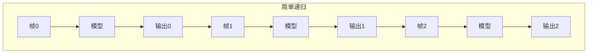
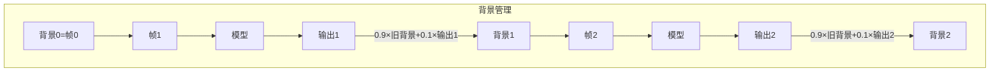
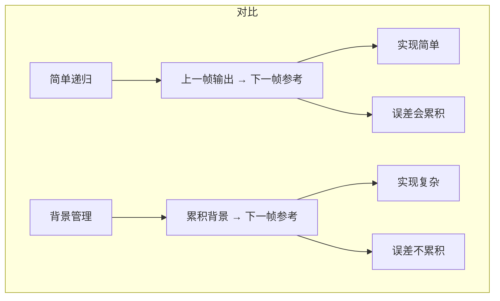

## 1. 什么是 IIR？

### 1.1 从字面拆解

**IIR** 全称是 **Infinite Impulse Response**（无限脉冲响应）。

这 4 个字看起来很吓人，但拆开看就不难了：

| 单词                | 直译          | 在训练循环里的含义                         |
| ----------------- | ----------- | --------------------------------- |
| **Impulse**（脉冲）   | 一个突然出现的输入信号 | 每一帧输入图像，就是一次“脉冲”                  |
| **Response**（响应）  | 系统对输入的反应    | 模型对当前帧的输出（去噪结果）                   |
| **Infinite**（无限的） | 没有终点，持续传递   | 每一帧的输出，都会作为下一帧的“状态”继续传递，理论上可以无限延续 |

**翻译成人话：当前帧的输出，会成为下一帧的输入之一。这个状态会一直传递下去，没有终点。**

### 1.2 一个生活类比

想象你在**学骑自行车**：

- **第 1 次练习**（第 1 帧）：你没有经验，只能凭感觉握把。**（没有上一帧的参考）**
- **第 2 次练习**（第 2 帧）：你回忆起第 1 次的感觉，调整了握把的力度和方向。**（参考了上一帧的经验）**
- **第 3 次练习**（第 3 帧）：你基于前两次的经验，越骑越稳。
- ……

每一帧的经验（输出）都会被传递到下一帧作为参考。**这就是 IIR 的本质——状态在帧与帧之间持续传递。**

### 1.3 IIR vs 普通前向传播（FIR）

在深度学习中，处理序列数据主要有两种方式：

| | **普通前向（无状态）** | **IIR（有状态传递）** |
|---|---|---|
| **做法** | 每一帧独立输入模型，帧与帧之间没有任何信息传递 | 当前帧的输入包含上一帧的输出（状态传递） |
| **比喻** | 每次考试都是独立考，考完就忘 | 每次考试都在前一次的基础上复习巩固 |
| **去噪效果** | 每帧去噪独立，看不到前后帧的变化 | 帧与帧之间的噪声差异被利用，去噪更准 |

多帧去噪之所以用 IIR，是因为噪声在每一帧的位置是随机的，通过对比前后帧的差异，模型能更准确地判断“哪些是噪声、哪些是真实纹理”。


## 2. 为什么去噪需要 IIR？

### 2.1 单帧去噪的局限

单帧去噪（只输入 1 张图）能做的非常有限：模型只能根据**这一张图本身**来判断“这个像素是噪声还是真实纹理”。如果一块区域很平坦，模型很难区分“纹理细节”和“噪声”。

### 2.2 多帧去噪的优势

当相机连续拍摄 15 张图时：
- **真实内容**（如物体边缘、纹理）在 15 张图里基本不变
- **噪声**（随机产生的）在 15 张图里**每一帧都不一样**

```text
帧1：真实内容 + 噪声A
帧2：真实内容 + 噪声B
帧3：真实内容 + 噪声C
...
帧15：真实内容 + 噪声O
```

模型通过对比这 15 张图，能精确判断出“哪些在变、哪些不变”，从而把随机变化的噪声去掉。

### 2.3 IIR 如何利用这个优势？

如果用普通前向传播，15 帧图是独立处理的：
- 帧1看自己的 → 输出结果1
- 帧2看自己的 → 输出结果2
- ……

如果用 IIR，帧与帧之间传递“状态”：
- 帧1：没有上一帧，硬着头皮处理 → 输出状态1
- 帧2：参考状态1 + 当前帧2 → 输出状态2
- 帧3：参考状态2 + 当前帧3 → 输出状态3
- ……

**效果**：模型不仅能“看现在”，还能“记过去”。这就像看视频时，不光看当前这一帧，还会参考前面几帧，判断更准确。


## 3. IIR 的两种实现方式

在代码里，IIR 有两种常见的实现方式，**一种实现采用简单递归**，**另一种采用背景管理**，正好代表了这两种。

### 3.1 方式 A：简单递归（某实现采用）

**做法**：上一帧的输出，直接作为下一帧的参考（`ref`）。

```text
帧0：ref = 全零（没有上一帧）
帧1：ref = 上一帧的输出（帧0的去噪结果）
帧2：ref = 上一帧的输出（帧1的去噪结果）
帧3：ref = 上一帧的输出（帧2的去噪结果）
…
```

**优点**：简单直接，代码少，计算快。
**缺点**：上一帧的误差会持续传递和累积。如果某一帧去噪效果不好，这个不好的输出会污染后续所有帧。

### 3.2 方式 B：背景管理（另一种实现采用）

**做法**：不是直接用上一帧的输出，而是维护一个**累积的背景图（`background`）**。

```text
帧0：background = 当前帧（初始化）
帧1：background = 0.9 × background + 0.1 × 当前帧输出（融合）
帧2：background = 0.9 × background + 0.1 × 当前帧输出（融合）
帧3：background = 0.9 × background + 0.1 × 当前帧输出（融合）
…
```

每一帧参考的不是“上一帧的原始输出”，而是**累积到现在的背景图**。

**优点**：误差不会累积（因为有 0.9×旧背景 + 0.1×新帧，新帧的影响被限制在 10%）。如果某一帧出现了运动，可以检测到并重置背景。
**缺点**：实现复杂，代码多，需要额外维护背景和运动检测。

### 3.3 两种方式的对比图



## 4. IIR 在代码中的样子（概念层面）

### 4.1 简单递归的核心模式

```python
# 伪代码——简化的 IIR 循环结构
ref = 初始值          # 首帧没有上一帧
for n in range(15):
    cur = 当前帧
    output = model(ref, cur, noise_params)   # 模型接收参考帧和当前帧
    ref = output          # 核心：当前帧的输出变成下一帧的参考
    # 下一轮循环时，ref 就是上一帧的输出了
```

### 4.2 背景管理的核心模式

```python
# 伪代码——带背景管理的 IIR 循环结构
background = 初始值
for n in range(15):
    cur = 当前帧
    output = model(background, cur, noise_params)   # 参考的是累积背景，不是上一帧输出
    
    # 更新背景：融合旧背景和当前输出
    background = 0.9 × background + 0.1 × output
```


## 5. 背景管理到底“管”了什么？

“背景管理”听起来很抽象，其实就是控制**背景怎么更新**的规则。一种背景管理的实现主要做了三件事：
### 5.1 运动检测

如果当前帧和背景差异很大，说明画面里有**运动物体**（比如有人走过）。此时如果继续把当前帧混入背景，运动物体会留下“拖影”。

**做法**：检测到运动 → 重置背景，直接用当前输出替换背景，而不是融合。

### 5.2 加权融合（EMA）

对于静止区域，背景用**指数移动平均（EMA）** 累积：

```text
新背景 = α × 旧背景 + (1-α) × 当前输出
```

其中 α 是一个接近 1 的数（如 0.9），表示旧背景占主导，当前输出只贡献一小部分。这样背景会逐渐变得“干净”，因为噪声在多次平均中被消掉了。

### 5.3 α 的递增（让背景越来越“稳”）

随着时间推移，背景越来越干净。α 也会逐渐增大（如从 0.5 增加到 0.97），表示模型越来越信任累积的背景，新帧的贡献越来越小。


## 6. 两种方式对比总结




## 7. 一句话总结

> **IIR 是一种“记忆传递”机制**：每一帧的去噪结果都会作为下一帧的参考（参考帧），让模型能利用前后帧的信息更准确地区分噪声和真实纹理。其中一种实现是“简单递归”（上一帧输出直接传），另一种是“背景管理”（累积背景 + 运动检测）。**需要迁移的核心任务，就是把简单递归的模型调用方式，改成背景管理的调用方式，并让模型能用 3 个参数接收输入。**