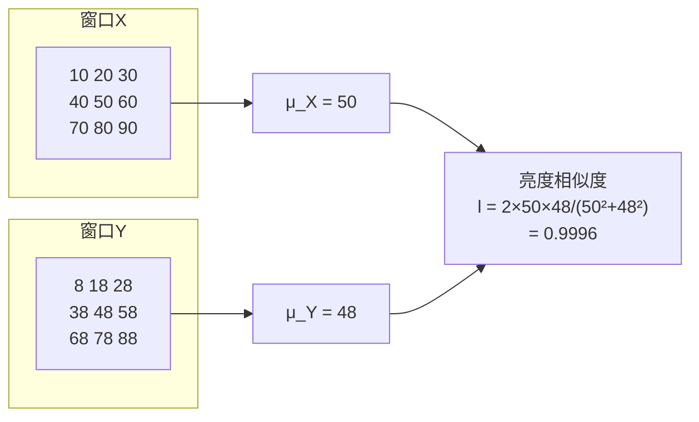
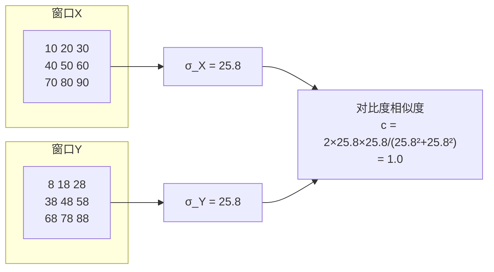
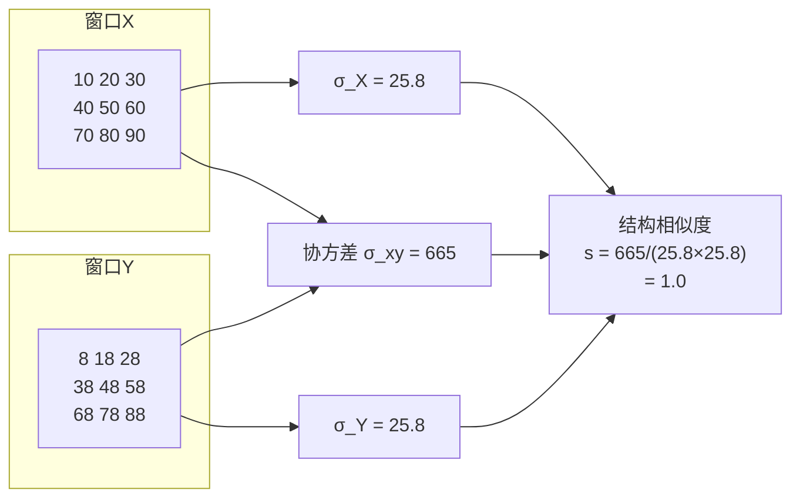
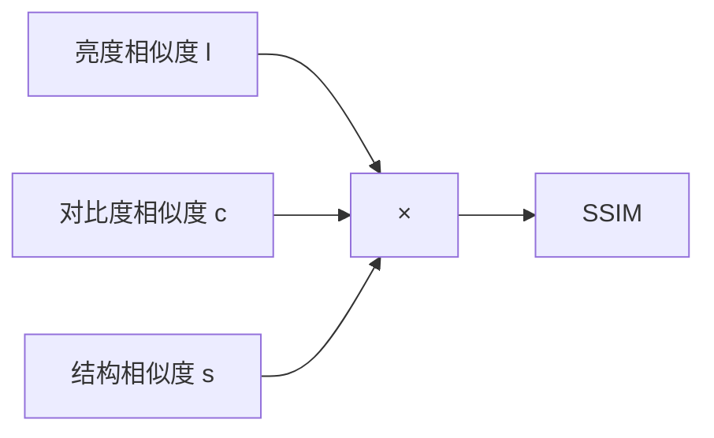
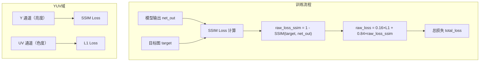

# SSIM（结构相似性指标）

> **为什么逐像素比较（L1/L2）在图像任务中有缺陷？SSIM 是怎么解决这个问题的？**

## 1. 为什么需要 SSIM？

### 1.1 L1/L2 的局限：逐像素比较的“视觉盲区”

L1 和 L2 损失都是**逐像素比较**：将两张图像的每个对应像素相减，然后求平均或平方和。

```text
目标图：                    预测图A（结构正确，亮度略低）：
┌─────────────────┐        ┌─────────────────┐
│ 100  120  100   │        │  90  108   90   │
│ 120  150  120   │        │ 108  135  108   │
│ 100  120  100   │        │  90  108   90   │
└─────────────────┘        └─────────────────┘
                           L2 误差：每个像素差 10，平方和 900 (每个像素差值都是 10，共 9 个像素，所以平方和 = 9×102=9009×102=900)

预测图B（像素值接近，但结构错乱）：
┌─────────────────┐
│ 120  100  120   │
│ 150  120  150   │
│ 120  100  120   │
└─────────────────┘
L2 误差：每个像素差值有 20 也有 30，实际平方和 = 6×202+3×302=2400+2700=51006×202+3×302=2400+2700=5100
```

人眼会认为预测图A更好（结构正确，仅略暗一些），但 L2 会认为预测图B更好（误差更小）。**L1/L2 仅关心“像素值差多少”，不关心“空间结构是否合理”。**
> **L2 Loss（MSELoss）** 实际计算的是 **“平均”平方误差**（MSE），即平方和除以像素个数。但“平方和”本身指将每个位置的误差平方后全部相加——平方操作会急剧放大较大误差的惩罚（例如差30的惩罚是差20的两倍多），这正是 L2 Loss 对异常值敏感的根本原因。

### 1.2 SSIM 的核心思想

SSIM 不逐像素比较，而是**比较局部窗口内的结构模式**——同一窗口内像素之间的相对关系。

```text
窗口 A（目标）：        窗口 B（预测）：
┌─────────┐            ┌─────────┐
│ 10  20  │            │  8  18  │
│ 30  40  │            │ 28  38  │
└─────────┘            └─────────┘
两个窗口的亮度不同，但“结构”相同（从左到右递增，从上到下递增）
SSIM 会判定它们高度相似——这才是人眼的判断方式。
```

> **术语解释**：**SSIM（Structural Similarity Index，结构相似性指标）** 是一种衡量两幅图像相似度的指标，从三个维度比较：亮度（Luminance）、对比度（Contrast）和结构（Structure）。
> SSIM 值范围在 0 到 1 之间，越接近 1 表示两幅图越相似。在 Loss 计算中，通常用 `1 - SSIM` 作为损失值。

## 2. SSIM 的三个维度

SSIM 通过一个**滑动窗口**（通常 11×11）在图像上逐像素滑动，对每个窗口计算三个维度的相似度，然后取平均。

SSIM 的计算不针对整张图像，而是在一个**滑动窗口**内逐像素比较。该窗口内的值就是**当前滑动窗口覆盖到的所有像素的亮度值**（灰度值或单个通道的亮度值）。

```
┌─────────────────────────────────────────────────────────────────────────────┐
│                          图像（H × W）                                    │
│  ┌───────────────────────────────────────────────────────────────────────┐ │
│  │  ┌─────────┐                                                       │ │
│  │  │ 11×11   │  ← 这是一个滑动窗口，覆盖图像的一个局部区域              │ │
│  │  │ 窗口    │  │                                                       │ │
│  │  └─────────┘                                                       │ │
│  │                                                                     │ │
│  │  → 窗口在图像上从左到右、从上到下逐像素滑动                        │ │
│  │  → 每个位置计算一次 SSIM                                          │ │
│  │  → 最终取所有位置的平均值作为整张图的 SSIM                        │ │
│  └───────────────────────────────────────────────────────────────────────┘ │
└─────────────────────────────────────────────────────────────────────────────┘
```
> 11×11 是 SSIM 论文中推荐的默认窗口大小，基于实验经验得出。

### 2.1 维度一：亮度（Luminance）

比较窗口内像素的**平均亮度**是否相似。

$\mu = \frac{p_1 + p_2 + \dots + p_n}{n}$

$l(x,y) = \frac{2\mu_x \mu_y}{\mu_x^2 + \mu_y^2}$

> 该公式本质上询问：**“两个窗口的平均亮度，匹配程度有多高？”**
> 这是 **“比例相似度”的数学标准形式**——将“大小”缩放到0~1范围内，专门判断两个数的“相对比例”是否接近1，而非判断它们的“绝对距离”是否接近0。



### 2.2 维度二：对比度（Contrast）

在计算机视觉中，“对比度”定义为**图像亮度的变化幅度**。
比较窗口内像素的**变化幅度**（标准差）是否相似。

**标准差 σ**（对比度/变化幅度）：
$\sigma = \sqrt{\frac{(p_1-\mu)^2 + (p_2-\mu)^2 + \dots + (p_n-\mu)^2}{n}}$

**对比度相似度公式**（简化）：
$c(x,y) = \frac{2\sigma_x \sigma_y}{\sigma_x^2 + \sigma_y^2}$

> 标准差衡量的是**一组数据“散开”的程度**。在图像窗口中，它衡量的是**像素值偏离平均值的幅度**。

- 标准差很小 → 窗口内很“平”，缺乏纹理细节 → **低对比度**。
- 标准差很大 → 窗口内有明显边缘或纹理 → **高对比度**。



### 2.3 维度三：结构（Structure）

比较窗口内像素的**相对位置关系**（协方差）是否相似。这是 SSIM 最核心的维度——它检验“亮的位置是否一起亮，暗的位置是否一起暗”。

**协方差 σ_xy**（结构/位置关系）：
$\sigma_{xy} = \frac{(x_1-\mu_x)(y_1-\mu_y) + \dots + (x_n-\mu_x)(y_n-\mu_y)}{n}$

**结构相似度公式**（简化）：
$s(x,y) = \frac{\sigma_{xy}}{\sigma_x \sigma_y}$



> ### 1. 为什么协方差能检查“亮的位置一起亮”？
> 
> 我们直接计算两组**一维数组**（假设它们是图像窗口中拉直的一行像素），来看协方差的运作方式。
> 
> **案例：两组数据的“位置配对”**  
> 假设窗口 A（目标图）和窗口 B（预测图）各有4个像素值。
> 
> **情况 1：结构一致（完美正相关）**
> 
> ```text
> 窗口 A (x): [ 10, 20, 30, 40 ]  -> 均值 μ_x = 25
> 窗口 B (y): [ 11, 21, 31, 41 ]  -> 均值 μ_y = 26
> ```
> 
> 现计算每个位置相对于均值的**偏移量（偏差）**：
> 
> ```text
> 位置1: (x-μx) = -15 ,  (y-μy) = -15  →  乘积 = (+225)   (负负得正)
> 位置2: (x-μx) = -5  ,  (y-μy) = -5   →  乘积 = (+25)    (负负得正)
> 位置3: (x-μx) = +5  ,  (y-μy) = +5   →  乘积 = (+25)    (正正得正)
> 位置4: (x-μx) = +15 ,  (y-μy) = +15  →  乘积 = (+225)   (正正得正)
> ```
> 
> **结果**：`乘积和 = 500`。**全正**。说明 A 暗的位置 B 也暗，A 亮的位置 B 也亮，**相对位置完全匹配**。
> 
> **情况 2：结构错乱（负相关）**  
> 窗口 A 不变，窗口 B 完全**反转**（反相/明暗颠倒）。
> 
> ```text
> 窗口 A (x): [ 10, 20, 30, 40 ]  -> 均值 μ_x = 25
> 窗口 B (z): [ 40, 30, 20, 10 ]  -> 均值 μ_z = 25  (注意：B的平均值居然和A一样！)
> ```
> 
> 此时再观察偏移量：
> 
> ```text
> 位置1: (x-μx) = -15 ,  (z-μz) = +15  →  乘积 = (-225)   (负正得负)
> 位置2: (x-μx) = -5  ,  (z-μz) = +5   →  乘积 = (-25)    (负正得负)
> 位置3: (x-μx) = +5  ,  (z-μz) = -5   →  乘积 = (-25)    (正负得负)
> 位置4: (x-μx) = +15 ,  (z-μz) = -15  →  乘积 = (-225)   (正负得负)
> ```
> 
> **结果**：`乘积和 = -500`。**全负**。说明 A 亮的位置 B 反而暗，**位置关系完全错乱**。
> 
> **结论**：正是因为有 `(x - μ_x) × (y - μ_y)` 这一步**逐位置配对相乘**，协方差才能检验出“该像素相对于其均值是高是低”。如果两张图的结构一致，则配对位置的“高低起伏”完全同步（两数同正或同负），乘积为正；如果结构错乱，则完全相反（一正一负），乘积为负。
> 
> ---
> 
> ### 2. 拆解公式：`σ_xy = Σ (xi-μx)(yi-μy) / n`
> 
> - **`(xi-μx)`**：代表 x 的该像素**比其平均亮度高出多少**（正数=亮，负数=暗）。
> - **`(yi-μy)`**：代表 y 的该像素**比其平均亮度高出多少**。
> - **两数相乘**：即**“配对检验”**。只有同一位置的像素才会相乘，这在数学上强制要求“相对位置”必须对齐。若不按位置相乘（如仅比较直方图），位置信息便丢失；而逐位置相乘正是保留空间结构的本质。
> - **Σ 求和再除以 n**：将所有位置的“配对结果”相加求平均，得到一个综合的“平均协同变化强度”。
> 
> ---
> 
> ### 4. 拆解结构公式：`s(x,y) = σ_xy / (σ_x · σ_y)`
> 
> 之前的亮度公式 `2ab/(a²+b²)` 是在0~1之间衡量**倍数关系**。而这里的 `σ_xy / (σ_x · σ_y)` 是**归一化协方差（即皮尔逊相关系数）**，用于衡量两组数据的**线性相关强度**（取值范围 -1 到 1）。
> 
> - **为什么要除以 `(σ_x · σ_y)`？**  
>   直接计算的协方差 `σ_xy` 是“有单位的绝对数值”。若图像整体对比度很大（像素值动辄数百），协方差会很大；若对比度很小，协方差则很小。这会导致同一结构在亮图上计算出的分数高，在暗图上分数低。  
>   **除的作用**：用各自的标准差消除“尺度”影响。这样得到的 `s(x,y)` 只关心“两个窗口的起伏形状是否一致”，而不关心“起伏的幅度有多大”（幅度由对比度管理）。
> - **在 SSIM 中**：`s(x,y)` 接近1，表示两个窗口的“起伏形状”完全相同；接近0，表示无关；出现负数，表示结构反转（虽然图像去噪一般不会出现负数，但理论上存在）。

### 2.4 三个维度如何合并？

三个维度的相似度分别计算后，SSIM 将它们**相乘**合并为一个综合分数：

$\text{SSIM}(x, y) = l(x,y)^\alpha \times c(x,y)^\beta \times s(x,y)^\gamma$

其中：
- $l(x,y)$：亮度相似度（Luminance）
- $c(x,y)$：对比度相似度（Contrast）
- $s(x,y)$：结构相似度（Structure）
- $\alpha, \beta, \gamma$：三个维度的权重指数，控制每个维度的重要性

通常取 $\alpha = \beta = \gamma = 1$，即三个维度权重相等，简化为：
$\text{SSIM}(x, y) = l(x,y) \times c(x,y) \times s(x,y)$



## 3. 用真实数字走一遍完整计算

### 3.1 输入数据

假设两个 3×3 窗口：

```text
窗口 X（目标图）：         窗口 Y（预测图）：
┌─────────────┐           ┌─────────────┐
│ 10  20  30  │           │  8  18  28  │
│ 40  50  60  │           │ 38  48  58  │
│ 70  80  90  │           │ 68  78  88  │
└─────────────┘           └─────────────┘
```

窗口 Y 是窗口 X 整体减2（亮度略低，但结构完全一致）。

### 3.2 步骤 1：计算均值

```text
μ_X = (10+20+30+40+50+60+70+80+90) / 9 = 450 / 9 = 50
μ_Y = (8+18+28+38+48+58+68+78+88) / 9 = 432 / 9 = 48
```

### 3.3 步骤 2：计算标准差

```text
σ_X² = ((10-50)² + (20-50)² + ... + (90-50)²) / 9
     = (1600+900+400+100+0+100+400+900+1600) / 9
     = 6000 / 9 = 666.67
σ_X = √666.67 ≈ 25.82

σ_Y² = ((8-48)² + (18-48)² + ... + (88-48)²) / 9
     = (1600+900+400+100+0+100+400+900+1600) / 9
     = 6000 / 9 = 666.67
σ_Y ≈ 25.82
```

### 3.4 步骤 3：计算协方差

```text
σ_XY = Σ(x_i - μ_X)(y_i - μ_Y) / n

逐项计算：
(10-50)(8-48) = (-40)(-40) = 1600
(20-50)(18-48) = (-30)(-30) = 900
(30-50)(28-48) = (-20)(-20) = 400
(40-50)(38-48) = (-10)(-10) = 100
(50-50)(48-48) = 0
(60-50)(58-48) = (10)(10) = 100
(70-50)(68-48) = (20)(20) = 400
(80-50)(78-48) = (30)(30) = 900
(90-50)(88-48) = (40)(40) = 1600

σ_XY = (1600+900+400+100+0+100+400+900+1600) / 9
     = 6000 / 9 = 666.67
```

### 3.5 步骤 4：计算三个维度相似度

```text
亮度相似度 l = 2×μ_X×μ_Y / (μ_X² + μ_Y²)
              = 2×50×48 / (2500 + 2304)
              = 4800 / 4804 ≈ 0.9992

对比度相似度 c = 2×σ_X×σ_Y / (σ_X² + σ_Y²)
                = 2×25.82×25.82 / (666.67 + 666.67)
                = 1333.33 / 1333.34 ≈ 0.9999

结构相似度 s = σ_XY / (σ_X×σ_Y)
              = 666.67 / (25.82×25.82)
              = 666.67 / 666.67 ≈ 1.0000
```

### 3.6 步骤 5：计算最终 SSIM

```text
SSIM = l × c × s = 0.9992 × 0.9999 × 1.0000 ≈ 0.9991
```

SSIM ≈ 0.9991（接近1），说明两幅图几乎一致——尽管整体亮度略有差异，但结构完全一致。

## 4. 用真实数字走一遍“结构破坏”的情况

现在看另一个预测图，像素值接近但结构错乱：

```text
窗口 X（目标图）：         窗口 Z（预测图，结构错乱）：
┌─────────────┐           ┌─────────────┐
│ 10  20  30  │           │ 30  20  10  │
│ 40  50  60  │           │ 60  50  40  │
│ 70  80  90  │           │ 90  80  70  │
└─────────────┘           └─────────────┘
```

窗口 Z 是窗口 X 的**左右翻转**，像素值完全一样（仅位置相反）。

逐像素 L2 比较时，窗口 X 和窗口 Z 的像素值完全一样，L2 = 0，会认为它们完美匹配。但人眼一眼就能看出两张图不同，因为**结构被破坏**。

SSIM 的协方差计算：

```text
X 的排列：10,20,30,40,50,60,70,80,90
Z 的排列：30,20,10,60,50,40,90,80,70

μ_X = 50, μ_Z = 50
σ_X = 25.82, σ_Z = 25.82（像素值相同，标准差相同）

协方差 σ_XZ（注意：顺序变了，对应关系变了）：
(10-50)(30-50) = (-40)(-20) = 800
(20-50)(20-50) = (-30)(-30) = 900
(30-50)(10-50) = (-20)(-40) = 800
(40-50)(60-50) = (-10)(10) = -100
(50-50)(50-50) = 0
(60-50)(40-50) = (10)(-10) = -100
(70-50)(90-50) = (20)(40) = 800
(80-50)(80-50) = (30)(30) = 900
(90-50)(70-50) = (40)(20) = 800

σ_XZ = (800+900+800-100+0-100+800+900+800) / 9
     = 4800 / 9 = 533.33
```

结构相似度：

```text
s = σ_XZ / (σ_X×σ_Z) = 533.33 / (25.82×25.82) = 533.33 / 666.67 ≈ 0.8000
```

最终 SSIM = l × c × s = 1.0 × 1.0 × 0.8000 = 0.8000

SSIM 从 0.9991 降至 0.8000，成功检测到结构破坏！这就是为何在去噪任务中使用 SSIM 比 L1/L2 更合理——它不会被像素值“迷惑”，能真正判断图像结构是否被保留。

## 5. SSIM 在训练代码中的实现

### 5.1 代码中的位置

**定义（`loss`）**：
```python
class SSIM(nn.Module):
    def __init__(self, chns=4, size_average=True):
        # chns：通道数（RAW 图是 4 通道）
        # size_average：是否对空间维度求平均
        ...
    
    def forward(self, img1, img2):
        # img1, img2: [B, C, H, W]
        # 计算每个通道的 SSIM，然后取平均
        ssim_map = self._ssim(img1, img2)
        return ssim_map.mean()
```

**调用（`train`）**：
```python
# RAW 域 SSIM Loss
self.ssim_loss = SSIM(chns=4, size_average=True)
raw_loss_ssim = 1 - self.ssim_loss(target_mix_noise, net_out)

# YUV 域 SSIM Loss（在 Y 通道上）
y_loss_msssim = 1 - self.ssim_loss(net_out_y, gt_y)
```

### 5.2 为什么 SSIM Loss 是 `1 - SSIM`？

SSIM 值范围是 0 到 1，越接近 1 表示图像越相似。Loss 的目标是**最小化损失**，因此使用 `1 - SSIM` 作为损失值。当 SSIM 接近 1 时，Loss 接近 0，表示模型输出与目标非常相似。

## 6. SSIM 在训练中的使用场景



## 7. 一句话总结

> **SSIM 从亮度、对比度、结构三个维度衡量图像相似度，核心是“结构相似度”（协方差），它比 L1/L2 更能反映人眼感知。在去噪训练中，SSIM Loss = 1 - SSIM 被用于 RAW 域和 YUV 域，与 L1 互补（L1 保像素，SSIM 保结构）。**