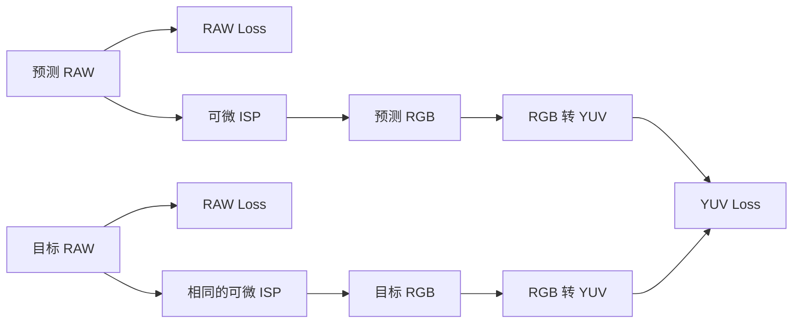
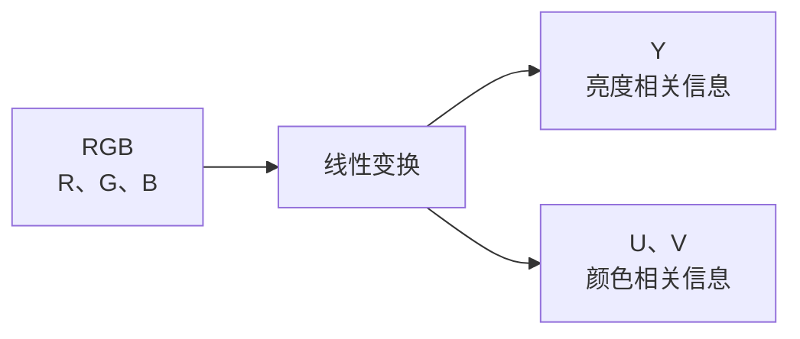
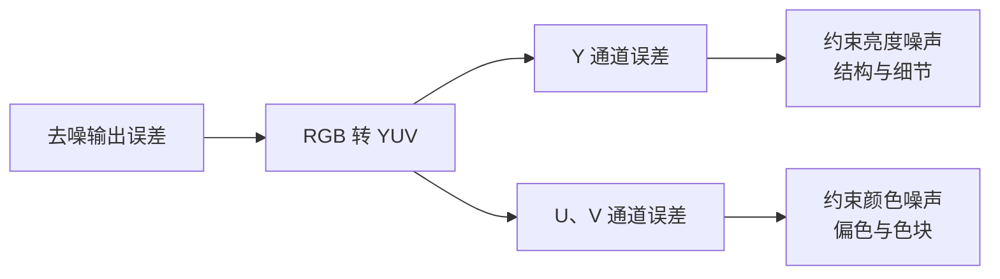
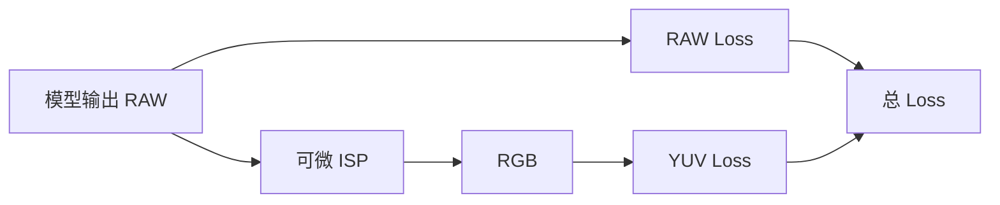
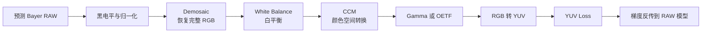
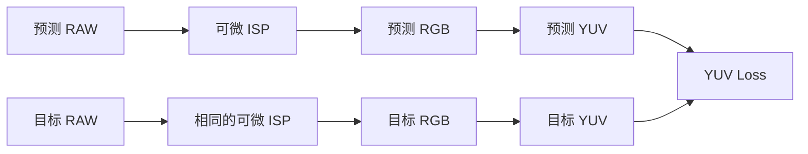
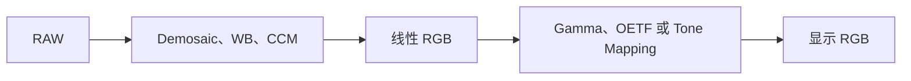

## 1. YUV Loss 要解决什么问题

RAW 去噪模型通常直接输出预测 RAW，最基础的监督方式是比较预测 RAW 与目标 RAW。

假设一共有 $N$ 个 RAW 数值，RAW L1 Loss 可以写成：

$$
\mathcal{L}_{raw}=\frac{1}{N}\sum_{p=1}^{N}\left|\hat{R}_{raw,p}-R_{raw,p}\right|
$$

其中：

- $\hat{R}_{raw,p}$：预测 RAW 的第 $p$ 个数值；
- $R_{raw,p}$：目标 RAW 的第 $p$ 个数值；
- $N$：参与计算的 RAW 数值总数。

RAW Loss 能约束模型输出是否接近目标传感器数据，但它无法直接区分误差主要表现为：

```text
亮度变化

还是

颜色变化
```

最终图像经过 ISP 后，亮度噪声和颜色噪声对视觉效果的影响不同。

因此，一种常见做法是在 RAW Loss 之外增加一条图像域监督：



两类 Loss 的分工是：

```text
RAW Loss：
约束预测结果在传感器域是否正确

YUV Loss：
约束预测结果经过成像处理后的亮度和颜色是否正确
```

YUV Loss 通常不是替代 RAW Loss，而是对 RAW Loss 的补充。

## 2. YUV 是什么

RGB 使用三个通道表示颜色：

```text
R：红色分量
G：绿色分量
B：蓝色分量
```

YUV 则把同一组 RGB 信息重新组合成：

```text
Y：亮度相关分量
U：蓝色方向的色度差异
V：红色方向的色度差异
```




严格来说，深度学习代码中常被称为 YUV 的数字变换，很多实际更接近 **YCbCr**。

**YCbCr**：数字图像中常用的亮度与色度表示，其中 $Y'$ 表示非线性亮度分量，$Cb$ 和 $Cr$ 表示两组色度差异。

为了与工程代码中的常见命名保持一致，本文继续使用 YUV，并将三个通道记作 $Y、U、V$。

### 2.1 Y 通道

**Luma，亮度分量**：由 RGB 三个通道加权组合而成，主要描述明暗、边缘和纹理结构。

一种常见的 BT.601 全范围转换形式为：

$$
Y=0.299R+0.587G+0.114B
$$

三个通道的权重不同，其中 G 通道对 Y 的贡献最大。

### 2.2 U 和 V 通道

U 和 V 主要描述颜色相对于亮度的偏移。

一种常见的转换形式为：

$$
U=-0.168736R-0.331264G+0.5B
$$

$$
V=0.5R-0.418688G-0.081312B
$$

完整矩阵形式为：

$$
\begin{bmatrix}Y\\U\\V\end{bmatrix}=\begin{bmatrix}0.299&0.587&0.114\\-0.168736&-0.331264&0.5\\0.5&-0.418688&-0.081312\end{bmatrix}\begin{bmatrix}R\\G\\B\end{bmatrix}
$$

这不是从 RGB 中产生新的信息，而是把原来的 RGB 信息投影到新的三个方向：

```text
RGB 表示：
按红、绿、蓝组织信息

YUV 表示：
按亮度、蓝色色差、红色色差组织信息
```

## 3. 为什么 YUV 能拆分亮度误差和颜色误差

RGB Loss 直接比较三个颜色通道。

以 L1 Loss 为例：

$$
\mathcal{L}_{rgb}=\frac{1}{3N}\sum_{p=1}^{N}\left(\left|\hat{R}_p-R_p\right|+\left|\hat{G}_p-G_p\right|+\left|\hat{B}_p-B_p\right|\right)
$$

它可以衡量 RGB 数值是否接近，但不会直接指出误差最终主要表现为：

```text
整体变亮或变暗

还是

发生颜色偏移
```

YUV 通过不同的线性组合，把这两类变化投影到不同通道中。


### 3.1 亮度变化主要进入 Y 通道

假设 RGB 三个通道同时增加 $0.05$：

$$
\Delta RGB=\begin{bmatrix}0.05\\0.05\\0.05\end{bmatrix}
$$

Y 通道的变化为：

$$
\Delta Y=0.299\times0.05+0.587\times0.05+0.114\times0.05=0.05
$$

U 通道的变化为：

$$
\Delta U=-0.168736\times0.05-0.331264\times0.05+0.5\times0.05=0
$$

V 通道的变化约为：

$$
\Delta V=0.5\times0.05-0.418688\times0.05-0.081312\times0.05\approx0
$$

因此，当 R、G、B 同方向、同幅度变化时：

```text
R、G、B 同时增加或减少
              ↓
主要进入 Y 通道
              ↓
表现为整体亮度变化
```

### 3.2 颜色变化主要进入 U、V 通道

假设红色增加 $0.05$，蓝色减少 $0.05$，绿色不变：

$$
\Delta RGB=\begin{bmatrix}0.05\\0\\-0.05\end{bmatrix}
$$

Y 通道的变化为：

$$
\Delta Y=0.299\times0.05+0.587\times0+0.114\times\left(-0.05\right)=0.00925
$$

U 通道的变化为：

$$
\Delta U=-0.168736\times0.05-0.331264\times0+0.5\times\left(-0.05\right)=-0.0334368
$$

V 通道的变化为：

$$
\Delta V=0.5\times0.05-0.418688\times0-0.081312\times\left(-0.05\right)=0.0290656
$$

此时 Y 的变化较小，而 U、V 的变化更加明显。

```text
不同 RGB 通道变化方向不同
              ↓
主要进入 U、V 通道
              ↓
表现为颜色偏移
```

因此，YUV 并不是让亮度和颜色绝对独立，而是让两类误差在不同通道中更容易被分别观察和约束。

## 4. 为什么这种拆分对去噪有帮助

去噪结果中常见的问题可以大致分为两类：

```text
亮度噪声：
颗粒、明暗波动、边缘不稳定、纹理抖动

颜色噪声：
彩色斑点、局部偏色、色块、颜色漂移
```

在 RGB 空间中，这两类误差混合在 R、G、B 三个通道里。

转换到 YUV 后：

```text
Y 通道：
主要承载明暗、边缘和纹理结构

U、V 通道：
主要承载颜色差异和色彩稳定性
```



### 4.1 分别计算亮度与颜色 Loss

假设图像中共有 $N$ 个像素，Y 通道 L1 Loss 为：

$$
\mathcal{L}_{Y}=\frac{1}{N}\sum_{p=1}^{N}\left|\hat{Y}_p-Y_p\right|
$$

U、V 通道联合 L1 Loss 为：

$$
\mathcal{L}_{UV}=\frac{1}{2N}\sum_{p=1}^{N}\left(\left|\hat{U}_p-U_p\right|+\left|\hat{V}_p-V_p\right|\right)
$$

完整 YUV Loss 可以写成：

$$
\mathcal{L}_{yuv}=\lambda_Y\mathcal{L}_{Y}+\lambda_{UV}\mathcal{L}_{UV}
$$

其中：

- $\lambda_Y$：控制亮度误差的重要程度；
- $\lambda_{UV}$：控制颜色误差的重要程度。


这种拆分让训练目标可以分别回答：

```text
预测图像的亮度是否稳定

预测图像的颜色是否准确
```

### 4.2 给颜色误差独立的监督信号

在 RGB Loss 中，大面积纹理和亮度误差可能占据主要 Loss。

此时，一些数值较小但视觉上明显的彩色噪点，可能得不到足够关注。

把 U、V 单独计算后，颜色误差拥有独立的优化项，因此更容易约束：

```text
低照度彩色噪点
局部偏色
颜色块状噪声
去噪后的颜色漂移
```

YUV Loss 的核心价值不是一定比 RGB Loss 更准确，而是：

> 它让亮度和颜色拥有可以独立观察、独立加权的训练信号。

## 5. YUV Loss 与 RAW Loss 的关系

YUV Loss 和 RAW Loss 属于不同域中的监督。

```text
RAW Loss：
传感器域监督

YUV Loss：
图像域监督
```

二者是并列关系，而不是替代关系。



总 Loss 可以写成：

$$
\mathcal{L}_{total}=\lambda_{raw}\mathcal{L}_{raw}+\lambda_{yuv}\mathcal{L}_{yuv}
$$

其中：

```text
RAW Loss：
保证预测 RAW 与目标 RAW 在传感器域接近

YUV Loss：
保证预测 RAW 经过成像处理后的亮度和颜色接近目标
```

只使用 RAW Loss，模型可能在 RAW 数值上接近目标，但最终显示图像仍可能存在颜色或亮度问题。

只使用 YUV Loss，则可能无法充分限制预测 RAW 的传感器域数值。

因此，更完整的监督关系是：

```text
RAW 数值正确
+
最终亮度正确
+
最终颜色正确
```

## 6. RAW 域训练中怎样正确使用 YUV Loss

### 6.1 Bayer RAW 不能直接使用标准 YUV 变换

Bayer RAW 是单通道马赛克数据，例如 RGGB 排列：

```text
R G R G
G B G B
R G R G
G B G B
```

同一个空间位置通常只记录 R、G、B 中的一种颜色。

而标准 RGB 到 YUV 变换要求同一个位置同时具有：

```text
R
G
B
```

因此下面的流程不成立：

```text
单通道 Bayer RAW
        ↓
直接使用 RGB 到 YUV 矩阵
```

因为 Bayer RAW 还不是完整的 RGB 图像。

### 6.2 标准做法：先经过可微 ISP

**可微 ISP**：由可求导操作组成的 ISP 流程，允许最终图像域 Loss 的梯度反向传播到 RAW 去噪模型。

一个简化流程为：



预测 RAW 和目标 RAW 必须经过相同的 ISP 流程和相同参数：



否则 Loss 中会混入两套 ISP 的参数差异，无法只反映模型的去噪误差。

### 6.3 在线性 RGB 还是非线性 RGB 上计算

RAW 经过 Demosaic、白平衡和 CCM 后，通常得到**线性 RGB**。

经过 Gamma、OETF 或 Tone Mapping 后，得到更接近显示效果的**非线性 RGB**。



标准数字 YCbCr 中的 $Y'$ 通常是根据非线性 $R'G'B'$ 计算的：

$$
Y'=0.299R'+0.587G'+0.114B'
$$

因此，当目标是约束最终显示效果时，一种常见做法是：

```text
RAW
→ Demosaic
→ White Balance
→ CCM
→ Gamma 或 OETF
→ YUV Loss
```

如果直接在线性 RGB 上使用相同矩阵，仍然可以把误差投影到亮度方向和颜色方向，但它不再严格等同于标准显示空间中的 $Y'CbCr$。

二者的区别是：

```text
显示 RGB 上计算：
更接近最终人眼看到的亮度和颜色

线性 RGB 上计算：
更接近线性光强关系
属于 YUV-like 线性投影 Loss
```

### 6.4 没有可微 ISP 时的近似做法

另一种常见做法是对 4 通道 Packed RAW 做近似亮度约束。

假设 Packed RAW 通道顺序为：

```text
R、Gb、Gr、B
```

先计算近似 G：

$$
G_{approx}=\frac{G_b+G_r}{2}
$$

再计算近似 Y：

$$
Y_{approx}=0.299R+0.587G_{approx}+0.114B
$$

对应的近似亮度 Loss 为：

$$
\mathcal{L}_{Y,approx}=\frac{1}{N}\sum_{p=1}^{N}\left|\hat{Y}_{approx,p}-Y_{approx,p}\right|
$$

这种做法存在明确限制：

```text
没有 Demosaic
没有 White Balance
没有 CCM
没有完整 Gamma 或 Tone Mapping
```

而且 Packed RAW 中的 R、Gb、Gr、B 来自一个 Bayer 小块中的不同采样位置，并不是真正位于同一个像素位置的完整 RGB。

因此：

> Packed RAW 上计算出的 $Y_{approx}$ 只能被称为近似亮度监督，不能等同于最终 ISP 输出中的标准 Y 通道，也不应直接称为完整 YUV Loss。

## 7. 工程实现

下面的实现假设输入是归一化到 $[0,1]$、Shape 为`[B,3,H,W]`的 RGB，并采用 BT.601 风格的全范围转换。

```python
import torch
import torch.nn.functional as F

def rgb_to_yuv(rgb):
    if rgb.ndim != 4 or rgb.shape[1] != 3:
        raise ValueError("rgb must have shape [B, 3, H, W]")

    matrix = rgb.new_tensor([
        [0.299000, 0.587000, 0.114000],
        [-0.168736, -0.331264, 0.500000],
        [0.500000, -0.418688, -0.081312],
    ])

    return torch.einsum("bchw,oc->bohw", rgb, matrix)

def yuv_l1_loss(pred_rgb, target_rgb, lambda_y=1.0, lambda_uv=1.0):
    pred_yuv = rgb_to_yuv(pred_rgb)
    target_yuv = rgb_to_yuv(target_rgb)

    loss_y = F.l1_loss(pred_yuv[:, 0:1], target_yuv[:, 0:1])
    loss_uv = F.l1_loss(pred_yuv[:, 1:3], target_yuv[:, 1:3])
    loss_total = lambda_y * loss_y + lambda_uv * loss_uv

    return loss_total, loss_y, loss_uv
```

RAW 域训练中的调用关系为：

```python
pred_raw = model(noisy_raw)

loss_raw = F.l1_loss(pred_raw, target_raw)

pred_rgb = differentiable_isp(pred_raw)
target_rgb = differentiable_isp(target_raw)

loss_yuv, loss_y, loss_uv = yuv_l1_loss(pred_rgb, target_rgb, lambda_y=1.0, lambda_uv=1.0)

loss_total = lambda_raw * loss_raw + lambda_yuv * loss_yuv
```

梯度传播路径为：

```text
YUV Loss
→ RGB 到 YUV 变换
→ 可微 ISP
→ 预测 RAW
→ RAW 去噪模型
```

RGB 到 YUV 是线性矩阵运算，可微 ISP 中的操作也必须保持可微，梯度才能传回 RAW 模型。

### 7.1 Packed RAW 近似 Y Loss

如果输入是`[B,4,H,W]`，通道顺序为`R、Gb、Gr、B`，可以实现近似 Y：

```python
import torch
import torch.nn.functional as F

def packed_raw_to_approx_y(packed_raw):
    if packed_raw.ndim != 4 or packed_raw.shape[1] != 4:
        raise ValueError("packed_raw must have shape [B, 4, H, W]")

    r = packed_raw[:, 0:1]
    gb = packed_raw[:, 1:2]
    gr = packed_raw[:, 2:3]
    b = packed_raw[:, 3:4]
    g = 0.5 * (gb + gr)

    return 0.299 * r + 0.587 * g + 0.114 * b

def approximate_y_loss(pred_raw, target_raw):
    pred_y = packed_raw_to_approx_y(pred_raw)
    target_y = packed_raw_to_approx_y(target_raw)
    return F.l1_loss(pred_y, target_y)
```

这段代码实现的是近似亮度 Loss，不是经过完整 ISP 的标准 YUV Loss。

## 8. 使用时必须检查的问题

### 8.1 转换标准必须一致

不同转换标准使用的系数不同，例如：

```text
BT.601
BT.709
自定义颜色变换
```

预测图和目标图必须使用完全相同的转换矩阵。

### 8.2 数值范围必须一致

需要确认 RGB 输入是：

```text
[0,1]

还是

[0,255]
```

本文代码使用：

```text
RGB：[0,1]
Y：通常位于[0,1]
U、V：通常位于约[-0.5,0.5]
```

如果使用带偏移量的数字 YCbCr，例如给 Cb、Cr 加上 $0.5$，预测和目标必须采用相同偏移。

由于固定偏移会在差值中相互抵消，它通常不会改变 L1 Loss，但实现仍必须保持一致。

### 8.3 两条分支必须使用相同 ISP

预测 RAW 和目标 RAW 必须使用相同的：

```text
黑电平
归一化方式
白平衡参数
CCM
Gamma 或 OETF
Tone Mapping
数值范围
```

否则 YUV Loss 会同时包含 ISP 参数差异和去噪误差。

### 8.4 谨慎使用硬截断

下面的操作会把 RGB 限制在 $[0,1]$：

```python
rgb = torch.clamp(rgb, 0.0, 1.0)
```

当输入超出范围时，`clamp`在被截断区域的梯度可能为 0。

如果过早使用硬截断，超范围预测可能得不到有效梯度。

因此，计算 Loss 前应确认是否真的需要硬截断，或者使用更加平滑的范围约束。

### 8.5 通常不进行色度下采样

视频编码常使用：

```text
YUV 4:2:2
YUV 4:2:0
```

这些格式会降低 U、V 的空间分辨率。

训练 Loss 通常使用全分辨率的 YUV 4:4:4，因为 U、V 下采样可能掩盖局部彩色噪声。

## 9. 一句话总结

**RAW 域训练中的 YUV Loss 应先通过相同的可微 ISP 将预测 RAW 和目标 RAW 转换成 RGB，再把误差拆成 Y 亮度误差与 U、V 色度误差；如果没有可微 ISP，只能在 Packed RAW 上构造近似亮度 Loss，不能把它等同于最终显示域的标准 YUV Loss。**