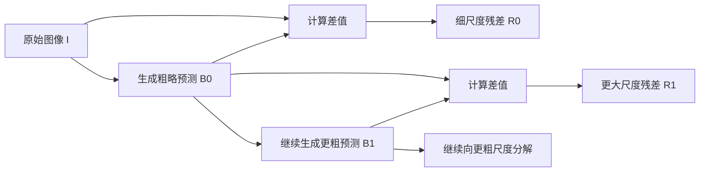

# Laplacian Pyramid

## 1. 从一张照片到“基础结构 + 细节残差”

> 一张照片能不能拆成一幅较粗略的基础图像，以及基础图像没有保存下来的细节？

### 1.1 为什么要把结构和细节分开

观察一张人物照片时，我们可以同时看到两类信息。


第一类是较大范围的结构：
```text
人物位于什么位置
头部和身体的大致轮廓
背景由哪些大块区域组成
整体明暗和颜色分布
```

第二类是较小范围的细节：
```text
眼镜边缘
面部皱纹
衣服轮廓
徽章和文字
背景中的星形边缘
```

当照片被适当模糊时，人物是谁、站在哪里、背景是什么颜色，通常仍然可以辨认；但眼镜边缘、皱纹、文字和细小纹理会逐渐消失。

这说明**同一张图像中的信息并不都处于相同尺度**：

- 大范围结构在较粗略的图像中仍然能够保留；    
- 小范围细节需要更高分辨率才能准确表达。
    

**尺度 Scale**：观察图像时所关注的空间范围。较小尺度关注局部边缘和纹理，较大尺度关注轮廓、区域和整体结构。

Laplacian Pyramid（拉普拉斯金字塔：将图像表示成一个最粗基础层和多个不同尺度细节层的方法）的核心，就是把这些信息分开保存。

### 1.2 先做一次最简单的分解

先不构造完整金字塔，只考虑一层分解。

设原始图像为 $I$。


我们从原图中得到一幅较粗略的同尺寸图像 $B$：

$$
B=\operatorname{Coarse}(I)
$$

这里的 $\operatorname{Coarse}$ 暂时可以理解为：
```text
先去掉一部分细小变化
再降低分辨率
最后重新放大到原图尺寸
```

经过这个过程后，$B$ 仍然保留人物、服装和背景的大体结构，但无法恢复原图中的所有细节。

因此，可以把 $B$ 理解为：

> 只根据较粗尺度信息，对原图作出的预测。

如果 $B$ 已经能解释原图中的大部分结构，那么原图中剩余、无法由 $B$ 解释的部分就是：

$$
R=I-B
$$

其中，$R$ 称为**残差 Residual**：

> 残差是原图与粗略预测之间的差值，表示粗略图像没有保存下来的信息。

于是原图可以重新写成：

$$
I=B+R
$$

这不是一种近似说法，而是由 $R=I-B$ 直接移项得到的恒等式：

$$
R=I-B
$$

$$
R+B=I-B+B
$$

$$
I=B+R
$$

所以，一层分解的完整逻辑是：

```text
原图 I
        ↓
构造同尺寸的粗略预测 B
        ↓
计算原图与粗略预测的差值
        ↓
得到细节残差 R = I - B
        ↓
原图可以由 B + R 恢复
```


图中四部分分别表示：
1. **Original photo $I$**：完整原始照片；
2. **Coarse prediction $B$**：较粗尺度只能恢复出的基础结构；
3. **Residual $R=I-B$**：基础结构无法解释的细节；
4. **Reconstruction $B+R$**：把基础结构和残差相加，恢复原图。
    
### 1.3 为什么残差图看起来是灰色的

残差并不是一张普通 RGB 照片，它的像素既可能为正，也可能为负：

$$
R(x,y)=I(x,y)-B(x,y)
$$

如果原图某处比粗略预测更亮：

$$
I(x,y)>B(x,y)
$$

那么：

$$
R(x,y)>0
$$

如果原图某处比粗略预测更暗：

$$
I(x,y)<B(x,y)
$$

那么：

$$
R(x,y)<0
$$

而普通图片显示范围通常是 $[0,1]$ 或 $[0,255]$，不能直接显示负数。


因此，图中为了方便观察，把残差的零点映射为中性灰色：
```text
灰色：
残差接近 0，原图和粗略预测基本相同

比灰色更亮：
原图比粗略预测更亮

比灰色更暗：
原图比粗略预测更暗
```


所以残差图中最明显的通常是：
- 物体边缘；
- 细小纹理；
- 文字；
- 局部明暗突变；
- 粗略图像无法准确预测的位置。
    

但需要注意：
> 残差不等于“边缘检测结果”。
边缘通常会在残差中表现得很明显，但残差的准确定义始终是：

$$
R=I-B
$$

只要某处的原图与粗略预测不同，无论这种差异是不是传统意义上的边缘，都会进入残差。

### 1.4 为什么不能只保留基础图像


如果只保存 $B$，照片仍然具有大致结构，但会缺少大量细节：
```text
人物仍然存在
但眼镜、皱纹、文字和纹理变得模糊
```

也就是：

$$
B\neq I
$$

粗略图像的作用是保存较大范围的结构，而不是独立恢复原图。

如果只保存残差 $R$，同样无法理解完整照片。残差中虽然包含很多边缘和细节，但缺少稳定的整体亮度、颜色和区域结构。

因此：

```text
只保存 B：
有整体结构，没有完整细节

只保存 R：
有局部差异，没有完整基础结构

同时保存 B 和 R：
可以恢复完整图像
```

这也是 Laplacian Pyramid 的基本设计动机：

> 不把所有信息混在同一张图中，而是让粗尺度层保存整体结构，让残差层保存该尺度没有保留下来的信息。

### 1.5 为什么一层分解还不够

当前只完成了一次分解：

$$
I=B_0+R_0
$$

其中：

- $B_0$ 保存较粗结构；
- $R_0$ 保存原图相对于 $B_0$ 的细节。

但 $B_0$ 本身仍然包含不同尺度的信息。例如，它同时包含：

```text
人物整体轮廓
面部的大致结构
背景中的大块区域
```

因此，还可以继续分解 $B_0$：

$$
B_0=B_1+R_1
$$

其中：
- $B_1$ 是更粗略的基础图像；
- $R_1$ 是从 $B_0$ 变成 $B_1$ 时丢失的较大尺度细节。


继续代入：

$$
I=B_0+R_0
$$

$$
I=(B_1+R_1)+R_0
$$

所以：

$$
I=B_1+R_1+R_0
$$

如果继续重复这一过程，最终会得到：

```text
一个最粗略的基础图像
+
多个不同尺度的细节残差
```

这才是完整 Laplacian Pyramid 的基本形态。



后续章节需要进一步回答两个关键问题：

```text
怎样得到可靠的粗尺度图像 B？

为什么不能直接缩小，而要先进行滤波？
```

这些问题将引出 Gaussian Pyramid。

## 2. 怎样得到可靠的粗尺度图像

第一章把一次分解写成 $I=B+R$，但其中的粗尺度图像 $B$ 不能通过随意模糊或直接抽取像素得到。本章要回答的是：**当图像尺寸变小时，怎样保留可信的大结构，同时避免产生原图中不存在的假纹理？**

### 2.1 下采样为什么可能制造错误结构

**下采样 Downsampling**（减少图像的空间采样点，位于从当前尺度进入下一粗尺度的步骤）会降低图像宽高。例如，把 $512\times512$ 图像缩小为 $256\times256$，横向和纵向都只保留一半采样点，总像素数变成原来的四分之一。

最简单的二倍下采样是隔一个像素取一个像素：

$$
G_{l+1}(i,j)=G_l(2i,2j)
$$

这种做法的问题不是“少看了一些像素”这么简单。考虑一维交替信号：

$$
x=[1,0,1,0,1,0,\ldots]
$$

如果只取偶数位置，得到：

$$
x_{even}=[1,1,1,1,\ldots]
$$

如果只取奇数位置，得到：

$$
x_{odd}=[0,0,0,0,\ldots]
$$

原信号明明在 0 和 1 之间快速变化，仅仅因为采样起点不同，缩小后却可能被解释成全白或全黑。这说明低分辨率网格已经没有足够采样点表达原来的快速变化。

**空间频率 Spatial Frequency**（描述图像亮度或颜色随位置变化的快慢，用来判断某种结构需要多密集的像素才能表示）：大面积平滑亮度、天空渐变和整体轮廓属于较低空间频率；细线、织物纹理、锐利边缘和密集条纹属于较高空间频率。

尺寸减半以后，像素间距变大，可表达的最高空间频率随之下降。如果仍把超过新采样能力的高频内容直接送入下采样，高频可能被错误地表现成较慢变化的条纹、波纹或锯齿。这种现象称为**混叠 Aliasing**（采样不足时，高频结构伪装成错误低频结构，发生在下采样之后）。


图中的直接下采样结果出现了原图中不存在的大范围弯曲纹路。它不是“细节丢失”，而是“细节被错误解释”。如果这种假结构进入后续金字塔，它会被当成真实的粗尺度内容继续保存，所以必须在下采样之前处理。

### 2.2 为什么必须先低通滤波

既然下一层无法表示当前层的全部高频，合理做法不是等下采样随机丢弃它们，而是提前把无法可靠表示的部分平滑掉。

**低通滤波 Low-pass Filtering**（保留变化较慢的低频结构，抑制变化较快的高频内容，位于下采样之前）使输入图像的频率范围与下一层采样能力匹配。Laplacian Pyramid 通常使用高斯滤波完成这一步。

**高斯滤波 Gaussian Filtering**（用邻域像素的加权平均替换当前像素，距离中心越近权重越大，是构造 Gaussian Pyramid 的平滑步骤）的连续二维形式为：

$$
g(x,y)=\frac{1}{2\pi\sigma^2}\exp\left(-\frac{x^2+y^2}{2\sigma^2}\right)
$$

其中 $\sigma$ 控制权重扩散范围：$\sigma$ 越大，参与平均的邻域越广，保留的主要结构越粗。

实际数字图像使用离散滤波核。一种常见的五点一维近似为：

$$
w=\frac{1}{16}[1,4,6,4,1]
$$

二维核可以利用外积得到：

$$
W=w^{T}w
$$

核中所有权重之和为 1，因此平坦区域的整体亮度不会因为滤波而系统性增大或减小。

**卷积 Convolution**（让滤波核在图像上滑动，每个输出像素由当前邻域的加权和得到，是执行低通滤波的计算方式）可以写成：

$$
\widetilde{G}_l(i,j)=\sum_m\sum_n W(m,n)G_l(i-m,j-n)
$$

然后再从平滑结果中隔点采样：

$$
G_{l+1}(i,j)=\widetilde{G}_l(2i,2j)
$$

把两步合起来：

$$
G_{l+1}=\operatorname{Down}_2(W*G_l)
$$

因果链是：

```
尺寸减小
    ↓
可表达的最高空间频率下降
    ↓
先用低通滤波移除超出新采样能力的内容
    ↓
再减少采样点
    ↓
得到没有明显混叠的粗尺度图像
```


这里只做滤波而不下采样也不够：图像虽然变模糊，却仍在原分辨率网格上，尚未形成真正的新尺度。反过来，只下采样而不滤波，则会把不受支持的高频错误折叠到粗尺度中。因此“滤波 + 下采样”是一个完整操作，通常称为 **Reduce**。

### 2.3 Gaussian Pyramid 怎样形成

从原始图像开始：

$$
G_0=I
$$

连续执行 Reduce：

$$
G_1=\operatorname{Reduce}(G_0)
$$

$$
G_2=\operatorname{Reduce}(G_1)
$$

一般写成：

$$
G_{l+1}=\operatorname{Reduce}(G_l)
$$

得到：

$$
\mathcal{P}_G={G_0,G_1,\ldots,G_N}
$$

这组图像称为 **Gaussian Pyramid，高斯金字塔**（连续低通并下采样得到的多尺度图像序列，位于 Laplacian 残差计算之前）。


如果每次宽高减半，第 $l$ 层尺寸约为：

$$
H_l=\frac{H_0}{2^l},\qquad W_l=\frac{W_0}{2^l}
$$

随着层数增加，图像的细纹理和锐利边缘逐渐消失，但人物位置、主体轮廓和大范围亮度仍能保留。需要注意，Gaussian Pyramid 中的 $G_{l+1}$ 不是 $G_l$ 的完整替代品：它只保存了当前尺度中可以安全带入更粗尺度的部分，丢失的信息将在下一章中单独保存。

### 本章总结

Gaussian Pyramid 的 Reduce 操作必须先低通、再下采样：低通滤波主动移除下一分辨率无法可靠表达的高频，下采样再减少像素数量，从而避免高频被错误解释为粗尺度假结构。

## 3. 怎样从相邻尺度中提取 Laplacian 细节

Gaussian Pyramid 给出了越来越粗的图像，但仅保存它会逐层丢失信息。本章要确定：**从 $G_l$ 变成 $G_{l+1}$ 时，哪些内容没有被保存，以及怎样把它们单独记录下来？**

### 3.1 先把下一层变回相同尺寸

相邻 Gaussian 层尺寸不同。例如：

$$
G_l\in\mathbb{R}^{512\times512\times3}
$$

$$
G_{l+1}\in\mathbb{R}^{256\times256\times3}
$$

它们无法逐像素相减，因为 $G_{l+1}$ 中一个像素覆盖的空间范围大约对应 $G_l$ 中 $2\times2$ 的区域。必须先把下一层扩展回当前尺寸。

**Expand，上采样扩展**（把粗尺度图像恢复到上一层尺寸，位于重建预测和残差计算之前）不是简单复制像素。经典做法分两步。

第一步，在原像素之间插入 0。二倍上采样时：

$$
U_{l+1}(i,j)=\begin{cases}G_{l+1}(i/2,j/2),&i,j\text{ 均为偶数}\\0,&\text{其他位置}\end{cases}
$$

第二步，用与 Reduce 匹配的核进行插值滤波：

$$
\operatorname{Expand}(G_{l+1})=4(W*U_{l+1})
$$

系数 4 来自二维二倍上采样：插零后只有四分之一位置保留原值，乘 4 用于补偿平均幅值。实际库也常使用双线性或双三次插值再平滑；只要分解与重建始终使用完全相同的 Expand，残差仍能把预测误差补回来。

Expand 的输出记为：

$$
\widehat{G}_l=\operatorname{Expand}(G_{l+1})
$$

它与 $G_l$ 尺寸相同，可以理解为：

> 只利用下一粗尺度保存的信息，对当前层 $G_l$ 作出的预测。

它能恢复大轮廓和低频亮度，却不可能重新猜回下采样前已经去掉的所有纹理。

### 3.2 Laplacian 层的正式定义

当前尺度的 Laplacian 层定义为：

$$
L_l=G_l-\operatorname{Expand}(G_{l+1})
$$

其中：
- $G_l$ 是当前尺度的真实内容；
- $\operatorname{Expand}(G_{l+1})$ 是粗尺度对当前层的预测；
- $L_l$ 是预测没有解释的有符号残差。
    


这条公式不是额外执行一次边缘检测，而是在回答一个明确问题：
```
当前层 G_l 有哪些内容
无法由下一层 G_l+1 恢复？
```

如果某个区域变化平缓，粗尺度预测通常已经很接近 $G_l$，所以该处 $L_l$ 接近 0；如果某处包含细纹理、边缘或局部快速变化，粗尺度预测会偏离 $G_l$，差值就会保留在 $L_l$ 中。

因此，Laplacian 层的精确定义始终是“相邻尺度预测残差”，而不是笼统的“所有高频”。$L_l$ 只保存从第 $l$ 层降到第 $l+1$ 层时被移除的那一段尺度信息。

### 3.3 为什么不同层显示不同大小的结构

最底层：

$$
L_0=G_0-\operatorname{Expand}(G_1)
$$

$G_0$ 仍包含原始分辨率的精细纹理，因此 $L_0$ 主要显示最细边缘和纹理。

上一层：

$$
L_1=G_1-\operatorname{Expand}(G_2)
$$

由于 $G_1$ 已经经过一次低通与下采样，最细内容不再存在，$L_1$ 保存的是更大空间范围的明暗和轮廓变化。继续向上，同样的像素宽度对应原图中越来越大的区域，所以各层的“细节大小”逐渐增大。


可以把各层理解为：
```
L0：最细纹理、锐利边缘、小文字
L1：稍宽的边缘和局部形状
L2：更大范围的轮廓变化
L3：粗尺度区域之间的变化
GN：剩余的最粗亮度、颜色和主体布局
```

图中为了显示有正有负的残差，把 0 映射成灰色。不同层分别按自己的最大绝对值进行显示拉伸，因此不能仅根据图的亮度比较各层真实数值大小；它们主要用于观察结构分布。

### 3.4 与 DnCNN、ResNet 残差的联系

三者都利用“已有基础 + 需要补充的变化”，但残差的来源不同：

|方法|基础部分|残差怎样得到|主要目的|
|---|---|---|---|
|Laplacian Pyramid|下一粗尺度的 Expand 预测|由相邻尺度直接相减|分离多尺度图像信息|
|DnCNN|带噪输入或对应干净目标|由网络学习噪声残差|恢复具体输入图像|
|ResNet|Shortcut 传递的输入特征|由残差分支学习特征变化|让深层网络更易优化|

Laplacian Pyramid 不需要训练，Reduce、Expand 和相减都是固定运算；DnCNN 与 ResNet 的残差则取决于可学习参数。它们的共同思想不是“残差一定是高频”，而是避免让一个分支重复表示已经由基础路径提供的内容。

### 本章总结

Laplacian 层通过 $L_l=G_l-\operatorname{Expand}(G_{l+1})$ 保存下一粗尺度无法预测的内容。低层对应精细纹理，高层对应更大范围的结构变化，所有层共同记录 Gaussian Pyramid 在逐次缩小时移除的信息。

## 4. 完整金字塔、U 型结构与逐层重建

对每一对相邻 Gaussian 层计算残差：

$$
L_l=G_l-\operatorname{Expand}(G_{l+1}),\qquad l=0,1,\ldots,N-1
$$

最顶层 $G_N$ 不再继续缩小，直接保存。完整 Laplacian Pyramid 为：

$$
\mathcal{P}_L(I)={L_0,L_1,\ldots,L_{N-1},G_N}
$$


这里不需要同时保存所有 Gaussian 层。因为一旦拥有 $G_N$ 和全部 $L_l$，中间的 $G_{N-1},G_{N-2},\ldots,G_0$ 都可以重新恢复。

### 4.1 为什么它呈现为 U 型结构

整个流程可以分成两条方向相反的路径：
- 左侧分析路径：从 $G_0$ 开始，不断 Reduce，尺寸逐层缩小；
- 中间存储路径：每下降一层，保存当前尺度残差 $L_l$；
- 右侧合成路径：从 $G_N$ 开始，不断 Expand，并加回对应 $L_l$。


这张图外形与 U-Net 相似：左边降低分辨率，右边恢复分辨率，中间有横向信息连接。但两者不能混为一谈。

Laplacian Pyramid 的横向连接保存的是显式残差：

$$
L_l=G_l-\operatorname{Expand}(G_{l+1})
$$

U-Net 的 Skip Connection 通常传递网络学到的特征图，再由卷积层学习如何融合。Laplacian Pyramid 没有可学习参数，横向残差按固定公式计算，并直接用于代数重建。

### 4.2 重建公式怎样得到

从定义开始：

$$
L_l=G_l-\operatorname{Expand}(G_{l+1})
$$

两边加上 $\operatorname{Expand}(G_{l+1})$：

$$
L_l+\operatorname{Expand}(G_{l+1})=G_l
$$

交换左右两边：

$$
G_l=\operatorname{Expand}(G_{l+1})+L_l
$$

因此重建从顶层开始：

$$
\widehat{G}_N=G_N
$$

然后逐层向下：

$$
\widehat{G}_{N-1}=\operatorname{Expand}(\widehat{G}_N)+L_{N-1}
$$

$$
\widehat{G}_{N-2}=\operatorname{Expand}(\widehat{G}_{N-1})+L_{N-2}
$$

一般形式为：

$$
\widehat{G}_l=\operatorname{Expand}(\widehat{G}_{l+1})+L_l
$$


以三层残差为例，把重建过程展开：

$$
G_2=\operatorname{Expand}(G_3)+L_2
$$

$$
G_1=\operatorname{Expand}(\operatorname{Expand}(G_3)+L_2)+L_1
$$

$$
G_0=\operatorname{Expand}(\operatorname{Expand}(\operatorname{Expand}(G_3)+L_2)+L_1)+L_0
$$

这个展开式显示了各层分工：$G_3$ 提供最粗基础，$L_2$ 先恢复大尺度结构，$L_1$ 补回中等尺度变化，$L_0$ 最后补回精细纹理。

### 4.3 下采样丢了信息，为什么还能恢复

下采样后的 $G_{l+1}$ 本身确实无法恢复 $G_l$。可逆性来自同时保存了残差：

$$
L_l=G_l-\operatorname{Expand}(G_{l+1})
$$

无论 Expand 的预测与 $G_l$ 相差多少，差值都会进入 $L_l$。重建时用同一个 Expand 再加回该差值，代数上就能回到 $G_l$。

这并不要求 Expand 能“智能猜回”纹理；它只负责提供粗预测，所有猜不回来的内容由 $L_l$ 保存。

理论上的精确重建需要：

- 分解和重建使用完全相同的 Expand；    
- 每层宽高和裁剪规则一致；
- 边界填充规则一致；
- Laplacian 层保留正负值，不被截断到 $[0,1]$；
- 中间数据没有经过有损量化。

如果修改、压缩或量化 $L_l$，重建就不再严格等于原图，但也正因为各层可以被单独修改，金字塔才能用于融合、细节调整和压缩。

### 4.4 Laplacian Pyramid 为什么是冗余表示

如果原图尺寸是 $H\times W$，每层宽高减半，那么各层元素数量依次约为：

$$
HW,\quad\frac{HW}{4},\quad\frac{HW}{16},\quad\ldots
$$

保存 $L_0,L_1,\ldots,L_{N-1},G_N$ 的总元素数量为：

$$
S_N=HW\sum_{l=0}^{N}\left(\frac{1}{4}\right)^l
$$

使用等比数列求和：

$$
S_N=HW\frac{1-(1/4)^{N+1}}{1-1/4}
$$

因此：

$$
S_N<\frac{4}{3}HW
$$

层数较多时，总元素数量接近原图的 $4/3$，约多出三分之一。这说明 Laplacian Pyramid 不是最紧凑的变换，而是一种轻度冗余表示。它用少量额外存储换取了直观的多尺度残差、简单重建和方便编辑。

### 本章总结

完整 Laplacian Pyramid 由多个残差层和一个顶层 Gaussian 图像组成，整体呈现“向下分解、横向保存残差、向上逐层加回”的 U 型结构；它能够重建原图，是因为每次下采样没有保留的内容都被显式记录在对应残差中。

## 5. 从频率角度理解 Laplacian Pyramid

前几章在空间域中完成了所有操作。本章换一个角度回答：**为什么相邻 Gaussian 层的差值，会集中表示某一段尺度范围的内容？**

### 5.1 Gaussian 层是逐步收窄的低通结果

把第 $l$ 层累积的低通作用记作 $H_l$，可以近似写成：

$$
G_l\approx H_lI
$$

这里的 $H_l$ 不是单个卷积核，而是从原图到第 $l$ 层经历的全部低通和缩放效果。随着 $l$ 增大，保留的频率范围越来越窄：

```
G0：包含从低频到高频的完整范围
G1：去掉最细高频
G2：进一步去掉中高频
G3：主要剩下更低频结构
GN：只保留最粗结构
```

把 $G_{l+1}$ Expand 回当前尺寸后，其频率内容仍然主要来自更窄的低通范围：

$$
\operatorname{Expand}(G_{l+1})\approx H_{l+1}I
$$

代入 Laplacian 定义：

$$
L_l=G_l-\operatorname{Expand}(G_{l+1})
$$

得到近似关系：

$$
L_l\approx H_lI-H_{l+1}I
$$

提取 $I$：

$$
L_l\approx(H_l-H_{l+1})I
$$

$H_l$ 与 $H_{l+1}$ 共同保留的最低频在相减时大部分抵消，只有 $H_l$ 仍保留、而 $H_{l+1}$ 已经抑制的频率范围留下。因此 $L_l$ 可以近似理解为一个**带通结果 Band-pass Result**（主要保留一段中间频率范围，位于两个相邻低通尺度之间）。


图中的频带互相重叠，并不是把频率轴硬切成互不相交的矩形。高斯滤波的响应是平滑衰减的，重叠可以避免不同尺度交界处出现突变，也有利于平滑重建。

### 5.2 Laplacian 层与普通高通有什么区别

普通高通通常一次性去掉低频，保留较宽的高频范围。Laplacian Pyramid 则把这部分范围继续按尺度拆开：

```
普通高通：所有较快变化混在同一结果中
Laplacian Pyramid：L0、L1、L2……分别保存不同尺度范围
```

因此它不仅能回答“哪里有细节”，还可以回答“这个细节主要属于多大的空间范围”。这正是多尺度融合和分层细节调整所需要的信息。

### 5.3 为什么名称中有 Laplacian

**Laplacian Operator，拉普拉斯算子**（图像的空间二阶导数，对局部亮度快速变化响应较强，常用于边缘和尺度结构分析）在二维连续空间中写成：

$$
\nabla^2I=\frac{\partial^2I}{\partial x^2}+\frac{\partial^2I}{\partial y^2}
$$

相邻 Gaussian 尺度之差会强调在这两个尺度之间消失的变化，其响应与 Gaussian 平滑后的 Laplacian 结构密切相关，因此被称为 Laplacian Pyramid。

但不能把 Laplacian 层直接等同于对图像套一个离散拉普拉斯核：
- 离散 Laplacian 是局部二阶差分；
- Laplacian Pyramid 是相邻 Gaussian 层在尺寸对齐后的预测残差；
- 二者都突出变化，但计算定义和用途不同。
    

### 5.4 与 DoG 和 Wavelet 的关系

**DoG，Difference of Gaussians**（对同尺寸图像使用两个不同平滑尺度，再将结果相减）常写成：

$$
\operatorname{DoG}(I)=G_{\sigma_1}*I-G_{\sigma_2}*I
$$

它与 Laplacian 层都通过相邻平滑尺度之差提取尺度信息。区别是 Laplacian Pyramid 还包含下采样、Expand 和可重建的层级组织。

**Wavelet，小波变换**（通过成对分析滤波器把图像分解成不同尺度和方向子带）与 Laplacian Pyramid 同样进行多尺度分解，但 Wavelet 通常进一步区分水平、垂直和对角方向，并追求更紧凑的表示。Laplacian Pyramid 每层通常只有一个残差图，方向划分较弱，但结构直观，特别适合重建、融合和尺度编辑。

|   |   |   |   |   |
|---|---|---|---|---|
|表示|每层主要内容|方向划分|是否便于直观重建|冗余程度|
|Gaussian Pyramid|逐层低通图像|无|不能单独恢复丢失细节|较高|
|Laplacian Pyramid|相邻尺度残差 + 顶层基础|无明确方向子带|非常直接|约 $4/3$|
|Wavelet|低频与多个方向高频子带|通常有|可以重建|通常更紧凑|

### 本章总结

Gaussian 层相当于逐步收窄的低通结果，相邻低通结果相减后留下两者之间的频率范围，因此各个 Laplacian 层可近似视为重叠的带通频段；它与高通、DoG 和 Wavelet 有联系，但保留了自己明确的预测残差和逐层重建结构。

## 6. 应用、去噪连接与实现要点

Laplacian Pyramid 的实际价值不在于把一张图拆开观看，而在于：**不同尺度的信息可以被分别处理，再重新组合成图像。**

### 6.1 多尺度图像融合

假设要把图像 $A$ 和图像 $B$ 拼接。直接使用二值遮罩：

$$
I=M\odot A+(1-M)\odot B
$$

会在 $M$ 从 1 跳到 0 的位置形成明显接缝。

**遮罩 Mask**（取值在 $0$ 到 $1$ 之间的空间权重图，位于两幅图像的融合步骤）决定每个位置采用哪幅图。若只对最终图像使用一张宽模糊遮罩，虽然大结构过渡变平滑，细纹理也会一起被长距离混合，容易出现重影。

Laplacian 融合为两幅图分别构建金字塔，同时为遮罩构建 Gaussian Pyramid：

$$
{L_l^A},\qquad{L_l^B},\qquad{M_l}
$$

每层独立融合：

$$
L_l^{blend}=M_l\odot L_l^A+(1-M_l)\odot L_l^B
$$

顶层基础同样融合：

$$
G_N^{blend}=M_N\odot G_N^A+(1-M_N)\odot G_N^B
$$

最后重建融合金字塔。


遮罩在高分辨率层过渡相对窄，所以局部细节不会被大范围平均；在粗尺度层，遮罩经过多次低通，过渡范围更宽，可以平滑整体颜色和亮度。这就是多尺度融合比单一接缝处理更自然的原因。

### 6.2 分尺度增强或抑制细节

重建前可以修改不同层：

$$
L_l'=\alpha_lL_l
$$

其中 $\alpha_l$ 是该尺度的增益。

- $\alpha_l=1$：保持该层不变；
    
- $\alpha_l>1$：增强该尺度变化；
    
- $0<\alpha_l<1$：抑制该尺度变化；
    
- $\alpha_l=0$：完全移除该层。
    


例如只提高 $L_0$ 和 $L_1$，会加强细纹理与较窄边缘，而大范围亮度结构变化较小。相比一次性锐化整张图，这种方式能选择细节尺度。

但增强高频层不等于只增强真实纹理。传感器噪声、压缩伪影和去马赛克伪色也可能集中在较细层，盲目放大 $L_0$ 会同时增强噪声；过强增益还可能在边缘两侧产生明暗振铃。

### 6.3 与去噪任务的关系

在去噪中，预测结果记为 $\widehat{x}$，干净目标记为 $x$。普通像素 L1 Loss：

$$
\mathcal{L}_{pix}=|\widehat{x}-x|_1
$$

把所有尺度误差汇总在最终图像中。为了明确约束不同尺度，可以分别构建两者的 Laplacian Pyramid：

$$
\mathcal{L}_{lap}=\sum_{l=0}^{N-1}\lambda_l|L_l(\widehat{x})-L_l(x)|_1
$$

再与像素 Loss 组合：

$$
\mathcal{L}_{total}=\lambda_{pix}\mathcal{L}_{pix}+\lambda_{lap}\mathcal{L}_{lap}
$$

两项职责不同：

```
像素 Loss：保证最终数值和整体内容一致
Laplacian Loss：明确约束各尺度边缘和细节残差
```

对于 Bayer/RAW 去噪，需要特别谨慎：RAW 中的噪声、CFA 排列和真实纹理都会进入高频层，不能把“高频”直接当成“应当保留的细节”。合理做法是比较预测与对应干净目标在相同金字塔构造下的残差，而不是单纯最大化高频能量。

Gaussian 多尺度 Loss 也可以使用：

$$
\mathcal{L}_{gauss}=\sum_{l=0}^{N}\beta_l|G_l(\widehat{x})-G_l(x)|_1
$$

它更侧重不同尺度的主体结构和低频一致性；Laplacian Loss 更直接关注每次尺度变化中丢失的内容。二者可以按任务需要选择，不必全部叠加。

### 6.4 压缩与分层表示

自然图像的 Laplacian 残差通常有大量数值接近 0。可以对不同层采用不同量化精度：

```
对视觉重要或能量较高的层保留更多精度
对不敏感的残差使用更粗量化
顶层基础单独编码
```

一旦量化 $L_l$，重建就不再精确，但误差被限制在对应尺度，便于控制视觉效果。基础 Laplacian Pyramid 不是现代编码器的全部方案，但“将粗结构与多尺度残差分开编码”是许多分层压缩方法的重要思想来源。

### 6.5 一种常见的 PyTorch 实现

下面代码只展示核心流程。`reduce_image` 先低通再隔点取样；`expand_image` 把下一层插值到目标尺寸并再次平滑；同一个 Expand 同时用于构造残差和重建。

```
import torch
import torch.nn.functional as F

def filter_image(x, kernel):
    channels = x.shape[1]
    weight = kernel.expand(channels, 1, -1, -1)
    return F.conv2d(x, weight, padding=kernel.shape[-1] // 2, groups=channels)

def reduce_image(x, kernel):
    x = filter_image(x, kernel)
    return x[:, :, ::2, ::2]

def expand_image(x, target_size, kernel):
    x = F.interpolate(x, size=target_size, mode="bilinear", align_corners=False)
    return filter_image(x, kernel)

def build_laplacian_pyramid(x, levels, kernel):
    gaussian = [x]
    laplacian = []

    for _ in range(levels):
        next_level = reduce_image(gaussian[-1], kernel)
        prediction = expand_image(next_level, gaussian[-1].shape[-2:], kernel)
        laplacian.append(gaussian[-1] - prediction)
        gaussian.append(next_level)

    return laplacian, gaussian[-1]

def reconstruct_laplacian_pyramid(laplacian, top, kernel):
    x = top

    for residual in reversed(laplacian):
        x = expand_image(x, residual.shape[-2:], kernel)
        x = x + residual

    return x
```

这段实现采用插值版 Expand，和经典“插零 + $4W$ 滤波”在具体数值上不完全相同，但只要构建与重建共用同一个函数，未修改残差时仍满足对应的重建恒等式。

### 6.6 最容易出错的实现细节

**奇数尺寸**：宽高为奇数时，连续二倍缩小再放大可能差一个像素。应当始终以当前 Laplacian 层的实际尺寸作为 Expand 目标，而不是假设尺寸正好乘 2。

**边界处理**：零填充、反射填充和复制边缘会在图像边缘产生不同预测。如果构建与重建规则不一致，边缘会出现误差或亮边。

**有符号数据**：$L_l$ 同时包含正值和负值，不能为了保存方便直接截断为普通 $[0,1]$ 图片。正文中的灰色残差图只是显示版本，不是用于重建的真实数值。

**Reduce 与 Expand 不匹配**：分解时使用一种插值，重建时换成另一种，会使原残差不再对应当前预测。两条路径必须调用同一套实现。

**层数选择**：层数过少，不能充分分离大尺度结构；层数过多，顶层只剩几个像素，空间意义变弱。实际可保证最顶层仍能表达任务所需的主体布局，而不是固定追求更多层。

### 本章总结

Laplacian Pyramid 允许不同尺度被独立融合、增强、抑制、量化或写入 Loss；在图像恢复中它能明确区分粗结构与多尺度细节，但高频层也包含噪声和伪影，因此应围绕对应目标进行约束，而不是把所有高频都当成真实纹理。

**一句话总结：Laplacian Pyramid 先用 Gaussian Pyramid 产生逐层粗尺度预测，再保存每次预测遗漏的残差，使图像能够被表示为“一个最粗基础层 + 多个尺度细节层”，并通过反向 Expand、逐层加回残差完成重建和分尺度编辑。**