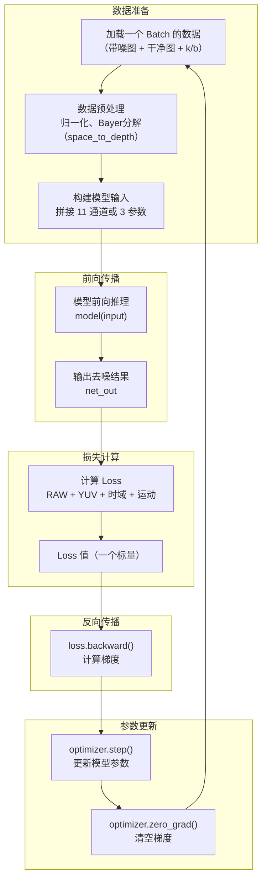

## 1. 模型训练的完整生命周期

首先通过一张全景图建立整体认知：

```text
┌─────────────────────────────────────────────────────────────────────────────┐
│                    一个 AI 模型的完整生命周期                               │
├─────────────────────────────────────────────────────────────────────────────┤
│                                                                             │
│   阶段1：预训练（Pre-training）                                            │
│   ┌─────────────────────────────────────────────────────────────────┐      │
│   │  在大规模通用数据集上训练 → 产出 "预训练权重文件"              │      │
│   │  （比如 dmnet_214654.pth、iter_15107000.pth）              │      │
│   └─────────────────────────────────────────────────────────────────┘      │
│                                    ↓                                       │
│   阶段2：微调 / 继续训练（Fine-tuning / Training）                         │
│   ┌─────────────────────────────────────────────────────────────────┐      │
│   │  加载预训练权重 → 在你的专属数据上继续训练                      │      │
│   │  每隔一定步数保存一次 → 产出多个 "checkpoint"（中间状态快照）   │      │
│   └─────────────────────────────────────────────────────────────────┘      │
│                                    ↓                                       │
│   阶段3：量化（Quantization）                                              │
│   ┌─────────────────────────────────────────────────────────────────┐      │
│   │  把 FP32 浮点模型 → 转成 INT8 整数模型                         │      │
│   │  模型体积缩小 4 倍，推理速度提升 2-4 倍                        │      │
│   │  需要 "量化配置文件" 来控制量化方式                             │      │
│   └─────────────────────────────────────────────────────────────────┘      │
│                                    ↓                                       │
│   阶段4：部署（Deployment）                                               │
│   ┌─────────────────────────────────────────────────────────────────┐      │
│   │  把量化后的模型部署到 NPU/手机上运行                            │      │
│   │  产出 .bin 文件（NPU 可执行的二进制模型）                       │      │
│   └─────────────────────────────────────────────────────────────────┘      │
│                                                                             │
└─────────────────────────────────────────────────────────────────────────────┘
```

这张图展示了模型的完整生命周期——从预训练到最终部署。

## 2. 训练前的准备

### 2.1 数据集

训练需要两类数据：
- **带噪图像**（模型输入）：真实拍摄或合成噪声的 RAW 图
- **干净图像**（模型目标）：同一场景的无噪声版本（多帧平均或长曝光获得）

数据通常以 HDF5 或 TFRecord 格式存储，每批次（batch）加载一组图像进入 GPU 内存。

> **术语解释**：**Batch（批次）** 是一次训练迭代中同时处理的图像数量。Batch size 越大，每次参数更新的梯度越稳定，但显存占用也越大。常见做法是使用 32 或 56 作为 batch size。

### 2.2 噪声参数（k/b）

去噪模型需要知道“噪声有多强”，才能决定去噪力度。k 和 b 就是描述噪声强度的两个参数：
- **k（斜率）**：信号相关噪声强度（光越亮噪声越大），随 ISO 升高而增大
- **b（截距）**：信号无关的读出噪声，不随亮度变化

k/b 来自 `noise_profile.py`，根据 ISO 值和 Sensor 型号查表得到。在训练中，它们作为模型的额外输入通道（`coef`）传入。

### 2.3 预训练权重

常见做法是从已有的预训练权重开始训练，而不是从头开始初始化。预训练权重已经在其他数据集上学会了一些通用特征，能够加速收敛。

如果没有预训练权重，也可以从头开始训练（`--ckpt_load None`），但收敛速度会较慢。

## 3. 训练循环

训练循环是模型学习的核心。每个 iteration（迭代步）执行一次完整的前向→反向→参数更新流程。

### 3.1 训练循环流程图



### 3.2 训练循环的六个核心步骤

| 步骤 | 操作 | 说明 |
|------|------|------|
| **① 数据加载** | DataLoader 读取一个 Batch | 从 HDF5/TFRecord 中读取 `(noisy, clean, k, b)` |
| **② 预处理** | 归一化 + Bayer 分解 | `target / 4095.0`，`space_to_depth`，在线加噪 |
| **③ 前向传播** | `net_out = model(input)` | 数据从输入层流向输出层，得到预测结果 |
| **④ 计算 Loss** | `loss = criterion(net_out, target)` | 多个 Loss 项加权求和（RAW、YUV、时域、运动） |
| **⑤ 反向传播** | `loss.backward()` | 计算每个参数的梯度（链式法则） |
| **⑥ 参数更新** | `optimizer.step()` | 用梯度更新参数（`θ_new = θ - lr × gradient`） |

### 3.3 多帧 IIR 循环

去噪模型通常处理 15 帧连续图像，利用相邻帧的信息来提升去噪效果。IIR 循环是处理多帧数据的核心机制：

```text
帧0 → 模型 → 输出0 → 作为帧1的参考（ref）
帧1 → 模型（参考输出0）→ 输出1 → 作为帧2的参考
帧2 → 模型（参考输出1）→ 输出2 → ...
```

每一帧的输出都成为下一帧的参考，这样模型就能利用时间上的连续性来更准确地判断“哪些是噪声、哪些是真实纹理”。

> **术语解释**：**IIR（Infinite Impulse Response）** 在这里指帧与帧之间状态的递归传递——当前帧的输出会成为下一帧的参考输入，这个状态会一直传递下去，没有终点。IIR 循环在代码中由 `iir_train_ops.py` 实现。

## 4. 训练中的关键概念

### 4.1 Checkpoint（检查点）

训练过程中，模型参数每隔一定步数（如 500 步）保存一次，这就是 checkpoint。它包含：
- 当前迭代步数（`iter`）
- 模型权重（`model_dict`）
- 优化器状态（`optimizer_dict`）

有了 checkpoint，即使训练中断，也能从最近的保存点恢复继续训练，而不需要从头开始。

### 4.2 Loss 值

Loss 是一个标量，衡量模型当前预测的准确程度。Loss 值下降，说明模型在进步。

Loss 值通常由多项组成，每项监控一个特定的质量维度：
- `raw_loss`：RAW 域的像素精度
- `yuv_loss`：YUV 色彩空间的颜色准确度
- `motion_loss`：运动区域的去噪效果
- `time_loss`：帧间时间一致性

Loss 值会随训练步数波动，只要整体趋势向下，就说明训练正常。

### 4.3 学习率（Learning Rate）

学习率控制每次参数更新的步长。学习率太大，loss 会震荡无法收敛；学习率太小，训练速度极慢。

常见做法是使用**学习率调度器**，在训练过程中动态调整学习率：
- 训练初期：学习率较大（快速收敛）
- 训练后期：学习率较小（精细微调）

### 4.4 Epoch 和 Iteration

| 术语                 | 含义                 | 一般代码中           |
| ------------------ | ------------------ | --------------- |
| **Iteration（迭代步）** | 处理一个 Batch 并更新一次参数 | `step_count` 变量 |
| **Epoch（轮次）**      | 完整遍历一次整个训练集        | `epoch_num` 参数  |

一个 Epoch 包含多个 Iteration。在实际训练中，Iteration 比 Epoch 更常用，因为数据集大小不确定，且训练可能达到数千万步。

## 5. 训练技巧

### 5.1 从预训练权重开始

加载预训练权重可以：
- **加速收敛**：模型已经有了一定的特征提取能力
- **提升最终效果**：避免陷入不好的局部最优
- **节省计算资源**：不需要从头学起

预训练权重通常来自大规模数据集上的训练。加载的是别人已经训练好的通用去噪能力，然后在自己的专属数据上继续微调。

### 5.2 多数据集混合

常见做法是混合多个数据集的 batch 进行训练，让模型看到更多样化的场景：
- **主数据集**：通用场景
- **人脸数据集**：人脸区域增强
- **静态数据集**：静态场景（适合多帧去噪）
- **运动数据集**：运动场景

通过随机权重选择数据集，模型能适应更多样的场景，泛化能力更强。

### 5.3 数据增强

在训练时对输入数据进行随机变换，可以提升模型的泛化能力：
- **随机裁剪**：从大图中随机裁出小块（如 128×128），让模型看到不同位置的内容
- **在线加噪**：每次训练时重新生成噪声，避免模型“背下”固定的噪声模式
- **随机翻转**：水平或垂直翻转图像

## 6. 训练后处理

### 6.1 保存最终模型

训练结束后，从最后一次保存的 checkpoint 中提取模型权重，作为最终模型。

### 6.2 验证与评估

在验证集上运行训练好的模型，计算 PSNR 和 SSIM 等指标，评估去噪效果。

### 6.3 模型导出与量化

将 PyTorch 模型（`.pth`）转换为 NPU 可执行的格式（`.bin`）：
1. 导出为 ONNX（中间格式）
2. 量化：FP32 → INT8（模型体积缩小 4 倍）
3. 打包为 `.bin` 文件（NPU 可直接加载）

## 7. 一句话总结

> **模型训练 = 数据 + 模型 + Loss + 优化器 + IIR 循环，在反复的“前向→反向→更新”中让模型参数逐渐收敛，最终得到一个能有效去噪的模型。**