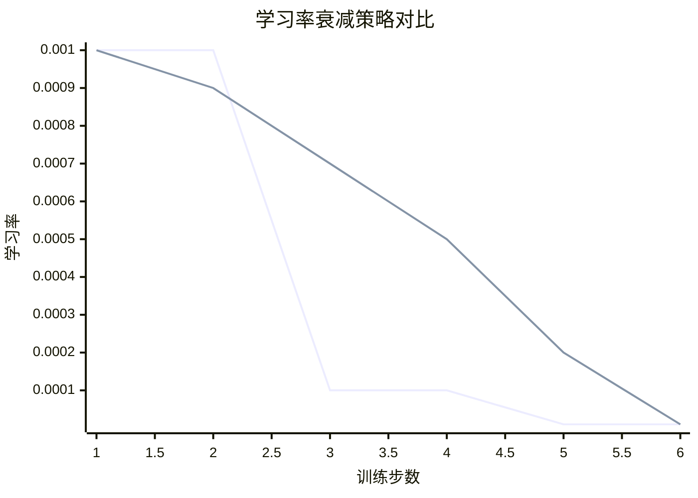
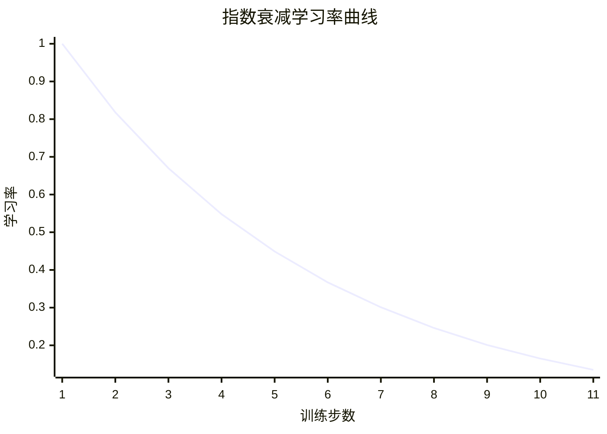
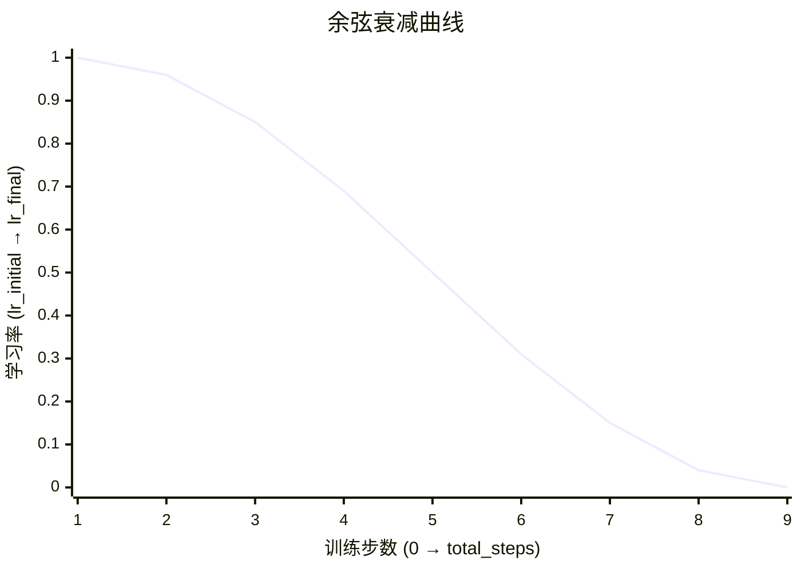
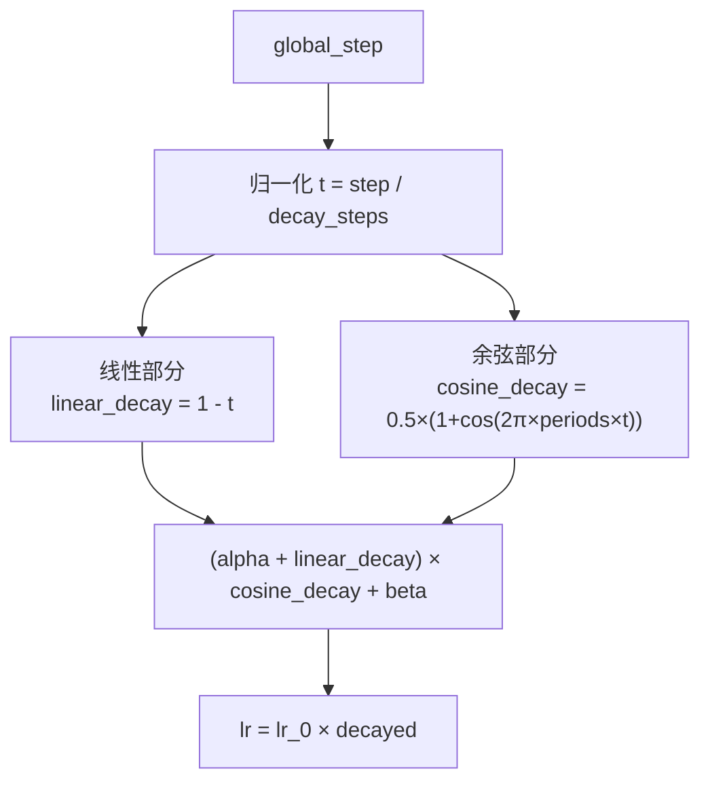
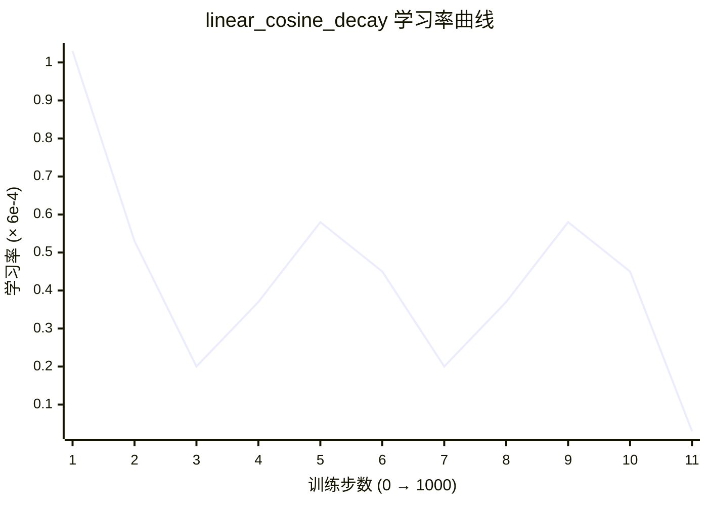
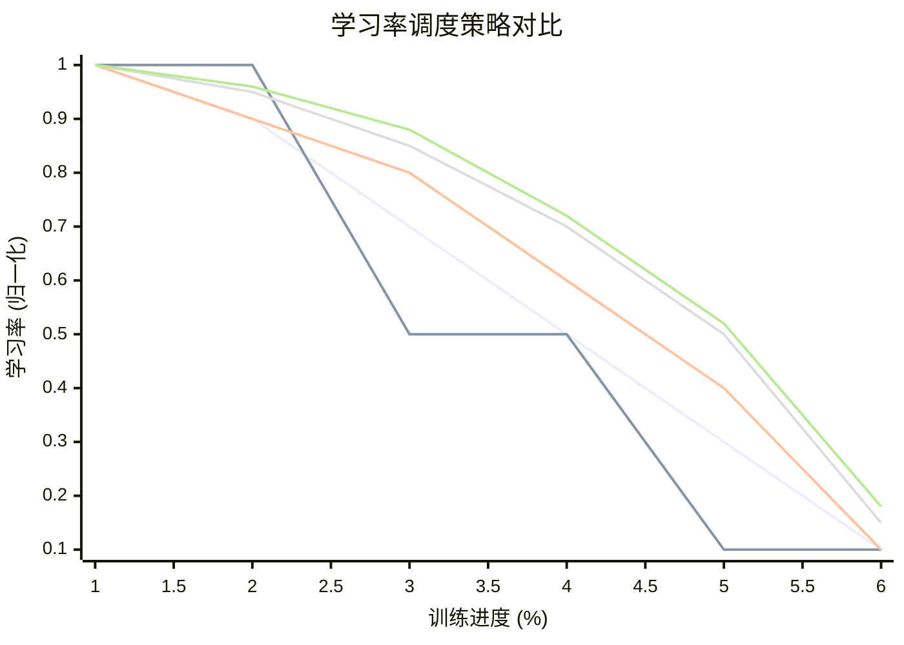
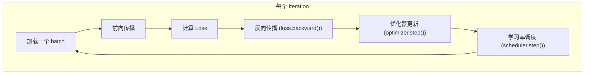

> **前置知识**：**为什么训练过程中学习率不能固定不变？如何动态调整学习率以促进模型更好收敛？**

## 1. 为什么需要动态调整学习率？

如果从头到尾使用**固定学习率**：

| 学习率    | 训练初期        | 训练后期              |
| ------ | ----------- | ----------------- |
| **太大** | 收敛快 ✅       | 在最优点附近震荡，无法精细收敛 ❌ |
| **太小** | 收敛极慢，浪费算力 ❌ | 稳定精细收敛 ✅          |

**理想策略**：训练初期用大学习率快速接近最优解，训练后期用小学习率精细微调。这就是**学习率调度**的核心思想。

> **术语解释**：**学习率调度（Learning Rate Scheduling）** 是在训练过程中动态调整学习率的策略。学习率调度器在训练循环的每一步或每一个 epoch 后更新学习率。

## 2. 常见学习率调度策略

### 2.1 阶梯衰减（Step Decay）

每隔固定步数，学习率乘以一个衰减因子（如 0.1）。
```text
第 0 步：lr = 1e-3
第 10000 步：lr = 1e-4（乘以 0.1）
第 20000 步：lr = 1e-5（再乘以 0.1）
```


> 上图蓝色线（第一条）为阶梯衰减，绿色线（第二条）为余弦衰减。阶梯衰减在固定步数时学习率骤降，余弦衰减平滑下降。

**阶梯衰减的问题是学习率突变，可能导致损失值突然震荡。**

### 2.2 指数衰减（Exponential Decay）

**学习率每步按指数方式平滑下降**：
$\text{lr}(step) = \text{lr}_0 \times \text{decay\_rate}^{\; step / \text{decay\_steps}}$

**参数说明：**

| 参数          | 含义                      |
| ----------- | ----------------------- |
| lr0​        | 初始学习率                   |
| decay_rate  | 衰减率（通常 < 1，如 0.95、0.99） |
| decay_steps | 衰减步数（每多少步衰减一次）          |
| step        | 当前训练步数                  |

**指数衰减曲线图：**


### 2.3 余弦衰减（Cosine Decay）

学习率按余弦曲线从初始值平滑下降到最终值：

$\text{lr}(step) = \text{lr}_{final} + 0.5 \times (\text{lr}_{initial} - \text{lr}_{final}) \times \left(1 + \cos\left(\frac{\pi \times step}{\text{total\_steps}}\right)\right)$
| 参数                    | 含义                        |
| --------------------- | ------------------------- |
| $\text{lr}_{initial}$ | 初始学习率                     |
| $\text{lr}_{final}$   | 最终学习率（训练结束时的学习率）          |
| total_steps           | 总训练步数（一个完整的余弦周期）          |
| step                  | 当前训练步数（从 0 到 total_steps） |



余弦衰减平滑、无突变，被广泛应用于现代深度学习训练中。

## 3. Linear Cosine Decay：**线性衰减**和**余弦衰减**混合调度策略
`linear_cosine_decay` 结合了**线性衰减**和**余弦衰减**，学习率曲线比纯余弦衰减更平滑。
### 3.1 公式拆解

```text
linear_cosine_decay(lr_0, global_step, decay_steps, num_periods, alpha, beta)
```

拆解成几个部分来看：

```python
# 伪代码
def linear_cosine_decay(lr_0, global_step, decay_steps, num_periods, alpha, beta):
    # 1. 归一化步数
    t = min(global_step, decay_steps) / decay_steps
    
    # 2. 线性衰减因子：从 1 到 0 线性下降
    linear_decay = (decay_steps - global_step) / decay_steps
    
    # 3. 余弦衰减因子：cos(2π × periods × t)
    cosine_decay = 0.5 × (1 + cos(2π × num_periods × t))
    
    # 4. 组合：线性部分 + 余弦部分
    decayed = (alpha + linear_decay) × cosine_decay + beta
    
    return lr_0 × decayed
```

### 3.2 各部分含义

| 参数/变量 | 含义 |
|-----------|------|
| `lr_0` | 初始学习率（如 `6e-4`） |
| `global_step` | 当前训练步数 |
| `decay_steps` | 总衰减步数（超过后学习率保持 `lr_0 × beta`） |
| `num_periods` | 余弦波的周期数（如 15） |
| `alpha` | 线性衰减的起始偏移量 |
| `beta` | 最终学习率因子（`lr_final = lr_0 × beta`） |



### 3.3 用具体数字走一遍

假设参数：
- `lr_0 = 6e-4`
- `decay_steps = 1000`
- `num_periods = 2`
- `alpha = 0.01`
- `beta = 0.02`

**第 0 步（t = 0）**：

```text
linear_decay = 1
cosine_decay = 0.5 × (1 + cos(0)) = 0.5 × 2 = 1
decayed = (0.01 + 1) × 1 + 0.02 = 1.03
lr = 6e-4 × 1.03 ≈ 6.18e-4
```

**第 250 步（t = 0.25）**：

```text
linear_decay = 1 - 0.25 = 0.75
cos(2π × 2 × 0.25) = cos(π) = -1
cosine_decay = 0.5 × (1 + (-1)) = 0
decayed = (0.01 + 0.75) × 0 + 0.02 = 0.02
lr = 6e-4 × 0.02 = 1.2e-5
```

**第 500 步（t = 0.5）**：

```text
linear_decay = 1 - 0.5 = 0.5
cos(2π × 2 × 0.5) = cos(2π) = 1
cosine_decay = 0.5 × (1 + 1) = 1
decayed = (0.01 + 0.5) × 1 + 0.02 = 0.53
lr = 6e-4 × 0.53 = 3.18e-4
```

**第 1000 步（t = 1）**：

```text
linear_decay = 0
cos(2π × 2 × 1) = cos(4π) = 1
cosine_decay = 0.5 × (1 + 1) = 1
decayed = (0.01 + 0) × 1 + 0.02 = 0.03
lr = 6e-4 × 0.03 = 1.8e-5
```

### 3.4 学习率曲线形态



> 注意曲线波动：在整体下降趋势上叠加了余弦波动，这是 `num_periods > 1` 的效果。如果使用 `num_periods=15`（更多周期），学习率会经历多次小的起伏，帮助模型跳出局部最优。

## 4. 超参数调优指南

| 超参数           | 典型值               | 调优方向                    |
| ------------- | ----------------- | ----------------------- |
| `lr_0`        | `1e-4` ~ `6e-4`   | 越大收敛越快，但过大可能震荡          |
| `decay_steps` | `20000000`        | 通常设为总训练步数的 80%~100%     |
| `num_periods` | `15`              | 周期数越多，曲线波动越频繁           |
| `alpha`       | `0.01`            | 控制线性衰减的起始位置             |
| `beta`        | `0.02` ~ `0.0333` | 控制最终学习率 = `lr_0 × beta` |

## 5. 不同调度策略对比



| 曲线颜色   | 调度策略          |
| ------ | ------------- |
| 第1条（蓝） | 固定学习率         |
| 第2条（橙） | 阶梯衰减          |
| 第3条（黄） | 指数衰减          |
| 第4条（绿） | 余弦衰减          |
| 第5条（紫） | Linear Cosine |

| 策略                | 优点          | 缺点        | 适用场景         |
| ----------------- | ----------- | --------- | ------------ |
| 固定                | 最简单         | 难以兼顾初期和后期 | 小规模实验        |
| 阶梯                | 实现简单        | 突变可能震荡    | 传统 CNN 训练    |
| 指数                | 平滑          | 后期下降太快    | 需要快速收敛的任务    |
| 余弦                | 平滑、效果好      | 需要调参      | 现代深度学习（广泛使用） |
| **Linear Cosine** | **最平滑、无突变** | **计算略复杂** |              |

## 6. 学习率调度在训练循环中的位置



> **关键理解**：调度器在**每次参数更新后**更新学习率，下一轮迭代使用新的学习率。

## 7. 一句话总结

> **学习率调度通过在训练过程中动态调整学习率，让模型初期快速收敛、后期精细微调。`linear_cosine_decay` 将线性衰减与余弦衰减相结合，产生一条平滑、无突变的学习率曲线，帮助模型稳定收敛到更优的解。**