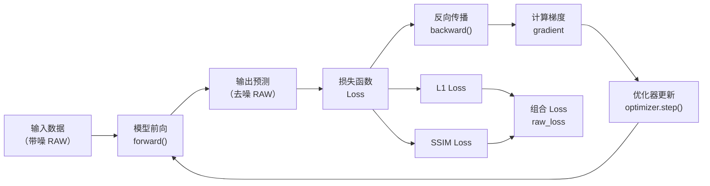
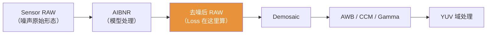
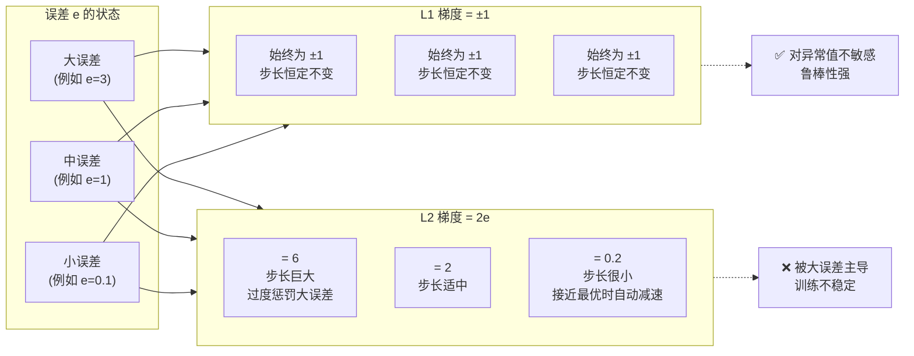
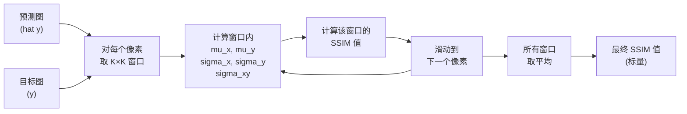
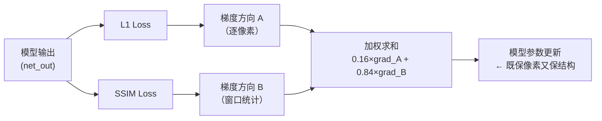

## 1 损失函数在训练流程中的位置

损失函数（Loss Function）是整个训练流程的“方向盘”。它不决定模型能学到什么的上限，但它决定了模型朝哪个方向更新。

训练全景图如下：



**关键区分：**

| 概念 | 定义 | 作用 | 是否可微 |
|------|------|------|----------|
| **Loss（损失函数）** | 训练时优化的目标，衡量预测和目标之间的差距 | 生成梯度，驱动模型更新 | 必须可微 |
| **Metric（评价指标）** | 训练后评估模型质量的标准（如 PSNR、SSIM） | 衡量最终效果，与人眼感知对齐 | 不一定可微 |

**Loss 本质上是一个可微的数学函数**，输入是预测值 $\hat{y}$ 和目标值 $y$，输出是一个标量，表征两者的“距离”。训练时，优化器通过最小化这个标量，让 $\hat{y}$ 逐渐逼近 $y$。

去噪任务中，Loss 决定模型对“什么是好的去噪结果”的定义。如果 Loss 只看像素差异，模型倾向于输出平滑图像；如果 Loss 也看结构相似性，模型会保留更多边缘和纹理。

## 2 RAW 域 Loss：为什么在 RAW 域算

AIBNR 模型处理的是 Bayer RAW 数据，输出也是 Bayer RAW。Loss 直接在 RAW 域计算，原因有三：

### 2.1 噪声未被放大

RAW 域是 ISP 流水线的起点，数据最接近 Sensor 原始输出。噪声还没有经过 Demosaic（去马赛克）、AWB（白平衡）、CCM（色彩校正）、Gamma 等模块的处理，没有被非线性变换放大或扭曲。



如果在 RGB 或 YUV 域算 Loss，噪声已经被 ISP 的后续模块“加工”过，模型无法直接看到原始噪声的统计特性。

### 2.2 输入输出同域

模型的输入是 Bayer RAW，输出也是 Bayer RAW。Loss 在同一个数据域计算，避免了跨域转换带来的额外误差。RGB 域的 Loss 需要先做 Demosaic（去马赛克），会引入插值误差；YUV 域的 Loss 需要经过色彩空间转换，会引入变换误差。

### 2.3 与模型目标一致

模型的目标就是“在 RAW 域去除噪声”，Loss 在 RAW 域衡量去噪效果，目标与 Loss 在同一个域上，没有偏移。

## 3 L1 Loss —— 像素级的绝对误差

### 3.1 定义

L1 Loss（Mean Absolute Error, MAE）衡量预测值 $\hat{y}$ 与目标值 $y$ 之间绝对误差的平均值：

$$
L1 = \frac{1}{N} \sum_{i=1}^{N} \left| \hat{y}_i - y_i \right|
$$

其中 $N$ 是像素总数。对于去噪任务，$\hat{y}$ 是模型输出去噪后的 RAW，$y$ 是干净目标（Ground Truth）。

代码中的计算方式（PyTorch）：

```python
import torch.nn as nn
l1_loss_fn = nn.L1Loss()
loss_l1 = l1_loss_fn(net_out, target_mix_noise)
```

`nn.L1Loss()` 的默认行为是计算所有像素的绝对误差的平均值，即返回一个标量。

### 3.2 L1 vs L2 —— 为什么选 L1？

L2 Loss（Mean Squared Error, MSE）定义为：

$$
L2 = \frac{1}{N} \sum_{i=1}^{N} \left( \hat{y}_i - y_i \right)^2
$$

两者的核心差异在于**对误差的惩罚方式**：

| 维度 | L1（MAE） | L2（MSE） |
|------|-----------|-----------|
| **公式** | $\frac{1}{N}\sum \|e\|$ | $\frac{1}{N}\sum e^2$ |
| **对大误差的惩罚** | 线性（$\propto \|e\|$） | 平方（$\propto e^2$） |
| **梯度大小** | 恒定（$\pm 1$） | 与误差成正比（$2e$） |
| **对异常值的敏感度** | 稳健，大误差不主导 Loss | 敏感，大误差主导 Loss |
| **优化行为** | 收敛慢但稳定 | 收敛快但可能震荡 |

**梯度差异是 L1 和 L2 最本质的区别。**



L1 的梯度恒定为 $\pm 1$（当 $e \neq 0$），意味着每个像素不管误差大小，对梯度的贡献权重相同。L2 的梯度为 $2e$，误差越大的像素对梯度的影响越大，导致模型优先“修复”大误差区域。

#### 为什么说梯度差异是本质？

看 L1 和 L2 对误差 ee 的梯度：

| 损失函数         | 公式 L(e)L(e) | 梯度 ∂L∂e∂e∂L​ | 误差 ee 很大时，梯度表现       |
| ------------ | ----------- | ------------ | -------------------- |
| **L2 (MSE)** | e2e2        | 2e2e         | **超大**（误差越大，梯度线性增长）  |
| **L1 (MAE)** | ∥e∥∥e∥      | ±1±1 （常数）    | **恒定**（无论误差多大，梯度都一样） |
|              |             |              |                      |

**这意味着什么？**  
当模型预测错误很严重时（ee 很大）：
- **L2 损失**：梯度巨大 → 更新步长巨大 → 模型会“猛拐”去修正这个离群点，这会导致训练不稳定，甚至为了迁就几个噪声点而牺牲整体平滑度。
- **L1 损失**：梯度永远为 1 或 -1 → 更新步长适中 → 模型不会因为某个点误差大就惊慌失措，它稳健地朝正确方向走，对噪声和异常值更鲁棒。

**L1 和 L2 最根本的不同，在于它们对误差施加的“加速度”不同（L1 恒定，L2 随误差增大而增大），这直接决定了模型训练时的鲁棒性和收敛行为。**

### 3.3 为什么去噪任务选 L1？

**去噪任务中残留的噪声像素本身就是异常值**。如果使用 L2 Loss，这些残留噪声（大误差）会主导梯度方向，模型会过度关注少数几个噪声点的像素值，而忽略整体纹理的保持。L1 Loss 对每个像素一视同仁，梯度更稳定。

### 3.4 但 L1 不是完美的

L1 的梯度恒为常数，意味着当预测值已经接近目标值（$e \to 0$）时，梯度仍然保持 $\pm 1$，不会像 L2 那样自动减小步长。这会导致**收敛到最优值附近时出现微小震荡**，难以达到极高的精度。

这也是为什么 L1 通常不单独使用，而是与其他 Loss（如 SSIM）组合使用，弥补各自的不足。

## 4 SSIM Loss —— 结构级的相似性损失

### 4.1 为什么需要 SSIM？

L1/L2 是像素级 Loss，但人眼评价图像质量时，更关注的是**亮度、对比度、纹理结构**等高层特征。两张像素值完全相同的图像一定相似，但像素值略有不同的两张图像，人眼可能觉得非常相似或完全不同——取决于差异是否影响结构感知。

SSIM 的设计目标是：**让 Loss 的数值变化与人眼的主观感受对齐**。

### 4.2 SSIM 的三个分量

SSIM（Structural Similarity Index）基于三个分量的乘积：

$$
SSIM(x, y) = l(x, y)^\alpha \cdot c(x, y)^\beta \cdot s(x, y)^\gamma
$$

通常 $\alpha = \beta = \gamma = 1$，简化为：

$$
SSIM(x, y) = l(x, y) \cdot c(x, y) \cdot s(x, y)
$$

**亮度** $l$：比较两个窗口的均值 $\mu_x$、$\mu_y$

$$
l(x, y) = \frac{2\mu_x\mu_y + C_1}{\mu_x^2 + \mu_y^2 + C_1}
$$

**对比度** $c$：比较两个窗口的标准差 $\sigma_x$、$\sigma_y$

$$
c(x, y) = \frac{2\sigma_x\sigma_y + C_2}{\sigma_x^2 + \sigma_y^2 + C_2}
$$

**结构** $s$：比较两个窗口的协方差 $\sigma_{xy}$（反映纹理相似性）

$$
s(x, y) = \frac{\sigma_{xy} + C_3}{\sigma_x\sigma_y + C_3}
$$

其中 $C_1, C_2, C_3$ 是微小常数，防止分母为零导致数值不稳定。

### 4.3 窗口计算——SSIM 怎么“算”的？

SSIM 不是在整张图上算一次，而是在每个像素周围取一个局部窗口（通常是 $7 \times 7$ 或 $11 \times 11$ 的高斯加权窗口），在每个窗口内计算上述三个分量，窗口滑动覆盖整张图，最后对所有窗口取平均。

为什么需要窗口？因为“结构”是一个局部概念——边缘、纹理、对比度都来自像素间的局部关系，而不是全局统计。

计算过程：



### 4.4 为什么用 `1 - SSIM` 作为 Loss？

SSIM 的取值范围是 $[-1, 1]$，两张完全相同的图像 SSIM = 1。Loss 需要“越小越好”，所以：

$$
SSIM\_Loss = 1 - SSIM
$$

当两张图完全相同时，$SSIM\_Loss = 0$；当两张图完全不同时，$SSIM\_Loss \to 2$。

注意：代码中的 `raw_ssim_loss = 1 - self.ssim_loss(target_mix_noise, net_out)` 计算的就是这个值。

### 4.5 优化时 SSIM Loss 在干什么？

优化 SSIM Loss 时，模型不是在直接优化像素值，而是在优化**每个局部窗口的统计特征**：
- 窗口均值 $\mu$ 趋近（亮度一致）
- 窗口标准差 $\sigma$ 趋近（对比度一致）
- 窗口协方差 $\sigma_{xy}$ 趋近（纹理结构一致）

这意味着 SSIM Loss 对边缘、纹理、对比度的保持有天然优势，但对像素级精度的约束较弱——它不关心每个像素的具体值，只关心局部统计特征。

## 5 组合 Loss —— L1 与 SSIM 的加权互补

### 5.1 为什么不是只用 L1 或只用 SSIM？

| 只用 L1 | 只用 SSIM |
|---------|-----------|
| 像素级精确，但对结构不敏感 | 结构保真，但对像素值不敏感 |
| 倾向于平滑，边缘变模糊 | 能保留边缘，但像素值可能偏移 |
| 收敛稳定，梯度方向明确 | 非凸，优化路径曲折 |

两者互补：L1 管“每个像素对不对”，SSIM 管“局部结构像不像”。

### 5.2 什么是 `1 - SSIM`？它为什么重要？

SSIM 的输出范围是 $[-1, 1]$，作为 Loss 要“越小越好”。直接取负值会导致梯度方向反转，所以用 $1 - SSIM$ 将范围映射到 $[0, 2]$。

$1 - SSIM$ 可以看作一种**结构距离**：
- $1 - SSIM = 0$：两图在亮度、对比度、结构上完全一致
- $1 - SSIM = 1$：两图完全不相似（SSIM = 0）
- $1 - SSIM = 2$：两图完全负相关（SSIM = -1）

代码中的组合：

```python
l1_loss_val = l1_loss_fn(net_out, target_mix_noise)
ssim_val = ssim_loss_fn(target_mix_noise, net_out)
ssim_loss_val = 1.0 - ssim_val

raw_loss = raw_l1_weight * l1_loss_val + raw_ssim_weight * ssim_loss_val
```

### 5.3 为什么不是 `L1 + SSIM`？

`L1 + SSIM` 的问题是两者量级不同。SSIM Loss 取值范围 $[0, 2]$，L1 Loss 的取值范围随数据动态变化（例如像素值在 $[0, 1]$ 时，L1 也在 $[0, 1]$ 附近）。直接相加会导致其中一项主导 Loss。

例如，如果 L1 的典型值是 0.05，SSIM Loss 的典型值是 0.2，那么 `L1 + SSIM` 中 SSIM 占主导，L1 几乎不起作用。权重正是用来平衡两者的量级，让它们都能有效贡献梯度。

### 5.4 权重 `0.16` 和 `0.84` 的来源

这组权重不是公式推导出来的，而是经验调参的结果。

```python
raw_l1_weight = 0.16
raw_ssim_weight = 0.84
```

| 权重 | 值 | 含义 |
|------|-----|------|
| `raw_l1_weight` | 0.16 | L1 占 16%，以像素级精度为主 |
| `raw_ssim_weight` | 0.84 | SSIM 占 84%，以结构保真为主 |

这组配比体现了一个核心设计思路：**以结构保真为主（SSIM 主导），以像素精度为辅（L1 兜底）**。

如果 L1 权重过高，图像会更平滑但边缘模糊；如果 SSIM 权重过高，图像会更清晰但像素值可能出现偏移。0.16/0.84 是当前实验中找到的平衡点。

### 5.5 L1 和 SSIM 如何配合？



L1 提供**逐像素的稳定约束**，确保每个像素的值不偏离目标太远；SSIM 提供**局部结构的保真约束**，确保边缘、纹理、对比度不被 L1 的平滑效应抹掉。两者梯度在加权平均后，共同决定模型的更新方向。

## 6 一句话总结

**L1 Loss 管“每个像素对不对”，SSIM Loss 管“局部结构像不像”，两者按 0.16/0.84 加权组合，让模型在保持像素精度的同时保留边缘和纹理，最终输出既干净又清晰。**