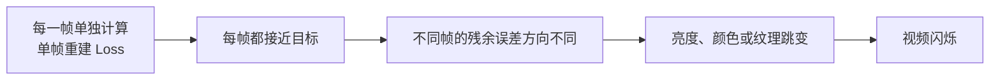
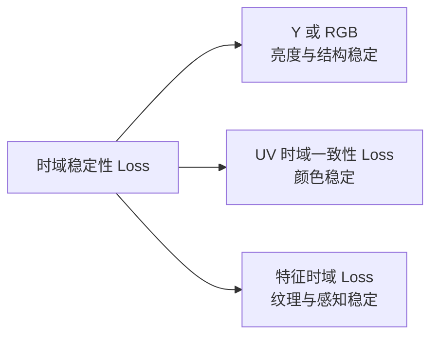
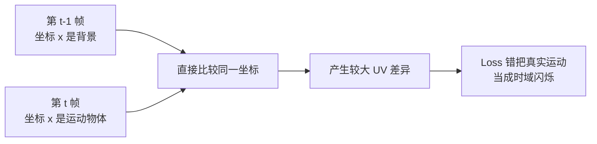
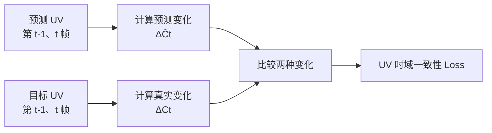
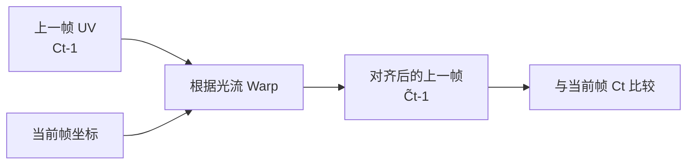
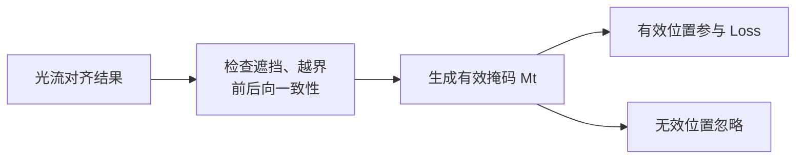
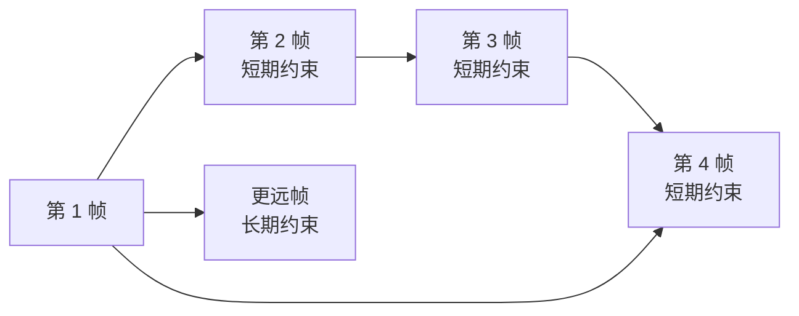
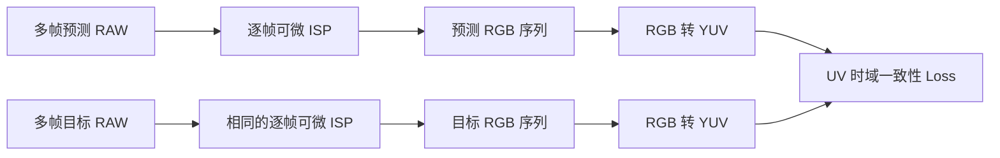

## 1. 为什么单帧去噪正确，视频仍然会闪烁

视频去噪模型不仅要保证每一帧接近目标，还要保证连续帧之间的变化符合真实运动。

假设模型逐帧输出：
```text
第 t-1 帧：颜色稍微偏红
第 t 帧：颜色稍微偏绿
第 t+1 帧：颜色又稍微偏红
```

每一帧与目标之间的误差可能都不大，但连续播放时会出现明显的颜色闪烁。

**Temporal Flicker，时域闪烁**：同一物体或同一区域在连续帧中的亮度、颜色或纹理发生不合理跳变。

逐帧独立处理容易产生时域不一致；RAW 视频恢复还同时要求单帧恢复准确和连续帧稳定。



因此，视频训练通常需要两类监督：

```text
空间监督：
保证当前帧本身恢复正确

时域监督：
保证连续帧之间的变化正确
```

总 Loss 可以概括为：

$$
\mathcal{L}_{total}=\mathcal{L}_{spatial}+\lambda_{temporal}\mathcal{L}_{temporal}
$$

## 2. 两个 Loss 的关系

为了避免术语混乱，本文采用下面的关系。

```text
时域稳定性 Loss
├── 亮度时域约束
├── UV 时域一致性 Loss
├── RGB 时域约束
├── 特征时域约束
├── 短期时域约束
└── 长期时域约束
```

### 2.1 时域稳定性 Loss

**Temporal Stability Loss，时域稳定性 Loss**：约束模型输出在时间维度上的变化，使输出变化与真实视频变化一致。

它是一个总类，可以作用在：
```text
RAW
RGB
YUV
深层特征
纹理或感知特征
```

### 2.2 UV 时域一致性 Loss

**UV Temporal Consistency Loss，UV 时域一致性 Loss**：只对 YUV 中的 U、V 色度通道施加时域约束，重点抑制连续帧中的颜色闪烁。

它属于时域稳定性 Loss 的一个子类：



## 3. 为什么不能直接要求相邻帧完全相同

假设预测 UV 色度为：

$$
\hat{C}_t=\begin{bmatrix}\hat{U}_t\\hat{V}_t\end{bmatrix}
$$

最直接的时域 Loss 是：

$$
\mathcal{L}_{zero}=\frac{1}{T-1}\sum_{t=2}^{T}\operatorname{mean}\left(\left|\hat{C}_t-\hat{C}_{t-1}\right|\right)
$$

它会要求相邻帧的 U、V 尽量相同。

但真实视频中存在：

```text
物体运动
相机运动
遮挡与显露
真实光照变化
真实颜色变化
```

例如，一个红色物体从左向右移动：

```text
第 t-1 帧：位置 x 是背景
第 t 帧：位置 x 是红色物体
```

直接比较相同坐标时，这两个像素本来就不应该相同。



因此，时域稳定并不等于：

```text
相邻帧完全不变化
```

正确目标应该是：

```text
真实场景发生变化时，预测也应正确变化
真实场景保持稳定时，预测不能随机跳变
```


## 4. UV 时域一致性 Loss 怎么计算

先把预测 RGB 和目标 RGB 转换为 YUV，并只取 U、V 通道：
$$
\hat{C}_t=\left[\hat{U}_t,\hat{V}_t\right]
$$

$$
C_t=\left[U_t,V_t\right]
$$

根据数据是否已经对齐，可以使用三个层级的 UV 时域约束。

### 4.1 已对齐数据：匹配相邻帧的 UV 变化量

如果训练数据是静态场景、合成对齐序列，或者相邻帧已经完成空间对齐，可以比较预测和目标的时域变化量。

目标 UV 变化为：

$$
\Delta C_t=C_t-C_{t-1}
$$

预测 UV 变化为：

$$
\Delta\hat{C}_t=\hat{C}_t-\hat{C}_{t-1}
$$

UV 时域一致性 Loss 为：

$$
\mathcal{L}_{UV,\Delta}=\frac{1}{T-1}\sum_{t=2}^{T}\operatorname{mean}\left(\left|\Delta\hat{C}_t-\Delta C_t\right|\right)
$$

它不是要求相邻帧完全相同，而是要求：

```text
预测 UV 的帧间变化
≈
目标 UV 的帧间变化
```



例如，某个位置的目标 U 为：

```text
目标：0.10 → 0.12
真实变化：+0.02
```

预测 U 为：

```text
预测：0.11 → 0.18
预测变化：+0.07
```

该位置的 U 时域误差为：

$$
\left|0.07-0.02\right|=0.05
$$

这种形式能保留真实的颜色变化，同时惩罚额外的颜色跳变。

### 4.2 动态场景：先运动对齐再计算

**Optical Flow，光流**：描述像素或物体从一帧移动到另一帧的二维位移场。

**Warp，重映射**：根据光流，从上一帧采样对应位置，将上一帧对齐到当前帧坐标。

假设 $F_{t\rightarrow t-1}$ 是从当前帧坐标指向上一帧坐标的反向光流，则：

$$
\widetilde{C}_{t-1}=\mathcal{W}\left(C_{t-1},F_{t\rightarrow t-1}\right)
$$

其中 $\mathcal{W}$ 表示 Warp 操作。




最简单的对齐 UV Loss 为：

$$
\mathcal{L}_{UV,warp}=\frac{\sum_{t=2}^{T}\sum_pM_t(p)\rho\left(\hat{C}_t(p)-\mathcal{W}\left(\hat{C}_{t-1},F_{t\rightarrow t-1}\right)(p)\right)}{\sum_{t=2}^{T}\sum_pM_t(p)+\varepsilon}
$$

其中：
- $p$：像素位置；
- $M_t$：有效区域掩码；
- $\rho$：误差惩罚函数；
- $\varepsilon$：防止分母为 0 的小常数。

光流对齐和可见区域掩码是常见的时域约束方式；短期时域 Loss 通常比较当前输出与 Warp 后的上一帧输出。

### 4.3 更稳妥的形式：匹配运动补偿后的真实变化

简单的 Warp Loss 仍然倾向于要求运动对齐后的输出完全相同。

但真实视频中可能存在：

```text
曝光变化
局部光照变化
反射变化
真实颜色变化
```

因此，更稳妥的方式是比较预测和目标的**运动补偿时域残差**。

目标残差为：

$$
R_t=C_t-\mathcal{W}\left(C_{t-1},F_{t\rightarrow t-1}\right)
$$

预测残差为：

$$
\hat{R}_t=\hat{C}_t-\mathcal{W}\left(\hat{C}_{t-1},F_{t\rightarrow t-1}\right)
$$

对应 Loss 为：

$$
\mathcal{L}_{UV,res}=\frac{\sum_{t=2}^{T}\sum_pM_t(p)\rho\left(\hat{R}_t(p)-R_t(p)\right)}{\sum_{t=2}^{T}\sum_pM_t(p)+\varepsilon}
$$

它约束的是：

```text
预测视频经过运动补偿后的变化
≈
目标视频经过运动补偿后的变化
```

这种形式不会把所有真实变化都压成 0，因此比单纯要求相邻输出一致更合理。


## 5. 为什么需要有效区域掩码

相邻帧并不是所有像素都存在可靠对应关系。

### 5.1 遮挡

**Occlusion，遮挡**：某个区域在上一帧可见，但在当前帧被其他物体挡住，或者反过来新出现。

这些位置无法从上一帧找到正确对应像素。

### 5.2 图像边界

Warp 后，一部分像素可能移动到图像范围之外。

### 5.3 光流不可靠区域

噪声、低纹理、快速运动和亮度变化都会降低光流精度。RAW 视频恢复研究也指出，噪声和强度变化会影响光流估计，错误的流约束可能导致误差累积或过度平滑。

因此使用掩码 $M_t$：
```text
Mt = 1：
该像素存在可靠对应关系，参与 Loss

Mt = 0：
该像素被遮挡、越界或对齐不可靠，不参与 Loss
```



不使用掩码时，模型可能被迫拟合不存在的像素对应关系。

## 6. 时域稳定性 Loss 怎么构成

UV 时域一致性主要解决颜色闪烁，但完整时域稳定还包括亮度、结构和纹理。

一种常见的时域稳定性 Loss 可以写成：

$$
\mathcal{L}_{temporal}=\lambda_{UV}\mathcal{L}_{UV}+\lambda_Y\mathcal{L}_{Y}+\lambda_{feat}\mathcal{L}_{feat}
$$

其中：

```text
LUV：
约束颜色变化

LY：
约束亮度、边缘和结构变化

Lfeat：
约束高层纹理和感知特征变化
```

### 6.1 短期时域稳定性

**Short-term Temporal Loss，短期时域 Loss**：约束相邻帧或相隔很少帧的输出。

$$
\mathcal{L}_{short}=\frac{1}{T-1}\sum_{t=2}^{T}D\left(\hat{X}_t,\hat{X}_{t-1}\right)
$$

其中 $D$ 通常不是直接帧差，而是包含：

```text
运动对齐
有效掩码
真实时域残差匹配
```

短期 Loss 主要抑制：

```text
相邻帧抖动
快速颜色闪烁
局部纹理跳变
```

### 6.2 长期时域稳定性

只约束相邻帧，可能出现小误差逐帧累积。

例如：

```text
第 1 帧：U = 0.10
第 2 帧：U = 0.11
第 3 帧：U = 0.12
第 10 帧：U = 0.19
```

每一对相邻帧只变化 $0.01$，但长时间后已经产生明显颜色漂移。

**Long-term Temporal Loss，长期时域 Loss**：约束间隔较远的帧，防止误差随时间累积。

$$
\mathcal{L}_{long}=\frac{1}{|\mathcal{K}|}\sum_{k\in\mathcal{K}}\frac{1}{T-k}\sum_{t=k+1}^{T}D\left(\hat{X}_t,\hat{X}_{t-k}\right)
$$

其中 $\mathcal{K}$ 是帧间隔集合，例如包含短间隔和长间隔。



短期和长期时域 Loss 共同使用，是经典的视频一致性训练方式。

### 6.3 为什么不能把时域 Loss 权重设得过强

一个完全模糊、几乎不变化的视频也可能具有很低的时域误差。

因此，时域稳定必须和单帧重建质量共同约束：

$$
\mathcal{L}_{total}=\lambda_{rec}\mathcal{L}_{rec}+\lambda_{UV}\mathcal{L}_{UV}+\lambda_{short}\mathcal{L}_{short}+\lambda_{long}\mathcal{L}_{long}
$$

时域约束不足会保留闪烁，时域约束过强则可能使输出趋向过度平滑。


## 7. RAW 域训练中怎么使用

### 7.1 Bayer RAW 不能直接计算标准 UV

Bayer RAW 的同一个位置只记录一种颜色：

```text
R G R G
G B G B
R G R G
G B G B
```

而 U、V 需要同一位置上的完整 RGB。

因此，标准 UV 时域 Loss 的流程应为：



对每一帧 $t$，预测 RAW 和目标 RAW 必须使用相同的该帧 ISP 参数：

```text
相同黑电平
相同归一化
相同白平衡
相同 CCM
相同 Gamma 或 OETF
相同色彩空间变换
```

否则 UV Loss 会混入 ISP 参数差异。

### 7.2 跨帧 ISP 参数需要特别处理

视频中自动曝光、自动白平衡或色调映射可能随时间变化。

如果每帧使用不同的 ISP 参数，最终 UV 变化可能来自：

```text
RAW 去噪模型
+
自动曝光变化
+
自动白平衡变化
+
Tone Mapping 变化
```

为了让 Loss 主要衡量去噪模型的稳定性，一种常见做法是：

```text
训练片段内固定关键 ISP 参数

或者

使用目标视频的时域变化作为参考
```

也就是优先使用：

$$
\mathcal{L}_{UV,res}=\rho\left(\hat{R}_t-R_t\right)
$$

而不是强制：

$$
\hat{R}_t=0
$$

### 7.3 光流从哪里计算

更稳定的做法是从目标 RGB、干净参考帧或可靠的低噪声代理上计算光流。

不宜直接依赖强噪声 RAW 或闪烁严重的预测结果，因为光流误差会直接污染时域监督。

如果没有可靠光流，可以采用：

```text
已知几何变换生成合成视频
使用变换的真实位移做对齐

或

比较预测与目标的未对齐时域关系
```

RAW 视频恢复研究提出过使用已知合成变换构造时域监督，从而避免不准确光流造成的误差累积，并同时使用短期和长期一致性约束。

## 8. 工程实现

下面代码假设：

```text
pred_rgb_seq：[B,T,3,H,W]
target_rgb_seq：[B,T,3,H,W]

backward_flow：[B,T-1,2,H,W]
从第 t 帧坐标指向第 t-1 帧坐标

valid_mask：[B,T-1,1,H,W]
```

### 8.1 RGB 转 UV

```python
import torch
import torch.nn.functional as F

def rgb_to_uv(rgb):
    if rgb.ndim != 4 or rgb.shape[1] != 3:
        raise ValueError("rgb must have shape [B, 3, H, W]")

    matrix = rgb.new_tensor([
        [-0.168736, -0.331264, 0.500000],
        [0.500000, -0.418688, -0.081312],
    ])

    return torch.einsum("bchw,oc->bohw", rgb, matrix)
```

### 8.2 不使用光流的 UV 变化量 Loss

适用于静态场景或已经对齐的数据：

```python
def uv_delta_loss(pred_rgb_seq, target_rgb_seq):
    if pred_rgb_seq.shape != target_rgb_seq.shape:
        raise ValueError("prediction and target shapes must match")

    b, t, c, h, w = pred_rgb_seq.shape

    pred_uv = rgb_to_uv(pred_rgb_seq.reshape(b * t, c, h, w))
    target_uv = rgb_to_uv(target_rgb_seq.reshape(b * t, c, h, w))

    pred_uv = pred_uv.reshape(b, t, 2, h, w)
    target_uv = target_uv.reshape(b, t, 2, h, w)

    pred_delta = pred_uv[:, 1:] - pred_uv[:, :-1]
    target_delta = target_uv[:, 1:] - target_uv[:, :-1]

    return F.l1_loss(pred_delta, target_delta)
```

### 8.3 Warp 操作

下面实现假设光流单位为像素，并使用反向光流：

```python
def warp_previous_to_current(previous, backward_flow):
    if previous.ndim != 4 or backward_flow.ndim != 4:
        raise ValueError("inputs must be 4D tensors")

    b, c, h, w = previous.shape

    y, x = torch.meshgrid(
        torch.arange(h, device=previous.device, dtype=previous.dtype),
        torch.arange(w, device=previous.device, dtype=previous.dtype),
        indexing="ij",
    )

    x = x.unsqueeze(0).expand(b, -1, -1)
    y = y.unsqueeze(0).expand(b, -1, -1)

    sample_x = x + backward_flow[:, 0]
    sample_y = y + backward_flow[:, 1]

    if w > 1:
        sample_x = 2.0 * sample_x / (w - 1) - 1.0
    else:
        sample_x = torch.zeros_like(sample_x)

    if h > 1:
        sample_y = 2.0 * sample_y / (h - 1) - 1.0
    else:
        sample_y = torch.zeros_like(sample_y)

    grid = torch.stack([sample_x, sample_y], dim=-1)

    return F.grid_sample(previous, grid, mode="bilinear", padding_mode="zeros", align_corners=True)
```

### 8.4 运动补偿 UV 时域残差 Loss

```python
def masked_charbonnier(error, mask, epsilon=1e-3):
    value = torch.sqrt(error * error + epsilon * epsilon)
    weighted = value * mask
    denominator = mask.sum() * error.shape[1] + 1e-6
    return weighted.sum() / denominator

def uv_motion_residual_loss(pred_rgb_seq, target_rgb_seq, backward_flow, valid_mask):
    if pred_rgb_seq.shape != target_rgb_seq.shape:
        raise ValueError("prediction and target shapes must match")

    b, t, c, h, w = pred_rgb_seq.shape

    pred_uv = rgb_to_uv(pred_rgb_seq.reshape(b * t, c, h, w)).reshape(b, t, 2, h, w)
    target_uv = rgb_to_uv(target_rgb_seq.reshape(b * t, c, h, w)).reshape(b, t, 2, h, w)

    total_loss = pred_rgb_seq.new_tensor(0.0)

    for index in range(1, t):
        flow = backward_flow[:, index - 1]
        mask = valid_mask[:, index - 1]

        warped_pred_previous = warp_previous_to_current(pred_uv[:, index - 1], flow)
        warped_target_previous = warp_previous_to_current(target_uv[:, index - 1], flow)

        pred_residual = pred_uv[:, index] - warped_pred_previous
        target_residual = target_uv[:, index] - warped_target_previous

        total_loss = total_loss + masked_charbonnier(pred_residual - target_residual, mask)

    return total_loss / max(t - 1, 1)
```

### 8.5 总训练 Loss

```python
pred_raw_seq = model(noisy_raw_seq)

loss_raw = F.l1_loss(pred_raw_seq, target_raw_seq)

pred_rgb_seq = differentiable_isp_sequence(pred_raw_seq, isp_metadata)
target_rgb_seq = differentiable_isp_sequence(target_raw_seq, isp_metadata)

loss_uv_delta = uv_delta_loss(pred_rgb_seq, target_rgb_seq)
loss_uv_motion = uv_motion_residual_loss(pred_rgb_seq, target_rgb_seq, backward_flow, valid_mask)

loss_total = (
    lambda_raw * loss_raw
    + lambda_uv_delta * loss_uv_delta
    + lambda_uv_motion * loss_uv_motion
)
```

实际工程中不一定同时启用两种 UV Loss：

```text
静态或已对齐训练数据：
优先使用 UV Delta Loss

存在真实运动：
优先使用运动补偿 UV Residual Loss

没有可靠光流：
使用已知合成变换或时域关系 Loss
```

## 9. 使用时必须检查的问题

### 9.1 不要把真实运动当成闪烁

动态场景不能只计算相同坐标的相邻帧差。

必须至少满足其中一种条件：

```text
数据本身已对齐
使用运动对齐
比较预测变化与目标变化
使用已知合成变换
```

### 9.2 UV Loss 不能代替单帧颜色 Loss

UV 时域 Loss 只约束颜色随时间如何变化，不保证每一帧的绝对颜色正确。

例如：

```text
所有帧都稳定偏绿
```

时域 UV Loss 可能很小，但颜色仍然错误。

因此还需要单帧 YUV、RGB 或 RAW 重建 Loss。

### 9.3 注意遮挡和越界区域

没有可靠对应关系的位置必须通过 Mask 排除，否则会制造错误梯度。

### 9.4 注意光流是否参与反向传播

如果光流网络只是提供对齐参考，通常可以停止其梯度：

```python
backward_flow = flow_estimator(target_rgb_previous, target_rgb_current).detach()
```

这样可以防止去噪 Loss 反向修改光流网络。

### 9.5 不要只观察平均 Loss

UV 时域 Loss 需要结合视频检查：

```text
静态区域是否仍有彩色闪烁
运动边缘是否出现拖影
纹理是否被过度平滑
长序列是否发生颜色漂移
遮挡区域是否出现残影
```

## 10. 一句话总结

**UV 时域一致性 Loss 是时域稳定性 Loss 中专门约束颜色变化的分支：静态或已对齐数据可匹配相邻帧的 UV 变化量，动态视频则应先进行运动对齐并比较预测与目标的时域残差，同时结合遮挡掩码、单帧重建 Loss 和长期约束，才能减少颜色闪烁而不压制真实运动。**